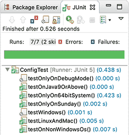

# **条件测试**


在运行测试的时候，有些时候，我们需要排出某些 @Test 方法，不要让它运行，这时，我们就可以给它标记一个 @Disabled：

```java
@Disabled
@Test
void testBug101() {
    // 这个测试不会运行
}
```

为什么我们不直接注释掉 @Test，而是要加一个 @Disabled？这是因为注释掉 @Test，JUnit 就不知道这是个测试方法，而加上 @Disabled，JUnit 仍然识别出这是个测试方法，只是暂时不运行。它会在测试结果中显示：

```
Tests run: 68, Failures: 2, Errors: 0, Skipped: 5
```

类似 @Disabled 这种注解就称为条件测试，JUnit 根据不同的条件注解，决定是否运行当前的 @Test 方法。

我们来看一个例子：

```java
public class Config {
    public String getConfigFile(String filename) {
        String os = System.getProperty("os.name").toLowerCase();
        if (os.contains("win")) {
            return "C:\\" + filename;
        }
        if (os.contains("mac") || os.contains("linux") || os.contains("unix")) {
            return "/usr/local/" + filename;
        }
        throw new UnsupportedOperationException();
    }
}
```

我们想要测试 getConfigFile() 这个方法，但是在 Windows 上跑，和在 Linux 上跑的代码路径不同，因此，针对两个系统的测试方法，其中一个只能在 Windows 上跑，另一个只能在 Mac/Linux 上跑：

```java
@Test
void testWindows() {
    assertEquals("C:\\test.ini", config.getConfigFile("test.ini"));
}

@Test
void testLinuxAndMac() {
    assertEquals("/usr/local/test.cfg", config.getConfigFile("test.cfg"));
}
```

因此，我们给上述两个测试方法分别加上条件如下：

```java
@Test
@EnabledOnOs(OS.WINDOWS)
void testWindows() {
    assertEquals("C:\\test.ini", config.getConfigFile("test.ini"));
}

@Test
@EnabledOnOs({OS.LINUX, OS.MAC})
void testLinuxAndMac() {
    assertEquals("/usr/local/test.cfg", config.getConfigFile("test.cfg"));
}
```

@EnableOnOs 就是一个条件测试判断。

我们来看一些常用的条件测试：

不在 Windows 平台执行的测试，可以加上 @DisabledOnOs(OS.WINDOWS)：

```java
@Test
@DisabledOnOs(OS.WINDOWS)
void testOnNonWindowsOs() {
    // TODO: this test is disabled on windows
}
```

只能在 Java 9 或更高版本执行的测试，可以加上 @DisabledOnJre(JRE.JAVA_8)：

```java
@Test
@DisabledOnJre(JRE.JAVA_8)
void testOnJava9OrAbove() {
    // TODO: this test is disabled on java 8
}
```

只能在 64 位操作系统上执行的测试，可以用 @EnabledIfSystemProperty 判断：

```java
@Test
@EnabledIfSystemProperty(named = "os.arch", matches = ".*64.*")
void testOnlyOn64bitSystem() {
    // TODO: this test is only run on 64 bit system
}
```


需要传入环境变量 DEBUG=true 才能执行的测试，可以用 @EnabledIfEnvironmentVariable：

```java
@Test
@EnabledIfEnvironmentVariable(named = "DEBUG", matches = "true")
void testOnlyOnDebugMode() {
    // TODO: this test is only run on DEBUG=true
}
```


当我们在 JUnit 中运行所有测试的时候，JUnit 会给出执行的结果。在 IDE 中，我们能很容易地看到没有执行的测试：



带有 ⊘ 标记的测试方法表示没有执行。


## 练习

下载练习： [条件测试](https://gitee.com/liaoxuefeng/learn-java/blob/master/practices/Java 教程 / 100. 单元测试. 1255945269146912/40. 条件测试. 1304073489874978/junit-conditional.zip?utm_source=blog_lxf) 。


## 小结

条件测试是根据某些注解在运行期让 JUnit 自动忽略某些测试。

