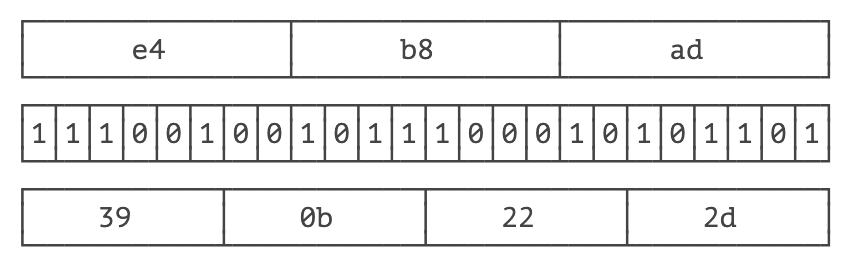

# **编码算法**


要学习编码算法，我们先来看一看什么是编码。

ASCII 码就是一种编码，字母 `A` 的编码是十六进制的 `0x41`，字母 `B` 是 `0x42`，以此类推：

| 字母 | ASCII 编码 |
| :--- | :-------- |
| A    | 0x41      |
| B    | 0x42      |
| C    | 0x43      |
| D    | 0x44      |
| …    | …         |

因为 ASCII 编码最多只能有 128 个字符，要想对更多的文字进行编码，就需要用 Unicode。而中文的中使用 Unicode 编码就是 `0x4e2d`，使用 UTF-8 则需要 3 个字节编码：

| 汉字 | Unicode 编码 | UTF-8 编码 |
| :--- | :---------- | :-------- |
| 中   | 0x4e2d      | 0xe4b8ad  |
| 文   | 0x6587      | 0xe69687  |
| 编   | 0x7f16      | 0xe7bc96  |
| 码   | 0x7801      | 0xe7a081  |
| …    | …           | …         |

因此，最简单的编码是直接给每个字符指定一个若干字节表示的整数，复杂一点的编码就需要根据一个已有的编码推算出来。

比如 UTF-8 编码，它是一种不定长编码，但可以从给定字符的 Unicode 编码推算出来。

## URL 编码

URL 编码是浏览器发送数据给服务器时使用的编码，它通常附加在 URL 的参数部分，例如：

[https://www.baidu.com/s?wd=%E4%B8%AD%E6%96%87](https://www.baidu.com/s?wd = 中文)

之所以需要 URL 编码，是因为出于兼容性考虑，很多服务器只识别 ASCII 字符。但如果 URL 中包含中文、日文这些非 ASCII 字符怎么办？不要紧，URL 编码有一套规则：

- 如果字符是 `A` ~ `Z`，`a` ~ `z`，`0` ~ `9` 以及 `-`、`_`、`.`、`*`，则保持不变；
- 如果是其他字符，先转换为 UTF-8 编码，然后对每个字节以 `%XX` 表示。

例如：字符 ` 中 ` 的 UTF-8 编码是 `0xe4b8ad`，因此，它的 URL 编码是 `%E4%B8%AD`。URL 编码总是大写。

Java 标准库提供了一个 `URLEncoder` 类来对任意字符串进行 URL 编码：

```java
import java.net.URLEncoder;
import java.nio.charset.StandardCharsets;
public class Main {
    public static void main(String[] args) {
        String encoded = URLEncoder.encode("中文!", StandardCharsets.UTF_8);
        System.out.println(encoded);
    }
}
```


上述代码的运行结果是 `%E4%B8%AD%E6%96%87%21`，` 中 ` 的 URL 编码是 `%E4%B8%AD`，` 文 ` 的 URL 编码是 `%E6%96%87`，`!` 虽然是 ASCII 字符，也要对其编码为 `%21`。

和标准的 URL 编码稍有不同，URLEncoder 把空格字符编码成 `+`，而现在的 URL 编码标准要求空格被编码为 `%20`，不过，服务器都可以处理这两种情况。

如果服务器收到 URL 编码的字符串，就可以对其进行解码，还原成原始字符串。Java 标准库的 `URLDecoder` 就可以解码：

```java
import java.net.URLDecoder;
import java.nio.charset.StandardCharsets;
public class Main {
    public static void main(String[] args) {
        String decoded = URLDecoder.decode("%E4%B8%AD%E6%96%87%21", StandardCharsets.UTF_8);
        System.out.println(decoded);
    }
}
```


要特别注意：URL 编码是编码算法，不是加密算法。URL 编码的目的是把任意文本数据编码为 `%` 前缀表示的文本，编码后的文本仅包含 `A` ~ `Z`，`a` ~ `z`，`0` ~ `9`，`-`，`_`，`.`，`*` 和 `%`，便于浏览器和服务器处理。

## Base64 编码

URL 编码是对字符进行编码，表示成 `%xx` 的形式，而 Base64 编码是对二进制数据进行编码，表示成文本格式。

Base64 编码可以把任意长度的二进制数据变为纯文本，且只包含 `A` ~ `Z`、`a` ~ `z`、`0` ~ `9`、`+`、`/`、`=` 这些字符。它的原理是把 3 字节的二进制数据按 6bit 一组，用 4 个 int 整数表示，然后查表，把 int 整数用索引对应到字符，得到编码后的字符串。

举个例子：3 个 byte 数据分别是 `e4`、`b8`、`ad`，按 6 bit 分组得到 `39`、`0b`、`22` 和 `2d`：



因为 6 位整数的范围总是 `0`~`63`，所以，能用 64 个字符表示：字符 `A`~`Z` 对应索引 `0`~`25`，字符 `a`~`z` 对应索引 `26`~`51`，字符 `0`~`9` 对应索引 `52`~`61`，最后两个索引 `62`、`63` 分别用字符 `+` 和 `/` 表示。

在 Java 中，二进制数据就是 `byte[]` 数组。Java 标准库提供了 `Base64` 来对 `byte[]` 数组进行编解码：

```java
import java.util.*;
public class Main {
    public static void main(String[] args) {
        byte[] input = new byte[] { (byte) 0xe4, (byte) 0xb8, (byte) 0xad };
        String b64encoded = Base64.getEncoder().encodeToString(input);
        System.out.println(b64encoded);
    }
}
```


编码后得到 `5Lit`4 个字符。要对 `Base64` 解码，仍然用 `Base64` 这个类：

```java
import java.util.*;
public class Main {
    public static void main(String[] args) {
        byte[] output = Base64.getDecoder().decode("5Lit");
        System.out.println(Arrays.toString(output)); // [-28, -72, -83]
    }
}
```


有的童鞋会问：如果输入的 `byte[]` 数组长度不是 3 的整数倍肿么办？这种情况下，需要对输入的末尾补一个或两个 `0x00`，编码后，在结尾加一个 `=` 表示补充了 1 个 `0x00`，加两个 `=` 表示补充了 2 个 `0x00`，解码的时候，去掉末尾补充的一个或两个 `0x00` 即可。

实际上，因为编码后的长度加上 `=` 总是 4 的倍数，所以即使不加 `=` 也可以计算出原始输入的 `byte[]`。Base64 编码的时候可以用 `withoutPadding()` 去掉 `=`，解码出来的结果是一样的：

```java
import java.util.*;
public class Main {
    public static void main(String[] args) {
        byte[] input = new byte[] { (byte) 0xe4, (byte) 0xb8, (byte) 0xad, 0x21 };
        String b64encoded = Base64.getEncoder().encodeToString(input);
        String b64encoded2 = Base64.getEncoder().withoutPadding().encodeToString(input);
        System.out.println(b64encoded);
        System.out.println(b64encoded2);
        byte[] output = Base64.getDecoder().decode(b64encoded2);
        System.out.println(Arrays.toString(output));
    }
}

```


因为标准的 Base64 编码会出现 `+`、`/` 和 `=`，所以不适合把 Base64 编码后的字符串放到 URL 中。一种针对 URL 的 Base64 编码可以在 URL 中使用的 Base64 编码，它仅仅是把 `+` 变成 `-`，`/` 变成 `_`：

```java
import java.util.*;
public class Main {
    public static void main(String[] args) {
        byte[] input = new byte[] { 0x01, 0x02, 0x7f, 0x00 };
        String b64encoded = Base64.getUrlEncoder().encodeToString(input);
        System.out.println(b64encoded);
        byte[] output = Base64.getUrlDecoder().decode(b64encoded);
        System.out.println(Arrays.toString(output));
    }
}

```


Base64 编码的目的是把二进制数据变成文本格式，这样在很多文本中就可以处理二进制数据。例如，电子邮件协议就是文本协议，如果要在电子邮件中添加一个二进制文件，就可以用 Base64 编码，然后以文本的形式传送。

Base64 编码的缺点是传输效率会降低，因为它把原始数据的长度增加了 1/3。

和 URL 编码一样，Base64 编码是一种编码算法，不是加密算法。

如果把 Base64 的 64 个字符编码表换成 32 个、48 个或者 58 个，就可以使用 Base32 编码，Base48 编码和 Base58 编码。字符越少，编码的效率就会越低。

## 小结

URL 编码和 Base64 编码都是编码算法，它们不是加密算法；

URL 编码的目的是把任意文本数据编码为 % 前缀表示的文本，便于浏览器和服务器处理；

Base64 编码的目的是把任意二进制数据编码为文本，但编码后数据量会增加 1/3。
