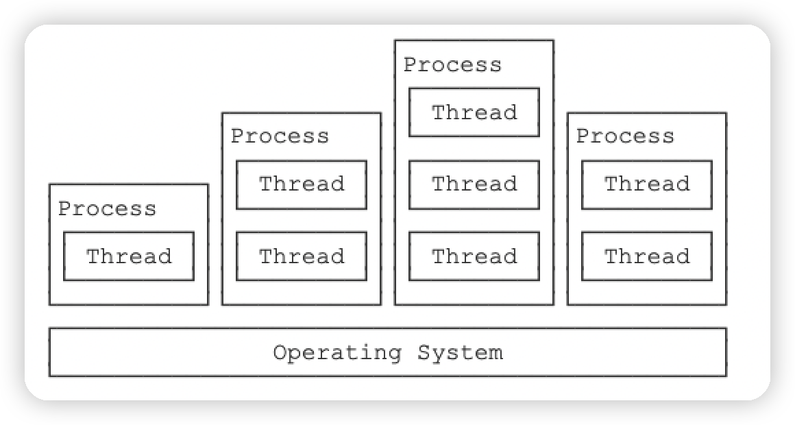
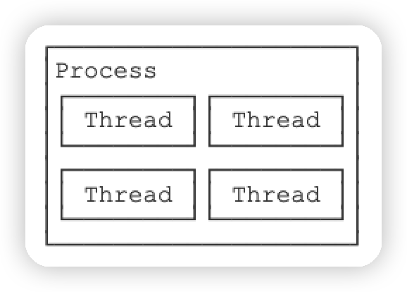
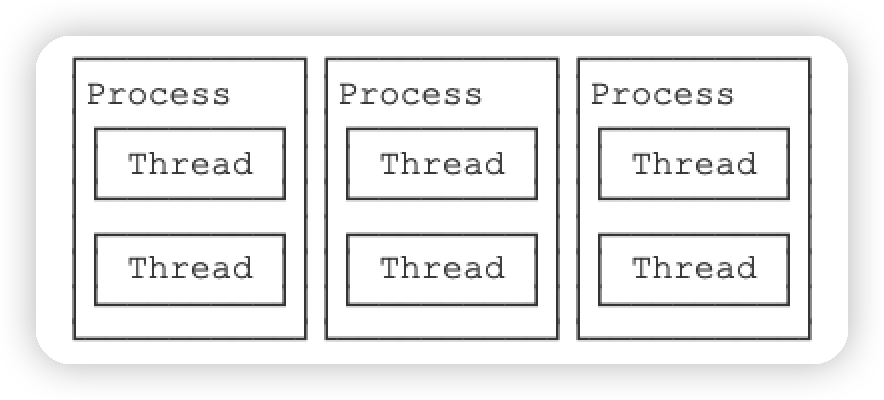

# **多线程基础**

现代操作系统（Windows，macOS，Linux）都可以执行多任务。多任务就是同时运行多个任务，例如：

CPU 执行代码都是一条一条顺序执行的，但是，即使是单核 cpu，也可以同时运行多个任务。因为操作系统执行多任务实际上就是让 CPU 对多个任务轮流交替执行。

例如，假设我们有语文、数学、英语 3 门作业要做，每个作业需要 30 分钟。我们把这 3 门作业看成是 3 个任务，可以做 1 分钟语文作业，再做 1 分钟数学作业，再做 1 分钟英语作业：

这样轮流做下去，在某些人眼里看来，做作业的速度就非常快，看上去就像同时在做 3 门作业一样

类似的，操作系统轮流让多个任务交替执行，例如，让浏览器执行 0.001 秒，让 QQ 执行 0.001 秒，再让音乐播放器执行 0.001 秒，在人看来，CPU 就是在同时执行多个任务。

即使是多核 CPU，因为通常任务的数量远远多于 CPU 的核数，所以任务也是交替执行的。

## 进程

在计算机中，我们把一个任务称为一个进程，浏览器就是一个进程，视频播放器是另一个进程，类似的，音乐播放器和 Word 都是进程。

某些进程内部还需要同时执行多个子任务。例如，我们在使用 Word 时，Word 可以让我们一边打字，一边进行拼写检查，同时还可以在后台进行打印，我们把子任务称为线程。

进程和线程的关系就是：一个进程可以包含一个或多个线程，但至少会有一个线程。

操作系统调度的最小任务单位其实不是进程，而是线程。常用的 Windows、Linux 等操作系统都采用抢占式多任务，如何调度线程完全由操作系统决定，程序自己不能决定什么时候执行，以及执行多长时间。

因为同一个应用程序，既可以有多个进程，也可以有多个线程，因此，实现多任务的方法，有以下几种：

多进程模式（每个进程只有一个线程）：

多线程模式（一个进程有多个线程）：

多进程＋多线程模式（复杂度最高）：

## 进程 vs 线程

进程和线程是包含关系，但是多任务既可以由多进程实现，也可以由单进程内的多线程实现，还可以混合多进程 ＋ 多线程。

具体采用哪种方式，要考虑到进程和线程的特点。

和多线程相比，多进程的**缺点**在于：

- 创建进程比创建线程开销大，尤其是在 Windows 系统上；
- 进程间通信比线程间通信要慢，因为线程间通信就是读写同一个变量，速度很快。

而多进程的**优点**在于：

多进程稳定性比多线程高，因为在多进程的情况下，一个进程崩溃不会影响其他进程，而在多线程的情况下，任何一个线程崩溃会直接导致整个进程崩溃。

## 多线程

Java 语言内置了多线程支持：一个 Java 程序实际上是一个 JVM 进程，JVM 进程用一个主线程来执行 `main()` 方法，在 `main()` 方法内部，我们又可以启动多个线程。此外，JVM 还有负责垃圾回收的其他工作线程等。

因此，对于大多数 Java 程序来说，我们说多任务，实际上是说如何使用多线程实现多任务。

和单线程相比，多线程编程的特点在于： ***多线程经常需要读写共享数据，并且需要同步。*** 例如，播放电影时，就必须由一个线程播放视频，另一个线程播放音频，两个线程需要协调运行，否则画面和声音就不同步。因此，多线程编程的复杂度高，调试更困难。

Java 多线程编程的**特点**又在于：

- 多线程模型是 Java 程序最基本的并发模型；
- 后续读写网络、数据库、Web 开发等都依赖 Java 多线程模型。

因此，必须掌握 Java 多线程编程才能继续深入学习其他内容。

