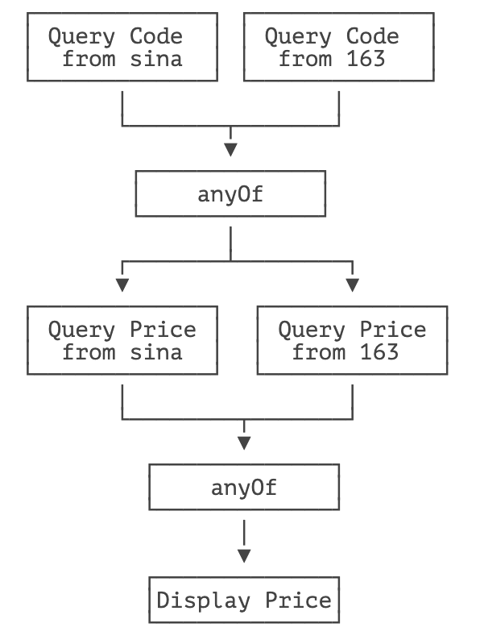

# **使用 CompletableFuture**


使用 `Future` 获得异步执行结果时，要么调用阻塞方法 `get()`，要么轮询看 `isDone()` 是否为 `true`，这两种方法都不是很好，因为主线程也会被迫等待。

从 Java 8 开始引入了 `CompletableFuture`，它针对 `Future` 做了改进，可以传入回调对象，当异步任务完成或者发生异常时，自动调用回调对象的回调方法。

我们以获取股票价格为例，看看如何使用 `CompletableFuture`：

```java
// CompletableFuture
import java.util.concurrent.CompletableFuture;

public class Main {
    public static void main(String[] args) throws Exception {
        // 创建异步执行任务:
        CompletableFuture<Double> cf = CompletableFuture.supplyAsync(Main::fetchPrice);
        // 如果执行成功:
        cf.thenAccept((result) -> {
            System.out.println("price:" + result);
        });
        // 如果执行异常:
        cf.exceptionally((e) -> {
            e.printStackTrace();
            return null;
        });
        // 主线程不要立刻结束，否则 CompletableFuture 默认使用的线程池会立刻关闭:
        Thread.sleep(200);
    }

    static Double fetchPrice() {
        try {
            Thread.sleep(100);
        } catch (InterruptedException e) {
        }
        if (Math.random() < 0.3) {
            throw new RuntimeException("fetch price failed!");
        }
        return 5 + Math.random() * 20;
    }
}

```


创建一个 `CompletableFuture` 是通过 `CompletableFuture.supplyAsync()` 实现的，它需要一个实现了 `Supplier` 接口的对象：

```java
public interface Supplier<T> {
    T get();
}
```

这里我们用 lambda 语法简化了一下，直接传入 `Main::fetchPrice`，因为 `Main.fetchPrice()` 静态方法的签名符合 `Supplier` 接口的定义（除了方法名外）。

紧接着，`CompletableFuture` 已经被提交给默认的线程池执行了，我们需要定义的是 `CompletableFuture` 完成时和异常时需要回调的实例。完成时，`CompletableFuture` 会调用 `Consumer` 对象：

```java
public interface Consumer<T> {
    void accept(T t);
}
```

异常时，`CompletableFuture` 会调用 `Function` 对象：

```java
public interface Function<T, R> {
    R apply(T t);
}
```

这里我们都用 lambda 语法简化了代码。

可见 `CompletableFuture` 的优点是：

- 异步任务结束时，会自动回调某个对象的方法；
- 异步任务出错时，会自动回调某个对象的方法；
- 主线程设置好回调后，不再关心异步任务的执行。

如果只是实现了异步回调机制，我们还看不出 `CompletableFuture` 相比 `Future` 的优势。`CompletableFuture` 更强大的功能是，多个 `CompletableFuture` 可以串行执行，例如，定义两个 `CompletableFuture`，第一个 `CompletableFuture` 根据证券名称查询证券代码，第二个 `CompletableFuture` 根据证券代码查询证券价格，这两个 `CompletableFuture` 实现串行操作如下：

```java
// CompletableFuture
import java.util.concurrent.CompletableFuture;

public class Main {
    public static void main(String[] args) throws Exception {
        // 第一个任务:
        CompletableFuture<String> cfQuery = CompletableFuture.supplyAsync(() -> {
            return queryCode("中国石油");
        });
        // cfQuery 成功后继续执行下一个任务:
        CompletableFuture<Double> cfFetch = cfQuery.thenApplyAsync((code) -> {
            return fetchPrice(code);
        });
        // cfFetch 成功后打印结果:
        cfFetch.thenAccept((result) -> {
            System.out.println("price:" + result);
        });
        // 主线程不要立刻结束，否则 CompletableFuture 默认使用的线程池会立刻关闭:
        Thread.sleep(2000);
    }

    static String queryCode(String name) {
        try {
            Thread.sleep(100);
        } catch (InterruptedException e) {
        }
        return "601857";
    }

    static Double fetchPrice(String code) {
        try {
            Thread.sleep(100);
        } catch (InterruptedException e) {
        }
        return 5 + Math.random() * 20;
    }
}
```


除了串行执行外，多个 `CompletableFuture` 还可以并行执行。例如，我们考虑这样的场景：

同时从新浪和网易查询证券代码，只要任意一个返回结果，就进行下一步查询价格，查询价格也同时从新浪和网易查询，只要任意一个返回结果，就完成操作：

```java
// CompletableFuture
import java.util.concurrent.CompletableFuture;
public class Main {
    public static void main(String[] args) throws Exception {
        // 两个 CompletableFuture 执行异步查询:
        CompletableFuture<String> cfQueryFromSina = CompletableFuture.supplyAsync(() -> {
            return queryCode("中国石油", "https://finance.sina.com.cn/code/");
        });
        CompletableFuture<String> cfQueryFrom163 = CompletableFuture.supplyAsync(() -> {
            return queryCode("中国石油", "https://money.163.com/code/");
        });

        // 用 anyOf 合并为一个新的 CompletableFuture:
        CompletableFuture<Object> cfQuery = CompletableFuture.anyOf(cfQueryFromSina, cfQueryFrom163);

        // 两个 CompletableFuture 执行异步查询:
        CompletableFuture<Double> cfFetchFromSina = cfQuery.thenApplyAsync((code) -> {
            return fetchPrice((String) code, "https://finance.sina.com.cn/price/");
        });
        CompletableFuture<Double> cfFetchFrom163 = cfQuery.thenApplyAsync((code) -> {
            return fetchPrice((String) code, "https://money.163.com/price/");
        });

        // 用 anyOf 合并为一个新的 CompletableFuture:
        CompletableFuture<Object> cfFetch = CompletableFuture.anyOf(cfFetchFromSina, cfFetchFrom163);

        // 最终结果:
        cfFetch.thenAccept((result) -> {
            System.out.println("price:" + result);
        });
        // 主线程不要立刻结束，否则 CompletableFuture 默认使用的线程池会立刻关闭:
        Thread.sleep(200);
    }

    static String queryCode(String name, String url) {
        System.out.println("query code from" + url + "...");
        try {
            Thread.sleep((long) (Math.random() * 100));
        } catch (InterruptedException e) {
        }
        return "601857";
    }

    static Double fetchPrice(String code, String url) {
        System.out.println("query price from" + url + "...");
        try {
            Thread.sleep((long) (Math.random() * 100));
        } catch (InterruptedException e) {
        }
        return 5 + Math.random() * 20;
    }
}
```


上述逻辑实现的异步查询规则实际上是：



除了 `anyOf()` 可以实现 “任意个 `CompletableFuture` 只要一个成功”，`allOf()` 可以实现 “所有 `CompletableFuture` 都必须成功”，这些组合操作可以实现非常复杂的异步流程控制。

最后我们注意 `CompletableFuture` 的命名规则：

- `xxx()`：表示该方法将继续在已有的线程中执行；
- `xxxAsync()`：表示将异步在线程池中执行。

## 练习

```java
package com.itranswarp.learnjava;

import java.util.concurrent.CompletableFuture;

/**
 * Learn Java from https://www.liaoxuefeng.com/
 *
 * @author liaoxuefeng
 */
public class Main {
	public static void main(String[] args) throws Exception {
		// 两个 CompletableFuture 执行异步查询:
		CompletableFuture<String> cfQueryFromSina = CompletableFuture.supplyAsync(() -> {
			return queryCode("中国石油", "https://finance.sina.com.cn/code/");
		});
		CompletableFuture<String> cfQueryFrom163 = CompletableFuture.supplyAsync(() -> {
			return queryCode("中国石油", "https://money.163.com/code/");
		});

		// 用 anyOf 合并为一个新的 CompletableFuture:
		CompletableFuture<Object> cfQuery = CompletableFuture.anyOf(cfQueryFromSina, cfQueryFrom163);

		// 两个 CompletableFuture 执行异步查询:
		CompletableFuture<Double> cfFetchFromSina = cfQuery.thenApplyAsync((code) -> {
			return fetchPrice((String) code, "https://finance.sina.com.cn/price/");
		});
		CompletableFuture<Double> cfFetchFrom163 = cfQuery.thenApplyAsync((code) -> {
			return fetchPrice((String) code, "https://money.163.com/price/");
		});

		// 用 anyOf 合并为一个新的 CompletableFuture:
		CompletableFuture<Object> cfFetch = CompletableFuture.anyOf(cfFetchFromSina, cfFetchFrom163);

		// 最终结果:
		cfFetch.thenAccept((result) -> {
			System.out.println("price:" + result);
		});
		// 主线程不要立刻结束，否则 CompletableFuture 默认使用的线程池会立刻关闭:
		Thread.sleep(2000);
	}

	static String queryCode(String name, String url) {
		System.out.println("query code from" + url + "...");
		try {
			Thread.sleep((long) Math.random() * 1000);
		} catch (InterruptedException e) {
		}
		return "601857";
	}

	static Double fetchPrice(String code, String url) {
		System.out.println("query price from" + url + "...");
		try {
			Thread.sleep((long) Math.random() * 1000);
		} catch (InterruptedException e) {
		}
		return 5 + Math.random() * 20;
	}
}
```

## 小结

`CompletableFuture` 可以指定异步处理流程：

- `thenAccept()` 处理正常结果；
- `exceptional()` 处理异常结果；
- `thenApplyAsync()` 用于串行化另一个 `CompletableFuture`；
- `anyOf()` 和 `allOf()` 用于并行化多个 `CompletableFuture`