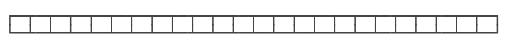
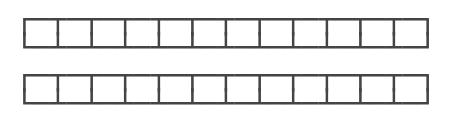
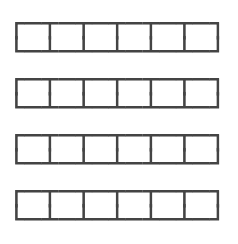

# **使用 ForkJoin**


Java 7 开始引入了一种新的 Fork/Join 线程池，它可以执行一种特殊的任务：把一个大任务拆成多个小任务并行执行。

我们举个例子：如果要计算一个超大数组的和，最简单的做法是用一个循环在一个线程内完成：



还有一种方法，可以把数组拆成两部分，分别计算，最后加起来就是最终结果，这样可以用两个线程并行执行：



如果拆成两部分还是很大，我们还可以继续拆，用 4 个线程并行执行：



这就是 Fork/Join 任务的原理：判断一个任务是否足够小，如果是，直接计算，否则，就分拆成几个小任务分别计算。这个过程可以反复 “裂变” 成一系列小任务。

我们来看如何使用 Fork/Join 对大数据进行并行求和：

```java
import java.util.Random;
import java.util.concurrent.*;

public class Main {
    public static void main(String[] args) throws Exception {
        // 创建 2000 个随机数组成的数组:
        long[] array = new long[2000];
        long expectedSum = 0;
        for (int i = 0; i < array.length; i++) {
            array[i] = random();
            expectedSum += array[i];
        }
        System.out.println("Expected sum:" + expectedSum);
        // fork/join:
        ForkJoinTask<Long> task = new SumTask(array, 0, array.length);
        long startTime = System.currentTimeMillis();
        Long result = ForkJoinPool.commonPool().invoke(task);
        long endTime = System.currentTimeMillis();
        System.out.println("Fork/join sum:" + result + "in" + (endTime - startTime) + "ms.");
    }

    static Random random = new Random(0);

    static long random() {
        return random.nextInt(10000);
    }
}

class SumTask extends RecursiveTask<Long> {
    static final int THRESHOLD = 500;
    long[] array;
    int start;
    int end;

    SumTask(long[] array, int start, int end) {
        this.array = array;
        this.start = start;
        this.end = end;
    }

    @Override
    protected Long compute() {
        if (end - start <= THRESHOLD) {
            // 如果任务足够小, 直接计算:
            long sum = 0;
            for (int i = start; i < end; i++) {
                sum += this.array[i];
                // 故意放慢计算速度:
                try {
                    Thread.sleep(1);
                } catch (InterruptedException e) {
                }
            }
            return sum;
        }
        // 任务太大, 一分为二:
        int middle = (end + start) / 2;
        System.out.println(String.format("split %d~%d ==> %d~%d, %d~%d", start, end, start, middle, middle, end));
        SumTask subtask1 = new SumTask(this.array, start, middle);
        SumTask subtask2 = new SumTask(this.array, middle, end);
        invokeAll(subtask1, subtask2);
        Long subresult1 = subtask1.join();
        Long subresult2 = subtask2.join();
        Long result = subresult1 + subresult2;
        System.out.println("result =" + subresult1 + "+" + subresult2 + "==>" + result);
        return result;
    }
}

```


观察上述代码的执行过程，一个大的计算任务 0~2000 首先分裂为两个小任务 0~1000 和 1000~2000，这两个小任务仍然太大，继续分裂为更小的 0~500，500~1000，1000~1500，1500~2000，最后，计算结果被依次合并，得到最终结果。

因此，核心代码 `SumTask` 继承自 `RecursiveTask`，在 `compute()` 方法中，关键是如何 “分裂” 出子任务并且提交子任务：

```
class SumTask extends RecursiveTask<Long> {
    protected Long compute() {
        // “分裂” 子任务:
        SumTask subtask1 = new SumTask(...);
        SumTask subtask2 = new SumTask(...);
        // invokeAll 会并行运行两个子任务:
        invokeAll(subtask1, subtask2);
        // 获得子任务的结果:
        Long subresult1 = subtask1.join();
        Long subresult2 = subtask2.join();
        // 汇总结果:
        return subresult1 + subresult2;
    }
}
```

Fork/Join 线程池在 Java 标准库中就有应用。Java 标准库提供的 `java.util.Arrays.parallelSort(array)` 可以进行并行排序，它的原理就是内部通过 Fork/Join 对大数组分拆进行并行排序，在多核 CPU 上就可以大大提高排序的速度。

## 练习

```java
package com.itranswarp.learnjava;

import java.util.Random;
import java.util.concurrent.ForkJoinPool;
import java.util.concurrent.ForkJoinTask;
import java.util.concurrent.RecursiveTask;

/**
 * Learn Java from https://www.liaoxuefeng.com/
 *
 * @author liaoxuefeng
 */
public class Main {
	public static void main(String[] args) throws Exception {
		// 创建 2000 个随机数组成的数组:
		long[] array = new long[2000];
		long expectedSum = 0;
		for (int i = 0; i < array.length; i++) {
			array[i] = random();
			expectedSum += array[i];
		}
		System.out.println("Expected sum:" + expectedSum);
		// fork/join:
		ForkJoinTask<Long> task = new SumTask(array, 0, array.length);
		long startTime = System.currentTimeMillis();
		Long result = ForkJoinPool.commonPool().invoke(task);
		long endTime = System.currentTimeMillis();
		System.out.println("Fork/join sum:" + result + "in" + (endTime - startTime) + "ms.");
	}

	static Random random = new Random(0);

	static long random() {
		return random.nextInt(10000);
	}
}

class SumTask extends RecursiveTask<Long> {

	static final int THRESHOLD = 500;
	long[] array;
	int start;
	int end;

	SumTask(long[] array, int start, int end) {
		this.array = array;
		this.start = start;
		this.end = end;
	}

	@Override
	protected Long compute() {
		if (end - start <= THRESHOLD) {
			// 如果任务足够小, 直接计算:
			long sum = 0;
			for (int i = start; i < end; i++) {
				sum += this.array[i];
				// 故意放慢计算速度:
				try {
					Thread.sleep(2);
				} catch (InterruptedException e) {
				}
			}
			return sum;
		}
		// 任务太大, 一分为二:
		int middle = (end + start) / 2;
		System.out.println(String.format("split %d~%d ==> %d~%d, %d~%d", start, end, start, middle, middle, end));
		SumTask subtask1 = new SumTask(this.array, start, middle);
		SumTask subtask2 = new SumTask(this.array, middle, end);
		invokeAll(subtask1, subtask2);
		Long subresult1 = subtask1.join();
		Long subresult2 = subtask2.join();
		Long result = subresult1 + subresult2;
		System.out.println("result =" + subresult1 + "+" + subresult2 + "==>" + result);
		return result;
	}
}
```

## 小结

Fork/Join 是一种基于 “分治” 的算法：通过分解任务，并行执行，最后合并结果得到最终结果。

`ForkJoinPool` 线程池可以把一个大任务分拆成小任务并行执行，任务类必须继承自 `RecursiveTask` 或 `RecursiveAction`。

使用 Fork/Join 模式可以进行并行计算以提高效率。