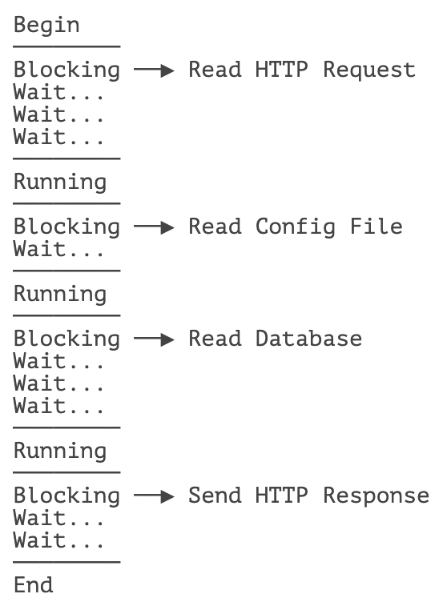
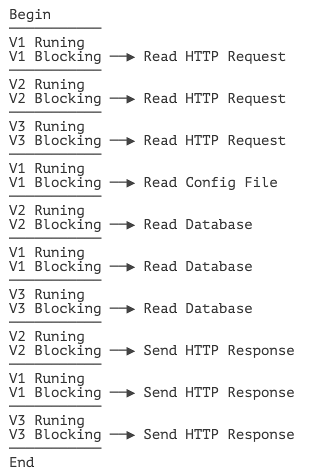

# **使用虚拟线程**


虚拟线程（Virtual Thread）是 Java 19 引入的一种轻量级线程，它在很多其他语言中被称为协程、纤程、绿色线程、用户态线程等。

在理解虚拟线程前，我们先回顾一下线程的特点：

- 线程是由操作系统创建并调度的资源；
- 线程切换会耗费大量 CPU 时间；
- 一个系统能同时调度的线程数量是有限的，通常在几百至几千级别。

因此，我们说线程是一种重量级资源。在服务器端，对用户请求，通常都实现为一个线程处理一个请求。由于用户的请求数往往远超操作系统能同时调度的线程数量，所以通常使用线程池来尽量减少频繁创建和销毁线程的成本。

对于需要处理大量 IO 请求的任务来说，使用线程是低效的，因为一旦读写 IO，线程就必须进入等待状态，直到 IO 数据返回。常见的 IO 操作包括：

- 读写文件；
- 读写网络，例如 HTTP 请求；
- 读写数据库，本质上是通过 JDBC 实现网络调用。

我们举个例子，一个处理 HTTP 请求的线程，它在读写网络、文件的时候就会进入等待状态：



真正由 CPU 执行的代码消耗的时间非常少，线程的大部分时间都在等待 IO。我们把这类任务称为 IO 密集型任务。

为了能高效执行 IO 密集型任务，Java 从 19 开始引入了虚拟线程。虚拟线程的接口和普通线程是一样的，但是执行方式不一样。虚拟线程不是由操作系统调度，而是由普通线程调度，即成百上千个虚拟线程可以由一个普通线程调度。任何时刻，只能执行一个虚拟线程，但是，一旦该虚拟线程执行一个 IO 操作进入等待时，它会被立刻 “挂起”，然后执行下一个虚拟线程。什么时候 IO 数据返回了，这个挂起的虚拟线程才会被再次调度。因此，若干个虚拟线程可以在一个普通线程中交替运行：



如果我们单独看一个虚拟线程的代码，在一个方法中：

```java
void register() {
    config = readConfigFile("./config.json"); // #1
    if (config.useFullName) {
        name = req.firstName + " " + req.lastName;
    }
    insertInto(db, name); // #2
    if (config.cache) {
        redis.set(key, name); // #3
    }
}
```

涉及到 IO 读写的 #1、#2、#3 处，执行到这些地方的时候（进入相关的 JNI 方法内部时）会自动挂起，并切换到其他虚拟线程执行。等到数据返回后，当前虚拟线程会再次调度并执行，因此，代码看起来是同步执行，但实际上是异步执行的。

## 使用虚拟线程

虚拟线程的接口和普通线程一样，唯一区别在于创建虚拟线程只能通过特定方法。

方法一：直接创建虚拟线程并运行：

```java
// 传入 Runnable 实例并立刻运行:
Thread vt = Thread.startVirtualThread(() -> {
    System.out.println("Start virtual thread...");
    Thread.sleep(10);
    System.out.println("End virtual thread.");
});
```

方法二：创建虚拟线程但不自动运行，而是手动调用 `start()` 开始运行：

```java
// 创建 VirtualThread:
Thread.ofVirtual().unstarted(() -> {
    System.out.println("Start virtual thread...");
    Thread.sleep(1000);
    System.out.println("End virtual thread.");
});
// 运行:
vt.start();
```

方法三：通过虚拟线程的 ThreadFactory 创建虚拟线程，然后手动调用 `start()` 开始运行：

```java
// 创建 ThreadFactory:
ThreadFactory tf = Thread.ofVirtual().factory();
// 创建 VirtualThread:
Thread vt = tf.newThread(() -> {
    System.out.println("Start virtual thread...");
    Thread.sleep(1000);
    System.out.println("End virtual thread.");
});
// 运行:
vt.start();
```

直接调用 `start()` 实际上是由 `ForkJoinPool` 的线程来调度的。我们也可以自己创建调度线程，然后运行虚拟线程：

```java
// 创建调度器:
ExecutorService executor = Executors.newVirtualThreadPerTaskExecutor();
// 创建大量虚拟线程并调度:
ThreadFactory tf = Thread.ofVirtual().factory();
for (int i=0; i<100000; i++) {
    Thread vt = tf.newThread(() -> { ... });
    executor.submit(vt);
    // 也可以直接传入 Runnable 或 Callable:
    executor.submit(() -> {
        System.out.println("Start virtual thread...");
        Thread.sleep(1000);
        System.out.println("End virtual thread.");
        return true;
    });
}
```

由于虚拟线程属于非常轻量级的资源，因此，用时创建，用完就扔，不要池化虚拟线程。

最后注意，虚拟线程在 Java 21 正式发布，在 Java 19/20 是预览功能，默认关闭，需要添加参数 `--enable-preview` 启用：

```bash
java --source 19 --enable-preview Main.java
```

## 使用限制

注意到只有以虚拟线程方式运行的代码，才会在执行 IO 操作时自动被挂起并切换到其他虚拟线程。普通线程的 IO 操作仍然会等待，例如，我们在 `main()` 方法中读写文件，是不会有调度和自动挂起的。

可以自动引发调度切换的操作包括：

- 文件 IO；
- 网络 IO；
- 使用 Concurrent 库引发等待；
- Thread.sleep() 操作。

这是因为 JDK 为了实现虚拟线程，已经对底层相关操作进行了修改，这样应用层的 Java 代码无需修改即可使用虚拟线程。无法自动切换的语言需要用户手动调用 `await` 来实现异步操作：

```java
async function doWork() {
    await readFile();
    await sendNetworkData();
}
```

在虚拟线程中，如果绕过 JDK 的 IO 接口，直接通过 JNI 读写文件或网络是无法实现调度的。此外，在 `synchronized` 块内部也无法调度。

## 练习

使用虚拟线程调度 10 万个任务并观察耗时：

```java
public class Main {
    public static void main(String[] args) {
        ExecutorService es = Executors.newVirtualThreadPerTaskExecutor();
        for (int i=0; i<100000; i++) {
            es.submit(() -> {
                Thread.sleep(1000);
                return 0;
            });
        }
        es.close();
    }
}
```

再将 `ExecutorService` 改为线程池模式并对比结果。


```java
package com.itranswarp.learnjava;

import java.util.concurrent.ExecutorService;
import java.util.concurrent.Executors;

public class Main {

    public static void main(String[] args) throws InterruptedException {
        ExecutorService es = Executors.newVirtualThreadPerTaskExecutor();
        long start = System.currentTimeMillis();
        for (int i = 0; i < 100000; i++) {
            es.submit(() -> {
                Thread.sleep(1000);
                return 0;
            });
        }
        es.close();
        long end = System.currentTimeMillis();
        System.out.printf("All virtual threads end at %s ms.\n", end - start);
    }
}
```


## 小结

Java 19 引入的虚拟线程是为了解决 IO 密集型任务的吞吐量，它可以高效通过少数线程去调度大量虚拟线程；

虚拟线程在执行到 IO 操作或 Blocking 操作时，会自动切换到其他虚拟线程执行，从而避免当前线程等待，能最大化线程的执行效率；

虚拟线程使用普通线程相同的接口，最大的好处是无需修改任何代码，就可以将现有的 IO 操作异步化获得更大的吞吐能力。

计算密集型任务不应使用虚拟线程，只能通过增加 CPU 核心解决，或者利用分布式计算资源。

