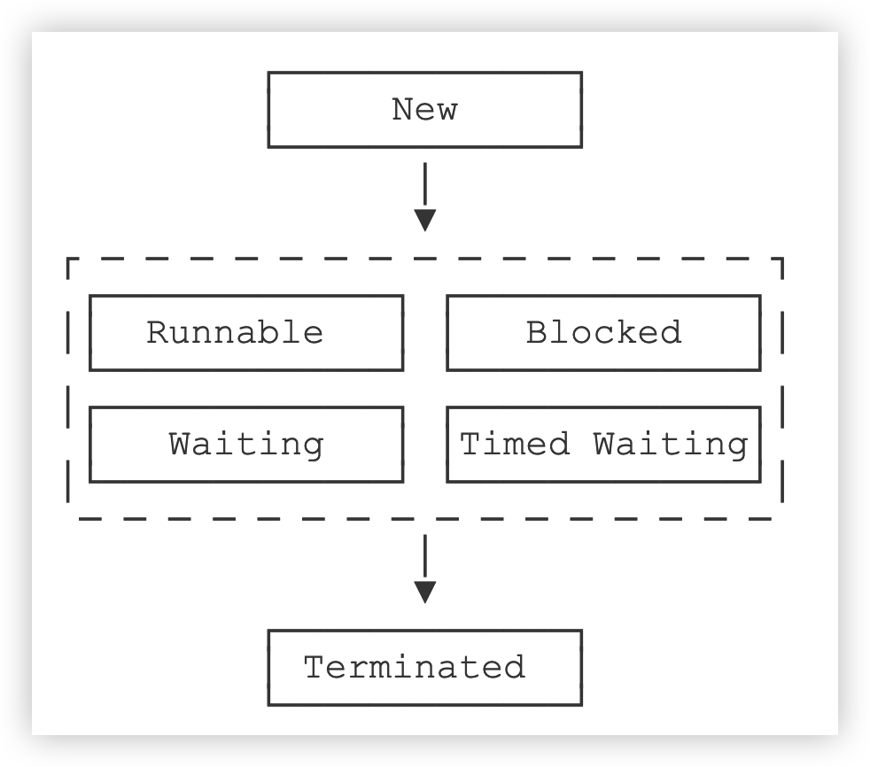

# **线程的状态**

在 Java 程序中，一个线程对象只能调用一次 `start()` 方法启动新线程，并在新线程中执行 `run()` 方法。一旦 `run()` 方法执行完毕，线程就结束了。因此， Java 线程的状态有以下几种：

- New：新创建的线程，尚未执行；
- Runnable：运行中的线程，正在执行 `run()` 方法的 Java 代码；
- Blocked：运行中的线程，因为某些操作被阻塞而挂起；
- Waiting：运行中的线程，因为某些操作在等待中；
- Timed Waiting：运行中的线程，因为执行 `sleep()` 方法正在计时等待；
- Terminated：线程已终止，因为 `run()` 方法执行完毕。


用一个状态转移图表示如下：




当线程启动后，它可以在 `Runnable` 、 `Blocked` 、 `Waiting` 和 `Timed Waiting` 这几个状态之间切换，直到最后变成 `Terminated` 状态，线程终止。

线程终止的原因有：

- 线程正常终止： `run()` 方法执行到 `return` 语句返回；
- 线程意外终止： `run()` 方法因为未捕获的异常导致线程终止；
- 对某个线程的 `Thread` 实例调用 `stop()` 方法强制终止（强烈不推荐使用）。

一个线程还可以等待另一个线程直到其运行结束。例如， `main` 线程在启动 `t` 线程后，可以通过 `t.join()` 等待 `t` 线程结束后再继续运行：

```java
public class Main {
    public static void main(String[] args) throws InterruptedException {
        Thread t = new Thread(() -> {
            System.out.println("hello");
        });
        System.out.println("start");
        t.start();
        t.join();
        System.out.println("end");
    }
}
```

当 `main` 线程对线程对象 `t` 调用 `join()` 方法时，主线程将等待变量 `t` 表示的线程运行结束，即 `join` 就是指等待该线程结束，然后才继续往下执行自身线程。所以，上述代码打印顺序可以肯定是 `main` 线程先打印 `start` ， `t` 线程再打印 `hello` ， `main` 线程最后再打印 `end` 。

如果 `t` 线程已经结束，对实例 `t` 调用 `join()` 会立刻返回。此外， `join(long)` 的重载方法也可以指定一个等待时间，超过等待时间后就不再继续等待。


## 小结

- Java 线程对象 `Thread` 的状态包括： `New` 、 `Runnable` 、 `Blocked` 、 `Waiting` 、 `Timed Waiting` 和 `Terminated` ；
- 通过对另一个线程对象调用 `join()` 方法可以等待其执行结束；
- 可以指定等待时间，超过等待时间线程仍然没有结束就不再等待；
- 对已经运行结束的线程调用 `join()` 方法会立刻返回。

