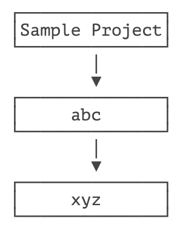
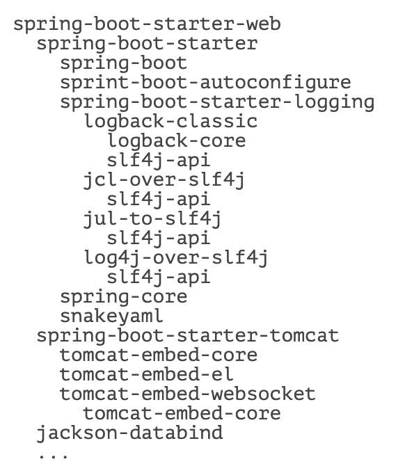
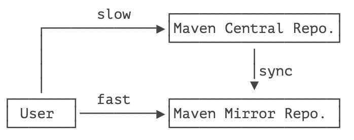
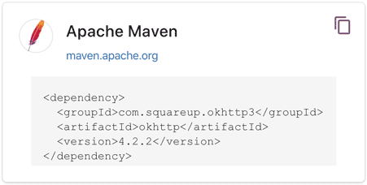
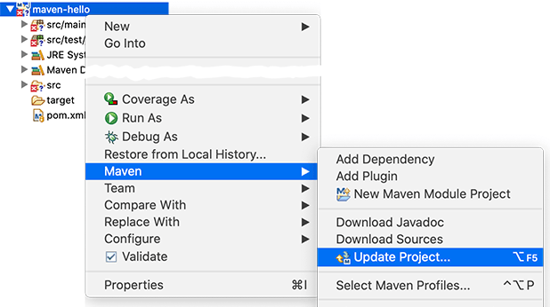

# **依赖管理**


如果我们的项目依赖第三方的 jar 包，例如 commons logging，那么问题来了：commons logging 发布的 jar 包在哪下载？

如果我们还希望依赖 log4j，那么使用 log4j 需要哪些 jar 包？

类似的依赖还包括：JUnit，JavaMail，MySQL 驱动等等，一个可行的方法是通过搜索引擎搜索到项目的官网，然后手动下载 zip 包，解压，放入 classpath。但是，这个过程非常繁琐。

Maven 解决了依赖管理问题。例如，我们的项目依赖 `abc` 这个 jar 包，而 `abc` 又依赖 `xyz` 这个 jar 包：



当我们声明了 `abc` 的依赖时，Maven 自动把 `abc` 和 `xyz` 都加入了我们的项目依赖，不需要我们自己去研究 `abc` 是否需要依赖 `xyz`。

因此，Maven 的第一个作用就是解决依赖管理。我们声明了自己的项目需要 `abc`，Maven 会自动导入 `abc` 的 jar 包，再判断出 `abc` 需要 `xyz`，又会自动导入 `xyz` 的 jar 包，这样，最终我们的项目会依赖 `abc` 和 `xyz` 两个 jar 包。

我们来看一个复杂依赖示例：

```xml
<dependency>
    <groupId>org.springframework.boot</groupId>
    <artifactId>spring-boot-starter-web</artifactId>
    <version>1.4.2.RELEASE</version>
</dependency>
```

当我们声明一个 `spring-boot-starter-web` 依赖时，Maven 会自动解析并判断最终需要大概二三十个其他依赖：



如果我们自己去手动管理这些依赖是非常费时费力的，而且出错的概率很大。

## 依赖关系

Maven 定义了几种依赖关系，分别是 `compile`、`test`、`runtime` 和 `provided`：

| scope    | 说明                                          | 示例            |
| :------- | :-------------------------------------------- | :-------------- |
| compile  | 编译时需要用到该 jar 包（默认）                 | commons-logging |
| test     | 编译 Test 时需要用到该 jar 包                     | junit           |
| runtime  | 编译时不需要，但运行时需要用到                | mysql           |
| provided | 编译时需要用到，但运行时由 JDK 或某个服务器提供 | servlet-api     |

其中，默认的 `compile` 是最常用的，Maven 会把这种类型的依赖直接放入 classpath。

`test` 依赖表示仅在测试时使用，正常运行时并不需要。最常用的 `test` 依赖就是 JUnit：

```xml
<dependency>
    <groupId>org.junit.jupiter</groupId>
    <artifactId>junit-jupiter-api</artifactId>
    <version>5.3.2</version>
    <scope>test</scope>
</dependency>
```

`runtime` 依赖表示编译时不需要，但运行时需要。最典型的 `runtime` 依赖是 JDBC 驱动，例如 MySQL 驱动：

```xml
<dependency>
    <groupId>mysql</groupId>
    <artifactId>mysql-connector-java</artifactId>
    <version>5.1.48</version>
    <scope>runtime</scope>
</dependency>
```

`provided` 依赖表示编译时需要，但运行时不需要。最典型的 `provided` 依赖是 Servlet API，编译的时候需要，但是运行时，Servlet 服务器内置了相关的 jar，所以运行期不需要：

```xml
<dependency>
    <groupId>javax.servlet</groupId>
    <artifactId>javax.servlet-api</artifactId>
    <version>4.0.0</version>
    <scope>provided</scope>
</dependency>
```

最后一个问题是，Maven 如何知道从何处下载所需的依赖？也就是相关的 jar 包？答案是 Maven 维护了一个中央仓库（[repo1.maven.org](https://repo1.maven.org/)），所有第三方库将自身的 jar 以及相关信息上传至中央仓库，Maven 就可以从中央仓库把所需依赖下载到本地。

Maven 并不会每次都从中央仓库下载 jar 包。一个 jar 包一旦被下载过，就会被 Maven 自动缓存在本地目录（用户主目录的 `.m2` 目录），所以，除了第一次编译时因为下载需要时间会比较慢，后续过程因为有本地缓存，并不会重复下载相同的 jar 包。

## 唯一 ID

对于某个依赖，Maven 只需要 3 个变量即可唯一确定某个 jar 包：

- groupId：属于组织的名称，类似 Java 的包名；
- artifactId：该 jar 包自身的名称，类似 Java 的类名；
- version：该 jar 包的版本。

通过上述 3 个变量，即可唯一确定某个 jar 包。Maven 通过对 jar 包进行 PGP 签名确保任何一个 jar 包一经发布就无法修改。修改已发布 jar 包的唯一方法是发布一个新版本。

因此，某个 jar 包一旦被 Maven 下载过，即可永久地安全缓存在本地。

注：只有以 `-SNAPSHOT` 结尾的版本号会被 Maven 视为开发版本，开发版本每次都会重复下载，这种 SNAPSHOT 版本只能用于内部私有的 Maven repo，公开发布的版本不允许出现 SNAPSHOT。

> [!NOTE]
> 后续我们在表示 Maven 依赖时，使用简写形式 groupId:artifactId:version，例如：org.slf4j:slf4j-api:2.0.4。

## Maven 镜像

除了可以从 Maven 的中央仓库下载外，还可以从 Maven 的镜像仓库下载。如果访问 Maven 的中央仓库非常慢，我们可以选择一个速度较快的 Maven 的镜像仓库。Maven 镜像仓库定期从中央仓库同步：



中国区用户可以使用阿里云提供的 Maven 镜像仓库。使用 Maven 镜像仓库需要一个配置，在用户主目录下进入 `.m2` 目录，创建一个 `settings.xml` 配置文件，内容如下：

```xml
<settings>
    <mirrors>
        <mirror>
            <id>aliyun</id>
            <name>aliyun</name>
            <mirrorOf>central</mirrorOf>
            <!-- 国内推荐阿里云的 Maven 镜像 -->
            <url>https://maven.aliyun.com/repository/central</url>
        </mirror>
    </mirrors>
</settings>
```

配置镜像仓库后，Maven 的下载速度就会非常快。

## 搜索第三方组件

最后一个问题：如果我们要引用一个第三方组件，比如 `okhttp`，如何确切地获得它的 `groupId`、`artifactId` 和 `version`？方法是通过 [search.maven.org](https://search.maven.org/) 搜索关键字，找到对应的组件后，直接复制：



## 命令行编译

在命令中，进入到 `pom.xml` 所在目录，输入以下命令：

```bash
$ mvn clean package
```

如果一切顺利，即可在 `target` 目录下获得编译后自动打包的 jar。

## 在 IDE 中使用 Maven

几乎所有的 IDE 都内置了对 Maven 的支持。在 Eclipse 中，可以直接创建或导入 Maven 项目。如果导入后的 Maven 项目有错误，可以尝试选择项目后点击右键，选择 Maven - Update Project... 更新：



## 练习

使用 Maven 编译 hello 项目

## 小结

Maven 通过解析依赖关系确定项目所需的 jar 包，常用的 4 种 `scope` 有：`compile`（默认），`test`，`runtime` 和 `provided`；

Maven 从中央仓库下载所需的 jar 包并缓存在本地；

可以通过镜像仓库加速下载。

