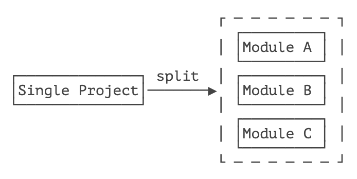
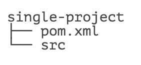
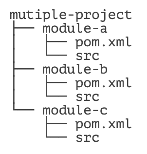
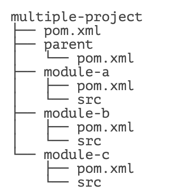

# **模块管理**


在软件开发中，把一个大项目分拆为多个模块是降低软件复杂度的有效方法：



对于 Maven 工程来说，原来是一个大项目：



现在可以分拆成 3 个模块：



Maven 可以有效地管理多个模块，我们只需要把每个模块当作一个独立的 Maven 项目，它们有各自独立的 `pom.xml`。例如，模块 A 的 `pom.xml`：

```xml
<project xmlns="http://maven.apache.org/POM/4.0.0"
    xmlns:xsi="http://www.w3.org/2001/XMLSchema-instance"
    xsi:schemaLocation="http://maven.apache.org/POM/4.0.0 http://maven.apache.org/xsd/maven-4.0.0.xsd">
    <modelVersion>4.0.0</modelVersion>

    <groupId>com.itranswarp.learnjava</groupId>
    <artifactId>module-a</artifactId>
    <version>1.0</version>
    <packaging>jar</packaging>

    <name>module-a</name>

    <properties>
        <project.build.sourceEncoding>UTF-8</project.build.sourceEncoding>
        <project.reporting.outputEncoding>UTF-8</project.reporting.outputEncoding>
        <maven.compiler.source>11</maven.compiler.source>
        <maven.compiler.target>11</maven.compiler.target>
        <java.version>11</java.version>
    </properties>

    <dependencies>
        <dependency>
            <groupId>org.slf4j</groupId>
            <artifactId>slf4j-api</artifactId>
            <version>1.7.28</version>
        </dependency>
        <dependency>
            <groupId>ch.qos.logback</groupId>
            <artifactId>logback-classic</artifactId>
            <version>1.2.3</version>
            <scope>runtime</scope>
        </dependency>
        <dependency>
            <groupId>org.junit.jupiter</groupId>
            <artifactId>junit-jupiter-engine</artifactId>
            <version>5.5.2</version>
            <scope>test</scope>
        </dependency>
    </dependencies>
</project>
```

模块 B 的 `pom.xml`：

```xml
<project xmlns="http://maven.apache.org/POM/4.0.0"
    xmlns:xsi="http://www.w3.org/2001/XMLSchema-instance"
    xsi:schemaLocation="http://maven.apache.org/POM/4.0.0 http://maven.apache.org/xsd/maven-4.0.0.xsd">
    <modelVersion>4.0.0</modelVersion>

    <groupId>com.itranswarp.learnjava</groupId>
    <artifactId>module-b</artifactId>
    <version>1.0</version>
    <packaging>jar</packaging>

    <name>module-b</name>

    <properties>
        <project.build.sourceEncoding>UTF-8</project.build.sourceEncoding>
        <project.reporting.outputEncoding>UTF-8</project.reporting.outputEncoding>
        <maven.compiler.source>11</maven.compiler.source>
        <maven.compiler.target>11</maven.compiler.target>
        <java.version>11</java.version>
    </properties>

    <dependencies>
        <dependency>
            <groupId>org.slf4j</groupId>
            <artifactId>slf4j-api</artifactId>
            <version>1.7.28</version>
        </dependency>
        <dependency>
            <groupId>ch.qos.logback</groupId>
            <artifactId>logback-classic</artifactId>
            <version>1.2.3</version>
            <scope>runtime</scope>
        </dependency>
        <dependency>
            <groupId>org.junit.jupiter</groupId>
            <artifactId>junit-jupiter-engine</artifactId>
            <version>5.5.2</version>
            <scope>test</scope>
        </dependency>
    </dependencies>
</project>
```

可以看出来，模块 A 和模块 B 的 `pom.xml` 高度相似，因此，我们可以提取出共同部分作为 `parent`：

```xml
<project xmlns="http://maven.apache.org/POM/4.0.0"
    xmlns:xsi="http://www.w3.org/2001/XMLSchema-instance"
    xsi:schemaLocation="http://maven.apache.org/POM/4.0.0 http://maven.apache.org/xsd/maven-4.0.0.xsd">
    <modelVersion>4.0.0</modelVersion>

    <groupId>com.itranswarp.learnjava</groupId>
    <artifactId>parent</artifactId>
    <version>1.0</version>
    <packaging>pom</packaging>

    <name>parent</name>

    <properties>
        <project.build.sourceEncoding>UTF-8</project.build.sourceEncoding>
        <project.reporting.outputEncoding>UTF-8</project.reporting.outputEncoding>
        <maven.compiler.source>11</maven.compiler.source>
        <maven.compiler.target>11</maven.compiler.target>
        <java.version>11</java.version>
    </properties>

    <dependencies>
        <dependency>
            <groupId>org.slf4j</groupId>
            <artifactId>slf4j-api</artifactId>
            <version>1.7.28</version>
        </dependency>
        <dependency>
            <groupId>ch.qos.logback</groupId>
            <artifactId>logback-classic</artifactId>
            <version>1.2.3</version>
            <scope>runtime</scope>
        </dependency>
        <dependency>
            <groupId>org.junit.jupiter</groupId>
            <artifactId>junit-jupiter-engine</artifactId>
            <version>5.5.2</version>
            <scope>test</scope>
        </dependency>
    </dependencies>
</project>
```

注意到 parent 的 `<packaging>` 是 `pom` 而不是 `jar`，因为 `parent` 本身不含任何 Java 代码。编写 `parent` 的 `pom.xml` 只是为了在各个模块中减少重复的配置。现在我们的整个工程结构如下：



这样模块 A 就可以简化为：

```xml
<project xmlns="http://maven.apache.org/POM/4.0.0"
    xmlns:xsi="http://www.w3.org/2001/XMLSchema-instance"
    xsi:schemaLocation="http://maven.apache.org/POM/4.0.0 http://maven.apache.org/xsd/maven-4.0.0.xsd">
    <modelVersion>4.0.0</modelVersion>

    <parent>
        <groupId>com.itranswarp.learnjava</groupId>
        <artifactId>parent</artifactId>
        <version>1.0</version>
        <relativePath>../parent/pom.xml</relativePath>
    </parent>

    <artifactId>module-a</artifactId>
    <packaging>jar</packaging>
    <name>module-a</name>
</project>
```

模块 B、模块 C 都可以直接从 `parent` 继承，大幅简化了 `pom.xml` 的编写。

如果模块 A 依赖模块 B，则模块 A 需要模块 B 的 jar 包才能正常编译，我们需要在模块 A 中引入模块 B：

```xml
    ...
    <dependencies>
        <dependency>
            <groupId>com.itranswarp.learnjava</groupId>
            <artifactId>module-b</artifactId>
            <version>1.0</version>
        </dependency>
    </dependencies>
```

最后，在编译的时候，需要在根目录创建一个 `pom.xml` 统一编译：

```xml
<project xmlns="http://maven.apache.org/POM/4.0.0"
    xmlns:xsi="http://www.w3.org/2001/XMLSchema-instance"
    xsi:schemaLocation="http://maven.apache.org/POM/4.0.0 http://maven.apache.org/maven-v4_0_0.xsd">

    <modelVersion>4.0.0</modelVersion>
    <groupId>com.itranswarp.learnjava</groupId>
    <artifactId>build</artifactId>
    <version>1.0</version>
    <packaging>pom</packaging>
    <name>build</name>

    <modules>
        <module>parent</module>
        <module>module-a</module>
        <module>module-b</module>
        <module>module-c</module>
    </modules>
</project>
```

这样，在根目录执行 `mvn clean package` 时，Maven 根据根目录的 `pom.xml` 找到包括 `parent` 在内的共 4 个 `<module>`，一次性全部编译。

## 中央仓库

其实我们使用的大多数第三方模块都是这个用法，例如，我们使用 commons logging、log4j 这些第三方模块，就是第三方模块的开发者自己把编译好的 jar 包发布到 Maven 的中央仓库中。

## 私有仓库

私有仓库是指公司内部如果不希望把源码和 jar 包放到公网上，那么可以搭建私有仓库。私有仓库总是在公司内部使用，它只需要在本地的 `~/.m2/settings.xml` 中配置好，使用方式和中央仓位没有任何区别。

## 本地仓库

本地仓库是指把本地开发的项目 “发布” 在本地，这样其他项目可以通过本地仓库引用它。但是我们不推荐把自己的模块安装到 Maven 的本地仓库，因为每次修改某个模块的源码，都需要重新安装，非常容易出现版本不一致的情况。更好的方法是使用模块化编译，在编译的时候，告诉 Maven 几个模块之间存在依赖关系，需要一块编译，Maven 就会自动按依赖顺序编译这些模块。

## 小结

Maven 支持模块化管理，可以把一个大项目拆成几个模块：

- 可以通过继承在 parent 的 `pom.xml` 统一定义重复配置；
- 可以通过 `<modules>` 编译多个模块。

