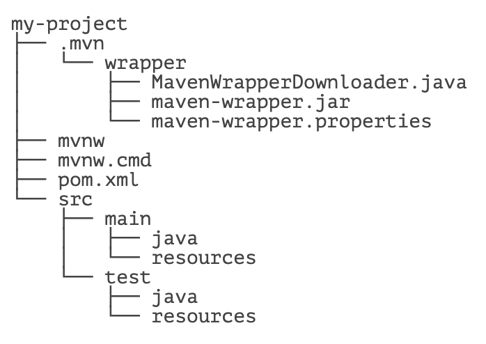

# **使用 mvnw**


我们使用 Maven 时，基本上只会用到 `mvn` 这一个命令。有些童鞋可能听说过 `mvnw`，这个是啥？

`mvnw` 是 Maven Wrapper 的缩写。因为我们安装 Maven 时，默认情况下，系统所有项目都会使用全局安装的这个 Maven 版本。但是，对于某些项目来说，它可能必须使用某个特定的 Maven 版本，这个时候，就可以使用 Maven Wrapper，它可以负责给这个特定的项目安装指定版本的 Maven，而其他项目不受影响。

简单地说，Maven Wrapper 就是给一个项目提供一个独立的，指定版本的 Maven 给它使用。

## 安装 Maven Wrapper

安装 Maven Wrapper 最简单的方式是在项目的根目录（即 `pom.xml` 所在的目录）下运行安装命令：

```bash
mvn -N io.takari:maven:0.7.6:wrapper
```

它会自动使用最新版本的 Maven。注意 `0.7.6` 是 Maven Wrapper 的版本。最新的 Maven Wrapper 版本可以去 [官方网站](https://github.com/takari/maven-wrapper) 查看。

如果要指定使用的 Maven 版本，使用下面的安装命令指定版本，例如 `3.3.3`：

```bash
mvn -N io.takari:maven:0.7.6:wrapper -Dmaven=3.3.3
```

安装后，查看项目结构：



发现多了 `mvnw`、`mvnw.cmd` 和 `.mvn` 目录，我们只需要把 `mvn` 命令改成 `mvnw` 就可以使用跟项目关联的 Maven。例如：

```bash
mvnw clean package
```

在 Linux 或 macOS 下运行时需要加上 `./`：

```bash
./mvnw clean package
```

Maven Wrapper 的另一个作用是把项目的 `mvnw`、`mvnw.cmd` 和 `.mvn` 提交到版本库中，可以使所有开发人员使用统一的 Maven 版本。

## 练习

使用 mvnw 编译 hello 项目

### 小结

使用 Maven Wrapper，可以为一个项目指定特定的 Maven 版本。

