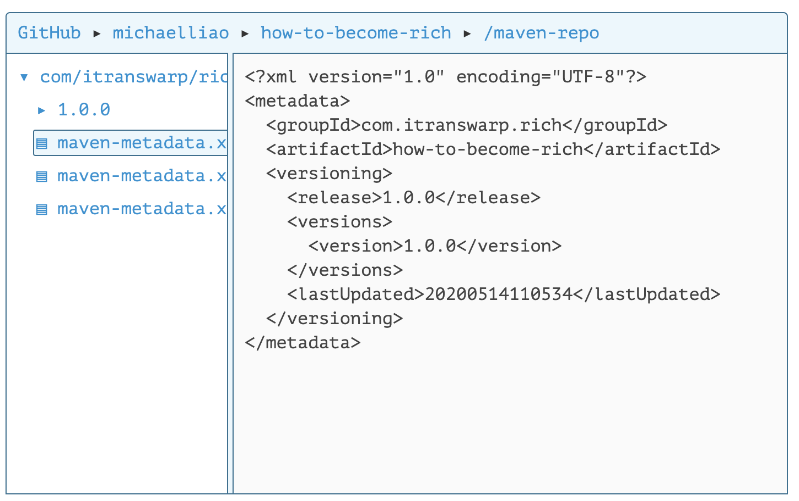
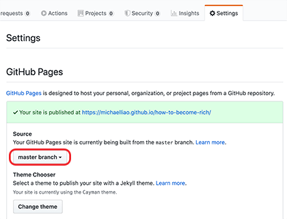
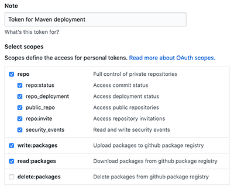
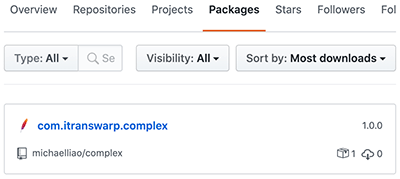

# **发布 Artifact**


当我们使用 `commons-logging` 这些第三方开源库的时候，我们实际上是通过 Maven 自动下载它的 jar 包，并根据其 `pom.xml` 解析依赖，自动把相关依赖包都下载后加入到 classpath。

那么问题来了：当我们自己写了一个牛逼的开源库时，非常希望别人也能使用，总不能直接放个 jar 包的链接让别人下载吧？

如果我们把自己的开源库放到 Maven 的 repo 中，那么，别人只需按标准引用 `groupId:artifactId:version`，即可自动下载 jar 包以及相关依赖。因此，本节我们介绍如何发布一个库到 Maven 的 repo 中。

把自己的库发布到 Maven 的 repo 中有好几种方法，我们介绍 3 种最常用的方法。

## 以静态文件发布

如果我们观察一个中央仓库的 Artifact 结构，例如 [Commons Math](https://commons.apache.org/proper/commons-math/)，它的 groupId 是 `org.apache.commons`，artifactId 是 `commons-math3`，以版本 `3.6.1` 为例，发布在中央仓库的文件夹路径就是 https://repo1.maven.org/maven2/org/apache/commons/commons-math3/3.6.1/ ，在此文件夹下，`commons-math3-3.6.1.jar` 就是发布的 jar 包，`commons-math3-3.6.1.pom` 就是它的 `pom.xml` 描述文件，`commons-math3-3.6.1-sources.jar` 是源代码，`commons-math3-3.6.1-javadoc.jar` 是文档。其它以 `.asc`、`.md5`、`.sha1` 结尾的文件分别是 GPG 签名、MD5 摘要和 SHA-1 摘要。

我们只要按照这种目录结构组织文件，它就是一个有效的 Maven 仓库。

我们以广受好评的开源项目 [how-to-become-rich](https://github.com/michaelliao/how-to-become-rich) 为例，先创建 Maven 工程目录结构如下：


在 `pom.xml` 中添加如下内容：

```xml
<project ...>
    ...
    <distributionManagement>
        <repository>
            <id>local-repo-release</id>
            <name>GitHub Release</name>
            <url>file://${project.basedir}/maven-repo</url>
        </repository>
    </distributionManagement>

    <build>
        <plugins>
            <plugin>
                <artifactId>maven-source-plugin</artifactId>
                <executions>
                    <execution>
                        <id>attach-sources</id>
                        <phase>package</phase>
                        <goals>
                            <goal>jar-no-fork</goal>
                        </goals>
                    </execution>
                </executions>
            </plugin>
            <plugin>
                <artifactId>maven-javadoc-plugin</artifactId>
                <executions>
                    <execution>
                        <id>attach-javadocs</id>
                        <phase>package</phase>
                        <goals>
                            <goal>jar</goal>
                        </goals>
                    </execution>
                </executions>
            </plugin>
        </plugins>
    </build>
</project>
```

注意到 `<distributionManagement>`，它指示了发布的软件包的位置，这里的 `<url>` 是项目根目录下的 `maven-repo` 目录，在 `<build>` 中定义的两个插件 `maven-source-plugin` 和 `maven-javadoc-plugin` 分别用来创建源码和 javadoc，如果不想发布源码，可以把对应的插件去掉。

我们直接在项目根目录下运行 Maven 命令 `mvn clean package deploy`，如果一切顺利，我们就可以在 `maven-repo` 目录下找到部署后的所有文件如下：



最后一步，是把这个工程推到 GitHub 上，并选择 `Settings`-`GitHub Pages`，选择 `master branch` 启用 Pages 服务：



这样，把全部内容推送至 GitHub 后，即可作为静态网站访问 Maven 的 repo，它的地址是 https://michaelliao.github.io/how-to-become-rich/maven-repo/ 。版本 `1.0.0` 对应的 jar 包地址是：


https://michaelliao.github.io/how-to-become-rich/maven-repo/com/itranswarp/rich/how-to-become-rich/1.0.0/how-to-become-rich-1.0.0.jar


现在，如果其他人希望引用这个 Maven 包，我们可以告知如下依赖即可：

```xml
<dependency>
    <groupId>com.itranswarp.rich</groupId>
    <artifactId>how-to-become-rich</artifactId>
    <version>1.0.0</version>
</dependency>
```

但是，除了正常导入依赖外，对方还需要再添加一个 `<repository>` 的声明，即使用方完整的 `pom.xml` 如下：

```xml
<project xmlns="http://maven.apache.org/POM/4.0.0"
    xmlns:xsi="http://www.w3.org/2001/XMLSchema-instance"
    xsi:schemaLocation="http://maven.apache.org/POM/4.0.0 http://maven.apache.org/xsd/maven-4.0.0.xsd">
    <modelVersion>4.0.0</modelVersion>

    <groupId>example</groupId>
    <artifactId>how-to-become-rich-usage</artifactId>
    <version>1.0-SNAPSHOT</version>
    <packaging>jar</packaging>

    <properties>
        <maven.compiler.source>11</maven.compiler.source>
        <maven.compiler.target>11</maven.compiler.target>
        <java.version>11</java.version>
    </properties>

    <repositories>
        <repository>
            <id>github-rich-repo</id>
            <name>The Maven Repository on Github</name>
            <url>https://michaelliao.github.io/how-to-become-rich/maven-repo/</url>
        </repository>
    </repositories>

    <dependencies>
        <dependency>
            <groupId>com.itranswarp.rich</groupId>
            <artifactId>how-to-become-rich</artifactId>
            <version>1.0.0</version>
        </dependency>
    </dependencies>
</project>
```

在 `<repository>` 中，我们必须声明发布的 Maven 的 repo 地址，其中 `<id>` 和 `<name>` 可以任意填写，`<url>` 填入 GitHub Pages 提供的地址 +`/maven-repo/` 后缀。现在，即可正常引用这个库并编写代码如下：

```java
Millionaire millionaire = new Millionaire();
System.out.println(millionaire.howToBecomeRich());
```

有的童鞋会问，为什么使用 `commons-logging` 等第三方库时，并不需要声明 repo 地址？这是因为这些库都是发布到 Maven 中央仓库的，发布到中央仓库后，不需要告诉 Maven 仓库地址，因为它知道中央仓库的地址默认是 https://repo1.maven.org/maven2/ ，也可以通过 `~/.m2/settings.xml` 指定一个代理仓库地址以替代中央仓库来提高速度（参考 [依赖管理](2.md) 的 Maven 镜像）。

因为 GitHub Pages 并不会把我们发布的 Maven 包同步到中央仓库，所以自然使用方必须手动添加一个我们提供的仓库地址。

此外，通过 GitHub Pages 发布 Maven repo 时需要注意一点，即不要改动已发布的版本。因为 Maven 的仓库是不允许修改任何版本的，对一个库进行修改的唯一方法是发布一个新版本。但是通过静态文件的方式发布 repo，实际上我们是可以修改 jar 文件的，但最好遵守规范，不要修改已发布版本。

## 通过 Nexus 发布到中央仓库

有的童鞋会问，能不能把自己的开源库发布到 Maven 的中央仓库，这样用户就不需要声明 repo 地址，可以直接引用，显得更专业。

当然可以，但我们不能直接发布到 Maven 中央仓库，而是通过曲线救国的方式，发布到 [central.sonatype.org](https://central.sonatype.org/)，它会定期自动同步到 Maven 的中央仓库。[Nexus](https://www.sonatype.com/nexus-repository-oss) 是一个支持 Maven 仓库的软件，由 Sonatype 开发，有免费版和专业版两个版本，很多大公司内部都使用 Nexus 作为自己的私有 Maven 仓库，而这个 [central.sonatype.org](https://central.sonatype.org/) 相当于面向开源的一个 Nexus 公共服务。

所以，第一步是在 [central.sonatype.org](https://central.sonatype.org/) 上注册一个账号，注册链接非常隐蔽，可以自己先找找，找半小时没找到点 [这里](javascript:showSonatypeSignUpLink()) 查看攻略。

如果注册顺利并审核通过，会得到一个登录账号，然后，通过 [这个页面](https://central.sonatype.org/pages/apache-maven.html) 一步一步操作就可以成功地将自己的 Artifact 发布到 Nexus 上，再耐心等待几个小时后，你的 Artifact 就会出现在 Maven 的中央仓库中。

这里简单提一下发布重点与难点：

- 必须正确创建 GPG 签名，Linux 和 Mac 下推荐使用 gnupg2；
- 必须在 `~/.m2/settings.xml` 中配置好登录用户名和口令，以及 GPG 口令：

```xml
<settings ...>
    ...
    <servers>
        <server>
            <id>ossrh</id>
            <username>OSSRH-USERNAME</username>
            <password>OSSRH-PASSWORD</password>
        </server>
    </servers>
    <profiles>
        <profile>
            <id>ossrh</id>
            <activation>
                <activeByDefault>true</activeByDefault>
            </activation>
            <properties>
                <gpg.executable>gpg2</gpg.executable>
                <gpg.passphrase>GPG-PASSWORD</gpg.passphrase>
            </properties>
        </profile>
    </profiles>
</settings>
```

在待发布的 Artifact 的 `pom.xml` 中添加 OSS 的 Maven repo 地址，以及 `maven-jar-plugin`、`maven-source-plugin`、`maven-javadoc-plugin`、`maven-gpg-plugin`、`nexus-staging-maven-plugin`：

```xml
<project ...>
    ...
    <distributionManagement>
        <snapshotRepository>
            <id>ossrh</id>
            <url>https://oss.sonatype.org/content/repositories/snapshots</url>
        </snapshotRepository>

        <repository>
            <id>ossrh</id>
            <name>Nexus Release Repository</name>
            <url>http://oss.sonatype.org/service/local/staging/deploy/maven2/</url>
        </repository>
    </distributionManagement>

    <build>
        <plugins>
            <plugin>
                <groupId>org.apache.maven.plugins</groupId>
                <artifactId>maven-jar-plugin</artifactId>
                <executions>
                    <execution>
                        <goals>
                            <goal>jar</goal>
                            <goal>test-jar</goal>
                        </goals>
                    </execution>
                </executions>
            </plugin>
            <plugin>
                <groupId>org.apache.maven.plugins</groupId>
                <artifactId>maven-source-plugin</artifactId>
                <executions>
                    <execution>
                        <id>attach-sources</id>
                        <goals>
                            <goal>jar-no-fork</goal>
                        </goals>
                    </execution>
                </executions>
            </plugin>
            <plugin>
                <groupId>org.apache.maven.plugins</groupId>
                <artifactId>maven-javadoc-plugin</artifactId>
                <executions>
                    <execution>
                        <id>attach-javadocs</id>
                        <goals>
                            <goal>jar</goal>
                        </goals>
                        <configuration>
                            <additionalOption>
                                <additionalOption>-Xdoclint:none</additionalOption>
                            </additionalOption>
                        </configuration>
                    </execution>
                </executions>
            </plugin>
            <plugin>
                <groupId>org.apache.maven.plugins</groupId>
                <artifactId>maven-gpg-plugin</artifactId>
                <executions>
                    <execution>
                        <id>sign-artifacts</id>
                        <phase>verify</phase>
                        <goals>
                            <goal>sign</goal>
                        </goals>
                    </execution>
                </executions>
            </plugin>
            <plugin>
                <groupId>org.sonatype.plugins</groupId>
                <artifactId>nexus-staging-maven-plugin</artifactId>
                <version>1.6.3</version>
                <extensions>true</extensions>
                <configuration>
                    <serverId>ossrh</serverId>
                    <nexusUrl>https://oss.sonatype.org/</nexusUrl>
                    <autoReleaseAfterClose>true</autoReleaseAfterClose>
                </configuration>
            </plugin>
        </plugins>
    </build>
</project>
```

最后执行命令 `mvn clean package deploy` 即可发布至 [central.sonatype.org](https://central.sonatype.org/)。

此方法前期需要复杂的申请账号和项目的流程，后期需要安装调试 GPG，但只要跑通流程，后续发布都只需要一行命令。

## 发布到私有仓库

通过 `nexus-staging-maven-plugin` 除了可以发布到 [central.sonatype.org](https://central.sonatype.org/) 外，也可以发布到私有仓库，例如，公司内部自己搭建的 Nexus 服务器。

如果没有私有 Nexus 服务器，还可以发布到 [GitHub Packages](https://github.com/features/packages)。GitHub Packages 是 GitHub 提供的仓库服务，支持 Maven、NPM、Docker 等。使用 GitHub Packages 时，无论是发布 Artifact，还是引用已发布的 Artifact，都需要明确的授权 Token，因此，GitHub Packages 只能作为私有仓库使用。

在发布前，我们必须首先登录后在用户的 `Settings`-`Developer settings`-`Personal access tokens` 中创建两个 Token，一个用于发布，一个用于使用。发布 Artifact 的 Token 必须有 `repo`、`write:packages` 和 `read:packages` 权限：



使用 Artifact 的 Token 只需要 `read:packages` 权限。

在发布端，把 GitHub 的用户名和发布 Token 写入 `~/.m2/settings.xml` 配置中：

```xml
<settings ...>
    ...
    <servers>
        <server>
            <id>github-release</id>
            <username>GITHUB-USERNAME</username>
            <password>f052...c21f</password>
        </server>
    </servers>
</settings>
```

然后，在需要发布的 Artifact 的 `pom.xml` 中，添加一个 `<repository>` 声明：

```xml
<project ...>
    ...
    <distributionManagement>
        <repository>
            <id>github-release</id>
            <name>GitHub Release</name>
            <url>https://maven.pkg.github.com/michaelliao/complex</url>
        </repository>
    </distributionManagement>
</project>
```

注意到 `<id>` 和 `~/.m2/settings.xml` 配置中的 `<id>` 要保持一致，因为发布时 Maven 根据 id 找到用于登录的用户名和 Token，才能成功上传文件到 GitHub。我们直接通过命令 `mvn clean package deploy` 部署，成功后，在 GitHub 用户页面可以看到该 Artifact：



完整的配置请参考 [complex](https://github.com/michaelliao/complex/) 项目，这是一个非常简单的支持复数运算的库。

使用该 Artifact 时，因为 GitHub 的 Package 只能作为私有仓库使用，所以除了在使用方的 `pom.xml` 中声明 `<repository>` 外：

```xml
<project ...>
    ...
    <repositories>
        <repository>
            <id>github-release</id>
            <name>GitHub Release</name>
            <url>https://maven.pkg.github.com/michaelliao/complex</url>
        </repository>
    </repositories>

    <dependencies>
        <dependency>
            <groupId>com.itranswarp</groupId>
            <artifactId>complex</artifactId>
            <version>1.0.0</version>
        </dependency>
    </dependencies>
    ...
</project>
```

还需要把有读权限的 Token 配置到 `~/.m2/settings.xml` 文件中。

## 练习

使用 maven-deploy-plugin 把 Artifact 发布到本地。

## 小结

使用 Maven 发布一个 Artifact 时：

- 可以发布到本地，然后推送到远程 Git 库，由静态服务器提供基于网页的 repo 服务，使用方必须声明 repo 地址；
- 可以发布到 [central.sonatype.org](https://central.sonatype.org/)，并自动同步到 Maven 中央仓库，需要前期申请账号以及本地配置；
- 可以发布到 GitHub Packages 作为私有仓库使用，必须提供 Token 以及正确的权限才能发布和使用。

