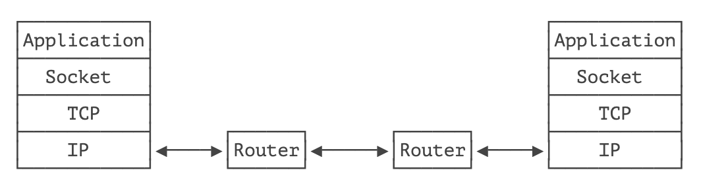
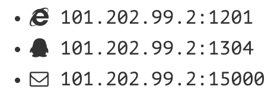

# **TCP 编程**


在开发网络应用程序的时候，我们又会遇到 Socket 这个概念。Socket 是一个抽象概念，一个应用程序通过一个 Socket 来建立一个远程连接，而 Socket 内部通过 TCP/IP 协议把数据传输到网络：



Socket、TCP 和部分 IP 的功能都是由操作系统提供的，不同的编程语言只是提供了对操作系统调用的简单的封装。例如，Java 提供的几个 Socket 相关的类就封装了操作系统提供的接口。

*为什么需要 Socket 进行网络通信？* 

> 因为仅仅通过 IP 地址进行通信是不够的，同一台计算机同一时间会运行多个网络应用程序，例如浏览器、QQ、邮件客户端等。当操作系统接收到一个数据包的时候，如果只有 IP 地址，它没法判断应该发给哪个应用程序，所以，操作系统抽象出 Socket 接口，每个应用程序需要各自对应到不同的 Socket，数据包才能根据 Socket 正确地发到对应的应用程序。

一个 Socket 就是由 IP 地址和端口号（范围是 0～65535）组成，可以把 Socket 简单理解为 IP 地址加端口号。端口号总是由操作系统分配，它是一个 0～65535 之间的数字，其中，小于 1024 的端口属于 *特权端口*，需要管理员权限，大于 1024 的端口可以由任意用户的应用程序打开。



使用 Socket 进行网络编程时，本质上就是两个进程之间的网络通信。其中一个进程必须充当服务器端，它会主动监听某个指定的端口，另一个进程必须充当客户端，它必须主动连接服务器的 IP 地址和指定端口，如果连接成功，服务器端和客户端就成功地建立了一个 TCP 连接，双方后续就可以随时发送和接收数据。

因此，当 Socket 连接成功地在服务器端和客户端之间建立后：

- 对服务器端来说，它的 Socket 是指定的 IP 地址和指定的端口号；
- 对客户端来说，它的 Socket 是它所在计算机的 IP 地址和一个由操作系统分配的随机端口号。

## 服务器端

要使用 Socket 编程，我们首先要编写服务器端程序。Java 标准库提供了 `ServerSocket` 来实现对指定 IP 和指定端口的监听。`ServerSocket` 的典型实现代码如下：

```java
public class Server {
    public static void main(String[] args) throws IOException {
        ServerSocket ss = new ServerSocket(6666); // 监听指定端口
        System.out.println("server is running...");
        for (;;) {
            Socket sock = ss.accept();
            System.out.println("connected from" + sock.getRemoteSocketAddress());
            Thread t = new Handler(sock);
            t.start();
        }
    }
}

class Handler extends Thread {
    Socket sock;

    public Handler(Socket sock) {
        this.sock = sock;
    }

    @Override
    public void run() {
        try (InputStream input = this.sock.getInputStream()) {
            try (OutputStream output = this.sock.getOutputStream()) {
                handle(input, output);
            }
        } catch (Exception e) {
            try {
                this.sock.close();
            } catch (IOException ioe) {
            }
            System.out.println("client disconnected.");
        }
    }

    private void handle(InputStream input, OutputStream output) throws IOException {
        var writer = new BufferedWriter(new OutputStreamWriter(output, StandardCharsets.UTF_8));
        var reader = new BufferedReader(new InputStreamReader(input, StandardCharsets.UTF_8));
        writer.write("hello\n");
        writer.flush();
        for (;;) {
            String s = reader.readLine();
            if (s.equals("bye")) {
                writer.write("bye\n");
                writer.flush();
                break;
            }
            writer.write("ok:" + s + "\n");
            writer.flush();
        }
    }
}
```

服务器端通过代码：

```java
ServerSocket ss = new ServerSocket(6666);
```

在指定端口 `6666` 监听。这里我们没有指定 IP 地址，表示在计算机的所有网络接口上进行监听。

如果 `ServerSocket` 监听成功，我们就使用一个无限循环来处理客户端的连接：

```java
for (;;) {
    Socket sock = ss.accept();
    Thread t = new Handler(sock);
    t.start();
}
```

注意到代码 `ss.accept()` 表示每当有新的客户端连接进来后，就返回一个 `Socket` 实例，这个 `Socket` 实例就是用来和刚连接的客户端进行通信的。由于客户端很多，要实现并发处理，我们就必须为每个新的 `Socket` 创建一个新线程来处理，这样，主线程的作用就是接收新的连接，每当收到新连接后，就创建一个新线程进行处理。

我们在多线程编程的章节中介绍过线程池，这里也完全可以利用线程池来处理客户端连接，能大大提高运行效率。

如果没有客户端连接进来，`accept()` 方法会阻塞并一直等待。如果有多个客户端同时连接进来，`ServerSocket` 会把连接扔到队列里，然后一个一个处理。对于 Java 程序而言，只需要通过循环不断调用 `accept()` 就可以获取新的连接。

## 客户端

相比服务器端，客户端程序就要简单很多。一个典型的客户端程序如下：

```java
public class Client {
    public static void main(String[] args) throws IOException {
        Socket sock = new Socket("localhost", 6666); // 连接指定服务器和端口
        try (InputStream input = sock.getInputStream()) {
            try (OutputStream output = sock.getOutputStream()) {
                handle(input, output);
            }
        }
        sock.close();
        System.out.println("disconnected.");
    }

    private static void handle(InputStream input, OutputStream output) throws IOException {
        var writer = new BufferedWriter(new OutputStreamWriter(output, StandardCharsets.UTF_8));
        var reader = new BufferedReader(new InputStreamReader(input, StandardCharsets.UTF_8));
        Scanner scanner = new Scanner(System.in);
        System.out.println("[server]" + reader.readLine());
        for (;;) {
            System.out.print(">>>"); // 打印提示
            String s = scanner.nextLine(); // 读取一行输入
            writer.write(s);
            writer.newLine();
            writer.flush();
            String resp = reader.readLine();
            System.out.println("<<<" + resp);
            if (resp.equals("bye")) {
                break;
            }
        }
    }
}
```

客户端程序通过：

```java
Socket sock = new Socket("localhost", 6666);
```

连接到服务器端，注意上述代码的服务器地址是 `"localhost"`，表示本机地址，端口号是 `6666`。如果连接成功，将返回一个 `Socket` 实例，用于后续通信。

## Socket 流

当 Socket 连接创建成功后，无论是服务器端，还是客户端，我们都使用 `Socket` 实例进行网络通信。因为 TCP 是一种基于流的协议，因此，Java 标准库使用 `InputStream` 和 `OutputStream` 来封装 Socket 的数据流，这样我们使用 Socket 的流，和普通 IO 流类似：

```java
// 用于读取网络数据:
InputStream in = sock.getInputStream();
// 用于写入网络数据:
OutputStream out = sock.getOutputStream();
```

最后我们重点来看看，为什么写入网络数据时，要调用 `flush()` 方法。

如果不调用 `flush()`，我们很可能会发现，客户端和服务器都收不到数据，这并不是 Java 标准库的设计问题，而是我们以流的形式写入数据的时候，并不是一写入就立刻发送到网络，而是先写入内存缓冲区，直到缓冲区满了以后，才会一次性真正发送到网络，这样设计的目的是为了提高传输效率。如果缓冲区的数据很少，而我们又想强制把这些数据发送到网络，就必须调用 `flush()` 强制把缓冲区数据发送出去。

## 练习

使用 Socket 实现服务器和客户端通信

## 小结

使用 Java 进行 TCP 编程时，需要使用 Socket 模型：

- 服务器端用 `ServerSocket` 监听指定端口；
- 客户端使用 `Socket(InetAddress, port)` 连接服务器；
- 服务器端用 `accept()` 接收连接并返回 `Socket`；
- 双方通过 `Socket` 打开 `InputStream`/`OutputStream` 读写数据；
- 服务器端通常使用多线程同时处理多个客户端连接，利用线程池可大幅提升效率；
- `flush()` 用于强制输出缓冲区到网络。


