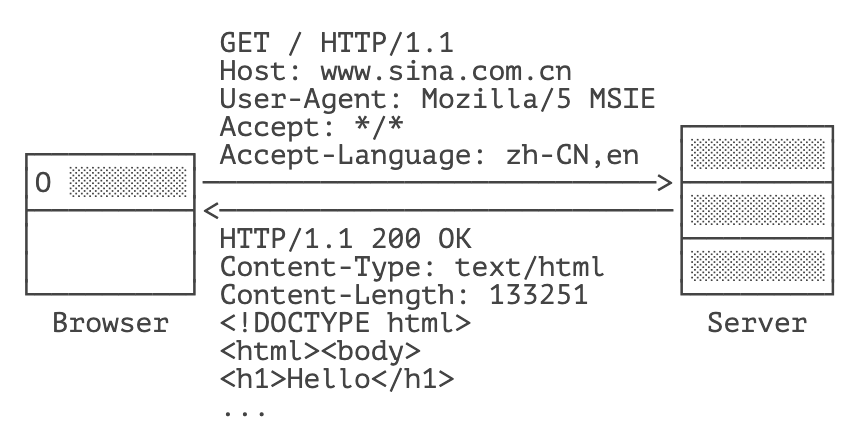
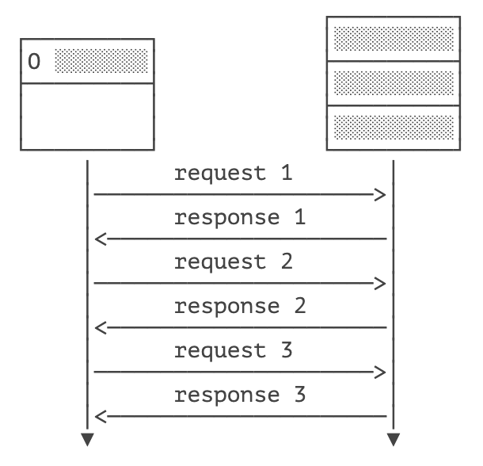
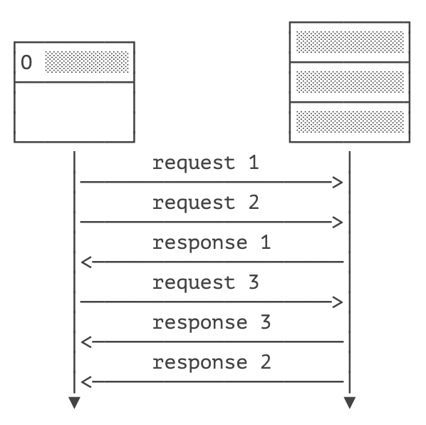

# **HTTP 编程**


什么是 HTTP？HTTP 就是目前使用最广泛的 Web 应用程序使用的基础协议，例如，浏览器访问网站，手机 App 访问后台服务器，都是通过 HTTP 协议实现的。

HTTP 是 HyperText Transfer Protocol 的缩写，翻译为超文本传输协议，它是基于 TCP 协议之上的一种请求 - 响应协议。

我们来看一下浏览器请求访问某个网站时发送的 HTTP 请求 - 响应。当浏览器希望访问某个网站时，浏览器和网站服务器之间首先建立 TCP 连接，且服务器总是使用 `80` 端口和加密端口 `443`，然后，浏览器向服务器发送一个 HTTP 请求，服务器收到后，返回一个 HTTP 响应，并且在响应中包含了 HTML 的网页内容，这样，浏览器解析 HTML 后就可以给用户显示网页了。一个完整的 HTTP 请求 - 响应如下：



HTTP 请求的格式是固定的，它由 HTTP Header 和 HTTP Body 两部分构成。第一行总是 ` 请求方法 路径 HTTP 版本 `，例如，`GET / HTTP/1.1` 表示使用 `GET` 请求，路径是 `/`，版本是 `HTTP/1.1`。

后续的每一行都是固定的 `Header: Value` 格式，我们称为 HTTP Header，服务器依靠某些特定的 Header 来识别客户端请求，例如：

- Host：表示请求的域名，因为一台服务器上可能有多个网站，因此有必要依靠 Host 来识别请求是发给哪个网站的；
- User-Agent：表示客户端自身标识信息，不同的浏览器有不同的标识，服务器依靠 User-Agent 判断客户端类型是 IE 还是 Chrome，是 Firefox 还是一个 Python 爬虫；
- Accept：表示客户端能处理的 HTTP 响应格式，`*/*` 表示任意格式，`text/*` 表示任意文本，`image/png` 表示 PNG 格式的图片；
- Accept-Language：表示客户端接收的语言，多种语言按优先级排序，服务器依靠该字段给用户返回特定语言的网页版本。

如果是 `GET` 请求，那么该 HTTP 请求只有 HTTP Header，没有 HTTP Body。如果是 `POST` 请求，那么该 HTTP 请求带有 Body，以一个空行分隔。一个典型的带 Body 的 HTTP 请求如下：

```
POST /login HTTP/1.1
Host: www.example.com
Content-Type: application/x-www-form-urlencoded
Content-Length: 30

username=hello&password=123456
```

`POST` 请求通常要设置 `Content-Type` 表示 Body 的类型，`Content-Length` 表示 Body 的长度，这样服务器就可以根据请求的 Header 和 Body 做出正确的响应。

此外，`GET` 请求的参数必须附加在 URL 上，并以 URLEncode 方式编码，例如：`http://www.example.com/?a=1&b=K%26R`，参数分别是 `a=1` 和 `b=K&R`。因为 URL 的长度限制，`GET` 请求的参数不能太多，而 `POST` 请求的参数就没有长度限制，因为 `POST` 请求的参数必须放到 Body 中。并且，`POST` 请求的参数不一定是 URL 编码，可以按任意格式编码，只需要在 `Content-Type` 中正确设置即可。常见的发送 JSON 的 `POST` 请求如下：

```
POST /login HTTP/1.1
Content-Type: application/json
Content-Length: 38

{"username":"bob","password":"123456"}
```

HTTP 响应也是由 Header 和 Body 两部分组成，一个典型的 HTTP 响应如下：

```html
HTTP/1.1 200 OK
Content-Type: text/html
Content-Length: 133251

<!DOCTYPE html>
<html><body>
<h1>Hello</h1>
...
```

响应的第一行总是 `HTTP 版本 响应代码 响应说明 `，例如，`HTTP/1.1 200 OK` 表示版本是 `HTTP/1.1`，响应代码是 `200`，响应说明是 `OK`。客户端只依赖响应代码判断 HTTP 响应是否成功。HTTP 有固定的响应代码：

- 1xx：表示一个提示性响应，例如 101 表示将切换协议，常见于 WebSocket 连接；
- 2xx：表示一个成功的响应，例如 200 表示成功，206 表示只发送了部分内容；
- 3xx：表示一个重定向的响应，例如 301 表示永久重定向，303 表示客户端应该按指定路径重新发送请求；
- 4xx：表示一个因为客户端问题导致的错误响应，例如 400 表示因为 Content-Type 等各种原因导致的无效请求，404 表示指定的路径不存在；
- 5xx：表示一个因为服务器问题导致的错误响应，例如 500 表示服务器内部故障，503 表示服务器暂时无法响应。

当浏览器收到第一个 HTTP 响应后，它解析 HTML 后，又会发送一系列 HTTP 请求，例如，`GET /logo.jpg HTTP/1.1` 请求一个图片，服务器响应图片请求后，会直接把二进制内容的图片发送给浏览器：

```
HTTP/1.1 200 OK
Content-Type: image/jpeg
Content-Length: 18391

????JFIFHH??XExifMM?i&??X?...(二进制的 JPEG 图片)
```

因此，服务器总是被动地接收客户端的一个 HTTP 请求，然后响应它。客户端则根据需要发送若干个 HTTP 请求。

对于最早期的 HTTP/1.0 协议，每次发送一个 HTTP 请求，客户端都需要先创建一个新的 TCP 连接，然后，收到服务器响应后，关闭这个 TCP 连接。由于建立 TCP 连接就比较耗时，因此，为了提高效率，HTTP/1.1 协议允许在一个 TCP 连接中反复发送 - 响应，这样就能大大提高效率：



因为 HTTP 协议是一个请求 - 响应协议，客户端在发送了一个 HTTP 请求后，必须等待服务器响应后，才能发送下一个请求，这样一来，如果某个响应太慢，它就会堵住后面的请求。

所以，为了进一步提速，HTTP/2.0 允许客户端在没有收到响应的时候，发送多个 HTTP 请求，服务器返回响应的时候，不一定按顺序返回，只要双方能识别出哪个响应对应哪个请求，就可以做到并行发送和接收：



可见，HTTP/2.0 进一步提高了效率。

## HTTP 编程

既然 HTTP 涉及到客户端和服务器端，和 TCP 类似，我们也需要针对客户端编程和针对服务器端编程。

本节我们不讨论服务器端的 HTTP 编程，因为服务器端的 HTTP 编程本质上就是编写 Web 服务器，这是一个非常复杂的体系，也是 JavaEE 开发的核心内容，我们在后面的章节再仔细研究。

本节我们只讨论作为客户端的 HTTP 编程。

因为浏览器也是一种 HTTP 客户端，所以，客户端的 HTTP 编程，它的行为本质上和浏览器是一样的，即发送一个 HTTP 请求，接收服务器响应后，获得响应内容。只不过浏览器进一步把响应内容解析后渲染并展示给了用户，而我们使用 Java 进行 HTTP 客户端编程仅限于获得响应内容。

我们来看一下 Java 如何使用 HTTP 客户端编程。

Java 标准库提供了基于 HTTP 的包，但是要注意，早期的 JDK 版本是通过 `HttpURLConnection` 访问 HTTP，典型代码如下：

```java
URL url = new URL("http://www.example.com/path/to/target?a=1&b=2");
HttpURLConnection conn = (HttpURLConnection) url.openConnection();
conn.setRequestMethod("GET");
conn.setUseCaches(false);
conn.setConnectTimeout(5000); // 请求超时 5 秒
// 设置 HTTP 头:
conn.setRequestProperty("Accept", "*/*");
conn.setRequestProperty("User-Agent", "Mozilla/5.0 (compatible; MSIE 11; Windows NT 5.1)");
// 连接并发送 HTTP 请求:
conn.connect();
// 判断 HTTP 响应是否 200:
if (conn.getResponseCode() != 200) {
    throw new RuntimeException("bad response");
}
// 获取所有响应 Header:
Map<String, List<String>> map = conn.getHeaderFields();
for (String key : map.keySet()) {
    System.out.println(key + ":" + map.get(key));
}
// 获取响应内容:
InputStream input = conn.getInputStream();
...
```

上述代码编写比较繁琐，并且需要手动处理 `InputStream`，所以用起来很麻烦。

从 Java 11 开始，引入了新的 `HttpClient`，它使用链式调用的 API，能大大简化 HTTP 的处理。

我们来看一下如何使用新版的 `HttpClient`。首先需要创建一个全局 `HttpClient` 实例，因为 `HttpClient` 内部使用线程池优化多个 HTTP 连接，可以复用：

```java
static HttpClient httpClient = HttpClient.newBuilder().build();
```

使用 `GET` 请求获取文本内容代码如下：

```java
import java.net.URI;
import java.net.http.*;
import java.net.http.HttpClient.Version;
import java.time.Duration;
import java.util.*;

public class Main {
    // 全局 HttpClient:
    static HttpClient httpClient = HttpClient.newBuilder().build();

    public static void main(String[] args) throws Exception {
        String url = "https://www.sina.com.cn/";
        HttpRequest request = HttpRequest.newBuilder(new URI(url))
            // 设置 Header:
            .header("User-Agent", "Java HttpClient").header("Accept", "*/*")
            // 设置超时:
            .timeout(Duration.ofSeconds(5))
            // 设置版本:
            .version(Version.HTTP_2).build();
        HttpResponse<String> response = httpClient.send(request, HttpResponse.BodyHandlers.ofString());
        // HTTP 允许重复的 Header，因此一个 Header 可对应多个 Value:
        Map<String, List<String>> headers = response.headers().map();
        for (String header : headers.keySet()) {
            System.out.println(header + ":" + headers.get(header).get(0));
        }
        System.out.println(response.body().substring(0, 1024) + "...");
    }
}
```

如果我们要获取图片这样的二进制内容，只需要把 `HttpResponse.BodyHandlers.ofString()` 换成 `HttpResponse.BodyHandlers.ofByteArray()`，就可以获得一个 `HttpResponse<byte[]>` 对象。如果响应的内容很大，不希望一次性全部加载到内存，可以使用 `HttpResponse.BodyHandlers.ofInputStream()` 获取一个 `InputStream` 流。

要使用 `POST` 请求，我们要准备好发送的 Body 数据并正确设置 `Content-Type`：

```java
String url = "http://www.example.com/login";
String body = "username=bob&password=123456";
HttpRequest request = HttpRequest.newBuilder(new URI(url))
    // 设置 Header:
    .header("Accept", "*/*")
    .header("Content-Type", "application/x-www-form-urlencoded")
    // 设置超时:
    .timeout(Duration.ofSeconds(5))
    // 设置版本:
    .version(Version.HTTP_2)
    // 使用 POST 并设置 Body:
    .POST(BodyPublishers.ofString(body, StandardCharsets.UTF_8)).build();
HttpResponse<String> response = httpClient.send(request, HttpResponse.BodyHandlers.ofString());
String s = response.body();
```

可见发送 `POST` 数据也十分简单。

## 练习

使用 HttpClient

## 小结

Java 提供了 `HttpClient` 作为新的 HTTP 客户端编程接口用于取代老的 `HttpURLConnection` 接口；

`HttpClient` 使用链式调用并通过内置的 `BodyPublishers` 和 `BodyHandlers` 来更方便地处理数据。

