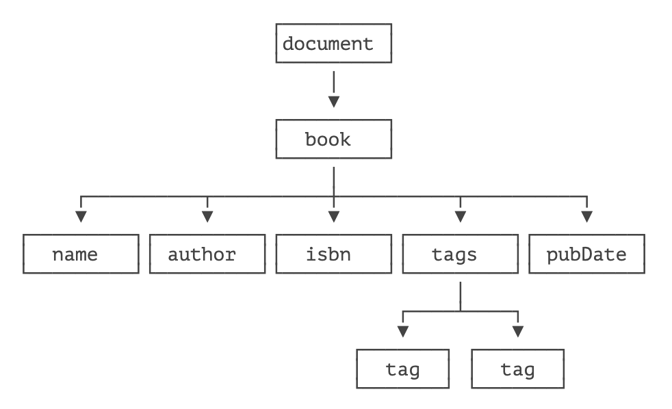

# **使用 DOM**

因为 XML 是一种树形结构的文档，它有两种标准的解析 API：

- DOM：一次性读取 XML，并在内存中表示为树形结构；
- SAX：以流的形式读取 XML，使用事件回调。

我们先来看如何使用 DOM 来读取 XML。

DOM 是 Document Object Model 的缩写，DOM 模型就是把 XML 结构作为一个树形结构处理，从根节点开始，每个节点都可以包含任意个子节点。

我们以下面的 XML 为例：

```xml
<?xml version="1.0" encoding="UTF-8" ?>
<book id="1">
    <name>Java 核心技术 </name>
    <author>Cay S. Horstmann</author>
    <isbn lang="CN">1234567</isbn>
    <tags>
        <tag>Java</tag>
        <tag>Network</tag>
    </tags>
    <pubDate/>
</book>
```

如果解析为 DOM 结构，它大概长这样：



注意到最顶层的 document 代表 XML 文档，它是真正的 “根”，而 `<book>` 虽然是根元素，但它是 `document` 的一个子节点。

Java 提供了 DOM API 来解析 XML，它使用下面的对象来表示 XML 的内容：

- Document：代表整个 XML 文档；
- Element：代表一个 XML 元素；
- Attribute：代表一个元素的某个属性。

使用 DOM API 解析一个 XML 文档的代码如下：

```java
InputStream input = Main.class.getResourceAsStream("/book.xml");
DocumentBuilderFactory dbf = DocumentBuilderFactory.newInstance();
DocumentBuilder db = dbf.newDocumentBuilder();
Document doc = db.parse(input);
```

`DocumentBuilder.parse()` 用于解析一个 XML，它可以接收 InputStream，File 或者 URL，如果解析无误，我们将获得一个 Document 对象，这个对象代表了整个 XML 文档的树形结构，需要遍历以便读取指定元素的值：

```java
void printNode(Node n, int indent) {
    for (int i = 0; i < indent; i++) {
        System.out.print(' ');
    }
    switch (n.getNodeType()) {
    case Node.DOCUMENT_NODE: // Document 节点
        System.out.println("Document:" + n.getNodeName());
        break;
    case Node.ELEMENT_NODE: // 元素节点
        System.out.println("Element:" + n.getNodeName());
        break;
    case Node.TEXT_NODE: // 文本
        System.out.println("Text:" + n.getNodeName() + "=" + n.getNodeValue());
        break;
    case Node.ATTRIBUTE_NODE: // 属性
        System.out.println("Attr:" + n.getNodeName() + "=" + n.getNodeValue());
        break;
    default: // 其他
        System.out.println("NodeType:" + n.getNodeType() + ", NodeName:" + n.getNodeName());
    }
    for (Node child = n.getFirstChild(); child != null; child = child.getNextSibling()) {
        printNode(child, indent + 1);
    }
}
```

解析结构如下：

```bash
Document: #document
 Element: book
  Text: #text =

  Element: name
   Text: #text = Java 核心技术
  Text: #text =

  Element: author
   Text: #text = Cay S. Horstmann
  Text: #text =
  ...
```

对于 DOM API 解析出来的结构，我们从根节点 Document 出发，可以遍历所有子节点，获取所有元素、属性、文本数据，还可以包括注释，这些节点被统称为 Node，每个 Node 都有自己的 Type，根据 Type 来区分一个 Node 到底是元素，还是属性，还是文本，等等。

使用 DOM API 时，如果要读取某个元素的文本，需要访问它的 Text 类型的子节点，所以使用起来还是比较繁琐的。

## 练习

使用 DOM 解析 XML

## 小结

Java 提供的 DOM API 可以将 XML 解析为 DOM 结构，以 Document 对象表示；

DOM 可在内存中完整表示 XML 数据结构；

DOM 解析速度慢，内存占用大。


