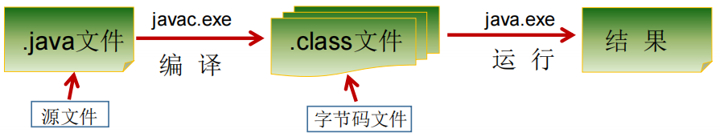
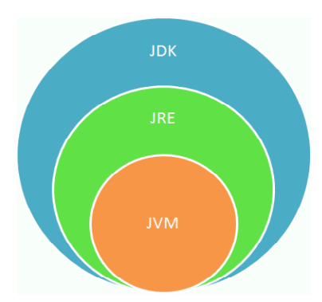
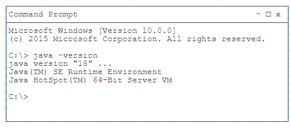
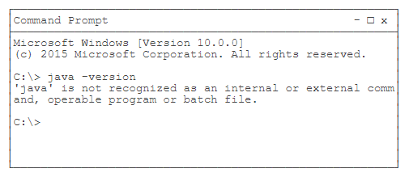
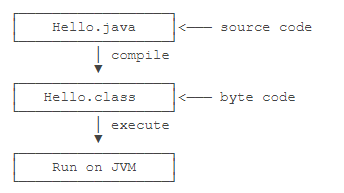

#

---

# **软件开发介绍**

$ 软件 = 系统软件（操作系统）+ 应用软件 $

?> 软件：一系列按照特定顺寻组织的计算机数据和指令的集合。

人机交互方式：图形化界面（GUI）、命令行方式（CLI）

GUI：施乐 → 苹果 → 微软

$ 应用程序 = 算法 + 数据结构 $

> [!NOTE]
> 常用的 DOS 命令命令
> - `dir`（directory）: 列出当前目录下的文件以及文件夹
> - `md`（make directory）: 创建目录
> - `rd`（remove directory） : 删除目录（非空无法删除，先使用 `del` ，再 `rd` ）
> - `cd + 路径` : 进入指定目录
> - `cd..` : 退回到上一级目录
> - `cd\\` : 退回到根目录
> - `del` : 删除文件（及目录下的文件）
> - `exit` : 退出 dos 命令行


## 计算机编程语言介绍

?> C, C++, Java, PHP, Kotlin（安卓）, Python（人工智能）, Scala（大数据）等

$ 机器语言（二进制代码） → 汇编语言 → 高级语言（面向过程 → 面向对象）$


## Java 语言概述

> [!NOTE]
> SUN（Stanford University Network，1995）  
> 后台开发：Java、PHP、Python、Go、Node.js
> - 2004，JDK 1.5（5.0）里程碑版本
> - 2005，J2SE → JavaSE，J2EE → JavaEE → J2ME → JavaME
> - 2009，Oracle 收购SUN
> - 2014，JDK 8.0

- JavaSE（Java Standard Edition）标准版——桌面级应用（应用程序）

- JavaEE（Java Enterprise Edition）企业版
  - 应用方向：企业级应用 + Android 平台应用 + 大数据平台开发


## Java 程序运行机制及运行过程

### 1. 特点：
   - 面向对象
     - ***类、对象***
     - ***封装、继承、多态***
   - 健壮性
   - 跨平台性（可以在不同的系统平台上运行: JVM 负责 Java 程序在该系统的运行）

### 2. Java 的两种核心机制：

- ***JVM*** 
   - Java 虚拟机（Java Virtal Machine）
	- 它只认识 `xxx.class` 这种类型的文件，它能够将 class 文件中的字节码指令进行识别并调用操作系统向上的 API 完成动作
- ***垃圾收集机制***（Garbage Collection）
   - 回收不再使用的内存空间会出现内存泄漏和内存溢出


---


# **安装 JDK**


## JDK (Java Development Kit) 

Java 开发工具包开发工具包（ JRE + 开发工具）（有编译）

## JRE (Java Runtime Environment)

Java 运行环境（没编译） 



!> $JDK = JRE + 开发工具集（例如 Javac 编译工具等）$  
$JRE = JVM + Java SE 标准类库$



> [!WARNING] 
> $ JDK > JRE > JVM $


> [!TIP]
> JDK 目录：
> - `bin` : 命令，javac.exe（编译），java.exe（解释运行），javadoc.exe（生成一个以网页形式存在的文档），jar.exe
> - `db` : 数据库
> - `include` : C 语言编写的头文件
> - `jre` : 运行环境
> - `lib` : 函数，jar 包
> - `src.zip` : Java 开源代码 
> - `logs` : 日志文件
> - `config` : 配置文件


## 下载 JDK

下载地址：[Oracle](https://www.oracle.com/java/technologies/javase-downloads.html) 

找到 Java SE 21 的下载链接 JDK Download，下载安装即可。

> 选择合适的操作系统与安装包，找到 Java SE 21 的下载链接 Download，下载安装即可。Windows 优先选 x64 MSI Installer，Linux 和 macOS 要根据自己电脑的 CPU 是 ARM 还是 x86 选择合适的安装包。


## 设置环境变量

!> 配置环境变量的目的是为了 Windows 操作系统执行命令时，在控制台的任何文件路径下，都可以调用 JDK 指定目录下的所有指令。 		

1. 安装完 JDK 后，需要设置一个 JAVA_HOME 的环境变量，它指向 JDK 的安装目录。

    在 Windows 下，它是安装目录，类似：

    `C:\Program Files\Java\jdk-18`

    在 Mac 下，它在 `~/.bash_profile` 或 `~/.zprofile` 里，它是：

    `export JAVA_HOME='/usr/libexec/java_home -v 18'`

2. 然后，把 JAVA_HOME 的 bin 目录附加到系统环境变量 PATH 上。在 Windows 下，它长这样：

    `Path=%JAVA_HOME%\bin;<现有的其他路径>`

    在 Mac 下，它在 `~/.bash_profile` 或 `~/.zprofile` 里，长这样：

    `export PATH=$JAVA_HOME/bin:$PATH`

    把 JAVA_HOME 的 bin 目录添加到 PATH 中是为了在任意文件夹下都可以运行 Java 。

3. 打开命令提示符窗口，输入命令 `java -version`，如果一切正常，你会看到如下输出：

    

    如果你看到的版本号不是 18，而是 15、1.8 之类，说明系统存在多个 JDK，且默认 JDK 不是 JDK 18，需要把 JDK 18 提到 PATH 前面。

    如果你得到一个错误输出：

    

    这是因为系统无法找到 Java 虚拟机的程序 `java.exe` ，需要检查 JAVA_HOME 和 PATH 的配置。

    可以参考如何设置或更改 PATH 系统变量。


---


# **第一个 Java 程序**

## Hello World

我们来编写第一个 Java 程序。

打开文本编辑器，输入以下代码：

```java
public class Hello {
    public static void main(String[] args) {
        System.out.println("Hello, world!");
    }
}
```

在一个 Java 程序中，你总能找到一个类似：

```java
public class Hello {
    ...
}
```

的定义，这个定义被称为 class（类），这里的类名是 `Hello`，大小写敏感，`class` 用来定义一个类，`public` 表示这个类是公开的，`public`、`class` 都是 Java 的关键字，必须小写，`Hello` 是类的名字，按照习惯，首字母 `H` 要大写。而花括号 `{}` 中间则是类的定义。

注意到类的定义中，我们定义了一个名为 `main` 的方法：

```java
public static void main(String[] args) {
    ...
}
```

方法是可执行的代码块，一个方法除了方法名 `main`，还有用 `()` 括起来的方法参数，这里的 `main` 方法有一个参数，参数类型是 `String[]`，参数名是 `args`，`public`、`static`用来修饰方法，这里表示它是一个公开的静态方法，`void` 是方法的返回类型，而花括号 `{}` 中间的就是方法的代码。

方法的代码每一行用 `;` 结束，这里只有一行代码，就是：

```java
System.out.println("Hello, world!");
```

它用来打印一个字符串到屏幕上。

Java 规定，某个类定义的 `public static void main(String[] args)` 是 Java 程序的固定入口方法，因此，***Java 程序总是从 `main` 方法开始执行***。

注意到 Java 源码的缩进不是必须的，但是用缩进后，格式好看，很容易看出代码块的开始和结束，缩进一般是 4 个空格或者一个 tab 。

最后，当我们把代码保存为文件时，文件名必须是 `Hello.java`，而且文件名也要注意大小写，因为要和我们定义的类名 `Hello` 完全保持一致。


## 如何执行 Java 程序

Java 源码本质上是一个文本文件，我们需要先用 `javac` 把 `Hello.java` 编译成字节码文件 `Hello.class`，然后，用 `java` 命令执行这个字节码文件：



因此，可执行文件 `javac` 是编译器，而可执行文件 `java` 就是虚拟机。

***第一步***，在保存 `Hello.java` 的目录下执行命令 `javac Hello.java`：

```
$ javac Hello.java
```

如果源代码无误，上述命令不会有任何输出，而当前目录下会产生一个 `Hello.class` 文件：

```
$ ls
Hello.class	Hello.java
```

***第二步***，执行 `Hello.class`，使用命令 `java Hello`：

```
$ java Hello
Hello, world!
```

> [!ATTENTION]
> 给虚拟机传递的参数 `Hello` 是我们定义的类名，虚拟机自动查找对应的 `class` 文件并执行。


## 对第一个 Java 程序进行总结：

1. Java 程序-编译-运行的过程
   - 编写：我们将编写的 Java 代码保存在以 `.java` 结尾的源文件中
   - 编译：使用 `javac` 命令编译我们的 Java 源文件。
     - 格式： `javac 源文件名.java`
   - 运行：使用 `java` 命令解释运行我们的字节码文件。 
     - 格式： `java 类名`
2. 在一个 Java 源文件中可以声明多个 `class` ，但是 ***最多只能有一个类声明为 `public` 的***。
   - 而且要求声明为 `public` 的类的类名必须与源文件名相同。
3. 程序的入口是 `main()` 方法。格式是固定的。
4. 输出语句：
   - `System.out.println();`先输出数据，然后换行
   - `System.out.print();`只输出数据
5. 每一行执行语句都以 `;` 结束。
6. 编译的过程：
	- 编译以后，会生成一个或多个字节码文件。
	- 字节码文件的文件名与 Java 源文件中的类名相同。


## * Java API 文档

?> API （Application Programming Interface，应用程序编程接口）是 Java 提供的基本编程接口。

Java 语言提供了大量的基础类，因此 Oracle 也为这些基础类提供了相应的 API 文档，
用于告诉开发者如何使用这些类，以及这些类里包含的方法。 

[下载API](http://www.oracle.com/technetwork/java/javase/downloads/index.html)


---


# **使用 IDE**

## IDE

IDE是集成开发环境： Integrated Development Environment 的缩写。

使用 IDE 的好处在于，可以把编写代码、组织项目、编译、运行、调试等放到一个环境中运行，能极大地提高开发效率。

IDE 提升开发效率主要靠以下几点：
  - 编辑器的自动提示，可以大大提高敲代码的速度；
  - 代码修改后可以自动重新编译，并直接运行；
  - 可以方便地进行断点调试。

目前，流行的用于 Java 开发的 IDE 有：

### Eclipse

Eclipse 是由 IBM 开发并捐赠给开源社区的一个 IDE ，也是目前应用最广泛的 IDE 。 Eclipse 的特点是它本身是 Java 开发的，并且基于插件结构，即使是对 Java 开发的支持也是通过插件 JDT 实现的。

除了用于 Java 开发， Eclipse 配合插件也可以作为 C / C++ 开发环境、 PHP 开发环境、 Rust 开发环境等。

### ***IntelliJ Idea***

IntelliJ Idea 是由 JetBrains 公司开发的一个功能强大的 IDE ，分为免费版和商用付费版。 JetBrains 公司的 IDE 平台也是基于 IDE 平台 + 语言插件的模式，支持 Python 开发环境、 Ruby 开发环境、 PHP 开发环境等，这些开发环境也分为免费版和付费版。

见 [IDEA使用指南](/4-ToolBox/软件指南/IDEA使用指南.md)

### NetBeans

NetBeans 是最早由 SUN 开发的开源 IDE ，由于使用人数较少，目前已不再流行。


