#

--- 

# **Java 程序基础**


## Java 程序基本结构

我们先剖析一个完整的 Java 程序，它的基本结构是什么：

```java
/**
 * 可以用来自动创建文档的注释
 */
public class Hello {
    public static void main(String[] args) {
        // 向屏幕输出文本:
        System.out.println("Hello, world!");
        /* 多行注释开始
        注释内容
        注释结束 */
    }
} // class定义结束
```


## 关键字（keyword）

### 定义：

被 Java 语言赋予了特殊含义，用做专门用途的字符串

### 特点：

关键字中所有字母都为小写

[官方地址](https://docs.oracle.com/javase/tutorial/java/nutsandbolts/_keywords.html)

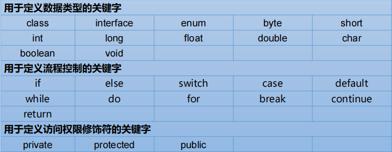

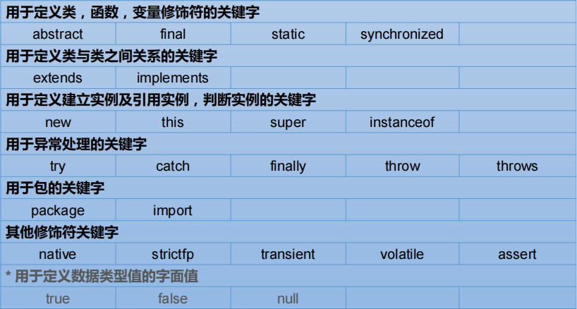


因为 Java 是面向对象的语言，一个程序的基本单位就是 `class`，`class` 是 ***关键字***，这里定义的 `class` 名字就是 `Hello`：

```java
public class Hello { // 类名是 Hello
    // ...
} // class定义结束
```


## 标识符（Identifier）

Java 对各种变量、方法和类等要素命名时使用的字符序列

***凡是自己可以起名字的地方都叫标识符***

### *1.* 标识符的命名规则： 

> [!WARNING]
> 如果不遵守如下规则，编译不通过！**需要严格遵守！**
> 1. 由 26 个英文字母大小写，`0-9` ，`_` 或 `$` 组成
> 2. 数字不可以开头
>     - ***习惯以大写字母开头***
> 3. 不可以使用关键字和保留字，但能包含关键字和保留字
> 4. Java 中严格区分大小写，长度无限制
> 5. 标识符不能包含空格


好的类命名：
- Hello
- NoteBook
- VRPlayer


不好的类命名：

- hello
- Good123
- Note_Book
- _World


注意到 `public` 是 ***访问修饰符*** ，表示该 `class` 是公开的。

不写 `public`，也能正确编译，但是这个类将无法从命令行执行。

在 `class` 内部，可以定义若干 **方法** （method）：

```java
public class Hello {
    public static void main(String[] args) { // 方法名是main
        // 方法代码...
    } // 方法定义结束
}
```

方法定义了一组执行语句，方法内部的代码将会被依次顺序执行。

这里的方法名是 `main`，返回值是 `void`，表示没有任何返回值。

我们注意到 `public` 除了可以修饰 `class` 外，也可以修饰方法。而关键字 `static` 是另一个修饰符，它表示静态方法，后面我们会讲解方法的类型，目前，我们只需要知道，Java 入口程序规定的方法必须是静态方法，方法名必须为 `main`，括号内的参数必须是 `String` 数组。

方法名也有命名规则，命名和 `class` 一样，但是 ***首字母小写*** ：

好的方法命名：

- main
- goodMorning
- playVR


不好的方法命名：

- Main
- good123
- good_morning
- _playVR


在方法内部，语句才是真正的执行代码。Java 的每一行语句必须以分号结束：

```java
public class Hello {
    public static void main(String[] args) {
        System.out.println("Hello, world!"); // 语句
    }
}
```


### *2.* Java 中的名称命名规范： 

> [!TIP]
> 如果不遵守如下规则，编译可以通过！**但建议遵守！**
> - ***包名*** ：多单词组成时所有字母都小写：`xxxyyyzzz`
> - ***类名、接口名*** ：多单词组成时，所有单词的首字母大写：`XxxYyyZzz`
> - ***变量名、方法名*** ：多单词组成时，第一个单词首字母小写，第二个单词开始每个单词首字母大写：`xxxYyyZzz`
> - ***常量名*** ：所有字母都大写。多单词时每个单词用下划线连接：`XXX_YYY_ZZZ`	


> [!ATTENTION]
> 1. 在起名字时，为了提高阅读性，要尽量有意义， ***见名知意*** 。
> 2. Java 采用 unicode 字符集，因此标识符也可以使用汉字声明，但是 *不建议使用* 。 


## 注释（Comment）

在 Java 程序中，注释是一种给人阅读的文本，不是程序的一部分，所以编译器会自动忽略注释。

Java 有 3 种注释

### *1.* 单行注释

以双斜线开头，直到这一行的结尾结束：

`// 这是注释...`

### *2.* 多行注释

以 `/*` 星号开头，以 `*/` 结束，可以有多行：

```java
/*
这是注释
xxxxxxxx
这也是注释
*/
```

### *3.* 文档注释

还有一种特殊的多行注释，以 `/**` 开头，以 `*/` 结束，如果有多行，每行通常以星号开头：

```java
/**
@author 指定指定java程序的作者程序的作者
@version 指定源文件的版本
*/
public class Hello {
    public static void main(String[] args) {
        System.out.println("Hello, world!");
    }
}
```

> [!TIP]
> 注释内容可以被 JDK 提供的工具 javadoc 所解析，生成一套以网页文件形式体现的该程序的说明文档。

解析:

```
javadoc -d mydoc -author -version -encoding utf8 Hello.java
```

Java 程序对格式没有明确的要求，多几个空格或者回车不影响程序的正确性，但是我们要养成良好的编程习惯，注意遵守 Java 社区约定的编码格式。


---

# **变量和数据类型**

## 变量

什么是变量？

变量就是初中数学的代数的概念，例如一个简单的方程， `x` ，`y` 都是变量：

$y = x^2 + 1$

### *1* 概念：

- 内存中的一个存储区域
  - 该区域的数据可以在同一类型范围内不断变化
  - 变量是程序中最基本的存储单元
  - 包含变量类型、变量名和存储的值

### *2* 作用：

- 用于在内存中保存数据
- 使用变量名来访问这块区域的数据
- 变量的作用域：定义所在的一对 `{}` 内

### *3* 变量的使用

Java 定义变量的格式：

```java
    //1
    数据类型 变量名 = 变量值；
 
    //2
    数据类型 变量名；
    变量名 = 变量值;  
```

> [!ATTENTION]
> ① ***变量必须先声明，后使用***。  
> ② 变量都定义在其作用域内。在作用域内，它是有用的。换句话说，出了作用域，就失效了。  
> ③ 同一个作用域内，不可以声明两个同名的变量。  

来看一个完整的定义变量，然后打印变量值的例子：

```java
public class Main {
    public static void main(String[] args) {
        int x = 100; // 定义int类型变量x，并赋予初始值100
        System.out.println(x); // 打印该变量的值
    }
}
```

***变量的一个重要特点是可以重新赋值。*** 例如，对变量 `x` ，先赋值 `100` ，再赋值 `200` ，观察两次打印的结果：

```java
public class Main {
    public static void main(String[] args) {
        int x = 100; // 定义int类型变量x，并赋予初始值100
        System.out.println(x); // 打印该变量的值，观察是否为100
        x = 200; // 重新赋值为200
        System.out.println(x); // 打印该变量的值，观察是否为200
    }
}
```

注意到第一次定义变量 `x` 的时候，需要指定变量类型 `int`，因此使用语句 `int x = 100;`。而第二次重新赋值的时候，变量 `x` 已经存在了，不能再重复定义，因此不能指定变量类型 `int`，必须使用语句 `x = 200;`。

***变量不但可以重新赋值，还可以赋值给其他变量。*** 让我们来看一个例子：

```java
public class Main {
    public static void main(String[] args) {
        int n = 100; // 定义变量n，同时赋值为100
        System.out.println("n = " + n); // 打印n的值

        n = 200; // 变量n赋值为200
        System.out.println("n = " + n); // 打印n的值

        int x = n; // 变量x赋值为n（n的值为200，因此赋值后x的值也是200）
        System.out.println("x = " + x); // 打印x的值

        x = x + 100; // 变量x赋值为x+100（x的值为200，因此赋值后x的值是200+100=300）
        System.out.println("x = " + x); // 打印x的值
        System.out.println("n = " + n); // 再次打印n的值，n应该是200还是300？
   }
}
```

我们一行一行地分析代码执行流程：

执行 `int n = 100;`，该语句定义了变量 `n`，同时赋值为 `100`，因此，JVM 在内存中为变量 `n` 分配一个“存储单元”，填入值 `100`：

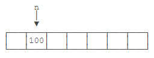

执行 `n = 200;` 时，JVM 把 `200` 写入变量 `n` 的存储单元，因此，原有的值被覆盖，现在 `n` 的值为 `200`：

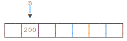

执行 `int x = n;` 时，定义了一个新的变量 `x`，同时对 `x` 赋值，因此，JVM 需要 ***新分配*** 一个存储单元给变量 `x`，并写入和变量 `n` 一样的值，结果是变量 `x` 的值也变为 `200`：

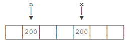

执行 `x = x + 100;` 时，JVM 首先计算等式右边的值 `x + 100`，结果为 `300`（因为此刻 `x` 的值为 `200`），然后，将结果 `300` 写入 `x` 的存储单元，因此，变量 `x` 最终的值变为 `300`：

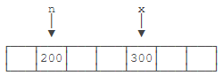

可见， ***变量可以反复赋值*** 。注意，等号 `=` 是赋值语句，不是数学意义上的相等，否则无法解释 `x = x + 100`。


## 数据类型


### 分类


#### *1* 按照数据类型来分

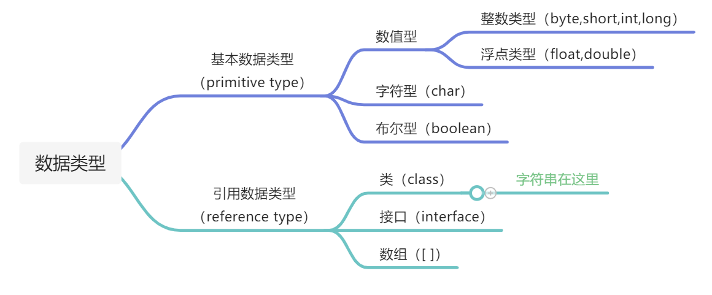


#### *2* 按变量在类中声明的位置*

在方法体外，类体内声明的变量称为 ***成员变量*** 。  

在方法体内部声明的变量称为 ***局部变量*** 。

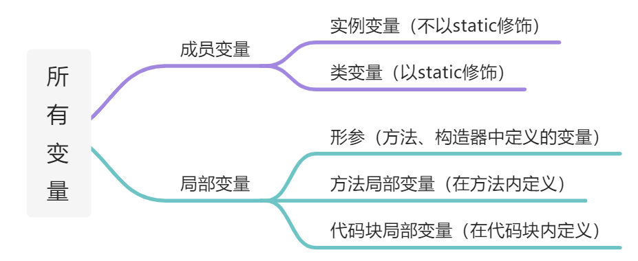

### 基本数据类型

基本数据类型是 CPU 可以直接进行运算的类型。Java 定义了以下几种基本数据类型：

- 整数类型： ***byte***， ***short***， ***int***， ***long***
- 浮点数类型： ***float***， ***double***
- 字符类型： ***char***
- 布尔类型： ***boolean***

#### ① 整数类型

- ***byte***（1 字节 = 8 bit） ：-128 ~ 127
- ***short***（2 字节）: -32768 ~ 32767
- ***int***（4 字节）: -2147483648 ~ 2147483647
- ***long***（8 字节）: -9223372036854775808 ~ 9223372036854775807

```java
public class Main {
    public static void main(String[] args) {
        int i = 2147483647;
        int i2 = -2147483648;
        int i3 = 2_000_000_000; // 加下划线更容易识别
        int i4 = 0xff0000; // 十六进制表示的16711680
        int i5 = 0b1000000000; // 二进制表示的512
        long l = 9000000000000000000L; // long型的结尾需要加L
    }
}
```

!> 通常定义整型变量时，使用 ***int*** 型

#### ② 浮点类型

***float***（4 字节） \ ***double***（8 字节）

浮点类型的数就是小数，因为小数用科学计数法表示的时候，小数点是可以“浮动”的，如 $1234.5$ 可以表示成 $12.345*10^2$ ，也可以表示成 $1.2345*10^3$ ，所以称为浮点数。

```java
    float f1 = 3.14f;
    float f2 = 3.14e38f; // 科学计数法表示的3.14x10^38
    double d = 1.79e308;
    double d2 = -1.79e308;
    double d3 = 4.9e-324; // 科学计数法表示的4.9x10^-324
```

对于 ***float*** 类型，需要加上 `f` / `F` 后缀。

浮点数可表示的范围非常大 ***float*** 类型可最大表示 $3.4*10^{38}$ ，而 ***double*** 类型可最大表示 $1.79*10^{308}$ 。

!> 通常，定义浮点型变量时，使用 ***double*** 型

#### ③ 字符类型

***char***（1 字符 = 2 字节）

1. 定义 ***char*** 型变量，通常使用一对  `'` `'` ，内部只能写一个字符
2. 表示方式：
   1. 声明一个字符
   2. 转义字符 
   3. 直接使用 Unicode 值表示字符型常量
      - ASCII 码
         - 8 个二进制位，共规定了 128 个字符的编码
      - Unicode 编码
      - UTF-8

```java
public class Main {
    public static void main(String[] args) {
        char a = 'A';
        char zh = '中';
        System.out.println(a);
        System.out.println(zh);
    }
}
```

> [!TIP]
> - `\n` 换行符
> - `\t` 制表符
> - `\b` 退格符
> - `\r` 回车符
> - `\"` 双引号
> - `\'` 单引号
> - `\\` 反斜线


> [!ATTENTION]
> 命令行是以 GBK 编码运行的，无法识别 UTF-8 的字符（EditPlus 中 ANSI 就等同于 GBK 编码）


#### ④ 布尔类型

***boolean***
	
1. 只能取两个值之一： `true` 、 `false`
2. 布尔类型总是 ***关系运算***  的计算结果
3. 常常在条件判断、循环结构中使用

```java
    boolean b1 = true;
    boolean b2 = false;
    boolean isGreater = 5 > 3; // 计算结果为true
    int age = 12;
    boolean isAdult = age >= 18; // 计算结果为false
```


### 引用数据类型

引用类型最常用的就是 `String` 字符串：

```java
    String s = "hello";
```

引用类型的变量类似于 C 语言的指针，它内部存储一个“地址”，指向某个对象在内存的位置，后续在 [类的概念](/1-Develop/Java/Note/2_面向对象/Java基本元素) 时会详细讨论。


> [!NOTE]
> ***String*** 类型变量的使用
> 1. `String` 属于引用数据类型，翻译为：字符串
> 2. 声明 `String` 类型变量时，使用一对`"` `"`
> 3. `String` 可以和 8 种基本数据类型变量做运算，且运算只能是**连接运算**。
> 4. 运算的结果仍是 `String` 类型


### 常量

定义变量的时候，如果加上 `final` 修饰符，这个变量就变成了 ***常量*** ：

```java
    final double PI = 3.14; // PI是一个常量
    double r = 5.0;
    double area = PI * r * r;
    PI = 300; // compile error!
```

***常量在定义时进行初始化后就不可再次赋值，再次赋值会导致编译错误*** 。

常量的作用是 *用有意义的变量名来避免魔术数字* （Magic number），例如，不要在代码中到处写 `3.14`，而是定义一个常量。如果将来需要提高计算精度，我们只需要在常量的定义处修改，例如，改成 `3.1416`，而不必在所有地方替换 `3.14`。

根据习惯， **常量名通常全部大写** 。

> [!TIP]
> 编码情况：
> - 整型常量，默认类型为 `int` 型；
> - 浮点型常量，默认类型为 `double` 型。


### var 关键字

有些时候，类型的名字太长，写起来比较麻烦。例如：

```java
    StringBuilder sb = new StringBuilder();
```

这个时候，如果 **想省略变量类型** ，可以使用 `var` 关键字：

```java
    var sb = new StringBuilder();
```

编译器会根据赋值语句自动推断出变量 `sb` 的类型是 `StringBuilder`。对编译器来说，语句：

```java
    var sb = new StringBuilder();
```

实际上会自动变成：

```java
    StringBuilder sb = new StringBuilder();
```

因此，使用 `var` 定义变量，仅仅是少写了变量类型而已。


### 变量的作用范围

在 Java 中，多行语句用 `{` `}` 括起来。很多控制语句，例如条件判断和循环，都以 `{` `}` 作为它们自身的范围，例如：

```java
if (...) { // if开始
    ...
    while (...) { // while 开始
        ...
        if (...) { // if开始
            ...
        } // if结束
        ...
    } // while结束
    ...
} // if结束
```

只要正确地嵌套这些 `{` `}`，编译器就能识别出语句块的开始和结束。而在语句块中定义的变量，它有一个作用域，就是从定义处开始，到语句块结束。超出了作用域引用这些变量，编译器会报错。举个例子：

```java
{
    ...
    int i = 0; // 变量i从这里开始定义
    ...
    {
        ...
        int x = 1; // 变量x从这里开始定义
        ...
        {
            ...
            String s = "hello"; // 变量s从这里开始定义
            ...
        } // 变量s作用域到此结束
        ...
        // 注意，这是一个新的变量s，它和上面的变量同名，
        // 但是因为作用域不同，它们是两个不同的变量:
        String s = "hi";
        ...
    } // 变量x和s作用域到此结束
    ...
} // 变量i作用域到此结束
```

定义变量时，要遵循作用域最小化原则，尽量将变量定义在尽可能小的作用域，并且，不要重复使用变量名。

---

# **基本数据类型之间的运算**


> [!ATTENTION]
> 前提：这里讨论的只是 7 种基本数据类型变量间的运算。不包括 `boolean` 类型。

## *1* 自动类型提升

***当容量小的数据类型的变量与容量大的数据类型的变量做运算时，结果自动提升为容量大的数据类型。***

例如， `short` 和 `int` 计算，结果总是 `int`，原因是 `short` 首先自动被转型为 `int`：

```java
public class Main {
    public static void main(String[] args) {
        short s = 1234;
        int i = 123456;
        int x = s + i; // s自动转型为int
        short y = s + i; // 编译错误!
    }
}
```

$byte、char、short → int → long → float → double → String$

特别的：当 `byte` 、 `char` 、 `short` 三种类型的变量做运算时，结果为 `int` 型

## *2* 强制类型转换

***将结果强制转型，即将大范围的整数转型为小范围的整数。***

强制转型需要使用强转符：`()` 。例如，将 `int` 强制转型为 `short` ：

```java
    int i = 12345;
    short s = (short) i; // 12345
```

> [!ATTENTION]
> 强制类型转换，可能导致精度损失。

原因是转型时， `int` 的两个高位字节直接被扔掉，仅保留了低位的两个字节：

```java
public class Main {
    public static void main(String[] args) {
        int i1 = 1234567;
        short s1 = (short) i1; // -10617
        System.out.println(s1);
        int i2 = 12345678;
        short s2 = (short) i2; // 24910
        System.out.println(s2);
    }
}
```

因此，强制转型的结果很可能是错的。


### 练习

####  1

```java
    String str1 = 4;                      //判断对错：×
    String str2 = 3.5f + "";              //判断str2对错：√

    System.out.println(str2);             //输出：”3.5” 

    System.out.println(3+4+"Hello!");     //输出：7Hello! 
    System.out.println("Hello!"+3+4);     //输出：Hello!34 
    System.out.println('a'+1+"Hello!");   //输出：98Hello! 
    System.out.println("Hello"+'a'+1);    //输出：Helloa1
```

#### 2	

判断是否能通过编译

```java
    //1
    short s = 5; 
    s = s - 2;                        //判断：×
    //2
    byte b = 3; 
    b = b + 4;                      //判断：×
    //3
    b = (byte)(b+4);                //判断：√ 
    //4	
    char c = ‘a’; 
    int i = 5; 
    float d = .314F; 
    double result = c+i+d;          //判断：√ 
    //5	
    byte b = 5; 
    short s = 3; 
    short t = s + b;                //判断：×
```

## 进制：

所有数字在计算机底层都以二进制形式存在。

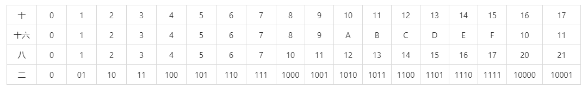


### 对于整数，有四种表示方式： 

- ***二进制***  (binary)：0，1 ，满 2 进 1 。 以 `0b` 或 `0B` 开头。 
- ***十进制***  (decimal)：0 - 9 ，满 10 进 1 。 
- ***八进制***  (octal)：0 - 7 ，满 8 进 1 。 以数字 `0` 开头表示。 
- ***十六进制***  (hex)：0 - 9 及 A - F，满 16 进 1 。 以 `0x` 或 `0X` 开头表示。
    - 此处的 A - F 不区分大小写。如：`0x21AF + 1 = 0X21B0`


> [!TIP]
> - 原码：直接将一个数值换成二进制数。最高位是符号位;  
> - 负数的反码：是对原码按位取反，只是最高位（符号位）确定为 1;  
> - 负数的补码：其反码加 1。  


!> *计算机底层都以补码的方式来存储数据！*

- +127：
  - 0111 1111
- -127：
  - 1111 1111 原码
  - 1000 0000 反码
  - 1000 0001 补码
- -128：
  - 1000 0000 补码

$$(-1) + (-127) = [1000 0001]原 + [1111 1111]原 = [1111 1111]补 + [1000 0001]补 = [1000 0000]补$$

> [!ATTENTION]
> -1-127 的结果应该是 -128, 在用补码运算的结果中, [1000 0000]补 就是 -128.
> 但是注意因为实际上是使用以前的 -0 的补码来表示 -128，所以 -128 并没有原码和反码表示，
> (对 -128 的补码表示 *[1000 0000]补* 算出来的原码是 *[0000 0000]原*，这是不正确的)，
> 使用补码，不仅仅修复了 0 的符号以及存在两个编码的问题，而且还能够多表示一个最低数。
> 这就是为什么 8 位二进制，使用原码或反码表示的范围为 [-127, +127]，
> 而使用补码表示的范围为 [-128, 127]。


### 进制间的转换

- 十进制 → 二进制 ：
  - *除二取余的逆*
- 二进制 → 八进制 ：
  - *每 3 个一位*
- 二进制 → 十六进制	：
  - *每 4 个一位*


> [!NOTE]
> 开发过程中： 	
> - `toBinaryString(int i);`
> - `toOctalString(int i);`					
> - `toHexString(int i);`


---

# **运算符**

## **Ⅰ** 算术运算符

`+`(正)、 `-`(负)、 `+`、 `-`、 `*`、 `/`

- `%` : 取余（模）运算
  - 结果的符号与被模数的符号相同
  - 开发中，经常使用 `%` 来判断能否被除尽的情况
- `(前)++` : 先自增 1，后再运算
- `(后)++` : 先运算，后自增 1 


> [!ATTENTION]
> 注意点：自增 1 不会改变本身变量的数据类型


```java
  //问题:
  byte bb1 = 127;
  bb1++;
  System.out.println("bb1 = " + bb1); //-128,溢出
```

- `(前)--` 先自减 1，后再运算
- `(后)--` 先运算，后自减 1


## **Ⅱ** 赋值运算符

`=`  

扩展赋值运算符：`+=`，`-=`，`*=`，`/=`，`%=`

## **Ⅲ** 比较运算符（关系运算符）

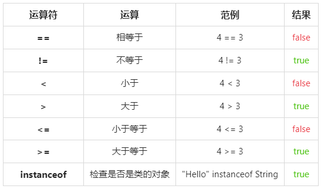

> [!TIP]
> 1. 比较运算符的结果是 boolean 类型
> 2. 区分 `==` 和 `=`

## **Ⅳ** 逻辑运算符
`&`	逻辑与 		`|`	逻辑或 		`!`	逻辑非  
`&&`	短路与 		`||`	短路或 		`^`	逻辑异或	

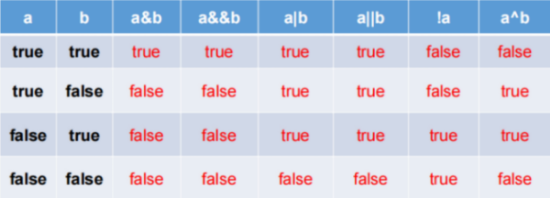

> [!NOTE]
> 区分： `&` 与 `&&`
> - 相同点 1：运算结果相同
> - 相同点 2：当符号左边是 `true` 时，二者都会执行符号右边的运算
> - 不同点：当符号左边时 `false` 时，`&` 继续执行符号右边的运算。`&&` 不再执行符号右边的运算
> - 开发中，推荐使用 `&&` 。

> [!NOTE]
> 区分： `|` 与 `||`	
> - 相同点1：运算结果相同
> - 相同点2：当符号左边是 `false` 时，二者都会执行符号右边的运算
> - 不同点：当符号左边时 `true` 时，`|` 继续执行符号右边的运算。`||` 不再执行符号右边的运算。
> - 开发中，推荐使用 `||` 。	

## **Ⅴ** 位运算符

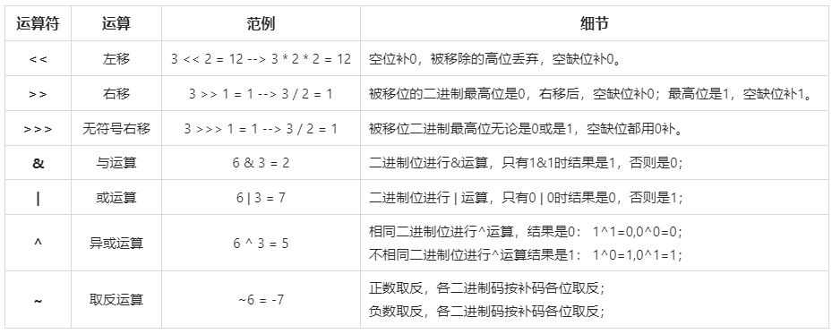


1. ***位运算符操作的都是整型的数据***
2. `<<`：在一定范围内，每向左移一位，相当于 `* 2`
3. `>>`：在一定范围内，每向右移一位，相当于 `/ 2`

$m = k ^ n = (m ^ n) ^ n$

## **Ⅵ** 三元运算符

### 1 结构： 

```java
(条件表达式) ? 表达式 1 : 表达式 2
```

### 2 说明：

1. 条件表达式的结果为 `boolean` 类型；
2. 根据条件表达式真或假，决定执行表达式 1，还是表达式 2；
	- 如果表达式为 `true`，则执行表达式 1；
	- 如果表达式为 `false`，则执行表达式 2；
3. 表达式 1 和表达式 2 要求是一致的；
4. 三元运算符可以嵌套使用。

> [!NOTE]
> - 凡是可以使用三元运算符的地方，都可以改写为 `if - else` ：反之，不成立。
> - 如果程序既可以使用三元运算符，又可以使用 `if - else` 结构，那么优先选择三元运算符。
> - 简洁、执行效率高。


## 运算符的优先级

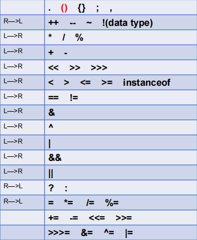

---

# **字符和字符串**

在 Java 中，字符和字符串是两个不同的类型。

## 字符类型

字符类型 `char` 是基本数据类型，它是 `character` 的缩写。一个 `char` 保存一个 Unicode 字符：

```java
    char c1 = 'A';
    char c2 = '中';
```

因为 Java 在内存中总是使用 Unicode 表示字符，所以，一个英文字符和一个中文字符都用一个 `char` 类型表示，它们都占用两个字节。要显示一个字符的 Unicode 编码，只需将 `char` 类型直接赋值给 `int` 类型即可：


```java
    int n1 = 'A'; // 字母“A”的Unicodde编码是65
    int n2 = '中'; // 汉字“中”的Unicode编码是20013
```

还可以直接用转义字符 `\u` + Unicode 编码来表示一个字符：

```java
    // 注意是十六进制:
    char c3 = '\u0041'; // 'A'，因为十六进制0041 = 十进制65
    char c4 = '\u4e2d'; // '中'，因为十六进制4e2d = 十进制20013
```


## 字符串类型

和 `char` 类型不同，字符串类型 `String` 是引用类型，我们用双引号 `"..."` 表示字符串。一个字符串可以存储 0 个到任意个字符：

```java
    String s = ""; // 空字符串，包含0个字符
    String s1 = "A"; // 包含一个字符
    String s2 = "ABC"; // 包含3个字符
    String s3 = "中文 ABC"; // 包含6个字符，其中有一个空格
```

因为字符串使用双引号 `"..."` 表示开始和结束，那如果字符串本身恰好包含一个 `"` 字符怎么表示？例如， `"abc"xyz"`，编译器就无法判断中间的引号究竟是字符串的一部分还是表示字符串结束。这个时候，我们需要借助转义字符 `\`：

```java
    String s = "abc\"xyz"; // 包含7个字符: a, b, c, ", x, y, z
```

因为 `\` 是转义字符，所以，两个 `\\` 表示一个 `\` 字符：

```java
    String s = "abc\\xyz"; // 包含7个字符: a, b, c, \, x, y, z
```

常见的转义字符包括：

- `\"` 表示字符 `"`
- `\'` 表示字符 `'`
- `\\` 表示字符 `\`
- `\n` 表示换行符
- `\r` 表示回车符
- `\t` 表示 `Tab`
- `\u####` 表示一个 Unicode 编码的字符

例如：

```java
    String s = "ABC\n\u4e2d\u6587"; // 包含6个字符: A, B, C, 换行符, 中, 文
```

### 字符串连接

Java 的编译器对字符串做了特殊照顾，可以使用 + 连接任意字符串和其他数据类型，这样极大地方便了字符串的处理。例如：

```java
// 字符串连接
public class Main {
    public static void main(String[] args) {
        String s1 = "Hello";
        String s2 = "world";
        String s = s1 + " " + s2 + "!";
        System.out.println(s);
    }
}
```


如果用 `+` 连接字符串和其他数据类型，会将其他数据类型先自动转型为字符串，再连接：


```java
// 字符串连接
public class Main {
    public static void main(String[] args) {
        int age = 25;
        String s = "age is " + age;
        System.out.println(s);
    }
}
```


### 多行字符串 *

如果我们要表示多行字符串，使用 `+` 号连接会非常不方便：

```java
    String s = "first line \n"
            + "second line \n"
            + "end";
```

> [!TIP]
> 从 **Java 13** 开始，字符串可以用 `"""..."""` 表示多行字符串（Text Blocks）了。举个例子：


```java
// 多行字符串
public class Main {
    public static void main(String[] args) {
        String s = """
                   SELECT * FROM
                     users
                   WHERE id > 100
                   ORDER BY name DESC
                   """;
        System.out.println(s);
    }
}
```


上述多行字符串实际上是 5 行，在最后一个 `DESC` 后面还有一个 `\n`。如果我们不想在字符串末尾加一个 `\n`，就需要这么写：

```java
    String s = """ 
            SELECT * FROM
                users
            WHERE id > 100
            ORDER BY name DESC""";
```

还需要注意到，多行字符串前面共同的空格会被去掉，即：

```java
    String s = """
    ...........SELECT * FROM
    ...........  users
    ...........WHERE id > 100
    ...........ORDER BY name DESC
    ...........""";
```

用 `.` 标注的空格都会被去掉。

如果多行字符串的排版不规则，那么，去掉的空格就会变成这样：

```java
    String s = """
    .........  SELECT * FROM
    .........    users
    .........WHERE id > 100
    .........  ORDER BY name DESC
    .........  """;
```

即总是以最短的行首空格为基准。


### 不可变特性

Java 的字符串除了是一个引用类型外，还有个重要特点，就是 ***字符串不可变*** 。考察以下代码：

```java
// 字符串不可变
public class Main {
    public static void main(String[] args) {
        String s = "hello";
        System.out.println(s); // 显示 hello
        s = "world";
        System.out.println(s); // 显示 world
    }
}
```

观察执行结果，难道字符串 `s` 变了吗？其实变的不是字符串，而是变量 `s` 的“指向”。

执行 `String s = "hello";` 时，JVM 虚拟机先创建字符串 `"hello"`，然后，把字符串变量 `s` 指向它：

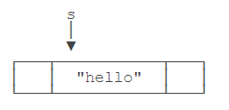

紧接着，执行 `s = "world";` 时，JVM 虚拟机先创建字符串 `"world"`，然后，把字符串变量 `s` 指向它：

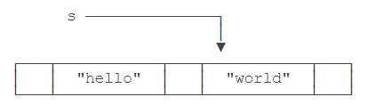

原来的字符串 `"hello"` 还在，只是我们无法通过变量 `s` 访问它而已。因此， ***字符串的不可变是指字符串内容不可变***。

理解了引用类型的“指向”后，试解释下面的代码输出：

```java
// 字符串不可变
public class Main {
    public static void main(String[] args) {
        String s = "hello";
        String t = s;
        s = "world";
        System.out.println(t); // t是"hello"还是"world"?
    }
}
```


### 空值 null

引用类型的变量可以指向一个空值 `null`，它表示不存在，即 ***该变量不指向任何对象*** 。例如：

```java
    String s1 = null; // s1是null
    String s2; // 没有赋初值值，s2也是null
    String s3 = s1; // s3也是null
    String s4 = ""; // s4指向空字符串，不是null
```

注意要区分空值 `null` 和空字符串 `""`， ***空字符串是一个有效的字符串对象*** ，它不等于 `null`。


### 练习

请将一组 `int` 值视为字符的 Unicode 编码，然后将它们拼成一个字符串：

```java
public class StringTest {
    public static void main(String[] args) {
        // 请将下面一组int值视为字符的Unicode码，把它们拼成一个字符串：
        int a = 72;
        int b = 105;
        int c = 65281;
        // FIXME:
        String s = "" + a + b + c;
        System.out.println(s);
    }
}
```

---

# **数组类型**

## 数组类型

如果我们有一组类型相同的变量，例如，5 位同学的成绩，可以这么写：

```java
public class Main {
    public static void main(String[] args) {
        // 5位同学的成绩:
        int n1 = 68;
        int n2 = 79;
        int n3 = 91;
        int n4 = 85;
        int n5 = 62;
    }
}
```

但其实没有必要定义 5 个 `int` 变量。可以使用数组来表示“一组” `int` 类型。代码如下：

```java
// 数组
public class Main {
    public static void main(String[] args) {
        // 5位同学的成绩:
        int[] ns = new int[5];
        ns[0] = 68;
        ns[1] = 79;
        ns[2] = 91;
        ns[3] = 85;
        ns[4] = 62;
    }
}
```


定义一个数组类型的变量，使用数组类型 `“类型[]”` ，例如，`int[]`。和单个基本类型变量不同，数组变量初始化必须使用 `new int[5]` 表示创建一个可容纳 5 个 int 元素的数组。

#### Java 的数组有几个特点 ：

- 数组所有元素初始化为默认值，整型都是 `0`，浮点型是 `0.0`，布尔型是 `false`；
- ***数组一旦创建后，大小就不可改变***。

要访问数组中的某一个元素，需要使用索引。数组索引从 `0` 开始，例如，5 个元素的数组，索引范围是 `0` ~ `4`。


可以修改数组中的某一个元素，使用赋值语句，例如，`ns[1] = 79;`。

可以用 `数组变量.length` 获取数组大小：

```java
// 数组
public class Main {
    public static void main(String[] args) {
        // 5位同学的成绩:
        int[] ns = new int[5];
        System.out.println(ns.length); // 5
    }
}
```


数组是 ***引用类型*** ，在使用索引访问数组元素时，如果索引超出范围，运行时将报错：

```java
// 数组
public class Main {
    public static void main(String[] args) {
        // 5位同学的成绩:
        int[] ns = new int[5];
        int n = 5;
        System.out.println(ns[n]); // 索引n不能超出范围
    }
}
```


也可以在定义数组时直接指定初始化的元素，这样就不必写出数组大小，而是由编译器自动推算数组大小。例如：

```java
// 数组
public class Main {
    public static void main(String[] args) {
        // 5位同学的成绩:
        int[] ns = new int[] { 68, 79, 91, 85, 62 };
        System.out.println(ns.length); // 编译器自动推算数组大小为5
    }
}
```


还可以进一步简写为：

```java
int[] ns = { 68, 79, 91, 85, 62 };
```

注意数组是引用类型，并且数组大小不可变。我们观察下面的代码：

```java
// 数组
public class Main {
    public static void main(String[] args) {
        // 5位同学的成绩:
        int[] ns;
        ns = new int[] { 68, 79, 91, 85, 62 };
        System.out.println(ns.length); // 5
        ns = new int[] { 1, 2, 3 };
        System.out.println(ns.length); // 3
    }
}
```


数组大小变了吗？看上去好像是变了，但其实根本没变。

对于数组 `ns` 来说，执行 `ns = new int[] { 68, 79, 91, 85, 62 };` 时，它指向一个 5 个元素的数组：

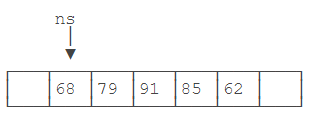

执行 `ns = new int[] { 1, 2, 3 };` 时，它指向一个 *新的* 3 个元素的数组：

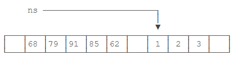

但是，原有的 5 个元素的数组并没有改变，只是无法通过变量 `ns` 引用到它们而已。


## 字符串数组

如果数组元素不是基本类型，而是一个引用类型，那么，修改数组元素会有哪些不同？

字符串是引用类型，因此我们先定义一个字符串数组：

```java
String[] names = {
    "ABC", "XYZ", "zoo"
};
```

对于 `String[]` 类型的数组变量 `names`，它实际上包含 3 个元素，但每个元素都指向某个字符串对象：

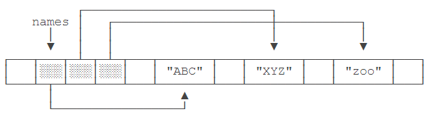


对 `names[1]` 进行赋值，例如 `names[1] = "cat";`，效果如下：

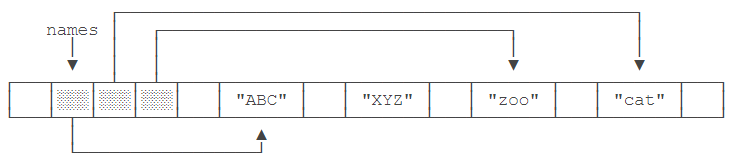

这里注意到原来 `names[1]` 指向的字符串 `"XYZ"` 并没有改变，仅仅是将 `names[1]` 的引用从指向 `"XYZ"` 改成了指向 `"cat"`，其结果是字符串 `"XYZ"` 再也无法通过 `names[1]` 访问到了。

对“指向”有了更深入的理解后，试解释如下代码：

```java
// 数组
public class Main {
    public static void main(String[] args) {
        String[] names = {"ABC", "XYZ", "zoo"};
        String s = names[1];
        names[1] = "cat";
        System.out.println(s); // s是"XYZ"还是"cat"?
    }
}
```

## 小结

数组是同一数据类型的集合，数组一旦创建后，大小就不可变；

可以通过索引访问数组元素，但索引超出范围将报错；

数组元素可以是值类型（如 ***int*** ）或引用类型（如 ***String*** ），但数组本身是引用类型；

---

# **补充**

## 整数运算

Java 的整数运算遵循四则运算规则，可以使用任意嵌套的小括号。四则运算规则和初等数学一致。例如：

```java
//四则运算
public class Main {
    public static void main(String[] args) {
        int i = (100 + 200) * (99 - 88); // 3300
        int n = 7 * (5 + (i - 9)); // 23072
        System.out.println(i);
        System.out.println(n);
    }
}
```

整数的数值表示不但是精确的，而且整数运算永远是精确的，即使是除法也是精确的，因为两个整数相除只能得到结果的整数部分：

```java
    int x = 12345 / 67; // 184
```

求余运算使用 `%` ：

```java
    int y = 12345 % 67; // 12345 ÷ 67 的余数是17
```

> [!ATTENTION]
> **整数的除法对于除数为 0 时运行时将报错，但编译不会报错。**


### 溢出

要特别注意，整数由于存在范围限制，如果计算结果超出了范围，就会产生溢出，而溢出不会出错，却会得到一个奇怪的结果：

```java
// 运算溢出
public class Main {
    public static void main(String[] args) {
        int x = 2147483640;
        int y = 15;
        int sum = x + y;
        System.out.println(sum); // -2147483641
    }
}
```

要解释上述结果，我们把整数 `2147483640` 和 `15` 换成二进制做加法：


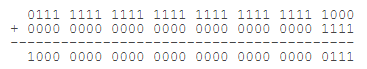


由于最高位计算结果为 `1`，因此，加法结果变成了一个负数。

要解决上面的问题，可以把 `int` 换成 `long` 类型，由于 `long` 可表示的整型范围更大，所以结果就不会溢出：

```java
    long x = 2147483640;
    long y = 15;
    long sum = x + y;
    System.out.println(sum); // 2147483655
```

还有一种简写的运算符，即 `+=`，`-=`，`*=`，`/=`，它们的使用方法如下：

```java
    n += 100; // 3409, 相当于 n = n + 100;
    n -= 100; // 3309, 相当于 n = n - 100;
```

### 自增/自减

Java 还提供了 `++` 运算和 `--` 运算，它们可以对一个整数进行加 1 和减 1 的操作：

```java
// 自增/自减运算
public class Main {
    public static void main(String[] args) {
        int n = 3300;
        n++; // 3301, 相当于 n = n + 1;
        n--; // 3300, 相当于 n = n - 1;
        int y = 100 + (++n); // 不要这么写
        System.out.println(y);
    }
}
```


注意 `++` 写在前面和后面计算结果是不同的，`++n` 表示先加 1 再引用 n，`n++` 表示先引用 n 再加 1。不建议把 `++` 运算混入到常规运算中，容易自己把自己搞懵了。


### 移位运算

在计算机中，整数总是以二进制的形式表示。例如，`int` 类型的整数 `7` 使用 4 字节表示的二进制如下：

00000000 0000000 0000000 00000111

可以对整数进行移位运算。对整数 `7` 左移 `1` 位将得到整数 `14`，左移两位将得到整数 `28`：

```java
    int n = 7;       // 00000000 00000000 00000000 00000111 = 7
    int a = n << 1;  // 00000000 00000000 00000000 00001110 = 14
    int b = n << 2;  // 00000000 00000000 00000000 00011100 = 28
    int c = n << 28; // 01110000 00000000 00000000 00000000 = 1879048192
    int d = n << 29; // 11100000 00000000 00000000 00000000 = -536870912
```

左移 29 位时，由于最高位变成 `1`，因此结果变成了负数。

类似的，对整数 `28` 进行右移，结果如下：

```java
    int n = 7;       // 00000000 00000000 00000000 00000111 = 7
    int a = n >> 1;  // 00000000 00000000 00000000 00000011 = 3
    int b = n >> 2;  // 00000000 00000000 00000000 00000001 = 1
    int c = n >> 3;  // 00000000 00000000 00000000 00000000 = 0
```

如果对一个负数进行右移，最高位的 `1` 不动，结果仍然是一个负数：

```java
    int n = -536870912;
    int a = n >> 1;  // 11110000 00000000 00000000 00000000 = -268435456
    int b = n >> 2;  // 11111000 00000000 00000000 00000000 = -134217728
    int c = n >> 28; // 11111111 11111111 11111111 11111110 = -2
    int d = n >> 29; // 11111111 11111111 11111111 11111111 = -1
```

还有一种无符号的右移运算，使用 `>>>`，它的特点是不管符号位，右移后高位总是补 `0`，因此，对一个负数进行 `>>>` 右移，它会变成正数，原因是最高位的 `1` 变成了 `0`：

```java
    int n = -536870912;
    int a = n >>> 1;  // 01110000 00000000 00000000 00000000 = 1879048192
    int b = n >>> 2;  // 00111000 00000000 00000000 00000000 = 939524096
    int c = n >>> 29; // 00000000 00000000 00000000 00000111 = 7
    int d = n >>> 31; // 00000000 00000000 00000000 00000001 = 1
```

对 `byte` 和 `short` 类型进行移位时，会首先转换为 `int` 再进行位移。

仔细观察可发现，左移实际上就是不断地乘 2，右移实际上就是不断地除以 2。


### 位运算

位运算是按位进行 *与* 、*或* 、*非* 和 *异或* 的运算。

***与运算*** 的规则是，必须两个数同时为 `1`，结果才为 `1`：

```java
n = 0 & 0; // 0
n = 0 & 1; // 0
n = 1 & 0; // 0
n = 1 & 1; // 1
```

***或运算*** 的规则是，只要任意一个为 `1`，结果就为 `1`：

```java
n = 0 | 0; // 0
n = 0 | 1; // 1
n = 1 | 0; // 1
n = 1 | 1; // 1
```

***非运算*** 的规则是，`0` 和 `1` 互换：

```java
n = ~0; // 1
n = ~1; // 0
```

***异或运算*** 的规则是，如果两个数不同，结果为 `1`，否则为 `0`：

```java
n = 0 ^ 0; // 0
n = 0 ^ 1; // 1
n = 1 ^ 0; // 1
n = 1 ^ 1; // 0
```

***对两个整数进行位运算，实际上就是按位对齐，然后依次对每一位进行运算。*** 例如：

```java
// 位运算
public class Main {
    public static void main(String[] args) {
        int i = 167776589; // 00001010 00000000 00010001 01001101
        int n = 167776512; // 00001010 00000000 00010001 00000000
        System.out.println(i & n); // 167776512
    }
}
```

上述按位与运算实际上可以看作两个整数表示的 IP 地址 `10.0.17.77` 和 `10.0.17.0` ，通过与运算，可以快速判断一个 IP 是否在给定的网段内。


### 小结

整数运算的结果永远是精确的；

运算结果会自动提升；

可以强制转型，但超出范围的强制转型会得到错误的结果；

应该选择合适范围的整型（ int 或 long ），没有必要为了节省内存而使用 byte 和 short 进行整数运算。


### 练习

计算前 N 个自然数的和可以根据公式：

$\frac{(1+N)\times N}2 $

请根据公式计算前N个自然数的和：


```java
// 计算前N个自然数的和
public class SumTest {
    public static void main(String[] args) {
        int n = 100;
        
        // TODO: sum = 1 + 2 + ... + n
        int sum = 0;

        for (int i = 0; i <= n; i++){
            sum += i;
        }

        System.out.println(sum);//5050
        System.out.println(sum == 5050 ? "测试通过" : "测试失败");
    }
}
```


## 浮点数运算

浮点数运算和整数运算相比，只能进行 *加减乘除* 这些数值计算，不能做位运算和移位运算。

在计算机中，浮点数虽然表示的范围大，但是，浮点数有个非常重要的特点，就是 ***浮点数常常无法精确表示*** 。

### 举个栗子：

浮点数 `0.1` 在计算机中就无法精确表示，因为十进制的 `0.1` 换算成二进制是一个无限循环小数，很显然，无论使用 `float` 还是 `double`，都只能存储一个 `0.1` 的近似值。但是，`0.5` 这个浮点数又可以精确地表示。

因为浮点数常常无法精确表示，因此，浮点数运算会产生误差：

```java
// 浮点数运算误差
public class Main {
    public static void main(String[] args) {
        double x = 1.0 / 10;
        double y = 1 - 9.0 / 10;
        // 观察x和y是否相等:
        System.out.println(x);//0.1
        System.out.println(y);//0.09999999999999998
    }
}
```


由于浮点数存在运算误差，所以比较两个浮点数是否相等常常会出现错误的结果。正确的比较方法是判断两个浮点数之差的绝对值是否小于一个很小的数：


```java
    // 比较x和y是否相等，先计算其差的绝对值:
    double r = Math.abs(x - y);
    // 再判断绝对值是否足够小:
    if (r < 0.00001) {
        // 可以认为相等
    } else {
        // 不相等
    }
```

浮点数在内存的表示方法和整数比更加复杂。Java 的浮点数完全遵循 [IEEE-754](https://web.archive.org/web/20070505021348/http://babbage.cs.qc.edu/courses/cs341/IEEE-754references.html) 标准，这也是绝大多数计算机平台都支持的浮点数标准表示方法。

### 类型提升

如果参与运算的两个数其中一个是整型，那么整型可以自动提升到浮点型：

```java
// 类型提升
public class Main {
    public static void main(String[] args) {
        int n = 5;
        double d = 1.2 + 24.0 / n; // 6.0
        System.out.println(d);
    }
}
```

需要特别注意，在一个复杂的四则运算中，两个整数的运算不会出现自动提升的情况。例如：

```java
    double d = 1.2 + 24 / 5; // 5.2
```

计算结果为 `5.2`，原因是编译器计算 `24 / 5` 这个子表达式时，按两个整数进行运算，结果仍为整数 `4`。


### 溢出

整数运算在除数为 `0` 时会报错，而浮点数运算在除数为 `0` 时，不会报错，但会返回几个特殊值：

- `NaN` 表示 Not a Number
- `Infinity` 表示无穷大
- `-Infinity` 表示负无穷大\
  

例如：

```java
    double d1 = 0.0 / 0; // NaN
    double d2 = 1.0 / 0; // Infinity
    double d3 = -1.0 / 0; // -Infinity
```

这三种特殊值在实际运算中很少碰到，我们只需要了解即可。


### 强制转型

可以将浮点数强制转型为整数。在转型时，浮点数的小数部分会被丢掉。如果转型后超过了整型能表示的最大范围，将返回整型的最大值。例如：

```java
    int n1 = (int) 12.3; // 12
    int n2 = (int) 12.7; // 12
    int n2 = (int) -12.7; // -12
    int n3 = (int) (12.7 + 0.5); // 13
    int n4 = (int) 1.2e20; // 2147483647
```

如果要进行四舍五入，可以对浮点数加上0.5再强制转型：

```java
// 四舍五入
public class Main {
    public static void main(String[] args) {
        double d = 2.6;
        int n = (int) (d + 0.5);
        System.out.println(n);
    }
}
```

### 练习
根据一元二次方程 $ax^2+bx+c=0$ 的求根公式：

$\frac{\displaystyle-b\pm\sqrt{b^2-4ac}}{\displaystyle2a} $

计算出一元二次方程的两个解：

```java
// 一元二次方程
public class EquationTest {
    public static void main(String[] args) {
        double a = 1.0;
        double b = 3.0;
        double c = -4.0;
        
        // 求平方根可用 Math.sqrt():
        // System.out.println(Math.sqrt(2)); ==> 1.414
        // TODO:
        double r1 = 0;
        double r2 = 0;

        r1 = (-b + Math.sqrt(b * b - 4 * a * c)) / (2 * a); //1.0
        r2 = (-b - Math.sqrt(b * b - 4 * a * c)) / (2 * a); //-4.0

        System.out.println(r1);
        System.out.println(r2);
        System.out.println(r1 == 1 && r2 == -4 ? "测试通过" : "测试失败");
    }
}
```


## 布尔运算

对于布尔类型 `boolean`，永远只有 `true` 和 `false` 两个值。

布尔运算是一种关系运算，包括以下几类：

- 比较运算符：`>` ，`>=` ，`<` ，`<=` ，`==` ，`!=`
- 与运算 `&&`
- 或运算 `||`
- 非运算 `!`

下面是一些示例：

```java
    boolean isGreater = 5 > 3; // true
    int age = 12;
    boolean isZero = age == 0; // false
    boolean isNonZero = !isZero; // true
    boolean isAdult = age >= 18; // false
    boolean isTeenager = age > 6 && age < 18; // true
```

关系运算符的优先级从高到低依次是：

- `!`
- `>` ，`>=` ，`<` ，`<=`
- `==` ，`!=`
- `&&`
- `||`


### 短路运算

布尔运算的一个重要特点是短路运算。如果一个布尔运算的表达式能提前确定结果，则后续的计算不再执行，直接返回结果。

因为 `false && x` 的结果总是 `false`，无论 `x` 是 `true` 还是 `false`，因此，与运算在确定第一个值为`false` 后，不再继续计算，而是直接返回 `false`。

我们考察以下代码：

```java
// 短路运算
public class Main {
    public static void main(String[] args) {
        boolean b = 5 < 3;
        boolean result = b && (5 / 0 > 0);
        System.out.println(result);
    }
}
```


如果没有短路运算，`&&` 后面的表达式会由于除数为 `0` 而报错，但实际上该语句并未报错，原因在于与运算是短路运算符，提前计算出了结果 `false`。

如果变量 `b` 的值为 `true`，则表达式变为 `true && (5 / 0 > 0)`。因为无法进行短路运算，该表达式必定会由于除数为 `0` 而报错，可以自行测试。

类似的，对于 `||` 运算，只要能确定第一个值为 `true`，后续计算也不再进行，而是直接返回 `true`：

```java
    boolean result = true || (5 / 0 > 0); // true
```


### 三元运算符

Java 还提供一个三元运算符 `b ? x : y`，它根据第一个布尔表达式的结果，分别返回后续两个表达式之一的计算结果。示例：

```java
// 三元运算
public class Main {
    public static void main(String[] args) {
        int n = -100;
        int x = n >= 0 ? n : -n;
        System.out.println(x);
    }
}
```


上述语句的意思是，判断 `n >= 0` 是否成立，如果为 `true`，则返回 `n`，否则返回 `-n`。这实际上是一个求绝对值的表达式。

注意到三元运算 `b ? x : y` 会首先计算 `b`，如果 `b` 为 `true`，则只计算 `x`，否则，只计算 `y`。此外，`x` 和 `y` 的类型必须相同，因为返回值不是 `boolean`，而是 `x` 和 `y` 之一。


### 练习

判断指定年龄是否是小学生（6～12岁）：

```java
// 布尔运算
public class IsPupil {
    public static void main(String[] args) {
        int age = 7;
        
        // primary student的定义: 6~12岁
        boolean isPrimaryStudent = age>= 6 && age <= 12 ? true : false;

        System.out.println(isPrimaryStudent ? "Yes" : "No");
    }
}
```


