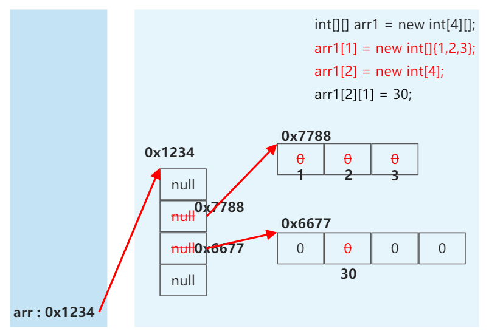
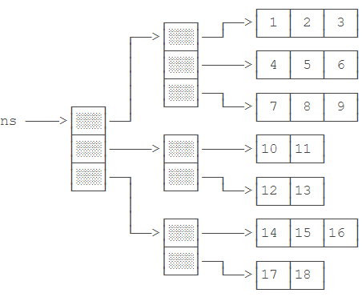
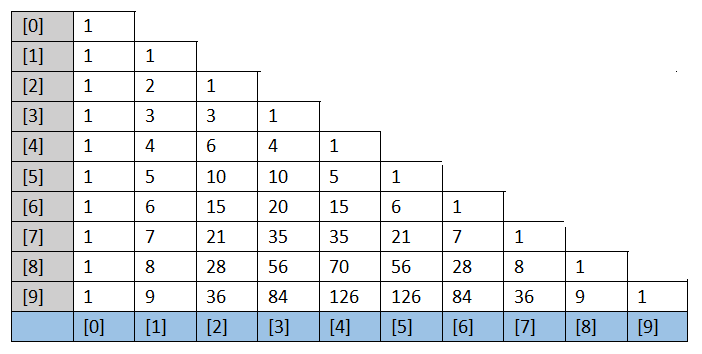
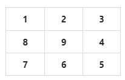
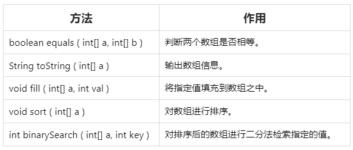

# 


# 数组(Array)

数组是多个 ***相同类型*** 数据按 ***一定顺序*** 排列的集合，并使用 ***一个名字*** 命名，并通过 ***编号*** 的方式对这些数据进行统一管理。


## 数组相关的概念

- 数组名
- 元素
- 角标、下标、索引
- 数组的长度：元素的个数


## 数组的特点

1. 数组是 ***有序*** 排列的。
2. 数组属于 ***引用数据类型*** 的变量。*数组的元素既可以是基本数据类型，也可以是引用数据类型。*
3. 创建数组对象会 *在内存中开辟一整块连续的空间* （不连续的 → 链表）。
4. 数组的 ***长度一旦确定，就不能修改*** 。


## 数组的分类

① 按照*维数* ：一维数组、二维数组...  
② 按照*数组元素的类型* ：基本数据类型元素的数组，引用数据类型元素的数组。  


## ex： 数据结构

1. 数据与数据之间的逻辑关系：集合、一对一、一对多、多对多
2. 数据的存储结构：
   1. 线性表（一对一）：顺序表（比如：数组）、链表、栈（一个口，先进后出）、队列（一个入口，一个出口，先进先出）
   2. 树形结构（一对多）：二叉树
   3. 图形结构（多对多）


# 一维数组

## ① 一维数组的声明和初始化

```java
    int num;//声明 
    num = 10;//初始化

    int id = 1001;//声明+初始化
```

### Ⅰ 静态初始化

?> 数组的初始化和数组元素的赋值操作同时进行

```java
    int[] ids = new int[]{1001,1002,1003,1004};
```

### Ⅱ 动态初始化

?> 数组的初始化和数组元素的赋值操作分开进行

```java
    String[] names = new String[5];
```

> [!ATTENTION]
> 错误的方式：
> - `int[] arr1 = new int[];`
> - `int[5] arr2 = new int[5];`
> - `int[] arr3 = new int[3]{1,2,3};`

## ② 如何调用数组的指定位置的元素

?> 通过角标的方式。

数组的角标（或索引）从 0 开始，到数组的长度 -1 结束。

```java
    names[3] = "吴签";
```

## ③ 如何获取数组的长度

```java
    System.out.println(names.length);
```

> [!WARNING]
> 数组一旦初始化，其长度就是确定的。  
> arr.length 数组长度一旦确定，就不可修改。


## ④ 如何遍历数组

通过 `for` 循环就可以遍历数组。

```java
public class Main {
    public static void main(String[] args) {
        int[] ns = { 1, 4, 9, 16, 25 };
        for (int i=0; i<ns.length; i++) {
            int n = ns[i];
            System.out.println(n);
        }
    }
}
```

第二种方式是使用 `for each` 循环，直接迭代数组的每个元素：

```java
public class Main {
    public static void main(String[] args) {
        int[] ns = { 1, 4, 9, 16, 25 };
        for (int n : ns) {
            System.out.println(n);
        }
    }
}
```

> [!ATTENTION]
> 在 `for (int n : ns)` 循环中，变量 `n` 直接拿到 `ns` 数组的元素，而不是索引。

### 快速打印数组内容

Java 标准库提供了 `Arrays.toString()` ，可以快速打印数组内容：

```java
import java.util.Arrays;

public class Main {
    public static void main(String[] args) {
        int[] ns = { 1, 1, 2, 3, 5, 8 };
        System.out.println(Arrays.toString(ns));
    }
}
```

## ⑤ 数组元素的默认初始化值


- 数组元素是 ***整型*** ： `0`
- 数组元素是 ***浮点型*** ： `0.0`
- 数组元素是 ***char 型*** ： `0` 或 `'\u0000'`，而非 `'0'`
- 数组元素是 ***boolean 型*** ： `false`
- 数组元素是 ***引用数据类型*** ： `null`

## *⑥ 数组的内存解析


## 练习

请按倒序遍历数组并打印每个元素：

```java
public class Main {
    public static void main(String[] args) {
        int[] ns = { 1, 4, 9, 16, 25 };
        // 倒序打印数组元素:
        for (int i=ns.length-1; i>= 0; i--) {
            System.out.println(ns[i]);
        }
    }
}
```

# 多维数组

## 二维数组

二维数组就是数组的数组。定义一个二维数组如下：

```java
public class Main {
    public static void main(String[] args) {
        int[][] ns = {
            { 1, 2, 3, 4 },
            { 5, 6, 7, 8 },
            { 9, 10, 11, 12 }
        };
        System.out.println(ns.length); // 3
    }
}
```

因为 `ns` 包含 3 个数组，因此， `ns.length` 为 `3` 。实际上 `ns` 在内存中的结构如下：


如果我们定义一个普通数组 `arr0` ，然后把 `ns[0]` 赋值给它：

```java
public class Main {
    public static void main(String[] args) {
        int[][] ns = {
            { 1, 2, 3, 4 },
            { 5, 6, 7, 8 },
            { 9, 10, 11, 12 }
        };
        int[] arr0 = ns[0];
        System.out.println(arr0.length); // 4
    }
}
```

实际上 `arr0` 就获取了 `ns` 数组的第 0 个元素。因为 `ns` 数组的每个元素也是一个数组，因此， `arr0` 指向的数组就是 `{ 1, 2, 3, 4 }` 。在内存中，结构如下：


访问二维数组的某个元素需要使用 `array[row][col]` ，例如：

```java
    System.out.println(ns[1][2]); // 7
```

二维数组的每个数组元素的长度并不要求相同，例如，可以这么定义 `ns` 数组：

```java
    int[][] ns = {
        { 1, 2, 3, 4 },
        { 5, 6 },
        { 7, 8, 9 }
    };
```

这个二维数组在内存中的结构如下：


***一个一维数组 A 的元素如果还是一个一维数组类型，则此数组 A 称为"二维数组"***

> [!NOTE]
> 我们可以看成是一维数组又作为另一个一维数组的元素而存在。  
> 从数组底层的运行机制来看，其实没有多维数组。

## 二维数组的使用

### ① 二维数组的声明和初始化

```java
  //静态初始化
	int[][] arr1 = new int[][]{[1,2,3],[4,5],[6,7,8]};

  //动态初始化1
	String[][] arr2 = new String[3][2];//三行二列

  //动态初始化2
	String[][] arr3 = new String[3][];
```

> [!ATTENTION]
> 错误的方式：
> - `String[][] arr4 = new String[][4];`
> - `String[4][3] arr5 = new String[][];`
> - `int[][] arr6 = new int[4][3]{[1,2,3],[4,5],[6,7,8]};`

### ② 如何调用数组的指定位置的元素

- `System.out.println(arr1[0][1]);`//2
- `System.out.println(arr3[0]);`//null


### ③ 如何获取数组的长度
```java
	int arr4[][] = new int[][]{[1,2,3],[4,5],[6,7,8]};
  
	System.out.println(arr4.length); //3
	System.out.println(arr4[0].length); //3
	System.out.println(arr4[1].length); //2
```

### ④ 如何遍历数组

要打印一个二维数组，可以使用两层嵌套的 `for` 循环：

```java
    //1
	for(int i = 0;i < arr4.length;i++){
		for(int j = 0;j < arr4[i].length;j++){
			System.out.print(arr4[i][j] + " ");
		}
		System.out.println();
	}	
    //2
    for (int[] arr : ns) {
        for (int n : arr) {
            System.out.print(n);
            System.out.print(', ');
        }
        System.out.println();
    }	
```

或者使用 Java 标准库的 `Arrays.deepToString()` ：

```java
import java.util.Arrays;

public class Main {
    public static void main(String[] args) {
        int[][] ns = {
            { 1, 2, 3, 4 },
            { 5, 6, 7, 8 },
            { 9, 10, 11, 12 }
        };
        System.out.println(Arrays.deepToString(ns));
    }
}
```


### ⑤ 数组元素的默认初始化值

规定：二维数组分为外层数组的元素，内层数组的元素

`int[][] arr = new int[4][3];`
- 外层元素：`arr[0],arr[1]...`
- 内层元素：`arr[0][0],arr[0][1]...`

> [!TIP]
> *针对初始化方式一：*  
> 比如，`int[][] arr = new int[4][3];`  
> 外层元素的初始化值为：地址值  
> 内层元素的初始化值为：与一维数组初始化情况相同  

```java
	int[][] arr = new int[4][3];

	System.out.println(arr[0]);//[I@15db9742(地址值)
	//[：一维数组，I：int型，@15db9742：具体地址（十六进制）

	System.out.println(arr[0][0]);//0
	System.out.println(arr);//[[I@6d06d69c
```

> [!TIP]
> *针对初始化方式二：*  
> 比如，`int[][] arr = new int[4][];`  
> 外层元素的初始化值为：null  
> 内层元素的初始化值为：不能调用，否则报错：NullPointerException  

```java
	double[][] arr3 = new double[4][];
  
	System.out.println(arr3[1]);//null
	System.out.println(arr3[1][0]);//NullPointerException
```

### ⑥ 二维数组的内存解析




## 三维数组

三维数组就是二维数组的数组。可以这么定义一个三维数组：

```java
    int[][][] ns = {
        {
            {1, 2, 3},
            {4, 5, 6},
            {7, 8, 9}
        },
        {
            {10, 11},
            {12, 13}
        },
        {
            {14, 15, 16},
            {17, 18}
        }
    };
```

它在内存中的结构如下：



如果我们要访问三维数组的某个元素，例如，`ns[2][0][1]`，只需要顺着定位找到对应的最终元素 15 即可。

?> 理论上，我们可以定义任意的 N 维数组。但在实际应用中，除了二维数组在某些时候还能用得上，更高维度的数组很少使用。


## 练习

使用二维数组可以表示一组学生的各科成绩，请计算所有学生的平均分：


```java
public class ArrayScoreTest {
    public static void main(String[] args) {
        // 用二维数组表示的学生成绩:
        int[][] scores = {
                { 82, 90, 91 },
                { 68, 72, 64 },
                { 95, 91, 89 },
                { 67, 52, 60 },
                { 79, 81, 85 },
        };
        // TODO:
        double average = 0;
        int sum = 0;
        for (int[] arr : scores){
            for (int n : arr){
                sum += n;
            }
        }
        average = sum * 1.0 / 3 / 5 ;

        System.out.println(average);

        if (Math.abs(average - 77.733333) < 0.000001) {
            System.out.println("测试成功");
        } else {
            System.out.println("测试失败");
        }
    }
}
```

# 数组元素的赋值

## 杨辉三角




> [!NOTE] 
> ex：$(1+1)^i$ 展开式的每一项 → 杨辉三角每行的元素  
> 如：$yanghui[2] = (1 + 1)^2 = 1 + 2 + 1$ , $(a + b)^2 = a^2 + 2ab + b^2$

```java
public class YangHuiTest {
    public static void main(String[] args){
        //1. 声明并初始化二维数组
        int[][] yanghui = new int[10][];

        //2. 给数组的元素赋值
        for (int i=0; i<yanghui.length; i++) {
            yanghui[i] = new int[i+1];

            for (int j=0; j<yanghui[i].length; j++) {
                if (j == 0 || j == i) {
                    //2.1 给首末元素赋值
                    yanghui[i][j] = 1;
                } else if (i >= 2 && j >= 1){
                    //2.2 给每行的非首末元素赋值
                    yanghui[i][j] = yanghui[i-1][j-1] + yanghui[i-1][j];
                }
            }
        }

        //3. 遍历二维数组
        for (int i=0; i<yanghui.length; i++) {
            for (int j=0; j<yanghui[i].length; j++) {
                System.out.print(yanghui[i][j] + "\t");
            }
            System.out.println();
        }
    }
}
```


---

## 回形数

从键盘输入一个整数（1 ~ 20），则以该数字为矩阵的大小，把 1，2，3 ，… ，n*n 的数字按照顺时针螺旋的形式填入其中。例如： 

- 输入数字 2，则程序输出：   

  

- 输入数字 3，则程序输出：   

  

- 输入数字 4， 则程序输出：   

  


```java
//方式一：
class RectangleTest {
    public static void main(String[] args) {
        Scanner scanner = new Scanner(System.in);

        System.out.println("输入一个数字");
        int len = scanner.nextInt();
        int[][] arr = new int[len][len];
        int s = len * len;
        /*
        * k = 1:向右 k = 2:向下 k = 3:向左 k = 4:向上
        */
        int k = 1;
        int i = 0, j = 0;

        for (int m = 1; m <= s; m++) {
            if (k == 1) {
                if (j < len && arr[i][j] == 0) {
                    arr[i][j++] = m;
                } else {
                    k = 2;
                    i++;
                    j--;
                    m--;
                }
            } else if (k == 2) {
                if (i < len && arr[i][j] == 0) {
                    arr[i++][j] = m;
                } else {
                    k = 3;
                    i--;
                    j--;
                    m--;
                }
            } else if (k == 3) {
                if (j >= 0 && arr[i][j] == 0) {
                    arr[i][j--] = m;
                } else {
                    k = 4;
                    i--;
                    j++;
                    m--;
                }
            } else if (k == 4) {
                if (i >= 0 && arr[i][j] == 0) {                    
                    arr[i--][j] = m;
                } else {
                    k = 1;
                    i++;
                    j++;
                    m--;
                }
            }
        }

        // 遍历
        for (int m = 0; m < arr.length; m++) {
            for (int n = 0; n < arr[m].length; n++) {
                System.out.print(arr[m][n] + "\t");                
            }
            System.out.println();
        }
    }
}
```

```java
//方式二：
class RectangleTest1 {
    public static void main(String[] args) {
        int n = 7;
        int[][] arr = new int[n][n];

        int count = 0; // 要显示的数据
        int maxX = n - 1; // X 轴的最大下标
        int maxY = n - 1; // Y 轴的最大下标
        int minX = 0; // X 轴的最小下标
        int minY = 0; // Y 轴的最小下标
                
        while (minX <= maxX) {
            for (int x = minX; x <= maxX; x++) {
                arr[minY][x] = ++count;
            }
            minY++;
            for (int y = minY; y <= maxY; y++) {
                arr[y][maxX] = ++count;
            }
            maxX--;
            for (int x = maxX; x >= minX; x--) {
                arr[maxY][x] = ++count;
            }
            maxY--;
            for (int y = maxY; y >= minY; y--) {
                arr[y][minX] = ++count;
            }
            minX++;
        }

        for (int i = 0; i < arr.length; i++) {
            for (int j = 0; j < arr.length; j++) {
                String space = (arr[i][j] + "").length() == 1 ? "0" : "";
                System.out.print(space + arr[i][j] + " ");
            }
            System.out.println();
        }
    }
}
```

# 数组元素的最大/最小/平均值/总和

```java
    //以如下数组为例：10 ~ 99 的随机数
    int[] arr = new int[10];
    for (int i = 0; i < arr.length; i++) {
        arr[i] = (int) (Math.random() * 90 + 10);
    }
```

## 求最大值

```java
    int maxValue = arr[0];
    for (int i = 1; i < arr.length; i++) {
        if (maxValue < arr[i]) {
            maxValue = arr[i];
        }
    }
```

## 求最小值

```java
    int minValue = arr[0];
    for (int i = 1; i < arr.length; i++) {
        if (minValue > arr[i]) {
            minValue = arr[i];
        }
    }
```

## 求总和

```java
    int sum = 0;
    for (int i = 0; i < arr.length; i++) {
        sum += arr[i];
    }
```

## 求平均值

```java
    double avgValue = sum / arr.length;
```


# 数组元素的复制反转查找

```java
    //以下方数组为例
    String[] arr = new String[]{ "JJ", "DD", "MM", "BB", "GG", "AA" };`
```

## 数组的复制

区别于数组变量的赋值：`arr1 = arr`

```java
    String[] arr1 = new String[arr.length];

    for (int i = 0; i < arr.length; i++) {
        arr1[i] = arr[i];
        System.out.print(arr1[i] + "\t");
    }
```

## 数组的反转

```java
    String temp;

    //方法一：
    for (int i = 0; i < arr.length / 2; i++) {
        temp = arr[i];
        arr[i] = arr[arr.length-i-1];
        arr[arr.length-i-1] = temp;
    }

    //方法二：
    for (int i = 0, j = arr.length - 1; i < j; i++, j--) {
        temp = arr[i];
        arr[i] = arr[j];
        arr[j] = temp;
    }
```

## 数组的查找

#### 线性查找

```java
    String dest = "BB";
    boolean isFlag = true;

    for (int i = 0; i < arr.length; i++) {
        if (dest.equals(arr[i])) {
            System.out.println("找到了指定的元素，位置为：" + i);
            isFlag = false;
            break;
        }
    }
    if (isFlag) {
        System.out.println("没有找到指定元素");
    }
```

#### 二分法查找

前提： ***所要查找的数组必须有序*** 

```java
    int[] arr2 = new int[]{-98,-34,2,34,54,66,79,105,210,333};
    
    int dest1 = -34;
    int head = 0;//初始的首索引
    int end = arr2.length - 1;//初始的末索引
    isFlag = true;

    while (head <= end) {
        int middle = (head + end) / 2;

        if (dest1 == arr2[middle]) {
            System.out.println("找到了指定的元素，位置为：" + middle);
            isFlag = false;
            break;
        } else if (arr2[middle] > dest1) {
            end = middle - 1;
        } else {
            head = middle + 1;
        }
    }

    if (isFlag) {
      System.out.println("没有找到指定元素");
    }		
```


# 数组元素的排序


# 补充

## 命令行参数

Java程序的入口是 `main` 方法，而 `main` 方法可以接受一个命令行参数，它是一个 `String[]` 数组。

这个命令行参数由 JVM 接收用户输入并传给 `main` 方法：

```java
public class Main {
    public static void main(String[] args) {
        for (String arg : args) {
            System.out.println(arg);
        }
    }
}
```

我们可以利用接收到的命令行参数，根据不同的参数执行不同的代码。例如，实现一个 `-version` 参数，打印程序版本号：

```java
public class Main {
    public static void main(String[] args) {
        for (String arg : args) {
            if ("-version".equals(arg)) {
                System.out.println("v 1.0");
                break;
            }
        }
    }
}
```

上面这个程序必须在命令行执行，我们先编译它：

```bash
$ javac Main.java
```

然后，执行的时候，给它传递一个 `-version` 参数：

```bash
$ java Main -version
v 1.0
```

这样，程序就可以根据传入的命令行参数，作出不同的响应。

### 小结
- 命令行参数类型是 `String[]` 数组；
- 命令行参数由 JVM 接收用户输入并传给 `main` 方法；
- 如何解析命令行参数需要由程序自己实现。


## Arrays 工具类的使用

① 定义在 `java.util` 包下。  
② `Arrays` ：提供了很多操作数组的方法。



```java
	//1.boolean equals(int[] a,int[] b) :判断两个数组是否相等。
	int[] arr1 = new int[]{1,2,3,4};
	int[] arr2 = new int[]{1,3,2,4};

	boolean isEquals = Arrays.equals(arr1,arr2);
	System.out.println(isEquals);

	//2.String toString(int[] a) : 输出数组信息。
	System.out.println(Arrays.toString(arr1));
			
	//3.void fill(int[] a,int val) : 将指定值填充到数组之中。
	Arrays.fill(arr1, 10);
	System.out.println(Arrays.toString(arr1));
		
	//4.void sort(int[] a) : 对数组进行排序。
	Arrays.sort(arr2);
	System.out.println(Arrays.toString(arr2));
			
	//5.int binarySearch(int[] a,int key) : 对排序后的数组进行二分法检索指定的值。
	int[] arr3 = new int[]{-98,-34,2,34,54,66,79,105,210,333};
	int index = Arrays.binarySearch(arr3, 211);

	if(index >= 0){
		System.out.println(index);
	}else{
		System.out.println("未找到");
	}		
```


## 数组常见异常

### 数组角标越界的异常

`ArrayIndexOutOfBoundsException`

```java
	int[] arr = new int[]{ 1, 2, 3, 4, 5 };
		
	for(int i=0; i<=arr.length; i++){
        
		System.out.println(arr[i]);
	}
	System.out.println(arr[-2]);
```

### 空指针异常

`NullPointerException`

```java
	//情况一：
	int[] arr1 = new int[]{1,2,3};
	arr1 = null;
	System.out.println(arr1[0]);
		
	//情况二：
	int[][] arr2 = new int[4][];
	System.out.println(arr2[0]);
	System.out.println(arr2[0][0]);
		
	//情况三：
	String[] arr3 = new String[]{"AA","BB","CC"};
	arr3[0] = null;
	System.out.println(arr3[0].toString());
```


