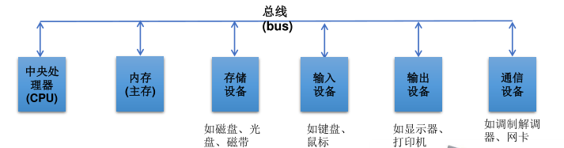
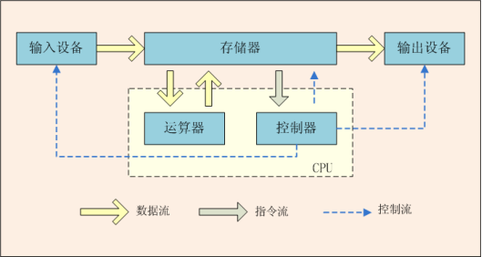
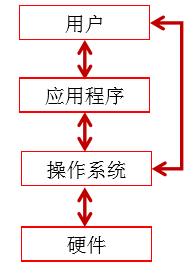
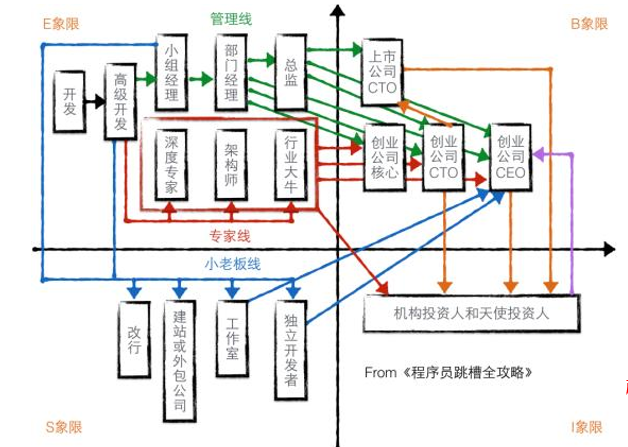

# **Java 快速入门**

$ 计算机 = 硬件 + 软件 $ （软件提供指令控制硬件完成特定任务）

$ 程序设计 = 开发软件 $

> 程序设计语言：  
>  1. 有很多种；  
>  2. 没有最好的语言；  
>  3. 工作中应掌握多种语言；  
>  4. 掌握一种语言后更易上手其他语言。  

**计算机硬件介绍**

**冯·诺依曼体系结构**

1. CPU（中央处理器）

从内存中获取指令，然后执行

包括：  

   1. 控制单元（控制和协调其他组件的动作）；  
   2. 算术/逻辑单元（完成数值运算—加减乘除和逻辑运算—比较）。  

> [!TIP]
>
> - 1 kHz = 1024 Hz
> - 1 mHz = 1024 kHz
> - 1 GHz（千兆赫） = 1024 mHz

计算机行业发展规律：摩尔定律、安迪-比尔定律、反摩尔定律

2. 存储设备

磁盘驱动器、光盘驱动器、 USB 闪存驱动器  

> [!TIP]
> ***bit*** 和 ***byte***：
>
> - 计算机中 **最小的存储单位** —— ***bit***  
> - 计算机中 **最基础的存储单元** —— ***byte***（字节）
>     - 1 ***B***（byte）= 8 ***bit***
>     - 1 ***KB*** = 1024 ***B***
>     - 1 ***MB*** = 1024 ***KB***
>     - 1 ***GB*** = 1024 ***MB***
>     - 1 ***TB*** = 1024 ***GB***

3. 内存（RAM）

> [!WARNING]
> 一个程序和它的数据在被 CPU 执行前必须移到计算机的内存中  

   1. 内存读取数据的速度比硬盘的存取速度快 10 倍，CPU 的速度比内存不知还要快多少倍
   2. 内存是带电存储的（断电数据就会消失），而且容量有限  

**作用**

- 保存从硬盘读取的数据，提供给 CPU 使用；
- 保存 CPU 的一些临时执行结果，以便 CPU 下次使用/保存到硬盘

4. 输入设备

键盘、鼠标  

5. 输出设备

打印机、显示器（分辨率越高，图像越锐化、越清晰）  

$ 像素密度 = \sqrt{(长度像素数)^2 + (宽度像素数)^2} / 屏幕尺寸 $

**计算机发展史的鼻祖**

**图灵** ：当之无愧的计算机科学和人工智能之父  

**冯·诺依曼** ：“计算机之父”和“博弈论之父”  

?> 计算机的基本概念属于图灵，冯·诺依曼的基本作用是使世界认识了由图灵引入的计算机基本概念

**操作系统**( `Operating System` ，即 **OS**)

管理和控制计算机的活动

**职业发展与提升**

?> $ Education 自我学习（10\%）+ Exposure 向他人学习（20\%）+ Experience 工作中学习 （70\%）$

