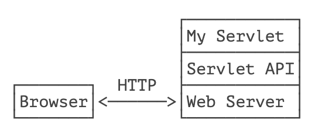
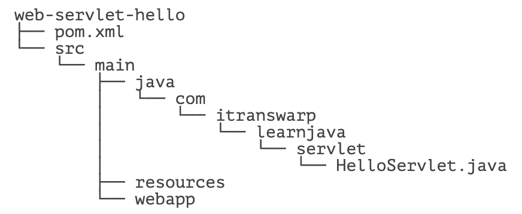
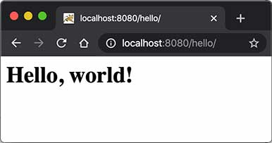

# **Servlet 入门**

在上一节中，我们看到，编写 HTTP 服务器其实是非常简单的，只需要先编写基于多线程的 TCP 服务，然后在一个 TCP 连接中读取 HTTP 请求，发送 HTTP 响应即可。

但是，要编写一个完善的 HTTP 服务器，以 HTTP/1.1 为例，需要考虑的包括：

- 识别正确和错误的 HTTP 请求；
- 识别正确和错误的 HTTP 头；
- 复用 TCP 连接；
- 复用线程；
- IO 异常处理；
- ...

这些基础工作需要耗费大量的时间，并且经过长期测试才能稳定运行。如果我们只需要输出一个简单的 HTML 页面，就不得不编写上千行底层代码，那就根本无法做到高效而可靠地开发。

因此，在 JavaEE 平台上，处理 TCP 连接，解析 HTTP 协议这些底层工作统统扔给现成的 Web 服务器去做，我们只需要把自己的应用程序跑在 Web 服务器上。为了实现这一目的，JavaEE 提供了 Servlet API，我们使用 Servlet API 编写自己的 Servlet 来处理 HTTP 请求，Web 服务器实现 Servlet API 接口，实现底层功能：



我们来实现一个最简单的 Servlet：

```java
// WebServlet 注解表示这是一个 Servlet，并映射到地址 /:
@WebServlet(urlPatterns = "/")
public class HelloServlet extends HttpServlet {
    protected void doGet(HttpServletRequest req, HttpServletResponse resp)
            throws ServletException, IOException {
        // 设置响应类型:
        resp.setContentType("text/html");
        // 获取输出流:
        PrintWriter pw = resp.getWriter();
        // 写入响应:
        pw.write("<h1>Hello, world!</h1>");
        // 最后不要忘记 flush 强制输出:
        pw.flush();
    }
}
```

一个 Servlet 总是继承自 `HttpServlet`，然后覆写 `doGet()` 或 `doPost()` 方法。注意到 `doGet()` 方法传入了 `HttpServletRequest` 和 `HttpServletResponse` 两个对象，分别代表 HTTP 请求和响应。我们使用 Servlet API 时，并不直接与底层 TCP 交互，也不需要解析 HTTP 协议，因为 `HttpServletRequest` 和 `HttpServletResponse` 就已经封装好了请求和响应。以发送响应为例，我们只需要设置正确的响应类型，然后获取 `PrintWriter`，写入响应即可。

现在问题来了：Servlet API 是谁提供？

Servlet API 是一个 jar 包，我们需要通过 Maven 来引入它，才能正常编译。编写 `pom.xml` 文件如下：

```xml
<project xmlns="http://maven.apache.org/POM/4.0.0"
    xmlns:xsi="http://www.w3.org/2001/XMLSchema-instance"
    xsi:schemaLocation="http://maven.apache.org/POM/4.0.0 http://maven.apache.org/maven-v4_0_0.xsd">
    <modelVersion>4.0.0</modelVersion>
    <groupId>com.itranswarp.learnjava</groupId>
    <artifactId>web-servlet-hello</artifactId>
    <packaging>war</packaging>
    <version>1.0-SNAPSHOT</version>

    <properties>
        <project.build.sourceEncoding>UTF-8</project.build.sourceEncoding>
        <project.reporting.outputEncoding>UTF-8</project.reporting.outputEncoding>
        <maven.compiler.source>17</maven.compiler.source>
        <maven.compiler.target>17</maven.compiler.target>
        <java.version>17</java.version>
    </properties>

    <dependencies>
        <dependency>
            <groupId>jakarta.servlet</groupId>
            <artifactId>jakarta.servlet-api</artifactId>
            <version>5.0.0</version>
            <scope>provided</scope>
        </dependency>
    </dependencies>

    <build>
        <finalName>hello</finalName>
    </build>
</project>
```

注意到这个 `pom.xml` 与前面我们讲到的普通 Java 程序有个区别，打包类型不是 `jar`，而是 `war`，表示 Java Web Application Archive：

```xml
<packaging>war</packaging>
```

引入的 Servlet API 如下：

```xml
<dependency>
    <groupId>jakarta.servlet</groupId>
    <artifactId>jakarta.servlet-api</artifactId>
    <version>5.0.0</version>
    <scope>provided</scope>
</dependency>
```

注意到 `<scope>` 指定为 `provided`，表示编译时使用，但不会打包到 `.war` 文件中，因为运行期 Web 服务器本身已经提供了 Servlet API 相关的 jar 包。

## Servlet 版本

要务必注意 `servlet-api` 的版本。4.0 及之前的 `servlet-api` 由 Oracle 官方维护，引入的依赖项是 `javax.servlet:javax.servlet-api`，编写代码时引入的包名为：

```java
import javax.servlet.*;
```

而 5.0 及以后的 `servlet-api` 由 Eclipse 开源社区维护，引入的依赖项是 `jakarta.servlet:jakarta.servlet-api`，编写代码时引入的包名为：

```java
import jakarta.servlet.*;
```

教程采用最新的 `jakarta.servlet:5.0.0` 版本，但对于很多仅支持 Servlet 4.0 版本的框架来说，例如 Spring 5，我们就只能使用 `javax.servlet:4.0.0` 版本，这一点针对不同项目要特别注意。

> [!ATTENTION]
> 引入不同的 Servlet API 版本，编写代码时导入的相关 API 的包名是不同的。

整个工程结构如下：



目录 `webapp` 目前为空，如果我们需要存放一些资源文件，则需要放入该目录。有的同学可能会问，`webapp` 目录下是否需要一个 `/WEB-INF/web.xml` 配置文件？这个配置文件是低版本 Servlet 必须的，但是高版本 Servlet 已不再需要，所以无需该配置文件。

运行 Maven 命令 `mvn clean package`，在 `target` 目录下得到一个 `hello.war` 文件，这个文件就是我们编译打包后的 Web 应用程序。

> [!ATTENTION]
> 如果执行 package 命令遇到 Execution default-war of goal org.apache.maven.plugins:maven-war-plugin:2.2:war failed 错误时，可手动指定 maven-war-plugin 最新版本 3.3.2，参考练习工程的 pom.xml。

现在问题又来了：我们应该如何运行这个 `war` 文件？

普通的 Java 程序是通过启动 JVM，然后执行 `main()` 方法开始运行。但是 Web 应用程序有所不同，我们无法直接运行 `war` 文件，必须先启动 Web 服务器，再由 Web 服务器加载我们编写的 `HelloServlet`，这样就可以让 `HelloServlet` 处理浏览器发送的请求。

因此，我们首先要找一个支持 Servlet API 的 Web 服务器。常用的服务器有：

- [Tomcat](https://tomcat.apache.org/)：由 Apache 开发的开源免费服务器；
- [Jetty](https://www.eclipse.org/jetty/)：由 Eclipse 开发的开源免费服务器；
- [GlassFish](https://javaee.github.io/glassfish/)：一个开源的全功能 JavaEE 服务器。

还有一些收费的商用服务器，如 Oracle 的 [WebLogic](https://www.oracle.com/middleware/weblogic/)，IBM 的 [WebSphere](https://www.ibm.com/cloud/websphere-application-platform/)。

无论使用哪个服务器，只要它支持 Servlet API 5.0（因为我们引入的 Servlet 版本是 5.0），我们的 war 包都可以在上面运行。这里我们选择使用最广泛的开源免费的 Tomcat 服务器。

要运行我们的 `hello.war`，首先要 [下载 Tomcat 服务器](https://tomcat.apache.org/download-10.cgi)，解压后，把 `hello.war` 复制到 Tomcat 的 `webapps` 目录下，然后切换到 `bin` 目录，执行 `startup.sh` 或 `startup.bat` 启动 Tomcat 服务器：

```bash
$ ./startup.sh
Using CATALINA_BASE:   .../apache-tomcat-10.1.x
Using CATALINA_HOME:   .../apache-tomcat-10.1.x
Using CATALINA_TMPDIR: .../apache-tomcat-10.1.x/temp
Using JRE_HOME:        .../jdk-17.jdk/Contents/Home
Using CLASSPATH:       .../apache-tomcat-10.1.x/bin/bootstrap.jar:...
Tomcat started.
```

在浏览器输入 `http://localhost:8080/hello/` 即可看到 `HelloServlet` 的输出：



细心的童鞋可能会问，为啥路径是 `/hello/` 而不是 `/`？因为一个 Web 服务器允许同时运行多个 Web App，而我们的 Web App 叫 `hello`，因此，第一级目录 `/hello` 表示 Web App 的名字，后面的 `/` 才是我们在 `HelloServlet` 中映射的路径。

那能不能直接使用 `/` 而不是 `/hello/`？毕竟 `/` 比较简洁。

答案是肯定的。先关闭 Tomcat（执行 `shutdown.sh` 或 `shutdown.bat`），然后删除 Tomcat 的 webapps 目录下的所有文件夹和文件，最后把我们的 `hello.war` 复制过来，改名为 `ROOT.war`，文件名为 `ROOT` 的应用程序将作为默认应用，启动后直接访问 `http://localhost:8080/` 即可。

实际上，类似 Tomcat 这样的服务器也是 Java 编写的，启动 Tomcat 服务器实际上是启动 Java 虚拟机，执行 Tomcat 的 `main()` 方法，然后由 Tomcat 负责加载我们的 `.war` 文件，并创建一个 `HelloServlet` 实例，最后以多线程的模式来处理 HTTP 请求。如果 Tomcat 服务器收到的请求路径是 `/`（假定部署文件为 ROOT.war），就转发到 `HelloServlet` 并传入 `HttpServletRequest` 和 `HttpServletResponse` 两个对象。

因为我们编写的 Servlet 并不是直接运行，而是由 Web 服务器加载后创建实例运行，所以，类似 Tomcat 这样的 Web 服务器也称为 Servlet 容器。

## Tomcat 版本

由于 Servlet 版本分为 <=4.0 和>=5.0 两种，所以，要根据使用的 Servlet 版本选择正确的 Tomcat 版本。从[Tomcat 版本页](https://tomcat.apache.org/whichversion.html) 可知：

- 使用 Servlet<=4.0 时，选择 Tomcat 9.x 或更低版本；
- 使用 Servlet>=5.0 时，选择 Tomcat 10.x 或更高版本。

运行本节代码需要使用 Tomcat 10.x 版本。

在 Servlet 容器中运行的 Servlet 具有如下特点：

- 无法在代码中直接通过 new 创建 Servlet 实例，必须由 Servlet 容器自动创建 Servlet 实例；
- Servlet 容器只会给每个 Servlet 类创建唯一实例；
- Servlet 容器会使用多线程执行 `doGet()` 或 `doPost()` 方法。

复习一下 Java[多线程](https://www.liaoxuefeng.com/wiki/1252599548343744/1255943750561472) 的内容，我们可以得出结论：

- 在 Servlet 中定义的实例变量会被多个线程同时访问，要注意线程安全；
- `HttpServletRequest` 和 `HttpServletResponse` 实例是由 Servlet 容器传入的局部变量，它们只能被当前线程访问，不存在多个线程访问的问题；
- 在 `doGet()` 或 `doPost()` 方法中，如果使用了 `ThreadLocal`，但没有清理，那么它的状态很可能会影响到下次的某个请求，因为 Servlet 容器很可能用线程池实现线程复用。

因此，正确编写 Servlet，要清晰理解 Java 的多线程模型，需要同步访问的必须同步。

## 练习

给 `HelloServlet` 增加一个 URL 参数，例如传入 `http://localhost:8080/?name=Bob`，能够输出 `Hello, Bob!`。


提示：根据 [HttpServletRequest 文档](https://docs.oracle.com/javaee/6/api/javax/servlet/http/HttpServletRequest.html)，调用合适的方法获取 URL 参数。

## 小结

编写 Web 应用程序就是编写 Servlet 处理 HTTP 请求；

Servlet API 提供了 `HttpServletRequest` 和 `HttpServletResponse` 两个高级接口来封装 HTTP 请求和响应；

Web 应用程序必须按固定结构组织并打包为 `.war` 文件；

需要启动 Web 服务器来加载我们的 war 包来运行 Servlet。


