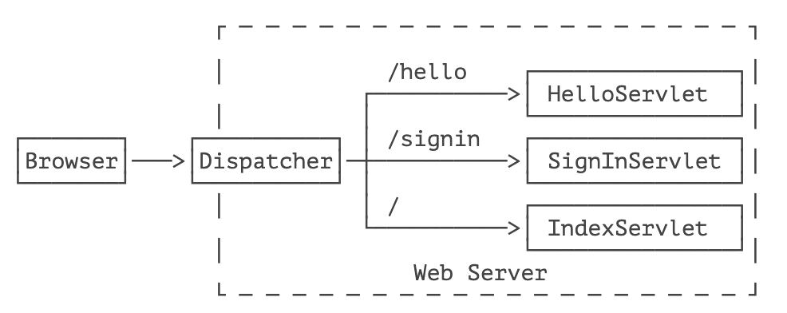
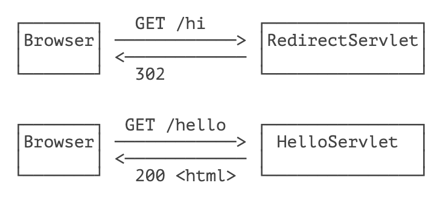
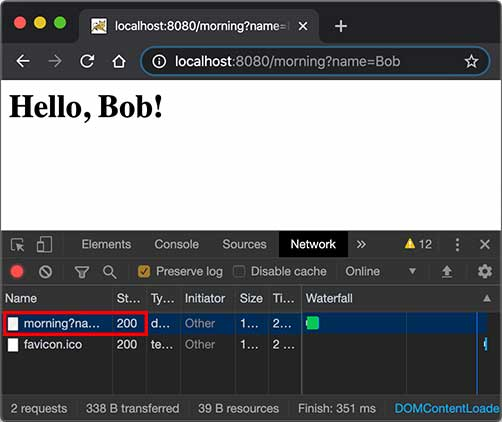
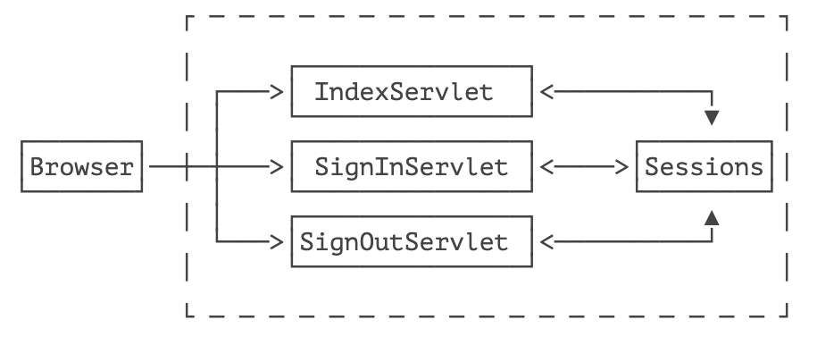
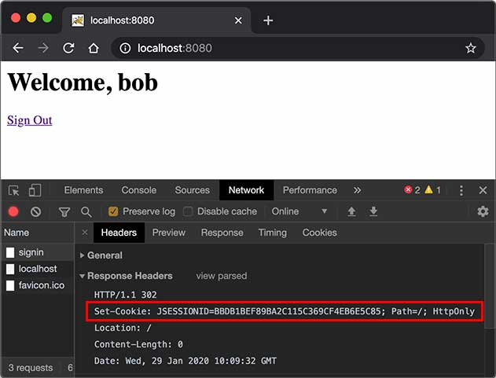
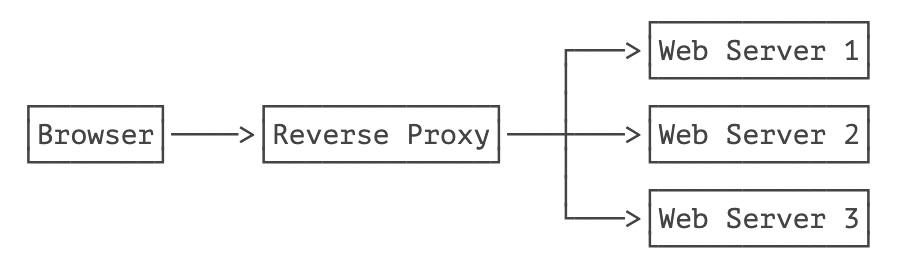
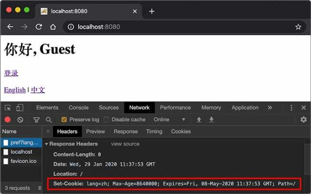

# **Servlet 进阶**

- [☘️ 重定向与转发](#重定向与转发)
- [☘️ 使用 Session 和 Cookie](#使用-Session-和-Cookie)


一个 Web App 就是由一个或多个 Servlet 组成的，每个 Servlet 通过注解说明自己能处理的路径。例如：

```java
@WebServlet(urlPatterns = "/hello")
public class HelloServlet extends HttpServlet {
    ...
}
```

上述 `HelloServlet` 能处理 `/hello` 这个路径的请求。

> [!ATTENTION]
> 早期的 Servlet 需要在 web.xml 中配置映射路径，但最新 Servlet 版本只需要通过注解就可以完成映射。

因为浏览器发送请求的时候，还会有请求方法（HTTP Method）：即 GET、POST、PUT 等不同类型的请求。因此，要处理 GET 请求，我们要覆写 `doGet()` 方法：

```java
@WebServlet(urlPatterns = "/hello")
public class HelloServlet extends HttpServlet {
    @Override
    protected void doGet(HttpServletRequest req, HttpServletResponse resp) throws ServletException, IOException {
        ...
    }
}
```

类似的，要处理 POST 请求，就需要覆写 `doPost()` 方法。

如果没有覆写 `doPost()` 方法，那么 `HelloServlet` 能不能处理 `POST /hello` 请求呢？

我们查看一下 `HttpServlet` 的 `doPost()` 方法就一目了然了：它会直接返回 405 或 400 错误。因此，一个 Servlet 如果映射到 `/hello`，那么所有请求方法都会由这个 Servlet 处理，至于能不能返回 200 成功响应，要看有没有覆写对应的请求方法。

一个 Webapp 完全可以有多个 Servlet，分别映射不同的路径。例如：

```java
@WebServlet(urlPatterns = "/hello")
public class HelloServlet extends HttpServlet {
    ...
}

@WebServlet(urlPatterns = "/signin")
public class SignInServlet extends HttpServlet {
    ...
}

@WebServlet(urlPatterns = "/")
public class IndexServlet extends HttpServlet {
    ...
}
```

浏览器发出的 HTTP 请求总是由 Web Server 先接收，然后，根据 Servlet 配置的映射，不同的路径转发到不同的 Servlet：



这种根据路径转发的功能我们一般称为 Dispatch。映射到 `/` 的 `IndexServlet` 比较特殊，它实际上会接收所有未匹配的路径，相当于 `/*`，因为 Dispatcher 的逻辑可以用伪代码实现如下：

```java
String path = ...
if (path.equals("/hello")) {
    dispatchTo(helloServlet);
} else if (path.equals("/signin")) {
    dispatchTo(signinServlet);
} else {
    // 所有未匹配的路径均转发到 "/"
    dispatchTo(indexServlet);
}
```

所以我们在浏览器输入一个 `http://localhost:8080/abc` 也会看到 `IndexServlet` 生成的页面。

## HttpServletRequest

`HttpServletRequest` 封装了一个 HTTP 请求，它实际上是从 `ServletRequest` 继承而来。最早设计 Servlet 时，设计者希望 Servlet 不仅能处理 HTTP，也能处理类似 SMTP 等其他协议，因此，单独抽出了 `ServletRequest` 接口，但实际上除了 HTTP 外，并没有其他协议会用 Servlet 处理，所以这是一个过度设计。

我们通过 `HttpServletRequest` 提供的接口方法可以拿到 HTTP 请求的几乎全部信息，常用的方法有：

- getMethod()：返回请求方法，例如，`"GET"`，`"POST"`；
- getRequestURI()：返回请求路径，但不包括请求参数，例如，`"/hello"`；
- getQueryString()：返回请求参数，例如，`"name=Bob&a=1&b=2"`；
- getParameter(name)：返回请求参数，GET 请求从 URL 读取参数，POST 请求从 Body 中读取参数；
- getContentType()：获取请求 Body 的类型，例如，`"application/x-www-form-urlencoded"`；
- getContextPath()：获取当前 Webapp 挂载的路径，对于 ROOT 来说，总是返回空字符串 `""`；
- getCookies()：返回请求携带的所有 Cookie；
- getHeader(name)：获取指定的 Header，对 Header 名称不区分大小写；
- getHeaderNames()：返回所有 Header 名称；
- getInputStream()：如果该请求带有 HTTP Body，该方法将打开一个输入流用于读取 Body；
- getReader()：和 getInputStream() 类似，但打开的是 Reader；
- getRemoteAddr()：返回客户端的 IP 地址；
- getScheme()：返回协议类型，例如，`"http"`，`"https"`；

此外，`HttpServletRequest` 还有两个方法：`setAttribute()` 和 `getAttribute()`，可以给当前 `HttpServletRequest` 对象附加多个 Key-Value，相当于把 `HttpServletRequest` 当作一个 `Map<String, Object>` 使用。

调用 `HttpServletRequest` 的方法时，注意务必阅读接口方法的文档说明，因为有的方法会返回 `null`，例如 `getQueryString()` 的文档就写了：

```
... This method returns null if the URL does not have a query string...
```

## HttpServletResponse

`HttpServletResponse` 封装了一个 HTTP 响应。由于 HTTP 响应必须先发送 Header，再发送 Body，所以，操作 `HttpServletResponse` 对象时，必须先调用设置 Header 的方法，最后调用发送 Body 的方法。

常用的设置 Header 的方法有：

- setStatus(sc)：设置响应代码，默认是 `200`；
- setContentType(type)：设置 Body 的类型，例如，`"text/html"`；
- setCharacterEncoding(charset)：设置字符编码，例如，`"UTF-8"`；
- setHeader(name, value)：设置一个 Header 的值；
- addCookie(cookie)：给响应添加一个 Cookie；
- addHeader(name, value)：给响应添加一个 Header，因为 HTTP 协议允许有多个相同的 Header；

写入响应时，需要通过 `getOutputStream()` 获取写入流，或者通过 `getWriter()` 获取字符流，二者只能获取其中一个。

写入响应前，无需设置 `setContentLength()`，因为底层服务器会根据写入的字节数自动设置，如果写入的数据量很小，实际上会先写入缓冲区，如果写入的数据量很大，服务器会自动采用 Chunked 编码让浏览器能识别数据结束符而不需要设置 Content-Length 头。

但是，写入完毕后调用 `flush()` 却是必须的，因为大部分 Web 服务器都基于 HTTP/1.1 协议，会复用 TCP 连接。如果没有调用 `flush()`，将导致缓冲区的内容无法及时发送到客户端。此外，写入完毕后千万不要调用 `close()`，原因同样是因为会复用 TCP 连接，如果关闭写入流，将关闭 TCP 连接，使得 Web 服务器无法复用此 TCP 连接。

> [!ATTENTION]
> 写入完毕后对输出流调用 flush() 而不是 close() 方法！

有了 `HttpServletRequest` 和 `HttpServletResponse` 这两个高级接口，我们就不需要直接处理 HTTP 协议。注意到具体的实现类是由各服务器提供的，而我们编写的 Web 应用程序只关心接口方法，并不需要关心具体实现的子类。

## Servlet 多线程模型

一个 Servlet 类在服务器中只有一个实例，但对于每个 HTTP 请求，Web 服务器会使用多线程执行请求。因此，一个 Servlet 的 `doGet()`、`doPost()` 等处理请求的方法是多线程并发执行的。如果 Servlet 中定义了字段，要注意多线程并发访问的问题：

```java
public class HelloServlet extends HttpServlet {
    private Map<String, String> map = new ConcurrentHashMap<>();

    protected void doGet(HttpServletRequest req, HttpServletResponse resp) throws ServletException, IOException {
        // 注意读写 map 字段是多线程并发的:
        this.map.put(key, value);
    }
}
```

对于每个请求，Web 服务器会创建唯一的 `HttpServletRequest` 和 `HttpServletResponse` 实例，因此，`HttpServletRequest` 和 `HttpServletResponse` 实例只有在当前处理线程中有效，它们总是局部变量，不存在多线程共享的问题。

## 小结

一个 Webapp 中的多个 Servlet 依靠路径映射来处理不同的请求；

映射为 `/` 的 Servlet 可处理所有 “未匹配” 的请求；

如何处理请求取决于 Servlet 覆写的对应方法；

Web 服务器通过多线程处理 HTTP 请求，一个 Servlet 的处理方法可以由多线程并发执行。


# **重定向与转发**


## Redirect

重定向是指当浏览器请求一个 URL 时，服务器返回一个重定向指令，告诉浏览器地址已经变了，麻烦使用新的 URL 再重新发送新请求。

例如，我们已经编写了一个能处理 `/hello` 的 `HelloServlet`，如果收到的路径为 `/hi`，希望能重定向到 `/hello`，可以再编写一个 `RedirectServlet`：

```java
@WebServlet(urlPatterns = "/hi")
public class RedirectServlet extends HttpServlet {
    protected void doGet(HttpServletRequest req, HttpServletResponse resp) throws ServletException, IOException {
        // 构造重定向的路径:
        String name = req.getParameter("name");
        String redirectToUrl = "/hello" + (name == null ? "":"?name=" + name);
        // 发送重定向响应:
        resp.sendRedirect(redirectToUrl);
    }
}
```

如果浏览器发送 `GET /hi` 请求，`RedirectServlet` 将处理此请求。由于 `RedirectServlet` 在内部又发送了重定向响应，因此，浏览器会收到如下响应：

```bash
HTTP/1.1 302 Found
Location: /hello
```

当浏览器收到 302 响应后，它会立刻根据 `Location` 的指示发送一个新的 `GET /hello` 请求，这个过程就是重定向：



观察 Chrome 浏览器的网络请求，可以看到两次 HTTP 请求：


并且浏览器的地址栏路径自动更新为 `/hello`。

重定向有两种：一种是 302 响应，称为临时重定向，一种是 301 响应，称为永久重定向。两者的区别是，如果服务器发送 301 永久重定向响应，浏览器会缓存 `/hi` 到 `/hello` 这个重定向的关联，下次请求 `/hi` 的时候，浏览器就直接发送 `/hello` 请求了。

重定向有什么作用？重定向的目的是当 Web 应用升级后，如果请求路径发生了变化，可以将原来的路径重定向到新路径，从而避免浏览器请求原路径找不到资源。

`HttpServletResponse` 提供了快捷的 `redirect()` 方法实现 302 重定向。如果要实现 301 永久重定向，可以这么写：

```java
resp.setStatus(HttpServletResponse.SC_MOVED_PERMANENTLY); // 301
resp.setHeader("Location", "/hello");
```

## Forward

Forward 是指内部转发。当一个 Servlet 处理请求的时候，它可以决定自己不继续处理，而是转发给另一个 Servlet 处理。

例如，我们已经编写了一个能处理 `/hello` 的 `HelloServlet`，继续编写一个能处理 `/morning` 的 `ForwardServlet`：

```java
@WebServlet(urlPatterns = "/morning")
public class ForwardServlet extends HttpServlet {
    protected void doGet(HttpServletRequest req, HttpServletResponse resp) throws ServletException, IOException {
        req.getRequestDispatcher("/hello").forward(req, resp);
    }
}
```

`ForwardServlet` 在收到请求后，它并不自己发送响应，而是把请求和响应都转发给路径为 `/hello` 的 Servlet，即下面的代码：

```java
req.getRequestDispatcher("/hello").forward(req, resp);
```

后续请求的处理实际上是由 `HelloServlet` 完成的。这种处理方式称为转发（Forward），我们用流程图画出来如下：


转发和重定向的区别在于，转发是在 Web 服务器内部完成的，对浏览器来说，它只发出了一个 HTTP 请求：



注意到使用转发的时候，浏览器的地址栏路径仍然是 `/morning`，浏览器并不知道该请求在 Web 服务器内部实际上做了一次转发。

## 练习

使用重定向和转发

## 小结

使用重定向时，浏览器知道重定向规则，并且会自动发起新的 HTTP 请求；

使用转发时，浏览器并不知道服务器内部的转发逻辑。


# **使用 Session 和 Cookie**

在 Web 应用程序中，我们经常要跟踪用户身份。当一个用户登录成功后，如果他继续访问其他页面，Web 程序如何才能识别出该用户身份？

因为 HTTP 协议是一个无状态协议，即 Web 应用程序无法区分收到的两个 HTTP 请求是否是同一个浏览器发出的。为了跟踪用户状态，服务器可以向浏览器分配一个唯一 ID，并以 Cookie 的形式发送到浏览器，浏览器在后续访问时总是附带此 Cookie，这样，服务器就可以识别用户身份。

## Session

我们把这种基于唯一 ID 识别用户身份的机制称为 Session。每个用户第一次访问服务器后，会自动获得一个 Session ID。如果用户在一段时间内没有访问服务器，那么 Session 会自动失效，下次即使带着上次分配的 Session ID 访问，服务器也认为这是一个新用户，会分配新的 Session ID。

JavaEE 的 Servlet 机制内建了对 Session 的支持。我们以登录为例，当一个用户登录成功后，我们就可以把这个用户的名字放入一个 `HttpSession` 对象，以便后续访问其他页面的时候，能直接从 `HttpSession` 取出用户名：

```java
@WebServlet(urlPatterns = "/signin")
public class SignInServlet extends HttpServlet {
    // 模拟一个数据库:
    private Map<String, String> users = Map.of("bob", "bob123", "alice", "alice123", "tom", "tomcat");

    // GET 请求时显示登录页:
    protected void doGet(HttpServletRequest req, HttpServletResponse resp) throws ServletException, IOException {
        resp.setContentType("text/html");
        PrintWriter pw = resp.getWriter();
        pw.write("<h1>Sign In</h1>");
        pw.write("<form action=\"/signin\"method=\"post\">");
        pw.write("<p>Username: <input name=\"username\"></p>");
        pw.write("<p>Password: <input name=\"password\"type=\"password\"></p>");
        pw.write("<p><button type=\"submit\">Sign In</button> <a href=\"/\">Cancel</a></p>");
        pw.write("</form>");
        pw.flush();
    }

    // POST 请求时处理用户登录:
    protected void doPost(HttpServletRequest req, HttpServletResponse resp) throws ServletException, IOException {
        String name = req.getParameter("username");
        String password = req.getParameter("password");
        String expectedPassword = users.get(name.toLowerCase());
        if (expectedPassword != null && expectedPassword.equals(password)) {
            // 登录成功:
            req.getSession().setAttribute("user", name);
            resp.sendRedirect("/");
        } else {
            resp.sendError(HttpServletResponse.SC_FORBIDDEN);
        }
    }
}
```

上述 `SignInServlet` 在判断用户登录成功后，立刻将用户名放入当前 `HttpSession` 中：

```java
HttpSession session = req.getSession();
session.setAttribute("user", name);
```

在 `IndexServlet` 中，可以从 `HttpSession` 取出用户名：

```java
@WebServlet(urlPatterns = "/")
public class IndexServlet extends HttpServlet {
    protected void doGet(HttpServletRequest req, HttpServletResponse resp) throws ServletException, IOException {
        // 从 HttpSession 获取当前用户名:
        String user = (String) req.getSession().getAttribute("user");
        resp.setContentType("text/html");
        resp.setCharacterEncoding("UTF-8");
        resp.setHeader("X-Powered-By", "JavaEE Servlet");
        PrintWriter pw = resp.getWriter();
        pw.write("<h1>Welcome," + (user != null ? user : "Guest") + "</h1>");
        if (user == null) {
            // 未登录，显示登录链接:
            pw.write("<p><a href=\"/signin\">Sign In</a></p>");
        } else {
            // 已登录，显示登出链接:
            pw.write("<p><a href=\"/signout\">Sign Out</a></p>");
        }
        pw.flush();
    }
}
```

如果用户已登录，可以通过访问 `/signout` 登出。登出逻辑就是从 `HttpSession` 中移除用户相关信息：

```java
@WebServlet(urlPatterns = "/signout")
public class SignOutServlet extends HttpServlet {
    protected void doGet(HttpServletRequest req, HttpServletResponse resp) throws ServletException, IOException {
        // 从 HttpSession 移除用户名:
        req.getSession().removeAttribute("user");
        resp.sendRedirect("/");
    }
}
```

对于 Web 应用程序来说，我们总是通过 `HttpSession` 这个高级接口访问当前 Session。如果要深入理解 Session 原理，可以认为 Web 服务器在内存中自动维护了一个 ID 到 `HttpSession` 的映射表，我们可以用下图表示：



而服务器识别 Session 的关键就是依靠一个名为 `JSESSIONID` 的 Cookie。在 Servlet 中第一次调用 `req.getSession()` 时，Servlet 容器自动创建一个 Session ID，然后通过一个名为 `JSESSIONID` 的 Cookie 发送给浏览器：



这里要注意的几点是：

- `JSESSIONID` 是由 Servlet 容器自动创建的，目的是维护一个浏览器会话，它和我们的登录逻辑没有关系；
- 登录和登出的业务逻辑是我们自己根据 `HttpSession` 是否存在一个 `"user"` 的 Key 判断的，登出后，Session ID 并不会改变；
- 即使没有登录功能，仍然可以使用 `HttpSession` 追踪用户，例如，放入一些用户配置信息等。

除了使用 Cookie 机制可以实现 Session 外，还可以通过隐藏表单、URL 末尾附加 ID 来追踪 Session。这些机制很少使用，最常用的 Session 机制仍然是 Cookie。

使用 Session 时，由于服务器把所有用户的 Session 都存储在内存中，如果遇到内存不足的情况，就需要把部分不活动的 Session 序列化到磁盘上，这会大大降低服务器的运行效率，因此，放入 Session 的对象要小，通常我们放入一个简单的 `User` 对象就足够了：

```java
public class User {
    public long id; // 唯一标识
    public String email;
    public String name;
}
```

在使用多台服务器构成集群时，使用 Session 会遇到一些额外的问题。通常，多台服务器集群使用反向代理作为网站入口：



如果多台 Web Server 采用无状态集群，那么反向代理总是以轮询方式将请求依次转发给每台 Web Server，这会造成一个用户在 Web Server 1 存储的 Session 信息，在 Web Server 2 和 3 上并不存在，即从 Web Server 1 登录后，如果后续请求被转发到 Web Server 2 或 3，那么用户看到的仍然是未登录状态。

要解决这个问题，方案一是在所有 Web Server 之间进行 Session 复制，但这样会严重消耗网络带宽，并且，每个 Web Server 的内存均存储所有用户的 Session，内存使用率很低。

另一个方案是采用粘滞会话（Sticky Session）机制，即反向代理在转发请求的时候，总是根据 JSESSIONID 的值判断，相同的 JSESSIONID 总是转发到固定的 Web Server，但这需要反向代理的支持。

无论采用何种方案，使用 Session 机制，会使得 Web Server 的集群很难扩展，因此，Session 适用于中小型 Web 应用程序。对于大型 Web 应用程序来说，通常需要避免使用 Session 机制。

## Cookie

实际上，Servlet 提供的 `HttpSession` 本质上就是通过一个名为 `JSESSIONID` 的 Cookie 来跟踪用户会话的。除了这个名称外，其他名称的 Cookie 我们可以任意使用。

如果我们想要设置一个 Cookie，例如，记录用户选择的语言，可以编写一个 `LanguageServlet`：

```java
@WebServlet(urlPatterns = "/pref")
public class LanguageServlet extends HttpServlet {

    private static final Set<String> LANGUAGES = Set.of("en", "zh");

    protected void doGet(HttpServletRequest req, HttpServletResponse resp) throws ServletException, IOException {
        String lang = req.getParameter("lang");
        if (LANGUAGES.contains(lang)) {
            // 创建一个新的 Cookie:
            Cookie cookie = new Cookie("lang", lang);
            // 该 Cookie 生效的路径范围:
            cookie.setPath("/");
            // 该 Cookie 有效期:
            cookie.setMaxAge(8640000); // 8640000 秒 = 100 天
            // 将该 Cookie 添加到响应:
            resp.addCookie(cookie);
        }
        resp.sendRedirect("/");
    }
}
```

创建一个新 Cookie 时，除了指定名称和值以外，通常需要设置 `setPath("/")`，浏览器根据此前缀决定是否发送 Cookie。如果一个 Cookie 调用了 `setPath("/user/")`，那么浏览器只有在请求以 `/user/` 开头的路径时才会附加此 Cookie。通过 `setMaxAge()` 设置 Cookie 的有效期，单位为秒，最后通过 `resp.addCookie()` 把它添加到响应。

如果访问的是 https 网页，还需要调用 `setSecure(true)`，否则浏览器不会发送该 Cookie。

因此，务必注意：浏览器在请求某个 URL 时，是否携带指定的 Cookie，取决于 Cookie 是否满足以下所有要求：

- URL 前缀是设置 Cookie 时的 Path；
- Cookie 在有效期内；
- Cookie 设置了 secure 时必须以 https 访问。

我们可以在浏览器看到服务器发送的 Cookie：



如果我们要读取 Cookie，例如，在 `IndexServlet` 中，读取名为 `lang` 的 Cookie 以获取用户设置的语言，可以写一个方法如下：

```java
private String parseLanguageFromCookie(HttpServletRequest req) {
    // 获取请求附带的所有 Cookie:
    Cookie[] cookies = req.getCookies();
    // 如果获取到 Cookie:
    if (cookies != null) {
        // 循环每个 Cookie:
        for (Cookie cookie : cookies) {
            // 如果 Cookie 名称为 lang:
            if (cookie.getName().equals("lang")) {
                // 返回 Cookie 的值:
                return cookie.getValue();
            }
        }
    }
    // 返回默认值:
    return "en";
}
```

可见，读取 Cookie 主要依靠遍历 `HttpServletRequest` 附带的所有 Cookie。

## 练习


## 小结

Servlet 容器提供了 Session 机制以跟踪用户；

默认的 Session 机制是以 Cookie 形式实现的，Cookie 名称为 `JSESSIONID`；

通过读写 Cookie 可以在客户端设置用户偏好等。


