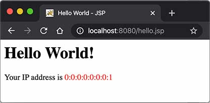

# **JSP 开发**


我们从前面的章节可以看到，Servlet 就是一个能处理 HTTP 请求，发送 HTTP 响应的小程序，而发送响应无非就是获取 `PrintWriter`，然后输出 HTML：

```java
PrintWriter pw = resp.getWriter();
pw.write("<html>");
pw.write("<body>");
pw.write("<h1>Welcome," + name + "!</h1>");
pw.write("</body>");
pw.write("</html>");
pw.flush();
```

只不过，用 PrintWriter 输出 HTML 比较痛苦，因为不但要正确编写 HTML，还需要插入各种变量。如果想在 Servlet 中输出一个类似新浪首页的 HTML，写对 HTML 基本上不太可能。

那有没有更简单的输出 HTML 的办法？

## 有！

我们可以使用 JSP。

JSP 是 Java Server Pages 的缩写，它的文件必须放到 `/src/main/webapp` 下，文件名必须以 `.jsp` 结尾，整个文件与 HTML 并无太大区别，但需要插入变量，或者动态输出的地方，使用特殊指令 `<% ... %>`。

我们来编写一个 `hello.jsp`，内容如下：

```html
<html>
<head>
    <title>Hello World - JSP</title>
</head>
<body>
    <%-- JSP Comment --%>
    <h1>Hello World!</h1>
    <p>
    <%
         out.println("Your IP address is");
    %>
    <span style="color:red">
        <%= request.getRemoteAddr() %>
    </span>
    </p>
</body>
</html>
```

整个 JSP 的内容实际上是一个 HTML，但是稍有不同：

- 包含在 `<%--` 和 `--%>` 之间的是 JSP 的注释，它们会被完全忽略；
- 包含在 `<%` 和 `%>` 之间的是 Java 代码，可以编写任意 Java 代码；
- 如果使用 `<%= xxx %>` 则可以快捷输出一个变量的值。

JSP 页面内置了几个变量：

- `out` ：表示 HttpServletResponse 的 PrintWriter；
- `session` ：表示当前 HttpSession 对象；
- `request` ：表示 HttpServletRequest 对象。

这几个变量可以直接使用。

访问 JSP 页面时，直接指定完整路径。例如，`http://localhost:8080/hello.jsp`，浏览器显示如下：



JSP 和 Servlet 有什么区别？其实它们没有任何区别，因为 JSP 在执行前首先被编译成一个 Servlet。在 Tomcat 的临时目录下，可以找到一个 `hello_jsp.java` 的源文件，这个文件就是 Tomcat 把 JSP 自动转换成的 Servlet 源码：

```java
package org.apache.jsp;
import xxx.xxx.xxx

public final class hello_jsp extends org.apache.jasper.runtime.HttpJspBase
    implements org.apache.jasper.runtime.JspSourceDependent,
               org.apache.jasper.runtime.JspSourceImports {

    ...

    public void _jspService(final javax.servlet.http.HttpServletRequest request, final javax.servlet.http.HttpServletResponse response)
        throws java.io.IOException, javax.servlet.ServletException {
        ...
        out.write("<html>\n");
        out.write("<head>\n");
        out.write("<title>Hello World - JSP</title>\n");
        out.write("</head>\n");
        out.write("<body>\n");
        ...
    }
    ...
}
```

可见 JSP 本质上就是一个 Servlet，只不过无需配置映射路径，Web Server 会根据路径查找对应的 `.jsp` 文件，如果找到了，就自动编译成 Servlet 再执行。在服务器运行过程中，如果修改了 JSP 的内容，那么服务器会自动重新编译。

## JSP 高级功能

JSP 的指令非常复杂，除了 `<% ... %>` 外，JSP 页面本身可以通过 `page` 指令引入 Java 类：

```jsp
<%@ page import="java.io.*" %>
<%@ page import="java.util.*" %>
```

这样后续的 Java 代码才能引用简单类名而不是完整类名。

使用 `include` 指令可以引入另一个 JSP 文件：

```html
<html>
<body>
    <%@ include file="header.jsp"%>
    <h1>Index Page</h1>
    <%@ include file="footer.jsp"%>
</body>
```

## JSP Tag

JSP 还允许自定义输出的 tag，例如：

```jsp
<c:out value = "${sessionScope.user.name}"/>
```

JSP Tag 需要正确引入 taglib 的 jar 包，并且还需要正确声明，使用起来非常复杂，对于页面开发来说，* 不推荐 * 使用 JSP Tag，因为我们后续会介绍更简单的模板引擎，这里我们不再介绍如何使用 taglib。

## 练习

编写一个简单的 JSP 文件，输出当前日期和时间。


## 小结

JSP 是一种在 HTML 中嵌入动态输出的文件，它和 Servlet 正好相反，Servlet 是在 Java 代码中嵌入输出 HTML；

JSP 可以引入并使用 JSP Tag，但由于其语法复杂，不推荐使用；

JSP 本身目前已经很少使用，我们只需要了解其基本用法即可。


