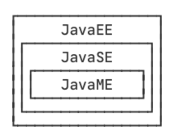
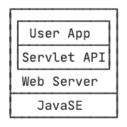

从本章开始，我们就正式进入到 JavaEE 的领域。

什么是 JavaEE？JavaEE 是 Java Platform Enterprise Edition 的缩写，即 Java 企业平台。我们前面介绍的所有基于标准 JDK 的开发都是 JavaSE，即 Java Platform Standard Edition。此外，还有一个小众不太常用的 JavaME：Java Platform Micro Edition，是 Java 移动开发平台（非 Android），它们三者关系如下：

JavaME 是一个裁剪后的 “微型版”JDK，现在使用很少，我们不用管它。JavaEE 也不是凭空冒出来的，它实际上是完全基于 JavaSE，只是多了一大堆服务器相关的库以及 API 接口。所有的 JavaEE 程序，仍然是运行在标准的 JavaSE 的虚拟机上的。

最早的 JavaEE 的名称是 J2EE：Java 2 Platform Enterprise Edition，后来改名为 JavaEE。由于 Oracle 将 JavaEE 移交给 [Eclipse](https://www.eclipse.org/) 开源组织时，不允许他们继续使用 Java 商标，所以 JavaEE 再次改名为 [Jakarta EE](https://jakarta.ee/) 。因为这个拼写比较复杂而且难记，所以我们后面还是用 JavaEE 这个缩写。

JavaEE 并不是一个软件产品，它更多的是一种软件架构和设计思想。我们可以把 JavaEE 看作是在 JavaSE 的基础上，开发的一系列基于服务器的组件、API 标准和通用架构。

JavaEE 最核心的组件就是基于 Servlet 标准的 Web 服务器，开发者编写的应用程序是基于 Servlet API 并运行在 Web 服务器内部的：

此外，JavaEE 还有一系列技术标准：

- EJB：Enterprise JavaBean，企业级 JavaBean，早期经常用于实现应用程序的业务逻辑，现在基本被轻量级框架如 Spring 所取代；
- JAAS：Java Authentication and Authorization Service，一个标准的认证和授权服务，常用于企业内部，Web 程序通常使用更轻量级的自定义认证；
- JCA：JavaEE Connector Architecture，用于连接企业内部的 EIS 系统等；
- JMS：Java Message Service，用于消息服务；
- JTA：Java Transaction API，用于分布式事务；
- JAX-WS：Java API for XML Web Services，用于构建基于 XML 的 Web 服务；
- ...

目前流行的基于 Spring 的轻量级 JavaEE 开发架构，使用最广泛的是 Servlet 和 JMS，以及一系列开源组件。本章我们将详细介绍基于 Servlet 的 Web 开发。

