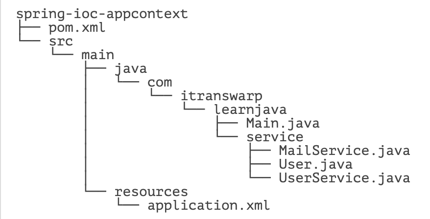
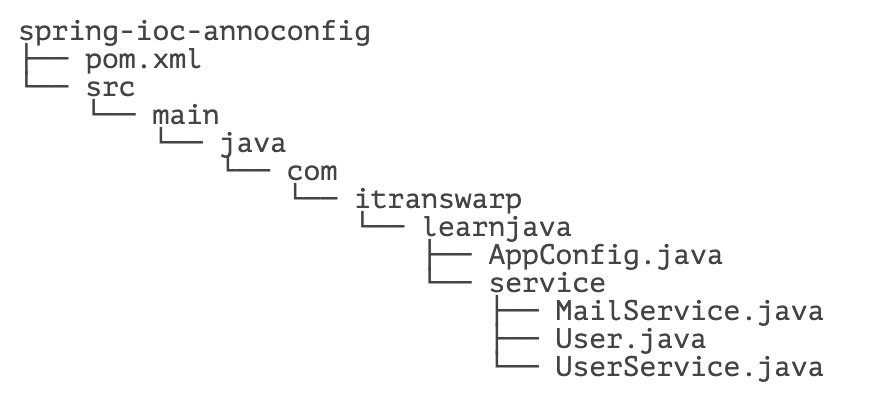
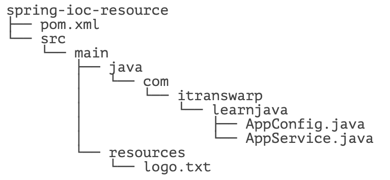

# **IoC 容器**

- [☘️ IoC 原理](#IoC-原理)
- [☘️ 装配 Bean](#装配-Bean)
- [☘️ 使用 Annotation 配置](#使用-Annotation-配置)
- [☘️ 定制 Bean](#定制-Bean)
- [☘️ 使用 Resource](#使用-Resource)
- [☘️ 注入配置](#注入配置)
- [☘️ 使用条件装配](#使用条件装配)


在学习 Spring 框架时，我们遇到的第一个也是最核心的概念就是容器。

什么是容器？容器是一种为某种特定组件的运行提供必要支持的一个软件环境。例如，Tomcat 就是一个 Servlet 容器，它可以为 Servlet 的运行提供运行环境。类似 Docker 这样的软件也是一个容器，它提供了必要的 Linux 环境以便运行一个特定的 Linux 进程。

通常来说，使用容器运行组件，除了提供一个组件运行环境之外，容器还提供了许多底层服务。例如，Servlet 容器底层实现了 TCP 连接，解析 HTTP 协议等非常复杂的服务，如果没有容器来提供这些服务，我们就无法编写像 Servlet 这样代码简单，功能强大的组件。早期的 JavaEE 服务器提供的 EJB 容器最重要的功能就是通过声明式事务服务，使得 EJB 组件的开发人员不必自己编写冗长的事务处理代码，所以极大地简化了事务处理。

Spring 的核心就是提供了一个 IoC 容器，它可以管理所有轻量级的 JavaBean 组件，提供的底层服务包括组件的生命周期管理、配置和组装服务、AOP 支持，以及建立在 AOP 基础上的声明式事务服务等。

本章我们讨论的 IoC 容器，主要介绍 Spring 容器如何对组件进行生命周期管理和配置组装服务。


# **IoC 原理**


Spring 提供的容器又称为 IoC 容器，什么是 IoC？

IoC 全称 Inversion of Control，直译为控制反转。那么何谓 IoC？在理解 IoC 之前，我们先看看通常的 Java 组件是如何协作的。

我们假定一个在线书店，通过 `BookService` 获取书籍：

```java
public class BookService {
    private HikariConfig config = new HikariConfig();
    private DataSource dataSource = new HikariDataSource(config);

    public Book getBook(long bookId) {
        try (Connection conn = dataSource.getConnection()) {
            ...
            return book;
        }
    }
}
```

为了从数据库查询书籍，`BookService` 持有一个 `DataSource`。为了实例化一个 `HikariDataSource`，又不得不实例化一个 `HikariConfig`。

现在，我们继续编写 `UserService` 获取用户：

```java
public class UserService {
    private HikariConfig config = new HikariConfig();
    private DataSource dataSource = new HikariDataSource(config);

    public User getUser(long userId) {
        try (Connection conn = dataSource.getConnection()) {
            ...
            return user;
        }
    }
}
```

因为 `UserService` 也需要访问数据库，因此，我们不得不也实例化一个 `HikariDataSource`。

在处理用户购买的 `CartServlet` 中，我们需要实例化 `UserService` 和 `BookService`：

```java
public class CartServlet extends HttpServlet {
    private BookService bookService = new BookService();
    private UserService userService = new UserService();

    protected void doGet(HttpServletRequest req, HttpServletResponse resp) throws ServletException, IOException {
        long currentUserId = getFromCookie(req);
        User currentUser = userService.getUser(currentUserId);
        Book book = bookService.getBook(req.getParameter("bookId"));
        cartService.addToCart(currentUser, book);
        ...
    }
}
```

类似的，在购买历史 `HistoryServlet` 中，也需要实例化 `UserService` 和 `BookService`：

```java
public class HistoryServlet extends HttpServlet {
    private BookService bookService = new BookService();
    private UserService userService = new UserService();
}
```

上述每个组件都采用了一种简单的通过 `new` 创建实例并持有的方式。仔细观察，会发现以下缺点：

1. 实例化一个组件其实很难，例如，`BookService` 和 `UserService` 要创建 `HikariDataSource`，实际上需要读取配置，才能先实例化 `HikariConfig`，再实例化 `HikariDataSource`。
2. 没有必要让 `BookService` 和 `UserService` 分别创建 `DataSource` 实例，完全可以共享同一个 `DataSource`，但谁负责创建 `DataSource`，谁负责获取其他组件已经创建的 `DataSource`，不好处理。类似的，`CartServlet` 和 `HistoryServlet` 也应当共享 `BookService` 实例和 `UserService` 实例，但也不好处理。
3. 很多组件需要销毁以便释放资源，例如 `DataSource`，但如果该组件被多个组件共享，如何确保它的使用方都已经全部被销毁？
4. 随着更多的组件被引入，例如，书籍评论，需要共享的组件写起来会更困难，这些组件的依赖关系会越来越复杂。
5. 测试某个组件，例如 `BookService`，是复杂的，因为必须要在真实的数据库环境下执行。

从上面的例子可以看出，如果一个系统有大量的组件，其生命周期和相互之间的依赖关系如果由组件自身来维护，不但大大增加了系统的复杂度，而且会导致组件之间极为紧密的耦合，继而给测试和维护带来了极大的困难。

因此，核心问题是：

1. 谁负责创建组件？
2. 谁负责根据依赖关系组装组件？
3. 销毁时，如何按依赖顺序正确销毁？

解决这一问题的核心方案就是 IoC。

传统的应用程序中，控制权在程序本身，程序的控制流程完全由开发者控制，例如：

`CartServlet` 创建了 `BookService`，在创建 `BookService` 的过程中，又创建了 `DataSource` 组件。这种模式的缺点是，一个组件如果要使用另一个组件，必须先知道如何正确地创建它。

在 IoC 模式下，控制权发生了反转，即从应用程序转移到了 IoC 容器，所有组件不再由应用程序自己创建和配置，而是由 IoC 容器负责，这样，应用程序只需要直接使用已经创建好并且配置好的组件。为了能让组件在 IoC 容器中被 “装配” 出来，需要某种 “注入” 机制，例如，`BookService` 自己并不会创建 `DataSource`，而是等待外部通过 `setDataSource()` 方法来注入一个 `DataSource`：

```java
public class BookService {
    private DataSource dataSource;

    public void setDataSource(DataSource dataSource) {
        this.dataSource = dataSource;
    }
}
```

不直接 `new` 一个 `DataSource`，而是注入一个 `DataSource`，这个小小的改动虽然简单，却带来了一系列好处：

1. `BookService` 不再关心如何创建 `DataSource`，因此，不必编写读取数据库配置之类的代码；
2. `DataSource` 实例被注入到 `BookService`，同样也可以注入到 `UserService`，因此，共享一个组件非常简单；
3. 测试 `BookService` 更容易，因为注入的是 `DataSource`，可以使用内存数据库，而不是真实的 MySQL 配置。

因此，IoC 又称为依赖注入（DI：Dependency Injection），它解决了一个最主要的问题：将组件的创建 + 配置与组件的使用相分离，并且，由 IoC 容器负责管理组件的生命周期。

因为 IoC 容器要负责实例化所有的组件，因此，有必要告诉容器如何创建组件，以及各组件的依赖关系。一种最简单的配置是通过 XML 文件来实现，例如：

```xml
<beans>
    <bean id="dataSource" class="HikariDataSource" />
    <bean id="bookService" class="BookService">
        <property name="dataSource" ref="dataSource" />
    </bean>
    <bean id="userService" class="UserService">
        <property name="dataSource" ref="dataSource" />
    </bean>
</beans>
```

上述 XML 配置文件指示 IoC 容器创建 3 个 JavaBean 组件，并把 id 为 `dataSource` 的组件通过属性 `dataSource`（即调用 `setDataSource()` 方法）注入到另外两个组件中。

在 Spring 的 IoC 容器中，我们把所有组件统称为 JavaBean，即配置一个组件就是配置一个 Bean。

## 依赖注入方式

我们从上面的代码可以看到，依赖注入可以通过 `set()` 方法实现。但依赖注入也可以通过构造方法实现。

很多 Java 类都具有带参数的构造方法，如果我们把 `BookService` 改造为通过构造方法注入，那么实现代码如下：

```java
public class BookService {
    private DataSource dataSource;

    public BookService(DataSource dataSource) {
        this.dataSource = dataSource;
    }
}
```

Spring 的 IoC 容器同时支持属性注入和构造方法注入，并允许混合使用。

## 无侵入容器

在设计上，Spring 的 IoC 容器是一个高度可扩展的无侵入容器。所谓无侵入，是指应用程序的组件无需实现 Spring 的特定接口，或者说，组件根本不知道自己在 Spring 的容器中运行。这种无侵入的设计有以下好处：

1. 应用程序组件既可以在 Spring 的 IoC 容器中运行，也可以自己编写代码自行组装配置；
2. 测试的时候并不依赖 Spring 容器，可单独进行测试，大大提高了开发效率。


# **装配 Bean**


我们前面讨论了为什么要使用 Spring 的 IoC 容器，因为让容器来为我们创建并装配 Bean 能获得很大的好处，那么到底如何使用 IoC 容器？装配好的 Bean 又如何使用？

我们来看一个具体的用户注册登录的例子。整个工程的结构如下：



首先，我们用 Maven 创建工程并引入 `spring-context` 依赖：

- org.springframework:spring-context:6.0.0

我们先编写一个 `MailService`，用于在用户登录和注册成功后发送邮件通知：

```java
public class MailService {
    private ZoneId zoneId = ZoneId.systemDefault();

    public void setZoneId(ZoneId zoneId) {
        this.zoneId = zoneId;
    }

    public String getTime() {
        return ZonedDateTime.now(this.zoneId).format(DateTimeFormatter.ISO_ZONED_DATE_TIME);
    }

    public void sendLoginMail(User user) {
        System.err.println(String.format("Hi, %s! You are logged in at %s", user.getName(), getTime()));
    }

    public void sendRegistrationMail(User user) {
        System.err.println(String.format("Welcome, %s!", user.getName()));

    }
}
```

再编写一个 `UserService`，实现用户注册和登录：

```java
public class UserService {
    private MailService mailService;

    public void setMailService(MailService mailService) {
        this.mailService = mailService;
    }

    private List<User> users = new ArrayList<>(List.of( // users:
            new User(1, "bob@example.com", "password", "Bob"), // bob
            new User(2, "alice@example.com", "password", "Alice"), // alice
            new User(3, "tom@example.com", "password", "Tom"))); // tom

    public User login(String email, String password) {
        for (User user : users) {
            if (user.getEmail().equalsIgnoreCase(email) && user.getPassword().equals(password)) {
                mailService.sendLoginMail(user);
                return user;
            }
        }
        throw new RuntimeException("login failed.");
    }

    public User getUser(long id) {
        return this.users.stream().filter(user -> user.getId() == id).findFirst().orElseThrow();
    }

    public User register(String email, String password, String name) {
        users.forEach((user) -> {
            if (user.getEmail().equalsIgnoreCase(email)) {
                throw new RuntimeException("email exist.");
            }
        });
        User user = new User(users.stream().mapToLong(u -> u.getId()).max().getAsLong() + 1, email, password, name);
        users.add(user);
        mailService.sendRegistrationMail(user);
        return user;
    }
}
```

注意到 `UserService` 通过 `setMailService()` 注入了一个 `MailService`。

然后，我们需要编写一个特定的 `application.xml` 配置文件，告诉 Spring 的 IoC 容器应该如何创建并组装 Bean：

```xml
<?xml version="1.0" encoding="UTF-8"?>
<beans xmlns="http://www.springframework.org/schema/beans"
    xmlns:xsi="http://www.w3.org/2001/XMLSchema-instance"
    xsi:schemaLocation="http://www.springframework.org/schema/beans
        https://www.springframework.org/schema/beans/spring-beans.xsd">

    <bean id="userService" class="com.itranswarp.learnjava.service.UserService">
        <property name="mailService" ref="mailService" />
    </bean>

    <bean id="mailService" class="com.itranswarp.learnjava.service.MailService" />
</beans>
```

注意观察上述配置文件，其中与 XML Schema 相关的部分格式是固定的，我们只关注两个 `<bean ...>` 的配置：

- 每个 `<bean ...>` 都有一个 `id` 标识，相当于 Bean 的唯一 ID；
- 在 `userService`Bean 中，通过 `<property name="..." ref="..." />` 注入了另一个 Bean；
- Bean 的顺序不重要，Spring 根据依赖关系会自动正确初始化。

把上述 XML 配置文件用 Java 代码写出来，就像这样：

```java
UserService userService = new UserService();
MailService mailService = new MailService();
userService.setMailService(mailService);
```

只不过 Spring 容器是通过读取 XML 文件后使用反射完成的。

如果注入的不是 Bean，而是 `boolean`、`int`、`String` 这样的数据类型，则通过 `value` 注入，例如，创建一个 `HikariDataSource`：

```xml
<bean id="dataSource" class="com.zaxxer.hikari.HikariDataSource">
    <property name="jdbcUrl" value="jdbc:mysql://localhost:3306/test" />
    <property name="username" value="root" />
    <property name="password" value="password" />
    <property name="maximumPoolSize" value="10" />
    <property name="autoCommit" value="true" />
</bean>
```

最后一步，我们需要创建一个 Spring 的 IoC 容器实例，然后加载配置文件，让 Spring 容器为我们创建并装配好配置文件中指定的所有 Bean，这只需要一行代码：

```java
ApplicationContext context = new ClassPathXmlApplicationContext("application.xml");
```

接下来，我们就可以从 Spring 容器中 “取出” 装配好的 Bean 然后使用它：

```java
// 获取 Bean:
UserService userService = context.getBean(UserService.class);
// 正常调用:
User user = userService.login("bob@example.com", "password");
```

完整的 `main()` 方法如下：

```java
public class Main {
    public static void main(String[] args) {
        ApplicationContext context = new ClassPathXmlApplicationContext("application.xml");
        UserService userService = context.getBean(UserService.class);
        User user = userService.login("bob@example.com", "password");
        System.out.println(user.getName());
    }
}
```

## ApplicationContext

我们从创建 Spring 容器的代码：

```java
ApplicationContext context = new ClassPathXmlApplicationContext("application.xml");
```

可以看到，Spring 容器就是 `ApplicationContext`，它是一个接口，有很多实现类，这里我们选择 `ClassPathXmlApplicationContext`，表示它会自动从 classpath 中查找指定的 XML 配置文件。

获得了 `ApplicationContext` 的实例，就获得了 IoC 容器的引用。从 `ApplicationContext` 中我们可以根据 Bean 的 ID 获取 Bean，但更多的时候我们根据 Bean 的类型获取 Bean 的引用：

```java
UserService userService = context.getBean(UserService.class);
```

Spring 还提供另一种 IoC 容器叫 `BeanFactory`，使用方式和 `ApplicationContext` 类似：

```java
BeanFactory factory = new XmlBeanFactory(new ClassPathResource("application.xml"));
MailService mailService = factory.getBean(MailService.class);
```

`BeanFactory` 和 `ApplicationContext` 的区别在于，`BeanFactory` 的实现是按需创建，即第一次获取 Bean 时才创建这个 Bean，而 `ApplicationContext` 会一次性创建所有的 Bean。实际上，`ApplicationContext` 接口是从 `BeanFactory` 接口继承而来的，并且，`ApplicationContext` 提供了一些额外的功能，包括国际化支持、事件和通知机制等。通常情况下，我们总是使用 `ApplicationContext`，很少会考虑使用 `BeanFactory`。

## 练习

在上述示例的基础上，继续给 `UserService` 注入 `DataSource`，并把注册和登录功能通过数据库实现。


## 小结

Spring 的 IoC 容器接口是 `ApplicationContext`，并提供了多种实现类；

通过 XML 配置文件创建 IoC 容器时，使用 `ClassPathXmlApplicationContext`；

持有 IoC 容器后，通过 `getBean()` 方法获取 Bean 的引用。


# **使用 Annotation 配置**


使用 Spring 的 IoC 容器，实际上就是通过类似 XML 这样的配置文件，把我们自己的 Bean 的依赖关系描述出来，然后让容器来创建并装配 Bean。一旦容器初始化完毕，我们就直接从容器中获取 Bean 使用它们。

使用 XML 配置的优点是所有的 Bean 都能一目了然地列出来，并通过配置注入能直观地看到每个 Bean 的依赖。它的缺点是写起来非常繁琐，每增加一个组件，就必须把新的 Bean 配置到 XML 中。

有没有其他更简单的配置方式呢？

有！我们可以使用 Annotation 配置，可以完全不需要 XML，让 Spring 自动扫描 Bean 并组装它们。

我们把上一节的示例改造一下，先删除 XML 配置文件，然后，给 `UserService` 和 `MailService` 添加几个注解。

首先，我们给 `MailService` 添加一个 `@Component` 注解：

```java
@Component
public class MailService {
    ...
}
```

这个 `@Component` 注解就相当于定义了一个 Bean，它有一个可选的名称，默认是 `mailService`，即小写开头的类名。

然后，我们给 `UserService` 添加一个 `@Component` 注解和一个 `@Autowired` 注解：

```java
@Component
public class UserService {
    @Autowired
    MailService mailService;

    ...
}
```

使用 `@Autowired` 就相当于把指定类型的 Bean 注入到指定的字段中。和 XML 配置相比，`@Autowired` 大幅简化了注入，因为它不但可以写在 `set()` 方法上，还可以直接写在字段上，甚至可以写在构造方法中：

```java
@Component
public class UserService {
    MailService mailService;

    public UserService(@Autowired MailService mailService) {
        this.mailService = mailService;
    }
    ...
}
```

我们一般把 `@Autowired` 写在字段上，通常使用 package 权限的字段，便于测试。

最后，编写一个 `AppConfig` 类启动容器：

```java
@Configuration
@ComponentScan
public class AppConfig {
    public static void main(String[] args) {
        ApplicationContext context = new AnnotationConfigApplicationContext(AppConfig.class);
        UserService userService = context.getBean(UserService.class);
        User user = userService.login("bob@example.com", "password");
        System.out.println(user.getName());
    }
}
```

除了 `main()` 方法外，`AppConfig` 标注了 `@Configuration`，表示它是一个配置类，因为我们创建 `ApplicationContext` 时：

```java
ApplicationContext context = new AnnotationConfigApplicationContext(AppConfig.class);
```

使用的实现类是 `AnnotationConfigApplicationContext`，必须传入一个标注了 `@Configuration` 的类名。

此外，`AppConfig` 还标注了 `@ComponentScan`，它告诉容器，自动搜索当前类所在的包以及子包，把所有标注为 `@Component` 的 Bean 自动创建出来，并根据 `@Autowired` 进行装配。

整个工程结构如下：



使用 Annotation 配合自动扫描能大幅简化 Spring 的配置，我们只需要保证：

- 每个 Bean 被标注为 `@Component` 并正确使用 `@Autowired` 注入；
- 配置类被标注为 `@Configuration` 和 `@ComponentScan`；
- 所有 Bean 均在指定包以及子包内。

使用 `@ComponentScan` 非常方便，但是，我们也要特别注意包的层次结构。通常来说，启动配置 `AppConfig` 位于自定义的顶层包（例如 `com.itranswarp.learnjava`），其他 Bean 按类别放入子包。

## 思考

如果我们想给 `UserService` 注入 `HikariDataSource`，但是这个类位于 `com.zaxxer.hikari` 包中，并且 `HikariDataSource` 也不可能有 `@Component` 注解，如何告诉 IoC 容器创建并配置 `HikariDataSource`？或者换个说法，如何创建并配置一个第三方 Bean？

## 练习

使用 Annotation 配置 IoC 容器

## 小结

使用 Annotation 可以大幅简化配置，每个 Bean 通过 `@Component` 和 `@Autowired` 注入；

必须合理设计包的层次结构，才能发挥 `@ComponentScan` 的威力。


# **定制 Bean**


## Scope

对于 Spring 容器来说，当我们把一个 Bean 标记为 `@Component` 后，它就会自动为我们创建一个单例（Singleton），即容器初始化时创建 Bean，容器关闭前销毁 Bean。在容器运行期间，我们调用 `getBean(Class)` 获取到的 Bean 总是同一个实例。

还有一种 Bean，我们每次调用 `getBean(Class)`，容器都返回一个新的实例，这种 Bean 称为 Prototype（原型），它的生命周期显然和 Singleton 不同。声明一个 Prototype 的 Bean 时，需要添加一个额外的 `@Scope` 注解：

```java
@Component
@Scope(ConfigurableBeanFactory.SCOPE_PROTOTYPE) // @Scope("prototype")
public class MailSession {
    ...
}
```

## 注入 List

有些时候，我们会有一系列接口相同，不同实现类的 Bean。例如，注册用户时，我们要对 email、password 和 name 这 3 个变量进行验证。为了便于扩展，我们先定义验证接口：

```java
public interface Validator {
    void validate(String email, String password, String name);
}
```

然后，分别使用 3 个 `Validator` 对用户参数进行验证：

```java
@Component
public class EmailValidator implements Validator {
    public void validate(String email, String password, String name) {
        if (!email.matches("^[a-z0-9]+\\@[a-z0-9]+\\.[a-z]{2,10}$")) {
            throw new IllegalArgumentException("invalid email:" + email);
        }
    }
}

@Component
public class PasswordValidator implements Validator {
    public void validate(String email, String password, String name) {
        if (!password.matches("^.{6,20}$")) {
            throw new IllegalArgumentException("invalid password");
        }
    }
}

@Component
public class NameValidator implements Validator {
    public void validate(String email, String password, String name) {
        if (name == null || name.isBlank() || name.length() > 20) {
            throw new IllegalArgumentException("invalid name:" + name);
        }
    }
}
```

最后，我们通过一个 `Validators` 作为入口进行验证：

```java
@Component
public class Validators {
    @Autowired
    List<Validator> validators;

    public void validate(String email, String password, String name) {
        for (var validator : this.validators) {
            validator.validate(email, password, name);
        }
    }
}
```

注意到 `Validators` 被注入了一个 `List<Validator>`，Spring 会自动把所有类型为 `Validator` 的 Bean 装配为一个 `List` 注入进来，这样一来，我们每新增一个 `Validator` 类型，就自动被 Spring 装配到 `Validators` 中了，非常方便。

因为 Spring 是通过扫描 classpath 获取到所有的 Bean，而 `List` 是有序的，要指定 `List` 中 Bean 的顺序，可以加上 `@Order` 注解：

```java
@Component
@Order(1)
public class EmailValidator implements Validator {
    ...
}

@Component
@Order(2)
public class PasswordValidator implements Validator {
    ...
}

@Component
@Order(3)
public class NameValidator implements Validator {
    ...
}
```

## 可选注入

默认情况下，当我们标记了一个 `@Autowired` 后，Spring 如果没有找到对应类型的 Bean，它会抛出 `NoSuchBeanDefinitionException` 异常。

可以给 `@Autowired` 增加一个 `required = false` 的参数：

```java
@Component
public class MailService {
    @Autowired(required = false)
    ZoneId zoneId = ZoneId.systemDefault();
    ...
}
```

这个参数告诉 Spring 容器，如果找到一个类型为 `ZoneId` 的 Bean，就注入，如果找不到，就忽略。

这种方式非常适合有定义就使用定义，没有就使用默认值的情况。

## 创建第三方 Bean

如果一个 Bean 不在我们自己的 package 管理之内，例如 `ZoneId`，如何创建它？

答案是我们自己在 `@Configuration` 类中编写一个 Java 方法创建并返回它，注意给方法标记一个 `@Bean` 注解：

```java
@Configuration
@ComponentScan
public class AppConfig {
    // 创建一个 Bean:
    @Bean
    ZoneId createZoneId() {
        return ZoneId.of("Z");
    }
}
```

Spring 对标记为 `@Bean` 的方法只调用一次，因此返回的 Bean 仍然是单例。

## 初始化和销毁

有些时候，一个 Bean 在注入必要的依赖后，需要进行初始化（监听消息等）。在容器关闭时，有时候还需要清理资源（关闭连接池等）。我们通常会定义一个 `init()` 方法进行初始化，定义一个 `shutdown()` 方法进行清理，然后，引入 JSR-250 定义的 Annotation：

- jakarta.annotation:jakarta.annotation-api:2.1.1

在 Bean 的初始化和清理方法上标记 `@PostConstruct` 和 `@PreDestroy`：

```java
@Component
public class MailService {
    @Autowired(required = false)
    ZoneId zoneId = ZoneId.systemDefault();

    @PostConstruct
    public void init() {
        System.out.println("Init mail service with zoneId =" + this.zoneId);
    }

    @PreDestroy
    public void shutdown() {
        System.out.println("Shutdown mail service");
    }
}
```

Spring 容器会对上述 Bean 做如下初始化流程：

- 调用构造方法创建 `MailService` 实例；
- 根据 `@Autowired` 进行注入；
- 调用标记有 `@PostConstruct` 的 `init()` 方法进行初始化。

而销毁时，容器会首先调用标记有 `@PreDestroy` 的 `shutdown()` 方法。

Spring 只根据 Annotation 查找 * 无参数 * 方法，对方法名不作要求。

## 使用别名

默认情况下，对一种类型的 Bean，容器只创建一个实例。但有些时候，我们需要对一种类型的 Bean 创建多个实例。例如，同时连接多个数据库，就必须创建多个 `DataSource` 实例。

如果我们在 `@Configuration` 类中创建了多个同类型的 Bean：

```java
@Configuration
@ComponentScan
public class AppConfig {
    @Bean
    ZoneId createZoneOfZ() {
        return ZoneId.of("Z");
    }

    @Bean
    ZoneId createZoneOfUTC8() {
        return ZoneId.of("UTC+08:00");
    }
}
```

Spring 会报 `NoUniqueBeanDefinitionException` 异常，意思是出现了重复的 Bean 定义。

这个时候，需要给每个 Bean 添加不同的名字：

```java
@Configuration
@ComponentScan
public class AppConfig {
    @Bean("z")
    ZoneId createZoneOfZ() {
        return ZoneId.of("Z");
    }

    @Bean
    @Qualifier("utc8")
    ZoneId createZoneOfUTC8() {
        return ZoneId.of("UTC+08:00");
    }
}
```

可以用 `@Bean("name")` 指定别名，也可以用 `@Bean`+`@Qualifier("name")` 指定别名。

存在多个同类型的 Bean 时，注入 `ZoneId` 又会报错：

```bash
NoUniqueBeanDefinitionException: No qualifying bean of type 'java.time.ZoneId' available: expected single matching bean but found 2
```

意思是期待找到唯一的 `ZoneId` 类型 Bean，但是找到两。因此，注入时，要指定 Bean 的名称：

```java
@Component
public class MailService {
	@Autowired(required = false)
	@Qualifier("z") // 指定注入名称为 "z" 的 ZoneId
	ZoneId zoneId = ZoneId.systemDefault();
    ...
}
```

还有一种方法是把其中某个 Bean 指定为 `@Primary`：

```java
@Configuration
@ComponentScan
public class AppConfig {
    @Bean
    @Primary // 指定为主要 Bean
    @Qualifier("z")
    ZoneId createZoneOfZ() {
        return ZoneId.of("Z");
    }

    @Bean
    @Qualifier("utc8")
    ZoneId createZoneOfUTC8() {
        return ZoneId.of("UTC+08:00");
    }
}
```

这样，在注入时，如果没有指出 Bean 的名字，Spring 会注入标记有 `@Primary` 的 Bean。这种方式也很常用。例如，对于主从两个数据源，通常将主数据源定义为 `@Primary`：

```java
@Configuration
@ComponentScan
public class AppConfig {
    @Bean
    @Primary
    DataSource createMasterDataSource() {
        ...
    }

    @Bean
    @Qualifier("slave")
    DataSource createSlaveDataSource() {
        ...
    }
}
```

其他 Bean 默认注入的就是主数据源。如果要注入从数据源，那么只需要指定名称即可。

## 使用 FactoryBean

我们在设计模式的 [工厂方法](https://www.liaoxuefeng.com/wiki/1252599548343744/1281319170474017) 中讲到，很多时候，可以通过工厂模式创建对象。Spring 也提供了工厂模式，允许定义一个工厂，然后由工厂创建真正的 Bean。

用工厂模式创建 Bean 需要实现 `FactoryBean` 接口。我们观察下面的代码：

```java
@Component
public class ZoneIdFactoryBean implements FactoryBean<ZoneId> {

    String zone = "Z";

    @Override
    public ZoneId getObject() throws Exception {
        return ZoneId.of(zone);
    }

    @Override
    public Class<?> getObjectType() {
        return ZoneId.class;
    }
}
```

当一个 Bean 实现了 `FactoryBean` 接口后，Spring 会先实例化这个工厂，然后调用 `getObject()` 创建真正的 Bean。`getObjectType()` 可以指定创建的 Bean 的类型，因为指定类型不一定与实际类型一致，可以是接口或抽象类。

因此，如果定义了一个 `FactoryBean`，要注意 Spring 创建的 Bean 实际上是这个 `FactoryBean` 的 `getObject()` 方法返回的 Bean。为了和普通 Bean 区分，我们通常都以 `XxxFactoryBean` 命名。

由于可以用 `@Bean` 方法创建第三方 Bean，本质上 `@Bean` 方法就是工厂方法，所以，`FactoryBean` 已经用得越来越少了。

## 练习

定制 Bean

## 小结

Spring 默认使用 Singleton 创建 Bean，也可指定 Scope 为 Prototype；

可将相同类型的 Bean 注入 `List` 或数组；

可用 `@Autowired(required=false)` 允许可选注入；

可用带 `@Bean` 标注的方法创建 Bean；

可使用 `@PostConstruct` 和 `@PreDestroy` 对 Bean 进行初始化和清理；

相同类型的 Bean 只能有一个指定为 `@Primary`，其他必须用 `@Qualifier("beanName")` 指定别名；

注入时，可通过别名 `@Qualifier("beanName")` 指定某个 Bean；

可以定义 `FactoryBean` 来使用工厂模式创建 Bean。


# **使用 Resource**


在 Java 程序中，我们经常会读取配置文件、资源文件等。使用 Spring 容器时，我们也可以把 “文件” 注入进来，方便程序读取。

例如，AppService 需要读取 `logo.txt` 这个文件，通常情况下，我们需要写很多繁琐的代码，主要是为了定位文件，打开 InputStream。

Spring 提供了一个 `org.springframework.core.io.Resource`（注意不是 `jarkata.annotation.Resource` 或 `javax.annotation.Resource`），它可以像 `String`、`int` 一样使用 `@Value` 注入：

```java
@Component
public class AppService {
    @Value("classpath:/logo.txt")
    private Resource resource;

    private String logo;

    @PostConstruct
    public void init() throws IOException {
        try (var reader = new BufferedReader(
                new InputStreamReader(resource.getInputStream(), StandardCharsets.UTF_8))) {
            this.logo = reader.lines().collect(Collectors.joining("\n"));
        }
    }
}
```

注入 `Resource` 最常用的方式是通过 classpath，即类似 `classpath:/logo.txt` 表示在 classpath 中搜索 `logo.txt` 文件，然后，我们直接调用 `Resource.getInputStream()` 就可以获取到输入流，避免了自己搜索文件的代码。

也可以直接指定文件的路径，例如：

```java
@Value("file:/path/to/logo.txt")
private Resource resource;
```

但使用 classpath 是最简单的方式。上述工程结构如下：



使用 Maven 的标准目录结构，所有资源文件放入 `src/main/resources` 即可。

## 练习

使用 Spring 的 `Resource` 注入 `app.properties` 文件，然后读取该配置文件。


## 小结

Spring 提供了 Resource 类便于注入资源文件。

最常用的注入是通过 classpath 以 `classpath:/path/to/file` 的形式注入。


# **注入配置**


在开发应用程序时，经常需要读取配置文件。最常用的配置方法是以 `key=value` 的形式写在 `.properties` 文件中。

例如，`MailService` 根据配置的 `app.zone=Asia/Shanghai` 来决定使用哪个时区。要读取配置文件，我们可以使用上一节讲到的 `Resource` 来读取位于 classpath 下的一个 `app.properties` 文件。但是，这样仍然比较繁琐。

Spring 容器还提供了一个更简单的 `@PropertySource` 来自动读取配置文件。我们只需要在 `@Configuration` 配置类上再添加一个注解：

```java
@Configuration
@ComponentScan
@PropertySource("app.properties") // 表示读取 classpath 的 app.properties
public class AppConfig {
    @Value("${app.zone:Z}")
    String zoneId;

    @Bean
    ZoneId createZoneId() {
        return ZoneId.of(zoneId);
    }
}
```

Spring 容器看到 `@PropertySource("app.properties")` 注解后，自动读取这个配置文件，然后，我们使用 `@Value` 正常注入：

```java
@Value("${app.zone:Z}")
String zoneId;
```

注意注入的字符串语法，它的格式如下：

- `"${app.zone}"` 表示读取 key 为 `app.zone` 的 value，如果 key 不存在，启动将报错；
- `"${app.zone:Z}"` 表示读取 key 为 `app.zone` 的 value，但如果 key 不存在，就使用默认值 `Z`。

这样一来，我们就可以根据 `app.zone` 的配置来创建 `ZoneId`。

还可以把注入的注解写到方法参数中：

```java
@Bean
ZoneId createZoneId(@Value("${app.zone:Z}") String zoneId) {
    return ZoneId.of(zoneId);
}
```

可见，先使用 `@PropertySource` 读取配置文件，然后通过 `@Value` 以 `${key:defaultValue}` 的形式注入，可以极大地简化读取配置的麻烦。

另一种注入配置的方式是先通过一个简单的 JavaBean 持有所有的配置，例如，一个 `SmtpConfig`：

```java
@Component
public class SmtpConfig {
    @Value("${smtp.host}")
    private String host;

    @Value("${smtp.port:25}")
    private int port;

    public String getHost() {
        return host;
    }

    public int getPort() {
        return port;
    }
}
```

然后，在需要读取的地方，使用 `#{smtpConfig.host}` 注入：

```java
@Component
public class MailService {
    @Value("#{smtpConfig.host}")
    private String smtpHost;

    @Value("#{smtpConfig.port}")
    private int smtpPort;
}
```

注意观察 `#{}` 这种注入语法，它和 `${key}` 不同的是，`#{}` 表示从 JavaBean 读取属性。`"#{smtpConfig.host}"` 的意思是，从名称为 `smtpConfig` 的 Bean 读取 `host` 属性，即调用 `getHost()` 方法。一个 Class 名为 `SmtpConfig` 的 Bean，它在 Spring 容器中的默认名称就是 `smtpConfig`，除非用 `@Qualifier` 指定了名称。

使用一个独立的 JavaBean 持有所有属性，然后在其他 Bean 中以 `#{bean.property}` 注入的好处是，多个 Bean 都可以引用同一个 Bean 的某个属性。例如，如果 `SmtpConfig` 决定从数据库中读取相关配置项，那么 `MailService` 注入的 `@Value("#{smtpConfig.host}")` 仍然可以不修改正常运行。

## 练习

注入 SMTP 配置

## 小结

Spring 容器可以通过 `@PropertySource` 自动读取配置，并以 `@Value("${key}")` 的形式注入；

可以通过 `${key:defaultValue}` 指定默认值；

以 `#{bean.property}` 形式注入时，Spring 容器自动把指定 Bean 的指定属性值注入。


# **使用条件装配**


开发应用程序时，我们会使用开发环境，例如，使用内存数据库以便快速启动。而运行在生产环境时，我们会使用生产环境，例如，使用 MySQL 数据库。如果应用程序可以根据自身的环境做一些适配，无疑会更加灵活。

Spring 为应用程序准备了 Profile 这一概念，用来表示不同的环境。例如，我们分别定义开发、测试和生产这 3 个环境：

- native
- test
- production

创建某个 Bean 时，Spring 容器可以根据注解 `@Profile` 来决定是否创建。例如，以下配置：

```java
@Configuration
@ComponentScan
public class AppConfig {
    @Bean
    @Profile("!test")
    ZoneId createZoneId() {
        return ZoneId.systemDefault();
    }

    @Bean
    @Profile("test")
    ZoneId createZoneIdForTest() {
        return ZoneId.of("America/New_York");
    }
}
```

如果当前的 Profile 设置为 `test`，则 Spring 容器会调用 `createZoneIdForTest()` 创建 `ZoneId`，否则，调用 `createZoneId()` 创建 `ZoneId`。注意到 `@Profile("!test")` 表示非 test 环境。

在运行程序时，加上 JVM 参数 `-Dspring.profiles.active=test` 就可以指定以 `test` 环境启动。

实际上，Spring 允许指定多个 Profile，例如：

```
-Dspring.profiles.active=test,master
```

可以表示 `test` 环境，并使用 `master` 分支代码。

要满足多个 Profile 条件，可以这样写：

```java
@Bean
@Profile({"test", "master"}) // 满足 test 或 master
ZoneId createZoneId() {
    ...
}
```

## 使用 Conditional

除了根据 `@Profile` 条件来决定是否创建某个 Bean 外，Spring 还可以根据 `@Conditional` 决定是否创建某个 Bean。

例如，我们对 `SmtpMailService` 添加如下注解：

```java
@Component
@Conditional(OnSmtpEnvCondition.class)
public class SmtpMailService implements MailService {
    ...
}
```

它的意思是，如果满足 `OnSmtpEnvCondition` 的条件，才会创建 `SmtpMailService` 这个 Bean。`OnSmtpEnvCondition` 的条件是什么呢？我们看一下代码：

```java
public class OnSmtpEnvCondition implements Condition {
    public boolean matches(ConditionContext context, AnnotatedTypeMetadata metadata) {
        return "true".equalsIgnoreCase(System.getenv("smtp"));
    }
}
```

因此，`OnSmtpEnvCondition` 的条件是存在环境变量 `smtp`，值为 `true`。这样，我们就可以通过环境变量来控制是否创建 `SmtpMailService`。

Spring 只提供了 `@Conditional` 注解，具体判断逻辑还需要我们自己实现。Spring Boot 提供了更多使用起来更简单的条件注解，例如，如果配置文件中存在 `app.smtp=true`，则创建 `MailService`：

```java
@Component
@ConditionalOnProperty(name="app.smtp", havingValue="true")
public class MailService {
    ...
}
```

如果当前 classpath 中存在类 `javax.mail.Transport`，则创建 `MailService`：

```java
@Component
@ConditionalOnClass(name = "javax.mail.Transport")
public class MailService {
    ...
}
```

后续我们会介绍 Spring Boot 的条件装配。我们以文件存储为例，假设我们需要保存用户上传的头像，并返回存储路径，在本地开发运行时，我们总是存储到文件：

```java
@Component
@ConditionalOnProperty(name = "app.storage", havingValue = "file", matchIfMissing = true)
public class FileUploader implements Uploader {
    ...
}
```

在生产环境运行时，我们会把文件存储到类似 AWS S3 上：

```java
@Component
@ConditionalOnProperty(name = "app.storage", havingValue = "s3")
public class S3Uploader implements Uploader {
    ...
}
```

其他需要存储的服务则注入 `Uploader`：

```java
@Component
public class UserImageService {
    @Autowired
    Uploader uploader;
}
```

当应用程序检测到配置文件存在 `app.storage=s3` 时，自动使用 `S3Uploader`，如果存在配置 `app.storage=file`，或者配置 `app.storage` 不存在，则使用 `FileUploader`。

可见，使用条件注解，能更灵活地装配 Bean。

## 练习

使用 @Profile 进行条件装配

## 小结

Spring 允许通过 `@Profile` 配置不同的 Bean；

Spring 还提供了 `@Conditional` 来进行条件装配，Spring Boot 在此基础上进一步提供了基于配置、Class、Bean 等条件进行装配。


