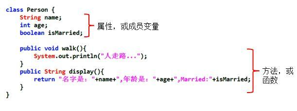

# **Java 基本元素：类和对象**

## 类 (Class)

是对一类事物的描述，是抽象的、概念上的定义。

### Java 类及类的成员

常见的类的成员有：
- ***属性*** ：对应类中的成员变量
  - $属性 = 成员变量 = Field = 域、字段$  
- ***方法*** ：对应类中的成员方法
  - $方法 = (成员)方法 = 函数 = Method$




### 类的语法格式

```java
修饰符 class 类名 { 
	属性声明;
	方法声明;
}
```

> [!TIP]
> 修饰符 `public` ：类可以被任意访问  
> 类的正文要用 `{` `}` 括起来 

举例： 

```java
public class Person{ 
	private int age ; 
	//声明私有变量 age 

	public void showAge(int i) { 
		//声明方法 showAge() 
		age = i; 
	} 
}
```

### 创建 Java 自定义类

1. *定义类*（考虑修饰符、类名）
2. *编写类的属性*（考虑修饰符、属性类型、属性名、初始化值）
3. *编写类的方法*（考虑修饰符、返回值类型、方法名、形参等）


## 对象 (Object)

是实际存在的该类事物的每个个体，因而也称为 ***实例*** (instance)。 

**“万事万物皆对象”**

可以理解为：
  - ***类*** = 抽象概念的人；
  - ***对象*** = 实实在在的某个人；


> [!NOTE]
> - 面向对象程序设计的重点是 *类的设计*
> - 类的设计，其实就是 *类的成员的设计*

---


