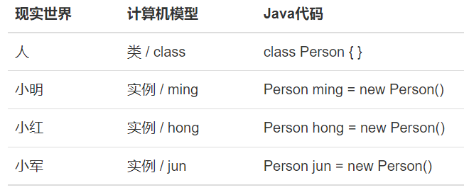
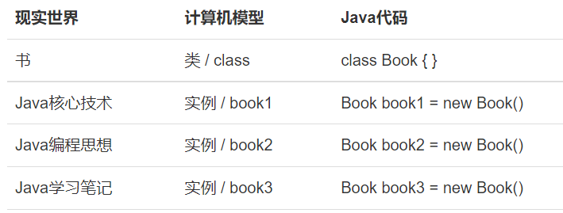
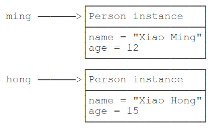

# **面向过程 (POP) 与面向对象 (OOP)**

二者都是一种思想，面向对象是相对于面向过程而言的。

面向对象编程，是一种通过对象的方式，把现实世界映射到计算机模型的一种编程方法。

现实世界中，我们定义了 “人” 这种抽象概念，而具体的人则是 “小明”、“小红”、“小军” 等一个个具体的人。所以，“人”可以定义为一个类（*class*），而具体的人则是实例（*instance*）：





同样的，“书” 也是一种抽象的概念，所以它是类，而《Java 核心技术》、《Java 编程思想》、《Java 学习笔记》则是实例：





## “人把大象装进冰箱”

1. ***面向过程*** ，强调的是功能行为，以函数为最小单位，考虑 ***怎么做*** 。

    ① 打开冰箱
    ② 把大象装进冰箱
    ③ 把冰箱门关闭

2. ***面向对象*** ，将功能封装进对象，强调具备了功能的对象，*以类 / 对象为最小单位*，考虑 ***谁来做*** 。

    ```java
        人 {
            打开 (冰箱){
                冰箱. 开门 ();
            }
            抬起 (大象){
                大象. 进入 (冰箱);
            }
            关闭 (冰箱){
                冰箱. 关门 ();
            }
        }
    
        冰箱 {
            开门 (){}
            关门 (){}
        }
    
        大象 {
            进入 (冰箱){}
        }
    ```

面向对象更加强调运用人类在日常的思维逻辑中采用的思想方法与原则，如抽象、分类、继承、聚合、多态等


## class 和 instance

所以，只要理解了 `class` 和 `instance` 的概念，基本上就明白了什么是面向对象编程。

`class` 是一种对象模版，它定义了如何创建实例，因此， `class` 本身就是一种数据类型：


而 instance 是对象实例，instance 是根据 class 创建的实例，可以创建多个 instance ，每个 instance 类型相同，但各自属性可能不相同：


## 定义 class


在 Java 中，创建一个类，例如，给这个类命名为 Person，就是定义一个 class：

```java
class Person {
    public String name;
    public int age;
}
```


一个 `class` 可以包含多个字段（*field*），字段用来描述一个类的特征。上面的 `Person` 类，我们定义了两个字段，一个是 `String` 类型的字段，命名为 `name` ，一个是 `int` 类型的字段，命名为 `age` 。因此，通过 `class` ，把一组数据汇集到一个对象上，实现了数据封装。

`public` 是用来修饰字段的，它表示这个字段可以被外部访问。

我们再看另一个 Book 类的定义：

```java
class Book {
    public String name;
    public String author;
    public String isbn;
    public double price;
}
```

请指出 `Book` 类的各个字段。


## 创建实例


定义了 `class` ，只是定义了对象模版，而要根据对象模版创建出真正的对象实例，必须用 `new` 操作符。

`new` 操作符可以创建一个实例，然后，我们需要定义一个引用类型的变量来指向这个实例：

```java
Person ming = new Person();
```

上述代码创建了一个 `Person` 类型的实例，并通过变量 `ming` 指向它。

注意区分 `Person ming` 是定义 `Person` 类型的变量 `ming` ，而 `new Person()` 是创建 `Person` 实例。

有了指向这个实例的变量，我们就可以通过这个变量来操作实例。访问实例变量可以用 `变量.字段` ，例如：

```java
    ming.name = "Xiao Ming"; // 对字段 name 赋值
    ming.age = 12; // 对字段 age 赋值
    System.out.println(ming.name); // 访问字段 name

    Person hong = new Person();
    hong.name = "Xiao Hong";
    hong.age = 15;
```


上述两个变量分别指向两个不同的实例，它们在内存中的结构如下：





两个 `instance` 拥有 `class` 定义的 `name` 和 `age` 字段，且各自都有一份独立的数据，互不干扰。


> [!ATTENTION]
> 一个 Java 源文件可以包含多个类的定义，但只能定义一个 `public` 类，且 `public` 类名必须与文件名一致。如果要定义多个 `public` 类，必须拆到多个 Java 源文件中。


## 面向对象的思想概述

- 程序员从面向过程的执行者转化成了面向对象的指挥者；
- 面向对象分析方法分析问题的思路和步骤：
    - 根据问题需要，选择问题所针对的现实世界中的实体。
    - 从实体中寻找解决问题相关的 *属性* 和 *功能* ，这些属性和功能就形成了概念世界中的类。
    - 把抽象的实体用计算机语言进行描述，形成计算机世界中类的定义。即借助某种程序语言，把类构造成计算机能够识别和处理的数据结构。
    - 将类实例化成计算机世界中的对象。对象是计算机世界中解决问题的最终工具。


## 练习


请定义一个 `City` 类，该 `class` 具有如下字段:

- `name` : 名称， `String` 类型
- `latitude` : 纬度， `double` 类型
- `longitude` : 经度， `double` 类型


实例化几个 City 并赋值，然后打印。

```java
public class Main {
    public static void main(String[] args) {
        City bj = new City();
        bj.name = "Beijing";
        bj.latitude = 39.903;
        bj.longitude = 116.401;
        System.out.println(bj.name);
        System.out.println("location:" + bj.latitude + "," + bj.longitude);
    }
}

class City {
    ???
}
```


## 小结


- 在 `OOP` 中， `class` 和 `instance` 是 “模版” 和“实例”的关系；
- 定义 `class` 就是定义了一种数据类型，对应的 `instance` 是这种数据类型的实例；
- `class` 定义的 `field` ，在每个 `instance` 都会拥有各自的 `field` ，且互不干扰；
- 通过 `new` 操作符创建新的 `instance` ，然后用变量指向它，即可通过变量来引用这个 `instance` ；
- 访问实例字段的方法是 `变量名.字段名` ；
- 指向 `instance` 的变量都是引用变量。


