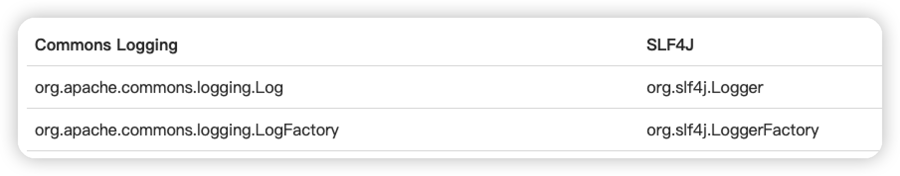

# **使用 SLF4J 和 Logback**

前面介绍了 Commons Logging 和 Log4j 这一对好基友，它们一个负责充当日志 API，一个负责实现日志底层，搭配使用非常便于开发。

有的童鞋可能还听说过 SLF4J 和 Logback。这两个东东看上去也像日志，它们又是啥？

其实 SLF4J 类似于 Commons Logging，也是一个日志接口，而 Logback 类似于 Log4j，是一个日志的实现。

为什么有了 Commons Logging 和 Log4j，又会蹦出来 SLF4J 和 Logback？这是因为 Java 有着非常悠久的开源历史，不但 OpenJDK 本身是开源的，而且我们用到的第三方库，几乎全部都是开源的。开源生态丰富的一个特定就是，同一个功能，可以找到若干种互相竞争的开源库。

因为对 Commons Logging 的接口不满意，有人就搞了 SLF4J。因为对 Log4j 的性能不满意，有人就搞了 Logback。

我们先来看看 SLF4J 对 Commons Logging 的接口有何改进。在 Commons Logging 中，我们要打印日志，有时候得这么写：

```java
int score = 99;
p.setScore(score);
log.info("Set score" + score + "for Person" + p.getName() + "ok.");
```

拼字符串是一个非常麻烦的事情，所以 SLF4J 的日志接口改进成这样了：

```java
int score = 99;
p.setScore(score);
logger.info("Set score {} for Person {} ok.", score, p.getName());
```

我们靠猜也能猜出来， SLF4J 的日志接口传入的是一个带占位符的字符串，用后面的变量自动替换占位符，所以看起来更加自然。

如何使用 SLF4J ？它的接口实际上和 Commons Logging 几乎一模一样：

```java
import org.slf4j.Logger;
import org.slf4j.LoggerFactory;

class Main {
    final Logger logger = LoggerFactory.getLogger(getClass());
}
```

对比一下 Commons Logging 和 SLF4J 的接口：




不同之处就是 Log 变成了 Logger，LogFactory 变成了 LoggerFactory。

使用 SLF4J 和 Logback 和前面讲到的使用 Commons Logging 加 Log4j 是类似的，先分别下载 [SLF4J](https://www.slf4j.org/download.html) 和 [Logback](https://logback.qos.ch/download.html) ，然后把以下 jar 包放到 classpath 下：

- slf4j-api-1.7.x.jar
- logback-classic-1.2.x.jar
- logback-core-1.2.x.jar


然后使用 SLF4J 的 Logger 和 LoggerFactory 即可。和 Log4j 类似，我们仍然需要一个 Logback 的配置文件，把 `logback.xml` 放到 classpath 下，配置如下：

```xml
<?xml version="1.0" encoding="UTF-8"?>
<configuration>

	<appender name="CONSOLE" class="ch.qos.logback.core.ConsoleAppender">
		<encoder>
			<pattern>%d{HH:mm:ss.SSS} [%thread] %-5level %logger{36} - %msg%n</pattern>
		</encoder>
	</appender>

	<appender name="FILE" class="ch.qos.logback.core.rolling.RollingFileAppender">
		<encoder>
			<pattern>%d{HH:mm:ss.SSS} [%thread] %-5level %logger{36} - %msg%n</pattern>
			<charset>utf-8</charset>
		</encoder>
		<file>log/output.log</file>
		<rollingPolicy class="ch.qos.logback.core.rolling.FixedWindowRollingPolicy">
			<fileNamePattern>log/output.log.%i</fileNamePattern>
		</rollingPolicy>
		<triggeringPolicy class="ch.qos.logback.core.rolling.SizeBasedTriggeringPolicy">
			<MaxFileSize>1MB</MaxFileSize>
		</triggeringPolicy>
	</appender>

	<root level="INFO">
		<appender-ref ref="CONSOLE" />
		<appender-ref ref="FILE" />
	</root>
</configuration>
```


运行即可获得类似如下的输出：

```
13:15:25.328 [main] INFO  com.itranswarp.learnjava.Main - Start process...
```

从目前的趋势来看，越来越多的开源项目从 Commons Logging 加 Log4j 转向了 SLF4J 加 Logback。

## 练习

根据配置文件，观察 Logback 写入的日志文件。

```java
import org.slf4j.Logger;
import org.slf4j.LoggerFactory;

import java.io.UnsupportedEncodingException;

public class SLF4JTest {
    static final Logger logger = LoggerFactory.getLogger(SLF4JTest.class);

    public static void main(String[] args) {
        logger.info("Start process {}...", SLF4JTest.class.getName());
        try {
            "".getBytes("invalidCharsetName");
        } catch (UnsupportedEncodingException e) {
            // TODO: 使用logger.error(String, Throwable)打印异常
            logger.error("invalid charset name", e);
        }
        logger.info("Process end.");
    }
}
```

```
16:44:56.564 [main] INFO  javase.test.d.work.SLF4JTest - Start process javase.test.d.work.SLF4JTest...
16:44:56.571 [main] ERROR javase.test.d.work.SLF4JTest - invalid charset name
java.io.UnsupportedEncodingException: invalidCharsetName
	at java.base/java.lang.String.lookupCharset(String.java:819)
	at java.base/java.lang.String.getBytes(String.java:1763)
	at javase.test.d.work.SLF4JTest.main(SLF4JTest.java:15)
16:44:56.571 [main] INFO  javase.test.d.work.SLF4JTest - Process end.
```


## 小结

- SLF4J 和 Logback 可以取代 Commons Logging 和 Log4j；
- 始终使用 SLF4J 的接口写入日志，使用 Logback 只需要配置，不需要修改代码。


