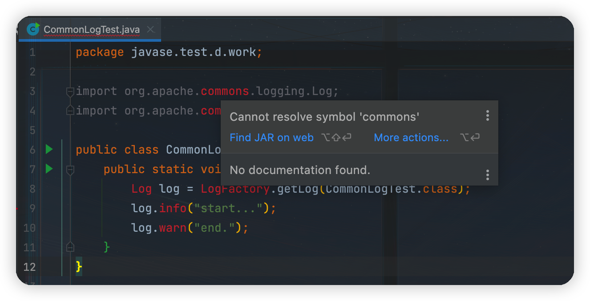
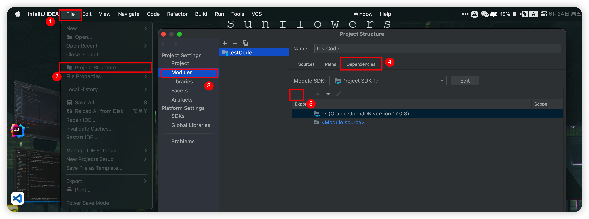
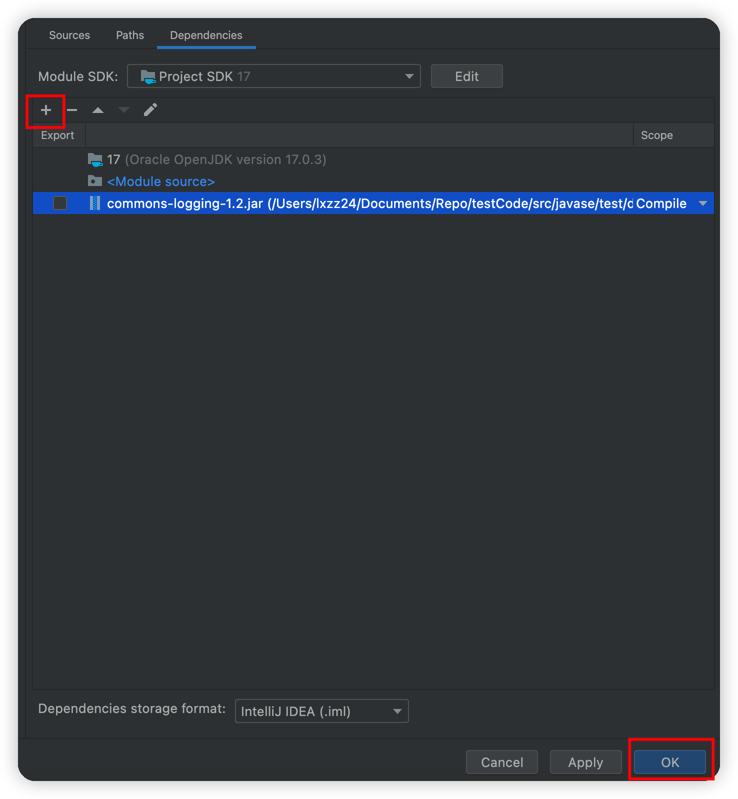
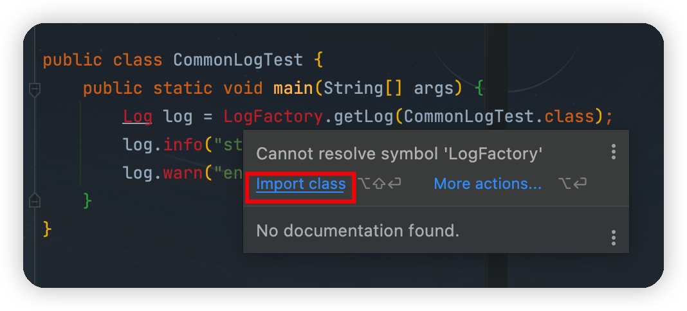
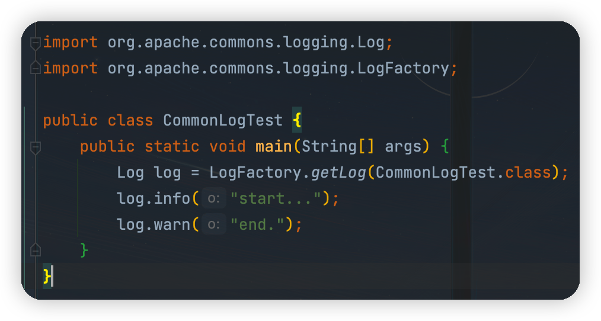

# **使用 Commons Logging**

和 Java 标准库提供的日志不同， Commons Logging 是一个第三方日志库，它是由 Apache 创建的日志模块。

Commons Logging 的特色是，它可以挂接不同的日志系统，并通过配置文件指定挂接的日志系统。默认情况下， Commons Loggin 自动搜索并使用 Log4j （Log4j 是另一个流行的日志系统），如果没有找到 Log4j ，再使用 JDK Logging。

使用 Commons Logging 只需要和两个类打交道，并且只有两步：

- 第一步，通过 `LogFactory` 获取 `Log` 类的实例； 
- 第二步，使用 `Log` 实例的方法打日志。

示例代码如下：

```java
import org.apache.commons.logging.Log;
import org.apache.commons.logging.LogFactory;

public class Main {
    public static void main(String[] args) {
        Log log = LogFactory.getLog(Main.class);
        log.info("start...");
        log.warn("end.");
    }
}
```


运行上述代码，肯定会得到编译错误，类似 `error: package org.apache.commons.logging does not exist`（找不到 `org.apache.commons.logging` 这个包）。因为 Commons Logging 是一个第三方提供的库，所以，必须先把它 [下载](https://commons.apache.org/proper/commons-logging/download_logging.cgi) 下来。下载后，解压，找到 `commons-logging-1.2.jar` 这个文件，再把 Java 源码 `Main.java` 放到一个目录下，例如 `work` 目录：

    work
    │
    ├─ commons-logging-1.2.jar
    │
    └─ Main.java

然后用 `javac` 编译 `Main.java` ，编译的时候要指定 `classpath` ，不然编译器找不到我们引用的 `org.apache.commons.logging` 包。编译命令如下：

```
javac -cp commons-logging-1.2.jar Main.java
```

如果编译成功，那么当前目录下就会多出一个 `Main.class` 文件：

    work
    │
    ├─ commons-logging-1.2.jar
    │
    ├─ Main.java
    │
    └─ Main.class

现在可以执行这个 `Main.class` ，使用 `java` 命令，也必须指定 `classpath` ，命令如下：

```
java -cp .;commons-logging-1.2.jar Main
```

注意到传入的 `classpath` 有两部分：一个是 `.` ，一个是 `commons-logging-1.2.jar` ，用 `;` 分割。 `.` 表示当前目录，如果没有这个 `.` ， JVM 不会在当前目录搜索 `Main.class` ，就会报错。

如果在 Linux 或 macOS 下运行，注意 `classpath` 的分隔符不是 `;` ，而是 `:` ：

```
java -cp .:commons-logging-1.2.jar Main
```

运行结果如下：

```
Mar 02, 2019 7:15:31 PM Main main
INFO: start...
Mar 02, 2019 7:15:31 PM Main main
WARNING: end.
```

[👉 使用 IDEA 可看这里](#IDEA导入jar包)

Commons Logging 定义了 6 个日志级别：

- FATAL
- ERROR
- WARNING
- INFO
- DEBUG
- TRACE

默认级别是 `INFO` 。

使用 Commons Logging 时，如果在静态方法中引用 `Log` ，通常直接定义一个静态类型变量：

```java
// 在静态方法中引用 Log:
public class Main {
    static final Log log = LogFactory.getLog(Main.class);

    static void foo() {
        log.info("foo");
    }
}
```

在实例方法中引用 `Log` ，通常定义一个实例变量：

```java
// 在实例方法中引用 Log:
public class Person {
    protected final Log log = LogFactory.getLog(getClass());

    void foo() {
        log.info("foo");
    }
}
```


注意到实例变量 `log` 的获取方式是 `LogFactory.getLog(getClass())` ，虽然也可以用 `LogFactory.getLog(Person.class)` ，但是前一种方式有个非常大的好处，就是子类可以直接使用该 `log` 实例。例如：


```java
// 在子类中使用父类实例化的 log:
public class Student extends Person {
    void bar() {
        log.info("bar");
    }
}
```


由于 Java 类的动态特性，子类获取的 `log` 字段实际上相当于 `LogFactory.getLog(Student.class)` ，但却是从父类继承而来，并且无需改动代码。

此外， Commons Logging 的日志方法，例如 `info()` ，除了标准的 `info(String)` 外，还提供了一个非常有用的重载方法： `info(String, Throwable)` ，这使得记录异常更加简单：


```java
try {
    ...
} catch (Exception e) {
    log.error("got exception!", e);
}
```


## IDEA 导入 jar 包

1、Java 项目在没有导入该 jar 包之前，如图：




2、点击 File ->  Project Structure ，点击 Project Structure 界面左侧的 Modules 




3、在 “Dependencies” 标签界面下，点击 “+” 号，选择第一个选项 “JARs or directories...”，选择相应的 jar 包，点 “OK” ， jar 包添加成功





4、点 “OK” 回到项目界面， IntelliJ IDEA 自动提示需要添加 `import` 语句，快速添加 `import` 语句之后，项目成功编译






## 练习

使用 `log.error(String, Throwable)` 打印异常。

```java
import org.apache.commons.logging.Log;
import org.apache.commons.logging.LogFactory;
import java.io.UnsupportedEncodingException;

public class CommonLogTest {
    static final Log log = LogFactory.getLog(CommonLogTest.class);

    public static void main(String[] args) {
        log.info("Start process...");
        try {
            "".getBytes("invalidCharsetName");
        } catch (UnsupportedEncodingException e) {
            // TODO: 使用log.error(String, Throwable)打印异常
            log.error("invalid charset name", e);
        }
        log.info("Process end.");
    }
}
```


```
6月 24, 2022 3:53:48 下午 javase.test.d.work.CommonLogTest main
信息: Start process...
6月 24, 2022 3:53:48 下午 javase.test.d.work.CommonLogTest main
严重: invalid charset name
java.io.UnsupportedEncodingException: invalidCharsetName
	at java.base/java.lang.String.lookupCharset(String.java:819)
	at java.base/java.lang.String.getBytes(String.java:1763)
	at javase.test.d.work.CommonLogTest.main(CommonLogTest.java:20)

6月 24, 2022 3:53:48 下午 javase.test.d.work.CommonLogTest main
信息: Process end.
```

## 小结

- Commons Logging 是使用最广泛的日志模块；
- Commons Logging 的 API 非常简单；
- Commons Logging 可以自动检测并使用其他日志模块。


