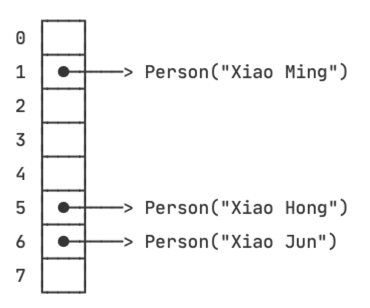
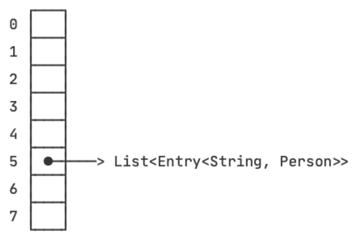

# **编写 equals 和 hashCode**


我们知道 `Map` 是一种 键-值 （key-value）映射表，可以通过 `key` 快速查找对应的 `value` 。

以 `HashMap` 为例，观察下面的代码：

```java
Map<String, Person> map = new HashMap<>();
map.put("a", new Person("Xiao Ming"));
map.put("b", new Person("Xiao Hong"));
map.put("c", new Person("Xiao Jun"));

map.get("a"); // Person("Xiao Ming")
map.get("x"); // null
```

`HashMap` 之所以能根据 `key` 直接拿到 `value` ，原因是它内部通过空间换时间的方法，用一个大数组存储所有 `value` ，并根据 `key` 直接计算出 `value` 应该存储在哪个索引：



如果 `key` 的值为 `"a"` ，计算得到的索引总是 `1` ，因此返回 `value` 为 `Person("Xiao Ming")` ，如果 `key` 的值为 `"b"` ，计算得到的索引总是 `5` ，因此返回 `value` 为 `Person("Xiao Hong")` ，这样，就不必遍历整个数组，即可直接读取 `key` 对应的 `value` 。

当我们使用 `key` 存取 `value` 的时候，就会引出一个问题：

我们放入 `Map` 的 `key` 是字符串 `"a"` ，但是，当我们获取 `Map` 的 `value` 时，传入的变量不一定就是放入的那个 `key` 对象。

换句话讲，两个 `key` 应该是内容相同，但不一定是同一个对象。测试代码如下：

```java
import java.util.HashMap;
import java.util.Map;

public class Main {
    public static void main(String[] args) {
        String key1 = "a";
        Map<String, Integer> map = new HashMap<>();
        map.put(key1, 123);

        String key2 = new String("a");
        map.get(key2); // 123

        System.out.println(key1 == key2); // false
        System.out.println(key1.equals(key2)); // true
    }
}
```

因为在 `Map` 的内部，对 `key` 做比较是通过 `equals()` 实现的，这一点和 `List` 查找元素需要正确覆写 `equals()` 是一样的，即正确使用 `Map` 必须保证：作为 `key` 的对象必须正确覆写 `equals()` 方法。

我们经常使用 `String` 作为 `key` ，因为 `String` 已经正确覆写了 `equals()` 方法。但如果我们放入的 `key` 是一个自己写的类，就必须保证正确覆写了 `equals()` 方法。

我们再思考一下 `HashMap` 为什么能通过 `key` 直接计算出 `value` 存储的索引。相同的 `key` 对象（使用 `equals()` 判断时返回 `true` ）必须要计算出相同的索引，否则，相同的 `key` 每次取出的 `value` 就不一定对。

通过 `key` 计算索引的方式就是调用 `key` 对象的 `hashCode()` 方法，它返回一个 `int` 整数。 `HashMap` 正是通过这个方法直接定位 `key` 对应的 `value` 的索引，继而直接返回 `value` 。

因此，正确使用 `Map` 必须保证：

1. 作为 `key` 的对象必须正确覆写 `equals()` 方法，相等的两个 `key` 实例调用 `equals()` 必须返回 `true` ；
2. 作为 `key` 的对象还必须正确覆写 `hashCode()` 方法，且 `hashCode()` 方法要严格遵循以下规范：
   - 如果两个对象相等，则两个对象的 `hashCode()` 必须相等；
   - 如果两个对象不相等，则两个对象的 `hashCode()` 尽量不要相等。

即对应两个实例 `a` 和 `b` ：
   - 如果 `a` 和 `b` 相等，那么 `a.equals(b)` 一定为 `true` ，则 `a.hashCode()` 必须等于 `b.hashCode()` ；
   - 如果 `a` 和 `b` 不相等，那么 `a.equals(b)` 一定为 `false` ，则 `a.hashCode()` 和 `b.hashCode()` 尽量不要相等。

上述第一条规范是正确性，必须保证实现，否则 `HashMap` 不能正常工作。

而第二条如果尽量满足，则可以保证查询效率，因为不同的对象，如果返回相同的 `hashCode()` ，会造成 `Map` 内部存储冲突，使存取的效率下降。

正确编写 `equals()` 的方法我们已经在 [编写equals方法](./编写equals方法.md) 一节中讲过了，以 `Person` 类为例：

```java
public class Person {
    String firstName;
    String lastName;
    int age;
}
```

把需要比较的字段找出来：

- firstName
- lastName
- age


然后，引用类型使用 `Objects.equals()` 比较，基本类型使用 `==` 比较。

在正确实现 `equals()` 的基础上，我们还需要正确实现 `hashCode()` ，即上述 3 个字段分别相同的实例， `hashCode()` 返回的 `int` 必须相同：


```java
public class Person {
    String firstName;
    String lastName;
    int age;

    @Override
    int hashCode() {
        int h = 0;
        h = 31 * h + firstName.hashCode();
        h = 31 * h + lastName.hashCode();
        h = 31 * h + age;
        return h;
    }
}
```

注意到 `String` 类已经正确实现了 `hashCode()` 方法，我们在计算 `Person` 的 `hashCode()` 时，反复使用 `31*h` ，这样做的目的是为了尽量把不同的 `Person` 实例的 `hashCode()` 均匀分布到整个 `int` 范围。

和实现 `equals()` 方法遇到的问题类似，如果 `firstName` 或 `lastName` 为 `null` ，上述代码工作起来就会抛 `NullPointerException` 。为了解决这个问题，我们在计算 `hashCode()` 的时候，经常借助 `Objects.hash()` 来计算：


```java
int hashCode() {
    return Objects.hash(firstName, lastName, age);
}
```

所以，编写 `equals()` 和 `hashCode()` 遵循的原则是：

`equals()` 用到的用于比较的每一个字段，都必须在 `hashCode()` 中用于计算； `equals()` 中没有使用到的字段，绝不可放在 `hashCode()` 中计算。

另外注意，对于放入 `HashMap` 的 `value` 对象，没有任何要求。

## 延伸阅读

既然 `HashMap` 内部使用了数组，通过计算 `key` 的 `hashCode()` 直接定位 `value` 所在的索引，那么第一个问题来了： `hashCode()` 返回的 `int` 范围高达 ±21 亿，先不考虑负数， `HashMap` 内部使用的数组得有多大？

实际上 `HashMap` 初始化时默认的数组大小只有 16 ，任何 `key` ，无论它的 `hashCode()` 有多大，都可以简单地通过：

```java
int index = key.hashCode() & 0xf; // 0xf = 15
```

把索引确定在 0～15，即永远不会超出数组范围，上述算法只是一种最简单的实现。

第二个问题：如果添加超过 16 个 `key-value` 到 `HashMap` ，数组不够用了怎么办？

添加超过一定数量的 `key-value` 时， `HashMap` 会在内部自动扩容，每次扩容一倍，即长度为 16 的数组扩展为长度 32，相应地，需要重新确定 `hashCode()` 计算的索引位置。例如，对长度为 32 的数组计算 `hashCode()` 对应的索引，计算方式要改为：

```java
int index = key.hashCode() & 0x1f; // 0x1f = 31
```

由于扩容会导致重新分布已有的 `key-value` ，所以，频繁扩容对 `HashMap` 的性能影响很大。如果我们确定要使用一个容量为 10000 个 `key-value` 的 `HashMap` ，更好的方式是创建 `HashMap` 时就指定容量：

```java
Map<String, Integer> map = new HashMap<>(10000);
```

虽然指定容量是 `10000` ，但 `HashMap` 内部的数组长度总是 $2^n$ ，因此，实际数组长度被初始化为比 `10000` 大的 `16384` （ $2^{14}$）。

最后一个问题：如果不同的两个 `key` ，例如 `"a"` 和 `"b"`，它们的 `hashCode()` 恰好是相同的（这种情况是完全可能的，因为不相等的两个实例，只要求 `hashCode()` 尽量不相等），那么，当我们放入：


```java
map.put("a", new Person("Xiao Ming"));
map.put("b", new Person("Xiao Hong"));
```

时，由于计算出的数组索引相同，后面放入的 `"Xiao Hong"` 会不会把 `"Xiao Ming"` 覆盖了？

当然不会！使用 `Map` 的时候，只要 `key` 不相同，它们映射的 `value` 就互不干扰。但是，在 `HashMap` 内部，确实可能存在不同的 `key` ，映射到相同的 `hashCode()` ，即相同的数组索引上，肿么办？

我们就假设 `"a"` 和 `"b"` 这两个 `key` 最终计算出的索引都是 `5` ，那么，在 `HashMap` 的数组中，实际存储的不是一个 `Person` 实例，而是一个 `List` ，它包含两个 `Entry` ，一个是 `"a"` 的映射，一个是 `"b"` 的映射：





在查找的时候，例如：

```java
Person p = map.get("a");
```

`HashMap` 内部通过 `"a"` 找到的实际上是 `List<Entry<String, Person>>` ，它还需要遍历这个 `List` ，并找到一个 `Entry` ，它的 `key` 字段是 `"a"` ，才能返回对应的 `Person` 实例。

我们把不同的 `key` 具有相同的 `hashCode()` 的情况称之为哈希冲突。在冲突的时候，一种最简单的解决办法是用 `List` 存储 `hashCode()` 相同的 `key-value` 。显然，如果冲突的概率越大，这个 `List` 就越长， `Map` 的 `get()` 方法效率就越低，这就是为什么要尽量满足条件二：


> [!NOTE]
> 如果两个对象不相等，则两个对象的 `hashCode()` 尽量不要相等。

`hashCode()` 方法编写得越好， `HashMap` 工作的效率就越高。

## 小结

1. 要正确使用 `HashMap` ，作为 `key` 的类必须正确覆写 `equals()` 和 `hashCode()` 方法；

2. 一个类如果覆写了 `equals()` ，就必须覆写 `hashCode()` ，并且覆写规则是：

   - 如果 `equals()` 返回 `true` ，则 `hashCode()` 返回值必须相等；
   - 如果 `equals()` 返回 `false` ，则 `hashCode()` 返回值尽量不要相等。

3. 实现 `hashCode()` 方法可以通过 `Objects.hashCode()` 辅助方法实现。

