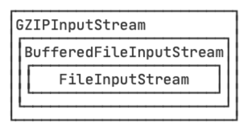
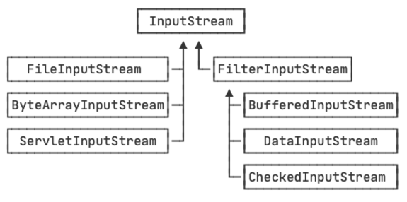
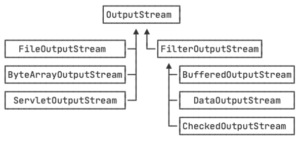

# **Filter 模式**


Java 的 IO 标准库提供的 InputStream 根据来源可以包括：

- FileInputStream：从文件读取数据，是最终数据源；
- ServletInputStream：从 HTTP 请求读取数据，是最终数据源；
- Socket.getInputStream()：从 TCP 连接读取数据，是最终数据源；
- ...

如果我们要给 FileInputStream 添加缓冲功能，则可以从 FileInputStream 派生一个类：

```java
BufferedFileInputStream extends FileInputStream
```

如果要给 FileInputStream 添加计算签名的功能，类似的，也可以从 FileInputStream 派生一个类：

```java
DigestFileInputStream extends FileInputStream
```

如果要给 FileInputStream 添加加密 / 解密功能，还是可以从 FileInputStream 派生一个类：

```java
CipherFileInputStream extends FileInputStream
```


如果要给 FileInputStream 添加缓冲和签名的功能，那么我们还需要派生 BufferedDigestFileInputStream。如果要给 FileInputStream 添加缓冲和加解密的功能，则需要派生 BufferedCipherFileInputStream。

我们发现，给 FileInputStream 添加 3 种功能，至少需要 3 个子类。这 3 种功能的组合，又需要更多的子类：


这还只是针对 FileInputStream 设计，如果针对另一种 InputStream 设计，很快会出现子类爆炸的情况。

因此，直接使用继承，为各种 InputStream 附加更多的功能，根本无法控制代码的复杂度，很快就会失控。

为了解决依赖继承会导致子类数量失控的问题，JDK 首先将 InputStream 分为两大类：

一类是直接提供数据的基础 InputStream ，例如：

- FileInputStream
- ByteArrayInputStream
- ServletInputStream
- ...

一类是提供额外附加功能的 InputStream，例如：

- BufferedInputStream
- DigestInputStream
- CipherInputStream
- ...


当我们需要给一个 “基础”InputStream 附加各种功能时，我们先确定这个能提供数据源的 InputStream，因为我们需要的数据总得来自某个地方，例如，FileInputStream，数据来源自文件：

```java
InputStream file = new FileInputStream("test.gz");
```

紧接着，我们希望 FileInputStream 能提供缓冲的功能来提高读取的效率，因此我们用 BufferedInputStream 包装这个 InputStream，得到的包装类型是 BufferedInputStream，但它仍然被视为一个 InputStream：

```java
InputStream buffered = new BufferedInputStream(file);
```

最后，假设该文件已经用 gzip 压缩了，我们希望直接读取解压缩的内容，就可以再包装一个 GZIPInputStream：

```java
InputStream gzip = new GZIPInputStream(buffered);
```

无论我们包装多少次，得到的对象始终是 InputStream，我们直接用 InputStream 来引用它，就可以正常读取：



上述这种通过一个 “基础” 组件再叠加各种 “附加” 功能组件的模式，称之为 Filter 模式（或者装饰器模式：Decorator）。它可以让我们通过少量的类来实现各种功能的组合：



类似的，OutputStream 也是以这种模式来提供各种功能：




## 编写 FilterInputStream

我们也可以自己编写 FilterInputStream，以便可以把自己的 FilterInputStream“叠加” 到任何一个 InputStream 中。

下面的例子演示了如何编写一个 CountInputStream，它的作用是对输入的字节进行计数：


```java
import java.io.*;

public class Main {
    public static void main(String[] args) throws IOException {
        byte[] data = "hello, world!".getBytes("UTF-8");
        try (CountInputStream input = new CountInputStream(new ByteArrayInputStream(data))) {
            int n;
            while ((n = input.read()) != -1) {
                System.out.println((char)n);
            }
            System.out.println("Total read " + input.getBytesRead() + " bytes");
        }
    }
}

class CountInputStream extends FilterInputStream {
    private int count = 0;

    CountInputStream(InputStream in) {
        super(in);
    }

    public int getBytesRead() {
        return this.count;
    }

    public int read() throws IOException {
        int n = in.read();
        if (n != -1) {
            this.count ++;
        }
        return n;
    }

    public int read(byte[] b, int off, int len) throws IOException {
        int n = in.read(b, off, len);
        if (n != -1) {
            this.count += n;
        }
        return n;
    }
}
```


注意到在叠加多个 FilterInputStream，我们只需要持有最外层的 InputStream，并且，当最外层的 InputStream 关闭时（在 try(resource) 块的结束处自动关闭），内层的 InputStream 的 close() 方法也会被自动调用，并最终调用到最核心的 “基础”InputStream，因此不存在资源泄露。


## 小结

Java 的 IO 标准库使用 Filter 模式为 InputStream 和 OutputStream 增加功能：

- 可以把一个 InputStream 和任意个 FilterInputStream 组合；
- 可以把一个 OutputStream 和任意个 FilterOutputStream 组合。

Filter 模式可以在运行期动态增加功能（又称 Decorator 模式）。

