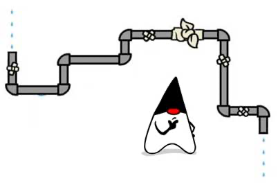
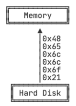

##### IO

IO 是指 Input/Output，即输入和输出。以内存为中心：

- Input 指从外部读入数据到内存，例如，把文件从磁盘读取到内存，从网络读取数据到内存等等。
- Output 指把数据从内存输出到外部，例如，把数据从内存写入到文件，把数据从内存输出到网络等等。

为什么要把数据读到内存才能处理这些数据？因为代码是在内存中运行的，数据也必须读到内存，最终的表示方式无非是 byte 数组，字符串等，都必须存放在内存里。

从 Java 代码来看，输入实际上就是从外部，例如，硬盘上的某个文件，把内容读到内存，并且以 Java 提供的某种数据类型表示，例如，byte[]，String，这样，后续代码才能处理这些数据。

因为内存有 “易失性” 的特点，所以必须把处理后的数据以某种方式输出，例如，写入到文件。Output 实际上就是把 Java 表示的数据格式，例如，byte[]，String 等输出到某个地方。

IO 流是一种顺序读写数据的模式，它的特点是单向流动。数据类似自来水一样在水管中流动，所以我们把它称为 IO 流。




##### InputStream / OutputStream

IO 流以 byte（字节）为最小单位，因此也称为字节流。例如，我们要从磁盘读入一个文件，包含 6 个字节，就相当于读入了 6 个字节的数据：



这 6 个字节是按顺序读入的，所以是输入字节流。

反过来，我们把 6 个字节从内存写入磁盘文件，就是输出字节流：


在 Java 中，InputStream 代表输入字节流，OuputStream 代表输出字节流，这是最基本的两种 IO 流。


##### Reader / Writer

如果我们需要读写的是字符，并且字符不全是单字节表示的 ASCII 字符，那么，按照 char 来读写显然更方便，这种流称为 ***字符流*** 。

Java 提供了 Reader 和 Writer 表示字符流，字符流传输的最小数据单位是 char。

例如，我们把 char[] 数组 Hi 你好这 4 个字符用 Writer 字符流写入文件，并且使用 UTF-8 编码，得到的最终文件内容是 8 个字节，英文字符 H 和 i 各占一个字节，中文字符你好各占 3 个字节：


```
0x48
0x69
0xe4bda0
0xe5a5bd
```

反过来，我们用 Reader 读取以 UTF-8 编码的这 8 个字节，会从 Reader 中得到 Hi 你好这 4 个字符。

因此，Reader 和 Writer 本质上是一个能自动编解码的 InputStream 和 OutputStream。

使用 Reader，数据源虽然是字节，但我们读入的数据都是 char 类型的字符，原因是 Reader 内部把读入的 byte 做了解码，转换成了 char。使用 InputStream，我们读入的数据和原始二进制数据一模一样，是 byte[] 数组，但是我们可以自己把二进制 byte[] 数组按照某种编码转换为字符串。究竟使用 Reader 还是 InputStream，要取决于具体的使用场景。如果数据源不是文本，就只能使用 InputStream，如果数据源是文本，使用 Reader 更方便一些。Writer 和 OutputStream 是类似的。


##### 同步和异步

同步 IO 是指，读写 IO 时代码必须等待数据返回后才继续执行后续代码，它的优点是代码编写简单，缺点是 CPU 执行效率低。

而异步 IO 是指，读写 IO 时仅发出请求，然后立刻执行后续代码，它的优点是 CPU 执行效率高，缺点是代码编写复杂。

Java 标准库的包 java.io 提供了同步 IO，而 java.nio 则是异步 IO。上面我们讨论的 InputStream、OutputStream、Reader 和 Writer 都是同步 IO 的抽象类，对应的具体实现类，以文件为例，有 FileInputStream、FileOutputStream、FileReader 和 FileWriter。

本节我们只讨论 Java 的同步 IO，即输入 / 输出流的 IO 模型。


##### 小结

IO 流是一种流式的数据输入 / 输出模型：

- 二进制数据以 byte 为最小单位在 InputStream/OutputStream 中单向流动；
- 字符数据以 char 为最小单位在 Reader/Writer 中单向流动。

Java 标准库的 java.io 包提供了同步 IO 功能：

- 字节流接口：InputStream / OutputStream；
- 字符流接口：Reader / Writer。

