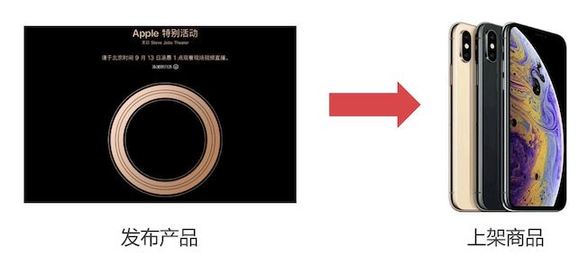
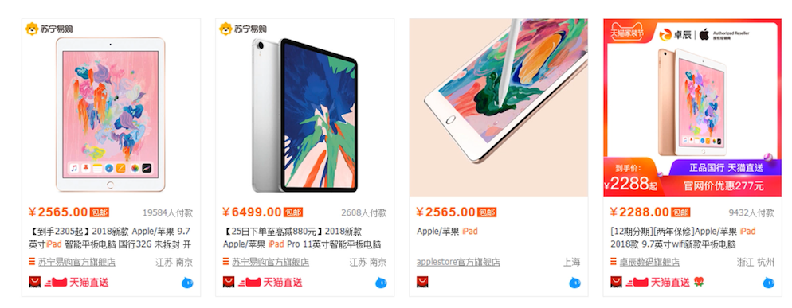
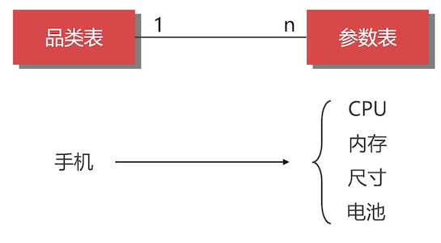
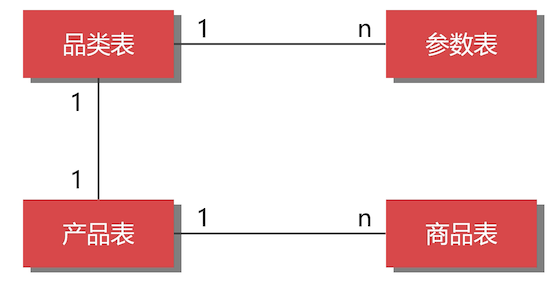

# 什么是 SPU/SKU

设计数据库时，需要考虑好每一个业务的细节，只有这样设计出来的数据库，才能业务的需求。

那么首先就要搞明白一些核心概念。

## 本门课程设计什么样的新零售系统？

目前有很多家在做新零售，做的比较好的是苏宁易购，我们就以苏宁易购来作为参考。如果要设计苏宁易购全部的数据库可能要用到上千张表，而且很多业务不适合其他的零售企业，这里提炼了一些通用的业务模块。

## 零售系统数据库设计的困难

新零售或电商系统的数据库是最难设计的。比如：团队正在开发一个酒店管理系统，是围绕客房展开的，但是每间客房的具体情况也许不同，有的是家庭房、大床房、有的是朝南、朝北，虽然说 **属性值不同**，但是每间客房的 **属性数量是相同的**。这种在设计数据表的时候就非常的简单。

再比如说，在线教育系统，里面的商品就是课程，每门课程的属性也是相同的，比如时长、名称、介绍、大纲等等，所以非常好提炼数据表。

但是对于新零售或则电商来说，就很难提炼。因为售卖的商品属于不同的种类，商品之间的属性还不同。比如食品有保质期，衣服没有保质期。再比如每种商品都有不同的销售方案，比如 32g 的「小米手机 9」 和 64g 的 「小米手机 9」 是属于两个 **商品**，在设计数据表的时候，需要考虑 **产品** 和 **商品** 之间的对应关系，当用户搜索「小米手机 9 」的时候才能看到各种不同的销售方案。

从以上看来，电商的数据库设计难度是真不小。

## 产品和商品

新零售最难设计的就是 **产品和商品之间的关系**

比如在发布会上发布了 iPhone X，讲解的基本上是他们的共性信息，他们是 **产品**，但是 128G 黑色 iPhone X 才是一个具体的 **商品**。

也就是说我们应该设计两张表：**产品表** 和 **商品表**

## SPU

**SPU 全称 Standard Product Unit，是标准产品单位。SPU 描述一个产品的各种特性。**

- ThinkPad：产品

  有各种的销售方案，4K 屏、黑色、32G 内存等；商品

- 小米 9：产品

  也有各种的销售方案，黑色、128g、红色；商品

- 技嘉 1060 显卡产品

  有 2G、4G、6G 版本；商品

抛开下面的各种销售方案，他们描述的是共性的东西，所以他们是属于 **产品** 表

## 什么时候胡用到 SPU？

有可能会决定商品表会重要一些，下订单的时候关联的是商品表。

那么产品表有什么作用呢？比如去搜索  Ipad ，出现了如下的商品列表

这些商品列表一般电商平台会这样做：

1. 根据搜索的关键字去 **产品表** 检索产品表的主键 ID
2. 去商品表中搜索 Ipad 产品对应的 **商品中哪个商品方案** 卖得最好
3. 于是这家店铺销量最高的 ipad **商品** 方案就被检索出来了

**为什么不去直接搜索商品表中的记录？**因为：

- 一个产品有多个商品，产品表的数量远远少于商品表；
- 先检索产品表，再检索商品表，这样速度相对来说要快很多
- 再结合索引，就更快了

## SKU

SKU 全称 Stock Keeping Unit ，库存进出计量的单位，SKU 是物理上不可分割的最小存货单元。

如上图，选择的网络类型、机身颜色、套餐类型、存储容量这些组成了一个商品。

那么 **库存** 字段是否应该存在 SKU 表中？答案是：看业务，比如这个业务场景中：一个大型连锁店的每个店铺库存都不是一样的，所以一个在 sku 与 库存的交叉表中存在。

## SKU 与权重

- B2B 电商平台，就是类似淘宝这样的电商平台。企业开店，卖东西给客户。
- B2C：类似苏宁易购这样的平台，自己搭建平台，将商品卖给客户。

京东是既有 B2B 又有 B2C ，是混合模式。下图是淘宝电商这样的 B2B 模式：淘宝防止店铺卖出商品之后，偷偷修改 SKU 商品信息，于是 **将 SKU 的商品信息与商品的搜索权重绑定** 在一起，只要修改 SKU 商品信息就会影响该商品的搜索权重，甚至严重的话会下架商品。

比如你购买的时候是「进口」奶粉，当你发现被骗的时候，去维权，然后商家连夜修改商品信息去掉了「进口」。这就会造成纠纷。与权重绑定，在很大程度上，能遏制这种操作。

并不是所有的信息都会触发权重的变更，比如给这件衣服添加尺码和颜色，因为尺码和颜色是一个新的 sku。

**对于新零售平台来说**，主要是 B2C 的，所以修改 SKU 对权重的影响不大。但是 B2B 平台，修改 SKU 对商品权重影响很大。

## SKU 与参数如何对应？

衣服和手机不是一个品类，他们的参数也不同，在数据表的设计上，就显得很困难。

## 这样设计 SKU 表可以吗？

将所有的参数字段都统计出来，像淘宝这样的平台，那么多的品类，参数字段可能需要几万个。这样设计肯定是不行的

## 如何设计品类参数？

如图，在参数表中包含了一个品类的所有参数，增加或删除参数，值需要修改参数表的一行数据就可以了。

## 参数与 SKU 的关系

一个产品只属于一个品类。一个产品有多个商品。这 4 张表可以关联出一个 SKU 商品的所有参数