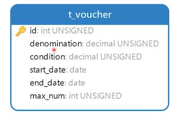
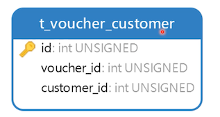

# 设计购物卷表

购物的时候可以使用购物卷表，先设计。

## 购物卷的使用规则


从上可以看到如下信息：

- 购物卷有使用期限，而且一个订单只可以用一张购物卷

- 购物卷与客户记录关联

  需要客户自己领取，而且客户可以领取多张不同的购物卷

所以需要两张表。

## 创建购物卷表



- denomination：购物卷金额
- condition：超过多少金额才能使用购物卷
- start_date 和 end_date ：使用期限，注意：只有日期，没有时间
- max_num：购物卷最多发放多少张。没有值则不限制。

```sql
create table t_voucher
(
    id          int unsigned primary key auto_increment comment '主键',
    deno        decimal(10, 2) unsigned not null comment '面值',
    `condition` decimal(10, 2) unsigned not null comment '订单满多少钱可以使用',
    start_date  date comment '起始日期',
    end_date    date comment '截止日期',
    max_num     int comment '购物卷发放最大数量'
) comment '购物卷表';

```

插入一些测试数据

```sql
INSERT INTO neti.t_voucher (id, deno, `condition`, start_date, end_date, max_num) VALUES (1, 50.00, 1000.00, '2020-06-06', '2020-06-25', 1000);
INSERT INTO neti.t_voucher (id, deno, `condition`, start_date, end_date, max_num) VALUES (2, 20.00, 500.00, '2020-06-06', '2020-06-25', null);
```


## 客户关联购物卷表



该表主键不是符合主键，原因是：一个人可以领取多张同样的购物卷（这个看自己的业务），要购买一堆东西，结果用户发现可以拆成 2 单，分别用一张购物卷，更划算。

```sql
create table t_voucher_customer
(
    id         int unsigned primary key auto_increment comment '主键',
    voucher_id int unsigned not null comment '购物卷ID',
    customer   int unsigned not null comment '客户ID'
) comment '客户关联购物卷表';
```

插入一些测试数据

```sql
INSERT INTO neti.t_voucher_customer (id, voucher_id, customer) VALUES (1, 1, 1);
INSERT INTO neti.t_voucher_customer (id, voucher_id, customer) VALUES (2, 1, 1);
INSERT INTO neti.t_voucher_customer (id, voucher_id, customer) VALUES (3, 1, 1);
INSERT INTO neti.t_voucher_customer (id, voucher_id, customer) VALUES (4, 2, 1);
INSERT INTO neti.t_voucher_customer (id, voucher_id, customer) VALUES (5, 2, 1);
```

对于购物卷，也有很多不同的业务场景，新零售做的是 B2C 的业务，没有第三方商铺，在线上和线下都可以使用。而 B2B 则是，对应商品的购物卷只能在对应的商品内使用。

对于京东这种混合 B2C 和 B2B 的业务场景，更复杂