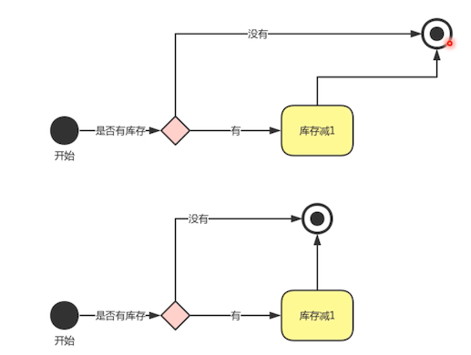
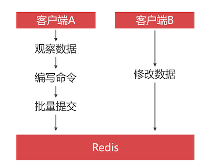

# 如何实现商品秒杀

商品秒杀过程中出现的超售现象，就是卖出了超过预期数量的商品。

## 为什么会出现超售？

数据库为什么会出现超售现象？



上面这种做法，在并发情况下，就是会超售，先获取库存，再减库存。不多说了。

## 如何预防数据库超售现象？

- 数据库事物隔离级别 Serializable

  串行执行，如同在程序中单线程执行一样的道理，可以做到不超售，但是性能太低。

- 在数据表上设置乐观锁字段

  `wher lock=N` ，先获取数据的版本号，更新时只满足这个版本号时才更新成功。

  所以就算有很多并发修改，不会导致超售。

  但是可能会有大量流量到达数据库，把数据库搞死的问题。

## 什么表需要设置乐观锁字段？

出现同时修改同一记录的业务，相应的数据表要设置乐观锁。例如：库存表

## 利用 Redis 防止超售

高并发情况下，数据库刚不住那么大的 IO，所以可以利用 Redis 这种内存数据库来实现，经过优化后，每秒可以支持 10 万次的读写请求，而且技术特别成熟

## redis 介绍

- redis 是开源免费的 NoSQL 数据库产品，它使用内存缓存数据。
- 没有经过优化，Redis 读写性能 2 万/秒，MySQL 读性能 5 千/秒，写 3 千/秒；优化之后，redis 读写可达 10 万次，经过集群之后，性能会更大的提升
- redis 是单线程的 NoSQL 数据库，但是采用的是非阻塞执行

## redis 中的超售现象

因为 redis 的单线程是非阻塞执行的，所以并发修改数据容易产生超售的结果


上图也不多说，在客户端获取数据，判断，再执行，这个获取判断和执行不是原子性的，肯定会有问题。

## redis 安装

关于这个百度一下很多的。这里同时贴上笔者的 [另一篇关于 REDIS 的笔记](https://zq99299.github.io/note-book/cache-pdp/redis/007.html)

对于图形化界面操作 redis，可以使用 RDM 软件，它可以直接开启命令行模式，对于我们下面演示 redis 事务比较方便

这里只是测试，不用做很复杂的设置，直接修改安装解压目录的 redis.conf 文件

```bash
bind 0.0.0.0		# 允许任何 IP 访问 redis
daemonize yes 	# 后台进程运行 redis
protected-mode no	# 关闭保护功能
requirepass 123456	# 设置访问密码
```

启动 redis

```sql
[root@study redis-5.0.5]# src/redis-server ./redis.conf 
```

客户端连接

```bash
[root@study redis-5.0.5]# src/redis-cli -a 123456
```

远程连接，开放端口

```bash
[root@study redis-5.0.5]# firewall-cmd --zone=public --add-port=6379/tcp --permanent 
[root@study redis-5.0.5]# firewall-cmd --reload 
firewall-cmd --zone=public --list-ports
```


## redis 避免超售现象

redis 引入了事务机制（批处理），一次性把多条命令传递给 redis 执行，避免了其他客户端中间插队，出现超售现象


### redis 事务机制



在开启事物之前必须要用 watch 命令监视要操作的记录，然后编写命令批量提交。如果在编写命令时，客户端 B 修改了监视的这些数据。那么客户端提交之后，就会执行失败。

```bash
redis > WATCH kill_num kill_user
```

- kill_num：商品库存
- kill_user：成功秒杀商品的用户 ID

利用 MULTI 命令开启一个事务

```bash
redis > MULTI
```

开启事物后，所有操作都不会立即执行，只有执行 exec 命令的时候才会批处理执行。（执行的命令会缓存在客户端，直到执行 exec 的时候一次性提交命令执行，redis 会将提交的顺序执行完成，这期间不会执行其他客户端的命令）

```sql
redis > DECR kill_num
redis > RPUSH kull_user 9502
redis > EXEC 
```

DECR 减库存，RPUSH 往一个 list 结构中插入一个用户 ID，这两个命令不会立即执行，直到 EXEC 时会一起打包给 redis 执行，redis 会以原子操作执行完，再去执行其他的命令。

下面来一个完整一点的命令操作

### 事物执行成功例子

```sql
# 设置初始库存为 50
redis > set kill_num 50
# 观察数据
redis > WATCH kill_num kill_user
# 开启事物
redis > MULTI
# 减库存
redis > DECR kill_num
	“QUEUED”						# 执行事物之后，再执行命令会响应  queued，表示缓存在本地了
# 把成功秒杀的用户添加到列表尾部
redis > RPUSH kull_user 9502
	“QUEUED”
# 事物提交
redis > EXEC 
1) "49"
1) "1"
```

### 事物执行失败例子

```sql
# 会话1
# 直接执行 watch 语句，可能没有响应
redis > WATCH kill_num kill_user
# 可以先使用 discard 命令,后再 watch
redis > discard
 "ERR DISCARD without MULTI"
redis > WATCH kill_num kill_user
redis > MULTI
redis > DECR kill_num
	“QUEUED”
redis > RPUSH kull_user 8000
	“QUEUED”
# 这里先不要提交事务，去 会话2 中执行
# 在会话2 中执行完修改语句后，再来提交事务
redis > EXEC
							# 这里没有任何的信息提示，表示提交失败了
							
# 会话 2
redis > set kill_num 20
 "OK"
```

他这里其实就是使用的是 **乐观锁** 机制来实现的事务。

## Java 程序使用 Jedis 

下面例子，创建了 1000 个 task，放到线程池中去执行，最多并行 100 个线程去 redis 执行操作。

最后观察 redis 中商品库存是否达到我们的效果

```java
import redis.clients.jedis.Jedis;
import redis.clients.jedis.Transaction;

import java.util.Random;
import java.util.concurrent.LinkedBlockingDeque;
import java.util.concurrent.ThreadPoolExecutor;
import java.util.concurrent.TimeUnit;
import java.util.stream.IntStream;

public class RedisTest {
    private static String host = "192.168.56.101";
    private static String auth = "123456";
    /*
     * 最小线程数量，
     * 最大线程数量，
     * 线程空闲时间，和时间单位，
     * 当超过最大线程时，使用队列来保存多出来的任务
     */
    static ThreadPoolExecutor pool = new ThreadPoolExecutor(10, 100, 10, TimeUnit.SECONDS, new LinkedBlockingDeque<>());


    public static void main(String[] args) {
        Jedis jedis = new Jedis(host, 6379);
        jedis.auth(auth);
        jedis.select(0);

        // 先初始化
        jedis.set("kill_num", "50");
        jedis.del("kill_user");
        jedis.close();

        for (int i = 0; i < 1000; i++) {
            pool.execute(getRunnable(jedis));
        }
    }

    private static Runnable getRunnable(Jedis jedis) {
        return () -> {
            Jedis j = new Jedis(host, 6379);
            j.auth(auth);
            j.select(0);
            // 获取库存，库存不为 0 ，则由可能抢到
            int num = Integer.parseInt(j.get("kill_num"));
            if (num > 0) {
                try {
                    jedis.watch("kill_num", "kill_user");
                    Transaction t = jedis.multi();
                    t.decr("kill_num");
                    t.rpush("kill_user", "9527");
                    t.exec();
                } catch (Exception e) {
                    // 这里一定要 try 一下，否则线程池任务会异常
                    System.out.println("秒杀失败：" + num);
                }

            } else {
                // 当库存为0 时关闭，线程池
                pool.shutdown();
            }
            jedis.close();
        };
    }
}
```

这里最多并发 100 ，一共 1000 次，所以最坏的情况下会扣减 100 次，不会说 1000 个人都获取到 49 这个数量，然后都只执行一次，都失败。只成功一个人的情况