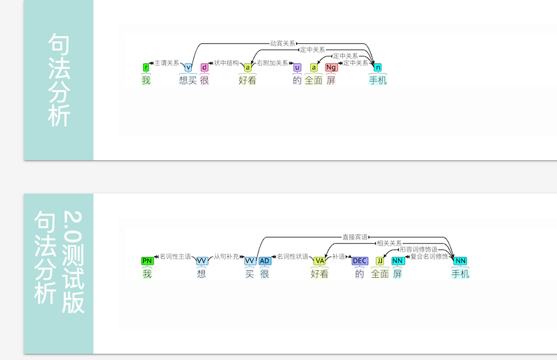

# 中文分词技术

前面创建表的时候提到过，商品搜索，没有创建索引，用数据库来实现搜索功能，效率底下。这就需要用到分词技术

## 为什么要做中文分词？

中文是一种是分复杂的语言，让计算机理解中文语言更是困难，比如

「兵乓球拍卖完了」：这个句子，你自己琢磨琢磨有几种断句方式？有几种含义？像这种有歧义的句子，分词技术也无法帮你实现，因为你人工都无法明白它的含义是什么

「我想买电话」：对于这种语法没有歧义的句子，使用中文分词得到主谓宾，哪些是名称哪些是动词，一般会忽略主语和动词，比如这里的 「我」和「买」，把宾语的名词提取出来，就提取到了「电话」

## MySQL 的全文索引

MySQL 的全文检索功能，支持英文和中文，对英文支持很好，但是对中文支持不太好，不能按照语义切词，只能按照字符切词，比如下面这句话


## 创建全文索引

给 sku 表的 title 字段添加全文索引

```sql
create fulltext index text_title
    on t_sku (title);
```

查询

```sql
select id, title, images, price
from t_sku
where match(title) against('小米9');
```

这里查询比 like 要快，因为使用的是索引。

这里查询「小米9」能查询到数据，但是如果查询 「我要买小米9」，就匹配不到数据了。

## 全文索引的弊端

- 中文字段创建全文索引，切词结果太多，占用大量存储空间

- 更新字段内容，全文索引不会更新，必须定期手动维护

- 在数据库集群中维护全文索引难度很大

  要维护多个数据库节点的全文索引，难度很大

## 专业的全文检索引擎

Lucene 是 Apache 基金会的开源 全文检索引擎，支持中文分词。

添加依赖

```
    compile group: 'org.apache.lucene', name: 'lucene-core', version: '8.5.2'
    compile group: 'org.apache.lucene', name: 'lucene-analyzers-common', version: '8.5.2'
    compile group: 'org.apache.lucene', name: 'lucene-queryparser', version: '8.5.2'
```

由于 Lucene 自带的中文分词插件功能较弱，需要引入第三方中文分词插件 [hanlp](https://github.com/hankcs/HanLP)，这个是它的 [在线体验地址](https://hanlp.hankcs.com/)



引入 hanlp

```
    compile group: 'com.hankcs', name: 'hanlp', version: 'portable-1.7.7'
    compile group: 'com.hankcs.nlp', name: 'hanlp-lucene-plugin', version: '1.1.7'
```

## 创建 Lucene 索引

从数据库中把 sku 的 id 和 title 从数据库拉取出来，存入 Lucene 中。

```java
package demo.lucene;

import cn.hutool.db.Db;
import cn.hutool.db.Entity;
import com.hankcs.lucene.HanLPAnalyzer;
import org.apache.lucene.document.Document;
import org.apache.lucene.document.Field;
import org.apache.lucene.document.TextField;
import org.apache.lucene.index.IndexWriter;
import org.apache.lucene.index.IndexWriterConfig;
import org.apache.lucene.store.FSDirectory;
import org.junit.Test;

import java.io.IOException;
import java.nio.file.Paths;
import java.sql.SQLException;
import java.util.List;
import java.util.stream.Collectors;

public class LuceneDemo {
    @Test
    public void fun1() throws SQLException, IOException {
        // 这里使用 hutool 的 sql 工具来加快我们的开发
        List<Entity> skus = Db.use().findAll("t_sku");
        // 从数据库中查询出 sku 并封装成 document
        List<Document> docs = skus.stream()
                .map(item -> {
                    Document doc = new Document();
                    doc.add(new TextField("id", item.getStr("id"), Field.Store.YES));
                    doc.add(new TextField("title", item.getStr("title"), Field.Store.YES));
                    return doc;
                })
                .collect(Collectors.toList());
        IndexWriter indexWriter = buildIndexWriter();
        for (Document doc : docs) {
            // 插入
            indexWriter.addDocument(doc);
        }
        // 关闭索引写入器
        indexWriter.close();
    }
	  /**
     * 创建索引写入器，通过该写入器把数据写入到 lucene 中
     *
     * @return
     * @throws IOException
     */
    public IndexWriter buildIndexWriter() throws IOException {
        // 创建存储目录
        FSDirectory directory = FSDirectory.open(Paths.get("/Users/mrcode/Desktop/lucene"));
        // 创建我们引入的 hanl 中文分词器
        HanLPAnalyzer hanLPAnalyzer = new HanLPAnalyzer();
        // 创建索引配置对象
        IndexWriterConfig indexWriterConfig = new IndexWriterConfig(hanLPAnalyzer);
        // 创建索引写入器
        IndexWriter indexWriter = new IndexWriter(directory, indexWriterConfig);
        return indexWriter;
    }
}

```

这里为了快速，使用了 hutool 的 sql 工具来加快我们的开发。需要在 classpath 下新增一个 db.setting 的配置文件，内容如下

```bash
## db.setting文件

url = jdbc:mysql://192.168.56.101:3306/neti
user = root
pass = 123456

## 可选配置
# 是否在日志中显示执行的SQL
showSql = true
# 是否格式化显示的SQL
formatSql = false
# 是否显示SQL参数
showParams = true
# 打印SQL的日志等级，默认debug，可以是info、warn、error
sqlLevel = debug
```

从 Lucene 索引中读取数据

```java
 @Test
    public void fun2() throws IOException, ParseException {
        IndexSearcher indexSearcher = buildIndexSearcher();
        // 需要搜索的内容
        String parStr = "我想要苹果手机";
        // 搜索字段名称
        String field = "title";

        Analyzer hanLPAnalyzer = new HanLPAnalyzer();
        // 查询解析器
        QueryParser queryParser = new QueryParser(field, hanLPAnalyzer);
        // 解析搜索
        Query query = queryParser.parse(parStr);
        TopDocs topDocs = indexSearcher.search(query, 100);
        System.out.println("总命中数：" + topDocs.totalHits);
        ScoreDoc[] scoreDocs = topDocs.scoreDocs;
        for (ScoreDoc scoreDoc : scoreDocs) {
            Document doc = indexSearcher.doc(scoreDoc.doc);
            System.out.println("id:" + doc.get("id") + " ; title:" + doc.get("title"));
        }
    }

    private IndexSearcher buildIndexSearcher() throws IOException {
        FSDirectory directory = FSDirectory.open(Paths.get("/Users/mrcode/Desktop/lucene"));
        // 索引月阅读器
        DirectoryReader dr = DirectoryReader.open(directory);
        // 索引扫描器
        return new IndexSearcher(dr);
    }
```

输出结果为

```
总命中数：4 hits
id:4 ; title:Xiaomi/小米 小米9 6GB+128GB 深空灰 移动联通电信全网通4G手机
id:1 ; title:Xiaomi/小米 小米9 8GB+128GB 全息幻彩紫 移动联通电信全网通4G手机
id:2 ; title:Xiaomi/小米 小米9 8GB+128GB 全息幻彩蓝 移动联通电信全网通4G手机
id:3 ; title:Xiaomi/小米 小米9 6GB+128GB 全息幻彩蓝 移动联通电信全网通4G手机
```

由于分词原因，被解析为`title:我 title:想 title:要 title:苹果 title:手机`，那么苹果手机在我们库中是无法获取到匹配的数据的，匹配到了手机。

## Lucene 注意事项

不是所有表都需要放到 Lucene ；只对需要全文检索的字段使用 Lucene 。

## Lucene 与 MySQL 的结合


如上图。