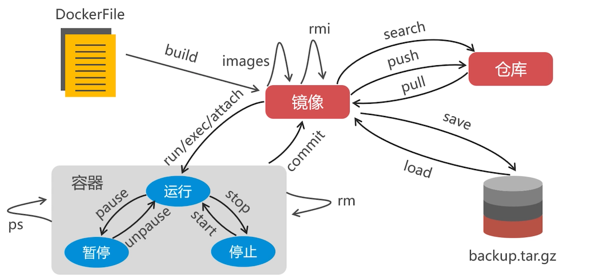

# 如何使用 Docker 虚拟机

## Docker 与 vm 虚拟机对比

Docker 是免费的虚拟机引擎，可以为任何应用创建一个轻量级的可移植的容器


总的来说，Docker 在批量集群方面，就是快、方便

## 可以不安装虚拟机吗？

Docker 是跨平台的轻量级虚拟机，Win10 和 MacOS 都可以安装 Docker，

但是我们需要用到虚拟 IP，这个只有 Linux 才支持。所以还是安装虚拟机把。

## 云计算中的 Docker 虚拟机


因为Docker 是轻量级的虚拟机，一台服务器可以跑几百上千个虚拟的实例，所以有很多厂商就出售这些实例，这就是 **云计算的虚拟云主机** ；

云又分为：

- Saas

  为客户提供完整的云端产品（如进销存、财务系统等），用户购买云主机时，挑选需要哪些产品，运营商就立即给你构建这套软件系统，对很多非技术性的中小企业是很有帮助的：不需要自己搭建环境，也不需要找人开发

- PaaS

  为客户提供服务，客户自己把这些服务整合成产品；

  比如事先把 redis、mysql、MongoDB 等部署到虚拟的实例上，再开发一套管理系统，如果客户需要使用云端数据库服务，那么就卖给你数据库服务

  PaaS 云适合中小型的技术企业，通过购买运营商提供的基础服务，完成自己的云端引用程序的开发

无论是哪一种云，都需要用到 Docker 虚拟机

## Docker 镜像

Docker 虚拟机的镜像是一个**只读层**，不能写入数据。

我们可以通过 dockerfile 文件，定义需要安装的程序（如 MySQL），然后创建出镜像文件。

在 Docker 仓库中已经存在了一些别人已经制作好的镜像，比如 java 环境。


由于镜像是只读的，想要存储一些数据，就需要创建容器。

## Docker 容器

Docker 容器是一个 **虚拟机的实例**，里面的内容可读可写。且容器是 **完全隔离** 的，我们不用担心部署程序会相互干扰。

一个镜像可以创建出多个容器。


## 安装 Docker 虚拟机

首先我们需要多搞几台 vm 的虚拟机出来，这些 vm 虚拟机的硬件配置可以稍微提高一点，因为一台 linux 服务器里面可以跑很多个 docker 虚拟机；

在 CentOS 上安装 Docker 虚拟机

```sql
yum install -y docker
service docker start
service docker stop
```

## Docker 虚拟机管理命令

下面是 docker 的一些常用命令



- build：从 DockerFile 构建一个镜像

- search：搜索 Docker 仓库有哪些可用的镜像

  如果不想自己 build 镜像，就可以查看有哪些别人制作好的

- pull：从远程把镜像，下载到本地

- push：将我们自己创建的镜像发布到仓库

- images：查看本地存放了哪些镜像

- rmi：删除一个镜像

  前提是，把与该镜像关联的容器都删除

- save：将本地的镜像导出成压缩文件

- load：将压缩文件导入到本地的 Docker 虚拟机

- run：创建容器，创建后就是运行状态的

  访问容器：可执行 exec/attach 命令

- pause/unpause：暂停或则恢复容器

- stop/start：停止容器或启动容器

- ps：查看 docker 中有多少个容器

- rm：删除容器

- commit：将容器转换成镜像

## 设置镜像加速器

Docker 仓库在海外，访问很慢，设置为国内的镜像仓库，加快下载速度；

这里使用 [dockerCloud 加速器](https://www.daocloud.io/mirror)

```bash
[root@study ~]# curl -sSL https://get.daocloud.io/daotools/set_mirror.sh | sh -s http://f1361db2.m.daocloud.io
docker version >= 1.12
{"registry-mirrors": ["http://f1361db2.m.daocloud.io"],}
Success.
You need to restart docker to take effect: sudo systemctl restart docker 
```

看见上面输出，多了一个逗号，需要手动编辑去掉这个逗号

```sql
vim /etc/docker/daemon.json
# 修改为下面这样，就是去掉了后面多余的逗号
{"registry-mirrors": ["http://f1361db2.m.daocloud.io"]}
```

笔者这里使用 dockerCloud 还是有超时现象，这里配置下阿里云的，先进入[容器镜像服务](https://cr.console.aliyun.com/)；侧边栏有一个镜像中心，找到镜像加速器；会给你一个专属的镜像加速器地址，上面文件中的地址替换掉这个，重启 docker 就可以了

## 演示

一开始笔者没有关闭 SELinux，会出现一些程序运行的权限问题，这里还是需要先关闭：[可参考这个文章](https://zq99299.github.io/linux-tutorial/tutorial-basis/16/05.html#selinux-%E4%B8%89%E7%A7%8D%E6%A8%A1%E5%BC%8F%E7%9A%84%E5%90%AF%E5%8A%A8%E3%80%81%E5%85%B3%E9%97%AD%E4%B8%8E%E8%A7%82%E5%AF%9F)

下载一个 java 镜像，创建出一个容器，部署 java 程序

```bash
# 搜索远程仓库有哪些可用的 java 镜像
[root@study ~]# docker search java
INDEX       NAME                                               DESCRIPTION                                     STARS     OFFICIAL   AUTOMATED
docker.io   docker.io/node                                     Node.js is a JavaScript-based platform for...   8925      [OK]       
docker.io   docker.io/tomcat                                   Apache Tomcat is an open source implementa...   2751      [OK]       
docker.io   docker.io/openjdk                                  OpenJDK is an open-source implementation o...   2289      [OK] 

# 上面看到了一个 openjdk
# 下载该镜像
[root@study ~]# docker pull docker.io/openjdk
Using default tag: latest
Trying to pull repository docker.io/library/openjdk ... 
latest: Pulling from docker.io/library/openjdk
fa926a7d213a: Pull complete 
22aed8993d2f: Pull complete 
6f92a6635435: Pull complete 
Digest: sha256:c56c42fb84c21ebeea1c715f323b78f4160872ac6c28c32292d9cd1d29982aaf
Status: Downloaded newer image for docker.io/openjdk:latest

# 查看 docker 环境里是否有下载下来的镜像
[root@study ~]# docker images
REPOSITORY          TAG                 IMAGE ID            CREATED             SIZE
docker.io/openjdk   latest              4fba8120f640        3 days ago          497 MB

# 创建容器 
# -it:  进入容器
# bash：进入容器使用哪一个命令行
[root@study ~]# docker run -it docker.io/openjdk bash
bash-4.2# 									# 可以看到就进入到容器中来了
# 可以看下当前是哪一个的 java 版本
bash-4.2# java --version
openjdk 14.0.1 2020-04-14
OpenJDK Runtime Environment (build 14.0.1+7)
OpenJDK 64-Bit Server VM (build 14.0.1+7, mixed mode, sharing)

# 部署程序到这个容器中，需要做一个目录映射，才能把文件传到容器中
# 退出容器，在容器中执行  exit

# 查看有哪些容器
[root@study ~]# docker ps -a
CONTAINER ID        IMAGE               COMMAND             CREATED             STATUS                      PORTS               NAMES
838eefc8ff2c        docker.io/openjdk   "bash"              3 minutes ago       Exited (0) 12 seconds ago                       adoring_meitner
# 可以看到，刚刚我们退出的容器，status 的确是 exited 了

# 删掉该容器,给的是容器ID
[root@study ~]# docker rm 838eefc8ff2c

# 创建一个有目录容器的映射
# 使用 -v 参数，有两个目录，左边的是宿主机的目录，右边的映射到容器中的目录
# 映射目录，需要该目录先存着，记得先创建它
# 1. 创建并进入该容器
[root@study ~]# docker run -it -v /root/java:/root/java  docker.io/openjdk bash
# 2. 在 宿主机的 /root/java 目录下创建一个  Hello.java 文件
#    文件内容就如下一个简单的打印
class Hello{
  public static void main(String[] args){
    System.out.println("Hello World");
  }
}
#  3. 在容器中进入该目录
#			发现提示权限不足，这里还是要听老师的，需要先把 SELinux 关闭; 关闭后需要重新启动机器
bash-4.2# ls /root/java/
ls: cannot open directory /root/java/: Permission denied
# 		处理完 SELinux 后，就发现能看到了
bash-4.2# ls /root/java/
Hello.java
bash-4.2# cd /root/java
bash-4.2# javac Hello.java 
bash-4.2# java Hello
Hello World
```

## 镜像的导入与导出

某些电脑无法下载镜像（没有外网）或则下载速度很慢，可以将镜像导出成压缩文件，再导入

```bash
# 导出 
docker save -o /root/openjdk.tar.gz docker.io/openjdk
# 导入 
docker load < /root/openjdk.tar.gz
```

这里测试的话，把本地的 openjdk 镜像删除，前提是 **要把用该镜像创建出来的容器删除掉**

```bash
[root@study ~]# docker ps -a
CONTAINER ID        IMAGE               COMMAND             CREATED             STATUS                       PORTS               NAMES
3f3d27fa951c        docker.io/openjdk   "bash"              21 hours ago        Exited (255) 2 minutes ago                       trusting_northcutt
# 删除容器
[root@study ~]# docker rm 3f3d27fa951c
3f3d27fa951c

[root@study ~]# docker images
REPOSITORY          TAG                 IMAGE ID            CREATED             SIZE
docker.io/openjdk   latest              4fba8120f640        4 days ago          497 MB

# 删除镜像
[root@study ~]# docker rmi 4fba8120f640
Untagged: docker.io/openjdk:latest
Untagged: docker.io/openjdk@sha256:c56c42fb84c21ebeea1c715f323b78f4160872ac6c28c32292d9cd1d29982aaf
Deleted: sha256:4fba8120f640877c7aedf93c1c862df74ee2d971786a402289099e6c08798598
Deleted: sha256:072f3a083c65224baab5ff73b3913057778d467df1860f67434ef5fbe874e05b
Deleted: sha256:21a066a950d33c4609707b20ac5a7fd4cf71b8526f0f43723b86f306469686bf
Deleted: sha256:351f02e4b003402356cd1295ec4619446767783e503cd455f39a80015538ed7e
```

最后导入刚刚导出的

```bash
[root@study ~]# docker load < /root/openjdk.tar.gz
351f02e4b003: Loading layer [==================================================>] 126.2 MB/126.2 MB
41f691265dc2: Loading layer [==================================================>] 42.66 MB/42.66 MB
e0b0ff63abdd: Loading layer [==================================================>] 335.3 MB/335.3 MB
Loaded image: docker.io/openjdk:latest
```

修改镜像名称，看命令 tag 就知道只是增加了一个标签而已， imageID 还是一样的

```bash
[root@study ~]# docker tag docker.io/openjdk openjdk
[root@study ~]# docker images
REPOSITORY          TAG                 IMAGE ID            CREATED             SIZE
openjdk             latest              4fba8120f640        4 days ago          497 MB
docker.io/openjdk   latest              4fba8120f640        4 days ago          497 MB
```

## 创建容器命令

创建容器时，可以 **映射端口**和 **挂载目录**

```bash
# --name 给容器启动一个名称，名称可有可无，因为会有容器 id
# 进入容器后，默认运行的是 bash 程序
docker run -it --name java openjdk bash

# -p 做了端口映射，左侧是宿主机端口 : 右侧容器端口
# 可以写多个端口映射
docker run -it --name java -p 9000:8080 -p 9001:8085 openjdk bash

# -v 挂载目录
# --privileged: 容器要读写目录里面的数据，需要分配最高的权限
docker run -it --name java -v /root/project:/sorf --privileged openjdk bash
```

## 容器的启动/退出/暂停/恢复

```bash
# 创建容器，并以交互模式进入 bash 程序
[root@study ~]# docker run -it docker.io/openjdk bash
bash-4.2# exit			# 退出容器，那么容器也停止运行了
exit
[root@study ~]# docker ps -a
CONTAINER ID        IMAGE               COMMAND             CREATED             STATUS                     PORTS               NAMES
65f855abe6dd        docker.io/openjdk   "bash"              11 seconds ago      Exited (0) 4 seconds ago                       peaceful_spence

# 让容器再次运行
# -i：是否以交互模式运行，如果不加 -i，那么容器会在后头模式运行
[root@study ~]# docker start -i 65f855abe6dd
bash-4.2# exit
exit

# 后台模式运行
[root@study ~]# docker start 65f855abe6dd
65f855abe6dd
[root@study ~]# docker ps -a
CONTAINER ID        IMAGE               COMMAND             CREATED             STATUS              PORTS               NAMES
65f855abe6dd        docker.io/openjdk   "bash"              4 minutes ago       Up 5 seconds                            peaceful_spence

# 让容器暂停
[root@study ~]# docker pause 65f855abe6dd
65f855abe6dd
[root@study ~]# docker ps -a
CONTAINER ID        IMAGE               COMMAND             CREATED             STATUS                       PORTS               NAMES
65f855abe6dd        docker.io/openjdk   "bash"              5 minutes ago       Up About a minute (Paused)                       peaceful_spence
# 可以看到状态变成 pause 了

# 恢复容器的运行
[root@study ~]# docker unpause 65f855abe6dd
65f855abe6dd
[root@study ~]# docker ps -a
CONTAINER ID        IMAGE               COMMAND             CREATED             STATUS              PORTS               NAMES
65f855abe6dd        docker.io/openjdk   "bash"              6 minutes ago       Up 2 minutes                            peaceful_spence

# 停止容器的运行
[root@study ~]# docker stop 65f855abe6dd
```

