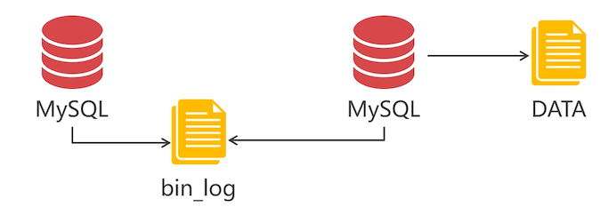
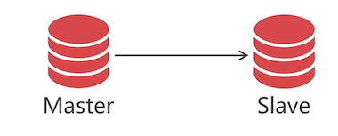

# 搭建 Replication 集群

PXC 集群适合存放高价值的数据，那么大量低价值的数据就不适合保存在 PCX 集群中；

如用户评价信息。

Replication 集群是 MySQL 自带的数据同步机制。简单讲解下它的同步原理：



1. 第一个 MySQL 开启 bin_log 日志

   所有使用 MySQL 的操作，都会被记录在该文件中

2. 第二个 MySQL 读取第一个 MySQL 的 bin_log 日志

   就知道第一个 MySQL 执行了哪些操作，并且把这些操作在本地也执行一遍

这里可以看出来，数据同步是 **单向** 的，而 PXC 集群是双向的。

## 主从同步关系



Replication 集群中，数据同步是单向的，从主节点（Master）同步到从节点（Slave）；

如果你的场景是读多写少的，就可以给 master 配置多个 Slave 节点，查询数据的操作都走 Slave，写操作走 Master，就可以实现读写分离的功能。

## 下载安装 Replication 镜像

Oracle 并没有提供官方的 Replication 镜像，所以只能安装第三方封装的镜像文件。

Replication 就是 MySQL server，通过配置文件 my.cnf 配置主从的，这里说使用第三方的，应该是封装之后，使用起来更简单？

```bash
# 下载镜像后，修改它的名称，把名称修改短一点
docker pull mishamx/mysql
docker tag mishamx/mysql rep
docker rmi  mishamx/mysql
```

## Replication 集群的结构

为了实现数据分片，Replication 也是要进行数据分片的。所以先来搭建一个 Replication 集群，成功的话，再去搭建第二个。

|  虚拟机  |    IP 地址     | 端口 |  容器  | 数据卷 |
| :------: | :------------: | :--: | :----: | :----: |
| docker-1 | 192.168.56.105 | 9003 | rn1(m) |  rnv1  |
| docker-2 | 192.168.56.107 | 9003 | rn2(s) |  rnv2  |
| docker-3 | 192.168.56.108 | 9003 | rn3(s) |  nv3   |

rn1作为 master 节点，其余两个作为 Slave 节点。

## 创建主节点容器

主节点用来让其他节点与之同步，而且主节点身份是固定的。

使用镜像命令参数，该镜像是封装了 MySQL 官方的 Replication 配置，一定要知道 Replication 最原始的搭建方式。

```bash
docker run -d -p 9003:3306 --name rn1
-e MYSQL_MASTER_PORT=3306
-e MYSQL_ROOT_PASSWORD=123456							# 设置数据库 ROOT 账户密码
-e MYSQL_REPLICATION_USER=backup					# 创建一个新的 mysql 账户，仅用来做数据同步
-e MYSQL_REPLICATION_PASSWORD=123456			# 设置分配一个密码
-V rnv1:/var/lib/mysql --privileged				# 数据卷
--net=swarm_mysql rep
```

下面来实操

```bash
[root@study /]# docker run -d -p 9003:3306 --name rn1 -e MYSQL_MASTER_PORT=3306 -e MYSQL_ROOT_PASSWORD=123456 -e MYSQL_REPLICATION_USER=backup -e MYSQL_REPLICATION_PASSWORD=123456 -v rnv1:/var/lib/mysql --privileged --net=swarm_mysql rep
7d9d59aed2af2d766f5413c70530ed6b294601dcb1c4cc3aeab51ca92fac3a7f
```

等一会初始后，通过 Navicat 去连接 9300 端口，看是否能够链接上这个数据库

## 创建从节点容器

从节点需要与主节点同步数据，没有主节点不能创建从节点，要保证主节点已经创建成功，再来创建从节点

```bash
docker run -d -p 9003:3306 --name rn2
-e MySQL_MASTER_HOST=rn1									#### 增加了这一行配置，指向了主节点容器名称
-e MYSQL_MASTER_PORT=3306
-e MYSQL_ROOT_PASSWORD=123456							# 设置数据库 ROOT 账户密码
-e MYSQL_REPLICATION_USER=backup					# 创建一个新的 mysql 账户，仅用来做数据同步
-e MYSQL_REPLICATION_PASSWORD=123456			# 设置分配一个密码
-V rnv2:/var/lib/mysql --privileged				# 数据卷
--net=swarm_mysql rep
```

从节点创建与主节点类似，只是多了配置主节点的参数。下面只记录了一台机器的从节点创建，需要把你规划的剩余机器也创建上

```bash
[root@study ~]# docker run -d -p 9003:3306 --name rn2 -e MYSQL_MASTER_HOST=rn1 -e MYSQL_MASTER_PORT=3306 -e MYSQL_ROOT_PASSWORD=123456 -e MYSQL_REPLICATION_USER=backup -e MYSQL_REPLICATION_PASSWORD=123456 -v rnv2:/var/lib/mysql --privileged --net=swarm_mysql rep
c6f61a470d2b786bbaeb77ab540dc3454e2cbec2f9c39627ccc07280e92f3679
```

> [!TIP] 注意

镜像需要的参数 MYSQL_MASTER_HOST 别写错了，笔者就是写错了，导致数据同步不成功，删除做法如下：

1. 停止该容器

2. 删除该容器

3. 删除绑定的数据卷；

   当数据卷存在的时候，就算参数对了，也不会覆盖数据卷中的配置，导致一直失败。所以一定要记得，删除该数据卷

4. 使用正确的容器创建命令，创建


## Replication 集群的注意事项

这里讨论下 Replication 的使用，是否也会向  PXC 集群那样，关闭之后，再启动会闪退呢？

- 主节点关闭，从节点会发生什么？

  主节点关闭，**从节点依然可以使用**，但是 **主从同步机制失效**

- 不启动主节点，从节点能启动吗？

  **不启动主节点**，从节点也能启动，**主从同步失效**

## 搭建 Replication 集群分片

现在可以规划下搭建第二个 Replication 集群了。

强一致性与弱一致性：

- PXC 是强一致性集群
- Replication 是弱一致性集群

这里有一个[免费课程](http://www.imooc.com/learn/993)，以项目演示为例，讲解 PXC 集群原理、PXC 数据同步与 Replication 同步的区别、PXC 的多节点并发写入、Docker 虚拟机部署 MySQL 集群，并以案例验证 Replication 方案的数据不一致性、PXC 方案数据一致性，等知识点。有兴趣可以去看看

数据切分与 PXC 集群一样，搭建两个集群分片，规划如下

REP 1

|  虚拟机  |    IP 地址     | 端口 |  容器  | 数据卷 |
| :------: | :------------: | :--: | :----: | :----: |
| docker-1 | 192.168.56.105 | 9003 | rn1(m) |  rnv1  |
| docker-2 | 192.168.56.107 | 9003 | rn2(s) |  rnv2  |
| docker-3 | 192.168.56.108 | 9003 | rn3(s) |  rnv3  |

REP 2

|  虚拟机  |    IP 地址     | 端口 |  容器  | 数据卷 |
| :------: | :------------: | :--: | :----: | :----: |
| docker-1 | 192.168.56.105 | 9004 | rn4(m) |  rnv4  |
| docker-2 | 192.168.56.107 | 9004 | rn5(s) |  rnv5  |
| docker-3 | 192.168.56.108 | 9004 | rn6(s) |  rnv6  |

如何做分片，是下一个大章节的内容。