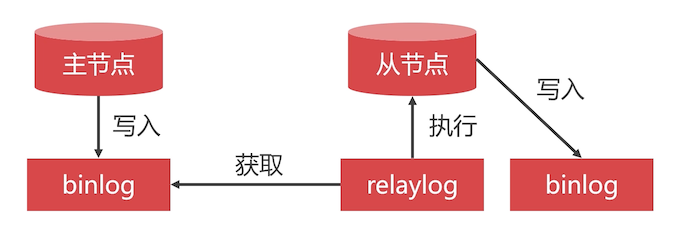

# 主从同步原理



- 主节点执行的查询语句都会记录在 binlog 中
- 从节点监听主节点 binlog 文件，同步到自己的 relaylog 中
- 从接待再执行 relaylog 中的 sql 语句

数据同步是单向的，其实就是看错读写分离的架构。主写，从读。

## 一主多从架构

通常来说，业务系统都是读多写少的，可以给主节点配置更的从节点。


但是如果从 **节点的数量超过了 3 个**，出现 **从节点数据同步跟不上主节点的写入**。

原因是因为：从点的过多，会消耗主节点的网络资源，导致数据同步变慢，解决方案是 **从节点分发数据**

## 从节点分发数据

解决主节点同步速度慢问题。合理的使用从节点充当中继节点，供给其他的更多的从节点数据同步


在实现上，其实从节点变成了他下面挂的从节点的主节点。

## 双主节点相互同步

在 Replication 集群中，主节点挂了，从节点不会自动成为主节点；为了实现主节点的高可用，实现双柱节点相互同步。


配置思路：

1. 左边作为主，右边作为从
2. 右边作为主，左边作为从

但是需要注意的一个问题是：还是 Replication 的一个弊端，是异步的同步数据，导致有可能其中一个并不能完全同步到数据。其实这个也没有什么好注意的。 Replication 就是有这个弊端。

## 删除原有的 Replication 集群

REP 1

|  虚拟机  |    IP 地址     | 端口 |  容器  | 数据卷 |
| :------: | :------------: | :--: | :----: | :----: |
| docker-1 | 192.168.56.105 | 9003 | rn1(m) |  rnv1  |
| docker-2 | 192.168.56.107 | 9003 | rn2(s) |  rnv2  |
| docker-3 | 192.168.56.108 | 9003 | rn3(s) |  rnv3  |

REP 2

|  虚拟机  |    IP 地址     | 端口 |  容器  | 数据卷 |
| :------: | :------------: | :--: | :----: | :----: |
| docker-1 | 192.168.56.105 | 9004 | rn4(m) |  rnv4  |
| docker-2 | 192.168.56.107 | 9004 | rn5(s) |  rnv5  |
| docker-3 | 192.168.56.108 | 9004 | rn6(s) |  rnv6  |

因为要搭建新的 Replication 集群，原来搭建的两组集群要删除：容器和数据卷也要删除

## 安装 MySQL 镜像

由于需要做双主，我们需要安装普通的 mysql 集群镜像，然后一步一步搭建出来。由于 PXC 集群采用的 mysql 是 5.7 版本的，我们这里也建议使用相同版本的 MySQL。后续通过 ETl 中间件抽取数据做表连接，就更加容易。

```bash
# 这里安装的是官方的 mysql 镜像
docker pull mysql:5.7.27
docker tag mysql:5.7.27 mysql
docker rmi mysql:5.7.27
```

## 创建 MySQL 容器

创建的时候，名称和数据卷都是使用之前删掉的。

```bash
docker run -d -p 9003:3306 --name rn1 
-e MYSQL_ROOT_PASSWORD=123456 
-v rnv1:/var/lib/mysql --privileged
--net=swarm_mysql mysql
```

这里没有指定主从节点的参数，需要容器启动后，我们去修改配置文件来实现。

```bash
# 装完一台，先测试是否能连接上再开始
[root@study ~]# docker run -d -p 9003:3306 --name rn1 -e MYSQL_ROOT_PASSWORD=123456 -v rnv1:/var/lib/mysql --privileged --net=swarm_mysql mysql
```

