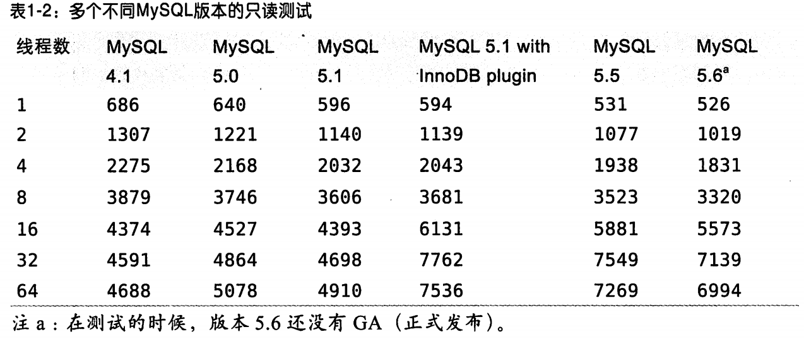

# MySQL 时间线（Timeline）

在选择 MySQL 版本的时候，了解下版本的变迁历史是有帮助的。

- 版本 3.23 （2001）

  一般认为该版本是 MySQL 真正「诞生」时刻，开始获得广泛使用。在该版本中，MySQL 依然只是一个在平面文件（Flat File）上实现了 SQL 查询的系统。

  但一个重要的改进是引入了 MyISAM 代替了老旧而有诸多限制的 ISAM 引擎。由于 InnoDB 太新，没有默认包含在发布的二进制发行版中。所以，要使用 InnoDB 必须手工编译。

  还引入了全文索引和 **复制**，复制是 MySQL 成为互联网应用的数据库系统的关键性（killer feature）

- 版本 4.0（2003）

  支持新的语法，比如 **UNION** 和多表 **DELETE** 语法。 重写了复制，在备库使用了两个线程来实现复制，避免了之前一个线程做所有复制工作的模式下任务切换导致的问题。

  InnoDB 成为标准配备，包括了全部的特性：行级锁、外键等。

  还引入了查询缓存（自那以后这部分改动不大），同时还支持通过 SSL 进行连接

- 版本 4.1（2005）

  引入了更多新的语法，比如子查询和 `INSERT ON DUPLICATE KEY UPDATE`。 开始支持 UTF-8 字符集。支持新的二进制协议和 prepared 语句。

- 版本 5.0（2006）

  出现了一些「企业级」特性：视图、触发器、存储过程和存储函数。老的 ISAM 引擎代码被彻底移除，同时引入了新的 Federated 等引擎。

- 版本5.1（2008）

  Sum 收购 MySQL  AB 以后发布的首个版本，研发时间长达 5 年。引入了分区、基于行的复制，以及 plugin API（包括可插播存储引擎的 API）。移除了 BerkeyDB 引擎，这是 MySQL 最早的事物存储引擎。其他的如 Federated 引擎也将被放弃。同时 Oracle 收购的 InnoDB Oy 发布了InnoDB plugin。

- 版本 5.5（2010）

  Oracle 收购 Sun 以后发布的首个版本。主要改善集中在性能、扩展性、复制、分区、对微软 windows 系统的支持，以及一些其他方面。 InnoDB 成为默认的存储引擎。更多的一些遗留特性和不建议使用的特性被移除。增加了 PERFORMANCE_SCHEMA 库，包含了一些可测量的性能指标的增强。增加了复制、认证和审计 API。 半同步复制（semisynchronous replication）插件进入实用阶段。Oracle 还在 2011 年发布了商用的认证插件和线程池（thread pooling）。 InnoDB 在架构方面也做了较大的改进，比如多个子缓冲池（buffer pool）

- 版本 5.6（还未发布）

  包含一些重大更新。比如多年来首次对查询优化器进行大规模的改进，更多的插件 API（如全文索引），复制的改进、以及 PERFORMANCE_SCHEMA 库增加了更多的性能指标。InnoDB 团队也做了大量的改进工作。

  MySQL 5.5 主要着重在基础部分的改进和加强，引入了部分新特性。而 MySQL 5.6 则在 5.5 的基础上提升服务器的开发和性能。

- 版本 6.0（已取消）

  传说中拥有大量的新特性，包括在线备份、服务器层面对所有存储引擎的外键支持，以及子查询的改进和线程池。后来该版本被取消，在 5.4 继续开发，最后发布时变成版本 5.5。 其中很多特性的代码出现在 5.5 和 5.6 中

简单总结下 MySQL 的发展史：早期的 MySQL 是一种破坏性创新，有诸多限制，并且很多功能是二流的。但是他的特性支持和较低的使用成本，使得其成为快速增长的互联网时代的杀手级应用。在 5.x 版本引入了企业级特性，但是不算成功，bug 较多，直到 5.0.50 以后才算稳定。 版本 5.0 和 5.1 发布都延期了许多时日，而且被 Sun 和 Oracle 收购。5.5 版本可以说是 MySQL 历史上质量最高的版本。5.6 也承诺在功能和性能方面将有显著的提升。

提到性能，下面尝试设计了多个测试方案来尽量保证在不同版本中的基准一致，并为此做了很多努力，下面显示了在服务器层面不同并发下的每秒事物的测试结果：

上表数据，以图方式展示为

在解释结果之前，介绍下测试环境：

- 机器 Cisco UCS C250
- 两颗 6 核 CPU ，没核支持 2 个线程
- 内存 353GB
- 测试的数据集是 2.5GB，所以 MySQL 的 buffer pool 设置为 4GB。
- 采用 SysBench 的 read-only 只读测试进行压测，并采用 InnoDB 存储引擎
- 所有的数据都可以放入内存，因此 CPU 密集型（Cpu-bound）的测试
- 每次测试持续 60 分钟，每 10 秒获取一次性吞吐量的结果
- 前 900 秒用于预热数据，以避免预热时的 I/O 影响测试结果

现在来看结果，有两个很明显的趋势：

1. InnoDB Plugin 的版本：在高并发的时候性能明显更好

2. 新的版本在单线程的时候性能比旧版本更差。

   这只是一个非常简单的只读测试，新版本的 SQL 语法更复杂，针对复杂查询增加了很多特性和改进，这对简单查询可能带来了更多的开销。

一般来说，新版本在复杂场景时性能有更多的优化，尤其是高并发和大数据集的情况下。

那么该如何选择版本呢？这更多的取决于业务需求而不是技术需求。理想情况下当然是版本越新越好。