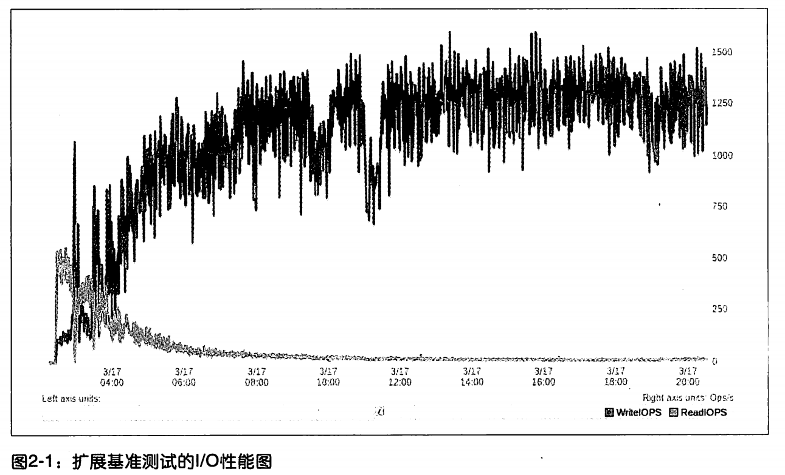
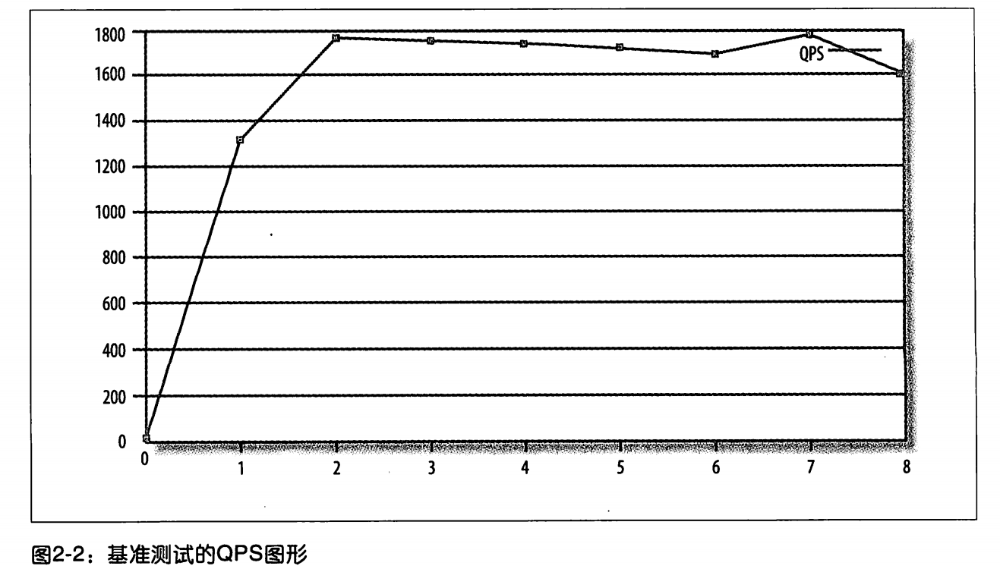
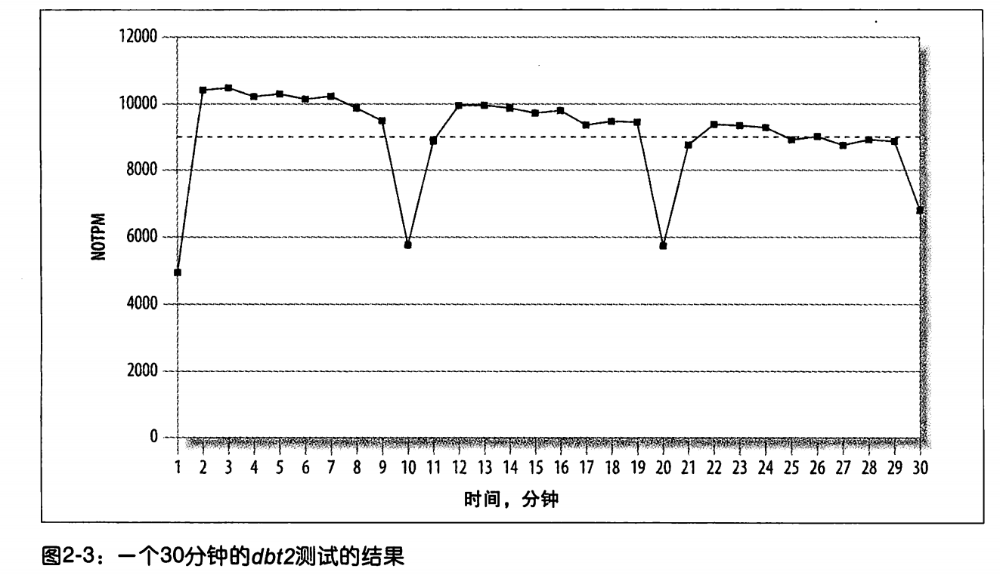

# 基准测试方法 

在了解基本概念之后，现在可以来讨论下如何设计和执行基准测试。但是在讨论如何设计好基准测试之前，先来看一下如何避免一些常见的错误，这些错误可能导致测试结果无用或不精准：

- 使用真实数据的子集而不是全集

  例如应用需要处理几百 GB 的数据，但测试只有 1GB 的数据；或则只使用当前数据进行测试，缺希望模拟未来业务大幅度增长后的情况。

- 使用错误的数据分布

  例如：使用均匀分布的数据测试，而系统的真实数据有很多热点区域（随机生成的测试数据通常无法模拟真实的数据分布）

- 使用不真实的分布参数

  例如：假定所有用户的个人信息（profile）都会被平均的读取

- 在多用户场景中，只做单用户的测试

- 在单服务器上测试分布式应用

- 与真实用户行为不匹配

  例如：web 页面中的「思考时间」，真实用户在请求到一个页面后会阅读一段时间，而不是不停顿的点击相关链接。

- 反复执行同一个查询

  真实查询是不尽相同的，这可能会导致缓存命中率降低。而反复执行同一个查询在某种程度上，会全部或则部分缓存结果。

- 没有检查错误

  如果测试结果无法得到合适的解释，比如一个本应该很慢的查询突然变快了。基准测试完成后，一定要检查一下错误日志，这应当是基本的要求。

- 忽略了系统预热（warm up）的过程

  例如系统重启后马上进行测试。有时候需要了解系统重启后需要多长时间才能达到正常的性能容量，要特别留意 **预热的时长**。简单说：有缓存和无缓存的压力测试结果肯定是不同的

- 使用默认的服务器配置

  第三章将信息讨论服务器优化配置

- 测试时间太短

  基准测试需要持续一定的时间。后面会继续讨论该问题

只有避免了上述错误，才能走上改进测试质量的漫漫长路。

## 设计和规划基准测试

规划基准测试的第一步是 **提出问题并明确目标**，然后决定是采用标准的基准测试，还是设计专用的测试。

如果采用标准的基准测试，应该确认选择了合适的测试方案。

例如，不要使用 TPC-H 测试电子商务系统。在 TPC 的定义中，TPC-H 是及时查询和决策支持型应用的基准测试，因此不适合用来测试 OLTP 系统。

设计专用的基准测试时很复杂的，往往需要一个迭代的过程。首选需要获得生产数据集的快照，并且该快照很容易还原，以便进行后续的测试。

然后，针对 **数据运行查询** 。可以建立一个单元测试集作为初步的测试，并运行多遍。但是这和真实的数据库环境还是有差别的。更好的办法是选择一个有代表性的时间段，比如高峰期的一个小时，或则一整天，记录生产系统上的所有查询。如果时间段选得比较小，则可以选择多个时间段。这样有助于覆盖整个系统的活动状态，例如每周报表的查询、或则非峰值时间允许的批处理作业。

可以在 **不同级别记录查询**。例如：如果是集成式基准测试，可以记录 web 服务器上的 HTTP 请求，也可以打开 MySQL 的查询日志（Query Log）。倘若要重演这些查询，就要确保创建多线程来并行执行。对日志中的每个连接都应该创建独立的线程，而不是将所有的查询随机地分配到一些线程中。查询日志记录了每个查询是在哪个连接中执行的。

即使不需要创建专用的基准测试，详细的写下测试规划也是必要的。测试可能要多次反复运行，因此需要精确的重现测试过程。而且也应该考虑到未来，执行下一轮测试时可能已经不是同一个人了。即使还是同一个人，也有可能不会确切的记得初次运行时的情况。**测试规划应该记录测试数据、系统配置步骤、如何测量和分析结果、以及预热的方案** 等。

应该建立将参数和结果文档化的规范，每一轮测试都必须进行详细记录。文档规范可以很简单，比如采用电子表格或则记事本形式，也可以是复杂的自定义数据库。需要记住的是，经常要写一些脚本来分析测试结果，因此如果能够不用打开电子表格或则文本文件等外操作，当然是更好的。

### 小结

- 提出问题并明确目标
- 决定选用测试策略：标准基准测试还是设计专用的测试？
- 选择适合的测试方案、
- 针对数据运行查询：
  1. 建立单元测试集，运行多次
  2. 记录线上的所有查询，并按实际高峰时间段机进行多次重演查询
- 不同级别记录查询：模拟线上请求查询，要确保使用多线程，并规划哪些查询是在同一个线程中执行的
- 测试规范需要文档化，至少记录：测试数据、系统配置步骤、如何测量和分析结果、以及预热的方案 

## 基准测试应该运行多长时间

**基准测试应该运行足够长的时间**，这一点很重要。

如果需要测试系统在稳定状态时的性能，那么当然需要在稳定状态下测试并观察。而如果系统有大量的数据和内存，要达到稳定状态可能需要非常长的时间。大部分系统都会有一些应对突发情况的余量，能够吸收性能尖峰，将一些工作延迟到高峰期之后执行。但当对机器加压足够长时间之后，这些余量会被消耗尽，系统的短期尖峰也就无法维持原来的高性能。

**有时候无法确认测试需要运行多次时间才足够**。如果是这样，**可以让测试一直运行，持续观察直到确认系统已经稳定**。下面是一个再已知系统上执行测试的例子，下图显示了系统磁盘读和谐吞吐量时序图



系统预热完成后，读 I/O 活动在三四个小时后曲线趋向稳定，但写 I/O 至少在八小时内变化还是很大，之后有一些点的波动较大，但读和写来说基本稳定了（笔者不太能看清楚上图那一根线是读和写。。）。一个简单的测试规则，就是等系统看起来稳定的时间至少等于系统预热的时间。本例中的测试持续了 72 小时才结束，以确保能够 **体现系统的长期行为**

一个常见的错误测试方式是：只执行一系列短期的测试，比如每次 60 秒，并在此测试基础上去总结系统的新能。如果没有足够的时间去完成准确完整的基准测试，那么已经花费的所有时间都是一种浪费。

## 获取系统性能和状态

在执行基准测试时，需要尽可能多收集被测试系统的信息。最好为基准测试建立一个目录，并且每执行一轮测试都创建单独的子目录，将测试结果、配置文件、测试指标、脚本和相关说明都保存在其中。即使有些结果是目前不需要的，也应该保存下来。需要记录的数据包括 **系统状态** 和 **性能指标**，诸如 CPU 使用率、磁盘 I/O、网络流量统计、SHOW GLOBAL STATUS 计数器等。

下面是一个收集 MySQL 测试数据的 shell 脚本：

```bash
#!/bin/sh
INTERVAL=5
PREFIX=$INTERVAL-sec-status
RUNFILE=/home/benchmarks/runing
mysql -e 'SHOW GLOBAL VARIABLES' >> mysql-variables
while [ test -e $RUNFILE ]; do
    file=$(date +%F_%I)
    # 5 - (1588832492.404326455 % 5)
    sleep=$(date +%s.%N | awk "{print $INTERVAL - (\$1 % $INTERVAL)}")
    sleep $sleep
    ts="$(date +"TS %s.%N %F %T")"
    loadavg="$(uptime)"
    echo "$ts $loadavg" >> $PREFIX-${file}-status
    mysql -e 'SHOW GLOBAL STATUS' >> $PREFIX-${file}-status &
    echo "$ts $loadavg" >> $PREFIX-${file}-innodbstatus
    mysql -e 'SHOW ENGINE INNODB STATUS\G' >> $PREFIX-${file}-innodbstatus &
    echo "$ts $loadavg" >> $PREFIX-${file}-processlist
    mysql -e 'SHOW FULL PROCESSLIST\G' >> $PREFIX-${file}-processlist &
    echo $ts
done
echo Exiting because $RUNFILE does not exist.

# 以上脚本行为时每隔 5 秒执行收集一次 mysql 的 4 条指令状态，并把记录存储到以日期为部分文件名的文件中
```

该脚本很简单，但提供了一个有效的收集状态和性能数据的框架。看起来好像作用不大，但当需要在多个服务器上执行比较复杂的测试的时候，要回答一下关于系统行为的问题，没有这种脚本的话就会很困难了。下面是这个脚本的一些要点：

- 每隔 5 秒运行一次收集的动作

  为啥不直接写死为 `sleep 5`？是因为循环执行间隔时间一般都会稍微大于 5 秒，就无法通过其他脚本和图形简单的捕获时间相关的准确数据。即使有时候能在 5 秒内完成，但如果某些系统的时间戳是 `15:32:18.218192` ，另一个是 `15:32:23.819437`，就比较讨厌了。这里可以修改为 1、10、30 、60 秒，不过还是推荐使用 5 秒或则 10 秒的间隔手机数据。

  sleep 计算的表达式类似这样 `5 - (1588832492.404326455 % 5)`。最终睡眠的设置不是固定的 5，有可能是 2 。 这里作用实际上是：让收集数据开始节点始终在 5 秒的时间节点上开始收集。取余是获取余数，为 0 则表示是整点，如果不为 0 ，就还需要休眠。

- 每个文件名都包含了该轮测试开始的日期和小时

  如果测试要持续好几天，那么这个文件可能会非常大，有必要的话需要手工将文件移动其他地方，但要分析全部结果的时候，要注意从最早的文件开始。如果只需要分析某个时间点的数据，则可以根据文件名中的日期和小时迅速定位，这比在一个 GB 以上的大文件中去搜索要快捷得多。

- 每次抓取数据都会先记录当前的时间戳

  所以可以在文件中搜索某个时间点的数据。也可以写一些 awk 或则 sed 脚本来简化操作

- 这个脚本不会处理或则过滤收集到的数据

  先收集所有的原始数据，然后再基于此做分析和过滤是一个好习惯。如果在收集的时候对数据做了预处理，而后续分析发现一些异常的地方需要用到更多的原始数据，这时候就抓瞎了。

  如果需要在测试完成后脚本自动退出，只需要删除 `/home/benchmarks/running` 目录即可

这一段代码或许不能满足全部的需求，但缺很好的演示了该如何捕获测试的性能和状态数据。这里只捕获了 MySQL 的数据，如果有需要可以修改脚本添加其他的数据。例如：可以通过 `pt-diskstats` 工具，捕获 `/proc/diskstats` 的数据为后续分析磁盘 I/O 使用。

## 获得准确的测试结果

获得准确测试结果的最好办法，是回答一些关于基准测试的基本问题：是否选择了正确的基准测试？是否为问题收集了相关的数据？是否采用了错误的测试标准？

接着，确认测试结果是否可重复。每次重新测试之前要确保系统的状态是一致的。如果是非常重要测试，甚至有必要每次测试都中期系统。一般情况下，需要测试的是经过预热的系统，还需要确保预热的时间足够长，是否可重复。如果预热采用的是随机查询，那么测试结果可能就是不可重复的。

如果测试的过程会修改数据或则 schema，那么每次测试前，需要利用快照还原数据。还有数据的碎片度和在磁盘上的分布，都可能导致测试是不可重复的。一个确保物理磁盘数据的分布尽可能一致的办法发，每次都进行快速格式化并进行磁盘分区复制。

要注意很多因素，包括外部的压力、性能分析和监控系统、详细的日志记录、周期性作业，以及其他一些因素，都会影响到测试结果。一个典型的案例，就是测试过程中突然有 cron 定时作业启动，或则处于一个巡查读取周期（Patrol Read cycle），或 RAID 卡启动了定时的一致性检查等。要确保基准测试运行过程中所需要的资源是专用于测试的。如果有其他额外的操作，则会消耗网络带宽，或则测试基于的是和其他服务器共享的 SAN 存储，那么得到的结果很可能是不准确的。

每次是测试中，修改的参数应该尽可能少。如果必须要一次性修改多个参数，那么可能会丢失一些信息。 有些参数依赖其他参数，这些参数可能无法单独修改。有时候甚至都没有意识到这些依赖，这给测试带来了复杂性。

一般情况下，都是通过迭代逐步的修改基准测试的参数，而不是每次运行时都做大量的修改。比如：如果要通过调整参数来创造一个特定行为，可以通过使用分治法（每次运行时将参数对分减半）来找到正确的值。

很多基准测试都是用来做预测系统钱以后的性能的，比如从 Oracle 迁移到 MySQL。这种测试通常比较麻烦，因为 MySQL 执行的查询类型与 Oracle 完全不同。一般需要重新设计 MySQL 的 schema 和查询。

另外，基于 MySQL 的默认配置的测试没有什么意义，因为默认配置是基于消耗很少内存的极小应用的。

固态存储（SSD 或则 PCI-E 卡）给基准测试带来了很大的挑战，第 9 章进一步讨论。

最后，如果测试中出现异常结果，不要轻易当做坏数据点而丢弃。应该认真研究并找到产生这种结果的原因。测试可能会得到有价值的结果，或者额一个严重的错误，或则基准测试的设计缺陷。如果对测试结果不了解，就不要轻易公布。有一些案例表明，异常的测试结果往往都是由于很小的错误导致的，最后搞得测试无功而返。

### 小结

怎么的准确的测试结果？

- 检查是否选择了正确的基准测试？是否为问题收集了相关的数据?
- 测试结果是否可重复？多次运行是否相差很小？
- 排除一切不可重复的因素，这些包括了软件和硬件相关的：
  - 物理磁盘数据分布是否一致
  - 测试数据是否一致
  - 测试过程中，是否是专用的测试资源？包括系统。如是否有额外的定时任务执行等外在因素
  - 固态存储
- 通过调整测试参数来创造一个特定的行为时，参数是否调整合理？一般对半调整
- 出现异常结果，要重视，或许是因为基准设计、或配置导致的错误出现

## 运行基准测试并分析结果

一旦准备就绪，就可以着手基准测试，收集和分析数据了。

通常来说，自动化基准测试是个好主意。这样做可以获得更精准的测试结果。因为自动化的过程可以防止测试人员偶尔遗漏某些步骤，或则误操作。另外也有助于归档整个测试过程。

自动化的方式有很多，可以是一个 Makefile 文件或则一组脚本。 脚本语言可以根据需要选择：shell、PHP、Perl 等都可以。要尽可能地使所有测试过程都自动化，包括装载数据、系统预热、执行测试、记录结果等。

如果只是针对某些应用做一次性的快速验证测试，就没有必要做自动化。

基准测试通常需要运行多次。具体需要运行多少次要看对结果的几分方式，以及测试的重要程度。要提高测试的准确率，就需要多运行几次。一般在测试额实践中，可以取最好的结果值，或则所有结果的平均值，或则从 5 个结果中取最好 3 个的平均值。

获得测试结果后，还需要对结果进行分析，也就是说，要把「数字」变成「知识」。最终的目的是回答在设计测试时的问题。理想情况下，可以获得，诸如：「升级到 4 核 CPU 可以在保持响应时间不变的情况下获得超过 50% 的吞吐量增长」或则「增加索引可以使查询更快」的结论。

如何那个数据中抽象出有意义的结果，依赖于如何收集数据。通常需要写一些叫本来分析数据，而且自动化基准测试可以重复运行，并易于文档化。下面是一个非常简单的 shell 脚本，演示了如何从前面的数据采集脚本采集到的数据中抽取时间维度信息。脚本的输入参数是采集到的数据文件的名字。

```bash
#!/bin/sh
awk '
  BEGIN {
    printf "# ts date time load QPS";
    fmt = " %.2f";
  }
  /^TS/ { # the timestamp lines begin with TS.
    ts      = substr($2,1,index($2,".")-1);
    load    = NF - 2;
    diff    = ts - prev_ts;
    prev_ts = ts;
    printf "\n%s %s %s %s",ts ,$3 ,$4 , substr($load,1,length($load)-1);
  }
  /Queries/{
    printf fmt, ($2-Queries)/diff;
    Queries=$2
  }
' "$@"
```

假设该脚本名为 `analyze`，当前的脚本生成状态文件后，就可以运行该脚本，可能会得到如下的结果：


第一行是 `ts date time load QPS` 列的名字。 第二行的数据应该忽略，因为是测试实际启动前的数据。

- ts：unix 时间戳
- date：日期
- time：时间
- load：系统负载
- QPS：数据库的 QPS（每秒查询次数）

这应该是用于分析系统性能的最少数据需求了。接下来颜色如何根据这些数据快速绘成图形，并分析基准测试过程中发生了什么。

## 绘图的重要性

最简单有效的图形，就是将性能指标按照时间顺序绘制。通过图形可以立刻发现一些问题，而这些问题在原始数据中很难被注意到。或许你会坚持看测试工具打印出来的平均值或其他汇总过的信息，**但平均值有时候是没有用的**，它会掩盖一些真实情况。幸运的是，前面写的脚本的输出都可以定制作为 `gnuplot` 或则 R 绘图的数据来源。假设使用  gnuplot ，假设输出的数据文件名是 `QPS-per-5-seconds`

```bash
gnuplot> plot "QPS-per-5-seconds" using 5 w lines title "QPS"
```

该命令将第 5 列数据绘制成图形，标题是 「QPS」



下面讨论一个可以更加体现图形价值的列子。假设 MySQL 数据正在遭受「疯狂刷新（furious flushing）」的问题，在刷新落后于检查点时会阻塞所有的活动，从而导致吞吐量严重下跌。95% 的响应时间和平均响应时间指标都无法发现这个问题，也就是说这两个指标掩盖了问题。单图形会显示出这个周期性的问题。

下图显示的是每分钟新订单的交易量（NOTPM，new-order transactions per minute）。从曲线可以看到明显的周期性下架，单如果从平均值（点状虚线）来看波动很小。一开始的低谷是由于系统的缓存是空的，而后面其他的下跌则是由于系统刷新脏块到磁盘导致。如果没有图形，要发现这个趋势会比较困难。



这种 **性能尖刺** 在压力大的系统比较常见，需要调查原因。在这个案例中，是由于使用了旧版本的 InnoDB 引擎，脏块的刷新算法性很差。单这个结论不能是想当然的，需要认真分析详细的性能统计。在性能下跌时，`SHOW ENGINE INNODB STATUS` 的输出是什么？`SHOW FULL PROCESSLIST` 输出的是什么？应该可以发现 InnoDB 在持续的刷新赃款，并且阻塞了很多状态是 `waiting on query check lock`  的线程，或则其他类似的现象。在执行基准测试的时候要尽可能的收集更多的细节数据，然后将数据绘制成图形，这样可以帮助快速发现问题。