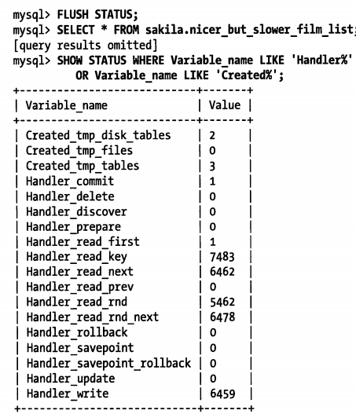
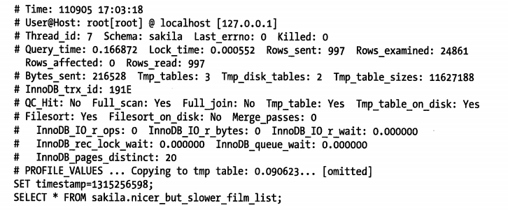

# 剖析 MySQL 查询

对查询性能剖析有两种方式，都有其优缺点。本章会详细介绍

可以剖析整个数据库服务器，这样可以分析出那些查询是主要的压力来源（如果已经在最上面的应用层做过剖析，则可能已经知道哪些查询需要特别留意）。定位到具体需要优化的查询后，也可以钻取下去对这些查询进行单独的剖析，分析哪些子任务是响应时间的主要消耗者。

## 剖析服务器负载

服务器端的剖析很有价值，因为在服务器端可以有效的审计效率低下的查询。定位和优化「坏」查询能够显著提升应用性能，也能解决某些特定的难题。

MySQL 的每一个新版本中都增加了更多的可测量点。如果当前的趋势可靠的话，那么在性能方便比较重要的测量需求很快能够在全球范围内得到支持。但如果只是需要剖析并找出代价高的查询，就不需要如此的复杂。通过慢查询日志就能够解决我们的问题。

### 捕获 MySQL 的查询到日志文件中

在 MySQL 5.1 之前慢查询日志只是捕获比较「慢」的查询，且响应时间的单位是秒，而性能剖析却需要针对所有的查询。现在可以通过 `long_query_time = 0` 来捕获所有的查询。而且查询的响应时间已经精确到微秒级。

在 MySQL 的当前版本中，**慢查询日志是开销最低、精度最高的测量查询时间的工具**。经过基准测试，I/O 密集型场景带来的开销可以忽略笔记，CPU 密集型场景的影响稍微大一点。更需要担心的是日志可能消耗大量的磁盘空间。

MySQL 还有另外一种查询日志，被称为 **通用日志**，但很少用于分析和剖析服务器性能。通用日志在查询请求到服务器时进行记录，所以不包含响应时间和执行计划等重要信息。MySQL 5.1 之后支持将日志记录到数据库的表中，但是不建议这样做，对性能有较大的影响

慢查询日志还可以通过全局修改 `long_query_time` 的阀值，使下一次到达服务器的查询立即生效。

总的来说，慢查询日志是一种轻量而且功能全面的性能剖析工具，是优化服务器查询的利器。

有时候因为某些原因如权限不足等，无法在服务器上记录查询，可以通过下面的方式来弥补：

- 可以通过 `pt-query-digest` 使用 `--processlist` 选项不断查看 `SHOW FULL PROCESSLIST` 的输出，记录查询第一次出现的时间和消失的时间。某些情况下这样的精度也足够发现问题，但缺无法捕获所有的查询（有些查询可能很快就完成了）。

- 通过 抓取 TCP 网络包

  然后根据 MySQL 的客户端/服务器通信协议进行解析。可以通过 tcpdump 将网络包数据保存到磁盘，然后使用 `pt-query-digest` 的 `--type=tcpdump` 选项来解析并分析查询。

  此方法精度比较高，并且可以捕获素有查询。还可以解析更高级的协议特性，比如可以解析二进制协议，从而创建并执行服务端预解析的语句（prepared statement）及压缩协议。

- 通过 MySQL Proxy 代理层的脚本来记录所有查询，但在实践中很少这样做

### 分析查询日志

强烈建议大家从现在起就利用慢查询日志捕获服务器上的所有查询，并且进行分析。可以在一些典型的时间窗口，如业务高峰期的一个小时记录查询。如果业务趋势比较均衡，那么一分钟甚至更短的施加内捕获需要优化的低效率查询也是可行的。

**不要直接打开整个慢查询日志进行分析**，这样做只会浪费时间和金钱。首先应该生成一个剖析报告，如果需要，可以查看日志中需要特别关注的部分。自顶向下是比较好的方式，否则有可能像前面提到的，反而导致业务的逆优化。

从慢查询日志中生成剖析报告需要一款好工具，这里推荐 `pt-query-digest` ，该工具功能强大，包括可以将查询报告保存到数据中，以及追踪工作负载随时间的变化。

一般情况，只需要将慢查询日志作为参数传递给 `pt-query-digest`，就可以输出详细的报告，更多用法还是需要参考官网使用文档。下面展示一个报告示例


- query id：

  对查询语句计算出的哈希值，计算时去掉了查询条件中的文本值和所有空格，并且全部转为小写字母，注意第 3 条和第 4 条，看起来一样，但 hash 不一样。

- 表名也有类似的做法

  如 InvitesNew? 这个问号就意味着这是一个分片（shard） 的表，这样就可以将同一组分片表作为一个整体做汇总统计。

- V/M：方差均值比（variane-to-mean ratio）

  方差均值比也就是常说的离差指数（index of dispersion）。**离差指数高的查询**对应的执行时间的变化较大，而这类查询 **通常都值的去优化**。如果`pt-query-digest` 指定了 `--explain` 选项，输出结果中会增加一列简要描述查询的执行计划，执行计划是查询背后的「极客代码」。通过联合观察执行计划列和 V/M 列，可以更容易识别出性能低下需要优化的查询。

- 最后尾部有一行输出

  显示了其他 17 个占比较低而不值的单独显示的查询的统计数据。可以通过 `--limit` 和 `--outliers` 选项指定工具显示更多查询的详细信息。默认只会打印消耗前 10 的查询，或则执行时间超过 1 秒阀值很多倍的查询，这两个值都是可配置的。

剖析报告的后面包含了每种查询的详细报告。可以通过查询的 ID 或则排名来匹配前面的剖析统计和查询的详细报告。下面是排名第一（也是最差）的查询详细报告


-   **顶部包含了一些元数据**

  包括查询执行的频率、平均并发度、该查询性能最差的一次执行在日志文件中的字节偏移量

- 接下来的统计信息，诸如标准差一类的信息

  如说明执行这个语句平均耗费了 144 毫秒

- 接下来是 **响应时间** 的直方图

  可以用看到上面这个查询在 query_time distribution 部分的直方图上有两个明显的高峰，大部分情况下执行都需要几百毫秒，但是在快三个数量级的部分也有一个明显的峰值，几百微秒就能执行完成。

  可能的原因是因为查询条件传递了不同的值，而这些值得分布很不均衡，导致服务器选择了不同的索引。有可能是由于查询缓存命中等。在实际系统中，这种有两个尖峰的直方图情况很少见，尤其是对于简单的查询，查询越简单执行计划页越稳定。

- 最后部分

  是方便复制、粘贴到终端去检查表的模式和状态的语句，以及完整的可用于 EXPLAIN 分析执行计划的语句。

确定需要优化的查询后，可以利用这个报告迅速检查查询的执行情况。这个工具强烈建议大家都能熟练使用它。MySQL 本身在未来或许也会有更多复杂的测量点和剖析工具。但在本书写作时，通过慢查询日志记录查询或则使用 `pt-query-digest` 分析 tcpdump 的结果，是可以找到的最好的两种方式

## 剖析单条查询

在定位到需要优化的单条查询后，可以针对此查询钻取更多的信息，确认为什么会花费这么长的时间执行，以及需要如何去优化、

关于如何优化，在后续章节讨论，在这之前需要介绍一些相关的背景知识。本章的主要目的是介绍如何方便的测量查询执行的各部分花费了多少时间，**有了这些数据才能决定采用何种优化技术**。

不幸的是，MySQL 目前大多数的测量点对于剖析查询都没有什么帮助。在本书写作之际，大多数生产环境的服务器还没有使用包含最新剖析特性的版本。所以在实际应用中，除了 `SHOW STATUS`、`SHOW PROFILE` 、检查慢查询日志的条目（官网的 MySQL 慢查询日志缺乏了很多附加信息，Percona Server 则优化了这点），之外就没有更好的办法了。下面演示如何使用这三种方法来剖析单条查询

### 使用 `SHOW PROFILE`

P引入的，来源于开源社区的Jeremy Cole 的贡献，他是一个剖析工具，默认是禁用的，可以通过服务器变量在会话级别动态修改

```sql
mysql> SET profiling=1;
```

打开后，在服务器上执行的所有语句，都会测量其耗费的时间和其他一些查询执行状态变更相关的数据。该功能有一定的作用，而且最初设计功能更强大，但未来版本中可能会被 Performance Schema 所取代。尽管如此，该工具最有用的作用还是在语句执行期间剖析服务器的具体工作。

当一条查询提交给服务器时，此工具会记录剖析信息到一张临时表，并且给查询赋予一个从 1 开始的整数标识符。下面是对 Sakila 样本数据库的一个视图的剖析结果（部分结果，Sakila 数据库可以从 MySQL 网站上下载）


该查询返回了 997 条记录。花费 0.17 秒，下面看下 SHOW PROFILES 有什么结果

```sql
SHOW PROFILES
```


可以看到以很高精度显示了查询的响应时间。MySQl 客户端显示的时间只有两位小数，对于一些执行得很快的查询，2 位小数的精度是不够的。

```sql
SHOW PROFILE FOR QUERY 1;
```


剖析报告给出了 **查询执行的每个步骤及其花费的时间**，看结果很难快速的确定哪个步骤花费的时间最多。因为输出是 **按照执行顺序排序**，不幸的是，无法通过 order by 之类的命令重新排序。如果不使用  `SHOW profile` 命令，而是直接查询 `INFORMATION_SCHEMA` 中对应的表，则可以按照需要格式化输出：

```sql
SET @query_id = 1;
SELECT
	STATE,
	SUM( DURATION ) AS Total_R,
	ROUND( 100 * SUM( DURATION ) / ( SELECT SUM( DURATION ) FROM information_schema.PROFILING WHERE QUERY_ID = @query_id ), 2 ) AS Pct_R,
	SUM( DURATION ) / COUNT(*) AS "R/Call" 
FROM
	information_schema.PROFILING 
WHERE
	QUERY_ID = @query_id 
GROUP BY
	STATE 
ORDER BY
	Total_R DESC
	
-- information_schema.PROFILING 中的每一条记录都是一个步骤的记录，也就是说一个查询 id 在此表中对应了很多条数据
-- 上述功能就是在统计这些数据，并按顺序排列
```


效果好很多了，通过这个结果可以很容易看到查询时间太长主要原因是因为花了一大半的时间在将数据复制到临时表这一步。那么优化就要考虑如何改写查询以避免使用临时表，或则提升临时表的使用效率。

第二个消耗时间最多的是 「发送数据包 Sending data」，这个状态代表的原因非常多，可能是各种不同的服务器活动，包括在关联时搜索匹配的行记录等，这部分很难说能优化节省多少消耗的时间。

另外也要注意到「结果排序 Sorting result」花费的时间占比非常低，所以这部分是不值的去优化的。这是一个比较典型的问题，所以一般我们都不建议用户在 「优化排序缓冲区 tuning sort buffer」或则类似的活动上花费时间。

**尽管剖析报告能帮助我们定位到哪些活动花费了最多的时间，但并不会告诉我们为什么会这样**。要弄清楚为什么复制数据到临时表要花费这么多时间，就需要深入下去，继续剖析这一步的子任务。

### 使用 `SHOW STATUS`

MySQL 的 `SHOW STATUS` 命令返回了一些计数器。既有服务器级别的全局计数器，也有基于某个连接的会话级别的计数器。例如其中的 `Queries` 在会话开始时为 0 （该定义可能不准确，貌似是全局的），每提交一条查询增加 1。 如果执行 `SHOW GLOBAL STATUS`  则可以查看服务器级别的从服务器启动时开始计算的查询次数统计。

不同计数器的可见范围不一样，不过全局的计数器也会出现在 `SHOW STATUS`。一定要注意这个，因为如果打算优化某些特定观察到的东西，错误的测量范围将会导致结论的错误。MySQL 官方手册中对所有的变量是会话级还是全局级做了详细的说明。

`SHOW STATUS` 是一个有用的工具，但不是一款剖析工具，大部分结果都只是一个计数器，可以显示某些活动如 **读索引的频繁程度**，但无法给出消耗了多少时间。其中有一条指的是操作的时间 `Innodb_row_lock_time` ，不过是全局级的，所以还是无法测量会话级的工作。

尽管 `SHOW STATUS` 无法提供基于时间的统计，但对于在执行完查询后观察某些计数器的值是有帮助的。有时候可以猜测哪些操作代价较高或则消耗的时间较多。最有用的计数器包括 **句柄计数器（handler counter）**、**临时文件** 和 **表计数器** 等。

下面例子演示了，如何将会话级的计数器重置为 0，然后查询前面一章提到的视图，再检查计划的结果：

```sql
FLUSH STATUS;
..本机没有这个数据库，下面截图替代
SHOW STATUS WHERE VARIABLE_NAME LIKE 'Handler%' OR VARIABLE_NAME LIKE 'Created%';
```



从结果可以看到该查询使用了三个临时表，其中两个是磁盘临时表，并且有很多的没有用到索引的读操作（handler_read_rnd_next）。假设我们不知道这个视图的具体定义，仅从结果来推测，这个查询有可能是做了多表关联查询，并且没有合适的索引，可能是其中一个子查询创建了临时表，然后和其他表做联合查询。而用于子查询结果的临时表没有索引，如此大致可以解释这一的结果。

使用这个技术的时候，要注意 `SHOW STATUS` 本身也会创建一个临时表，而且也会通过句柄操作访问此临时表。

你可能会注意到通过 `EXPLAIN` 查看查询的执行计划也可以获得大部分相同的信息，但是 `EXPLAIN` 时通过估计得到的结果，而通过计数器则是实际的测量结果。例如： `EXPLAIN`  无法告诉你临时表是否是磁盘表，这和内存临时表的性能差别是很大的。附录 D 包含更多关于 `EXPLAIN`  的内容

### 使用慢查询日志

Percona Server 为 MySQL 数据库服务器进行了改进，在功能和性能上较 MySQL 有着很显著的提升。该版本提升了在高负载情况下的 InnoDB 的性能、为 DBA 提供一些非常有用的性能诊断工具；另外有更多的参数和命令来控制服务器行为。

针对上面这样的查询语句，Percona Server 对慢查询日志做了哪些改进？下面是使用 `SHOW PROFILE` 一节演示过的相同的查询执行后抓取到的结果



从这里看到查询确实一共创建了三个临时表，其中两个是临时表。而`SHOW PROFILE` 则隐藏了这些信息。

另外也可以看到，慢查询日志中详细记录了条目包含了 `SHOW PROFILE` 和 `SHOW STATUS` 所有的输出，并且还有更多的信息。所以通过 `pt-query-digest` 发现坏查询后，在慢查询日志中可以获得足够有用的信息。查看 `pt-query-digest` 的报告时，其标题部分一般会有如下输出：


可以通过这里的字节偏移值（3214）直接跳转到日志的对应部分，例如使用如下的命令

```sql
tail -c +3214 /path/to/query.log | head -n100
```

这样就可以直接跳转到细节部分了，另外 `pt-query-digest`  能够处理Percona Server 在慢查询日志中增加的所有键值对，并且会自动在报告中打印更多的细节信息。

### 使用 Performance Schema

在本书写作时间，MySQL 5.5 中新增的 Performance Schema 表还不支持查询级别的剖析信息。 在未来版本中会包含更多的功能。尽管如此，已经包含了很多有趣的信息。例如，下面的查询显示了系统中等待的主要原因：

```sql
SELECT
	EVENT_NAME,
	COUNT_STAR,
	SUM_TIMER_WAIT 
FROM
	events_waits_summary_global_by_event_name 
ORDER BY
	SUM_TIMER_WAIT DESC 
	LIMIT 5;
```


目前还有一些限制，使得 Performance Schema 还无法当做一个通用的剖析工具。比如，他还无法提供查询执行阶段的细节信息和即使信息。相信这些问题都会很快被修复的。

最后，对大多数用户来说，直接通过 Performance Schema  的裸数据获得有用的结果相对来说过于复杂和底层。到目前为止实现的这个特性，主要是为了测量当为提升服务器性能而修改 MySQL 源码时使用，包括等待和互斥锁。

### 小结

- `SHOW PROFILE`  命令用于跟踪执行过的 sql 语句的资源消耗信息，可以帮助查看 sql 语句的执行情况，可以在做性能分析或者问题诊断的时候作为参考。

  如果为开启，可通过 `SET profiling=1;` 可开启

  `SHOW PROFILE`： 可以显示最近执行查询语句的耗时信息，

  `SHOW PROFILE FOR QUERY 1;`  ：1 为 query_id ，显示查询执行的每个步骤及其花费的时间

  遗憾的是无法通过排序语法来让耗时的步骤显示在前面。可以查询  `information_schema.PROFILING` 视图获得一样的信息

  ```sql
  SET @query_id = 1;
  SELECT
  	STATE,
  	SUM( DURATION ) AS Total_R,
  	ROUND( 100 * SUM( DURATION ) / ( SELECT SUM( DURATION ) FROM information_schema.PROFILING WHERE QUERY_ID = @query_id ), 2 ) AS Pct_R,
  	SUM( DURATION ) / COUNT(*) AS "R/Call" 
  FROM
  	information_schema.PROFILING 
  WHERE
  	QUERY_ID = @query_id 
  GROUP BY
  	STATE 
  ORDER BY
  	Total_R DESC
  	
  -- information_schema.PROFILING 中的每一条记录都是一个步骤的记录，也就是说一个查询 id 在此表中对应了很多条数据
  -- 上述功能就是在统计这些数据，并按顺序排列
  ```

  

-  `SHOW STATUS`：

   显示了一些计数器，这些计数器部分是会话级的计数器，还有部分是全局级的。

   如果执行 `SHOW GLOBAL STATUS`  则可以查看服务器级别的从服务器启动时开始计算的查询次数统计。

   最有用的计数器包括 **句柄计数器（handler counter）**、**临时文件** 和 **表计数器** 等。

## 使用性能剖析

当的服务器或则查询的剖析报告后，怎么使用？好的剖析报告能够将潜在的问题显示出来，单最终的解决方案还需要用户来决定（尽管报告可能会给出建议）。优化查询时间，用户需要对服务器如何执行查询有较深的了解。剖析报告能够尽可能的多收集需要的信息、给出诊断问题的正确方向，以及为其他诸如 EXPLAIN 等工具提供基础信息。这里只是先引出话题，后续章节将继续讨论。

尽管一个拥有完整测量信息的剖析报告可以让事情变得简单，但现有系统通常都没有完美的测量支持。

从前面的例子来说，我们虽然推断出是临时表和没有索引的读导致查询的响应时间过长，单却没有明确的证据。因为无法测量所有需要的信息，或则测量的范围不正确，有些问题就很难解决。例如，可能没有集中在需要优化的地方测量，而是测量了服务器层面的活动；或则测量的是查询开始之前的计数器，而不是查询开始后的数据。

也有其他的可能性。设想一下正在分析慢查询日志，发现了一个很简单的查询正常情况下都非常快，却有几次非常不合理的执行了很长时间。手工重新执行一遍，发现也非常快，然后使用 EXPLAIN 查询其执行计划，也正确的使用了所有，然后尝试修改 WHERE 条件中使用不同的值，以排除缓存命中的可能，也没有发现有什么问题，这可能是什么原因呢？

如果使用官方版本的 MySQL，慢查询日志中没有执行计划或则详细的时间信息，对于偶尔记录到的这几次查询异常慢的问题，很难知道其原因在哪里，因为信息有限。可能是系统中有其他东西消耗了资源，比如在在备份，也可能是某种类型的锁或争用阻塞了查询的进度。这种间歇性的问题将在下一节讨论。

## 总结

剖析一个 MySQL 查询步骤：获取到慢查询日志，分析日志获取耗时排名前 10 的查询，然后选择要优化的单条查询，进行具体的分析。 