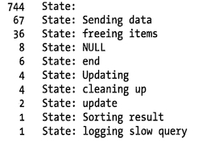

# 诊断间歇性问题

间歇性的问题比如系统偶尔停顿或慢查询，很难诊断。有些幻影问题只在没有注意到的时候才发生，而且无法确认如何重现，诊断这样的问题往往要花费很多时间。在这个过程中，有些人会尝试不断是错的方式来诊断，有时候甚至想要通过随机改变一些服务器的设置来侥幸找到问题。

尽量不要使用试错的方式来解决问题。这种方式有很大的风险，因为结果可能变得更坏，这也是中令人沮丧且低效的方式。如果一时无法定位问题，可能是测量方式不正确，或则测量的点选择有误，或则使用的工具不合适。

为了演示为什么要尽量避免试错的诊断方式，下面列举了我们认为已经解决的一些间歇性数据库性能问题的实际案例:

- 应用通过  curl 从一个运行得很慢的外部服务来获取汇率报价的数据
- memcached 缓存中的一些重要条目过期，导致大量请求落到 MySQL 以重新生成缓存条目
- DNS 查询偶尔会有超时的现象。
- 可能是由于互斥锁争用，或则内部删除查询缓存的算法效率太低的缘故，MySQL 的查询缓存有时候回导致服务有短暂的停顿
- 当并发超过某个阀值时，InnoDB 的扩展性限制导致查询计划额优化需要很长的时间

从上面可以看到，有些问题确实是数据库的原因，也有些不是。只有在问题发生的地方通过观察资源的使用情况，并尽可能的测量出数据，才能避免在没有问题的地方耗费精力。

下面给出我们解决间歇性问题的方法和工具，这才是王道，而不是去试错。

## 单条查询问题还是服务器问题

如果服务器上所有的程序都突然变慢，又突然变好，每一条查询也都变慢了，那么慢查询可能就不一定是原因，而是由于其他问题导致的结果。反过来说，如服务器整体运行都没有问题，只有某条查询偶尔变慢，就需要将注意力放到这条特定的查询上面。

那么如何判断是单条查询还是服务器问题呢？如果问题不停的周期性出现，那么可以在某次活动中观察到；或则整夜运行脚本收集数据，第二天来分析结果。大多数情况下可以通过下面三种技术来解决。

### 使用 `SHOW GLOBAL STATUS`

该方法以较高的频率（如一秒一次）运行 `SHOW GLOBAL STATUS` 命令不活数据，问题出现时间，则可以通过某些计数器，比如 

- `Threads_runing`
- `Threads_connected`
- `Questions`
- `Queries`

的「尖刺」或「凹陷」来发现。

该方法比较简单，所有人都可以使用（不需要特殊的权限），对服务器的影响也很小，所以是一个花费时间不多却能很好的了解问题的号方法。

```bash
$ mysqladmin ext -i1 | awk '
 /Queries/{q=$4-qp;qp=$4}
 /Threads_connected/{tc=$4}
 /Threads_running/{printf "%5d %5d %5d\n",q,tc,$4}'
```


输出每秒的查询数，Threads_connected 和 Threads_runing s表示当前正在执行查询的线程数。这三个数据的趋势对于服务器级偶尔停顿的敏感性很高。一般发生此类问题时，根据原因的不同和应用连接数据库方式的不同，每秒的查询数一般会下跌，而其他两个则至少有一个会出现尖刺。在这样例子了，应用使用了连接池，所以 Threads_connected 没有变化。但正在执行查询的线程数明显上升，同时每秒的查询数相比正常数据有严重的下跌

如何解析这个现象呢？凭猜测有一定的风险，但在实践中有两个原因的可能性比较大。

- 服务器内部碰到了某种瓶颈，导致新查询在开始执行前因为需要获取老查询正在等待的锁而造成的堆积。这一类的锁一般也会对应用服务器造成后端压力，使得应用服务器也出现排队问题。
- 服务区突然遇到了大量查询请求的冲击，比如前段额 memcached 突然失效导致的查询风暴

可以将该命令运行几个小时或则几天，然后将结果绘制成图形，方便发现是否有趋势的突变。如果问题确实是间歇性的，发生的频率又较低，也可以根据需要尽可能延长时间的运行此命令，直到发现问题再回头来看输出结果。大多数情况下，通过输出结果都可以更明确定位问题

### mysqladmin 的使用

```bash
mysqladmin [option] command [command option] command ......

-c number 自动运行次数统计，必须和 -i 一起使用
-i number 间隔多长时间重复执行
每个两秒查看一次服务器的状态，总共重复5次。
./mysqladmin -uroot -p -i 2 -c 5 status
-h, --host=name Connect to host. 连接的主机名或iP
-p, --password[=name] 登录密码，如果不写于参数后，则会提示输入
-P, --port=# Port number to use for connection. 指定数据库端口
-s, --silent Silently exit if one can't connect to server.
-S, --socket=name Socket file to use for connection. 指定socket file
-i, --sleep=# Execute commands again and again with a sleep between. 间隔一段时间执行一次
-u, --user=name User for login if not current user.登录数据库用户名
-v, --verbose Write more information. 写更多的信息
-V, --version Output version information and exit. 显示版本

相关命令
mysqladmin password dadong123                  #<==设置密码，前文用过的。
mysqladmin -uroot -pdadong123 password dadong  #<==修改密码，前文用过的。
mysqladmin -uroot -pdadong123 status           #<==查看状态，相当于show status。
mysqladmin -uroot -pdadong123 -i 1 status      #<==每秒查看一次状态。
mysqladmin -uroot -pdadong123 extended-status   #<==等同show global status;。
mysqladmin -uroot -pdadong123 flush-logs        #<==切割日志。
mysqladmin -uroot -pdadong123 processlist       #<==查看执行的SQL语句信息。
mysqladmin -uroot -pdadong123 processlist -i 1  #<==每秒查看一次执行的SQL语句。
mysqladmin -uroot -p'dadong' shutdown           #<==关闭mysql服务，前文用过的。
mysqladmin -uroot -p'dadong' variables          #<==相当于show variables。
```

### 使用 `SHOW PROCESSLIST`

同样是不停的捕获命令的输出，来观察是否有大量线程出于不正常的状态或则有其他不正常的特征。例如查询很少会长时间处于「statistic」状态，该状态一般是指服务器在查询优化阶段如何确定表关联的顺序，通常都是非常快的。另外，也很少会见到大量线程报告当前连接用户是「未经验证的用户（Unauthenticated user）」，这只是在连接握手的中间过程中的状态，当客户端等待输入用于登录的用户信息的时候才会出现。

在命令尾部加上 `\G` 可以垂直的方式输出，每一行记录的每一列都单独输出为一行，这样可以方便的使用 `sort/uniq/sort` 一类的命令来计算某个列值出现的次数

```bash
$ mysql -e 'SHOW PROCESSLIST\G' | grep State: | sore | uniq -c | sort -rn
```



在大多数安宁里中，State 列都非常有用。从这个列子的输出中可以看到，有很多线程出于查询执行的结束部分状态，包括 `freeing items`、`end`、`cleaning up`、`logging slow query` 。 事实上，在案例中的这台服务器上，同样模式或类似输出采样出现了很多次，大量的线程出于 `freeing items` s状态是出现了大量有问题查询的很明显的特征和指示。

用这种技术查找问题，上面的命令行不是唯一的办法。如果 MySQL 服务器版本较新，也可以直接查询 INFORMATTION_SCHEMA 中的 PROCESSLIST 表。或则使用 innotop 工具以较高的频率刷新，以观察屏幕上出现的不正常查询堆积。

上面演示这个例子是由于 InnoDB 内部的争用和脏块刷新所导致，但有时候原因可能比这个要简单得多。一个讲点的例子是很多查询处于 Locked 状态，这是 MyISAM 的一个典型问题，它的表级锁定，在写请求较多时，可能迅速导致服务器级别的线程堆积。

### 使用查询日志

开启慢查询日志。如果不能设置慢查询日志记录所有的查询，也可以通过 tcpdump 和 pt-query-digest 工具来模拟替代。要注意找到吞吐量突然下降时间段的日志。查询时在完成阶段才写入到慢查询日志的，所以堆积会造成大量查询出于完成阶段，直到阻塞其他查询的资源占用者释放资源后，其他的查询才能执行完成。 这种行为特征的一个好处是，当遇到吞吐量如突然下降后完成的第一个查询（有时候也不一定是第一个查询。当某些查询被阻塞时，其他查询可以不受影响继续运行，所以不能完全依赖这个经验）

再重申一次，好的工具可以帮助诊断这类问题，否则要人工去几百 GB 的查询日志中找原因。下面的例子只有一行代码，却可以根据 MySQL 每秒将当前时间写入日志中的模式统计每秒的查询数量：

```bash
$ awk '/^# Time:/{print $3.$4.c;c=0}/……# User/{c++}' slow-query.log
080912 21:52:17 51
080912 21:52:18 29
080912 21:52:19 34
...
080912 21:52:24 96
080912 21:52:25 6
...

```

从上面的输出可以看到有吞吐量突然下降的情况发生，而且在下降前还有一个突然的高峰，仅从这个输出而不去查询当时的详细信息很难确定发生了什么，但应该可以说这个突然的高峰和随后的下降一定由关联。不管怎么说，这现象都很奇怪，值的去日志中挖掘该时间段的详细信息（实际上通过日志的详细信息，可以发现突然的高峰时段有很多链接被断开的现象，可能是有一台应用服务器重启导致的，所以不是所有的问题都是 MySQL 的问题）

### 理解发现的问题

笔者看到这里已经崩溃了，暂时不看着这章节的了。太崩溃了，百分之 80 的时间感觉在看天书。