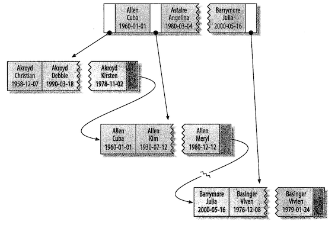

# 索引基础

如果你想在一本书中找到某个特定的主题，一般会先看书的「索引」，找到对应的页码。

在 MySQL 中，存储引擎用类似的方法使用索引，先在索引中找到对应值，然后根据匹配的索引记录找到对应的数据行。例如要运行下面的索引

```sql
select first_name from sakila.actor where actor_id = 5;
```

如果  actor_id 列上有索引，则使用该索引找到 actor_id 为 5 的行，然后再返回所有包含该值得数据行。

索引可以包含一个或多个列的值。如果包含多个列，那么 **列的顺序也十分重要**，因为 MySQL **只能高效使用索引的最左前缀的列**。创建一个包含两个列的索引，和创建两个只包含一列的所有是大不相同的，下面将详细介绍。

> [!TIP] 如果使用的是 ORM，是否还需要关心索引？
结论：需要。
因为 ORM 工具做不到很智能，即使是查询优化技术专家也很难兼顾到各种情况，就别说 ORM 工具了。


## 索引的类型

索引有很多种类型，可以为不同的场景提供更好的性能。在 MySQL 中，**索引是存储引擎层实现的**。所以，并没有统一的索引标准，即使多个存储引擎支持同一种类型的所有，其底层的实现也可能不同。

下面来看看 MySQL 支持的索引类型，以及他们的优缺点。

## B-Tree 索引

如果在讨论索引的时候，没有特别指明类型，那么多半说的是 B-Tree 索引，它使用 B-Tree 数据结构来存储数据（每一个叶子节点都包含指向下一个叶子节点的指针，从而方便叶子节点的范围遍历）。

大多数 MySQL 引擎都支持这种索引。Archive 引擎不支持，5.1 之前 archive 不支持任何索引，5.1+ 才开始支持单个自增列（AUTO_INCREMENT）的索引。

使用术语「B-Tree」是因为 MySQL 在 CREATE TABLE 和其他语句中也使用该关键字。不过，底层的存储引擎也可能使用不同的存储结构，例如 NDB 集群存储引擎内部实际上使用两天 T-Tree 结构存储这种索引，即使名字是 BTREE；**InnoDB 则使用的是「B+Tree」**，各种数据结构的算法和变种，不在本书讨论范围内。

**存储引擎已不同的方式使用 B-Tree 索引，性能也各有不同，各有优劣**。例如 MyISAM 使用前缀压缩技术使得索引更小，但 InnoDB 则按照原数据格式进行存储。再如 MyISAM 索引通过数据的物理位置引用被索引的行，而  **InnoDB 则根据主键索引应用被索引的行**。

**B-Tree 通常意味着所有的值都是按顺序存储的**，并且每一个叶子页到根的距离相同。下图展示了 B-Tree 索引的抽象表示，大致反映了 InnoDB 索引是如何工作的。MyISAM 使用的结构有所不同，但基本思想是类似的。


上图是 B-Tree 结构（从技术上来说是 B+Tree）上的索引

B-Tree 索引加快了访问数据的速度，不再全表扫描来获取需要的数据，而是从索引的根节点（图未画出）开始进行搜索。根节点存放了指向子节点的指针，存储引擎根据这些指针向下查找。通过比较节点页的值和要查找的值可以找到合适的指针进下层子节点，这些指针实际上定义了子节点页中值得上限和下限。最终存储引擎要么找到对应的值，要么该记录不存在。

叶子节点比较特别，他们的指针指向的是被索引的数据，而不是其他节点页（不同引擎的「指针」类型不同）。上图仅绘制了一个节点和对应的叶子节点，其实在根节点和叶子节点之间可能有很多层节点页。数的深度和表的大小直接相关。

**B-Tree** 对索引列是顺序组织存储的，所以很 **适合查找范围数据**。例如：在一个基于文本域的索引树上，按字母顺序传递连续的值进行查找是非常合适的，所以像「找出所有以 I 到 K 开头的名字」这样的查找效率会非常高。

假设有如下表数据

```sql
create table People(
	last_name varchar(50)	not null,
    first_name varchar(5)	not null,
    dob	date				not null,
    gender	enum('m','f')	not null,
    key(last_name,first_name,dob)
)
```

对于就的每一行数据，索引中包含了 `last_name,first_name,dob` 列的值。下图显示了该索引是如何组织数据的存储的。



索引对多个值进行排序的依据是  `create table` 语句中定义索引时列的顺序。看下最后两个条目，两个人的姓名都一样，则根据他们的出生日期来排列顺序的。

### 有效的查询类型

**B-Tree 索引适用于全键值、键值范围或键前缀查找（最左前缀）**。前面所述的索引对如下类型的查询有效：

- 全值匹配

  和索引中的的所有列进行匹配。例如前面提到的所有可用于查找姓名为 Cuba Allen、出生为 1960-01-01 的人

- 匹配最左前缀

  前面的例子可用于查询所有姓为 Allen 的人，即只使用索引的第一列

- 匹配列前缀

  也可以只匹配某一列的值的开头部分。例如前面的索引可以查找所有以 J 开头的姓的人。这里也只使用了索引的第一列。

- 匹配范围值

  例如前面的索引可用于查找姓在 Allen 和 Barrymore 之间的人。这里也只使用了索引的第一列

- 精确匹配某一列并范围匹配另外一列

  例如前面的索引可用于查找所有姓为 Allen，并且名字是字母 K 开头（比如 Kim、Karl 等）的让你。即第一列 last_name 全匹配，第二列 first_name 范围匹配

- 只访问索引的查询

  B-Tree 通常可以支持「只访问索引的查询」，即只访问索引数据，而不需要访问数据行。后续会继续讨论这种「覆盖索引」的优化。

因为索引树中的节点是有序的，除了按值查找之外，还可以用于查询中的 ORDER BY 操作（按顺序查找）。一般来说，**如果 B-Tree 可以按照某种方式查找到值，那么也可以按照这种方式用于排序**。所以，如果 ORDER BY 子句满足前面列出的几种查询类型，则这个所以也可以满足对应的排序需求。

### B-Tree 索引的限制

下面是一些关于 b-Tree 索引的限制：

- 如果不是按照索引的最左列开始查找，则无法使用索引

- 不能跳过索引中的列。

  也就是说，无法用于查找姓为 Smith 并且在某个特定日期出生的人。如果不指定名（first_name），则 MySQL 只能使用索引的第一列

- 如果查询中有某个列的范围查询，则其右边所有列都无法使用索引优化查找。

  例如：查询 `where last_name='Smith' and first_name like 'J%' and bob = '1970-12-23'`，这个查询只能使用索引的前两列，因为这里 Like 是一个范围条件（但是服务器可以把其余列用于其他目的）。如果范围查询列值得数量有限，那么可以通过使用多个等于条件来代替范围条件。


读到这里，你应该明白：**索引列的顺序很重要**，在优化的时候，可能需要使用相同的列单顺序不同的索引来满足不同类型的查询需求。

也有些限制不是 B-Tree 本身导致的，而是 MySQL 优化器和存储引擎使用索引的方式导致的，这部分限制在未来的版本中可能就不再是限制了

## 哈希索引

**hash index 基于哈希表实现**，只有 **精确匹配索引所有列** 的查询才有效。对于每一行数据，存储引擎都会对所有的索引列，计算一个哈希码（hash code），哈希码是一个较小的值，并且不同键值计算出来的哈希码也不一样。哈希索引将所有的哈希码存储在索引中，同时在哈希表中保存指向每个数据行的指针。

在 MySQL 中，只有 Memory 引擎显示支持哈希索引（也是默认的），同时还支持 B-Tree 索引。

下面是一个例子：

```sql
create table testhash (
	fname varchar(50) not null,
    lname varchar(50) not null,
    key using hash(fname)
) engine=memory;
```

表中包含如下数据

```sql
select * from testhash;
fname	|	lname
Arjen	|	Lentz
Baron	|	Schwartz
Peter	|	Zaitsev
Vadim	|	Tkachenko

假设引用的哈希函数是 f()，它返回的值是下面这样（假数据哈，非真实的）

f('Arjen')=2323
f('Baron')=7437
f('Peter')=8784
f('Vadim')=2458
```

则哈希索引的数据结构如下

| 槽（Slot） |    值（Value）    |
| :--------: | :---------------: |
|    2323    | 指向第 1 行的指针 |
|    2458    | 指向第 4 行的指针 |
|    7437    | 指向第 2 行的指针 |
|    8784    | 指向第 3 行的指针 |

注意：槽的编号是顺序的，而数据行不是。现在看如下的查询

```sql
select lname from testhash where fname='Peter'
```

MySQL 先计算 peter 的哈希值，并找到 8784 这个槽，获得数据行的索引，最后一步是比较第三行的值是否为 「Peter」。为什么有比较？因为有哈希碰撞，**Memory 引擎是支持非唯一哈希索引的**，如果哈希值相同，索引会以链表的方式存放多个记录指针到同一个哈希条目中。

因为索引自身只需要存储对应的哈希值，所以索引的结构十分紧凑，这也让哈希索引查找的速度非常快。

### 哈希索引的限制

- **不能使用索引中的值来避免读取行**

  哈希索引只包含哈希值和行指针，而不存储字段值，不过，访问内存中的行的速度很快，所以大部分情况下这点对性能的影响并不明显

- **无法用于排序**

  哈希索引数据并不是按照索引值的顺序存储的，所以也无法用于排序。

- **哈希索引页不支持部分索引列匹配查找**

  因为哈希索引始终是使用索引列的全部内容来计算哈希值得。例如：在数据列 `(a,b)` 上建立哈希索引，如果只查询数据列 A，则无法使用该索引

- **哈希索引只支持等值比较查询**，**不支持任何范围查询**

  包括 `=、in()、<=>` （注意 `<>` 和 `<=>` 是不同的操作），也 不支持任何范围查询，比如 `where price > 100`

- 访问哈希索引的数据非常快，除非有很多哈希冲突

  不同的索引列值却有相同的哈希值，这是哈希冲突。当出现冲突时，存储引擎必须遍历链表中所有的行指针，逐行进行比较，直到找到所有符合条件的行。

- 如果哈希冲突很多的话，一些索引维护操作的代价也很高

  例如：如果在某个选择性很低（哈希冲突很多）的列上建立哈希索引，那么当从表中删除一行时，存储引擎需要遍历对应哈希值的链表中的每一行，找到并删除对应行的引用，冲突越多，代价越大。

因为这些限制，哈希索引只适用于某些特定的场合。而一旦适合哈希索引，则它带来的性能提升将非常显著。举个例子：在数据仓库应用中有一种经典的「星型」 schema，需要关联很多查找表，哈希索引就非常适合查找表的需求。

除了 Memory 引擎外，NDB 集群引擎也支持唯一哈希索引，且在 NDB 集群引擎中作用非常特殊，这不属于本书的范围。

### 自适应哈希索引

InnoDB 引擎有一个特殊的功能叫「自适应哈希索引（adaptive hash index）」，**当某些索引值被使用得非常频繁时，它会在内存中基于 B-Tree 索引之上再创建一个哈希索引**，这样就让 B-Tree 索引页具有哈希索引的一些优点，比如快速的哈希查找。这是一个完全自动的、内部的行为行为，用户无法控制或则配置，不过如果有必要，完全可以关闭该功能。

### 创建自定义哈希索引

如果存储引擎不支持哈希索引，则可以模拟像 InnoDB 一样创建哈希索引，这可以享受一些哈希索引的便利，例如只需要很小的索引就可以为超长的键创建索引  。

思路：**在 B-Tree 基础上创建一个伪哈希索引**。它使用哈希值而不是键本身进行索引查找。你需要做的就是在查询的 WHERE 子句中手动指定使用哈希函数。

下面是一个示例：需要存储大量的 URL，并需要根据 URL 进行搜索查找。如果使用 B-Tree 来存储 URL，存储的内容就会很大，因为 URL 本身都很长。正常情况下会有如下查询

```sql
select id from url where url = "http://www.mysql.com";
```

若删除原来 URL 列上的索引，而新增一个被索引的 `url_crc` ，使用 CRC32 做哈希，就可以使用下面的方式查询：

```sql
select id from url where url="http://www.mysql.com" and url_crc=CRC32("http://www.mysql.com");
```

这样做的性能会非常高，因为 MySQL 优化器会使用这个选择性很高而体积很小的基于 url_crc 列的索引来完成查找（在上面的案例中，索引值为 1560514994）。 即使有多个记录相同的索引值，查找任然很快，只需要根据哈希值做快速的整数比较就能找到索引条目，然后一一比较返回对应的行。另一种方式就是对完整的 URL 字符串做索引，不过该方法会非常慢。

**这样实现的缺陷是需要维护哈希值**。可以手动维护，也可以使用触发器实现。下面的哪里演示了触发器如何在插入和更新时维护 url_crc 列。

```sql
-- 创建表
create table pseudohash(
	id int unsigned not null auto_increment,
    url varchar(255) not null,
    url_crc int unsigned not null default 0,
    primaruy key(id)
);

-- 创建触发器
-- 临时修改语句分隔符，这样就可以在触发器定义中使用分好「:」
delimiter //

create trigger pseudohash_crc_ins before insert on pseduohash for each row begin
	set new.url_crc=crc32(new.url)
end;
//

create trigger pseudohash_crc_upd befor update on pseudohash for each row begin
	set new.url_crc=crc32(new.url)
end;
//

delimiter ;
```

如果采用这种方式，不要使用 `sha1()` 和 `md5()` 作为哈希函数。因为他们产生的值很长，会浪费大量空间，比较时也会更慢。sha1 和 md5 的设计目标是最大限度消除冲突，但在这里并不需要这样高的要求。简单哈希的冲突在一个可以接受的范围，同时又能够提供更好的性能。 

**如果数据表非常大，`crc32()` 会出现大量的哈希冲突**，可以考虑自己实现一个简单的 64 位的哈希函数。需要返回整数，而不是字符串。一个简单的办法是使用 `md5 ()` 函数返回值的一部分。如下这样

```sql
select conv(right(md5('http://www.mysql.com/'),16),16,10) as hash64;
-- 值为 9761173720318281581
```

处理哈希冲突，在查询时必须在 where 子句中包含常量值，这个前面已经说过了

```sql
select id from url where url="http://www.mysql.com" -- 这个条件必须存在，否则是无法正确工作的
and url_crc=CRC32("http://www.mysql.com");
```

如果不包含常量值，当冲突时，会返回符合该 hash 值的多条记录。

有一个 `fnv64()` 函数，从 Percona Server 的函数移植的，可以以插件方式在任何 MySQL 版本中使用，哈希值为 64 位（不是数值有 64 个，差不多是 20 位数字），速度快，冲突比 crc32 少很多

## 空间数据索引（R-Tree）

MyISAM 表支持空间索引，可以用作地理数据存储。和 B-Tree 索引不同，这类索引无需前缀查询。**空间索引会从所有维度来索引数据**。查询时，可以有效的使用任意维度来组合查询。比如使用 MySQL 的 GIS 相关函数如 `MBRCONTAINS()` 等来维护数据。

MySQL 的 GIS 支持不完善，所以大部分人都不会使用该特性。

## 全文索引

是一种特殊类型的索引，它 **查找的是文本中的关键词**，而不是直接比较索引中的值。

它和其他几类索引的匹配方式完全不一样。有许多需要注意的细节，如停用词、词干和复数、布尔搜索等。更类似于搜索引擎做的事情，而不是简单的 where 条件匹配。

**在相同的列上同时创建全文索引和基于值得 B-Tree 索引不会有冲突**，全文索引适用于 match against 操作，而不是普通的 where 条件操作。

## 其他索引类别

还有很多第三方的存储引擎使用不同类型的数据结构来存储索引。例如 TokuDb 使用分形树索引（fractal tree index），这是一类较新开发的数据结构，既有 B-Tree 的很多优点，也避免了 B-Tree 的一些缺点。

