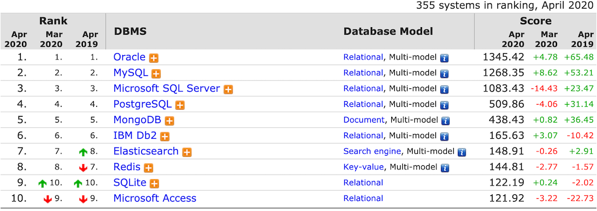

# 技术选型之数据库选型

技术选型，带大家从一开始就高起点，赢在起跑线上。本章主要内容就是来比较一下常见的两种数据存储系统关系型数据库和非关系型数据库的主要特点，以及他们各自适用的场景，让我们在做出选择时不再迷茫。

## SQL VS NOSQL

数据的操作方式来看

- SQL：通常是事务性数据库，且使用 SQL 操作数据
  - MySQL
  - Oracle
  - SQLServer
  - PostGreSQL
- NO SQL：通常是非关系型数据库，不是用 SQL 操作数据
  - HBase
  - MongoDB
  - Redis
  - Hadoop

## 关系型数据库的特点

- 数据结构化存储在二维表中

  | 姓名 | 姓名 | 生日       |
  | ---- | ---- | ---------- |
  | 张三 | 男   | 1980-01-28 |
  | 李四 | 男   | 1991-02-03 |

  随着数据库的发展，也支持将 JSON 这种非结构化的存储在表中（仅限使用 JSON 类型的列）

- 支持事物的 ACID 特性

  - A：原子性
  - C：一致性
  - I：隔离性
  - D：持久性

- 支持使用 SQL 语言对存储在其中的数据进行操作

## 关系数据库的使用场景

- 数据之间存在一定关系，需要关联查询数据的场景

  如：一个订单，有多个商品

- 需要事物支持的业务场景

  如：电商、金融类的场景

- 需要使用 SQL 语言灵活操作数据的场景

## 非关系数据库的特点

- 存储结构灵活，没有固定的结构

  ```json
  {"姓名":"张三","性别"："男"}
  {"姓名":"张三","性别"："男","生日":"2010-02-01"}
  ```

  比较灵活，可以随意新增字段

- 对事物的支持比较弱，但对数据的并发处理性能高

- 大多不使用 SQL 语言操作数据

## 非关系数据库的适用场景

- 数据库结构不固定的场景

  比如：某些产品有长宽属性，某些产品有颜色、味道等属性

- 对事物要求不高，但读写并发比较大的场景

  比如：日志监控类、用户行为分析类

- 对数据的处理操作比较简单的场景

  由于不支持 SQL 语言，在一定程度上没有 SQL 这么灵活查询，表关联等

## 关系数据库选型原则

- 数据库使用的广泛性

  当出现问题的时候，有足够多的资料支持，使用广泛，表示认可程度较高

- 数据库的可扩展性

  数据库性能一般决定了系统的性能，是否有足够的性能和可扩展性，尤为重要

- 数据库的安全性和稳定性

- 数据库所支持的系统

  能否支持我们服务器操作系统的版本，因为某些服务器系统是需要收费的

- 数据库的使用成本

  首先是软件的使用成本，是否收费？是否比较容易找到数据库运维人员和开发人员


###  MySQL 使用的广泛性

可通过 [榜单](https://db-engines.com/en/ranking) 来获取



### MySQL 可扩展性

- 支持基于二进制日志的逻辑复制
- 存在多种第三方数据库中间层，支持读写分离及分库分表

### MySQL安全性和稳定性

- MySQL 主从复制集群可达 99% 的可用性

- 配合主从复制高可用架构可达 99.99% 的可用性

- 支持对存储在 MySQL 的数据进行分级安全控制

  比如：对数据库实例、表等层面进行权限的控制

### MySQL 所支持的系统

- Linux 系统
- windows 系统

### MySQL的使用成本

- 社区版本免费
- 使用人员众多，可以方便的获取技术支持

## 实战环境部署

使用 VirtualBox 来安装 CentOS7 系统，这部分请参考笔者的 [另外一个笔记章节](https://zq99299.github.io/linux-tutorial/tutorial-basis/03/02.html#%E5%BC%80%E5%A7%8B%E5%AE%89%E8%A3%85-centos-7)


### MySql Yum 安装

> [!TIP]
视频中安装是采用通用包安装（下载 `*.tar.xz`，解压后，配置一些文件，找到启动程序，就可以启动了）

由于刚学完 [Linux 基础篇](https://github.com/zq99299/linux-tutorial)，知道 yum 安装的优点等，笔者这里采用 Yum 在线装，并且告知怎么从官网获取安装方式


在官方参考手册中找到 [install 章节](https://dev.mysql.com/doc/refman/8.0/en/installing.html)，再继续找你适合你系统的安装说明，我这里选择了 [linux 安装](https://dev.mysql.com/doc/refman/8.0/en/linux-installation.html)


打开它对应的 [安装文档](https://dev.mysql.com/doc/refman/8.0/en/linux-installation-yum-repo.html)，找到 「Table 2.11 MySQL Installation Layout for Linux RPM Packages from the MySQL Developer Zone」一栏，里面解释了安装软件后的重要文件在什么位置，比如它的配置文件在 `/etc/my.cnf`

安装：由于在实践过程中，直接从存储库下载的 RPM 包，有很多的依赖需要解决，安装起来很麻烦，下面使用 yum 方式安装，上表中也有 yum 的安装说明，下面直接开始操作

```bash
[root@study ~]# mkdir mysql-install
[root@study ~]# cd mysql-install
[root@study mysql-install]# wget https://repo.mysql.com//mysql80-community-release-el7-3.noarch.rpm
[root@study mysql-install]# yum localinstall mysql80-community-release-el7-3.noarch.rpm
# 启用软件库
[root@study mysql-install]# yum repolist enabled | grep "mysql.*-community.*"
mysql-connectors-community/x86_64       MySQL Connectors Community           141
mysql-tools-community/x86_64            MySQL Tools Community                105
mysql80-community/x86_64                MySQL 8.0 Community Server           161
# 开始安装
[root@study ~]# yum install mysql-community-server
# 在安装处理依赖关系时，会报错，说移除 mariadb-server 有问题，我们手动移除下
[root@study ~]# yum remove mariadb-server
# 就可以安装了
[root@study ~]# yum install mysql-community-server
# 问题就是，yum 在线安装，没有翻墙的话，下载特别慢
```

启动/停止等

```bash
systemctl {start|stop|restart|status} mysqld
```

基于没有翻墙原因，这里暂时不折腾了，也发现通用包也有通用包的一些优点，先跟着书上的做，目前到这里，也应该学会了怎么在官方找安装文档，跟着文档步骤来完成安装，使你不再迷茫；

注：有关 yum 的详细使用 [请参考该文章](https://zq99299.github.io/linux-tutorial/tutorial-basis/22/03.html)，关于 [国内仓库源的替换请参考该文章](https://zq99299.github.io/linux-tutorial/tutorial-basis/22/03.html#%E5%9B%BD%E5%86%85%E9%95%9C%E5%83%8F%E7%AB%99%EF%BC%88%E4%BB%93%E5%BA%93%E6%BA%90%EF%BC%89)

### MySql 通用包（二进制）安装

在上一小节中的列表中，打开 [Download](https://downloads.mysql.com/archives/community/) 打开的下载页面中，选择系统栏中选中 「Linux - Generic」，就可以下载 `mysql-8.0.15-linux-glibc2.12-x86_64.tar.xz` ，如果是因为翻墙的原因下载速度很慢，那么可以在百度上去找这个版本的下载包下载

另外通用包安装说明信息也在上表中列出了，这里是该 [地址](https://dev.mysql.com/doc/refman/8.0/en/binary-installation.html)，笔者看了下，视频上面创建 mysql 用户等这些操作都是在这个安装说明页面有详细的操作步骤

```bash
[root@study ~]# cd /usr/local
# 使用 userdel mysql，会提示 groupadd: group 'mysql' already exists
# 因为 mysql 账户被默认的 MariaDB 创建了，我们这里删除该账户，本来也不打算使用 MariaDB
[root@study local]# userdel mysql
# 删除 MariaDB ，并删除遗留的配置文件; 这里可以通过 rpm -qc 查询用到的文件，然后删除后，把遗留的文件删除
[root@study local]# rpm -qa | grep Maria*
[root@study local]# yum -y remove mari*
[root@study local]# rm -rf /etc/my.cnf.d
[root@study local]# rm -rf /etc/my.cnf
[root@study local]# rm -rf /var/lib/mysql/*

[root@study local]# groupadd mysql
# 创建为系统账户，并给 mysql 账户赋值初始组为 mysql 组
[root@study local]# useradd -r -g mysql -s /bin/false mysql

# 解压包
[root@study local]# tar xvf mysql-8.0.15-linux-glibc2.12-x86_64.tar.xz
# 创建一个符号链接，方便操作的时候直接使用 mysql 这个符号链接进入一长串的版本目录
[root@study local]# ln -s mysql-8.0.15-linux-glibc2.12-x86_64 mysql
[root@study local]# ll -d mysql*
lrwxrwxrwx. 1 root root        35 Apr 15 10:40 mysql -> mysql-8.0.15-linux-glibc2.12-x86_64
drwxr-xr-x. 9 root root       172 Apr 15 10:39 mysql-8.0.15-linux-glibc2.12-x86_64
# 可以看到 mysql 符号链接到了这个带版本的目录，这个下面就是解压后的目录文件了

# 更改目录文件为 mysql 账户所属和权限，使用该账户运行时，才会有响应的文件读写权限
[root@study local]# cd mysql
[root@study local]# chown -R mysql:mysql ./*
[root@study local]# chmod -R 750 ./*

# 以下部分是安装后的设置和测试了
# 对应的含义同样在页面中找到的引导地址为 https://dev.mysql.com/doc/refman/8.0/en/postinstallation.html 有兴趣可以去详细阅读

# 使用服务器初始化数据目录，包括 mysql 包含初始 MySQL 授权表的架构，该表确定如何允许用户连接到服务器
[root@study mysql]# bin/mysqld --initialize --user=mysql
2020-04-15T03:26:29.888347Z 0 [System] [MY-013169] [Server] /usr/local/mysql-8.0.15-linux-glibc2.12-x86_64/bin/mysqld (mysqld 8.0.15) initializing of server in progress as process 4678
2020-04-15T03:26:47.135233Z 5 [Note] [MY-010454] [Server] A temporary password is generated for root@localhost: qkIZ7fn>BJ<g
# 看到上述信息，默认创建了一个 root 账户，和一个随机密码
2020-04-15T03:26:56.262791Z 0 [System] [MY-013170] [Server] /usr/local/mysql-8.0.15-linux-glibc2.12-x86_64/bin/mysqld (mysqld 8.0.15) initializing of server has completed

# 启动 mysql
[root@study mysql]# bin/mysqld_safe --user=mysql &      
[1] 4981
# 启动日志可以看到在以下的文件下，是否启动成功等，可以查看该文件
[root@study mysql]# Logging to '/usr/local/mysql/data/study.centos.mrcode.err'.
2020-04-15T03:30:22.891681Z mysqld_safe Starting mysqld daemon with databases from /usr/local/mysql/data

[root@study mysql]# ps aux | grep mysql
root      4981  0.0  0.0   9700  1504 pts/0    S    11:30   0:00 /bin/sh bin/mysqld_safe --user=mysql
mysql     5051  0.4  4.9 1349964 390000 pts/0  Sl   11:30   0:03 /usr/local/mysql/bin/mysqld --basedir=/usr/local/mysql --datadir=/usr/local/mysql/data --plugin-dir=/usr/local/mysql/lib/plugin --user=mysql --log-error=study.centos.mrcode.err --pid-file=study.centos.mrcode.pid
# 这样是使用默认配置启动的 mysql 服务，的确也看到了进程

# 链接到服务器
[root@study mysql]# bin/mysql -u root -p             
Enter password:    # 这里输入上面生成的随机密码 qkIZ7fn>BJ<g
# 登录成功后，给 root 用户重新分配密码
mysql> ALTER USER 'root'@'localhost' IDENTIFIED BY 'root123456';
Query OK, 0 rows affected (0.06 sec)
# 配置 root 用户可以通过非本机 IP 链接到 mysql 服务
mysql> CREATE USER 'root'@'%' IDENTIFIED BY '123456';
# 配置新增用户的权限
mysql> grant all privileges on *.* to 'root'@'%';
# 刷新权限
mysql> flush privileges;

# 随机启动配置
# 二进制安装模式下，官方默认提供了 System V 的服务管理方式的脚本文件，只需要复制到 init.d 目录下即可
[root@study mysql]# cp support-files/mysql.server /etc/init.d/mysql.server

# 配置 mysql 命令的环境变量，上述需要 bin 下执行 mysql，配置后不需要绝对路径了
# 同样，为了养成良好的习惯，我们这样做，专门建立一个环境变量的配置文件
[root@study ~]# cd /etc/profile.d/
[root@study profile.d]# vim myenv.sh
export PATH=$PATH:/usr/local/mysql/bin
[root@study profile.d]# source myenv.sh

```

[System V 的 init 管理知识请参考这里](https://zq99299.github.io/linux-tutorial/tutorial-basis/17/01.html)

### MySQL 端口放行

```bash
# 查看防火墙是否运行，这里看到是运行状态
[root@study ~]# systemctl status firewalld
● firewalld.service - firewalld - dynamic firewall daemon
   Loaded: loaded (/usr/lib/systemd/system/firewalld.service; enabled; vendor preset: enabled)
   Active: active (running) since 三 2020-04-15 10:26:27 CST; 2h 50min ago
     Docs: man:firewalld(1)
 Main PID: 1012 (firewalld)
   CGroup: /system.slice/firewalld.service
           └─1012 /usr/bin/python2 -Es /usr/sbin/firewalld --nofork --nopid

4月 15 10:26:22 study.centos.mrcode systemd[1]: Starting firewalld - dynamic firewall daemon...
4月 15 10:26:27 study.centos.mrcode systemd[1]: Started firewalld - dynamic firewall daemon.

# 查看开放的端口
[root@study ~]# firewall-cmd --list-all
public (active)
  target: default
  icmp-block-inversion: no
  interfaces: enp0s3 enp0s8
  sources:
  services: dhcpv6-client ftp http https ssh
  ports: 222/tcp 555/tcp			# 这里没有 3306 端口，说没有放行该端口
  protocols:
  masquerade: no
  forward-ports:
  source-ports:
  icmp-blocks:
  rich rules:
	rule family="ipv4" source address="192.168.1.0/24" accept

# 开放端口，和重新加载防火墙配置
[root@study ~]# firewall-cmd --zone=public --add-port=3306/tcp --permanent
[root@study ~]# firewall-cmd --reload
```

### MySQL 配置文件与 System V 启动/重启操作

- 该页面讲解了[怎么使用 System V 的操作](https://dev.mysql.com/doc/refman/8.0/en/mysql-server.html)
- 配置规则：暂未在官方找到相应的页面

`/etc/my.cnf` 创建该配置文件，定义配置

```bash
[mysqld]
user = mysql		# 指定运行 mysql 用户
bind-address = 0.0.0.0	# 允许任何 IP 链接到服务器

# 错误日志
log_error = /usr/local/mysql/sql_log/mysql-error.log
```

System V 的操作

```bash
# 由于配置文件是后追加的，所以需要手动创建好部分目录或文件，才能启动成功，并且修改为 mysql 用户的所属权限
[root@study local]# mkdir/usr/local/mysql/sql_log/
[root@study local]# chown -R mysql:mysql /usr/local/mysql/sql_log/
[root@study local]# chmod -R 750 /usr/local/mysql/sql_log/
[root@study local]# cd /usr/local/mysql/sql_log/
[root@study sql_log]# touch mysql-error.log
[root@study sql_log]# chown -R mysql:mysql mysql-error.log
[root@study sql_log]# chmod -R 750 mysql-error.log


# 启动
/etc/init.d/mysql.server start

# 停止
/etc/init.d/mysql.server stop

```
