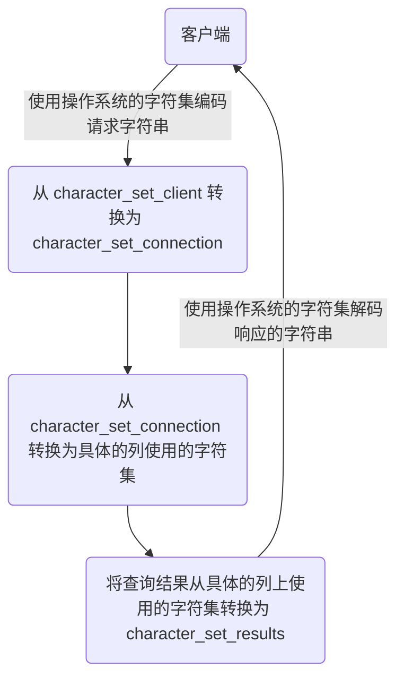

---
MySQL 笔记
---


# 第一部分 MySQL 基础篇

## 第 01 章 数据库概述

### 1. 为什么要使用数据库

- 持久化 (persistence)：**把数据保存到可掉电式存储设备中以供之后使用**。大多数情况下，特别是企业级应用，**数据持久化意味着将内存中的数据保存到硬盘上加以 “固化”**，而持久化的实现过程大多通过各种关系数据库来完成。
- 持久化的主要作用是**将内存中的数据存储在关系型数据库中**，当然也可以存储在磁盘文件、XML 数据文件中。

### 2. 数据库与数据库管理系统

#### 2.1 数据库的相关概念

- **DB：数据库 (Database)**
  - 即存储数据的 “仓库”，其本质是一个文件系统。它保存了一系列有组织的数据。

- **DBMS：数据库管理系统 (Database Management System)**
  - 是一种操纵和管理数据库的大型软件，用于建立、使用和维护数据库，对数据库进行统一管理和控制。用户通过数据库管理系统访问数据库中表内的数据。

- **SQL：结构化查询语言（Structured Query Language）**
  - 专门用来与数据库通信的语言。


### 3. RDBMS 与非 RDBMS

#### 3.1 关系型数据库 (RDBMS)

#####  3.1.1 实质

- 这种类型的数据库是**最古老**的数据库类型，关系型数据库模型是把复杂的数据结构归结为简单的**二元关系**（即二维表格形式）。
- 关系型数据库以**行 (row)**和**列 (column)**的形式存储数据，以便于用户理解。这一系列的行和列被称为**表 (table)**，一组表组成了一个**库 (database)**。
- SQL 就是关系型数据库的查询语言。

##### 3.1.2 优势

- **复杂查询**可以用 SQL 语句方便的在一个表以及多个表之间做非常复杂的数据查询。
- **事务支持**使得对于安全性能很高的数据访问要求得以实现。

#### 3.2 非关系型数据库 (非 RDBMS)

##### 3.2.1 介绍

**非关系型数据库**，可看成传统关系型数据库的功能**阉割版本**，基于键值对存储数据，不需要经过 SQL 层的解析，**性能非常高**。同时，通过减少不常用的功能，进一步提高性能。

### 4. 关系型数据库设计规则

- 一个数据库中可以有多个表，每个表都有一个名字，用来标识自己。表名具有唯一性。
- 表具有一些特性，这些特性定义了数据在表中如何存储，类似 Java 和 Python 中 “类” 的设计。

#### 4.1 表、记录、字段

- E-R（entity-relationship，实体 - 联系）模型中有三个主要概念是：**实体集**、**属性**、**联系集**。
- 一个实体集（class）对应于数据库中的一个表（table），一个实体（instance）则对应于数据库表中的一行（row），也称为一条记录（record）。一个属性（attribute）对应于数据库表中的一列（column），也称为一个字段（field）。

#### 4.2 表的关联关系

- 表与表之间的数据记录有关系 (relationship)。现实世界中的各种实体以及实体之间的各种联系均用关系模型来表示。
- 四种：一对一关联、一对多关联、多对多关联、自我引用

## 第 02 章 MySQL 环境搭建（略）

### 1. MySQL 演示使用

#### 1.1 MySQL 的编码设置

**MySQL5.7 中**

**问题再现：命令行操作 sql 乱码问题**

```sql
mysql> INSERT INTO t_stu VALUES(1,'张三','男');
ERROR 1366 (HY000): Incorrect string value: '\xD5\xC5\xC8\xFD' for column 'sname' at row 1
```

**问题解决**

步骤 1：查看编码命令

```sql
show variables like 'character_%';
show variables like 'collation_%';
```

步骤 2：修改 mysql 的数据目录下的 my.ini 配置文件

```ini
default-character-set=utf8 #默认字符集 [mysqld]

# 大概在 76 行左右，在其下添加
...
character-set-server=utf8
collation-server=utf8_general_ci
```

步骤 3：重启服务

步骤 4：查看编码命令

```sql
show variables like 'character_%';
show variables like 'collation_%';
```

**MySQL8.0 中**

在 MySQL 8.0 版本之前，默认字符集为 latin1，utf8 字符集指向的是 utf8mb3。网站开发人员在数据库设计的时候往往会将编码修改为 utf8 字符集。如果遗忘修改默认的编码，就会出现乱码的问题。从 MySQL 8.0 开始，数据库的默认编码改为 **utf8mb4**，从而避免了上述的乱码问题。

### 问题 1：root 用户密码忘记，重置的操作

1: 通过任务管理器或者服务管理，关掉 mysqld(服务进程)

2: 通过命令行 + 特殊参数开启 `mysqld mysqld -- defaults-file="D:\ProgramFiles\mysql\MySQLServer5.7Data\my.ini" --skip-grant-tables`

3: 此时，mysqld 服务进程已经打开。并且不需要权限检查

4: mysql -uroot 无密码登陆服务器。另启动一个客户端进行

5: 修改权限表 （1） use mysql; （2）update user set authentication_string=password('新密码') where user='root' and Host='localhost'; （3）flush privileges;

6: 通过任务管理器，关掉 mysqld 服务进程。

7: 再次通过服务管理，打开 mysql 服务。

8: 即可用修改后的新密码登陆。

### 问题 2：mysql 命令报 “不是内部或外部命令”

如果输入 mysql 命令报 “不是内部或外部命令”，把 mysql 安装目录的 bin 目录配置到环境变量 path 中。

### 问题 3： No database selected

解决方案一：就是使用 “USE 数据库名;” 语句，这样接下来的语句就默认针对这个数据库进行操作

解决方案二：就是所有的表对象前面都加上 “数据库.”

### 问题 4：命令行客户端的字符集问题

```sql
mysql> INSERT INTO t_stu VALUES(1,'张三','男');
ERROR 1366 (HY000): Incorrect string value: '\xD5\xC5\xC8\xFD' for column 'sname' at row 1
```

查看所有字符集：`SHOW VARIABLES LIKE 'character_set_%'; `

解决方案，设置当前连接的客户端字符集 `SET NAMES GBK;`

### 问题 5：修改数据库和表的字符编码

修改编码：

（1） 先停止服务，（2）修改 my.ini 文件（3）重新启动服务

说明：

如果是在修改 my.ini 之前建的库和表，那么库和表的编码还是原来的 Latin1，要么删了重建，要么使用 alter 语句修改编码。

```sql
mysql> create database 0728db charset Latin1;
Query OK, 1 row affected (0.00 sec)
```

```sql
mysql> use 0728db;
Database changed

mysql> show create table student\G
***************************1. row***************************
Table: student
Create Table: CREATE TABLE `student` (`id` int(11) NOT NULL, `name` varchar(20) DEFAULT NULL, PRIMARY KEY (`id`) ) ENGINE=InnoDB DEFAULT CHARSET=latin1 1 row in set (0.00 sec)
```

```sql
mysql> alter table student charset utf8; #修改表字符编码为 UTF8
Query OK, 0 rows affected (0.01 sec)
Records: 0 Duplicates: 0 Warnings: 0

mysql> show create table student\G
***************************1. row***************************
Table: student
Create Table: CREATE TABLE `student` (`id` int(11) NOT NULL, `name` varchar(20) CHARACTER SET latin1 DEFAULT NULL, #字段仍然是 latin1 编码 PRIMARY KEY (`id`) ) ENGINE=InnoDB DEFAULT CHARSET=utf8
1 row in set (0.00 sec)

mysql> alter table student modify name varchar(20) charset utf8; #修改字段字符编码为 UTF8
Query OK, 0 rows affected (0.05 sec)
Records: 0 Duplicates: 0 Warnings: 0

mysql> show create table student\G
***************************1. row***************************
Table: student
Create Table: CREATE TABLE `student` (`id` int(11) NOT NULL, `name` varchar(20) DEFAULT NULL, PRIMARY KEY (`id`) ) ENGINE=InnoDB DEFAULT CHARSET=utf8 1 row in set (0.00 sec)
```

```sql
mysql> show create database 0728db;
+--------+-----------------------------------------------------------------+
|Database| Create Database |
+------+-------------------------------------------------------------------+
|0728db| CREATE DATABASE `0728db` /*!40100 DEFAULT CHARACTER SET latin1 */ |
+------+-------------------------------------------------------------------+
1 row in set (0.00 sec)
mysql> alter database 0728db charset utf8; #修改数据库的字符编码为 utf8
Query OK, 1 row affected (0.00 sec)
```

## 第 03 章 基本的 SELECT 语句

### 1. SQL 概述

#### 1.1 SQL 分类

- DDL: 数据定义语言。`CREATE` \ `ALTER` \ `DROP` \ `RENAME` \ `TRUNCATE`

- DML: 数据操作语言。`INSERT` \ `DELETE` \ `UPDATE` \ `SELECT` （重中之重）

- DCL: 数据控制语言。`COMMIT` \ `ROLLBACK` \ `SAVEPOINT` \ `GRANT` \ `REVOKE`

### 2. SQL 语言的规则与规范

#### 2.1 基本规则

- SQL 可以写在一行或者多行。为了提高可读性，各子句分行写，必要时使用缩进
- 每条命令以 ; 或 \g 或 \G 结束
- 关键字不能被缩写也不能分行
- 关于标点符号
  - 必须保证所有的 ()、单引号、双引号是成对结束的
  - 必须使用英文状态下的半角输入方式
  - 字符串型和日期时间类型的数据可以使用单引号（' '）表示
  - 列的别名，尽量使用双引号（" "），而且不建议省略 as

#### 2.2 SQL 大小写规范 （建议遵守）

- **MySQL 在 Windows 环境下是大小写不敏感的**
- **MySQL 在 Linux 环境下是大小写敏感的**
  - 数据库名、表名、表的别名、变量名是严格区分大小写的
  - 关键字、函数名、列名 (或字段名)、列的别名 (字段的别名) 是忽略大小写的。
- **推荐采用统一的书写规范：**
  - 数据库名、表名、表别名、字段名、字段别名等都小写
  - SQL 关键字、函数名、绑定变量等都大写

#### 2.3 注 释

```sql
单行注释：# 注释文字 (MySQL 特有的方式)
单行注释：-- 注释文字 (-- 后面必须包含一个空格。)
多行注释：/* 注释文字 */
```

#### 2.4 命名规则（暂时了解）

- 数据库、表名不得超过 30 个字符，变量名限制为 29 个
- 必须只能包含 A–Z, a–z, 0–9, _共 63 个字符
- 数据库名、表名、字段名等对象名中间不要包含空格
- 同一个 MySQL 软件中，数据库不能同名；同一个库中，表不能重名；同一个表中，字段不能重名
- 必须保证你的字段没有和保留字、数据库系统或常用方法冲突。如果坚持使用，请在 SQL 语句中使用 `（着重号）引起来
- 保持字段名和类型的一致性，在命名字段并为其指定数据类型的时候一定要保证一致性。假如数据类型在一个表里是整数，那在另一个表里可就别变成字符型了

#### 2.5 数据导入指令

在命令行客户端登录 mysql，使用 source 指令导入

```sql
mysql> source d:\mysqldb.sql
```

### 3. 基本的 SELECT 语句

#### 3.0 SELECT...

```sql
SELECT 1; #没有任何子句
SELECT 1 + 1,3 * 2
FROM DUAL; #dual：伪表
```

#### 3.1 SELECT ... FROM

- 语法：

```sql
SELECT 标识选择哪些列
FROM 标识从哪个表中选择
```

- 选择全部列：

```sql
SELECT *
FROM departments;
```

- 选择特定的列：

```sql
SELECT department_id, location_id
FROM departments;
```

#### 3.2 列的别名

- 重命名一个列
- 便于计算
- 紧跟列名，也可以**在列名和别名之间加入关键字 AS，别名使用双引号**，以便在别名中包含空格或特殊的字符并区分大小写。
- AS 可以省略
- 建议别名简短，见名知意

```sql
SELECT last_name AS name, commission_pct comm
FROM employees;

SELECT last_name "Name", salary*12 "Annual Salary"
FROM employees;
```

#### 3.3 去除重复行

**在 SELECT 语句中使用关键字 DISTINCT 去除重复行**

```sql
SELECT DISTINCT department_id,salary
FROM employees;
```

这里有两点需要注意：

1. `DISTINCT` 需要放到所有列名的前面，如果写成 `SELECT salary, DISTINCT department_id FROM employees` 会报错。

2. `DISTINCT` 其实是对后面所有列名的组合进行去重。如果你想要看都有哪些不同的部门（department_id），只需要写 `DISTINCT department_id` 即可，后面不需要再加其他的列名了。

#### 3.4 空值参与运算

- 所有运算符或列值遇到 null 值，运算的结果都为 null

```sql
SELECT employee_id,salary,commission_pct, 12 * salary * (1 + commission_pct) "annual_sal"
FROM employees;
```

在 MySQL 里面， 空值不等于空字符串。一个空字符串的长度是 0，而一个空值的长度是空。而且，在 MySQL 里面，空值是占用空间的。

#### 3.5 着重号

- 错误的

```sql
mysql> SELECT * FROM ORDER;
```

- 正确的

```sql
mysql> SELECT * FROM `ORDER`;
mysql> SELECT * FROM `order`;
```

- 结论

我们需要保证表中的字段、表名等没有和保留字、数据库系统或常用方法冲突。如果真的相同，请在 SQL 语句中使用一对 ``（着重号）引起来。

#### 3.6 查询常数 *

```sql
SELECT '尚硅谷' as corporation, last_name
FROM employees;
```

### 4. 显示表结构

使用 DESCRIBE 或 DESC 命令，表示表结构。

```sql
DESCRIBE employees;
或
DESC employees;
```

### 5. 过滤数据

- 语法
  - 使用 WHERE 子句，将不满足条件的行过滤掉
  - **WHERE 子句紧随 FROM 子句**

```sql
SELECT 字段 1, 字段 2
FROM 表名
WHERE 过滤条件
```

- 举例

```sql
SELECT employee_id, last_name, job_id, department_id
FROM employees
WHERE department_id = 90;
```

## 第 04 章 运算符

### 1. 算术运算符

| 运算符   | 名称               | 作用                     | 实例                             |
| -------- | ------------------ | ------------------------ | -------------------------------- |
| +        | 加法运算符         | 计算两个值或表达式的和   | SELECT A + B                     |
| -        | 减法运算符         | 计算两个值或表达式的差   | SELECT A - B                     |
| *        | 乘法运算符         | 计算两个值或表达式的乘积 | SELECT A * B                     |
| / 或 DIV | 除法运算符         | 计算两个值或表达式的商   | SELECT A / B 或者 SELECT A DIV B |
| % 或 MOD | 求模（求余）运算符 | 计算两个值或表达式的余数 | SELECT A % B 或者 SELECT A MOD B |

加法与减法运算符结论:

> - 一个整数类型的值对整数进行加法和减法操作，结果还是一个整数；
> - 一个整数类型的值对浮点数进行加法和减法操作，结果是一个浮点数；
> - 加法和减法的优先级相同，进行先加后减操作与进行先减后加操作的结果是一样的；
> - **在 Java 中，+ 的左右两边如果有字符串，那么表示字符串的拼接。但是在 MySQL 中 + 只表示数值相加。如果遇到非数值类型，先尝试转成数值，如果转失败，就按 0 计算。（补充：MySQL 中字符串拼接要使用字符串函数 CONCAT() 实现）**

乘法与除法运算符结论:

> - 一个数乘以整数 1 和除以整数 1 后仍得原数；
> - 一个数乘以浮点数 1 和除以浮点数 1 后变成浮点数，数值与原数相等；
> - **一个数除以整数后，不管是否能除尽，结果都为一个浮点数**；
> - 一个数除以另一个数，除不尽时，结果为一个浮点数，并保留到小数点后 4 位；
> - 乘法和除法的优先级相同，进行先乘后除操作与先除后乘操作，得出的结果相同。
> - **在数学运算中，0 不能用作除数，在 MySQL 中，一个数除以 0 为 NULL。**

```sql
# 取模运算： % mod
SELECT 12 % 3,12 % 5, 12 MOD -5,-12 % 5,-12 % -5
FROM DUAL; # 结果的符号只与被模数有关
+--------+--------+-----------+---------+----------+
| 12 % 3 | 12 % 5 | 12 MOD -5 | -12 % 5 | -12 % -5 |
+--------+--------+-----------+---------+----------+
|      0 |      2 |         2 |      -2 |       -2 |
+--------+--------+-----------+---------+----------+
```

### 2. 比较运算符

比较运算符用来对表达式左边的操作数和右边的操作数进行比较，比较的结果为真则返回 1，比较的结果为假则返回 0，其他情况则返回 NULL。

| 运算符   | 名称           | 作用                                                         | 示例                              |
| -------- | -------------- | ------------------------------------------------------------ | --------------------------------- |
| =        | 等于运算符     | 判断两个值、字符串或表达式是否相等                           | SELECT C FROM TABLE WHERE A = B   |
| <=>      | 安全等于运算符 | 安全地判断两个值、字符串或表达式是否相等                     | SELECT C FROM TABLE WHERE A <=> B |
| <> 或 != | 不等于运算符   | 判断两个值、字符串或表达式是否不相等                         | SELECT C FROM TABLE WHERE A <> B  |
| <        | 小于运算符     | 判断前面的值、字符串或表达式是否小于后面的值、字符串或表达式 | SELECT C FROM TABLE WHERE A < B   |
| <=       | 小于等于运算符 | 判断前面的值、字符串或表达式是否小于等于后面的值、字符串或表达式 | SELECT C FROM TABLE WHERE A <= B  |
| >        | 大于运算符     | 判断前面的值、字符串或表达式是否大于后面的值、字符串或表达式 | SELECT C FROM TABLE WHERE A > B   |
| >=       | 大于等于运算符 | 判断前面的值、字符串或表达式是否大于等于后面的值、字符串或表达式 | SELECT C FROM TABLE WHERE A >= B  |

**等号运算符**

- 等号运算符（=）判断等号两边的值、字符串或表达式是否相等，如果相等则返回 1，不相等则返回 0。
- 在使用等号运算符时，遵循如下规则：
  - 如果等号两边的值、字符串或表达式都为字符串，则 MySQL 会按照字符串进行比较，其比较的是每个字符串中字符的 ANSI 编码是否相等。
  - 如果等号两边的值都是整数，则 MySQL 会按照整数来比较两个值的大小。
  - 如果等号两边的值一个是整数，另一个是字符串，则 MySQL 会将字符串转化为数字进行比较。
  - 如果等号两边的值、字符串或表达式中有一个为 NULL，则比较结果为 NULL。

**安全等于运算符（为 NULL 而生）**

安全等于运算符（<=>）与等于运算符（=）的作用是相似的，**唯一的区别**是‘<=>’可以用来对 NULL 进行判断。在两个操作数均为 NULL 时，其返回值为 1，而不为 NULL；当一个操作数为 NULL 时，其返回值为 0，而不为 NULL。

**不等于运算符**

不等于运算符（<> 和!=）用于判断两边的数字、字符串或者表达式的值是否不相等，如果不相等则返回 1，相等则返回 0。不等于运算符不能判断 NULL 值。如果两边的值有任意一个为 NULL，或两边都为 NULL，则结果为 NULL。

| 运算符              | 名称             | 作用                                     | 示例                                        |
| ------------------- | ---------------- | ---------------------------------------- | ------------------------------------------- |
| IS NULL             | 为空运算符       | 判断值、字符串或表达式是否为空           | SELECT B FROM TABLE WHERE A IS NULL         |
| IS NOTNULL          | 不为空运算符     | 判断值、字符串或表达式是否不为空         | SELECT B FROM TABLE WHERE A IS NOT NULL     |
| LEAST               | 最小值运算符     | 在多个值中返回最小值                     | SELECT D FROM TABLE WHERE C LEAST(A, B)     |
| GREATEST            | 最大值运算符     | 在多个值中返回最大值                     | SELECT D FROM TABLE WHERE C GREATEST(A, B)  |
| BETWEEN ... AND ... | 两值之间的运算符 | 判断一个值是否在两个值之间               | SELECT D FROM TABLE WHERE C BETWEEN A AND B |
| ISNULL              | 为空运算符       | 判断一个值、字符串或表达式是否为空       | SELECT B FROM TABLE WHERE A ISNULL          |
| IN                  | 属于运算符       | 判断一个值是否为列表中的任意一个值       | SELECT D FROM TABLE WHERE C IN(A, B)        |
| NOT IN              | 不属于运算符     | 判断一个值是否不是一个列表中的任意一个值 | SELECT D FROM TABLE WHERE C NOT IN(A, B)    |
| LIKE                | 模糊匹配运算符   | 判断一个值是否符合模糊匹配规则           | SELECT C FROM TABLE WHERE A LIKE B          |
| REGEXP              | 正则表达式运算符 | 判断一个值是否符合正则表达式的规则       | SELECT C FROM TABLE WHERE A REGEXPB         |
| RLIKE               | 正则表达式运算符 | 判断一个值是否符合正则表达式的规则       | SELECT C FROM TABLE WHERE A RLIKEB          |

**空运算符**

空运算符（IS NULL 或者 ISNULL）判断一个值是否为 NULL，如果为 NULL 则返回 1，否则返回 0。

**非空运算符**

非空运算符（IS NOT NULL）判断一个值是否不为 NULL，如果不为 NULL 则返回 1，否则返回 0。

**最小值运算符**

语法格式为：LEAST(值 1，值 2，...，值 n)。其中，“值 n” 表示参数列表中有 n 个值。在有两个或多个参数的情况下，返回最小值。

当参数是整数或者浮点数时，LEAST 将返回其中最小的值；当参数为字符串时，返回字母表中顺序最靠前的字符；当比较值列表中有 NULL 时，不能判断大小，返回值为 NULL。

**最大值运算符**

语法格式为：GREATEST(值 1，值 2，...，值 n)。其中，n 表示参数列表中有 n 个值。当有两个或多个参数时，返回值为最大值。假如任意一个自变量为 NULL，则 GREATEST() 的返回值为 NULL。

当参数中是整数或者浮点数时，GREATEST 将返回其中最大的值；当参数为字符串时，返回字母表中顺序最靠后的字符；当比较值列表中有 NULL 时，不能判断大小，返回值为 NULL。

**BETWEEN AND 运算符**

BETWEEN 运算符使用的格式通常为 SELECT D FROM TABLE WHERE C BETWEEN A AND B，此时，当 C 大于或等于 A，并且 C 小于或等于 B 时，结果为 1，否则结果为 0。

**IN 运算符**

IN 运算符用于判断给定的值是否是 IN 列表中的一个值，如果是则返回 1，否则返回 0。如果给定的值为 NULL，或者 IN 列表中存在 NULL，则结果为 NULL。

**NOT IN 运算符**

NOT IN 运算符用于判断给定的值是否不是 IN 列表中的一个值，如果不是 IN 列表中的一个值，则返回 1，否则返回 0。列表中存在 NULL，则结果为 NULL。

**LIKE 运算符**

LIKE 运算符主要用来匹配字符串，通常用于模糊匹配，如果满足条件则返回 1，否则返回 0。如果给定的值或者匹配条件为 NULL，则返回结果为 NULL。

LIKE 运算符通常使用如下通配符：

```sql
“%”：匹配 0 个或多个字符。
“_”：只能匹配一个字符。
```

```sql
#练习：查询 last_name 中包含字符'a'的员工信息
SELECT last_name
FROM employees
WHERE last_name LIKE '%a%';
#练习：查询 last_name 中以字符'a'开头的员工信息
SELECT last_name
FROM employees
WHERE last_name LIKE 'a%';
#练习：查询第 3 个字符是'a'的员工信息
SELECT last_name
FROM employees
WHERE last_name LIKE '__a%';
```

**ESCAPE**

- 回避特殊符号的：**使用转义符**。
- 如果使用 \ 表示转义，要省略 ESCAPE。如果不是 \，则要加上 ESCAPE。

```sql
#练习：查询第 2 个字符是_且第 3 个字符是'a'的员工信息
#需要使用转义字符: \
SELECT last_name
FROM employees
WHERE last_name LIKE '_\_a%';
#或者  (了解)
SELECT last_name
FROM employees
WHERE last_name LIKE '_$_a%' ESCAPE '$';
```

**REGEXP 运算符**

REGEXP 运算符用来匹配字符串，语法格式为：`expr REGEXP 匹配条件 `。如果 expr 满足匹配条件，返回 1；如果不满足，则返回 0。若 expr 或匹配条件任意一个为 NULL，则结果 NULL。

```
（1）‘^’匹配以该字符后面的字符开头的字符串。
（2）‘$’匹配以该字符前面的字符结尾的字符串。
（3）‘.’匹配任何一个单字符。
（4）“[...]”匹配在方括号内的任何字符。例如，“[abc]”匹配 “a” 或“b”或 “c”。为了命名字符的范围，使用一 个‘-’。“[a-z]” 匹配任何字母，而 “[0-9]” 匹配任何数字。
（5）‘*’匹配零个或多个在它前面的字符。例如，“x*”匹配任何数量的‘x’字符，“[0-9]*”匹配任何数量的数字， 而 “*” 匹配任何数量的任何字符。
```

### 3. 逻辑运算符

| 运算符     | 作用     | 示例           |
| ---------- | -------- | -------------- |
| NOT 或 !   | 逻辑非   | SELECT NOT A   |
| AND 或 &&  | 逻辑与   | SELECT A AND B |
| OR 或 \|\| | 逻辑或   | SELECT A OR B  |
| XOR        | 逻辑异或 | SELECT A XOR B |

**逻辑非运算符**

逻辑非（NOT 或!）运算符表示当给定的值为 0 时返回 1；当给定的值为非 0 值时返回 0；当给定的值为 NULL 时，返回 NULL。

**逻辑与运算符**

逻辑与（AND 或 &&）运算符是当给定的所有值均为非 0 值，并且都不为 NULL 时，返回 1；当给定的一个值或者多个值为 0 时则返回 0；否则返回 NULL。

**逻辑或运算符**

逻辑或（OR 或 ||）运算符是当给定的值都不为 NULL，并且任何一个值为非 0 值时，则返回 1，否则返回 0；当一个值为 NULL，并且另一个值为非 0 值时，返回 1，否则返回 NULL；当两个值都为 NULL 时，返回 NULL。

> 注意：OR 可以和 AND 一起使用，但是在使用时要注意两者的优先级，由于 AND 的优先级高于 OR，因此先对 AND 两边的操作数进行操作，再与 OR 中的操作数结合。

**逻辑异或运算符**

逻辑异或（XOR）运算符是当给定的值中任意一个值为 NULL 时，则返回 NULL；如果两个非 NULL 的值都是 0 或者都不等于 0 时，则返回 0；如果一个值为 0，另一个值不为 0 时，则返回 1。

### 4. 位运算符

| 运算符 | 作用              | 示例           |
| ------ | ----------------- | -------------- |
| &      | 按位与（位 AND）   | SELECT A & B   |
| \|     | 按位或（位 OR）    | SELECT A \| B  |
| ^      | 按位异或（为 XOR） | SELECT A ^ B   |
| ~      | 按位取反          | SELECT  ~A     |
| >>     | 按位右移          | SELECT  A >> 2 |
| <<     | 按位左移          | SELECT  B << 2 |

**按位与运算符**

按位与（&）运算符将给定值对应的二进制数逐位进行逻辑与运算。当给定值对应的二进制位的数值都为 1 时，则该位返回 1，否则返回 0。

**按位或运算符**

按位或（|）运算符将给定的值对应的二进制数逐位进行逻辑或运算。当给定值对应的二进制位的数值有一个或两个为 1 时，则该位返回 1，否则返回 0。

**按位取反运算符**

按位取反（~）运算符将给定的值的二进制数逐位进行取反操作，即将 1 变为 0，将 0 变为 1。

**按位右移运算符**

按位右移（>>）运算符将给定的值的二进制数的所有位右移指定的位数。右移指定的位数后，右边低位的数值被移出并丢弃，左边高位空出的位置用 0 补齐。

**按位左移运算符**

按位左移（<<）运算符将给定的值的二进制数的所有位左移指定的位数。左移指定的位数后，左边高位的数值被移出并丢弃，右边低位空出的位置用 0 补齐。

## 第 05 章 排序与分页

### 1. 排序数据

#### 1.1 排序规则

- 使用 ORDER BY 子句排序
  - **ASC（ascend）: 升序**
  - **DESC（descend）: 降序**
- **ORDER BY 子句在 SELECT 语句的结尾。**

```sql
# 单列排序
SELECT employee_id,last_name,salary
FROM employees
ORDER BY salary; # 如果在 ORDER BY 后没有显式指名排序的方式的话，则默认按照升序排列。
# 我们可以使用列的别名，进行排序
SELECT employee_id,salary,salary * 12 annual_sal
FROM employees
ORDER BY annual_sal;
# 多列排序
SELECT employee_id,salary,department_id
FROM employees
ORDER BY department_id DESC,salary ASC;
```

- 可以使用不在 SELECT 列表中的列排序。
- 在对多列进行排序的时候，首先排序的第一列必须有相同的列值，才会对第二列进行排序。如果第一列数据中所有值都是唯一的，将不再对第二列进行排序。

### 2. 分页

#### 2.1 实现规则

- **MySQL 中使用 LIMIT 实现分页**
- 格式：

```sql
LIMIT [位置偏移量,] 行数
```

- “偏移量”参数指示 MySQL 从哪一行开始显示，是一个可选参数，如果不指定 “位置偏移量”，将会从表中的第一条记录开始（第一条记录的位置偏移量是 0，第二条记录的位置偏移量是 1，以此类推）；第二个参数“行数” 指示返回的记录条数。

```sql
-- 前 10 条记录：
SELECT * FROM 表名 LIMIT 0,10;
或者
SELECT * FROM 表名 LIMIT 10;
-- 第 11 至 20 条记录：
SELECT * FROM 表名 LIMIT 10,10;
-- 第 21 至 30 条记录：
SELECT * FROM 表名 LIMIT 20,10;
```

> MySQL 8.0 中可以使用 “LIMIT 3 OFFSET 4”，意思是获取从第 5 条记录开始后面的 3 条记录，和“LIMIT 4,3;” 返回的结果相同。

- 分页显式公式：**（当前页数 - 1）* 每页条数，每页条数**
- **注意：LIMIT 子句必须放在整个 SELECT 语句的最后！**

## 第 06 章 多表查询

### 1. 一个案例引发的多表连接

#### 1.1 笛卡尔积（或交叉连接）的理解

笛卡尔乘积是一个数学运算。假设我有两个集合 X 和 Y，那么 X 和 Y 的笛卡尔积就是 X 和 Y 的所有可能组合，也就是第一个对象来自于 X，第二个对象来自于 Y 的所有可能。组合的个数即为两个集合中元素个数的乘积数。

SQL92 中，笛卡尔积也称为 ` 交叉连接 `，英文是 `CROSS JOIN`。在 SQL99 中也是使用 CROSS JOIN 表示交叉连接。它的作用就是可以把任意表进行连接，即使这两张表不相关。

```sql
#查询员工姓名和所在部门名称
SELECT last_name,department_name FROM employees,departments;
SELECT last_name,department_name FROM employees CROSS JOIN departments;
```

- **笛卡尔积的错误会在下面条件下产生**：
  - 省略多个表的连接条件（或关联条件）
  - 连接条件（或关联条件）无效
  - 所有表中的所有行互相连接
- 为了避免笛卡尔积， 可以**在 WHERE 加入有效的连接条件。**

### 2. 多表查询分类讲解

**分类 1：等值连接 vs 非等值连接**

**拓展 1：区分重复的列名**

- **多个表中有相同列时，必须在列名之前加上表名前缀。**

**拓展 2：表的别名**

- 使用别名可以简化查询。
- 列名前使用表名前缀可以提高查询效率。

> 需要注意的是，如果我们使用了表的别名，在查询字段中、过滤条件中就只能使用别名进行代替，不能使用原有的表名，否则就会报错。

**拓展 3：连接多个表**

- **连接 n 个表, 至少需要 n-1 个连接条件。**

```sql
#非等值连接的例子
SELECT e.last_name,e.salary,j.grade_level
FROM employees e,job_grades j
#where e.`salary` between j.`lowest_sal` and j.`highest_sal`;
WHERE e.`salary` >= j.`lowest_sal` AND e.`salary` <= j.`highest_sal`;
```

**分类 2：自连接 vs 非自连接**

```sql
#自连接的例子：
#练习：查询员工 id, 员工姓名及其管理者的 id 和姓名
SELECT emp.employee_id,emp.last_name,mgr.employee_id,mgr.last_name
FROM employees emp ,employees mgr
WHERE emp.`manager_id` = mgr.`employee_id`;
```

**分类 3：内连接  vs  外连接**

- 内连接: 合并具有同一列的两个以上的表的行,**结果集中不包含一个表与另一个表不匹配的行**

- 外连接: 两个表在连接过程中除了返回满足连接条件的行以外**还返回左（或右）表中不满足条件的行 ，这种连接称为左（或右） 外连接**。没有匹配的行时, 结果表中相应的列为空 (NULL)。
  - 如果是左外连接，则连接条件中左边的表也称为 ` 主表 `，右边的表称为 ` 从表 `。
  - 如果是右外连接，则连接条件中右边的表也称为 ` 主表 `，左边的表称为 ` 从表 `。

### 3. SQL99 语法实现多表查询

#### 3.1 基本语法

- 使用 JOIN...ON 子句创建连接的语法结构：

```sql
SELECT table1.column, table2.column, table3.column
FROM table1 JOIN table2
ON table1 和 table2 的连接条件
JOIN table3
ON table2 和 table3 的连接条件
```

#### 3.2 内连接 (INNER JOIN) 的实现

- 语法

```sql
SELECT 字段列表
FROM A 表 INNER JOIN B 表
ON 关联条件
WHERE 等其他子句;
```

```sql
SELECT last_name,department_name
FROM employees e INNER JOIN departments d
ON e.`department_id` = d.`department_id`;
```

#### 3.3 外连接 (OUTER JOIN) 的实现 *

##### 3.3.1 左外连接 (LEFT OUTER JOIN)

- 语法：

```sql
SELECT 字段列表
FROM A 表 LEFT JOIN B 表
ON 关联条件
WHERE 等其他子句;
```

```sql
SELECT last_name,department_name
FROM employees e LEFT JOIN departments d
ON e.`department_id` = d.`department_id`;
```

##### 3.3.2 右外连接 (RIGHT OUTER JOIN)

- 语法：

```sql
SELECT 字段列表
FROM A 表 RIGHT JOIN B 表
ON 关联条件
WHERE 等其他子句;
```

```sql
SELECT last_name,department_name
FROM employees e RIGHT OUTER JOIN departments d
ON e.`department_id` = d.`department_id`;
```

### 4. UNION 的使用

**UNION 操作符**

UNION 操作符返回两个查询的结果集的并集，去除重复记录。

**UNION ALL 操作符**

UNION ALL 操作符返回两个查询的结果集的并集。对于两个结果集的重复部分，不去重。

> 如果明确知道合并数据后的结果数据不存在重复数据，或者不需要去除重复的数据，则尽量使用 UNION ALL 语句，以提高数据查询的效率。

### 5. 7 种 SQL JOINS 的实现

#### 5.1 举例

```sql
# 中图：内连接
SELECT employee_id,department_name
FROM employees e JOIN departments d
ON e.`department_id` = d.`department_id`;
# 左上图：左外连接
SELECT employee_id,department_name
FROM employees e LEFT JOIN departments d
ON e.`department_id` = d.`department_id`;
# 右上图：右外连接
SELECT employee_id,department_name
FROM employees e RIGHT JOIN departments d
ON e.`department_id` = d.`department_id`;
# 左中图：
SELECT employee_id,department_name
FROM employees e LEFT JOIN departments d
ON e.`department_id` = d.`department_id`
WHERE d.`department_id` IS NULL;
# 右中图：
SELECT employee_id,department_name
FROM employees e RIGHT JOIN departments d
ON e.`department_id` = d.`department_id`
WHERE e.`department_id` IS NULL;
# 左下图：满外连接
# 方式 1：左上图 UNION ALL 右中图
SELECT employee_id,department_name
FROM employees e LEFT JOIN departments d
ON e.`department_id` = d.`department_id`
UNION ALL
SELECT employee_id,department_name
FROM employees e RIGHT JOIN departments d
ON e.`department_id` = d.`department_id`
WHERE e.`department_id` IS NULL;
# 方式 2：左中图 UNION ALL 右上图
SELECT employee_id,department_name
FROM employees e LEFT JOIN departments d
ON e.`department_id` = d.`department_id`
WHERE d.`department_id` IS NULL
UNION ALL
SELECT employee_id,department_name
FROM employees e RIGHT JOIN departments d
ON e.`department_id` = d.`department_id`;
# 右下图：左中图  UNION ALL 右中图
SELECT employee_id,department_name
FROM employees e LEFT JOIN departments d
ON e.`department_id` = d.`department_id`
WHERE d.`department_id` IS NULL
UNION ALL
SELECT employee_id,department_name
FROM employees e RIGHT JOIN departments d
ON e.`department_id` = d.`department_id`
WHERE e.`department_id` IS NULL;
```

#### 5.2 语法格式小结

- 左中图

```sql
#实现 A - A∩B
select 字段列表
from A 表 left join B 表
on 关联条件
where 从表关联字段 is null and 等其他子句;
```

- 右中图

```sql
#实现 B - A∩B
select 字段列表
from A 表 right join B 表
on 关联条件
where 从表关联字段 is null and 等其他子句;
```

- 左下图

```sql
#实现查询结果是 A∪B
#用左外的 A，union 右外的 B
select 字段列表
from A 表 left join B 表
on 关联条件
where 等其他子句
union
select 字段列表
from A 表 right join B 表
on 关联条件
where 等其他子句;
```

- 右下图

```sql
#实现 A∪B - A∩B 或 (A - A∩B) ∪ （B - A∩B）
#使用左外的 (A - A∩B) union 右外的（B - A∩B）
select 字段列表
from A 表 left join B 表
on 关联条件
where 从表关联字段 is null and 等其他子句
union
select 字段列表
from A 表 right join B 表
on 关联条件
where 从表关联字段 is null and 等其他子句
```

### 6. SQL99 语法新特性

#### 6.1 自然连接 *

```sql
SELECT employee_id,last_name,department_name
FROM employees e JOIN departments d
ON e.`department_id` = d.`department_id`
AND e.`manager_id` = d.`manager_id`;
# NATURAL JOIN : 它会帮你自动查询两张连接表中 ` 所有相同的字段 `，然后进行 ` 等值连接 `。
SELECT employee_id,last_name,department_name
FROM employees e NATURAL JOIN departments d;
```

#### 6.2 USING 连接

```sql
SELECT employee_id,last_name,department_name
FROM employees e JOIN departments d
ON e.department_id = d.department_id;
# 指定数据表里的同名字段进行等值连接，只能配合 JOIN 一起使用。
SELECT employee_id,last_name,department_name
FROM employees e JOIN departments d
USING (department_id);
```

> 【强制】超过三个表禁止 join。需要 join 的字段，数据类型保持绝对一致；多表关联查询时，保证被关联的字段需要有索引。
>
> 说明：即使双表 join 也要注意表索引、SQL 性能。

## 第 07 章 单行函数

### 1. 数值函数

#### 1.1 基本函数

| 函数                | 用法                                                         |
| ------------------- | ------------------------------------------------------------ |
| ABS(x)              | 返回 x 的绝对值                                                |
| SIGN(X)             | 返回 X 的符号。正数返回 1，负数返回 - 1，0 返回 0                   |
| PI()                | 返回圆周率的值                                               |
| CEIL(x)，CEILING(x) | 返回大于或等于某个值的最小整数                               |
| FLOOR(x)            | 返回小于或等于某个值的最大整数                               |
| LEAST(e1,e2,e3…)    | 返回列表中的最小值                                           |
| GREATEST(e1,e2,e3…) | 返回列表中的最大值                                           |
| MOD(x,y)            | 返回 X 除以 Y 后的余数                                           |
| RAND()              | 返回 0~1 的随机值                                              |
| RAND(x)             | 返回 0~1 的随机值，其中 x 的值用作种子值，相同的 X 值会产生相同的随机 |
| ROUND(x)            | 返回一个对 x 的值进行四舍五入后，最接近于 X 的整数               |
| ROUND(x,y)          | 返回一个对 x 的值进行四舍五入后最接近 X 的值，并保留到小数点后面 Y 位 |
| TRUNCATE(x,y)       | 返回数字 x 截断为 y 位小数的结果                                 |
| SQRT(x)             | 返回 x 的平方根。当 X 的值为负数时，返回 NULL                     |

#### 1.2 角度与弧度

| 函数       | 用法                                  |
| ---------- | ------------------------------------- |
| RADIANS(x) | 将角度转化为弧度，其中，参数 x 为角度值 |
| DEGREES(x) | 将弧度转化为角度，其中，参数 x 为弧度值 |

#### 1.3 三角函数

| 函数       | 用法                                                         |
| ---------- | ------------------------------------------------------------ |
| SIN(x)     | 返回 x 的正弦值，其中，参数 x 为弧度值                           |
| ASIN(x)    | 返回 x 的反正弦值，即获取正弦为 x 的值。如果 x 的值不在 - 1 到 1 之间，则返回 NULL |
| COS(x)     | 返回 x 的余弦值，其中，参数 x 为弧度值                           |
| ACOS(x)    | 返回 x 的反余弦值，即获取余弦为 x 的值。如果 x 的值不在 - 1 到 1 之间，则返回 NULL |
| TAN(x)     | 返回 x 的正切值，其中，参数 x 为弧度值                           |
| ATAN(x)    | 返回 x 的反正切值，即返回正切值为 x 的值                         |
| ATAN2(m,n) | 返回两个参数的反正切值                                       |
| COT(x)     | 返回 x 的余切值，其中，X 为弧度值                               |

#### 1.4 指数与对数

| 函数                 | 用法                                                 |
| -------------------- | ---------------------------------------------------- |
| POW(x,y)，POWER(X,Y) | 返回 x 的 y 次方                                         |
| EXP(X)               | 返回 e 的 X 次方，其中 e 是一个常数，2.718281828459045     |
| LN(X)，LOG(X)        | 返回以 e 为底的 X 的对数，当 X <= 0 时，返回的结果为 NULL  |
| LOG10(X)             | 返回以 10 为底的 X 的对数，当 X <= 0 时，返回的结果为 NULL |
| LOG2(X)              | 返回以 2 为底的 X 的对数，当 X <= 0 时，返回 NULL          |

#### 1.5 进制间的转换

| 函数          | 用法                     |
| ------------- | ------------------------ |
| BIN(x)        | 返回 x 的二进制编码        |
| HEX(x)        | 返回 x 的十六进制编码      |
| OCT(x)        | 返回 x 的八进制编码        |
| CONV(x,f1,f2) | 返回 f1 进制数变成 f2 进制数 |

### 2. 字符串函数

| 函数                             | 用法                                                         |
| -------------------------------- | ------------------------------------------------------------ |
| ASCII(S)                         | 返回字符串 S 中的第一个字符的 ASCII 码值                         |
| CHAR_LENGTH(s)                   | 返回字符串 s 的字符数。作用与 CHARACTER_LENGTH(s) 相同           |
| LENGTH(s)                        | 返回字符串 s 的字节数，和字符集有关                            |
| CONCAT(s1,s2,......,sn)          | 连接 s1,s2,......,sn 为一个字符串                              |
| CONCAT_WS(x,s1,s2,......,sn)     | 同 CONCAT(s1,s2,...) 函数，但是每个字符串之间要加上 x           |
| INSERT(str, idx, len,replacestr) | 将字符串 str 从第 idx 位置开始，len 个字符长的子串替换为字符串 replacestr |
| REPLACE(str, a, b)               | 用字符串 b 替换字符串 str 中所有出现的字符串 a                    |
| UPPER(s) 或 UCASE(s)             | 将字符串 s 的所有字母转成大写字母                              |
| LOWER(s) 或 LCASE(s)              | 将字符串 s 的所有字母转成小写字母                              |
| LEFT(str,n)                      | 返回字符串 str 最左边的 n 个字符                                 |
| RIGHT(str,n)                     | 返回字符串 str 最右边的 n 个字符                                 |
| LPAD(str, len, pad)              | 用字符串 pad 对 str 最左边进行填充，直到 str 的长度为 len 个字符，实现右对齐效果 |
| RPAD(str ,len, pad)              | 用字符串 pad 对 str 最右边进行填充，直到 str 的长度为 len 个字符，实现左对齐效果 |
| LTRIM(s)                         | 去掉字符串 s 左侧的空格                                        |
| RTRIM(s)                         | 去掉字符串 s 右侧的空格                                        |
| TRIM(s)                          | 去掉字符串 s 开始与结尾的空格                                  |
| TRIM(s1 FROM s)                  | 去掉字符串 s 开始与结尾的 s1                                    |
| TRIM(LEADING s1 FROM s)          | 去掉字符串 s 开始处的 s1                                        |
| TRIM(TRAILING s1 FROM s)         | 去掉字符串 s 结尾处的 s1                                        |
| REPEAT(str, n)                   | 返回 str 重复 n 次的结果                                         |
| SPACE(n)                         | 返回 n 个空格                                                  |
| STRCMP(s1,s2)                    | 比较字符串 s1,s2 的 ASCII 码值的大小                             |
| SUBSTR(s,index,len)              | 返回从字符串 s 的 index 位置其 len 个字符，作用与 SUBSTRING(s,n,len)、MID(s,n,len) 相同 |
| LOCATE(substr,str)               | 返回字符串 substr 在字符串 str 中首次出现的位置，作用于 POSITION(substr IN str)、INSTR(str,substr) 相同。未找到，返回 0 |
| ELT(m,s1,s2,…,sn)                | 返回指定位置的字符串，如果 m=1，则返回 s1，如果 m=2，则返回 s2，如果 m=n，则返回 sn |
| FIELD(s,s1,s2,…,sn)              | 返回字符串 s 在字符串列表中第一次出现的位置                    |
| FIND_IN_SET(s1,s2)               | 返回字符串 s1 在字符串 s2 中出现的位置。其中，字符串 s2 是一个以逗号分隔的字符串 |
| REVERSE(s)                       | 返回 s 反转后的字符串                                          |
| NULLIF(value1,value2)            | 比较两个字符串，如果 value1 与 value2 相等，则返回 NULL，否则返回 value1 |

> 注意：MySQL 中，字符串的位置是从 1 开始的。

### 3. 日期和时间函数

#### 3.1 获取日期、时间

| 函数                                                         | 用法                           |
| ------------------------------------------------------------ | ------------------------------ |
|**CURDATE()**，CURRENT_DATE()                               | 返回当前日期，只包含年、月、日 |
|**CURTIME()**， CURRENT_TIME()                              | 返回当前时间，只包含时、分、秒 |
|**NOW()**/ SYSDATE() / CURRENT_TIMESTAMP() / LOCALTIME() / LOCALTIMESTAMP() | 返回当前系统日期和时间         |
| UTC_DATE()                                                   | 返回 UTC（世界标准时间）日期    |
| UTC_TIME()                                                   | 返回 UTC（世界标准时间）时间    |

#### 3.2 日期与时间戳的转换

| 函数                     | 用法                                                         |
| ------------------------ | ------------------------------------------------------------ |
| UNIX_TIMESTAMP()         | 以 UNIX 时间戳的形式返回当前时间。SELECT UNIX_TIMESTAMP() -\>1634348884 |
| UNIX_TIMESTAMP(date)     | 将时间 date 以 UNIX 时间戳的形式返回。                           |
| FROM_UNIXTIME(timestamp) | 将 UNIX 时间戳的时间转换为普通格式的时间                       |

#### 3.3 获取月份、星期、星期数、天数等函数

| 函数                                     | 用法                                            |
| ---------------------------------------- | ----------------------------------------------- |
| YEAR(date) / MONTH(date) / DAY(date)     | 返回具体的日期值                                |
| HOUR(time) / MINUTE(time) / SECOND(time) | 返回具体的时间值                                |
| MONTHNAME(date)                          | 返回月份：January，...                          |
| DAYNAME(date)                            | 返回星期几：MONDAY，TUESDAY.....SUNDAY          |
| WEEKDAY(date)                            | 返回周几，注意，周 1 是 0，周 2 是 1，。。。周日是 6   |
| QUARTER(date)                            | 返回日期对应的季度，范围为 1～4                  |
| WEEK(date) ， WEEKOFYEAR(date)           | 返回一年中的第几周                              |
| DAYOFYEAR(date)                          | 返回日期是一年中的第几天                        |
| DAYOFMONTH(date)                         | 返回日期位于所在月份的第几天                    |
| DAYOFWEEK(date)                          | 返回周几，注意：周日是 1，周一是 2，。。。周六是 7 |

#### 3.4 日期的操作函数 *

| 函数                    | 用法                                       |
| ----------------------- | ------------------------------------------ |
| EXTRACT(type FROM date) | 返回指定日期中特定的部分，type 指定返回的值 |

EXTRACT(type FROM date) 函数中 type 的取值与含义：

| type 取值           | 含义                         |
| :----------------- | ---------------------------- |
| MICROSECOND        | 返回毫秒数                   |
| SECOND             | 返回秒数                     |
| MINUTE             | 返回分钟数                   |
| HOUR               | 返回小时数                   |
| DAY                | 返回天数                     |
| WEEK               | 返回日期在一年中的第几个星期 |
| MONTH              | 返回日期在一年中的第几个月   |
| QUARTER            | 返回日期在一年中的第几个季度 |
| YEAR               | 返回日期的年份               |
| SECOND_MICROSECOND | 返回秒和毫秒值               |
| MINUTE_MICROSECOND | 返回分钟和毫秒值             |
| MINUTE_SECOND      | 返回分钟和秒值               |
| HOUR_MICROSECOND   | 返回小时和毫秒值             |
| HOUR_SECOND        | 返回小时和秒值               |
| HOUR_MINUTE        | 返回小时和分钟值             |
| DAY_MICROSECOND    | 返回天和毫秒值               |
| DAY_SECOND         | 返回天和秒值                 |
| DAY_MINUTE         | 返回天和分钟值               |
| DAY_HOUR           | 返回天和小时                 |
| YEAR_MONTH         | 返回年和月                   |

#### 3.5 时间和秒钟转换的函数

| 函数                 | 用法                                                         |
| -------------------- | ------------------------------------------------------------ |
| TIME_TO_SEC(time)    | 将 time 转化为秒并返回结果值。转化的公式为： 小时 \*3600 + 分钟 \*60 + 秒 |
| SEC_TO_TIME(seconds) | 将 seconds 描述转化为包含小时、分钟和秒的时间                |

#### 3.6 计算日期和时间的函数

| 函数                                                         | 用法                                           |
| ------------------------------------------------------------ | ---------------------------------------------- |
| DATE_ADD(datetime, INTERVAL expr type)，ADDDATE(date,INTERVAL expr type) | 返回与给定日期时间相差 INTERVAL 时间段的日期时间 |
| DATE_SUB(date,INTERVAL expr type)，SUBDATE(date,INTERVAL expr type) | 返回与 date 相差 INTERVAL 时间间隔的日期           |

上述函数中 type 的取值：

| 间隔类型      | 含义       |
| ------------- | ---------- |
| HOUR          | 小时       |
| MINUTE        | 分钟       |
| SECOND        | 秒         |
| YEAR          | 年         |
| MONTH         | 月         |
| DAY           | 日         |
| YEAR_MONTH    | 年和月     |
| DAY_HOUR      | 日和小时   |
| DAY_MINUTE    | 日和分钟   |
| DAY_SECOND    | 日和秒     |
| HOUR_MINUTE   | 小时和分钟 |
| HOUR_SECOND   | 小时和秒   |
| MINUTE_SECOND | 分钟和秒   |

| 函数                         | 用法                                                         |
| ---------------------------- | ------------------------------------------------------------ |
| ADDTIME(time1,time2)         | 返回 time1 加上 time2 的时间。当 time2 为一个数字时，代表的是秒 ，可以为负数 |
| SUBTIME(time1,time2)         | 返回 time1 减去 time2 后的时间。当 time2 为一个数字时，代表的是秒，可以为负数 |
| DATEDIFF(date1,date2)        | 返回 date1 - date2 的日期间隔天数                              |
| TIMEDIFF(time1, time2)       | 返回 time1 - time2 的时间间隔                                  |
| FROM_DAYS(N)                 | 返回从 0000 年 1 月 1 日起，N 天以后的日期                          |
| TO_DAYS(date)                | 返回日期 date 距离 0000 年 1 月 1 日的天数                           |
| LAST_DAY(date)               | 返回 date 所在月份的最后一天的日期                             |
| MAKEDATE(year,n)             | 针对给定年份与所在年份中的天数返回一个日期                   |
| MAKETIME(hour,minute,second) | 将给定的小时、分钟和秒组合成时间并返回                       |
| PERIOD_ADD(time,n)           | 返回 time 加上 n 后的时间                                        |

#### 3.7 日期的格式化与解析

| 函数                              | 用法                                       |
| --------------------------------- | ------------------------------------------ |
| DATE_FORMAT(date,fmt)             | 按照字符串 fmt 格式化日期 date 值              |
| TIME_FORMAT(time,fmt)             | 按照字符串 fmt 格式化时间 time 值              |
| GET_FORMAT(date_type,format_type) | 返回日期字符串的显示格式                   |
| STR_TO_DATE(str, fmt)             | 按照字符串 fmt 对 str 进行解析，解析为一个日期 |

上述 ` 非 GET_FORMAT` 函数中 fmt 参数常用的格式符：

| 格式符 | 说明                                                        | 格式符 | 说明                                                        |
| ------ | ----------------------------------------------------------- | ------ | ----------------------------------------------------------- |
| %Y     | 4 位数字表示年份                                             | %y     | 表示两位数字表示年份                                        |
| %M     | 月名表示月份（January,....）                                | %m     | 两位数字表示月份（01,02,03。。。）                          |
| %b     | 缩写的月名（Jan.，Feb.，....）                              | %c     | 数字表示月份（1,2,3,...）                                   |
| %D     | 英文后缀表示月中的天数（1st,2nd,3rd,...）                   | %d     | 两位数字表示月中的天数 (01,02...)                            |
| %e     | 数字形式表示月中的天数（1,2,3,4,5.....）                    |        |                                                             |
| %H     | 两位数字表示小数，24 小时制（01,02..）                       | %h 和 %I | 两位数字表示小时，12 小时制（01,02..）                       |
| %k     | 数字形式的小时，24 小时制 (1,2,3)                             | %l     | 数字形式表示小时，12 小时制（1,2,3,4....）                   |
| %i     | 两位数字表示分钟（00,01,02）                                | %S 和 %s | 两位数字表示秒 (00,01,02...)                                 |
| %W     | 一周中的星期名称（Sunday...）                               | %a     | 一周中的星期缩写（Sun.，Mon.,Tues.，..）                    |
| %w     | 以数字表示周中的天数 (0=Sunday,1=Monday....)                 |        |                                                             |
| %j     | 以 3 位数字表示年中的天数 (001,002...)                         | %U     | 以数字表示年中的第几周，（1,2,3。。）其中 Sunday 为周中第一天 |
| %u     | 以数字表示年中的第几周，（1,2,3。。）其中 Monday 为周中第一天 |        |                                                             |
| %T     | 24 小时制                                                    | %r     | 12 小时制                                                    |
| %p     | AM 或 PM                                                      | %%     | 表示 %                                                       |

GET_FORMAT 函数中 date_type 和 format_type 参数取值如下：

| 日期类型 | 格式化类型 | 返回的格式化字符串 |
| -------- | ---------- | ------------------ |
| DATE     | USA        | %m.%d.%Y           |
| DATE     | JIS        | %Y-%m-%d           |
| DATE     | ISO        | %Y-%m-%d           |
| DATE     | EUR        | %d.%m.%Y           |
| DATE     | INTERNAL   | %Y%m%d             |
| TIME     | USA        | %h:%i:%s %P        |
| TIME     | JIS        | %H:%i:%s           |
| TIME     | ISO        | %H:%i:%s           |
| TIME     | EUR        | %H.%i.%s           |
| TIME     | INTERNAL   | %H%i%s             |
| DATETIME | USA        | %Y-%m-%d %H.%i.%s  |
| DATETIME | JIS        | %Y-%m-%d %H:%i:%s  |
| DATETIME | ISO        | %Y-%m-%d %H:%i:%s  |
| DATETIME | EUR        | %Y-%m-%d %H.%i.%s  |
| DATETIME | INTERNAL   | %Y%m%d%H%i%s       |

### 4. 流程控制函数

| 函数                                                         | 用法                                            |
| ------------------------------------------------------------ | ----------------------------------------------- |
| IF(value,value1,value2)                                      | 如果 value 的值为 TRUE，返回 value1，否则返回 value2 |
| IFNULL(value1, value2)                                       | 如果 value1 不为 NULL，返回 value1，否则返回 value2  |
| CASE WHEN 条件 1 THEN 结果 1 WHEN 条件 2 THEN 结果 2.... [ELSE resultn] END | 相当于 Java 的 if...else if...else...              |
| CASE expr WHEN 常量值 1 THEN 值 1 WHEN 常量值 1 THEN 值 1 .... [ELSE 值 n] END | 相当于 Java 的 switch...case...                    |

### 5. 加密与解密函数

| 函数                        | 用法                                                         |
| --------------------------- | ------------------------------------------------------------ |
| PASSWORD(str)               | 返回字符串 str 的加密版本，41 位长的字符串。加密结果不可逆，常用于用户的密码加密。**在 mysql8.0 中已弃用。**|
| MD5(str)                    | 返回字符串 str 的 md5 加密后的值，也是一种加密方式。若参数为 NULL，则会返回 NULL |
| SHA(str)                    | 从原明文密码 str 计算并返回加密后的密码字符串，当参数为 NULL 时，返回 NULL。 SHA 加密算法比 MD5 更加安全 。 |
| ENCODE(value,password_seed) | 返回使用 password_seed 作为加密密码加密 value，**在 mysql8.0 中已弃用。**|
| DECODE(value,password_seed) | 返回使用 password_seed 作为加密密码解密 value，**在 mysql8.0 中已弃用。**|

### 6. MySQL 信息函数

| 函数                                                  | 用法                                                     |
| ----------------------------------------------------- | -------------------------------------------------------- |
| VERSION()                                             | 返回当前 MySQL 的版本号                                    |
| CONNECTION_ID()                                       | 返回当前 MySQL 服务器的连接数                              |
| DATABASE()，SCHEMA()                                  | 返回 MySQL 命令行当前所在的数据库                          |
| USER()，CURRENT_USER()、SYSTEM_USER()，SESSION_USER() | 返回当前连接 MySQL 的用户名，返回结果格式为 “主机名 @用户名” |
| CHARSET(value)                                        | 返回字符串 value 自变量的字符集                            |
| COLLATION(value)                                      | 返回字符串 value 的比较规则                                |

### 7. 其他函数

| 函数                           | 用法                                                         |
| ------------------------------ | ------------------------------------------------------------ |
| FORMAT(value,n)                | 返回对数字 value 进行格式化后的结果数据。n 表示 ` 四舍五入 ` 后保留到小数点后 n 位 |
| CONV(value,from,to)            | 将 value 的值进行不同进制之间的转换                            |
| INET_ATON(ipvalue)             | 将以点分隔的 IP 地址转化为一个数字                             |
| INET_NTOA(value)               | 将数字形式的 IP 地址转化为以点分隔的 IP 地址                     |
| BENCHMARK(n,expr)              | 将表达式 expr 重复执行 n 次。用于测试 MySQL 处理 expr 表达式所耗费的时间 |
| CONVERT(value USING char_code) | 将 value 所使用的字符编码修改为 char_code                       |

## 第 08 章 聚合函数

### 1. 聚合函数介绍

#### 1.1 AVG 和 SUM 函数

可以对**数值型数据**使用 AVG 和 SUM 函数。

```sql
mysql> SELECT AVG(salary), MAX(salary),MIN(salary), SUM(salary)
    -> FROM employees
    -> WHERE job_id LIKE '%REP%';
+-------------+-------------+-------------+-------------+
| AVG(salary) | MAX(salary) | MIN(salary) | SUM(salary) |
+-------------+-------------+-------------+-------------+
| 8272.727273 |    11500.00 |     6000.00 |   273000.00 |
+-------------+-------------+-------------+-------------+
```

#### 1.2 MIN 和 MAX 函数

可以对**任意数据类型**的数据使用 MIN 和 MAX 函数。

```sql
mysql> SELECT MIN(hire_date), MAX(hire_date)
    -> FROM employees;
+----------------+----------------+
| MIN(hire_date) | MAX(hire_date) |
+----------------+----------------+
| 1987-06-17     | 2000-04-21     |
+----------------+----------------+
```

#### 1.3 COUNT 函数

- COUNT(*) 返回表中记录总数，适用于**任意数据类型**。

```sql
mysql> SELECT COUNT(*)
    -> FROM employees
    -> WHERE department_id = 50;
+----------+
| COUNT(*) |
+----------+
|       45 |
+----------+
```

- COUNT(expr) 返回**expr 不为 NULL**的记录总数。

```sql
mysql> SELECT COUNT(commission_pct)
    -> FROM employees
    -> WHERE department_id = 50;
+-----------------------+
| COUNT(commission_pct) |
+-----------------------+
|                     0 |
+-----------------------+
```

- **问题：用 count(\*)，count(1)，count(列名) 谁好呢?**

其实，对于 MyISAM 引擎的表是没有区别的。这种引擎内部有一计数器在维护着行数。

Innodb 引擎的表用 count(*),count(1) 直接读行数，复杂度是 O(n)，因为 innodb 真的要去数一遍。但好于具体的 count(列名)。

- **问题：能不能使用 count(列名) 替换 count(\*)?**

不要使用 count(列名) 来替代 `count(*)`，`count(*) ` 是 SQL92 定义的标准统计行数的语法，跟数据库无关，跟 NULL 和非 NULL 无关。

说明：count(*) 会统计值为 NULL 的行，而 count(列名) 不会统计此列为 NULL 值的行。

### 2. GROUP BY*

#### 2.1 基本使用

**可以使用 GROUP BY 子句将表中的数据分成若干组**

```sql
SELECT column, group_function(column)
FROM table
[WHERE condition]
[GROUP BY group_by_expression]
[ORDER BY column];
```

>**明确：WHERE 一定放在 FROM 后面**

**在 SELECT 列表中所有未包含在组函数中的列都应该包含在 GROUP BY 子句中**

```sql
SELECT department_id, AVG(salary)
FROM employees
GROUP BY department_id;
```

包含在 GROUP BY 子句中的列不必包含在 SELECT 列表中

```sql
SELECT AVG(salary)
FROM employees
GROUP BY department_id;
```

#### 2.2 使用多个列分组

```sql
SELECT department_id dept_id, job_id, SUM(salary)
FROM employees
GROUP BY department_id, job_id;
```

**2.3 GROUP BY 中使用 WITH ROLLUP**

使用 `WITH ROLLUP` 关键字之后，在所有查询出的分组记录之后增加一条记录，该记录计算查询出的所有记录的总和，即统计记录数量。

```sql
SELECT department_id,AVG(salary)
FROM employees
WHERE department_id > 80
GROUP BY department_id WITH ROLLUP;
```

> 注意：
>
> 当使用 ROLLUP 时，不能同时使用 ORDER BY 子句进行结果排序，即 ROLLUP 和 ORDER BY 是互相排斥的。

### 3. HAVING

#### 3.1 基本使用

```sql
SELECT department_id, MAX(salary)
FROM employees
GROUP BY department_id
HAVING MAX(salary)>10000;
```

- **非法使用聚合函数 ： 不能在 WHERE 子句中使用聚合函数。**

```sql
mysql> SELECT department_id, AVG(salary)
    -> FROM employees
    -> WHERE AVG(salary) > 8000
    -> GROUP BY department_id;
ERROR 1111 (HY000): Invalid use of group function
```

> 结论：
>
> 当过滤条件中有聚合函数时，则此过滤条件必须声明在 HAVING 中。
>
> 当过滤条件中没有聚合函数时，则此过滤条件声明在 WHERE 中或 HAVING 中都可以。但是，建议大家声明在 WHERE 中。

#### 3.2 WHERE 和 HAVING 的对比

|        | 优点                         | 缺点                                   |
| ------ | ---------------------------- | -------------------------------------- |
| WHERE  | 先筛选数据再关联，执行效率高 | 不能使用分组中的计算函数进行筛选       |
| HAVING | 可以使用分组中的计算函数     | 在最后的结果集中进行筛选，执行效率较低 |

### 4. SELECT 的执行过程

#### 4.1 查询的结构

```sql
#方式 1：
SELECT ...,....,...
FROM ...,...,....
WHERE 多表的连接条件
AND 不包含组函数的过滤条件
GROUP BY ...,...
HAVING 包含组函数的过滤条件
ORDER BY ... ASC/DESC
LIMIT ...,...

#方式 2：
SELECT ...,....,...
FROM ... JOIN ...
ON 多表的连接条件
JOIN ...
ON ...
WHERE 不包含组函数的过滤条件
AND/OR 不包含组函数的过滤条件
GROUP BY ...,...
HAVING 包含组函数的过滤条件
ORDER BY ... ASC/DESC
LIMIT ...,...

#其中：
#（1）from：从哪些表中筛选
#（2）on：关联多表查询时，去除笛卡尔积
#（3）where：从表中筛选的条件
#（4）group by：分组依据
#（5）having：在统计结果中再次筛选
#（6）order by：排序
#（7）limit：分页
```

#### 4.2 SELECT 执行顺序

你需要记住 SELECT 查询时的两个顺序：

**1. 关键字的顺序是不能颠倒的：**

```sql
SELECT ... FROM ... WHERE ... GROUP BY ... HAVING ... ORDER BY ... LIMIT...
```

**2.SELECT 语句的执行顺序**（在 MySQL 和 Oracle 中，SELECT 执行顺序基本相同）：

```sql
#FROM ...,...-> ON -> (LEFT/RIGNT  JOIN) -> WHERE -> GROUP BY -> HAVING -> SELECT -> DISTINCT -> ORDER BY -> LIMIT
```

```sql
SELECT DISTINCT player_id, player_name, count(*) as num # 顺序 5
FROM player JOIN team ON player.team_id = team.team_id # 顺序 1
WHERE height > 1.80 # 顺序 2
GROUP BY player.team_id # 顺序 3
HAVING num > 2 # 顺序 4
ORDER BY num DESC # 顺序 6
LIMIT 2 # 顺序 7
```

在 SELECT 语句执行这些步骤的时候，每个步骤都会产生一个 ` 虚拟表 `，然后将这个虚拟表传入下一个步骤中作为输入。需要注意的是，这些步骤隐含在 SQL 的执行过程中，对于我们来说是不可见的。

#### 4.3 SQL 的执行原理

SELECT 是先执行 FROM 这一步的。在这个阶段，如果是多张表联查，还会经历下面的几个步骤：

1. 首先先通过 CROSS JOIN 求笛卡尔积，相当于得到虚拟表 vt（virtual table）1-1；

2. 通过 ON 进行筛选，在虚拟表 vt1-1 的基础上进行筛选，得到虚拟表 vt1-2；

3. 添加外部行。如果我们使用的是左连接、右连接或者全连接，就会涉及到外部行，也就是在虚拟表 vt1-2 的基础上增加外部行，得到虚拟表 vt1-3。

当然如果我们操作的是两张以上的表，还会重复上面的步骤，直到所有表都被处理完为止。这个过程得到是我们的原始数据。

当我们拿到了查询数据表的原始数据，也就是最终的虚拟表 `vt1`，就可以在此基础上再进行 `WHERE` 阶段 。在这个阶段中，会根据 vt1 表的结果进行筛选过滤，得到虚拟表 `vt2`。

然后进入第三步和第四步，也就是 `GROUP` 和 `HAVING` 阶段 。在这个阶段中，实际上是在虚拟表 vt2 的基础上进行分组和分组过滤，得到中间的虚拟表 `vt3` 和 `vt4`。

当我们完成了条件筛选部分之后，就可以筛选表中提取的字段，也就是进入到 `SELECT` 和 `DISTINCT` 阶段 。

首先在 SELECT 阶段会提取想要的字段，然后在 DISTINCT 阶段过滤掉重复的行，分别得到中间的虚拟表 `vt5-1` 和 `vt5-2`。

当我们提取了想要的字段数据之后，就可以按照指定的字段进行排序，也就是 `ORDER BY` 阶段 ，得到虚拟表 `vt6`。

最后在 vt6 的基础上，取出指定行的记录，也就是 `LIMIT` 阶段 ，得到最终的结果，对应的是虚拟表 `vt7`。

当然我们在写 SELECT 语句的时候，不一定存在所有的关键字，相应的阶段就会省略。

同时因为 SQL 是一门类似英语的结构化查询语言，所以我们在写 SELECT 语句的时候，还要注意相应的关键字顺序，**所谓底层运行的原理，就是我们刚才讲到的执行顺序。**

## 第 09 章 子查询

### 1. 需求分析与问题解决

#### 1.1 实际问题

**题目：谁的工资比 Abel 高？**

```sql
#方式一：
SELECT salary
FROM employees
WHERE last_name = 'Abel';

SELECT last_name,salary
FROM employees
WHERE salary > 11000;

#方式二：自连接
SELECT e2.last_name,e2.salary
FROM employees e1,employees e2
WHERE e1.last_name = 'Abel'
AND e1.`salary` < e2.`salary`

#方式三：子查询
SELECT last_name,salary
FROM employees
WHERE salary > (
    SELECT salary
    FROM employees
    WHERE last_name = 'Abel'
);
```

#### 1.2 子查询的基本使用

- 子查询（内查询）在主查询之前一次执行完成。
- 子查询的结果被主查询（外查询）使用 。
- **注意事项**
  - 子查询要包含在括号内
  - 将子查询放在比较条件的右侧
  - 单行操作符对应单行子查询，多行操作符对应多行子查询

#### 1.3 子查询的分类

**分类方式 1：**

我们按内查询的结果返回一条还是多条记录，将子查询分为 ` 单行子查询 `、` 多行子查询 `。

**分类方式 2：**

我们按内查询是否被执行多次，将子查询划分为 ` 相关 (或关联) 子查询 ` 和 ` 不相关 (或非关联) 子查询 `。

### 2. 单行子查询

#### 2.1 单行比较操作符 *

| 操作符 | 含义                     |
| ------ | ------------------------ |
| =      | equal to                 |
| >      | greater than             |
| >=     | greater than or equal to |
| <      | less than                |
| <=     | less than or equal to    |
| <>     | not equal to             |

#### 2.2 代码示例

**题目：返回公司工资最少的员工的 last_name,job_id 和 salary**

```sql
SELECT last_name, job_id, salary
FROM employees
WHERE salary = (
    SELECT MIN(salary)
    FROM employees
);
```

#### 2.3 HAVING 中的子查询

**题目：查询最低工资大于 50 号部门最低工资的部门 id 和其最低工资**

```sql
SELECT department_id, MIN(salary)
FROM employees
GROUP BY department_id
HAVING MIN(salary) > (
    SELECT MIN(salary)
    FROM employees
    WHERE department_id = 50
);
```

#### 2.4 CASE 中的子查询 *

**题目：显示员工的 employee_id,last_name 和 location。其中，若员工 department_id 与 location_id 为 1800 的 department_id 相同，则 location 为’Canada’，其余则为’USA’。**

```sql
SELECT employee_id, last_name, (
    CASE department_id
    WHEN (
        SELECT department_id
        FROM departments
        WHERE location_id = 1800
    ) THEN 'Canada' ELSE 'USA' END
) location
FROM employees;
```

#### 2.5 子查询中的空值问题

```sql
mysql> SELECT last_name, job_id
    -> FROM employees
    -> WHERE job_id = (
    ->     SELECT job_id
    ->     FROM employees
    ->     WHERE last_name = 'Haas'
    -> );
Empty set (0.01 sec)
```

>**子查询不返回任何行**

#### 2.6 非法使用子查询 *

```sql
mysql> SELECT employee_id, last_name
    -> FROM employees
    -> WHERE salary = ( # 多行子查询使用单行比较符
    ->     SELECT MIN(salary)
    ->     FROM employees
    ->     GROUP BY department_id
    -> );
ERROR 1242 (21000): Subquery returns more than 1 row
```

### 3. 多行子查询

#### 3.1 多行比较操作符

| 操作符 | 含义                                                         |
| ------ | ------------------------------------------------------------ |
| IN     | 等于列表中的**任意一个**                                   |
| ANY    | 需要和单行比较操作符一起使用，和子查询返回的**某一个**值比较 |
| ALL    | 需要和单行比较操作符一起使用，和子查询返回的**所有**值比较   |
| SOME   | 实际上是 ANY 的别名，作用相同，一般常使用 ANY                   |

#### 3.2 代码示例

**题目：查询平均工资最低的部门 id**

```sql
#方式 1：
SELECT department_id
FROM employees
GROUP BY department_id
HAVING AVG(salary) = (
    SELECT MIN(avg_sal)
    FROM (
        SELECT AVG(salary) avg_sal
        FROM employees
        GROUP BY department_id
    ) dept_avg_sal
);

#方式 2：
SELECT department_id
FROM employees
GROUP BY department_id
HAVING AVG(salary) <= ALL (
    SELECT AVG(salary) avg_sal
    FROM employees
    GROUP BY department_id
);
```

> MySQL 中聚合函数是不能嵌套使用的。

#### 3.3 空值问题 *

```sql
mysql> SELECT last_name
    -> FROM employees
    -> WHERE employee_id NOT IN (
    ->     SELECT manager_id
    ->     FROM employees
    -> );
Empty set (0.01 sec)
```

### 4. 相关子查询

#### 4.1 相关子查询执行流程

如果子查询的执行依赖于外部查询，通常情况下都是因为子查询中的表用到了外部的表，并进行了条件关联，因此每执行一次外部查询，子查询都要重新计算一次，这样的子查询就称之为 ` 关联子查询 `。

#### 4.2 代码示例

**题目：查询员工中工资大于本部门平均工资的员工的 last_name,salary 和其 department_id**

**方式一：相关子查询**

```sql
SELECT last_name, salary, department_id
FROM employees e
WHERE salary > (
	SELECT AVG(salary)
    FROM employees
    WHERE department_id = e.department_id
);
```

**方式二：在 FROM 中使用子查询**

```sql
SELECT last_name,salary,e1.department_id
FROM employees e1,(
    SELECT department_id,AVG(salary) dept_avg_sal
    FROM employees
    GROUP BY department_id
) e2
WHERE e1.`department_id` = e2.department_id
AND e2.dept_avg_sal < e1.`salary`;
```

在 ORDER BY 中使用子查询：

**题目：查询员工的 id,salary, 按照 department_name 排序**

```sql
SELECT employee_id,salary
FROM employees e
ORDER BY (
    SELECT department_name
    FROM departments d
    WHERE e.`department_id` = d.`department_id`
);
```

> 结论：在 SELECT 中，除了 GROUP BY 和 LIMIT 之外，其他位置都可以声明子查询！

#### 4.3 EXISTS 与 NOT EXISTS 关键字

- 关联子查询通常也会和 EXISTS 操作符一起来使用，用来检查在子查询中是否存在满足条件的行。
- **如果在子查询中不存在满足条件的行：**
  - 条件返回 FALSE
  - 继续在子查询中查找
- **如果在子查询中存在满足条件的行：**
  - 不在子查询中继续查找
  - 条件返回 TRUE
- NOT EXISTS 关键字表示如果不存在某种条件，则返回 TRUE，否则返回 FALSE。

**题目：查询公司管理者的 employee_id，last_name，job_id，department_id 信息**

方式一：

```sql
SELECT employee_id, last_name, job_id, department_id
FROM employees e1
WHERE EXISTS (
    SELECT *
    FROM employees e2
    WHERE e2.manager_id = e1.employee_id
);
```

方式二：自连接

```sql
SELECT DISTINCT e1.employee_id, e1.last_name, e1.job_id, e1.department_id
FROM employees e1 JOIN employees e2
WHERE e1.employee_id = e2.manager_id;
```

方式三：

```sql
SELECT employee_id,last_name,job_id,department_id
FROM employees
WHERE employee_id IN (
    SELECT DISTINCT manager_id
    FROM employees
);
```

**题目：查询 departments 表中，不存在于 employees 表中的部门的 department_id 和 department_name**

```sql
SELECT department_id,department_name
FROM departments d
WHERE NOT EXISTS (
		SELECT *
		FROM employees e
		WHERE d.`department_id` = e.`department_id`
);
```

> 题目中可以使用子查询，也可以使用自连接。一般情况建议你使用自连接，因为在许多 DBMS 的处理过程中，对于自连接的处理速度要比子查询快得多。

## 第 10 章 创建和管理表

### 1. 基础知识

#### 1.1 标识符命名规则

- 数据库名、表名不得超过 30 个字符，变量名限制为 29 个
- 必须只能包含 A–Z, a–z, 0–9, _共 63 个字符
- 数据库名、表名、字段名等对象名中间不要包含空格
- 同一个 MySQL 软件中，数据库不能同名；同一个库中，表不能重名；同一个表中，字段不能重名
- 必须保证你的字段没有和保留字、数据库系统或常用方法冲突。如果坚持使用，请在 SQL 语句中使用 `（着重号）引起来
- 保持字段名和类型的一致性：在命名字段并为其指定数据类型的时候一定要保证一致性，假如数据类型在一个表里是整数，那在另一个表里可就别变成字符型了

### 2. 创建和管理数据库

#### 2.1 创建数据库

- 方式 1：创建数据库

```sql
CREATE DATABASE 数据库名;
```

- 方式 2：创建数据库并指定字符集

```sql
CREATE DATABASE 数据库名 CHARACTER SET 字符集;
```

- 方式 3：判断数据库是否已经存在，不存在则创建数据库（` 推荐 `）

```sql
CREATE DATABASE IF NOT EXISTS 数据库名;
```

> 注意：DATABASE 不能改名。一些可视化工具可以改名，它是建新库，把所有表复制到新库，再删旧库完成的

#### 2.2 使用数据库

- 查看当前所有的数据库

```sql
SHOW DATABASES; #有一个 S，代表多个数据库
```

- 查看当前正在使用的数据库

```sql
SELECT DATABASE(); #使用的一个 mysql 中的全局函数
```

- 查看指定库下所有的表

```sql
SHOW TABLES FROM 数据库名;
```

- 查看数据库的创建信息

```sql
SHOW CREATE DATABASE 数据库名;
或者：
SHOW CREATE DATABASE 数据库名 \ G
```

- 使用 / 切换数据库

```sql
USE 数据库名;
```

> 注意：要操作表格和数据之前必须先说明是对哪个数据库进行操作，否则就要对所有对象加上 “数据库名.”。

#### 2.3 修改数据库

- 更改数据库字符集

```sql
ALTER DATABASE 数据库名 CHARACTER SET 字符集; #比如：gbk、utf8 等
```

#### 2.4 删除数据库

- 方式 1：删除指定的数据库

```sql
DROP DATABASE 数据库名;
```

- 方式 2：删除指定的数据库（` 推荐 `）

```sql
DROP DATABASE IF EXISTS 数据库名;
```

### 3. 创建表

#### 3.1 创建方式 1

- **必须具备：**
  - CREATE TABLE 权限
  - 存储空间
- **语法格式：**

```sql
CREATE TABLE [IF NOT EXISTS] 表名 (
    字段 1 数据类型 [约束条件] [默认值],
    字段 2 数据类型 [约束条件] [默认值],
    字段 3 数据类型 [约束条件] [默认值],
    ……
    [表约束条件]
);
```

> 加上了 IF NOT EXISTS 关键字，则表示：如果当前数据库中不存在要创建的数据表，则创建数据表；如果当前数据库中已经存在要创建的数据表，则忽略建表语句，不再创建数据表。

#### 3.2 创建方式 2

- 使用 AS subquery 选项，**将创建表和插入数据结合起来**

```sql
CREATE TABLE table [(column, column...)]
AS subquery;
```

- 指定的列和子查询中的列要一一对应
- 通过列名和默认值定义列

```sql
CREATE TABLE emp1 AS SELECT * FROM employees;

CREATE TABLE emp2 AS SELECT * FROM employees WHERE 1=2; -- 创建的 emp2 是空表
```

#### 3.3 查看数据表结构 *

在 MySQL 中创建好数据表之后，可以查看数据表的结构。MySQL 支持使用 `DESCRIBE/DESC ` 语句查看数据表结构，也支持使用 `SHOW CREATE TABLE` 语句查看数据表结构。

语法格式如下：

```sql
SHOW CREATE TABLE 表名 \ G
```

使用 SHOW CREATE TABLE 语句不仅可以查看表创建时的详细语句，还可以查看存储引擎和字符编码。

### 4. 修改表

#### 4.1 追加一个列

语法格式如下：

```sql
ALTER TABLE 表名
ADD [COLUMN] 字段名 字段类型 [FIRST|AFTER 字段名];
```

#### 4.2 修改一个列

- 修改字段数据类型、长度、默认值、位置的语法格式如下：

```sql
ALTER TABLE 表名
MODIFY [COLUMN] 字段名 1 字段类型 [DEFAULT 默认值][FIRST|AFTER 字段名 2];
```

- 对默认值的修改只影响今后对表的修改

#### 4.3 重命名一个列

- 语法格式如下：

```sql
ALTER TABLE 表名
CHANGE [column] 列名 新列名 新数据类型;
```

#### 4.4 删除一个列

- 语法格式如下：

```sql
ALTER TABLE 表名
DROP [COLUMN] 字段名;
```

### 5. 重命名表

- 方式一：使用 RENAME（` 推荐 `）

```sql
RENAME TABLE emp TO myemp;
```

- 方式二：

```sql
ALTER table dept
RENAME [TO] detail_dept; -- [TO] 可以省略
```

### 6. 删除表

- 在 MySQL 中，当一张数据表 ` 没有与其他任何数据表形成关联关系 ` 时，可以将当前数据表直接删除。
- 数据和结构都被删除
- 所有正在运行的相关事务被提交
- 所有相关索引被删除
- 语法格式：

```sql
DROP TABLE [IF EXISTS] 数据表 1 [, 数据表 2, …, 数据表 n];
```

`IF EXISTS` 的含义为：如果当前数据库中存在相应的数据表，则删除数据表；如果当前数据库中不存在相应的数据表，则忽略删除语句，不再执行删除数据表的操作。

- DROP TABLE 语句不能回滚

### 7. 清空表

- TRUNCATE TABLE 语句：
  - 删除表中所有的数据
  - 释放表的存储空间
- 举例：

```sql
TRUNCATE TABLE detail_dept;
```

- TRUNCATE 语句**不能回滚**，而使用 DELETE 语句删除数据，可以回滚
- COMMIT: 提交数据。一旦执行 COMMIT，则数据就被永久的保存在了数据库中，意味着数据不可以回滚。
- ROLLBACK: 回滚数据。一旦执行 ROLLBACK, 则可以实现数据的回滚。回滚到最近的一次 COMMIT 之后。

```sql
SET autocommit = FALSE;

DELETE FROM emp2;
#TRUNCATE TABLE emp2;

SELECT * FROM emp2;
ROLLBACK;
SELECT * FROM emp2;
```

**DDL 和 DML 的说明**

- DDL 的操作一旦执行，就不可回滚。指令 SET autocommit = FALSE 对 DDL 操作失效。(因为在执行完 DDL 操作之后，一定会执行一次 COMMIT。而此 COMMIT 操作不受 SET autocommit = FALSE 影响的。)

- DML 的操作默认情况，一旦执行，也是不可回滚的。但是，如果在执行 DML 之前，执行了 SET autocommit = FALSE，则执行的 DML 操作就可以实现回滚。

> 阿里开发规范：
>
> 【参考】TRUNCATE TABLE 比 DELETE 速度快，且使用的系统和事务日志资源少，但 TRUNCATE 无事务且不触发 TRIGGER，有可能造成事故，故不建议在开发代码中使用此语句。
>
> 说明：TRUNCATE TABLE 在功能上与不带 WHERE 子句的 DELETE 语句相同。

### 8. 内容拓展

**拓展 1：阿里巴巴《Java 开发手册》之 MySQL 字段命名**

- 【` 强制 `】表名、字段名必须使用小写字母或数字，禁止出现数字开头，禁止两个下划线中间只出现数字。数据库字段名的修改代价很大，因为无法进行预发布，所以字段名称需要慎重考虑。
  - 正例：aliyun_admin，rdc_config，level3_name
  - 反例：AliyunAdmin，rdcConfig，level_3_name

- 【` 强制 `】禁用保留字，如 desc、range、match、delayed 等，请参考 MySQL 官方保留字。
- 【` 强制 `】表必备三字段：id, gmt_create, gmt_modified。
  - 说明：其中 id 必为主键，类型为 BIGINT UNSIGNED、单表时自增、步长为 1。gmt_create, gmt_modified 的类型均为 DATETIME 类型，前者现在时表示主动式创建，后者过去分词表示被动式更新

- 【` 推荐 `】表的命名最好是遵循 “业务名称_表的作用”。
  - 正例：alipay_task 、 force_project、 trade_config

- 【` 推荐 `】库名与应用名称尽量一致。

- 【参考】合适的字符存储长度，不但节约数据库表空间、节约索引存储，更重要的是提升检索速度。

**拓展 2：如何理解清空表、删除表等操作需谨慎？！**

` 表删除 ` 操作将把表的定义和表中的数据一起删除，并且 MySQL 在执行删除操作时，不会有任何的确认信息提示，因此执行删除操作时应当慎重。在删除表前，最好对表中的数据进行 ` 备份 `，这样当操作失误时可以对数据进行恢复，以免造成无法挽回的后果。

同样的，在使用 `ALTER TABLE` 进行表的基本修改操作时，在执行操作过程之前，也应该确保对数据进行完整的 ` 备份 `，因为数据库的改变是 ` 无法撤销 ` 的，如果添加了一个不需要的字段，可以将其删除；相同的，如果删除了一个需要的列，该列下面的所有数据都将会丢失。

**拓展 3：MySQL8 新特性—DDL 的原子化**

在 MySQL 8.0 版本中，InnoDB 表的 DDL 支持事务完整性，即 `DDL 操作要么成功要么回滚 `。DDL 操作回滚日志写入到 data dictionary 数据字典表 mysql.innodb_ddl_log（该表是隐藏的表，通过 show tables 无法看到）中，用于回滚操作。通过设置参数，可将 DDL 操作日志打印输出到 MySQL 错误日志中。

## 第 11 章 数据处理之增删改

### 1. 插入数据

#### 1.1 方式 1：VALUES 的方式添加

使用这种语法一次只能向表中插入**一条**数据。

**情况 1：为表的所有字段按默认顺序插入数据**

```sql
INSERT INTO 表名
VALUES (value1,value2,....);
```

值列表中需要为表的每一个字段指定值，并且值的顺序必须和数据表中字段定义时的顺序相同。

**情况 2：为表的指定字段插入数据（推荐）**

```sql
INSERT INTO 表名 (column1 [, column2, …, columnn])
VALUES (value1 [,value2, …, valuen]);
```

为表的指定字段插入数据，就是在 INSERT 语句中只向部分字段中插入值，而其他字段的值为表定义时的默认值。

**情况 3：同时插入多条记录（推荐）**

INSERT 语句可以同时向数据表中插入多条记录，插入时指定多个值列表，每个值列表之间用逗号分隔开，基本语法格式如下：

```sql
INSERT INTO table_name
VALUES
(value1 [,value2, …, valuen]),
(value1 [,value2, …, valuen]),
……
(value1 [,value2, …, valuen]);
```

或者

```sql
INSERT INTO table_name(column1 [, column2, …, columnn])
VALUES
(value1 [,value2, …, valuen]),
(value1 [,value2, …, valuen]),
……
(value1 [,value2, …, valuen]);
```

> 一个同时插入多行记录的 INSERT 语句等同于多个单行插入的 INSERT 语句，但是多行的 INSERT 语句在处理过程中 ` 效率更高 `。因为 MySQL 执行单条 INSERT 语句插入多行数据比使用多条 INSERT 语句快，所以在插入多条记录时最好选择使用单条 INSERT 语句的方式插入。
>
> VALUES 也可以写成 VALUE ，但是 VALUES 是标准写法。

#### 1.2 方式 2：将查询结果插入到表中 *

INSERT 还可以将 SELECT 语句查询的结果插入到表中，此时不需要把每一条记录的值一个一个输入，只需要使用一条 INSERT 语句和一条 SELECT 语句组成的组合语句即可快速地从一个或多个表中向一个表中插入多行。

基本语法格式如下：

```sql
INSERT INTO 目标表名 (tar_column1 [, tar_column2, …, tar_columnn])
SELECT (src_column1 [, src_column2, …, src_columnn])
FROM 源表名
[WHERE condition]
```

- 在 INSERT 语句中加入子查询。
- **不必书写 VALUES 子句。**
- 子查询中的值列表应与 INSERT 子句中的列名对应。

举例：

```sql
INSERT INTO emp2
SELECT *
FROM employees
WHERE department_id = 90;
```

```sql
INSERT INTO sales_reps(id, name, salary, commission_pct)
SELECT employee_id, last_name, salary, commission_pct
FROM employees
WHERE job_id LIKE '%REP%';
```

> 说明：emp2 表中要添加数据的字段的长度不能低于 employees 表中查询的字段的长度。
>
> 如果 emp2 表中要添加数据的字段的长度低于 employees 表中查询的字段的长度的话，就有添加不成功的风险。

### 2. 更新数据

- 使用 UPDATE 语句更新数据。语法如下：

```sql
UPDATE table_name
SET column1=value1, column2=value2, … , column=valuen
[WHERE condition]
```

- 可以一次更新**多条**数据。
- 如果需要回滚数据，需要保证在 DML 前，进行设置：**SET AUTOCOMMIT = FALSE;**
- 使用**WHERE**子句指定需要更新的数据。
- 如果省略 WHERE 子句，则表中的所有数据都将被更新。

### 3. 删除数据

- 使用 DELETE 语句从表中删除数据

```sql
DELETE FROM table_name [WHERE <condition>];
```

- 使用 WHERE 子句删除指定的记录。
- 如果省略 WHERE 子句，则表中的全部数据将被删除

### 4. MySQL8 新特性：计算列

什么叫计算列呢？简单来说就是某一列的值是通过别的列计算得来的。例如，a 列值为 1、b 列值为 2，c 列不需要手动插入，定义 a+b 的结果为 c 的值，那么 c 就是计算列，是通过别的列计算得来的。

在 MySQL 8.0 中，CREATE TABLE 和 ALTER TABLE 中都支持增加计算列。下面以 CREATE TABLE 为例进行讲解。

举例：定义数据表 tb1，然后定义字段 id、字段 a、字段 b 和字段 c，其中字段 c 为计算列，用于计算 a+b 的值。 首先创建测试表 tb1，语句如下：

```sql
CREATE TABLE tb1(
    id INT,
    a INT,
    b INT,
    c INT GENERATED ALWAYS AS (a + b) VIRTUAL
);
```

插入演示数据，语句如下：

```sql
INSERT INTO tb1(a,b) VALUES (100,200);
```

查询数据表 tb1 中的数据，结果如下：

```sql
mysql> SELECT * FROM tb1;
+------+------+------+------+
| id   | a    | b    | c    |
+------+------+------+------+
| NULL |  100 |  200 |  300 |
+------+------+------+------+
```

更新数据中的数据，语句如下：

```sql
mysql> UPDATE tb1 SET a = 500;
mysql> SELECT * FROM tb1;
+------+------+------+------+
| id   | a    | b    | c    |
+------+------+------+------+
| NULL |  500 |  200 |  700 |
+------+------+------+------+
```

## 第 12 章 MySQL 数据类型精讲

### 1. MySQL 中的数据类型

| 类型           | 类型举例                                                     |
| -------------- | ------------------------------------------------------------ |
| 整数类型       | TINYINT、SMALLINT、MEDIUMINT、**INT(或 INTEGER)**、BIGINT     |
| 浮点类型       | FLOAT、DOUBLE                                                |
| 定点数类型     |**DECIMAL**                                                 |
| 位类型         | BIT                                                          |
| 日期时间类型   | YEAR、TIME、DATE、**DATETIME**、TIMESTAMP                    |
| 文本字符串类型 | CHAR、**VARCHAR**、TINYTEXT、TEXT、MEDIUMTEXT、LONGTEXT      |
| 枚举类型       | ENUM                                                         |
| 集合类型       | SET                                                          |
| 二进制字符串类 | BINARY、VARBINARY、TINYBLOB、BLOB、MEDIUMBLOB、LONGBLOB      |
| JSON 类型       | JSON 对象、JSON 数组                                           |
| 空间数据类型   | 单值：GEOMETRY、POINT、LINESTRING、POLYGON；<br /> 集合：MULTIPOINT、MULTILINESTRING、MULTIPOLYGON、GEOMETRYCOLLECTION |

常见数据类型的属性，如下：

| MySQL 关键字        | 含义                     |
| ------------------ | ------------------------ |
| NULL               | 数据列可包含 NULL 值       |
| NOT NULL           | 数据列不允许包含 NULL 值   |
| DEFAULT            | 默认值                   |
| PRIMARY KEY        | 主键                     |
| AUTO_INCREMENT     | 自动递增，适用于整数类型 |
| UNSIGNED           | 无符号                   |
| CHARACTER SET name | 指定一个字符集           |

### 2. 整数类型

#### 2.1 类型介绍

整数类型一共有 5 种，包括 TINYINT、SMALLINT、MEDIUMINT、INT（INTEGER）和 BIGINT。

| 整数类型     | 字节 | 有符号数取值范围                         | 无符号数取值范围       |
| ------------ | ---- | ---------------------------------------- | ---------------------- |
| TINYINT      | 1    | -128~127                                 | 0~255                  |
| SMALLINT     | 2    | -32768~32767                             | 0~65535                |
| MEDIUMINT    | 3    | -8388608~8388607                         | 0~16777215             |
| INT、INTEGER | 4    | -2147483648~2147483647                   | 0~4294967295           |
| BIGINT       | 8    | -9223372036854775808~9223372036854775807 | 0~18446744073709551615 |

#### 2.2 可选属性

**整数类型的可选属性有三个：**

##### 2.2.1 M*

`M`: 表示显示宽度，M 的取值范围是 (0, 255)。例如，int(5)：当数据宽度小于 5 位的时候在数字前面需要用字符填满宽度。该项功能需要配合“`ZEROFILL`” 使用，表示用 “0” 填满宽度，否则指定显示宽度无效。

如果设置了显示宽度，那么插入的数据宽度超过显示宽度限制，会不会截断或插入失败？

答案：不会对插入的数据有任何影响，还是按照类型的实际宽度进行保存，即 ` 显示宽度与类型可以存储的值范围无关 `。**从 MySQL 8.0.17 开始，整数数据类型不推荐使用显示宽度属性。**

##### 2.2.2 UNSIGNED*

`UNSIGNED`: 无符号类型（非负），所有的整数类型都有一个可选的属性 UNSIGNED（无符号属性），无符号整数类型的最小取值为 0。所以，如果需要在 MySQL 数据库中保存非负整数值时，可以将整数类型设置为无符号类型。

> int 类型默认显示宽度为 int(11)，无符号 int 类型默认显示宽度为 int(10)。因为负号占了一个数字位。

##### 2.2.3 ZEROFILL

`ZEROFILL`: 0 填充,（如果某列是 ZEROFILL，那么 MySQL 会自动为当前列添加 UNSIGNED 属性），如果指定了 ZEROFILL 只是表示不够 M 位时，用 0 在左边填充，如果超过 M 位，只要不超过数据存储范围即可。

#### 2.3 适用场景 *

`TINYINT`：一般用于枚举数据，比如系统设定取值范围很小且固定的场景。

`SMALLINT`：可以用于较小范围的统计数据，比如统计工厂的固定资产库存数量等。

`MEDIUMINT`：用于较大整数的计算，比如车站每日的客流量等。

`INT、INTEGER`：取值范围足够大，一般情况下不用考虑超限问题，用得最多。比如商品编号。

`BIGINT`：只有当你处理特别巨大的整数时才会用到。比如双十一的交易量、大型门户网站点击量、证券公司衍生产品持仓等。

#### 2.4 如何选择？

在评估用哪种整数类型的时候，你需要考虑 ` 存储空间 ` 和 ` 可靠性 ` 的平衡问题：一方 面，用占用字节数少的整数类型可以节省存储空间；另一方面，要是为了节省存储空间，使用的整数类型取值范围太小，一旦遇到超出取值范围的情况，就可能引起 ` 系统错误 `，影响可靠性。

举个例子，商品编号采用的数据类型是 INT。原因就在于，客户门店中流通的商品种类较多，而且，每天都有旧商品下架，新商品上架，这样不断迭代，日积月累。

如果使用 SMALLINT 类型，虽然占用字节数比 INT 类型的整数少，但是却不能保证数据不会超出范围 65535。相反，使用 INT，就能确保有足够大的取值范围，不用担心数据超出范围影响可靠性的问题。

你要注意的是，在实际工作中，**系统故障产生的成本远远超过增加几个字段存储空间所产生的成本**。因此，我建议你首先确保数据不会超过取值范围，在这个前提之下，再去考虑如何节省存储空间。

### 3. 浮点类型

#### 3.1 类型介绍

浮点数和定点数类型的特点是可以 ` 处理小数 `，你可以把整数看成小数的一个特例。

- FLOAT 表示单精度浮点数；
- DOUBLE 表示双精度浮点数；

| 类型   | 占用字节数 |
| ------ | ---------- |
| FLOAT  | 4          |
| DOUBLE | 8          |

- REAL 默认就是 DOUBLE。如果你把 SQL 模式设定为启用 “`REAL_AS_FLOAT`”，那 么，MySQL 就认为 REAL 是 FLOAT。如果要启用 “REAL_AS_FLOAT”，可以通过以下 SQL 语句实现：

```SQL
SET sql_mode = “REAL_AS_FLOAT”;
```

**问题 1：**FLOAT 和 DOUBLE 这两种数据类型的区别是啥呢？

FLOAT 占用字节数少，取值范围小；DOUBLE 占用字节数多，取值范围也大。

**问题 2**：为什么浮点数类型的无符号数取值范围，只相当于有符号数取值范围的一半，也就是只相当于有符号数取值范围大于等于零的部分呢？

MySQL 存储浮点数的格式为：` 符号 (S) 、 尾数 (M) 和 阶码 (E)`。因此，无论有没有符号，MySQL 的浮点数都会存储表示符号的部分。因此， 所谓的无符号数取值范围，其实就是有符号数取值范围大于等于零的部分。

#### 3.2 数据精度说明

对于浮点类型，在 MySQL 中单精度值使用 `4` 个字节，双精度值使用 `8` 个字节。

- MySQL 允许使用 ` 非标准语法 `（其他数据库未必支持，因此如果涉及到数据迁移，则最好不要这么用）：`FLOAT(M,D)` 或 `DOUBLE(M,D)`。这里，M 称为 ` 精度 `，D 称为 ` 标度 `。(M,D) 中 M = 整数位 + 小数位，D = 小数位。 D<=M<=255，0<=D<=30。

  例如，定义为 FLOAT(5,2) 的一个列可以显示为 - 999.99-999.99。如果超过这个范围会报错。

- FLOAT 和 DOUBLE 类型在不指定 (M,D) 时，默认会按照实际的精度（由实际的硬件和操作系统决定）来显示。

- 说明：浮点类型，也可以加 `UNSIGNED`，但是不会改变数据范围，例如：FLOAT(3,2) UNSIGNED 仍然只能表示 0-9.99 的范围。

- 不管是否显式设置了精度 (M,D)，这里 MySQL 的处理方案如下：

  - 如果存储时，整数部分超出了范围，MySQL 就会报错，不允许存这样的值
  - 如果存储时，小数点部分若超出范围，就分以下情况：
    - 若四舍五入后，整数部分没有超出范围，则只警告，但能成功操作并四舍五入删除多余的小数位后保存。例如在 FLOAT(5,2) 列内插入 999.009，近似结果是 999.01。
    - 若四舍五入后，整数部分超出范围，则 MySQL 报错，并拒绝处理。如 FLOAT(5,2) 列内插入 999.995 和 - 999.995 都会报错。

- **从 MySQL 8.0.17 开始，FLOAT(M,D) 和 DOUBLE(M,D) 用法在官方文档中已经明确不推荐使用**，将来可能被移除。另外，关于浮点型 FLOAT 和 DOUBLE 的 UNSIGNED 也不推荐使用了，将来也可能被移除。

> 在编程中，如果用到浮点数，要特别注意误差问题，**因为浮点数是不准确的，所以我们要避免使用 “=” 来判断两个数是否相等。**

### 4. 定点数类型

#### 4.1 类型介绍

- MySQL 中的定点数类型只有 DECIMAL 一种类型。

| 数据类型                 | 字节数  | 含义               |
| ------------------------ | ------- | ------------------ |
| DECIMAL(M,D),DEC,NUMERIC | M+2 字节 | 有效范围由 M 和 D 决定 |

使用 DECIMAL(M,D) 的方式表示高精度小数。其中，M 被称为精度，D 被称为标度。0<=M<=65， 0<=D<=30，D<M。例如，定义 DECIMAL（5,2）的类型，表示该列取值范围是 - 999.99~999.99。

- **DECIMAL(M,D) 的最大取值范围与 DOUBLE 类型一样**，但是有效的数据范围是由 M 和 D 决定的。

- 定点数在 MySQL 内部是以 字符串 的形式进行存储，这就决定了它一定是精准的。
- 当 DECIMAL 类型不指定精度和标度时，其默认为 DECIMAL(10,0)。当数据的精度超出了定点数类型的精度范围时，则 MySQL 同样会进行四舍五入处理。
- **浮点数 vs 定点数**
  - 浮点数相对于定点数的优点是在长度一定的情况下，浮点类型取值范围大，但是不精准，适用于需要取值范围大，又可以容忍微小误差的科学计算场景（比如计算化学、分子建模、流体动力学等）
  - 定点数类型取值范围相对小，但是精准，没有误差，适合于对精度要求极高的场景 （比如涉及金额计算的场景）

#### 4.2 开发中经验

> “由于 DECIMAL 数据类型的精准性，在我们的项目中，除了极少数（比如商品编号）用到整数类型外，其他的数值都用的是 DECIMAL，原因就是这个项目所处的零售行业，要求精准，一分钱也不能差。” ——来自某项目经理

### 5. 位类型：BIT*

BIT 类型中存储的是二进制值，类似 010110。

| 二进制字符串类型 | 长度 | 长度范围     | 占用空间            |
| ---------------- | ---- | ------------ | ------------------- |
| BIT(M)           | M    | 1 <= M <= 64 | 约为 (M + 7)/8 个字节 |

BIT 类型，如果没有指定 (M)，默认是 1 位。这个 1 位，表示只能存 1 位的二进制值。这里(M) 是表示二进制的位数，位数最小值为 1，最大值为 64。

> 使用 b+0 查询数据时，可以直接查询出存储的十进制数据的值。

### 6. 日期与时间类型

MySQL 有多种表示日期和时间的数据类型，不同的版本可能有所差异，MySQL8.0 版本支持的日期和时间类型主要有：YEAR 类型、TIME 类型、DATE 类型、DATETIME 类型和 TIMESTAMP 类型。

- `YEAR` 类型通常用来表示年
- `DATE` 类型通常用来表示年、月、日
- `TIME` 类型通常用来表示时、分、秒
- `DATETIME` 类型通常用来表示年、月、日、时、分、秒
- `TIMESTAMP` 类型通常用来表示带时区的年、月、日、时、分、秒

| 类型      | 名称     | 字节 | 日期格式            | 最小值                  | 最大值                 |
| --------- | -------- | ---- | ------------------- | ----------------------- | ---------------------- |
| YEAR      | 年       | 1    | YYYY 或 YY            | 1901                    | 2155                   |
| TIME      | 时间     | 3    | HH:MM:SS            | -838:59:59              | 838:59:59              |
| DATE      | 日期     | 3    | YYYY-MM-DD          | 1000-01-01              | 9999-12-03             |
| DATETIME  | 日期时间 | 8    | YYYY-MM-DD HH:MM:SS | 1000-01-01  00:00:00    | 9999-12-31 23:59:59    |
| TIMESTAMP | 日期时间 | 4    | YYYY-MM-DD HH:MM:SS | 1970-01-01 00:00:00 UTC | 2038-01-19 03:14:07UTC |

#### 6.1 YEAR 类型

YEAR 类型用来表示年份，在所有的日期时间类型中所占用的存储空间最小，只需要 `1 个字节 ` 的存储空间。

在 MySQL 中，YEAR 有以下几种存储格式：

- 以 4 位字符串或数字格式表示 YEAR 类型，其格式为 YYYY，最小值为 1901，最大值为 2155。
- 以 2 位字符串格式表示 YEAR 类型，最小值为 00，最大值为 99。
  - 当取值为 01 到 69 时，表示 2001 到 2069；
  - 当取值为 70 到 99 时，表示 1970 到 1999；
  - 当取值整数的 0 或 00 添加的话，那么是 0000 年；
  - 当取值是日期 / 字符串的'0'添加的话，是 2000 年。

**从 MySQL5.5.27 开始，2 位格式的 YEAR 已经不推荐使用**。

#### 6.2 DATE 类型

DATE 类型表示日期，没有时间部分，格式为 `YYYY-MM-DD`，其中，YYYY 表示年份，MM 表示月份，DD 表示日期。需要 `3 个字节 ` 的存储空间。在向 DATE 类型的字段插入数据时，同样需要满足一定的格式条件。

- 以 `YYYY-MM-DD` 格式或者 `YYYYMMDD` 格式表示的字符串日期，其最小取值为 1000-01-01，最大取值为 9999-12-03。YYYYMMDD 格式会被转化为 YYYY-MM-DD 格式。
- 以 `YY-MM-DD` 格式或者 `YYMMDD` 格式表示的字符串日期，此格式中，年份为两位数值或字符串满足 YEAR 类型的格式条件为：当年份取值为 00 到 69 时，会被转化为 2000 到 2069；当年份取值为 70 到 99 时，会被转化为 1970 到 1999。
- 使用 `CURRENT_DATE()` 或者 `NOW()` 函数，会插入当前系统的日期。

#### 6.3 TIME 类型 *

TIME 类型用来表示时间，不包含日期部分。在 MySQL 中，需要 `3 个字节 ` 的存储空间来存储 TIME 类型的数据，可以使用 “HH:MM:SS” 格式来表示 TIME 类型，其中，HH 表示小时，MM 表示分钟，SS 表示秒。

在 MySQL 中，向 TIME 类型的字段插入数据时，也可以使用几种不同的格式。 （1）可以使用带有冒号的字符串，比如'`D HH:MM:SS`'、'`HH:MM:SS`'、'`HH:MM`'、'`D HH:MM`'、'`D HH`'或'`SS`'格式，都能被正确地插入 TIME 类型的字段中。其中 D 表示天，其最小值为 0，最大值为 34。如果使用带有 D 格式的字符串插入 TIME 类型的字段时，D 会被转化为小时，计算格式为 D*24+HH。当使用带有冒号并且不带 D 的字符串表示时间时，表示当天的时间，比如 12:10 表示 12:10:00，而不是 00:12:10。 （2）可以使用不带有冒号的字符串或者数字，格式为'`HHMMSS`'或者 `HHMMSS`。如果插入一个不合法的字符串或者数字，MySQL 在存储数据时，会将其自动转化为 00:00:00 进行存储。比如 1210，MySQL 会将最右边的两位解析成秒，表示 00:12:10，而不是 12:10:00。 （3）使用 `CURRENT_TIME()` 或者 `NOW()`，会插入当前系统的时间。

**6.4 DATETIME 类型**

DATETIME 类型在所有的日期时间类型中占用的存储空间最大，总共需要 `8` 个字节的存储空间。在格式上为 DATE 类型和 TIME 类型的组合，可以表示为 `YYYY-MM-DD HH:MM:SS`，其中 YYYY 表示年份，MM 表示月份，DD 表示日期，HH 表示小时，MM 表示分钟，SS 表示秒。

在向 DATETIME 类型的字段插入数据时，同样需要满足一定的格式条件。

- 以 `YYYY-MM-DD HH:MM:SS` 格式或者 `YYYYMMDDHHMMSS` 格式的字符串插入 DATETIME 类型的字段时，最小值为 1000-01-01 00:00:00，最大值为 9999-12-03 23:59:59。
  - 以 YYYYMMDDHHMMSS 格式的数字插入 DATETIME 类型的字段时，会被转化为 YYYY-MM-DD HH:MM:SS 格式。
  - 以 YY-MM-DD HH:MM:SS 格式或者 YYMMDDHHMMSS 格式的字符串插入 DATETIME 类型的字段时，两位数的年份规则符合 YEAR 类型的规则，00 到 69 表示 2000 到 2069；70 到 99 表示 1970 到 1999。
- 使用函数 `CURRENT_TIMESTAMP()` 和 `NOW()`，可以向 DATETIME 类型的字段插入系统的当前日期和时间。

#### 6.5 TIMESTAMP 类型 *

TIMESTAMP 类型也可以表示日期时间，其显示格式与 DATETIME 类型相同，都是 `YYYY-MM-DD HH:MM:SS`，需要 4 个字节的存储空间。但是 TIMESTAMP 存储的时间范围比 DATETIME 要小很多，只能存储 “1970-01-01 00:00:01 UTC” 到“2038-01-19 03:14:07 UTC”之间的时间。其中，UTC 表示世界统一时间，也叫作世界标准时间。

- **存储数据的时候需要对当前时间所在的时区进行转换，查询数据的时候再将时间转换回当前的时区。因此，使用 TIMESTAMP 存储的同一个时间值，在不同的时区查询时会显示不同的时间。**

**TIMESTAMP 和 DATETIME 的区别：**

- TIMESTAMP 存储空间比较小，表示的日期时间范围也比较小
- 底层存储方式不同，TIMESTAMP 底层存储的是毫秒值，距离 1970-1-1 0:0:0 0 毫秒的毫秒值。
- 两个日期比较大小或日期计算时，TIMESTAMP 更方便、更快。
- TIMESTAMP 和时区有关。TIMESTAMP 会根据用户的时区不同，显示不同的结果。而 DATETIME 则只能反映出插入时当地的时区，其他时区的人查看数据必然会有误差的。

#### 6.6 开发中经验

用得最多的日期时间类型，就是 `DATETIME`。虽然 MySQL 也支持 YEAR（年）、 TIME（时间）、DATE（日期），以及 TIMESTAMP 类型，但是在实际项目中，尽量用 DATETIME 类型。因为这个数据类型包括了完整的日期和时间信息，取值范围也最大，使用起来比较方便。毕竟，如果日期时间信息分散在好几个字段，很不容易记，而且查询的时候，SQL 语句也会更加复杂。

此外，一般存注册时间、商品发布时间等，不建议使用 DATETIME 存储，而是使用 ` 时间戳 `，因为 DATETIME 虽然直观，但不便于计算。

### 7. 文本字符串类型

#### 7.1 CHAR 与 VARCHAR 类型

| 字符串 (文本) 类型 | 特点     | 长度 | 长度范围        | 占用的存储空间        |
| ---------------- | -------- | ---- | --------------- | --------------------- |
| CHAR(M)          | 固定长度 | M    | 0 <= M <= 255   | M 个字节               |
| VARCHAR(M)       | 可变长度 | M    | 0 <= M <= 65535 | (实际长度 + 1) 个字节 |

**CHAR 类型：**

- CHAR(M) 类型一般需要预先定义字符串长度。如果不指定 (M)，则表示长度默认是 1 个字符。
- 如果保存时，数据的实际长度比 CHAR 类型声明的长度小，则会在 ` 右侧填充 ` 空格以达到指定的长度。当 MySQL 检索 CHAR 类型的数据时，CHAR 类型的字段会去除尾部的空格。
- 定义 CHAR 类型字段时，声明的字段长度即为 CHAR 类型字段所占的存储空间的字节数。

**VARCHAR 类型：**

- VARCHAR(M) 定义时，` 必须指定 ` 长度 M，否则报错。
- MySQL4.0 版本以下，varchar(20)：指的是 20 字节，如果存放 UTF8 汉字时，只能存 6 个（每个汉字 3 字节） ；MySQL5.0 版本以上，varchar(20)：指的是 20 字符。
- 检索 VARCHAR 类型的字段数据时，会保留数据尾部的空格。VARCHAR 类型的字段所占用的存储空间为字符串实际长度加 1 个字节。

**哪些情况使用 CHAR 或 VARCHAR 更好**

| 类型       | 特点     | 空间上       | 时间上 | 适用场景             |
| ---------- | -------- | ------------ | ------ | -------------------- |
| CHAR(M)    | 固定长度 | 浪费存储空间 | 效率高 | 存储不大，速度要求高 |
| VARCHAR(M) | 可变长度 | 节省存储空间 | 效率低 | 非 CHAR 的情况         |

情况 1：存储很短的信息。比如门牌号码 101，201…… 这样很短的信息应该用 char，因为 varchar 还要占个 byte 用于存储信息长度，本来打算节约存储的，结果得不偿失。

情况 2：固定长度的。比如使用 uuid 作为主键，那用 char 应该更合适。因为他固定长度，varchar 动态根据长度的特性就消失了，而且还要占个长度信息。

情况 3：十分频繁改变的 column。因为 varchar 每次存储都要有额外的计算，得到长度等工作，如果一个非常频繁改变的，那就要有很多的精力用于计算，而这些对于 char 来说是不需要的。

情况 4：具体存储引擎中的情况：

- `MyISAM` 数据存储引擎和数据列：MyISAM 数据表，最好使用固定长度 (CHAR) 的数据列代替可变长度 (VARCHAR) 的数据列。这样使得整个表静态化，从而使 ` 数据检索更快 `，用空间换时间。
- `MEMORY` 存储引擎和数据列：MEMORY 数据表目前都使用固定长度的数据行存储，因此无论使用 CHAR 或 VARCHAR 列都没有关系，两者都是作为 CHAR 类型处理的。
- InnoDB 存储引擎，建议使用 VARCHAR 类型。因为对于 InnoDB 数据表，内部的行存储格式并没有区分固定长度和可变长度列（所有数据行都使用指向数据列值的头指针），而且**主要影响性能的因素是数据行使用的存储总量**，由于 char 平均占用的空间多于 varchar，所以除了简短并且固定长度的，其他考虑 varchar。这样节省空间，对磁盘 I/O 和数据存储总量比较好。

#### 7.2 TEXT 类型 *

| 文本字符串类型 | 特点               | 长度 | 长度范围                         | 占用的存储空间 |
| -------------- | ------------------ | ---- | -------------------------------- | -------------- |
| TINYTEXT       | 小文本、可变长度   | L    | 0 <= L <= 255                    | L + 2 个字节   |
| TEXT           | 文本、可变长度     | L    | 0 <= L <= 65535                  | L + 2 个字节   |
| MEDIUMTEXT     | 中等文本、可变长度 | L    | 0 <= L <= 16777215               | L + 3 个字节   |
| LONGTEXT       | 大文本、可变长度   | L    | 0 <= L<= 4294967295（相当于 4GB） | L + 4 个字节   |

**由于实际存储的长度不确定，MySQL 不允许 TEXT 类型的字段做主键**。遇到这种情况，你只能采用 CHAR(M)，或者 VARCHAR(M)。

**开发中经验：**

TEXT 文本类型，可以存比较大的文本段，搜索速度稍慢，因此如果不是特别大的内容，建议使用 CHAR， VARCHAR 来代替。还有 TEXT 类型不用加默认值，加了也没用。而且 text 和 blob 类型的数据删除后容易导致 “空洞”，使得文件碎片比较多，所以频繁使用的表不建议包含 TEXT 类型字段，建议单独分出去，单独用一个表。

### 8. ENUM 类型

ENUM 类型也叫作枚举类型，ENUM 类型的取值范围需要在定义字段时进行指定。设置字段值时，ENUM 类型只允许从成员中选取单个值，不能一次选取多个值。

| 文本字符串类型 | 长度 | 长度范围        | 占用的存储空间 |
| -------------- | ---- | --------------- | -------------- |
| ENUM           | L    | 1 <= L <= 65535 | 1 或 2 个字节     |

- 当 ENUM 类型包含 1～255 个成员时，需要 1 个字节的存储空间；
- 当 ENUM 类型包含 256～65535 个成员时，需要 2 个字节的存储空间。
- ENUM 类型的成员个数的上限为 65535 个。

```sql
CREATE TABLE test_enum(
    season ENUM('春','夏','秋','冬','unknow')
);

INSERT INTO test_enum
VALUES('春'),('秋');

# 允许按照角标的方式获取指定索引位置的枚举值
INSERT INTO test_enum
VALUES('1'),(3);

# 当 ENUM 类型的字段没有声明为 NOT NULL 时，插入 NULL 也是有效的
INSERT INTO test_enum
VALUES(NULL);
```

### 9. SET 类型

SET 表示一个字符串对象，可以包含 0 个或多个成员，但成员个数的上限为 64 。设置字段值时，可以取取值范围内的 0 个或多个值。

当 SET 类型包含的成员个数不同时，其所占用的存储空间也是不同的，具体如下：

| 成员个数范围（L 表示实际成员个数） | 占用的存储空间 |
| --------------------------------- | -------------- |
| 1 <= L <= 8                       | 1 个字节        |
| 9 <= L <= 16                      | 2 个字节        |
| 17 <= L <= 24                     | 3 个字节        |
| 25 <= L <= 32                     | 4 个字节        |
| 33 <= L <= 64                     | 8 个字节        |

SET 类型在存储数据时成员个数越多，其占用的存储空间越大。注意：SET 类型在选取成员时，可以一次选择多个成员，这一点与 ENUM 类型不同。

```sql
CREATE TABLE test_set(
    s SET ('A', 'B', 'C')
);

INSERT INTO test_set (s)
VALUES ('A'), ('A,B');
#插入重复的 SET 类型成员时，MySQL 会自动删除重复的成员
INSERT INTO test_set (s)
VALUES ('A,B,C,A');
```

### 10. 二进制字符串类型

MySQL 中的二进制字符串类型主要存储一些二进制数据，比如可以存储图片、音频和视频等二进制数据。

**BINARY 与 VARBINARY 类型**

BINARY 和 VARBINARY 类似于 CHAR 和 VARCHAR，只是它们存储的是二进制字符串。

BINARY (M)为固定长度的二进制字符串，M 表示最多能存储的字节数，取值范围是 0~255 个字符。如果未指定 (M)，表示只能存储 `1 个字节 `。例如 BINARY (8)，表示最多能存储 8 个字节，如果字段值不足(M) 个字节，将在右边填充'\0'以补齐指定长度。

VARBINARY (M) 为可变长度的二进制字符串，M 表示最多能存储的字节数，总字节数不能超过行的字节长度限制 65535，另外还要考虑额外字节开销，VARBINARY 类型的数据除了存储数据本身外，还需要 1 或 2 个字节来存储数据的字节数。VARBINARY 类型 ` 必须指定 (M)`，否则报错。

| 二进制字符串类型 | 特点     | 值的长度             | 占用空间  |
| ---------------- | -------- | -------------------- | --------- |
| BINARY(M)        | 固定长度 | M （0 <= M <= 255）  | M 个字节   |
| VARBINARY(M)     | 可变长度 | M（0 <= M <= 65535） | M+1 个字节 |

**BLOB 类型**

BLOB 是一个 ` 二进制大对象 `，可以容纳可变数量的数据。

需要注意的是，在实际工作中，往往不会在 MySQL 数据库中使用 BLOB 类型存储大对象数据，通常会将图片、音频和视频文件存储到 ` 服务器的磁盘上 `，并将图片、音频和视频的访问路径存储到 MySQL 中。

| 二进制字符串类型 | 值的长度 | 长度范围                          | 占用空间     |
| ---------------- | -------- | --------------------------------- | ------------ |
| TINYBLOB         | L        | 0 <= L <= 255                     | L + 1 个字节 |
| BLOB             | L        | 0 <= L <= 65535（相当于 64KB）     | L + 2 个字节 |
| MEDIUMBLOB       | L        | 0 <= L <= 16777215 （相当于 16MB） | L + 3 个字节 |
| LONGBLOB         | L        | 0 <= L <= 4294967295（相当于 4GB） | L + 4 个字节 |

**TEXT 和 BLOB 的使用注意事项：**

在使用 text 和 blob 字段类型时要注意以下几点，以便更好的发挥数据库的性能。

① BLOB 和 TEXT 值也会引起自己的一些问题，特别是执行了大量的删除或更新操作的时候。删除这种值会在数据表中留下很大的 "` 空洞 `"，以后填入这些 "空洞" 的记录可能长度不同。为了提高性能，建议定期使用 OPTIMIZE TABLE 功能对这类表进行 ` 碎片整理 `。

② 如果需要对大文本字段进行模糊查询，MySQL 提供了 ` 前缀索引 `。但是仍然要在不必要的时候避免检索大型的 BLOB 或 TEXT 值。例如，SELECT * 查询就不是很好的想法，除非你能够确定作为约束条件的 WHERE 子句只会找到所需要的数据行。否则，你可能毫无目的地在网络上传输大量的值。

③ 把 BLOB 或 TEXT 列 ` 分离到单独的表 ` 中。在某些环境中，如果把这些数据列移动到第二张数据表中，可以让你把原数据表中的数据列转换为固定长度的数据行格式，那么它就是有意义的。这会 ` 减少主表中的碎片 `，使你得到固定长度数据行的性能优势。它还使你在主数据表上运行 SELECT * 查询的时候不会通过网络传输大量的 BLOB 或 TEXT 值。

### 11. JSON 类型

JSON（JavaScript Object Notation）是一种轻量级的 数据交换格式 。简洁和清晰的层次结构使得 JSON 成为理想的数据交换语言。它易于人阅读和编写，同时也易于机器解析和生成，并有效地提升网络传输效率。**JSON 可以将 JavaScript 对象中表示的一组数据转换为字符串，然后就可以在网络或者程序之间轻松地传递这个字符串，并在需要的时候将它还原为各编程语言所支持的数据格式。**

```sql
CREATE TABLE test_json(
    js json
);

INSERT INTO test_json (js)
VALUES ('{"name":"songhk","age":18,"address":{"province":"beijing","city":"beijing"}}');

SELECT js -> '$.name' AS NAME,js -> '$.age' AS age ,js -> '$.address.province' AS province, js -> '$.address.city' AS city
FROM test_json;
```

### 12. 空间类型

MySQL 的空间数据类型（Spatial Data Type）对应于 OpenGIS 类，包括单值类型：GEOMETRY、POINT、 LINESTRING、POLYGON 以及集合类型：MULTIPOINT、MULTILINESTRING、MULTIPOLYGON、 GEOMETRYCOLLECTION 。

### 13. 小结及选择建议

在定义数据类型时，如果确定是 ` 整数 `，就用 `INT`； 如果是 ` 小数 `，一定用定点数类型 `DECIMAL(M,D)`； 如果是日期与时间，就用 `DATETIME`。

这样做的好处是，首先确保你的系统不会因为数据类型定义出错。不过，凡事都是有两面的，可靠性好，并不意味着高效。比如，TEXT 虽然使用方便，但是效率不如 CHAR(M) 和 VARCHAR(M)。

关于字符串的选择，建议参考如下阿里巴巴的《Java 开发手册》规范：

**阿里巴巴《Java 开发手册》之 MySQL 数据库：**

- 任何字段如果为非负数，必须是 UNSIGNED

- 【` 强制 `】小数类型为 DECIMAL，禁止使用 FLOAT 和 DOUBLE。

  - 说明：在存储的时候，FLOAT 和 DOUBLE 都存在精度损失的问题，很可能在比较值的时候，得到不正确的结果。**如果存储的数据范围超过 DECIMAL 的范围，建议将数据拆成整数和小数并分开存储。**

- 【` 强制 `】如果存储的字符串长度几乎相等，使用 CHAR 定长字符串类型。

  【` 强制 `】VARCHAR 是可变长字符串，不预先分配存储空间，长度不要超过 5000。如果存储长度大于此值，定义字段类型为 TEXT，独立出来一张表，用主键来对应，避免影响其它字段索引效率。

## 第 13 章 约束

### 1. 约束 (constraint) 概述

#### 1.1 为什么需要约束

数据完整性（Data Integrity）是指数据的精确性（Accuracy）和可靠性（Reliability）。它是防止数据库中存在不符合语义规定的数据和防止因错误信息的输入输出造成无效操作或错误信息而提出的。

为了保证数据的完整性，SQL 规范以约束的方式对**表数据进行额外的条件限制**。从以下四个方面考虑：

- ` 实体完整性（Entity Integrity）`：例如，同一个表中，不能存在两条完全相同无法区分的记录
- ` 域完整性（Domain Integrity）`：例如：年龄范围 0-120，性别范围 “男 / 女”
- ` 引用完整性（Referential Integrity）`：例如：员工所在部门，在部门表中要能找到这个部门
- ` 用户自定义完整性（User-defined Integrity）`：例如：用户名唯一、密码不能为空等，本部门经理的工资不得高于本部门职工的平均工资的 5 倍。

#### 1.2 什么是约束

约束是表级的强制规定。

可以在**创建表时规定约束（通过 CREATE TABLE 语句）**，或者在**表创建之后通过 ALTER TABLE 语句规定约束**。

#### 1.3 约束的分类

- **根据约束数据列的限制，**约束可分为：
  - **单列约束**：每个约束只约束一列
  - **多列约束**：每个约束可约束多列数据
- **根据约束的作用范围**，约束可分为：
  - **列级约束**：只能作用在一个列上，跟在列的定义后面
  - **表级约束**：可以作用在多个列上，不与列一起，而是单独定义
- **根据约束起的作用**，约束可分为：
  - **NOT NULL 非空约束，规定某个字段不能为空**
  - **UNIQUE 唯一约束**，**规定某个字段在整个表中是唯一的**
  - **PRIMARY KEY 主键 (非空且唯一) 约束**
  - **FOREIGN KEY 外键约束**
  - **CHECK 检查约束**
  - **DEFAULT 默认值约束**

- 查看某个表已有的约束

```mysql
#information_schema 数据库名（系统库）
#table_constraints 表名称（专门存储各个表的约束）
SELECT * FROM information_schema.table_constraints
WHERE table_name = '表名称';
```

### 2. 非空约束

#### 2.1 作用

限定某个字段 / 某列的值不允许为空

#### 2.2 关键字

NOT NULL

#### 2.3 特点

- 默认，所有的类型的值都可以是 NULL，包括 INT、FLOAT 等数据类型
- 非空约束只能出现在表对象的列上，只能某个列单独限定非空，不能组合非空
- 一个表可以有很多列都分别限定了非空
- 空字符串''不等于 NULL，0 也不等于 NULL

#### 2.4 添加非空约束

（1）建表时

```mysql
CREATE TABLE 表名称 (
    字段名 数据类型,
    字段名 数据类型 NOT NULL,
    字段名 数据类型 NOT NULL
);
```

（2）建表后

```mysql
ALTER TABLE 表名称
MODIFY 字段名 数据类型 NOT NULL;
```

#### 2.5 删除非空约束

```mysql
# 方式一：
ALTER TABLE 表名称
MODIFY 字段名 数据类型 NULL;
# 方式二：
ALTER TABLE 表名称
MODIFY 字段名 数据类型;
```

### 3. 唯一性约束

#### 3.1 作用

用来限制某个字段 / 某列的值不能重复。

#### 3.2 关键字

UNIQUE

#### 3.3 特点

- 同一个表可以有多个唯一约束。
- 唯一约束可以是某一个列的值唯一，也可以多个列组合的值唯一。
- 唯一性约束允许列值为空。
- 在创建唯一约束的时候，如果不给唯一约束命名，就默认和列名相同。
- **MySQL 会给唯一约束的列上默认创建一个唯一索引。**

#### 3.4 添加（复合）唯一约束 *

（1）建表时

```mysql
CREATE TABLE 表名称 (
    字段名 数据类型,
    字段名 数据类型 UNIQUE [KEY],
    字段名 数据类型
);
CREATE TABLE 表名称 (
    字段名 数据类型,
    字段名 数据类型,
    字段名 数据类型,
    [CONSTRAINT 约束名] UNIQUE [KEY](字段列表)  #多个字段之间用逗号隔开
);
```

（2）建表后指定唯一键约束

```mysql
#字段列表中如果是一个字段，表示该列的值唯一。如果是两个或更多个字段，那么复合唯一，即多个字段的组合是唯一的
#方式 1：
ALTER TABLE 表名称
ADD [CONSTRAINT 约束名] UNIQUE [KEY](字段列表); #多个字段之间用逗号隔开
#方式 2：
ALTER TABLE 表名称
MODIFY 字段名 字段类型 UNIQUE [KEY];
```

> 可以向声明为 unique 的字段上添加 null 值。而且可以多次添加 null

#### 3.5 删除唯一约束

- 添加唯一性约束的列上也会自动创建唯一索引。
- 删除唯一约束只能通过删除唯一索引的方式删除。
- 删除时需要指定唯一索引名，唯一索引名就和唯一约束名一样。
- 如果创建唯一约束时未指定名称，如果是单列，就默认和列名相同；如果是组合列，那么默认和 (字段列表) 中排在第一个的列名相同。也可以自定义唯一性约束名。

```mysql
ALTER TABLE 表名称
DROP INDEX 索引名;
```

> 注意：可以通过 `show index from 表名称;` 查看表的索引

### 4. PRIMARY KEY 约束

#### 4.1 作用

用来唯一标识表中的一行记录

#### 4.2 关键字

primary key

#### 4.3 特点

- 主键约束相当于**唯一约束 + 非空约束的组合**，主键约束列不允许重复，也不允许出现空值

- 一个表最多只能有一个主键约束，建立主键约束可以在列级别创建，也可以在表级别上创建。
- 主键约束对应着表中的一列或者多列（复合主键）
- 如果是多列组合的复合主键约束，那么这些列**都不允许**为空值，并且组合的值不允许重复。
- **MySQL 的主键名总是 PRIMARY**，就算自己命名了主键约束名也没用。
- 当创建主键约束时，系统默认会在所在的列或列组合上建立对应的**主键索引**（能够根据主键查询的，就根据主键查询，效率更高）。如果删除主键约束了，主键约束对应的索引就自动删除了。
- 需要注意的一点是，不要修改主键字段的值。因为主键是数据记录的唯一标识，如果修改了主键的值，就有可能会破坏数据的完整性。

#### 4.4 添加（复合）主键约束 *

（1）建表时指定主键约束

```mysql
create table 表名称 (
    字段名 数据类型 primary key, #列级模式
    字段名 数据类型,
    字段名 数据类型
);
create table 表名称 (
    字段名 数据类型,
    字段名 数据类型,
    字段名 数据类型,
    [constraint 约束名] primary key(字段列表) #表级模式，多个字段之间用逗号隔开
);
```

```mysql
# 列级约束
CREATE TABLE emp4(
    id INT PRIMARY KEY AUTO_INCREMENT, # AUTO_INCREMENT 表示自增
    NAME VARCHAR(20)
);
# 表级约束
CREATE TABLE emp5(
    id INT NOT NULL AUTO_INCREMENT,
    NAME VARCHAR(20), pwd VARCHAR(15),
    CONSTRAINT emp5_id_pk PRIMARY KEY(id) #没有必要起名字
);
```

（2）建表后增加主键约束

```mysql
ALTER TABLE 表名称
ADD PRIMARY KEY(字段列表); #字段列表可以是一个字段，也可以是多个字段，如果是多个字段的话，是复合主键
```

#### 4.5 删除主键约束

```mysql
alter table 表名称
drop primary key;
```

> 说明：删除主键约束，不需要指定主键名，因为一个表只有一个主键，删除主键约束后，非空还存在。
>
> 在实际开发中，不会去删除表中的主键约束！

### 5. 自增列：AUTO_INCREMENT*

#### 5.1 作用

某个字段的值自增

#### 5.2 关键字 *

auto_increment

#### 5.3 特点和要求 *

（1）一个表最多只能有一个自增长列

（2）当需要产生唯一标识符或顺序值时，可设置自增长

（3）自增长列约束的列必须是键列（主键列，唯一键列）

（4）自增约束的列的数据类型必须是整数类型

（5）如果自增列指定了 0 和 null，会在当前最大值的基础上自增；如果自增列手动指定了具体值，直接赋值为具体值。

#### 5.4 如何指定自增约束 *

**（1）建表时**

```mysql
create table 表名称 (
    字段名 数据类型 primary key auto_increment,
    字段名 数据类型 unique key not null,
    字段名 数据类型 unique key,
    字段名 数据类型 not null default 默认值
);
create table 表名称 (
    字段名 数据类型 default 默认值,
    字段名 数据类型 unique key auto_increment,
    字段名 数据类型 not null default 默认值,
    primary key(字段名)
);
```

**（2）建表后**

```mysql
alter table 表名称 modify 字段名 数据类型 auto_increment;
```

#### 5.5 如何删除自增约束

```mysql
#alter table 表名称 modify 字段名 数据类型 auto_increment;# 给这个字段增加自增约束
alter table 表名称 modify 字段名 数据类型; #去掉 auto_increment 相当于删除
```

#### 5.6 MySQL 8.0 新特性—自增变量的持久化 *

在 MySQL 8.0 之前，自增主键 AUTO_INCREMENT 的值如果大于 max(primary key)+1，在 MySQL 重启后，会重置 AUTO_INCREMENT=max(primary key)+1，这种现象在某些情况下会导致业务主键冲突或者其他难以发现的问题。

在 MySQL 5.7 系统中，对于自增主键的分配规则，是由 InnoDB 数据字典内部一个 ` 计数器 ` 来决定的，而该计数器只在 ` 内存中维护 `，并不会持久化到磁盘中。当数据库重启时，该计数器会被初始化。

MySQL 8.0 将自增主键的计数器持久化到 ` 重做日志 ` 中。每次计数器发生改变，都会将其写入重做日志中。如果数据库重启，InnoDB 会根据重做日志中的信息来初始化计数器的内存值。

### 6. FOREIGN KEY 约束

#### 6.1 作用

限定某个表的某个字段的引用完整性。

#### 6.2 关键字 *

FOREIGN KEY

#### 6.3 主表和从表 / 父表和子表

主表（父表）：被引用的表，被参考的表

从表（子表）：引用别人的表，参考别人的表

#### 6.4 特点

（1）从表的外键列，必须引用 / 参考主表的主键或唯一约束的列

为什么？因为被依赖 / 被参考的值必须是唯一的

（2）在创建外键约束时，如果不给外键约束命名，**默认名不是列名，而是自动产生一个外键名**（例如 student_ibfk_1;），也可以指定外键约束名。

（3）创建 (CREATE) 表时就指定外键约束的话，先创建主表，再创建从表

（4）删表时，先删从表（或先删除外键约束），再删除主表

（5）当主表的记录被从表参照时，主表的记录将不允许删除，如果要删除数据，需要先删除从表中依赖该记录的数据，然后才可以删除主表的数据

（6）在 “从表” 中指定外键约束，并且一个表可以建立多个外键约束

（7）从表的外键列与主表被参照的列名字可以不相同，但是数据类型必须一样，逻辑意义一致。如果类型不一样，创建子表时，就会出现错误 “ERROR 1005 (HY000): Can't create table'database.tablename'(errno: 150)”。

（8）**当创建外键约束时，系统默认会在所在的列上建立对应的普通索引**。但是索引名是外键的约束名。（根据外键查询效率很高）

（9）删除外键约束后，必须 ` 手动 ` 删除对应的索引

#### 6.5 添加外键约束 *

（1）建表时

```mysql
create table 主表名称 (
    字段 1 数据类型 primary key,
    字段 2 数据类型
);
create table 从表名称 (
    字段 1 数据类型 primary key,
    字段 2 数据类型,
    [CONSTRAINT < 外键约束名称>] FOREIGN KEY（从表的某个字段) references 主表名 (被参考字段)
);
#(从表的某个字段)的数据类型必须与主表名 (被参考字段) 的数据类型一致，逻辑意义也一样
#(从表的某个字段)的字段名可以与主表名 (被参考字段) 的字段名一样，也可以不一样
-- FOREIGN KEY: 在表级指定子表中的列
-- REFERENCES: 标示在父表中的列
```

（2）建表后

```mysql
ALTER TABLE 从表名
ADD [CONSTRAINT 约束名] FOREIGN KEY (从表的字段) REFERENCES 主表名 (被引用 字段) [on update xx][on delete xx];
```

总结：约束关系是针对双方的

- 添加了外键约束后，主表的修改和删除数据受约束
- 添加了外键约束后，从表的添加和修改数据受约束
- 在从表上建立外键，要求主表必须存在
- 删除主表时，要求从表先删除，或将从表中外键引用该主表的关系先删除

#### 6.6 约束等级 *

- `Cascade 方式 `：在父表上 update/delete 记录时，同步 update/delete 掉子表的匹配记录
- `Set null 方式 `：在父表上 update/delete 记录时，将子表上匹配记录的列设为 null，但是要注意子表的外键列不能为 not null
- `No action 方式 `：如果子表中有匹配的记录，则不允许对父表对应候选键进行 update/delete 操作
- `Restrict 方式 `：同 no action， 都是立即检查外键约束
- `Set default 方式 `（在可视化工具 SQLyog 中可能显示空白）：父表有变更时，子表将外键列设置成一个默认的值，但 Innodb 不能识别

如果没有指定等级，就相当于 Restrict 方式。

对于外键约束，最好是采用:`ON UPDATE CASCADE ON DELETE RESTRICT` 的方式。

```mysql
create table emp(
    eid int primary key, #员工编号
    ename varchar(5), #员工姓名
    deptid int, #员工所在的部门
    foreign key (deptid) references dept(did) ON UPDATE CASCADE ON DELETE RESTRICT #把修改操作设置为级联修改等级，把删除操作设置为 Restrict 等级
);
```

#### 6.7 删除外键约束

```mysql
# (1) 第一步先查看约束名和删除外键约束
SELECT * FROM information_schema.table_constraints WHERE table_name = '表名称';# 查看某个表的约束名
ALTER TABLE 从表名 DROP FOREIGN KEY 外键约束名;
#（2）第二步查看索引名和删除索引。（注意，只能手动删除）
SHOW INDEX FROM 表名称; #查看某个表的索引名
ALTER TABLE 从表名 DROP INDEX 索引名;
```

#### 6.8 开发场景

**问题 1：如果两个表之间有关系（一对一、一对多），比如：员工表和部门表（一对多），它们之间是否一定要建外键约束？**

答：不是的

**问题 2：建和不建外键约束有什么区别？**

答：建外键约束，你的操作（创建表、删除表、添加、修改、删除）会受到限制，从语法层面受到限制。例如：在员工表中不可能添加一个员工信息，它的部门的值在部门表中找不到。

不建外键约束，你的操作（创建表、删除表、添加、修改、删除）不受限制，要保证数据的 ` 引用完整性 `，只能依 ` 靠程序员的自觉 `，或者是 ` 在 Java 程序中进行限定 `。例如：在员工表中，可以添加一个员工的信息，它的部门指定为一个完全不存在的部门。

**问题 3：那么建和不建外键约束和查询有没有关系？**

答：没有

> 在 MySQL 里，外键约束是有成本的，需要消耗系统资源。对于大并发的 SQL 操作，有可能会不适合。比如大型网站的中央数据库，可能会 ` 因为外键约束的系统开销而变得非常慢 `。所以， MySQL 允许你不使用系统自带的外键约束，在 ` 应用层面 ` 完成检查数据一致性的逻辑。也就是说，即使你不用外键约束，也要想办法通过应用层面的附加逻辑，来实现外键约束的功能，确保数据的一致性。

#### 6.9 阿里开发规范

【` 强制 `】不得使用外键与级联，一切外键概念必须在应用层解决。

说明：（概念解释）学生表中的 student_id 是主键，那么成绩表中的 student_id 则为外键。如果更新学生表中的 student_id，同时触发成绩表中的 student_id 更新，即为级联更新。外键与级联更新适用于 ` 单机低并发 `，不适合 ` 分布式 `、` 高并发集群 `；级联更新是强阻塞，存在数据库 ` 更新风暴 ` 的风险；外键影响数据库的 ` 插入速度 `。

### 7. CHECK 约束

#### 7.1 作用

检查某个字段的值是否符号 xx 要求，一般指的是值的范围

#### 7.2 关键字 *

CHECK

#### 7.3 说明：MySQL 5.7 不支持 *

MySQL5.7 可以使用 check 约束，但 check 约束对数据验证没有任何作用。添加数据时，没有任何错误或警告

但是**MySQL 8.0 中可以使用 check 约束了**。

```mysql
CREATE TABLE temp(
    id INT AUTO_INCREMENT,
    NAME VARCHAR(20),
    age INT CHECK(age> 20),
    gender char CHECK ('男' OR '女'),
    PRIMARY KEY(id)
);
```

### 8. DEFAULT 约束

#### 8.1 作用

给某个字段 / 某列指定默认值，一旦设置默认值，在插入数据时，如果此字段没有显式赋值，则赋值为默认值。

#### 8.2 关键字 *

DEFAULT

#### 8.3 如何给字段加默认值

（1）建表时

```mysql
create table 表名称 (
    字段名 数据类型 default 默认值 ,
    字段名 数据类型 not null default 默认值,
    字段名 数据类型 not null default 默认值,
    primary key(字段名),
    unique key(字段名)
);
# 说明：默认值约束一般不在唯一键和主键列上加
```

（2）建表后

```mysql
alter table 表名称
modify 字段名 数据类型 default 默认值;
#如果这个字段原来有非空约束，你还保留非空约束，那么在加默认值约束时，还得保留非空约束，否则非空约束就被删除了
#同理，在给某个字段加非空约束也一样，如果这个字段原来有默认值约束，你想保留，也要在 modify 语句中保留默认值约束，否则就删除了
alter table 表名称 modify 字段名 数据类型 default 默认值 not null;
```

#### 8.4 如何删除默认值约束

```mysql
alter table 表名称 modify 字段名 数据类型 ;# 删除默认值约束，也不保留非空约束
alter table 表名称 modify 字段名 数据类型 not null; #删除默认值约束，保留非空约束
```

### 9. 面试

**面试 1、为什么建表时，加 not null default '' 或 default 0**

答：不想让表中出现 null 值。

**面试 2、为什么不想要 null 的值**

答:（1）不好比较。null 是一种特殊值，比较时只能用专门的 is null 和 is not null 来比较。碰到运算符，通常返回 null。

（2）效率不高。影响提高索引效果。因此，我们往往在建表时 not null default '' 或 default 0

**面试 3、带 AUTO_INCREMENT 约束的字段值是从 1 开始的吗？**

在 MySQL 中，默认 AUTO_INCREMENT 的初始值是 1，每新增一条记录，字段值自动加 1。设置自增属性（AUTO_INCREMENT）的时候，还可以指定第一条插入记录的自增字段的值，这样新插入的记录的自增字段值从初始值开始递增，如在表中插入第一条记录，同时指定 id 值为 5，则以后插入的记录的 id 值就会从 6 开始往上增加。添加主键约束时，往往需要设置字段自动增加属性。

**面试 4、并不是每个表都可以任意选择存储引擎？**

外键约束（FOREIGN KEY）不能跨引擎使用。

MySQL 支持多种存储引擎，每一个表都可以指定一个不同的存储引擎，需要注意的是：外键约束是用来保证数据的参照完整性的，如果表之间需要关联外键，却指定了不同的存储引擎，那么这些表之间是不能创建外键约束的。所以说，存储引擎的选择也不完全是随意的。

## 第 14 章 视图

### 1. 常见的数据库对象

| 对象                | 描述                                                         |
| ------------------- | ------------------------------------------------------------ |
| 表 (TABLE)           | 表是存储数据的逻辑单元，以行和列的形式存在，列就是字段，行就是记录 |
| 数据字典            | 就是系统表，存放数据库相关信息的表。系统表的数据通常由数据库系统维护，程序员通常不应该修改，只可查看 |
| 约束 (CONSTRAINT)    | 执行数据校验的规则，用于保证数据完整性的规则                 |
| 视图 (VIEW)          | 一个或者多个数据表里的数据的逻辑显示，视图并不存储数据       |
| 索引 (INDEX)         | 用于提高查询性能，相当于书的目录                             |
| 存储过程 (PROCEDURE) | 用于完成一次完整的业务处理，没有返回值，但可通过传出参数将多个值传给调用环境 |
| 存储函数 (FUNCTION)  | 用于完成一次特定的计算，具有一个返回值                       |
| 触发器 (TRIGGER)     | 相当于一个事件监听器，当数据库发生特定事件后，触发器被触发，完成相应的处理 |

### 2. 视图概述

#### 2.1 为什么使用视图？

视图一方面可以帮我们使用表的一部分而不是所有的表，另一方面也可以针对不同的用户制定不同的查询视图。

#### 2.2 视图的理解

- 视图是一种 ` 虚拟表 `，本身是 ` 不具有数据 ` 的，占用很少的内存空间，它是 SQL 中的一个重要概念。
- **视图建立在已有表的基础上**, 视图赖以建立的这些表称为**基表**。
- 视图的创建和删除只影响视图本身，不影响对应的基表。但是当对视图中的数据进行增加、删除和修改操作时，数据表中的数据会相应地发生变化，反之亦然。
- 向视图提供数据内容的语句为 SELECT 语句, 可以将视图理解为**存储起来的 SELECT 语句**
  - 在数据库中，视图不会保存数据，数据真正保存在数据表中。当对视图中的数据进行增加、删除和修改操作时，数据表中的数据会相应地发生变化；反之亦然。
- 视图，是向用户提供基表数据的另一种表现形式。通常情况下，小型项目的数据库可以不使用视图，但是在大型项目中，以及数据表比较复杂的情况下，视图的价值就凸显出来了，它可以帮助我们把经常查询的结果集放到虚拟表中，提升使用效率。理解和使用起来都非常方便。

### 3. 创建视图

- **在 CREATE VIEW 语句中嵌入子查询**

```mysql
CREATE [OR REPLACE]
[ALGORITHM = {UNDEFINED | MERGE | TEMPTABLE}]
VIEW 视图名称 [(字段列表)]
AS 查询语句
[WITH [CASCADED|LOCAL] CHECK OPTION]
```

- 精简版

```mysql
CREATE VIEW 视图名称
AS 查询语句
```

### 4. 查看视图

语法 1：查看数据库的表对象、视图对象

```mysql
SHOW TABLES;
```

语法 2：查看视图的结构

```mysql
DESC / DESCRIBE 视图名称;
```

语法 3：查看视图的属性信息

```mysql
# 查看视图信息（显示数据表的存储引擎、版本、数据行数和数据大小等）
SHOW TABLE STATUS LIKE '视图名称'\G
```

执行结果显示，注释 Comment 为 VIEW，说明该表为视图，其他的信息为 NULL，说明这是一个虚表。

语法 4：查看视图的详细定义信息

```mysql
SHOW CREATE VIEW 视图名称;
```

### 5. 更新视图的数据

#### 5.1 一般情况 *

MySQL 支持使用 INSERT、UPDATE 和 DELETE 语句对视图中的数据进行插入、更新和删除操作。当视图中的数据发生变化时，数据表中的数据也会发生变化，反之亦然。

#### 5.2 不可更新的视图

要使视图可更新，视图中的行和底层基本表中的行之间必须存在 ` 一对一 ` 的关系。另外当视图定义出现如下情况时，视图不支持更新操作：

- 在定义视图的时候指定了 “ALGORITHM = TEMPTABLE”，视图将不支持 INSERT 和 DELETE 操作；
- 视图中不包含基表中所有被定义为非空又未指定默认值的列，视图将不支持 INSERT 操作；
- 在定义视图的 SELECT 语句中使用了 `JOIN 联合查询 `，视图将不支持 INSERT 和 DELETE 操作；
- 在定义视图的 SELECT 语句后的字段列表中使用了 ` 数学表达式 ` 或 ` 子查询 `，视图将不支持 INSERT，也不支持 UPDATE 使用了数学表达式、子查询的字段值；
- 在定义视图的 SELECT 语句后的字段列表中使用 `DISTINCT`、` 聚合函数 `、`GROUP BY`、`HAVING`、`UNION` 等，视图将不支持 INSERT、UPDATE、DELETE；
- 在定义视图的 SELECT 语句中包含了子查询，而子查询中引用了 FROM 后面的表，视图将不支持 INSERT、UPDATE、DELETE；
- 视图定义基于一个 ` 不可更新视图 `；
- 常量视图

> 虽然可以更新视图数据，但总的来说，视图作为 ` 虚拟表 `，主要用于 ` 方便查询 `，不建议更新视图的数据。**对视图数据的更改，都是通过对实际数据表里数据的操作来完成的。**

### 6. 修改、删除视图

#### 6.1 修改视图

方式 1：使用 CREATE**OR REPLACE**VIEW 子句**修改视图**

方式 2：ALTER VIEW

```mysql
ALTER VIEW 视图名称
AS
查询语句
```

#### 6.2 删除视图

- 删除视图只是删除视图的定义，并不会删除基表的数据。

```mysql
DROP VIEW IF EXISTS 视图名称;
```

### 7. 总结

#### 7.1 视图优点 *

**1. 操作简单**

将经常使用的查询操作定义为视图，可以使开发人员不需要关心视图对应的数据表的结构、表与表之间的关联关系，也不需要关心数据表之间的业务逻辑和查询条件，而只需要简单地操作视图即可，极大简化了开发人员对数据库的操作。

**2. 减少数据冗余**

视图跟实际数据表不一样，它存储的是查询语句。所以，在使用的时候，我们要通过定义视图的查询语句来获取结果集。而视图本身不存储数据，不占用数据存储的资源，减少了数据冗余。

**3. 数据安全**

MySQL 将用户对数据的 ` 访问限制 ` 在某些数据的结果集上，而这些数据的结果集可以使用视图来实现。用户不必直接查询或操作数据表。这也可以理解为视图具有 ` 隔离性 `。视图相当于在用户和实际的数据表之间加了一层虚拟表。

同时，MySQL 可以根据权限将用户对数据的访问限制在某些视图上，**用户不需要查询数据表，可以直接通过视图获取数据表中的信息**。这在一定程度上保障了数据表中数据的安全性。

**4. 适应灵活多变的需求**当业务系统的需求发生变化后，如果需要改动数据表的结构，则工作量相对较大，可以使用视图来减少改动的工作量。这种方式在实际工作中使用得比较多。

**5. 能够分解复杂的查询逻辑**数据库中如果存在复杂的查询逻辑，则可以将问题进行分解，创建多个视图获取数据，再将创建的多个视图结合起来，完成复杂的查询逻辑。

#### 7.2 视图不足

如果我们在实际数据表的基础上创建了视图，那么，**如果实际数据表的结构变更了，我们就需要及时对相关的视图进行相应的维护**。特别是嵌套的视图（就是在视图的基础上创建视图），维护会变得比较复杂， 可读性不好 ，容易变成系统的潜在隐患。因为创建视图的 SQL 查询可能会对字段重命名，也可能包含复杂的逻辑，这些都会增加维护的成本。

实际项目中，如果视图过多，会导致数据库维护成本的问题。

所以，在创建视图的时候，你要结合实际项目需求，综合考虑视图的优点和不足，这样才能正确使用视图，使系统整体达到最优。

## 第 15 章 存储过程与函数

### 1. 存储过程概述

#### 1.1 理解

**含义**：存储过程的英文是 `Stored Procedure`。它的思想很简单，就是一组经过 ` 预先编译 ` 的 SQL 语句的封装。

执行过程：存储过程预先存储在 MySQL 服务器上，需要执行的时候，客户端只需要向服务器端发出调用存储过程的命令，服务器端就可以把预先存储好的这一系列 SQL 语句全部执行。

### 2. 创建存储过程

#### 2.1 语法分析

语法：

```mysql
CREATE PROCEDURE 存储过程名 (IN|OUT|INOUT 参数名 参数类型,...)
[characteristics ...]
BEGIN
	存储过程体
END
```

说明：

1、参数前面的符号的意思

- `IN`：当前参数为输入参数，也就是表示入参；
  - 存储过程只是读取这个参数的值。如果没有定义参数种类，` 默认就是 IN`，表示输入参数。
- `OUT`：当前参数为输出参数，也就是表示出参；
  - 执行完成之后，调用这个存储过程的客户端或者应用程序就可以读取这个参数返回的值了。
- `INOUT`：当前参数既可以为输入参数，也可以为输出参数。

2、形参类型可以是 MySQL 数据库中的任意类型。

3、`characteristics` 表示创建存储过程时指定的对存储过程的约束条件，其取值信息如下：

```mysql
LANGUAGE SQL
| [NOT] DETERMINISTIC
| {CONTAINS SQL | NO SQL | READS SQL DATA | MODIFIES SQL DATA}
| SQL SECURITY {DEFINER | INVOKER}
| COMMENT 'string'
```

- `LANGUAGE SQL`：说明存储过程执行体是由 SQL 语句组成的，当前系统支持的语言为 SQL。
- `[NOT] DETERMINISTIC`：指明存储过程执行的结果是否确定。DETERMINISTIC 表示结果是确定的。每次执行存储过程时，相同的输入会得到相同的输出。NOT DETERMINISTIC 表示结果是不确定的，相同的输入可能得到不同的输出。如果没有指定任意一个值，默认为 NOT DETERMINISTIC。

- `{CONTAINS SQL | NO SQL | READS SQL DATA | MODIFIES SQL DATA}`：指明子程序使用 SQL 语句的限制。
  - CONTAINS SQL 表示当前存储过程的子程序包含 SQL 语句，但是并不包含读写数据的 SQL 语句；
  - NO SQL 表示当前存储过程的子程序中不包含任何 SQL 语句；
  - READS SQL DATA 表示当前存储过程的子程序中包含读数据的 SQL 语句；
  - MODIFIES SQL DATA 表示当前存储过程的子程序中包含写数据的 SQL 语句。
  - 默认情况下，系统会指定为 CONTAINS SQL。
- `SQL SECURITY {DEFINER | INVOKER}`：执行当前存储过程的权限，即指明哪些用户能够执行当前存储过程。
  - `DEFINER` 表示只有当前存储过程的创建者或者定义者才能执行当前存储过程；
  - `INVOKER` 表示拥有当前存储过程的访问权限的用户能够执行当前存储过程。
- `COMMENT 'string'`：注释信息，可以用来描述存储过程。

4、存储过程体中可以有多条 SQL 语句，如果仅仅一条 SQL 语句，则可以省略 BEGIN 和 END

5、需要设置新的结束标记

```mysql
DELIMITER 新的结束标记
```

#### 2.2 代码举例

举例 1：创建存储过程 select_all_data()，查看 emps 表的所有数据

```sql
DELIMITER $
CREATE PROCEDURE select_all_data()
BEGIN
	SELECT * FROM emps;
END $
DELIMITER ;
```

举例 2：创建存储过程 avg_employee_salary()，返回所有员工的平均工资

```mysql
DELIMITER //
CREATE PROCEDURE avg_employee_salary ()
BEGIN
	SELECT AVG(salary) AS avg_salary FROM emps;
END //
DELIMITER ;
```

举例 3：创建存储过程 show_max_salary()，用来查看 “emps” 表的最高薪资值。

```mysql
DELIMITER //
CREATE PROCEDURE show_max_salary()
    LANGUAGE SQL
    NOT DETERMINISTIC
    CONTAINS SQL
    SQL SECURITY DEFINER
    COMMENT '查看最高薪资'
BEGIN
	SELECT MAX(salary) FROM emps;
END //
DELIMITER ;
```

举例 4：创建存储过程 show_someone_salary2()，查看 “emps” 表的某个员工的薪资，并用 IN 参数 empname 输入员工姓名，用 OUT 参数 empsalary 输出员工薪资。

```mysql
DELIMITER //
CREATE PROCEDURE show_someone_salary2(IN empname VARCHAR(20),OUT empsalary DOUBLE)
BEGIN
	SELECT salary INTO empsalary FROM emps WHERE ename = empname;
END //
DELIMITER ;
```

举例 5：创建存储过程 show_mgr_name()，查询某个员工领导的姓名，并用 INOUT 参数 “empname” 输入员工姓名，输出领导的姓名。

```mysql
DELIMITER //
CREATE PROCEDURE show_mgr_name(INOUT empname VARCHAR(20))
BEGIN
	SELECT ename INTO empname FROM emps WHERE eid = (SELECT MID FROM emps WHERE ename=empname);
END //
DELIMITER ;
```

### 3. 调用存储过程

#### 3.1 调用格式

```mysql
CALL 存储过程名 (实参列表)
```

**格式：**

1、调用 in 模式的参数：

```mysql
CALL sp1('值');
```

2、调用 out 模式的参数：

```mysql
SET @name;
CALL sp1(@name);
SELECT @name;
```

3、调用 inout 模式的参数：

```mysql
SET @name = 值;
CALL sp1(@name);
SELECT @name;
```

### 4. 存储函数的使用

#### 4.1 语法分析

语法格式：

```mysql
CREATE FUNCTION 函数名 (参数名 参数类型,...)
RETURNS 返回值类型
[characteristics ...]
BEGIN
	函数体 #函数体中肯定有 RETURN 语句
END
```

说明：

1、参数列表：指定参数为 IN、OUT 或 INOUT 只对 PROCEDURE 是合法的，FUNCTION 中总是默认为 IN 参数。

2、RETURNS type 语句表示函数返回数据的类型；

RETURNS 子句只能对 FUNCTION 做指定，对函数而言这是 ` 强制 ` 的。它用来指定函数的返回类型，而且函数体必须包含一个 `RETURN value` 语句。

3、characteristic 创建函数时指定的对函数的约束。取值与创建存储过程时相同，这里不再赘述。

4、函数体也可以用 BEGIN…END 来表示 SQL 代码的开始和结束。如果函数体只有一条语句，也可以省略 BEGIN…END。

#### 4.2 调用存储函数

```mysql
SELECT 函数名 (实参列表)
```

#### 4.3 代码举例

创建存储函数 count_by_id()，参数传入 dept_id，该函数查询 dept_id 部门的员工人数，并返回，数据类型为整型。

```mysql
DELIMITER //
CREATE FUNCTION count_by_id(dept_id INT)
RETURNS INT
	LANGUAGE SQL
	NOT DETERMINISTIC
	READS SQL DATA
	SQL SECURITY DEFINER
	COMMENT '查询部门平均工资'
BEGIN
	RETURN (SELECT COUNT(*) FROM employees WHERE department_id = dept_id);
END //
DELIMITER ;
```

调用：

```mysql
SET @dept_id = 50;
SELECT count_by_id(@dept_id);
```

**注意：**

若在创建存储函数中报错 “`you might want to use the less safe log_bin_trust_function_creators variable`”，有两种处理方法：

- 方式 1：加上必要的函数特性 “[NOT] DETERMINISTIC” 和“{CONTAINS SQL | NO SQL | READS SQL DATA | MODIFIES SQL DATA}”
- 方式 2：

```mysql
mysql> SET GLOBAL log_bin_trust_function_creators = 1;
```

#### 4.4 对比存储函数和存储过程

|          | 关键字    | 调用语法        | 返回值            | 应用场景                         |
| -------- | --------- | --------------- | ----------------- | -------------------------------- |
| 存储过程 | PROCEDURE | CALL 存储过程 () | 理解为有 0 个或多个 | 一般用于更新                     |
| 存储函数 | FUNCTION  | SELECT 函数 ()   | 只能是一个        | 一般用于查询结果为一个值并返回时 |

此外，**存储函数可以放在查询语句中使用，存储过程不行**。反之，存储过程的功能更加强大，包括能够执行对表的操作（比如创建表，删除表等）和事务操作，这些功能是存储函数不具备的。

### 5. 存储过程和函数的查看、修改、删除

#### 5.1 查看

**1. 使用 SHOW CREATE 语句查看存储过程和函数的创建信息**

```mysql
SHOW CREATE {PROCEDURE | FUNCTION} 存储过程名或函数名
```

**2. 使用 SHOW STATUS 语句查看存储过程和函数的状态信息**

```mysql
SHOW {PROCEDURE | FUNCTION} STATUS [LIKE 'pattern']
```

**3. 从 information_schema.Routines 表中查看存储过程和函数的信息**

```mysql
SELECT * FROM information_schema.Routines
WHERE ROUTINE_NAME='存储过程或函数的名' [AND ROUTINE_TYPE = {'PROCEDURE|FUNCTION'}];
```

#### 5.2 修改

修改存储过程或函数，不影响存储过程或函数功能，只是修改相关特性。使用 ALTER 语句实现。

```mysql
ALTER {PROCEDURE | FUNCTION} 存储过程或函数的名 [characteristic ...];
```

其中，characteristic 指定存储过程或函数的特性，其取值信息与创建存储过程、函数时的取值信息略有不同。

```mysql
{CONTAINS SQL | NO SQL | READS SQL DATA | MODIFIES SQL DATA}
| SQL SECURITY {DEFINER | INVOKER}
| COMMENT 'string'
```

#### 5.3 删除

```mysql
DROP {PROCEDURE | FUNCTION} [IF EXISTS] 存储过程或函数的名;
```

### 6. 关于存储过程使用的争议

#### 6.1 优点 *

**1、存储过程可以一次编译多次使用。**存储过程只在创建时进行编译，之后的使用都不需要重新编译，这就提升了 SQL 的执行效率。

**2、可以减少开发工作量。**将代码 ` 封装 ` 成模块，实际上是编程的核心思想之一，这样可以把复杂的问题拆解成不同的模块，然后模块之间可以 ` 重复使用 `，在减少开发工作量的同时，还能保证代码的结构清晰。

**3、存储过程的安全性强。**我们在设定存储过程的时候可以 ` 设置对用户的使用权限 `，这样就和视图一样具有较强的安全性。

**4、可以减少网络传输量。**因为代码封装到存储过程中，每次使用只需要调用存储过程即可，这样就减少了网络传输量。

**5、良好的封装性。**在进行相对复杂的数据库操作时，原本需要使用一条一条的 SQL 语句，可能要连接多次数据库才能完成的操作，现在变成了一次存储过程，只需要 ` 连接一次即可 `。

#### 6.2 缺点

>**阿里开发规范**
>
> 【强制】禁止使用存储过程，存储过程难以调试和扩展，更没有移植性。

**1、可移植性差。**存储过程不能跨数据库移植，比如在 MySQL、Oracle 和 SQL Server 里编写的存储过程，在换成其他数据库时都需要重新编写。

**2、调试困难。**只有少数 DBMS 支持存储过程的调试。对于复杂的存储过程来说，开发和维护都不容易。虽然也有一些第三方工具可以对存储过程进行调试，但要收费。

**3、存储过程的版本管理很困难。**比如数据表索引发生变化了，可能会导致存储过程失效。我们在开发软件的时候往往需要进行版本管理，但是存储过程本身没有版本控制，版本迭代更新的时候很麻烦。

**4、它不适合高并发的场景。**高并发的场景需要减少数据库的压力，有时数据库会采用分库分表的方式，而且对可扩展性要求很高，在这种情况下，存储过程会变得难以维护， 增加数据库的压力 ，显然就不适用了。

小结：

存储过程既方便，又有局限性。尽管不同的公司对存储过程的态度不一，但是对于我们开发人员来说，不论怎样，掌握存储过程都是必备的技能之一。

## 第 16 章 变量、流程控制与游标

### 1. 变量

#### 1.1 系统变量 *

##### 1.1.1 系统变量分类

系统变量分为全局系统变量（需要添加 `global` 关键字）以及会话系统变量（需要添加 `session` 关键字），有时也把全局系统变量简称为全局变量，有时也把会话系统变量称为 local 变量。**如果不写，默认会话级别。**静态变量（在 MySQL 服务实例运行期间它们的值不能使用 set 动态修改）属于特殊的全局系统变量。

- 全局系统变量针对于所有会话（连接）有效，但 ` 不能跨重启 `

- 会话系统变量仅针对于当前会话（连接）有效。会话期间，当前会话对某个会话系统变量值的修改，不会影响其他会话同一个会话系统变量的值。
- 会话 1 对某个全局系统变量值的修改会导致会话 2 中同一个全局系统变量值的修改。

##### 1.1.2 查看系统变量

- **查看所有或部分系统变量**

```mysql
#查看所有全局变量
SHOW GLOBAL VARIABLES;
#查看所有会话变量
SHOW SESSION VARIABLES;
#或
SHOW VARIABLES;
```

```mysql
#查看满足条件的部分系统变量。
SHOW GLOBAL VARIABLES LIKE '% 标识符 %';
#查看满足条件的部分会话变量
SHOW SESSION VARIABLES LIKE '% 标识符 %';
```

- **查看指定系统变量**

作为 MySQL 编码规范，MySQL 中的系统变量以 ` 两个 “@”` 开头，其中“@@global” 仅用于标记全局系统变量，“@@session”仅用于标记会话系统变量。“@@”首先标记会话系统变量，如果会话系统变量不存在，则标记全局系统变量。

```mysql
#查看指定的系统变量的值
SELECT @@global. 变量名;
#查看指定的会话变量的值
SELECT @@session. 变量名;
#或者
SELECT @@变量名;
```

- **修改系统变量的值**

方式 1：修改 MySQL 配置文件 ，继而修改 MySQL 系统变量的值（该方法需要重启 MySQL 服务）

方式 2：在 MySQL 服务运行期间，使用 “set” 命令重新设置系统变量的值

```mysql
#为某个系统变量赋值
#方式 1：
SET @@global. 变量名 = 变量值;
#方式 2：
SET GLOBAL 变量名 = 变量值;
#为某个会话变量赋值
#方式 1：
SET @@session. 变量名 = 变量值;
#方式 2：
SET SESSION 变量名 = 变量值;
```

#### 1.2 用户变量

##### 1.2.1 用户变量分类

用户变量是用户自己定义的，作为 MySQL 编码规范，MySQL 中的用户变量以 ` 一个 “@”` 开头。根据作用范围不同，又分为 ` 会话用户变量 ` 和 ` 局部变量 `。

- 会话用户变量：作用域和会话变量一样，只对 ` 当前连接 ` 会话有效。
- 局部变量：只在 BEGIN 和 END 语句块中有效。局部变量只能在 ` 存储过程和函数 ` 中使用。

##### 1.2.2 会话用户变量

- 变量的定义

```mysql
#方式 1：“=” 或 “:=”
SET @用户变量 = 值;
SET @用户变量 := 值;
#方式 2：“:=” 或 INTO 关键字
SELECT @用户变量 := 表达式 [FROM 等子句];
SELECT 表达式 INTO @用户变量 [FROM 等子句];
```

- 查看用户变量的值 （查看、比较、运算等）

```mysql
SELECT @用户变量
```

##### 1.2.3 局部变量

定义：可以使用 `DECLARE` 语句定义一个局部变量

作用域：仅仅在定义它的 BEGIN ... END 中有效

位置：只能放在 BEGIN ... END 中，而且只能放在第一句

```mysql
BEGIN
	# 声明局部变量
	DECLARE 变量名 1 变量数据类型 [DEFAULT 变量默认值];
	DECLARE 变量名 2, 变量名 3,... 变量数据类型 [DEFAULT 变量默认值];
    #为局部变量赋值
    SET 变量名 1 = 值;
    SELECT 值 INTO 变量名 2 [FROM 子句];
    #查看局部变量的值
    SELECT 变量 1, 变量 2, 变量 3;
END
```

**1. 定义变量**

```mysql
DECLARE 变量名 类型 [default 值]; # 如果没有 DEFAULT 子句，初始值为 NULL
```

**2. 变量赋值**

方式 1：一般用于赋简单的值

```mysql
SET 变量名 = 值;
SET 变量名:= 值;
```

方式 2：一般用于赋表中的字段值

```mysql
SELECT 字段名或表达式 INTO 变量名 FROM 表;
```

**3. 使用变量**（查看、比较、运算等）

```mysql
SELECT 局部变量名;
```

##### **1.2.4 对比会话用户变量与局部变量**

|              | 作用域              | 定义位置            | 语法                     |
| ------------ | ------------------- | ------------------- | ------------------------ |
| 会话用户变量 | 当前会话            | 会话的任何地方      | 加 @符号，不用指定类型    |
| 局部变量     | 定义它的 BEGIN END 中 | BEGIN END 的第一句话 | 一般不用加 @, 需要指定类型 |

### 2. 定义条件与处理程序

` 定义条件 ` 是事先定义程序执行过程中可能遇到的问题，` 处理程序 ` 定义了在遇到问题时应当采取的处理方式，并且保证存储过程或函数在遇到警告或错误时能继续执行。这样可以增强存储程序处理问题的能力，避免程序异常停止运行。

说明：定义条件和处理程序在存储过程、存储函数中都是支持的。

在存储过程中未定义条件和处理程序，且当存储过程中执行的 SQL 语句报错时，MySQL 数据库会抛出错误，并退出当前 SQL 逻辑，不再向下继续执行。

#### 2.1 定义条件

```mysql
DECLARE 错误名称 CONDITION FOR 错误码（或错误条件）
```

错误码的说明：

- `MySQL_error_code` 和 `sqlstate_value` 都可以表示 MySQL 的错误。
  - MySQL_error_code 是数值类型错误代码。
  - sqlstate_value 是长度为 5 的字符串类型错误代码。

- 例如，在 ERROR 1418 (HY000) 中，1418 是 MySQL_error_code，'HY000'是 sqlstate_value。

```mysql
#使用 MySQL_error_code
DECLARE Field_Not_Be_NULL CONDITION FOR 1048;
#使用 sqlstate_value
DECLARE Field_Not_Be_NULL CONDITION FOR SQLSTATE '23000';
```

#### 2.2 定义处理程序

```mysql
DECLARE 处理方式 HANDLER FOR 错误类型 处理语句
```

- **处理方式**：处理方式有 3 个取值：CONTINUE、EXIT、UNDO。
  - `CONTINUE`：表示遇到错误不处理，继续执行。
  - `EXIT`：表示遇到错误马上退出。
  - `UNDO`：表示遇到错误后撤回之前的操作。MySQL 中暂时不支持这样的操作。

- **错误类型**（即条件）可以有如下取值：
  - `SQLSTATE '字符串错误码'`：表示长度为 5 的 sqlstate_value 类型的错误代码；
  - `MySQL_error_code`：匹配数值类型错误代码；
  - ` 错误名称 `：表示 DECLARE ... CONDITION 定义的错误条件名称。
  - `SQLWARNING`：匹配所有以 01 开头的 SQLSTATE 错误代码；
  - `NOT FOUND`：匹配所有以 02 开头的 SQLSTATE 错误代码；
  - `SQLEXCEPTION`：匹配所有没有被 SQLWARNING 或 NOT FOUND 捕获的 SQLSTATE 错误代码；

- **处理语句**：如果出现上述条件之一，则采用对应的处理方式，并执行指定的处理语句。语句可以是像 “`SET 变量 = 值 `” 这样的简单语句，也可以是使用 `BEGIN ... END` 编写的复合语句。

定义处理程序的几种方式，代码如下：

```mysql
#方法 1：捕获 sqlstate_value
DECLARE CONTINUE HANDLER FOR SQLSTATE '42S02' SET @info = 'NO_SUCH_TABLE';
#方法 2：捕获 mysql_error_value
DECLARE CONTINUE HANDLER FOR 1146 SET @info = 'NO_SUCH_TABLE';
#方法 3：先定义条件，再调用
DECLARE no_such_table CONDITION FOR 1146;
DECLARE CONTINUE HANDLER FOR NO_SUCH_TABLE SET @info = 'NO_SUCH_TABLE';
#方法 4：使用 SQLWARNING
DECLARE EXIT HANDLER FOR SQLWARNING SET @info = 'ERROR';
#方法 5：使用 NOT FOUND
DECLARE EXIT HANDLER FOR NOT FOUND SET @info = 'NO_SUCH_TABLE';
#方法 6：使用 SQLEXCEPTION
DECLARE EXIT HANDLER FOR SQLEXCEPTION SET @info = 'ERROR';
```

### 3. 流程控制

#### 3.1 分支结构之 IF

```mysql
IF 表达式 1 THEN 操作 1
[ELSEIF 表达式 2 THEN 操作 2]……
[ELSE 操作 N]
END IF
```

#### 3.2 分支结构之 CASE

CASE 语句的语法结构 1：

```mysql
#情况一：类似于 switch
CASE 表达式
WHEN 值 1 THEN 结果 1 或语句 1(如果是语句，需要加分号)
WHEN 值 2 THEN 结果 2 或语句 2(如果是语句，需要加分号)
...
ELSE 结果 n 或语句 n(如果是语句，需要加分号)
END [case]（如果是放在 begin end 中需要加上 case，如果放在 select 后面不需要）
```

CASE 语句的语法结构 2：

```mysql
#情况二：类似于多重 if
CASE
WHEN 条件 1 THEN 结果 1 或语句 1(如果是语句，需要加分号)
WHEN 条件 2 THEN 结果 2 或语句 2(如果是语句，需要加分号)
...
ELSE 结果 n 或语句 n(如果是语句，需要加分号)
END [case]（如果是放在 begin end 中需要加上 case，如果放在 select 后面不需要）
```

#### 3.3 循环结构之 LOOP

LOOP 循环语句用来重复执行某些语句。LOOP 内的语句一直重复执行直到循环被退出（使用 LEAVE 子句），跳出循环过程。

```mysql
[loop_label:] LOOP
	循环执行的语句
END LOOP [loop_label]
```

#### 3.4 循环结构之 WHILE

```mysql
[while_label:] WHILE 循环条件 DO
	循环体
END WHILE [while_label];
```

#### 3.5 循环结构之 REPEAT

```mysql
[repeat_label:] REPEAT
	循环体的语句
	UNTIL 结束循环的条件表达式
END REPEAT [repeat_label]
```

**对比三种循环结构：**

1、这三种循环都可以省略名称，但如果循环中添加了循环控制语句（LEAVE 或 ITERATE）则必须添加名称。 2、 LOOP：一般用于实现简单的 "死" 循环；WHILE：先判断后执行；REPEAT：先执行后判断，无条件至少执行一次。

#### 3.6 跳转语句之 LEAVE 语句 *

LEAVE 语句：可以用在循环语句内，或者以 BEGIN 和 END 包裹起来的程序体内，表示跳出循环或者跳出程序体的操作。如果你有面向过程的编程语言的使用经验，你可以把 LEAVE 理解为 break。

```mysql
LEAVE 标记名
```

#### 3.7 跳转语句之 ITERATE 语句

ITERATE 语句：只能用在循环语句（LOOP、REPEAT 和 WHILE 语句）内，表示重新开始循环，将执行顺序转到语句段开头处。如果你有面向过程的编程语言的使用经验，你可以把 ITERATE 理解为 continue，意思为 “再次循环”。

```mysql
ITERATE label
```

### 4. 游标

#### 4.1 什么是游标（或光标）

游标，提供了一种灵活的操作方式，让我们能够对结果集中的每一条记录进行定位，并对指向的记录中的数据进行操作的数据结构。**游标让 SQL 这种面向集合的语言有了面向过程开发的能力。**

#### 4.2 使用游标步骤

游标必须在声明处理程序之前被声明，并且变量和条件还必须在声明游标或处理程序之前被声明。

**第一步，声明游标**

```mysql
DECLARE cursor_name CURSOR FOR select_statement;
```

**第二步，打开游标**

```mysql
OPEN cursor_name
```

**第三步，使用游标（从游标中取得数据）**

```mysql
FETCH cursor_name INTO var_name [, var_name] ...
```

注意：**游标的查询结果集中的字段数，必须跟 INTO 后面的变量数一致**，否则，在存储过程执行的时候，MySQL 会提示错误。

**第四步，关闭游标**

```mysql
CLOSE cursor_name
```

当我们使用完游标后需要关闭掉该游标。因为游标会占用系统资源 ，如果不及时关闭，**游标会一直保持到存储过程结束**，影响系统运行的效率。

#### 4.3 小结

游标是 MySQL 的一个重要的功能，为 ` 逐条读取 ` 结果集中的数据，提供了完美的解决方案。跟在应用层面实现相同的功能相比，游标可以在存储程序中使用，效率高，程序也更加简洁。

但同时也会带来一些性能问题，比如在使用游标的过程中，会对数据行进行 ` 加锁 `，这样在业务并发量大的时候，不仅会影响业务之间的效率，还会 ` 消耗系统资源 `，造成内存不足，这是因为游标是在内存中进行的处理。

建议：养成用完之后就关闭的习惯，这样才能提高系统的整体效率。

### 补充：MySQL 8.0 的新特性—全局变量的持久化

使用 SET GLOBAL 语句设置的变量值只会 ` 临时生效 `。` 数据库重启 ` 后，服务器又会从 MySQL 配置文件中读取变量的默认值。 MySQL 8.0 版本新增了 `SET PERSIST` 命令。

```mysql
SET PERSIST global max_connections = 1000;
```

MySQL 会将该命令的配置保存到数据目录下的 mysqld-auto.cnf 文件中，下次启动时会读取该文件，用其中的配置来覆盖默认的配置文件。

## 第 17 章 触发器

### 1. 触发器概述

MySQL 从 `5.0.2` 版本开始支持触发器。MySQL 的触发器和存储过程一样，都是嵌入到 MySQL 服务器的一段程序。

触发器是由 ` 事件来触发 ` 某个操作，这些事件包括 `INSERT`、`UPDATE`、`DELETE` 事件。所谓事件就是指用户的动作或者触发某项行为。如果定义了触发程序，当数据库执行这些语句时候，就相当于事件发生了，就会 ` 自动 ` 激发触发器执行相应的操作。

当对数据表中的数据执行插入、更新和删除操作，需要自动执行一些数据库逻辑时，可以使用触发器来实现。

### 2. 触发器的创建

#### 2.1 创建触发器语法

```mysql
CREATE TRIGGER 触发器名称
{BEFORE|AFTER} {INSERT|UPDATE|DELETE} ON 表名
FOR EACH ROW
触发器执行的语句块;
```

说明：

- ` 表名 `：表示触发器监控的对象。
- `BEFORE|AFTER`：表示触发的时间。BEFORE 表示在事件之前触发；AFTER 表示在事件之后触发。
- `INSERT|UPDATE|DELETE`：表示触发的事件。
  - INSERT 表示插入记录时触发；
  - UPDATE 表示更新记录时触发；
  - DELETE 表示删除记录时触发。

```mysql
DELIMITER //
CREATE TRIGGER before_insert
BEFORE INSERT ON test_trigger
FOR EACH ROW
BEGIN
	INSERT INTO test_trigger_log (t_log)
	VALUES('before_insert');
END //
DELIMITER ;
```

### 3. 查看、删除触发器

#### 3.1 查看触发器

方式 1：查看当前数据库的所有触发器的定义

```mysql
SHOW TRIGGERS\G
```

方式 2：查看当前数据库中某个触发器的定义

```mysql
SHOW CREATE TRIGGER 触发器名
```

方式 3：从系统库 information_schema 的 TRIGGERS 表中查询 “salary_check_trigger” 触发器的信息。

```mysql
SELECT * FROM information_schema.TRIGGERS;
```

#### 3.2 删除触发器

```mysql
DROP TRIGGER IF EXISTS 触发器名称;
```

### 4. 触发器的优缺点

#### 4.1 优点

**1、触发器可以确保数据的完整性**。

**2、触发器可以帮助我们记录操作日志。**

**3、触发器还可以用在操作数据前，对数据进行合法性检查。**

#### 4.2 缺点 *

**1、触发器最大的一个问题就是可读性差。**

比如触发器中的数据插入操作多了一个字段，系统提示错误。可是，如果你不了解这个触发器，很可能会认为是更新语句本身的问题，或者是表的结构出了问题。

**2、相关数据的变更，可能会导致触发器出错。**

特别是数据表结构的变更，都可能会导致触发器出错，进而影响数据操作的正常运行。这些都会由于触发器本身的隐蔽性，影响到应用中错误原因排查的效率。

#### 4.3 注意点

注意，如果在子表中定义了外键约束，并且外键指定了 ON UPDATE/DELETE CASCADE/SET NULL 子句，此时修改父表被引用的键值或删除父表被引用的记录行时，也会引起子表的修改和删除操作，此时基于子表的 UPDATE 和 DELETE 语句定义的触发器并不会被激活。

## 第 18 章 MySQL8 其它新特性

### 1. 新特性 1：窗口函数

#### 1.1 窗口函数分类 *

MySQL 从 8.0 版本开始支持窗口函数。窗口函数的作用类似于在查询中对数据进行分组，不同的是，分组操作会把分组的结果聚合成一条记录，而窗口函数是将结果置于每一条数据记录中。

窗口函数可以分为 ` 静态窗口函数 ` 和 ` 动态窗口函数 `。

- 静态窗口函数的窗口大小是固定的，不会因为记录的不同而不同；

- 动态窗口函数的窗口大小会随着记录的不同而变化。

| 函数分类 | 函数               | 函数说明                                        |
| -------- | ------------------ | ----------------------------------------------- |
| 序号函数 | ROW_NUMBER()       | 顺序排序                                        |
|          | RANK()             | 并列排序，会跳过重复的序号，比如序号为 1、1、3   |
|          | DENSE_RANK()       | 并列排序，不会跳过重复的序号，比如序号为 1、1、2 |
| 分布函数 | PERCENT_RANK()     | 等级值百分比                                    |
|          | CUME_DIST()        | 累积分布值                                      |
| 前后函数 | LAG(expr, n)       | 返回当前行的前 n 行的 expr 的值                     |
|          | LEAD(expr, n)      | 返回当前行的后 n 行的 expr 的值                     |
| 首尾函数 | FIRST_VALUE(expr)  | 返回第一个 expr 的值                              |
|          | LAST_VALUE(expr)   | 返回最后一个 expr 的值                            |
| 其他函数 | NTH_VALUE(expr, n) | 返回第 n 个 expr 的值                               |
|          | NTILE(n)           | 将分区中的有序数据分为 n 个桶，记录桶编号         |

#### 1.2 语法结构

窗口函数的语法结构是：

```mysql
函数 OVER（[PARTITION BY 字段名 ORDER BY 字段名 ASC|DESC]）
```

或者是：

```mysql
函数 OVER 窗口名 … WINDOW 窗口名 AS （[PARTITION BY 字段名 ORDER BY 字段名 ASC|DESC]）
```

- OVER 关键字指定函数窗口的范围。
  - 如果省略后面括号中的内容，则窗口会包含满足 WHERE 条件的所有记录，窗口函数会基于所有满足 WHERE 条件的记录进行计算。
  - 如果 OVER 关键字后面的括号不为空，则可以使用如下语法设置窗口。
- 窗口名：为窗口设置一个别名，用来标识窗口。
- PARTITION BY 子句：指定窗口函数按照哪些字段进行分组。分组后，窗口函数可以在每个分组中分别执行。
- ORDER BY 子句：指定窗口函数按照哪些字段进行排序。执行排序操作使窗口函数按照排序后的数据记录的顺序进行编号。
- FRAME 子句：为分区中的某个子集定义规则，可以用来作为滑动窗口使用。

```mysql
SELECT ROW_NUMBER() OVER(PARTITION BY category_id ORDER BY price DESC) AS row_num, id, category_id, category, NAME, price, stock
FROM goods;
```

#### 1.3 小 结

窗口函数的特点是可以分组，而且可以在分组内排序。另外，窗口函数不会因为分组而减少原表中的行数，这对我们在原表数据的基础上进行统计和排序非常有用。

### 2. 新特性 2：公用表表达式

公用表表达式（或通用表表达式）简称为 CTE（Common Table Expressions）。CTE 是一个命名的临时结果集，作用范围是当前语句。CTE 可以理解成一个可以复用的子查询，当然跟子查询还是有点区别的，CTE 可以引用其他 CTE，但子查询不能引用其他子查询。所以，可以考虑代替子查询。

依据语法结构和执行方式的不同，公用表表达式分为 ` 普通公用表表达式 ` 和 ` 递归公用表表达式 `2 种。

#### 2.1 普通公用表表达式

```mysql
WITH CTE 名称
AS （子查询）
SELECT|DELETE|UPDATE 语句;
```

举例：查询员工所在的部门的详细信息。

```mysql
WITH emp_dept_id
AS (SELECT DISTINCT department_id FROM employees)
SELECT *
FROM departments d JOIN emp_dept_id e
ON d.department_id = e.department_id;
```

#### 2.2 递归公用表表达式

```mysql
WITH RECURSIVE
CTE 名称 AS （子查询）
SELECT|DELETE|UPDATE 语句;
```

**案例：**针对于我们常用的 employees 表，包含 employee_id，last_name 和 manager_id 三个字段。如果 a 是 b 的管理者，那么，我们可以把 b 叫做 a 的下属，如果同时 b 又是 c 的管理者，那么 c 就是 b 的下属，是 a 的下下属。

- 用递归公用表表达式中的种子查询，找出初代管理者。字段 n 表示代次，初始值为 1，表示是第一代管理者。

- 用递归公用表表达式中的递归查询，查出以这个递归公用表表达式中的人为管理者的人，并且代次的值加 1。直到没有人以这个递归公用表表达式中的人为管理者了，递归返回。

- 在最后的查询中，选出所有代次大于等于 3 的人，他们肯定是第三代及以上代次的下属了，也就是下下属了。这样就得到了我们需要的结果集。

**代码实现：**

```mysql
WITH RECURSIVE cte
AS(SELECT employee_id,last_name,manager_id,1 AS n FROM employees WHERE employee_id = 100
-- 种子查询，找到第一代领导
UNION ALL
SELECT a.employee_id,a.last_name,a.manager_id,n+1 FROM employees AS a JOIN cte
ON (a.manager_id = cte.employee_id) -- 递归查询，找出以递归公用表表达式的人为领导的人
)
SELECT employee_id,last_name FROM cte WHERE n >= 3;
```

#### 2.3 小 结

公用表表达式的作用是可以替代子查询，而且可以被多次引用。递归公用表表达式对查询有一个共同根节点的树形结构数据非常高效，可以轻松搞定其他查询方式难以处理的查询。


# 第二部分 MySQL 高级特性篇

## 第 01 章 Linux 下 MySQL 的安装与使用

### 1. 安装前说明

#### 1.1 查看是否安装过 MySQL

- 如果你是用 rpm 安装, 检查一下 RPM PACKAGE：

```shell
rpm -qa | grep -i mysql # -i 忽略大小写
```

- 检查 mysql service：

```shell
systemctl status mysqld.service
```

#### 1.2 MySQL 的卸载

**1. 关闭 mysql 服务**

```shell
systemctl stop mysqld.service
```

**2. 查看当前 mysql 安装状况**

```shell
rpm -qa | grep -i mysql
# 或
yum list installed | grep mysql
```

**3. 卸载上述命令查询出的已安装程序**

```shell
yum remove mysql-xxx mysql-xxx mysql-xxx mysqk-xxxx
```

务必卸载干净，反复执行 `rpm -qa | grep -i mysql` 确认是否有卸载残留

**4. 删除 mysql 相关文件**

- 查找相关文件

```shell
find / -name mysql
```

- 删除上述命令查找出的相关文件

```shell
rm -rf xxx
```

**5. 删除 my.cnf**

```shell
rm -rf /etc/my.cnf
```

### 2. MySQL 的 Linux 版安装

#### 2.1 CentOS7 下检查 MySQL 依赖 *

**1. 检查 / tmp 临时目录权限（必不可少）**

由于 mysql 安装过程中，会通过 mysql 用户在 / tmp 目录下新建 tmp_db 文件，所以请给 / tmp 较大的权限。执行 ：

```shell
chmod -R 777 /tmp
```

**2. 安装前，检查依赖**

```shell
rpm -qa|grep libaio
rpm -qa|grep net-tools
```

#### 2.2 CentOS7 下 MySQL 安装过程 *

**1. 将安装程序拷贝到 / opt 目录下**

在 mysql 的安装文件目录下执行：（必须按照顺序执行）

```shell
rpm -ivh mysql-community-common-8.0.25-1.el7.x86_64.rpm
rpm -ivh mysql-community-client-plugins-8.0.25-1.el7.x86_64.rpm
rpm -ivh mysql-community-libs-8.0.25-1.el7.x86_64.rpm
rpm -ivh mysql-community-client-8.0.25-1.el7.x86_64.rpm
rpm -ivh mysql-community-server-8.0.25-1.el7.x86_64.rpm
```

- `rpm` 是 Redhat Package Manage 缩写，通过 RPM 的管理，用户可以把源代码包装成以 rpm 为扩展名的文件形式，易于安装。
- `-i`, --install 安装软件包
- `-v`, --verbose 提供更多的详细信息输出
- `-h`, --hash 软件包安装的时候列出哈希标记 (和 -v 一起使用效果更好)，展示进度条

> 若存在 mariadb-libs 问题，则执行**yum remove mysql-libs**即可

#### 2.3 查看 MySQL 版本

```shell
mysql --version
#或
mysqladmin --version
```

#### 2.4 服务的初始化

为了保证数据库目录与文件的所有者为 mysql 登录用户，如果你是以 root 身份运行 mysql 服务，需要执行下面的命令初始化：

```shell
mysqld --initialize --user=mysql
```

说明： --initialize 选项默认以 “安全” 模式来初始化，则会为 root 用户生成一个密码并将 ` 该密码标记为过期 `，登录后你需要设置一个新的密码。生成的 ` 临时密码 ` 会往日志中记录一份。

查看密码：

```shell
cat /var/log/mysqld.log
```

root@localhost: 后面就是初始化的密码

#### 2.5 启动 MySQL，查看状态 *

```shell
#加不加. service 后缀都可以
启动：systemctl start mysqld.service
关闭：systemctl stop mysqld.service
重启：systemctl restart mysqld.service
查看状态：systemctl status mysqld.service
```

#### 2.6 查看 MySQL 服务是否自启动

```shell
systemctl list-unit-files|grep mysqld.service
```

- 如不是 enabled 可以运行如下命令设置自启动

```shell
systemctl enable mysqld.service
```

- 如果希望不进行自启动，运行如下命令设置

```shell
systemctl disable mysqld.service
```

### 3. MySQL 登录

#### 3.1 首次登录

通过 `mysql -hlocalhost -P3306 -uroot -p` 进行登录，在 Enter password：录入初始化密码

#### 3.2 修改密码

```mysql
ALTER USER 'root'@'localhost' IDENTIFIED BY 'new_password';
```

#### 3.3 设置远程登录

**1. 确认网络**

1. 在远程机器上使用 ping ip 地址 ` 保证网络畅通 `

2. 在远程机器上使用 telnet 命令 ` 保证端口号开放 ` 访问

**2. 关闭防火墙或开放端口**

**方式一：关闭防火墙**

- CentOS6 ：

```shell
service iptables stop
```

- CentOS7：

```shell
#开启防火墙
systemctl start firewalld.service
#查看防火墙状态
systemctl status firewalld.service
#关闭防火墙
systemctl stop firewalld.service
#设置开机启用防火墙
systemctl enable firewalld.service
#设置开机禁用防火墙
systemctl disable firewalld.service
```

**方式二：开放端口**

- 查看开放的端口号

```shell
firewall-cmd --list-all
```

- 设置开放的端口号

```shell
firewall-cmd --add-service=http --permanent
firewall-cmd --add-port=3306/tcp --permanent
```

- 重启防火墙

```shell
firewall-cmd --reload
```

### 4. Linux 下修改配置

- 修改允许远程登陆

```mysql
use mysql;
select Host,User from user;
update user set host = '%' where user ='root';
flush privileges;
```

> `%` 是个 通配符 ，如果 Host=192.168.1.%，那么就表示只要是 IP 地址前缀为 “192.168.1.” 的客户端都可以连接。如果 `Host=%`，表示所有 IP 都有连接权限。
>
> 注意：在生产环境下不能为了省事将 host 设置为 %，这样做会存在安全问题，具体的设置可以根据生产环境的 IP 进行设置。

配置新连接报错：错误号码 2058，分析是 mysql 密码加密方法变了。

**解决方法一：**升级远程连接工具版本

**解决方法二：**

```mysql
ALTER USER 'root'@'%' IDENTIFIED WITH mysql_native_password BY 'abc123';
```

### 5. 字符集的相关操作

#### 5.1 各级别的字符集

```mysql
show variables like 'character%';
```

- character_set_server：服务器级别的字符集
- character_set_database：当前数据库的字符集
- character_set_client：服务器解码请求时使用的字符集
- character_set_connection：服务器处理请求时会把请求字符串从 character_set_client 转为 character_set_connection
- character_set_results：服务器向客户端返回数据时使用的字符集

**小结**

- 如果 ` 创建或修改列 ` 时没有显式的指定字符集和比较规则，则该列 ` 默认用表的 ` 字符集和比较规则
- 如果 ` 创建表时 ` 没有显式的指定字符集和比较规则，则该表 ` 默认用数据库的 ` 字符集和比较规则
- 如果 ` 创建数据库时 ` 没有显式的指定字符集和比较规则，则该数据库 ` 默认用服务器的 ` 字符集和比较规则

#### 5.2 请求到响应过程中字符集的变化



## 第 02 章 MySQL 的数据目录

### 1. MySQL8 的主要目录结构

```shell
find / -name mysql
```

#### 1.1 数据库文件的存放路径 *

```mysql
show variables like 'datadir'; # /var/lib/mysql/
```

#### 1.2 相关命令目录

**相关命令目录：/usr/bin 和 / usr/sbin。**

#### 1.3 配置文件目录

**配置文件目录：/usr/share/mysql-8.0（命令及配置文件），/etc/mysql（如 my.cnf）**

### 2. 数据库和文件系统的关系

#### 2.1 表在文件系统中的表示 *

##### 2.3.1 InnoDB 存储引擎模式 *

**1. 表结构**

为了保存表结构，`InnoDB` 在 ` 数据目录 ` 下对应的数据库子目录下创建了一个专门用于 ` 描述表结构的文件 `

```
表名. frm
```

**2. 表中数据和索引**

**① 系统表空间（system tablespace）**

默认情况下，InnoDB 会在数据目录下创建一个名为 `ibdata1`、大小为 `12M` 的 ` 自拓展 ` 文件，这个文件就是对应的 ` 系统表空间 ` 在文件系统上的表示。

**② 独立表空间 (file-per-table tablespace)**

在 MySQL5.6.6 以及之后的版本中，InnoDB 并不会默认的把各个表的数据存储到系统表空间中，而是为 ` 每一个表建立一个独立表空间 `，也就是说我们创建了多少个表，就有多少个独立表空间。使用 ` 独立表空间 ` 来存储表数据的话，会在该表所属数据库对应的子目录下创建一个表示该独立表空间的文件，文件名和表名相同。

```
表名. ibd
```

> MySQL8.0 中不再单独提供 ` 表名. frm`，而是合并在 ` 表名. ibd` 文件中。

**③ 系统表空间与独立表空间的设置**

我们可以自己指定使用 ` 系统表空间 ` 还是 ` 独立表空间 ` 来存储数据，这个功能由启动参数 `innodb_file_per_table` 控制

```ini
[server]
innodb_file_per_table=0 # 0：代表使用系统表空间； 1：代表使用独立表空间
```

**④ 其他类型的表空间**

随着 MySQL 的发展，除了上述两种老牌表空间之外，现在还新提出了一些不同类型的表空间，比如通用表空间（general tablespace）、临时表空间（temporary tablespace）等。

##### 2.3.2 MyISAM 存储引擎模式 *

**1. 表结构**

在存储表结构方面， MyISAM 和 InnoDB 一样，也是在 ` 数据目录 ` 下对应的数据库子目录下创建了一个专门用于描述表结构的文件

```
表名. frm
```

**2. 表中数据和索引**

在 MyISAM 中的索引全部都是 ` 二级索引 `，该存储引擎的 ` 数据和索引是分开存放 ` 的。所以在文件系统中也是使用不同的文件来存储数据文件和索引文件，同时表数据都存放在对应的数据库子目录下。

```
test.frm 存储表结构 #MySQL8.0 改为了 b.xxx.sdi
test.MYD 存储数据 (MYData)
test.MYI 存储索引 (MYIndex
```

## 第 03 章 用户与权限管理

### 1. 用户管理

#### 1.1 登录 MySQL 服务器

启动 MySQL 服务后，可以通过 mysql 命令来登录 MySQL 服务器，命令如下：

```mysql
mysql –h hostname|hostIP –P port –u username –p DatabaseName –e "SQL 语句"
```

- `-h 参数 ` 后面接主机名或者主机 IP，hostname 为主机，hostIP 为主机 IP。
- `-P 参数 ` 后面接 MySQL 服务的端口，通过该参数连接到指定的端口。MySQL 服务的默认端口是 3306，不使用该参数时自动连接到 3306 端口，port 为连接的端口号。
- `-u 参数 ` 后面接用户名，username 为用户名。
- `-p 参数 ` 会提示输入密码。
- `DatabaseName 参数 ` 指明登录到哪一个数据库中。如果没有该参数，就会直接登录到 MySQL 数据库中，然后可以使用 USE 命令来选择数据库。
- `-e 参数 ` 后面可以直接加 SQL 语句。登录 MySQL 服务器以后即可执行这个 SQL 语句，然后退出 MySQL 服务器。

```mysql
mysql -uroot -p -hlocalhost -P3306 mysql -e "select host,user from user"
```

#### 1.2 创建用户

```mysql
CREATE USER 用户名 [IDENTIFIED BY '密码'][, 用户名 [IDENTIFIED BY '密码']];
```

举例：

```mysql
CREATE USER zhang3 IDENTIFIED BY '123123'; # 默认 host 是 %
CREATE USER 'kangshifu'@'localhost' IDENTIFIED BY '123456';
```

#### 1.3 修改用户

```mysql
UPDATE mysql.user SET USER='li4' WHERE USER='wang5';
FLUSH PRIVILEGES;
```

#### 1.4 删除用户

**方式 1：使用 DROP 方式删除（推荐）**

```mysql
DROP USER user[,user]…;
```

举例：

```mysql
DROP USER li4 ; # 默认删除 host 为 % 的用户
DROP USER 'kangshifu'@'localhost';
```

**方式 2：使用 DELETE 方式删除（不推荐，有残留信息）**

```mysql
DELETE FROM mysql.user WHERE Host=’hostname’ AND User=’username’;
FLUSH PRIVILEGES;
```

#### 1.5 设置当前用户密码

**1. 使用 ALTER USER 命令来修改当前用户密码**

```mysql
ALTER USER USER() IDENTIFIED BY 'new_password';
```

**2. 使用 SET 语句来修改当前用户密码**

```mysql
SET PASSWORD='new_password';
```

#### 1.6 修改其它用户密码 *

**1. 使用 ALTER 语句来修改普通用户的密码**

```mysql
ALTER USER user [IDENTIFIED BY '新密码']
[,user[IDENTIFIED BY '新密码']]…;
```

**2. 使用 SET 命令来修改普通用户的密码**

```mysql
SET PASSWORD FOR 'username'@'hostname'='new_password';
```

### 2. 权限管理

#### 2.1 权限列表

```mysql
show privileges;
```

- `CREATE 和 DROP 权限 `，可以创建新的数据库和表，或删除（移掉）已有的数据库和表。如果将 MySQL 数据库中的 DROP 权限授予某用户，用户就可以删除 MySQL 访问权限保存的数据库。
- `SELECT、INSERT、UPDATE 和 DELETE 权限 ` 允许在一个数据库现有的表上实施操作。
- `SELECT 权限 ` 只有在它们真正从一个表中检索行时才被用到。
- `INDEX 权限 ` 允许创建或删除索引，INDEX 适用于已有的表。如果具有某个表的 CREATE 权限，就可以在 CREATE TABLE 语句中包括索引定义。
- `ALTER 权限 ` 可以使用 ALTER TABLE 来更改表的结构和重新命名表。
- `CREATE ROUTINE 权限 ` 用来创建保存的程序（函数和程序），`ALTER ROUTINE 权限 ` 用来更改和删除保存的程序，`EXECUTE 权限 ` 用来执行保存的程序。
- `GRANT 权限 ` 允许授权给其他用户，可用于数据库、表和保存的程序。
- `FILE 权限 ` 使用户可以使用 LOAD DATA INFILE 和 SELECT ... INTO OUTFILE 语句读或写服务器上的文件，任何被授予 FILE 权限的用户都能读或写 MySQL 服务器上的任何文件（说明用户可以读任何数据库目录下的文件，因为服务器可以访问这些文件）。

#### 2.2 授予权限的原则

权限控制主要是出于安全因素，因此需要遵循以下几个 ` 经验原则 `：

1、只授予能 ` 满足需要的最小权限 `，防止用户干坏事。比如用户只是需要查询，那就只给 select 权限就可以了，不要给用户赋予 update、insert 或者 delete 权限。

2、创建用户的时候 ` 限制用户的登录主机 `，一般是限制成指定 IP 或者内网 IP 段。

3、为每个用户 ` 设置满足密码复杂度的密码 `。

4、` 定期清理不需要的用户 `，回收权限或者删除用户。

#### 2.3 授予权限

```mysql
GRANT 权限 1, 权限 2,… 权限 n ON 数据库名称. 表名称 TO 用户名 @用户地址 [IDENTIFIED BY ‘密码口令’];
```

- 该权限如果发现没有该用户，则会直接新建一个用户。
- 给 li4 用户用本地命令行方式，授予 atguigudb 这个库下的所有表的插删改查的权限。

```mysql
GRANT SELECT,INSERT,DELETE,UPDATE ON atguigudb.* TO li4@localhost;
```

- 授予通过网络方式登录的 joe 用户 ，对所有库所有表的全部权限，密码设为 123。注意这里唯独不包括 grant 的权限

```mysql
GRANT ALL PRIVILEGES ON *.* TO joe@'%' IDENTIFIED BY '123';
```

#### 2.4 查看权限

- 查看当前用户权限

```mysql
SHOW GRANTS;
# 或
SHOW GRANTS FOR CURRENT_USER;
# 或
SHOW GRANTS FOR CURRENT_USER();
```

- 查看某用户的全局权限

```mysql
SHOW GRANTS FOR 'user'@'主机地址';
```

#### 2.5 收回权限

**注意：在将用户账户从 user 表删除之前，应该收回相应用户的所有权限。**

- 收回权限命令

```mysql
REVOKE 权限 1, 权限 2,… 权限 n ON 数据库名称. 表名称 FROM 用户名 @用户地址;
```

- 举例

```mysql
#收回全库全表的所有权限
REVOKE ALL PRIVILEGES ON *.* FROM joe@'%';
#收回 mysql 库下的所有表的插删改查权限
REVOKE SELECT,INSERT,UPDATE,DELETE ON mysql.* FROM joe@localhost;
```

- 注意：` 须用户重新登录后才能生效 `

### 3. 角色管理

#### 3.1 创建角色

```mysql
CREATE ROLE 'role_name'[@'host_name'] [,'role_name'[@'host_name']]...
```

角色名称的命名规则和用户名类似。如果 `host_name 省略，默认为 %`，`role_name 不可省略 `，不可为空。

#### 3.2 给角色赋予权限

```mysql
GRANT privileges ON table_name TO 'role_name'[@'host_name'];
```

上述语句中 privileges 代表权限的名称，多个权限以逗号隔开。可使用 SHOW 语句查询权限名称

```mysql
SHOW PRIVILEGES\G
```

#### 3.3 查看角色的权限

```mysql
SHOW GRANTS FOR 'role_name';
```

只要你创建了一个角色，系统就会自动给你一个 “`USAGE`” 权限，意思是 ` 连接登录数据库的权限 `。

#### 3.4 回收角色的权限

```mysql
REVOKE privileges ON tablename FROM 'rolename';
```

#### 3.5 删除角色

```mysql
DROP ROLE role [,role2]...
```

注意，` 如果你删除了角色，那么用户也就失去了通过这个角色所获得的所有权限 `。

#### 3.6 给用户赋予角色

角色创建并授权后，要赋给用户并处于 ` 激活状态 ` 才能发挥作用。

```mysql
GRANT role [,role2,...] TO user [,user2,...];
```

查询当前已激活的角色

```mysql
SELECT CURRENT_ROLE();
```

#### 3.7 激活角色

**方式 1：使用 set default role 命令激活角色**

```mysql
SET DEFAULT ROLE ALL TO 'kangshifu'@'localhost';
```

**方式 2：将 activate_all_roles_on_login 设置为 ON**

```mysql
SET GLOBAL activate_all_roles_on_login=ON;
```

这条 SQL 语句的意思是，对 ` 所有角色永久激活 `。

#### 3.8 撤销用户的角色

```mysql
REVOKE role FROM user;
```

#### 3.9 设置强制角色 (mandatory role)

方式 1：服务启动前设置

```ini
[mysqld]
mandatory_roles='role1,role2@localhost,r3@%.atguigu.com'
```

方式 2：运行时设置

```mysql
SET PERSIST mandatory_roles = 'role1,role2@localhost,r3@%.example.com'; #系统重启后仍然有效
SET GLOBAL mandatory_roles = 'role1,role2@localhost,r3@%.example.com'; #系统重启后失效
```

## 第 04 章 逻辑架构

### 1. 逻辑架构剖析


#### 1.1 第 1 层：连接层

系统（客户端）访问 `MySQL` 服务器前，做的第一件事就是建立 `TCP` 连接。

经过三次握手建立连接成功后，`MySQL` 服务器对 `TCP` 传输过来的账号密码做身份认证、权限获取。

- **用户名或密码不对，会收到一个 Access denied for user 错误，客户端程序结束执行**
- **用户名密码认证通过，会从权限表查出账号拥有的权限与连接关联，之后的权限判断逻辑，都将依赖于此时读到的权限**

`TCP` 连接收到请求后，必须要分配给一个线程专门与这个客户端的交互。所以还会有个线程池，去走后面的流程。每一个连接从线程池中获取线程，省去了创建和销毁线程的开销。

#### 1.2 第 2 层：服务层

- **SQL Interface: SQL 接口**

  - 接收用户的 SQL 命令，并且返回用户需要查询的结果。比如 SELECT ... FROM 就是调用 SQL Interface
  - MySQL 支持 DML（数据操作语言）、DDL（数据定义语言）、存储过程、视图、触发器、自定义函数等多种 SQL 语言接口

- **Parser: 解析器**

  - 在解析器中对 SQL 语句进行语法分析、语义分析。将 SQL 语句分解成数据结构，并将这个结构传递到后续步骤，以后 SQL 语句的传递和处理就是基于这个结构的。如果在分解构成中遇到错误，那么就说明这个 SQL 语句是不合理的。
  - 在 SQL 命令传递到解析器的时候会被解析器验证和解析，并为其创建 ` 语法树 `，并根据数据字典丰富查询语法树，会 ` 验证该客户端是否具有执行该查询的权限 `。创建好语法树后，MySQL 还会对 SQL 查询进行语法上的优化，进行查询重写。

- **Optimizer: 查询优化器**

  - SQL 语句在语法解析之后、查询之前会使用查询优化器确定 SQL 语句的执行路径，生成一个 ` 执行计划 `。
  - 这个执行计划表明应该 ` 使用哪些索引 ` 进行查询（全表检索还是使用索引检索），表之间的连接顺序如何，最后会按照执行计划中的步骤调用存储引擎提供的方法来真正的执行查询，并将查询结果返回给用户。
  - 它使用 “` 选取 - 投影 - 连接 `” 策略进行查询。例如：

  ```mysql
  SELECT id,name FROM student WHERE gender = '女';
  ```

  这个 SELECT 查询先根据 WHERE 语句进行 ` 选取 `，而不是将表全部查询出来以后再进行 gender 过滤。 这个 SELECT 查询先根据 id 和 name 进行属性 ` 投影 `，而不是将属性全部取出以后再进行过滤，将这两个查询条件 ` 连接 ` 起来生成最终查询结果。

- **Caches & Buffers： 查询缓存组件**
  - MySQL 内部维持着一些 Cache 和 Buffer，比如 Query Cache 用来缓存一条 SELECT 语句的执行结果，如果能够在其中找到对应的查询结果，那么就不必再进行查询解析、优化和执行的整个过程了，直接将结果反馈给客户端。
  - 这个缓存机制是由一系列小缓存组成的。比如表缓存，记录缓存，key 缓存，权限缓存等 。
  - 这个查询缓存可以在 `不同客户端之间共享`。
  - 从 MySQL 5.7.20 开始，不推荐使用查询缓存，并在 `MySQL 8.0 中删除 `。

#### 1.3 第 3 层：引擎层

插件式存储引擎层（ Storage Engines），**真正的负责了 MySQL 中数据的存储和提取，对物理服务器级别维护的底层数据执行操作**，服务层通过 API 与存储引擎进行通信。

#### 1.4 小结


简化为三层结构：

1. 连接层：客户端和服务器端建立连接，客户端发送 SQL 至服务器端；

2. SQL 层（服务层）：对 SQL 语句进行查询处理；与数据库文件的存储方式无关；

3. 存储引擎层：与数据库文件打交道，负责数据的存储和读取。

### 2. SQL 执行流程

#### 2.1 MySQL 中的 SQL 执行流程


**MySQL 的查询流程：**

**1. 查询缓存**：Server 如果在查询缓存中发现了这条 SQL 语句，就会直接将结果返回给客户端；如果没有，就进入到解析器阶段。需要说明的是，因为查询缓存往往效率不高，所以在 MySQL8.0 之后就抛弃了这个功能。

查询缓存是提前把查询结果缓存起来，这样下次不需要执行就可以直接拿到结果。需要说明的是，在 MySQL 中的查询缓存，不是缓存查询计划，而是查询对应的结果。这就意味着查询匹配的 ` 鲁棒性大大降低 `，只有 ` 相同的查询操作才会命中查询缓存 `。两个查询请求在任何字符上的不同（例如：空格、注释、大小写），都会导致缓存不会命中。因此 MySQL 的 查询缓存命中率不高 。

同时，如果查询请求中包含某些系统函数、用户自定义变量和函数、一些系统表，如 mysql、 information_schema、 performance_schema 数据库中的表，那这个请求就不会被缓存。

此外，既然是缓存，那就有它 ` 缓存失效的时候 `。MySQL 的缓存系统会监测涉及到的每张表，只要该表的结构或者数据被修改，如对该表使用了 `INSERT`、`UPDATE`、`DELETE`、`TRUNCATE TABLE`、`ALTER TABLE`、`DROP TABLE` 或 `DROP DATABASE` 语句，那使用该表的所有高速缓存查询都将变为无效并从高速缓存中删除！对于 ` 更新压力大的数据库 ` 来说，查询缓存的命中率会非常低。

**2. 解析器**：在解析器中对 SQL 语句进行语法分析、语义分析。

分析器先做 “` 词法分析 `”。你输入的是由多个字符串和空格组成的一条 SQL 语句，MySQL 需要识别出里面的字符串分别是什么，代表什么。 MySQL 从你输入的 "select" 这个关键字识别出来，这是一个查询语句。它也要把字符串“T” 识别成 “表名 T”，把字符串“ID” 识别成“列 ID”。

接着，要做 “` 语法分析 `”。根据词法分析的结果，语法分析器（比如：Bison）会根据语法规则，判断你输入的这个 SQL 语句是否 ` 满足 MySQL 语法 `。如果 SQL 语句正确，则会生成一个语法树。

**3. 优化器**：在优化器中会确定 SQL 语句的执行路径，比如是根据 ` 全表检索 `，还是根据 ` 索引检索 ` 等。在查询优化器中，可以分为 ` 逻辑查询 ` 优化阶段和 ` 物理查询 ` 优化阶段。

**4. 执行器**：在执行之前需要判断该用户是否 ` 具备权限 `。如果没有，就会返回权限错误。如果具备权限，就执行 SQL 查询并返回结果。在 MySQL8.0 以下的版本，如果设置了查询缓存，这时会将查询结果进行缓存。


SQL 语句在 MySQL 中的流程是： SQL 语句→查询缓存→解析器→优化器→执行器 。

### 3. 数据库缓冲池 (buffer pool)

`InnoDB` 存储引擎是以页为单位来管理存储空间的，我们进行的增删改查操作其实本质上都是在访问页面（包括读页面、写页面、创建新页面等操作）。而磁盘 I/O 需要消耗的时间很多，而在内存中进行操作，效率则会高很多，为了能让数据表或者索引中的数据随时被我们所用，DBMS 会申请 ` 占用内存来作为数据缓冲池 `，在真正访问页面之前，需要把在磁盘上的页缓存到内存中的 `Buffer Pool` 之后才可以访问。

这样做的好处是可以让磁盘活动最小化，从而 ` 减少与磁盘直接进行 I/O 的时间 `。要知道，这种策略对提升 SQL 语句的查询性能来说至关重要。如果索引的数据在缓冲池里，那么访问的成本就会降低很多。

#### 3.1 缓冲池 vs 查询缓存

**1. 缓冲池（Buffer Pool）**


从图中，你能看到 InnoDB 缓冲池包括了数据页、索引页、插入缓冲、锁信息、自适应 Hash 和数据字典信息等。

**缓存原则：**

“` 位置 * 频次 `” 这个原则，可以帮我们对 I/O 访问效率进行优化。

首先，位置决定效率，提供缓冲池就是为了在内存中可以直接访问数据。

其次，频次决定优先级顺序。因为缓冲池的大小是有限的，比如磁盘有 200G，但是内存只有 16G，缓冲池大小只有 1G，就无法将所有数据都加载到缓冲池里，这时就涉及到优先级顺序，会 ` 优先对使用频次高的热数据进行加载 `。

**2. 查询缓存**

查询缓存是提前把 ` 查询结果缓存 ` 起来，这样下次不需要执行就可以直接拿到结果。需要说明的是，在 MySQL 中的查询缓存，不是缓存查询计划，而是查询对应的结果。因为命中条件苛刻，而且只要数据表发生变化，查询缓存就会失效，因此命中率低。

#### 3.2 缓冲池如何读取数据

缓冲池管理器会尽量将经常使用的数据保存起来，在数据库进行页面读操作的时候，首先会判断该页面是否在缓冲池中，如果存在就直接读取，如果不存在，就会通过内存或磁盘将页面存放到缓冲池中再进行读取。


#### 3.3 查看 / 设置缓冲池的大小

查看缓冲池的大小

```mysql
show variables like 'innodb_buffer_pool_size';
```

设置缓冲池的大小

```mysql
set global innodb_buffer_pool_size = 268435456;
```

或者

```ini
[server]
innodb_buffer_pool_size = 268435456
```

#### 3.4 多个 Buffer Pool 实例

```ini
[server]
innodb_buffer_pool_instances = 2
```

何查看缓冲池的个数

```mysql
show variables like 'innodb_buffer_pool_instances';
```

每个 `Buffer Pool` 实例实际占内存空间

```
innodb_buffer_pool_size/innodb_buffer_pool_instances
```

## 第 05 章 存储引擎

### 1. 查看存储引擎

```mysql
show engines;
# 或
show engines\G
```

### 2. 设置系统默认的存储引擎

- 查看默认的存储引擎：

```mysql
show variables like '%storage_engine%';
#或
SELECT @@default_storage_engine;
```

- 修改默认的存储引擎

如果在创建表的语句中没有显式指定表的存储引擎的话，那就会默认使用 `InnoDB` 作为表的存储引擎。

```mysql
SET DEFAULT_STORAGE_ENGINE=MyISAM;
```

或者修改 `my.cnf` 文件：

```ini
default-storage-engine=MyISAM
```

```shell
# 重启服务
systemctl restart mysqld.service
```

### 3. 设置表的存储引擎

存储引擎是负责对表中的数据进行提取和写入工作的，我们可以为 ` 不同的表设置不同的存储引擎 `，也就是说不同的表可以有不同的物理存储结构，不同的提取和写入方式。

#### 3.1 创建表时指定存储引擎

```mysql
CREATE TABLE 表名 (
    建表语句;
) ENGINE = 存储引擎名称;
```

#### 3.2 修改表的存储引擎

```mysql
ALTER TABLE 表名 ENGINE = 存储引擎名称;
```

### 4. 引擎介绍

#### 4.1 InnoDB 引擎：具备外键支持功能的事务存储引擎

- MySQL 从 3.23.34a 开始就包含 InnoDB 存储引擎。` 大于等于 5.5 之后，默认采用 InnoDB 引擎 `。
- InnoDB 是 MySQL 的 ` 默认事务型引擎 `，它被设计用来处理大量的短期 (short-lived) 事务。可以确保事务的完整提交 (Commit) 和回滚(Rollback)。
- 除了增加和查询外，还需要更新、删除操作，那么，应优先选择 InnoDB 存储引擎。
- **除非有非常特别的原因需要使用其他的存储引擎，否则应该优先考虑 InnoDB 引擎。**
- 数据文件结构：
  - 表名. frm 存储表结构（MySQL8.0 时，合并在表名. ibd 中）
  - 表名. ibd 存储数据和索引
- InnoDB 是 ` 为处理巨大数据量的最大性能设计 `。
  - 在以前的版本中，字典数据以元数据文件、非事务表等来存储。现在这些元数据文件被删除了。比如：`.frm`，`.par`，`.trn`，`.isl`，`.db.opt` 等都在 MySQL8.0 中不存在了。
- 对比 MyISAM 的存储引擎，`InnoDB 写的处理效率差一些 `，并且会占用更多的磁盘空间以保存数据和索引。
- MyISAM 只缓存索引，不缓存真实数据；InnoDB 不仅缓存索引还要缓存真实数据，` 对内存要求较高 `，而且内存大小对性能有决定性的影响。

#### 4.2 MyISAM 引擎：主要的非事务处理存储引擎

- MyISAM 提供了大量的特性，包括全文索引、压缩、空间函数 (GIS) 等，但 MyISAM` 不支持事务、行级锁、外键 `，有一个毫无疑问的缺陷就是 ` 崩溃后无法安全恢复 `。
- `5.5 之前默认的存储引擎 `
- 优势是访问的 ` 速度快 `，对事务完整性没有要求或者以 SELECT、INSERT 为主的应用
- 针对数据统计有额外的常数存储。故而 count(*) 的查询效率很高
- 数据文件结构：
  - 表名. frm 存储表结构
  - 表名. MYD 存储数据 (MYData)
  - 表名. MYI 存储索引 (MYIndex)
- 应用场景：只读应用或者以读为主的业务

#### 4.3 Archive 引擎：用于数据存档

#### 4.4 Blackhole 引擎：丢弃写操作，读操作会返回空内容 *

#### 4.5 CSV 引擎：存储数据时，以逗号分隔各个数据项

#### 4.6 Memory 引擎：置于内存的表

#### 4.7 Federated 引擎：访问远程表 *

#### 4.8 Merge 引擎：管理多个 MyISAM 表构成的表集合 *

#### 4.9 NDB 引擎：MySQL 集群专用存储引擎

### 5. MyISAM 和 InnoDB

| 对比项         |**MyISAM**                                              |**InnoDB**                                                  |
| -------------- | -------------------------------------------------------- | ------------------------------------------------------------ |
| 外键           | 不支持                                                   | 支持                                                         |
| 事务           | 不支持                                                   | 支持                                                         |
| 行表锁         | 表锁，即使操作一条记录也会锁住整个表，不适合高并发的操作 | 行锁，操作时只锁某一行，不对其它行有影响，适合高并发的操作   |
| 缓存           | 只缓存索引，不缓存真实数据                               | 不仅缓存索引还要缓存真实数据，对内存要求较高，而且内存大小对性能有决定性的影响 |
| 自带系统表使用 | Y                                                        | N                                                            |
| 关注点         | 性能：节省资源、消耗少、简单业务                         | 事务：并发写、事务、更大资源                                 |
| 默认安装       | Y                                                        | Y                                                            |
| 默认使用       | N                                                        | Y                                                            |

## 第 06 章 索引的数据结构

### 1. 索引及其优缺点

#### 1.1 索引概述

MySQL 官方对索引的定义为：**索引（Index）是帮助 MySQL 高效获取数据的数据结构**。

**索引的本质：**索引是数据结构。你可以简单理解为 “排好序的快速查找数据结构”，满足特定查找算法。这些数据结构以某种方式指向数据， 这样就可以在这些数据结构的基础上实现 ` 高级查找算法 `。

#### 1.2 优点

（1）类似大学图书馆建书目索引，提高数据检索的效率，降低 ` 数据库的 IO 成本 `，这也是创建索引最主要的原因。

（2）通过创建唯一索引，可以保证数据库表中每一行 ` 数据的唯一性 `。

（3）在实现数据的参考完整性方面，可以 ` 加速表和表之间的连接 `。换句话说，对于有依赖关系的子表和父表联合查询时，可以提高查询速度。

（4）在使用分组和排序子句进行数据查询时，可以显著 ` 减少查询中分组和排序的时间 `，降低了 CPU 的消耗。

#### 1.3 缺点

（1）创建索引和维护索引要 ` 耗费时间 `，并且随着数据量的增加，所耗费的时间也会增加。

（2）索引需要占 ` 磁盘空间 `，除了数据表占数据空间之外，每一个索引还要占一定的物理空间 ` 存储在磁盘上 `，如果有大量的索引，索引文件就可能比数据文件更快达到最大文件尺寸。

（3）虽然索引大大提高了查询速度，同时却会 ` 降低更新表的速度 `。当对表中的数据进行增加、删除和修改的时候，索引也要动态地维护，这样就降低了数据的维护速度。

### 2. InnoDB 中索引的推演

#### 2.1 索引之前的查找

```mysql
SELECT [列名列表] FROM 表名 WHERE 列名 = xxx;
```

**1. 在一个页中的查找**

假设目前表中的记录比较少，所有的记录都可以被存放在一个页中，在查找记录的时候可以根据搜索条件的不同分为两种情况：

- 以主键为搜索条件
  - 可以在页目录中使用 ` 二分法 ` 快速定位到对应的槽，然后再遍历该槽对应分组中的记录即可快速找到指定的记录。
- 以其他列作为搜索条件
  - 因为在数据页中并没有对非主键建立所谓的页目录，所以我们无法通过二分法快速定位相应的槽。这种情况下只能从最小记录开始依次遍历单链表中的每条记录，然后对比每条记录是不是符合搜索条件。很显然，这种查找的效率是非常低的。

**2. 在很多页中查找**

大部分情况下我们表中存放的记录都是非常多的，需要好多的数据页来存储这些记录。在很多页中查找记录的话可以分为两个步骤：

1. 定位到记录所在的页。
2. 从所在的页内查找相应的记录。

在没有索引的情况下，不论是根据主键列或者其他列的值进行查找，由于我们并不能快速的定位到记录所在的页，所以只能 ` 从第一个页 ` 沿着 ` 双向链表 ` 一直往下找，在每一个页中根据我们上面的查找方式去查找指定的记录。因为要遍历所有的数据页，所以这种方式显然是 ` 超级耗时 ` 的。

#### 2.2 设计索引

```mysql
mysql> CREATE TABLE index_demo(
    -> c1 INT,
    -> c2 INT,
    -> c3 CHAR(1),
    -> PRIMARY KEY(c1)
    -> ) ROW_FORMAT = Compact;
```

这个新建的 `index_demo` 表中有 2 个 INT 类型的列，1 个 CHAR(1) 类型的列，而且我们规定了 c1 列为主键，这个表使用 `Compact` 行格式来实际存储记录的。这里我们简化了 index_demo 表的行格式示意图：


- `record_type`：记录头信息的一项属性，表示记录的类型，`0` 表示普通记录、`1` 表示目录项记录、`2` 表示最小记录、`3` 表示最大记录。
- `next_record`：记录头信息的一项属性，表示下一条地址相对于本条记录的地址偏移量，我们用箭头来表明下一条记录是谁。
- ` 各个列的值 `：这里只记录在 `index_demo` 表中的三个列，分别是 `c1`、`c2` 和 `c3`。
- ` 其他信息 `：除了上述 3 种信息以外的所有信息，包括其他隐藏列的值以及记录的额外信息。

将记录格式示意图的其他信息项暂时去掉并把它竖起来的效果就是这样：


把一些记录放到页里的示意图就是：


**1. 一个简单的索引设计方案**

我们在根据某个搜索条件查找一些记录时为什么要遍历所有的数据页呢？因为各个页中的记录并没有规律，我们并不知道我们的搜索条件匹配哪些页中的记录，所以不得不依次遍历所有的数据页。所以如果我们 ` 想快速的定位到需要查找的记录在哪些数据页 ` 中该咋办？我们可以为快速定位记录所在的数据页而 ` 建立一个目录 `，建这个目录必须完成下边这些事：

- **下一个数据页中用户记录的主键值必须大于上一个页中用户记录的主键值。**
- **给所有的页建立一个目录项。**


以 ` 页 28` 为例，它对应 ` 目录项 2`，这个目录项中包含着该页的页号 `28` 以及该页中用户记录的最小主键值 `5`。我们只需要把几个目录项在物理存储器上连续存储（比如：数组），就可以实现根据主键值快速查找某条记录的功能了。比如：查找主键值为 `20` 的记录，具体查找过程分两步：

1. 先从目录项中根据 ` 二分法 ` 快速确定出主键值为 `20` 的记录在 ` 目录项 3` 中（因为 12 < 20 < 209 ），它对应的页是 ` 页 9`。

2. 再根据前边说的在页中查找记录的方式去 ` 页 9` 中定位具体的记录。

至此，针对数据页做的简易目录就搞定了。这个目录有一个别名，称为 ` 索引 `。

**2. InnoDB 中的索引方案**

**① 迭代 1 次：目录项纪录的页**

我们把前边使用到的目录项放到数据页中的样子就是这样：


从图中可以看出来，我们新分配了一个编号为 30 的页来专门存储目录项记录。这里再次强调 ` 目录项记录 ` 和普通的 ` 用户记录 ` 的**不同点**：

- ` 目录项记录 ` 的 `record_type` 值是 1，而 ` 普通用户记录 ` 的 `record_type` 值是 0。
- 目录项记录只有 ` 主键值和页的编号 ` 两个列，而普通的用户记录的列是用户自己定义的，可能包含 ` 很多列 `，另外还有 InnoDB 自己添加的隐藏列。
- 了解：记录头信息里还有一个叫 `min_rec_mask` 的属性，只有在存储 ` 目录项记录 ` 的页中的主键值最小的 ` 目录项记录 ` 的 `min_rec_mask` 值为 `1`，其他别的记录的 `min_rec_mask` 值都是 `0`。

**相同点：**两者用的是一样的数据页，都会为主键值生成 `Page Directory`（页目录），从而在按照主键值进行查找时可以使用 ` 二分法 ` 来加快查询速度。

现在以查找主键为 `20` 的记录为例，根据某个主键值去查找记录的步骤就可以大致拆分成下边两步：

1. 先到存储 ` 目录项记录 ` 的页，也就是页 30 中通过 ` 二分法 ` 快速定位到对应目录项，因为 12 < 20 < 209 ，所以定位到对应的记录所在的页就是页 9。

2. 再到存储用户记录的页 9 中根据 ` 二分法 ` 快速定位到主键值为 `20` 的用户记录。

**② 迭代 2 次：多个目录项纪录的页**


从图中可以看出，我们插入了一条主键值为 320 的用户记录之后需要两个新的数据页：

- 为存储该用户记录而新生成了 ` 页 31`。
- 因为原先存储目录项记录的 ` 页 30 的容量已满 `（我们前边假设只能存储 4 条目录项记录），所以不得不需要一个新的 ` 页 32` 来存放 ` 页 31` 对应的目录项。

现在因为存储目录项记录的页不止一个，所以如果我们想根据主键值查找一条用户记录大致需要 3 个步骤，以查找主键值为 `20` 的记录为例：

1. 确定 ` 目录项记录页 ` 我们现在的存储目录项记录的页有两个，即 ` 页 30` 和 ` 页 32`，又因为页 30 表示的目录项的主键值的范围是 [1, 320) ，页 32 表示的目录项的主键值不小于 320 ，所以主键值为 `20` 的记录对应的目录项记录在 ` 页 30` 中。

2. 通过目录项记录页 ` 确定用户记录真实所在的页 `。在一个存储 ` 目录项记录 ` 的页中通过主键值定位一条目录项记录的方式说过了。

3. 在真实存储用户记录的页中定位到具体的记录。

**③ 迭代 3 次：目录项记录页的目录页**


如图，我们生成了一个存储更高级目录项的 ` 页 33`，这个页中的两条记录分别代表页 30 和页 32，如果用户记录的主键值在 `[1, 320)` 之间，则到页 30 中查找更详细的目录项记录，如果主键值 ` 不小于 320` 的话，就到页 32 中查找更详细的目录项记录。

我们可以用下边这个图来描述它：


这个数据结构，它的名称是 `B + 树 `。

**④ B+Tree**

一个 B + 树的节点其实可以分成好多层，规定最下边的那层，也就是存放我们用户记录的那层为第 `0` 层，之后依次往上加。之前我们做了一个非常极端的假设：存放用户记录的页 ` 最多存放 3 条记录 `，存放目录项记录的页 ` 最多存放 4 条记录 `。其实真实环境中一个页存放的记录数量是非常大的，假设所有存放用户记录的叶子节点代表的数据页可以存放 `100 条用户记录 `，所有存放目录项记录的内节点代表的数据页可以存放 `1000 条目录项记录 `，那么：

- 如果 B + 树只有 1 层，也就是只有 1 个用于存放用户记录的节点，最多能存放 `100` 条记录。
- 如果 B + 树有 2 层，最多能存放 `1000×100=10,0000` 条记录。
- 如果 B + 树有 3 层，最多能存放 `1000×1000×100=1,0000,0000` 条记录。
- 如果 B + 树有 4 层，最多能存放 `1000×1000×1000×100=1000,0000,0000` 条记录。相当多的记录！！！

你的表里能存放 `100000000000` 条记录吗？所以一般情况下，我们 ` 用到的 B + 树都不会超过 4 层 `，那我们通过主键值去查找某条记录最多只需要做 4 个页面内的查找（查找 3 个目录项页和一个用户记录页），又因为在每个页面内有所谓的 `Page Directory`（页目录），所以在页面内也可以通过 ` 二分法 ` 实现快速定位记录。

#### 2.3 常见索引概念

**1. 聚簇索引**

**特点：**

1. 使用记录主键值的大小进行记录和页的排序，这包括三个方面的含义：

   - ` 页内 ` 的记录是按照主键的大小顺序排成一个 ` 单向链表 `。

   - 各个存放 ` 用户记录的页 ` 也是根据页中用户记录的主键大小顺序排成一个 ` 双向链表 `。
   - 存放 ` 目录项记录的页 ` 分为不同的层次，在同一层次中的页也是根据页中目录项记录的主键大小顺序排成一个 ` 双向链表 `。

2. B + 树的 ` 叶子节点 ` 存储的是完整的用户记录。

   所谓完整的用户记录，就是指这个记录中存储了所有列的值（包括隐藏列）。

**优点：**

- ` 数据访问更快 `，因为聚簇索引将索引和数据保存在同一个 B + 树中，因此从聚簇索引中获取数据比非聚簇索引更快
- 聚簇索引对于主键的 ` 排序查找 ` 和 ` 范围查找 ` 速度非常快
- 按照聚簇索引排列顺序，查询显示一定范围数据的时候，由于数据都是紧密相连，数据库不用从多个数据块中提取数据，所以 ` 节省了大量的 io 操作 `。

**缺点：**

- ` 插入速度严重依赖于插入顺序 `，按照主键的顺序插入是最快的方式，否则将会出现页分裂，严重影响性能。因此，对于 InnoDB 表，我们一般都会定义一个**自增 ID 列为主键**
- ` 更新主键的代价很高 `，因为将会导致被更新的行移动。因此，对于 InnoDB 表，我们一般定义**主键为不可更新**
- ` 二级索引访问需要两次索引查找 `，第一次找到主键值，第二次根据主键值找到行数据

**2. 二级索引（辅助索引、非聚簇索引）**


**概念：回表**我们根据这个以 c2 列大小排序的 B + 树只能确定我们要查找记录的主键值，所以如果我们想根据 c2 列的值查找到完整的用户记录的话，仍然需要到 ` 聚簇索引 ` 中再查一遍，这个过程称为 ` 回表 `。也就是根据 c2 列的值查询一条完整的用户记录需要使用到 `2` 棵 B + 树！

**3. 联合索引**

我们也可以同时以多个列的大小作为排序规则，也就是同时为多个列建立索引，比方说我们想让 B + 树按照 `c2 和 c3 列 ` 的大小进行排序，这个包含两层含义：

- 先把各个记录和页按照 c2 列进行排序。

- 在记录的 c2 列相同的情况下，采用 c3 列进行排序

注意一点，以 c2 和 c3 列的大小为排序规则建立的 B + 树称为 ` 联合索引 `，本质上也是一个二级索引。它的意思与分别为 c2 和 c3 列分别建立索引的表述是不同的，不同点如下：

- 建立 ` 联合索引 ` 只会建立如上图一样的 1 棵 B + 树。

- 为 c2 和 c3 列分别建立索引会分别以 c2 和 c3 列的大小为排序规则建立 2 棵 B + 树。

#### 2.4 InnoDB 的 B + 树索引的注意事项 *

**1. 根页面位置万年不动**

我们前边介绍 B + 索引的时候，为了大家理解上的方便，先把存储用户记录的叶子节点都画出来，然后接着画存储目录项记录的内节点，实际上 B + 树的形成过程是这样的：

- 每当为某个表创建一个 B + 树索引（聚簇索引不是人为创建的，默认就有）的时候，都会为这个索引创建一个 ` 根节点 ` 页面。最开始表中没有数据的时候，每个 B + 树索引对应的 ` 根节点 ` 中既没有用户记录，也没有目录项记录。
- 随后向表中插入用户记录时，先把用户记录存储到这个 ` 根节点 ` 中。
- 当根节点中的可用 ` 空间用完时 ` 继续插入记录，此时会将根节点中的所有记录复制到一个新分配的页，比如 ` 页 a` 中，然后对这个新页进行 ` 页分裂 ` 的操作，得到另一个新页，比如 ` 页 b`。这时新插入的记录根据键值（也就是聚簇索引中的主键值，二级索引中对应的索引列的值）的大小就会被分配到 ` 页 a` 或者 ` 页 b` 中，而 ` 根节点 ` 便升级为存储目录项记录的页。

这个过程特别注意的是：一个 B + 树索引的根节点自诞生之日起，便不会再移动。这样只要我们对某个表建立一个索引，那么它的根节点的页号便会被记录到某个地方，然后凡是 `InnoDB` 存储引擎需要用到这个索引的时候，都会从那个固定的地方取出根节点的页号，从而来访问这个索引。

**2. 内节点中目录项记录的唯一性**

我们知道 B + 树索引的内节点中目录项记录的内容是 ` 索引列 + 页号 ` 的搭配，但是这个搭配对于二级索引来说有点不严谨。还拿 `index_demo` 表为例，假设这个表中的数据是这样的：

| c1   | c2   | c3   |
| ---- | ---- | ---- |
| 1    | 1    | 'u'  |
| 3    | 1    | 'd'  |
| 5    | 1    | 'y'  |
| 7    | 1    | 'a'  |

如果二级索引中目录项的内容只是 ` 索引号 + 页号 ` 的搭配的话，那么为 `c2` 列建立索引后的 B + 树应该长这样：


如果我们想要新插入一行记录，其中 `c1`、`c2`、`c3` 的值分别是：`9`、`1`、`c`，那么在修改这个为 c2 列建立的二级索引对应的 B + 树时便碰到了个大问题：由于 ` 页 3` 中存储的目录项记录是由 `c2 列 + 页号 ` 的值构成的，` 页 3` 中的两条目录项记录对应的 c2 列的值都是 `1`，那么我们这条新插入的记录到底应该放在 ` 页 4` 中，还是应该放在 ` 页 5` 中啊？答案是：对不起，懵了。

为了让新插入记录能找到自己在哪个页里，我们需要**保证在 B + 树的同一层内节点的目录项记录除页号这个字段以外是唯一的。**所以对于二级索引的内节点的目录项记录的内容实际上是由三个部分构成的：

- 索引列的值
- 主键值
- 页号

也就是我们把主键值也添加到二级索引内节点中的目录项记录了，这样就能保证 B + 树每一层节点中各条目录项记录除页号这个字段外是唯一的，所以我们为 c2 列建立二级索引后的示意图实际上应该是这样子的：


这样我们再插入记录 `(9, 1, 'c')` 时，由于 ` 页 3` 中存储的目录项记录是由 `c2 列 + 主键 + 页号 ` 的值构成的，可以先把新记录的 `c2` 列的值和 ` 页 3` 中各目录项记录的 `c2` 列的值作比较，如果 `c2` 列的值相同的话，可以接着比较主键值，因为 B + 树同一层中不同目录项记录的 `c2 列 + 主键 ` 的值肯定是不一样的，所以最后肯定能定位唯一的一条目录项记录，在本例中最后确定新记录应该被插入到 ` 页 5` 中。

**3. 一个页面最少可以存储 2 条记录**

一个 B + 树只需要很少的层级就可以轻松存储数亿条记录，查询速度相当不错！这是因为 B + 树本质上就是一个大的多层级目录，每经过一个目录时都会过滤掉许多无效的子目录，直到最后访问的存储真实数据的目录。那如果一个大的目录中只存放一个子目录是个啥效果呢？那就是目录层级非常非常非常多，而且最后的那个存放真实数据的目录中存放一条记录。费了半天劲只能存放一条真实的用户记录？所以 `InnoDB 的一个数据页至少可以存放两条记录 `

### 3. MyISAM 中的索引方案

**B 树索引适用存储引擎如表所示：**

| 索引 / 存储引擎 | MyISAM | InnoDB | Memory |
| ------------- | ------ | ------ | ------ |
| B-Tree 索引    | 支持   | 支持   | 支持   |

即使多个存储引擎支持同一种类型的索引，但是他们的实现原理也是不同的。Innodb 和 MyISAM 默认的索引是 Btree 索引；而 Memory 默认的索引是 Hash 索引。

MyISAM 引擎使用 `B+Tree` 作为索引结构，叶子节点的 data 域存放的是 ` 数据记录的地址 `。

#### 3.1 MyISAM 索引的原理


#### 3.2 MyISAM 与 InnoDB 对比

**MyISAM 的索引方式都是 “非聚簇” 的，与 InnoDB 包含 1 个聚簇索引是不同的。**

**小结两种引擎中索引的区别：**

① 在 InnoDB 存储引擎中，我们只需要根据主键值对 ` 聚簇索引 ` 进行一次查找就能找到对应的记录，而在 `MyISAM` 中却需要进行一次 ` 回表 ` 操作，意味着 MyISAM 中建立的索引相当于全部都是 ` 二级索引 `。

② InnoDB 的数据文件本身就是索引文件，而 MyISAM 索引文件和数据文件是 ` 分离的 `，索引文件仅保存数据记录的地址。

③ InnoDB 的非聚簇索引 data 域存储相应记录 ` 主键的值 `，而 MyISAM 索引记录的是 ` 地址 `。换句话说，InnoDB 的所有非聚簇索引都引用主键作为 data 域。

④ MyISAM 的回表操作是十分 ` 快速 ` 的，因为是拿着地址偏移量直接到文件中取数据的，反观 InnoDB 是通过获取主键之后再去聚簇索引里找记录，虽然说也不慢，但还是比不上直接用地址去访问。

⑤ InnoDB 要求表 ` 必须有主键 `（`MyISAM 可以没有 `）。如果没有显式指定，则 MySQL 系统会自动选择一个可以非空且唯一标识数据记录的列作为主键。如果不存在这种列，则 MySQL 自动为 InnoDB 表生成一个隐含字段作为主键，这个字段长度为 6 个字节，类型为长整型。

### 4. 索引的代价

索引是个好东西，可不能乱建，它在空间和时间上都会有消耗：

- **空间上的代价**

每建立一个索引都要为它建立一棵 B + 树，每一棵 B + 树的每一个节点都是一个数据页，一个页默认会占用 `16KB` 的存储空间，一棵很大的 B + 树由许多数据页组成，那就是很大的一片存储空间。

- **时间上的代价**

每次对表中的数据进行 ` 增、删、改 ` 操作时，都需要去修改各个 B + 树索引。而且我们讲过，B + 树每层节点都是按照索引列的值 ` 从小到大的顺序排序 ` 而组成了 ` 双向链表 `。不论是叶子节点中的记录，还是内节点中的记录（也就是不论是用户记录还是目录项记录）都是按照索引列的值从小到大的顺序而形成了一个单向链表。而增、删、改操作可能会对节点和记录的排序造成破坏，所以存储引擎需要额外的时间进行一些 ` 记录移位 `，` 页面分裂 `、` 页面回收 ` 等操作来维护好节点和记录的排序。如果我们建了许多索引，每个索引对应的 B + 树都要进行相关的维护操作，会给性能拖后腿。

### 5. MySQL 数据结构选择的合理性

#### 5.1 二叉搜索树

如果我们利用二叉树作为索引结构，那么磁盘的 IO 次数和索引树的高度是相关的。


为了提高查询效率，就需要 ` 减少磁盘 IO 数 `。为了减少磁盘 IO 的次数，就需要尽量 ` 降低树的高度 `，需要把原来 “瘦高” 的树结构变的“矮胖”，树的每层的分叉越多越好。

#### 5.2 AVL 树

如果我们利用二叉树作为索引结构，那么磁盘的 IO 次数和索引树的高度是相关的。


针对同样的数据，如果我们把二叉树改成 `M 叉树 `（M>2）呢？当 M=3 时，同样的 31 个节点可以由下面的三叉树来进行存储：


#### 5.3 B-Tree*

B 树的结构如下图所示：


一个 M 阶的 B 树（M>2）有以下的特性：

1. 根节点的儿子数的范围是 [2,M]。

2. 每个中间节点包含 k-1 个关键字和 k 个孩子，孩子的数量 = 关键字的数量 +1，k 的取值范围为 [ceil(M/2), M]。

3. 叶子节点包括 k-1 个关键字（叶子节点没有孩子），k 的取值范围为 [ceil(M/2), M]。

4. 假设中间节点节点的关键字为：Key[1], Key[2], …, Key[k-1]，且关键字按照升序排序，即 Key[i] <Key[i+1]。此时 k-1 个关键字相当于划分了 k 个范围，也就是对应着 k 个指针，即为：P[1], P[2], …,P[k]，其中 P[1] 指向关键字小于 Key[1] 的子树，P[i] 指向关键字属于 (Key[i-1], Key[i]) 的子树，P[k] 指向关键字大于 Key[k-1] 的子树。

5. 所有叶子节点位于同一层。

上面那张图所表示的 B 树就是一棵 3 阶的 B 树。我们可以看下磁盘块 2，里面的关键字为（8，12），它有 3 个孩子 (3，5)，(9，10) 和 (13，15)，你能看到 (3，5) 小于 8，(9，10) 在 8 和 12 之间，而 (13，15) 大于 12，刚好符合刚才我们给出的特征。

然后我们来看下如何用 B 树进行查找。假设我们想要 ` 查找的关键字是 9`，那么步骤可以分为以下几步：

1. 我们与根节点的关键字 (17，35）进行比较，9 小于 17 那么得到指针 P1；

2. 按照指针 P1 找到磁盘块 2，关键字为（8，12），因为 9 在 8 和 12 之间，所以我们得到指针 P2；

3. 按照指针 P2 找到磁盘块 6，关键字为（9，10），然后我们找到了关键字 9。

你能看出来在 B 树的搜索过程中，我们比较的次数并不少，但如果把数据读取出来然后在内存中进行比较，这个时间就是可以忽略不计的。而读取磁盘块本身需要进行 I/O 操作，消耗的时间比在内存中进行比较所需要的时间要多，是数据查找用时的重要因素。`B 树相比于平衡二叉树来说磁盘 I/O 操作要少 `，在数据查询中比平衡二叉树效率要高。所以 ` 只要树的高度足够低，IO 次数足够少，就可以提高查询性能 `。

**再举例 1：**


#### 5.4 B+Tree*

**B+ 树和 B 树的差异：**

1. 有 k 个孩子的节点就有 k 个关键字。也就是孩子数量 = 关键字数，而 B 树中，孩子数量 = 关键字数 + 1。

2. 非叶子节点的关键字也会同时存在在子节点中，并且是在子节点中所有关键字的最大（或最小）。

3. 非叶子节点仅用于索引，不保存数据记录，跟记录有关的信息都放在叶子节点中。而 B 树中， ` 非叶子节点既保存索引，也保存数据记录 `。

4. 所有关键字都在叶子节点出现，叶子节点构成一个有序链表，而且叶子节点本身按照关键字的大小从小到大顺序链接。

> B 树和 B+ 树都可以作为索引的数据结构，在 MySQL 中采用的是 B+ 树。
>
> 但 B 树和 B + 树各有自己的应用场景，不能说 B + 树完全比 B 树好，反之亦然。

**思考题：为了减少 IO，索引树会一次性加载吗？**

> 1、数据库索引是存储在磁盘上的，如果数据量很大，必然导致索引的大小也会很大，超过几个 G。
>
> 2、当我们利用索引查询时候，是不可能将全部几个 G 的索引都加载进内存的，我们能做的只能是：逐一加载每一个磁盘页，因为磁盘页对应着索引树的节点。

**思考题：B + 树的存储能力如何？为何说一般查找行记录，最多只需 1~3 次磁盘 IO**

> InnoDB 存储引擎中页的大小为 16KB，一般表的主键类型为 INT(占用 4 个字节) 或 BIGINT(占用 8 个字节)，指针类型也一般为 4 或 8 个字节，也就是说一个页（B+Tree 中的一个节点）中大概存储 16KB/(8B+8B)=1K 个键值，因为是估算，为了方便计算，这里的 K 取值为 10^3。也就是说一个深度为 3 的 B+Tree 索引可以维护 10^3 * 10^3 * 10^3 = 10 亿条记录。（这里假定一个数据页也存储 10^3 条行记录数据了）
>
> 实际情况中每个节点可能不能填充满，因此在数据库中，`B+Tree 的高度一般都在 2~4 层 `。MySQL 的 InnoDB 存储引擎在设计时是将根节点常驻内存的，也就是说查找某一键值的行记录时最多只需要 1~3 次磁盘 I/O 操作

**思考题：为什么说 B + 树比 B - 树更适合实际应用中操作系统的文件索引和数据库索引？**

> 1.B + 树的磁盘读写代价更低
>
> B + 树的内部结点并没有指向关键字具体信息的指针。因此其内部结点相对于 B 树更小。如果把所有同一内部结点的关键字存放在同一盘块中，那么盘块所能容纳的关键字数量也越多。一次性读入内存中的需要查找的关键字也就越多。相对来说 IO 读写次数也就降低了。
>
> 2、B + 树的查询效率更加稳定
>
> 由于非终结点并不是最终指向文件内容的节点，而只是叶子结点中关键字的索引。所有任何关键字的查找必须走一条从根结点到叶子结点的路。所有关键字查询的路径长度相同，导致每一个数据的查询效率相当。

**思考题：Hash 索引与 B + 树索引的区别**

> 1、Hash 索引 ` 不能进行范围查询 `，而 B + 树可以。这是因为 Hash 索引指向的数据是无序的，而 B + 树的叶子节点是个有序的链表。
>
> 2、Hash 索引 ` 不支持联合索引的最左侧原则 `（即联合索引的部分索引无法使用），而 B + 树可以。对于联合索引来说，Hash 索引在计算 Hash 值的时候是将索引键合并后再一起计算 Hash 值，所以不会针对每个索引单独计算 Hash 值。因此如果用到联合索引的一个或者几个索引时，联合索引无法被利用。
>
> 3、Hash 索引 ` 不支持 ORDER BY 排序 `，因为 Hash 索引指向的数据是无序的，因此无法起到排序优化的作用，而 B + 树索引数据是有序的，可以起到对该字段 ORDER BY 排序优化的作用。同理，我们也无法用 Hash 索引进行 ` 模糊查询 `，而 B + 树使用 LIKE 进行模糊查询的时候，LIKE 后面后模糊查询（比如 % 结尾）的话就可以起到优化作用。
>
> 4、`InnoDB 不支持哈希索引 `

## 第 07 章 InnoDB 数据存储结构

### 1. 数据库的存储结构：页

索引结构给我们提供了高效的索引方式，不过索引信息以及数据记录都保存在文件上的，确切说是存储在页结构中。另一方面，索引是在存储引擎中实现的，MySQL 服务器上的 ` 存储引擎 ` 负责对表中数据的读取和写入工作。不同存储引擎中 ` 存放的格式 ` 一般不同的，甚至有的存储引擎比如 Memory 都不用磁盘来存储数据。

由于 `InnoDB` 是 MySQL 的 ` 默认存储引擎 `，所以本章剖析 InooDB 存储引擎的数据存储结构。

#### 1.1 磁盘与内存交互基本单位：页

InnoDB 将数据划分为若干个页，InnoDB 中页的大小默认为 `16KB`。

以 ` 页 ` 作为磁盘和内存之间交互的基本单位，也就是一次最少从磁盘中读取 16KB 的内容到内存中，一次最少把内存中的 16KB 内容刷新到磁盘中。也就是说，**在数据库中，不论读一行，还是读多行，都是将这些行所在的页进行加载。也就是说，数据库管理存储空间的基本单位是页（Page），数据库 I/O 操作的最小单位是页。**一个页中可以存储多个行记录。

> 记录是按照行来存储的，但是数据库的读取并不以行为单位，否则一次读取（也就是一次 I/O 操作）只能处理一行数据，效率会非常低。

#### 1.2 页结构概述

页 a、页 b、页 c... 页 n 这些页可以 ` 不在物理结构上相连 `，只要通过 ` 双向链表 ` 相关联即可。每个数据页中的记录会按照主键值从小到大的顺序组成一个 ` 单向链表 `，每个数据页都会为存储在它里边的记录生成一个 ` 页目录 `，在通过主键查找某条记录的时候可以在页目录中 ` 使用二分法 ` 快速定位到对应的槽，然后再遍历该槽对应的分组中的记录即可快速找到指定的记录。

#### 1.3 页的上层结构


区（Extent）是比页大一级的存储结构，在 InnoDB 存储引擎中，一个区会分配 `64 个连续的页 `。因为 InnoDB 中的页大小默认是 16KB，所以一个区的大小是 64*16KB=`1MB`。

段（Segment）由一个或多个区组成，区在文件系统是一个连续分配的空间（在 InnoDB 中是连续的 64 个页），不过在段中不要求区与区之间是相邻的。` 段是数据库中的分配单位，不同类型的数据库对象以不同的段形式存在。` 当我们创建数据表、索引的时候，就会相应创建对应的段，比如创建一张表时会创建一个表段，创建一个索引时会创建一个索引段。

表空间（Tablespace）是一个逻辑容器，表空间存储的对象是段，在一个表空间中可以有一个或多个段，但是一个段只能属于一个表空间。数据库由一个或多个表空间组成，表空间从管理上可以划分为 ` 系统表空间 `、` 用户表空间 `、` 撤销表空间 `、` 临时表空间 ` 等。

### 2. 页的内部结构

#### 2.1 第 1 部分：文件头部和文件尾部

##### 2.1.1 File Header（文件头部）（38 字节）

**作用**：
描述各种页的通用信息。（比如页的编号、其上一页、下一页是谁等）

**大小**：38 字节

| 名称                               | 占用空间大小 | 描述                                                         |
| ---------------------------------- | ------------ | ------------------------------------------------------------ |
| `FIL_PAGE_SPACE_OR_CHKSUM`         | `4` 字节      | 页的校验和（checksum 值）                                     |
| `FIL_PAGE_OFFSET`                  | `4` 字节      | 页号                                                         |
| `FIL_PAGE_PREV`                    | `4` 字节      | 上一个页的页号                                               |
| `FIL_PAGE_NEXT`                    | `4` 字节      | 下一个页的页号                                               |
| FIL_PAGE_LSN                       | `8` 字节      | 页面被最后修改时对应的日志序列位置                           |
| `FIL_PAGE_TYPE`                    | `2` 字节      | 该页的类型                                                   |
| FIL_PAGE_FILE_FLUSH_LSN            | `8` 字节      | 仅在系统表空间的一个页中定义，代表文件至少被刷新到了对应的 LSN 值 |
| `FIL_PAGE_ARCH_LOG_NO_OR_SPACE_ID` | `4` 字节      | 页属于哪个表空间                                             |

- `FIL_PAGE_OFFSET（4 字节）`：每一个页都有一个单独的页号，就跟你的身份证号码一样，InnoDB 通过页号可以唯一定位一个页。
- `FIL_PAGE_TYPE（2 字节）`：这个代表当前页的类型。

| 类型名称                | 十六进制 | 描述                             |
| ----------------------- | -------- | -------------------------------- |
| FIL_PAGE_TYPE_ALLOCATED | 0x0000   | 最新分配，还没有使用             |
| `FIL_PAGE_UNDO_LOG`     | 0x0002   | Undo 日志页                       |
| FIL_PAGE_INODE          | 0x0003   | 段信息节点                       |
| FIL_PAGE_IBUF_FREE_LIST | 0x0004   | Insert Buffer 空闲列表            |
| FIL_PAGE_IBUF_BITMAP    | 0x0005   | Insert Buffer 位图                |
| `FIL_PAGE_TYPE_SYS`     | 0x0006   | 系统页                           |
| FIL_PAGE_TYPE_TRX_SYS   | 0x0007   | 事务系统数据                     |
| FIL_PAGE_TYPE_FSP_HDR   | 0x0008   | 表空间头部信息                   |
| FIL_PAGE_TYPE_XDES      | 0x0009   | 扩展描述页                       |
| FIL_PAGE_TYPE_BLOB      | 0x000A   | 溢出页                           |
| `FIL_PAGE_INDEX`        | 0x45BF   | 索引页，也就是我们所说的 ` 数据页 ` |

- `FIL_PAGE_PREV（4 字节）和 FIL_PAGE_NEXT（4 字节）`：InnoDB 都是以页为单位存放数据的，如果数据分散到多个不连续的页中存储的话需要把这些页关联起来，FIL_PAGE_PREV 和 FIL_PAGE_NEXT 就分别代表本页的上一个和下一个页的页号。这样通过建立一个双向链表把许许多多的页就都串联起来了，保证这些页之间**不需要是物理上的连续，而是逻辑上的连续。**
- `FIL_PAGE_SPACE_OR_CHKSUM（4 字节）`：代表当前页面的校验和（checksum）。文件头部和文件尾部都有属性：FIL_PAGE_SPACE_OR_CHKSUM

**作用：**

InnoDB 存储引擎以页为单位把数据加载到内存中处理，如果该页中的数据在内存中被修改了，那么 ` 在修改后的某个时间需要把数据同步到磁盘中。` 但是在同步了一半的时候断电了，造成了该页传输的不完整。

为了检测一个页是否完整（也就是在同步的时候有没有发生只同步一半的尴尬情况），这时可以通过文件尾的校验和（checksum 值）与文件头的校验和做比对，如果两个值不相等则证明页的传输有问题，需要重新进行传输，否则认为页的传输已经完成。

- `FIL_PAGE_LSN（8 字节）`：页面被最后修改时对应的日志序列位置（英文名是：Log Sequence Number）

##### 2.1.2 File Trailer（文件尾部）（8 字节）

- 前 4 个字节代表页的校验和：这个部分是和 File Header 中的校验和相对应的。
- 后 4 个字节代表页面被最后修改时对应的日志序列位置（LSN）：这个部分也是为了校验页的完整性的，如果首部和尾部的 LSN 值校验不成功的话，就说明同步过程出现了问题。

#### 2.2 第 2 部分：空闲空间、用户记录和最小最大记录

##### 2.2.1 Free Space (空闲空间)

我们自己存储的记录会按照指定的 ` 行格式 ` 存储到 `User Records` 部分。但是在一开始生成页的时候，其实并没有 User Records 这个部分，` 每当我们插入一条记录，都会从 Free Space 部分，也就是尚未使用的存储空间中申请一个记录大小的空间划分到 User Records 部分 `，当 Free Space 部分的空间全部被 User Records 部分替代掉之后，也就意味着这个页使用完了，如果还有新的记录插入的话，就需要去 ` 申请新的页 ` 了。

##### 2.2.2 User Records (用户记录)

User Records 中的这些记录按照 ` 指定的行格式 ` 一条一条摆在 User Records 部分，相互之间形成 ` 单链表 `。

##### 2.2.3 Infimum + Supremum（最小最大记录）

**记录可以比较大小吗**？
是的，记录可以比大小，对于一条完整的记录来说，比较记录的大小就是 ` 比较主键 ` 的大小。比方说我们插入的 4 行记录的主键值分别是：1、2、3、4，这也就意味着这 4 条记录是从小到大依次递增。

InnoDB 规定的最小记录与最大记录这两条记录的构造十分简单，都是由 5 字节大小的记录头信息和 8 字节大小的一个固定的部分组成的。


这两条记录 ` 不是我们自己定义的记录 `，所以它们并不存放在页的 User Records 部分，他们被单独放在一个称为 Infimum + Supremum 的部分


#### 2.3 第 3 部分：页目录和页面头部

##### 2.3.1 Page Directory（页目录）

**为什么需要页目录**？
在页中，记录是以 ` 单向链表 ` 的形式进行存储的。单向链表的特点就是插入、删除非常方便，但是 ` 检索效率不高 `，最差的情况下需要遍历链表上的所有节点才能完成检索。因此在页结构中专门设计了页目录这个模块，` 专门给记录做一个目录 `，通过 ` 二分查找法 ` 的方式进行检索，提升效率。

**页目录，二分法查找**

1. 将所有的记录 ` 分成几个组 `，这些记录包括最小记录和最大记录，但不包括标记为 “已删除” 的记录。
2. 第 1 组，也就是最小记录所在的分组只有 1 个记录；
    最后一组，就是最大记录所在的分组，会有 1-8 条记录；
    其余的组记录数量在 4-8 条之间。
    这样做的好处是，除了第 1 组（最小记录所在组）以外，其余组的记录数会 ` 尽量平分 `。
3. 在每个组中最后一条记录的头信息中会存储该组一共有多少条记录，作为 n_owned 字段。
4. ` 页目录用来存储每组最后一条记录的地址偏移量 `，这些地址偏移量会按照 ` 先后顺序存储 ` 起来，每组的地址偏移量也被称之为 ` 槽（slot）`，每个槽相当于指针指向了不同组的最后一个记录。

**举例：**

现在的 page_demo 表中正常的记录共有 6 条，InnoDB 会把它们分成两组，第一组中只有一个最小记录，第二组中是剩余的 5 条记录。如下图：


从这个图中我们需要注意这么几点：

- 现在页目录部分中有两个槽，也就意味着我们的记录被分成了两个组，槽 1 中的值是 112，代表最大记录的地址偏移量（就是从页面的 0 字节开始数，数 112 个字节）；槽 0 中的值是 99，代表最小记录的地址偏移量。
- 注意最小和最大记录的头信息中的 n_owned 属性
  - 最小记录的 n_owned 值为 1，这就代表着以最小记录结尾的这个分组中只有 1 条记录，也就是最小记录本身。
  - 最大记录的 n_owned 值为 5，这就代表着以最大记录结尾的这个分组中只有 5 条记录，包括最大记录本身还有我们自己插入的 4 条记录。

用箭头指向的方式替代数字，这样更易于我们理解，修改后如下


**为什么最小记录的 n_owned 值为 1，而最大记录的 n_owned 值为 5 呢？**

InnoDB 规定：对于最小记录所在的分组只能有 1 条记录，最大记录所在的分组拥有的记录条数只能在 1~8 条之间，剩下的分组中记录的条数范围只能在是 4~8 条之间。

分组是按照下边的步骤进行的：

- 初始情况下一个数据页里只有最小记录和最大记录两条记录，它们分属于两个分组。
- 之后每插入一条记录，都会从页目录中找到主键值比本记录的主键值大并且差值最小的槽，然后把该槽对应的记录的 n_owned 值加 1，表示本组内又添加了一条记录，直到该组中的记录数等于 8 个。
- 在一个组中的记录数等于 8 个后再插入一条记录时，会将组中的记录拆分成两个组，一个组中 4 条记录，另一个 5 条记录。这个过程会在页目录中新增一个槽来记录这个新增分组中最大的那条记录的偏移量。

##### 2.3.2 Page Header（页面头部）

为了能得到一个数据页中存储的记录的状态信息，比如本页中已经存储了多少条记录，第一条记录的地址是什么，页目录中存储了多少个槽等等，特意在页中定义了一个叫 Page Header 的部分，这个部分占用固定的 56 个字节，专门存储各种状态信息。

| 名称              | 占用空间大小 | 描述                                                         |
| ----------------- | ------------ | ------------------------------------------------------------ |
| PAGE_N_DIR_SLOTS  | 2 字节        | 在页目录中的槽数量                                           |
| PAGE_HEAP_TOP     | 2 字节        | 还未使用的空间最小地址，也就是说从该地址之后就是 `Free Space` |
| PAGE_N_HEAP       | 2 字节        | 本页中的记录的数量（包括最小和最大记录以及标记为删除的记录） |
| PAGE_FREE         | 2 字节        | 第一个已经标记为删除的记录的记录地址（各个已删除的记录通过 `next_record` 也会组成一个单链表，这个单链表中的记录可以被重新利用） |
| PAGE_GARBAGE      | 2 字节        | 已删除记录占用的字节数                                       |
| PAGE_LAST_INSERT  | 2 字节        | 最后插入记录的位置                                           |
| PAGE_DIRECTION    | 2 字节        | 记录插入的方向                                               |
| PAGE_N_DIRECTION  | 2 字节        | 一个方向连续插入的记录数量                                   |
| PAGE_N_RECS       | 2 字节        | 该页中记录的数量（不包括最小和最大记录以及被标记为删除的记录） |
| PAGE_MAX_TRX_ID   | 8 字节        | 修改当前页的最大事务 ID，该值仅在二级索引中定义               |
| PAGE_LEVEL        | 2 字节        | 当前页在 B + 树中所处的层级                                     |
| PAGE_INDEX_ID     | 8 字节        | 索引 ID，表示当前页属于哪个索引                               |
| PAGE_BTR_SEG_LEAF | 10 字节       | B + 树叶子段的头部信息，仅在 B + 树的 Root 页定义                   |
| PAGE_BTR_SEG_TOP  | 10 字节       | B + 树非叶子段的头部信息，仅在 B + 树的 Root 页定义                 |

### 3. InnoDB 行格式（或记录格式）

#### 3.1 指定行格式的语法

```mysql
CREATE TABLE 表名 (列的信息) ROW_FORMAT = 行格式名称
```

```mysql
ALTER TABLE 表名 ROW_FORMAT = 行格式名称
```

#### 3.2 COMPACT 行格式

在 MySQL 5.1 版本中，默认设置为 Compact 行格式。一条完整的记录其实可以被分为记录的额外信息和记录的真实数据两大部分。


##### 3.2.1 变长字段长度列表

MySQL 支持一些变长的数据类型，比如 VARCHAR(M)、VARBINARY(M)、TEXT 类型，BLOB 类型，这些数据类型修饰列称为 ` 变长字段 `，变长字段中存储多少字节的数据不是固定的，所以我们在存储真实数据的时候需要顺便把这些数据占用的字节数也存起来。` 在 Compact 行格式中，把所有变长字段的真实数据占用的字节长度都存放在记录的开头部位，从而形成一个变长字段长度列表。`

>  注意：这里面存储的变长长度和字段顺序是反过来的。比如两个 varchar 字段在表结构的顺序是 a(10)，b(15)。那么在变长字段长度列表中存储的长度顺序就是 15，10，是反过来的。

##### 3.2.2 NULL 值列表

Compact 行格式会把可以为 NULL 的列统一管理起来，存在一个标记为 NULL 值列表中。如果表中没有允许存储 NULL 的列，则 NULL 值列表也不存在了。
**为什么定义 NULL 值列表？**
之所以要存储 NULL 是因为数据都是需要对齐的，如果 ` 没有标注出来 NULL 值的位置 `，就有可能在查询数据的时候 ` 出现混乱 `。如果使用 ` 一个特定的符号 ` 放到相应的数据位表示空置的话，虽然能达到效果，但是这样很浪费空间，所以直接就在行数据得头部开辟出一块空间专门用来记录该行数据哪些是非空数据，哪些是空数据，格式如下：

1. 二进制位的值为 1 时，代表该列的值为 NULL。
2. 二进制位的值为 0 时，代表该列的值不为 NULL。

> 注意：同样顺序也是反过来存放的

##### 3.2.3 记录头信息（5 字节）


| 名称            | 大小（单位：bit） | 描述                                                         |
| --------------- | ----------------- | ------------------------------------------------------------ |
| ` 预留位 1`       | 1                 | 没有使用                                                     |
| ` 预留位 2`       | 1                 | 没有使用                                                     |
| `delete_mask`   | 1                 | 标记该记录是否被删除                                         |
| `mini_rec_mask` | 1                 | B + 树的每层非叶子节点中的最小记录都会添加该标记               |
| `n_owned`       | 4                 | 表示当前记录拥有的记录数                                     |
| `heap_no`       | 13                | 表示当前记录在记录堆的位置信息                               |
| `record_type`   | 3                 | 表示当前记录的类型，`0` 表示普通记录，`1` 表示 B + 树非叶子节点记录，`2` 表示最小记录，`3` 表示最大记录 |
| `next_record`   | 16                | 表示下一条记录的相对位置                                     |

- `delete_mask`：这个属性标记着当前记录是否被删除，占用 1 个二进制位。
  - 值为 0：代表记录并没有被删除
  - 值为 1：代表记录被删除掉了

**被删除的记录为什么还在页中存储呢？**
你以为它删除了，可它还在真实的磁盘上。这些被删除的记录之所以不立即从磁盘上移除，是因为移除它们之后其他的记录在磁盘上需要 ` 重新排列，导致性能消耗 `。所以只是打一个删除标记而已，所有被删除掉的记录都会组成一个所谓的 ` 垃圾链表 `，在这个链表中的记录占用的空间称之为 ` 可重用空间 `，之后如果有新记录插入到表中的话，可能把这些被删除的记录占用的存储空间覆盖掉。

- `min_rec_mask`：B + 树的每层非叶子节点中的最小记录都会添加该标记，min_rec_mask 值为 1。我们自己插入的四条记录的 min_rec_mask 值都是 0，意味着它们都不是 B + 树的非叶子节点中的最小记录。
- `record_type`：这个属性表示当前记录的类型，一共有 4 种类型的记录：
  - 0：表示普通记录
  - 1：表示 B + 树非叶节点记录
  - 2：表示最小记录
  - 3：表示最大记录
- `heap_no`：这个属性表示当前记录在本页中的位置。

**怎么不见 heap_no 值为 0 和 1 的记录呢**？
MySQL 会自动给每个页里加了两个记录，由于这两个记录并不是我们自己插入的，所以有时候也称为 ` 伪记录 ` 或者 ` 虚拟记录 `。这两个伪记录一个代表 ` 最小记录 `，一个代表 ` 最大记录 `。最小记录和最大记录的 heap_no 值分别是 0 和 1，也就是说它们的位置最靠前

- `n_owned`：页目录中每个组中最后一条记录的头信息中会存储该组一共有多少条记录，作为 n_owned 字段
- `next_record`：记录头信息里该属性非常重要，它表示从当前记录的真实数据到下一条记录的真实数据的 ` 地址偏移量 `。

##### 3.2.4 记录的真实数据

| 列名           | 是否必须 | 占用空间 | 描述                   |
| -------------- | -------- | -------- | ---------------------- |
| row_id         | 否       | 6 字节    | 行 ID，唯一标识一条记录 |
| transaction_id | 是       | 6 字节    | 事务 ID                 |
| roll_pointer   | 是       | 7 字节    | 回滚指针               |

一个表没有手动定义主键，则会选取一个 Unique 键作为主键，如果连 Unique 键都没有定义的话，则会为表默认添加一个名为 row_id 的隐藏列作为主键。所以 row_id 是在没有自定义主键以及 Unique 键的情况下才会存在的。

#### 3.3 Dynamic 和 Compressed 行格式

我们可以知道一个页的大小一般是 16KB，也就是 16384 字节，而一个 VARCHAR(M) 类型的列就最多可以存储 65533 个字节，这样就可能出现一个页存放不了一条记录，这种现象称为 ` 行溢出 `

在 Compact 和 Reduntant 行格式中，对于占用存储空间非常大的列，在记录的真实数据处只会存储该列的一部分数据，把剩余的数据分散存储在几个其他的页中进行 ` 分页存储 `，然后记录的真实数据处用 20 个字节存储指向这些页的地址（当然这 20 个字节中还包括这些分散在其他页面中的数据的占用的字节数），从而可以找到剩余数据所在的页。这称为 ` 页的扩展 `。

在 MySQL 8.0 中，默认行格式就是 Dynamic，Dynamic、Compressed 行格式和 Compact 行格式挺像，只不过在处理行溢出数据时有分歧

- Compressed 和 Dynamic 两种记录格式对于存放在 BLOB 中的数据采用了完全的行溢出的方式。如图，在数据页中只存放 20 个字节的指针（溢出页的地址），实际的数据都存放在 Off Page（溢出页）中。
- Compact 和 Redundant 两种格式会在记录的真实数据处存储一部分数据（存放 768 个前缀字节）。

### 4. 区、段和碎片区

#### 4.1 为什么要有区？

`B+` 树的每一层中的页都会形成一个双向链表，如果是以 ` 页为单位 ` 来分配存储空间的话，双向链表相邻的两个页之间的 ` 物理位置可能离得非常远 `。我们介绍 B + 树索引的使用场景的时候特别提到范围查询只需要定位到最左边的记录和最右边的记录，然后沿着双向链表一直扫描就可以了，而如果链表中相邻的两个页物理位置离得非常远，就是所谓的 ` 随机 I/O`。再一次强调，磁盘的速度和内存的速度差了好几个数量级，` 随机 I/O 是非常慢 ` 的，所以我们应该尽量让链表中相邻的页的物理位置也相邻，这样进行范围查询的时候才可以使用所谓的 ` 顺序 I/O`。

引入 ` 区 ` 的概念，一个区就是物理位置上连续的 `64 个页 `。因为 InnoDB 中的页的大小默认是 16KB，所以一个区的大小是 64*16KB=`1MB`。在表中 ` 数据量大 ` 的时候，为某个索引分配空间的时候就不再按照页的单位分配了，而是按照 ` 区为单位分配 `，甚至在表中的数据特别多的时候，可以一次性分配多个连续的区。虽然可能造成 ` 一点点空间的浪费 `（数据不足以填充满整个区），但是从性能角度看，可以消除很多的随机 I/O，` 功大于过 `！

#### 4.2 为什么要有段？

对于范围查询，其实是对 B + 树叶子节点中的记录进行顺序扫描，而如果不区分叶子节点和非叶子节点，统统把节点代表的页面放到申请到的区中的话，进行范围扫描的效果就大打折扣了。所以 InnoDB 对 B + 树的 ` 叶子节点 ` 和 ` 非叶子节点 ` 进行了区别对待，也就是说叶子节点有自己独有的区，非叶子节点也有自己独有的区。存放叶子节点的区的集合就算是一个 ` 段（segment）`，存放非叶子节点的区的集合也算是一个段。也就是说一个索引会生成 2 个段，一个 ` 叶子节点段 `，一个 ` 非叶子节点段 `。

除了索引的叶子节点段和非叶子节点段之外，InnoDB 中还有为存储一些特殊的数据而定义的段，比如回滚段。所以，常见的段有 ` 数据段 `、` 索引段 `、` 回滚段 `。数据段即为 B + 树的叶子节点，索引段即为 B + 树的非叶子节点。

在 InnoDB 存储引擎中，对段的管理都是由引擎自身所完成，DBA 不能也没有必要对其进行控制。这从一定程度上简化了 DBA 对于段的管理。

段其实不对应表空间中的某一个连续的物理区域，而是一个逻辑上的概念，由若干个零散的页面以及一些完整的区组成。

#### 4.3 为什么要有碎片区？

默认情况下，一个使用 InnoDB 存储引擎的表只有一个聚簇索引，一个索引会生成 2 个段，而段是以区为单位申请存储空间的，一个区默认占用 1M（64*16KB=1024KB）存储空间，所以**默认情况下一个只存在几条记录的小表也需要 2M 的存储空间么？**以后每次添加一个索引都要多申请 2M 的存储空间么？这对于存储记录比较少的表简直是天大的浪费。这个问题的症结在于到现在为止我们介绍的区都是非常 ` 纯粹 ` 的，也就是一个区被整个分配给某一个段，或者说区中的所有页面都是为了存储同一个段的数据而存在的，即使段的数据填不满区中所有的页面，那余下的页面也不能挪作他用。

为了考虑以完整的区为单位分配给某个段对于 ` 数据量较小 ` 的表太浪费存储空间的这种情况，InnoDB 提出了一个 ` 碎片（fragment）区 ` 的概念。在一个碎片区中，并不是所有的页都是为了存储同一个段的数据而存在的，而是碎片区中的页可以用于不同的目的，比如有些页面用于段 A，有些页面用于段 B，有些页甚至哪个段都不属于。` 碎片区直属于表空间 `，并不属于任何一个段。

所以此后为某个段分配存储空间的策略是这样的：

- 在刚开始向表中插入数据的时候，段是从某个碎片区以单个页面为单位来分配存储空间的。
- 当某个段已经占用了 `32 个碎片区 ` 页面之后，就会申请以完整的区为单位来分配存储空间。

所以现在段不能仅定义为是某些区的集合，更精确的应该是 ` 某些零散的页面 ` 已经 ` 一些完整的区 ` 的集合。

#### 4.4 区的分类

区大体上可以分为 4 种类型：

- ` 空闲的区 (FREE)`：现在还没有用到这个区中的任何页面。
- ` 有剩余空间的碎片区 (FREE_FRAG)`：表示碎片区中还有可用的页面。
- ` 没有剩余空间的碎片区 (FULL_FRAG)`：表示碎片区中的所有页面都被使用，没有空闲页面。
- ` 附属于某个段的区 (FSEG)`：每一索引都可以分为叶子节点段和非叶子节点段

处于 `FREE`、`FREE_FRAG` 以及 `FULL_FRAG` 这三种状态的区都是独立的，直属于表空间。而处于 `FSEG` 状态的区是附属于某个段的。

## 第 08 章 索引的创建与设计原则

### 1. 索引的声明与使用

#### 1.1 索引的分类

- 从 ` 功能逻辑 ` 上说，索引主要有 4 种，分别是普通索引、唯一索引、主键索引、全文索引。
- 按照 ` 物理实现方式 `，索引可以分为 2 种：聚簇索引和非聚簇索引。
- 按照 ` 作用字段个数 ` 进行划分，分成单列索引和联合索引。

#### 1.2 创建索引

```mysql
CREATE TABLE table_name [col_name data_type]
[UNIQUE | FULLTEXT | SPATIAL] [INDEX | KEY] [index_name] (col_name [length]) [ASC | DESC]
```

- `UNIQUE`、`FULLTEXT` 和 `SPATIAL` 为可选参数，分别表示唯一索引、全文索引和空间索引；
- `INDEX` 与 `KEY` 为同义词，两者的作用相同，用来指定创建索引；
- `index_name` 指定索引的名称，为可选参数，如果不指定，那么 MySQL 默认 col_name 为索引名；
- `col_name` 为需要创建索引的字段列，该列必须从数据表中定义的多个列中选择；
- `length` 为可选参数，表示索引的长度，只有字符串类型的字段才能指定索引长度；
- `ASC` 或 `DESC` 指定升序或者降序的索引值存储。

**1. 创建普通索引**

```mysql
CREATE TABLE book(
    book_id INT ,
    book_name VARCHAR(100),
    authors VARCHAR(100),
    info VARCHAR(100) ,
    comment VARCHAR(100),
    year_publication YEAR,
    INDEX(year_publication)
);
```

**2. 创建唯一索引**

```mysql
CREATE TABLE test1(
    id INT NOT NULL,
    name varchar(30) NOT NULL,
    UNIQUE INDEX uk_idx_id(id)
);
```

**3. 主键索引**

```mysql
CREATE TABLE student (
    id INT(10) UNSIGNED AUTO_INCREMENT,
    student_no VARCHAR(200),
    student_name VARCHAR(200),
    PRIMARY KEY(id)
);
```

```mysql
# 删除主键索引
ALTER TABLE student drop PRIMARY KEY ;
```

**4. 创建单列索引**

```mysql
CREATE TABLE test2(
    id INT NOT NULL,
    name CHAR(50) NULL,
    INDEX single_idx_name(name(20))
);
```

**5. 创建组合索引**

```mysql
CREATE TABLE test3(
    id INT(11) NOT NULL,
    name CHAR(30) NOT NULL,
    age INT(11) NOT NULL,
    info VARCHAR(255),
    INDEX multi_idx(id,name,age)
);
```

**6. 创建全文索引**

```mysql
CREATE TABLE `papers` (
    id` int(10) unsigned NOT NULL AUTO_INCREMENT,
    `title` varchar(200) DEFAULT NULL,
    `content` text, PRIMARY KEY (`id`),
    FULLTEXT KEY `title` (`title`,`content`)
) ENGINE=MyISAM DEFAULT CHARSET=utf8;
```

```mysql
SELECT * FROM papers WHERE MATCH(title,content) AGAINST (‘查询字符串’);
```

**7. 创建空间索引**

```mysql
CREATE TABLE test5(
    geo GEOMETRY NOT NULL,
    SPATIAL INDEX spa_idx_geo(geo)
) ENGINE=MyISAM;
```

**2. 在已经存在的表上创建索引**

**1. 使用 ALTER TABLE 语句创建索引**

```mysql
ALTER TABLE table_name
ADD [UNIQUE | FULLTEXT | SPATIAL] [INDEX | KEY] [index_name] (col_name[length],...) [ASC | DESC]
```

**2. 使用 CREATE INDEX 创建索引**

```mysql
CREATE [UNIQUE | FULLTEXT | SPATIAL] INDEX index_name
ON table_name (col_name[length],...) [ASC | DESC]
```

#### 1.3 删除索引

**1. 使用 ALTER TABLE 删除索引**

```mysql
ALTER TABLE table_name DROP INDEX index_name;
```

**2. 使用 DROP INDEX 语句删除索引**

```mysql
DROP INDEX index_name ON table_name;
```

### 2. MySQL8.0 索引新特性

#### 2.1 支持降序索引

```mysql
CREATE TABLE ts1(a int,b int,index idx_a_b(a,b desc));
```

#### 2.2 隐藏索引

从 MySQL 8.x 开始支持 ` 隐藏索引（invisible indexes）`，只需要将待删除的索引设置为隐藏索引，使查询优化器不再使用这个索引（即使使用 force index（强制使用索引），优化器也不会使用该索引），确认将索引设置为隐藏索引后系统不受任何响应，就可以彻底删除索引。` 这种通过先将索引设置为隐藏索引，再删除索引的方式就是软删除 `。

**1. 创建表时直接创建**

```mysql
CREATE TABLE tablename(
    propname1 type1[CONSTRAINT1],
    propname2 type2[CONSTRAINT2],
    ……
    propnamen typen,
    INDEX [indexname](propname1 [(length)]) INVISIBLE
);
```

**2. 在已经存在的表上创建**

```mysql
CREATE INDEX indexname
ON tablename(propname[(length)]) INVISIBLE;
```

**3. 通过 ALTER TABLE 语句创建**

```mysql
ALTER TABLE tablename
ADD INDEX indexname (propname [(length)]) INVISIBLE;
```

**4. 切换索引可见状态**

```mysql
ALTER TABLE tablename ALTER INDEX index_name INVISIBLE; #切换成隐藏索引
ALTER TABLE tablename ALTER INDEX index_name VISIBLE; #切换成非隐藏索引
```

### 3. 索引的设计原则

#### 3.1 哪些情况适合创建索引 *

**1. 字段的数值有唯一性的限制**

索引本身可以起到约束的作用，比如唯一索引、主键索引都可以起到唯一性约束的，因此在我们的数据表中，如果 ` 某个字段是唯一的 `，就可以直接 ` 创建唯一性索引 `，或者 ` 主键索引 `。这样可以更快速地通过该索引来确定某条记录。

> 业务上具有唯一特性的字段，即使是组合字段，也必须建成唯一索引。（来源：Alibaba）
>
> 说明：不要以为唯一索引影响了 insert 速度，这个速度损耗可以忽略，但提高查找速度是明显的。

**2. 频繁作为 WHERE 查询条件的字段**

某个字段在 SELECT 语句的 WHERE 条件中经常被使用到，那么就需要给这个字段创建索引了。尤其是在数据量大的情况下，创建普通索引就可以大幅提升数据查询的效率。

**3. 经常 GROUP BY 和 ORDER BY 的列**

索引就是让数据按照某种顺序进行存储或检索，因此当我们使用 GROUP BY 对数据进行分组查询，或者使用 ORDER BY 对数据进行排序的时候，就需要 ` 对分组或者排序的字段进行索引 `。如果待排序的列有多个，那么可以在这些列上建立 ` 组合索引 `。

**4. UPDATE、DELETE 的 WHERE 条件列**

对数据按照某个条件进行查询后再进行 UPDATE 或 DELETE 的操作，如果对 WHERE 字段创建了索引，就能大幅提升效率。原理是因为我们需要先根据 WHERE 条件列检索出来这条记录，然后再对它进行更新或删除。**如果进行更新的时候，更新的字段是非索引字段，提升的效率会更明显，这是因为非索引字段更新不需要对索引进行维护。**

**5.DISTINCT 字段需要创建索引**

有时候我们需要对某个字段进行去重，使用 DISTINCT，那么对这个字段创建索引，也会提升查询效率。

**6. 多表 JOIN 连接操作时，创建索引注意事项**

首先，` 连接表的数量尽量不要超过 3 张 `，因为每增加一张表就相当于增加了一次嵌套的循环，数量级增长会非常快，严重影响查询的效率。

其次，` 对 WHERE 条件创建索引 `，因为 WHERE 才是对数据条件的过滤。如果在数据量非常大的情况下，没有 WHERE 条件过滤是非常可怕的。

最后，` 对用于连接的字段创建索引 `，并且该字段在多张表中的 ` 类型必须一致 `。

**7. 使用列的类型小的创建索引**

我们这里所说的 ` 类型大小 ` 指的就是该类型表示的数据范围的大小。

- 数据类型越小，在查询时进行的比较操作越快
- 数据类型越小，索引占用的存储空间就越少，在一个数据页内就可以 ` 放下更多的记录 `，从而减少磁盘 `I/O` 带来的性能损耗，也就意味着可以把更多的数据页缓存在内存中，从而加快读写效率。

这个建议对于表的 ` 主键来说更加适用 `，因为不仅是聚簇索引中会存储主键值，其他所有的二级索引的节点处都会存储一份记录的主键值，如果主键使用更小的数据类型，也就意味着节省更多的存储空间和更高效的 I/O。

**8. 使用字符串前缀创建索引**

区分度计算公式：

```mysql
count(distinct left(列名, 索引长度))/count(*)
```

**拓展：Alibaba《Java 开发手册》**

【` 强制 `】在 varchar 字段上建立索引时，必须指定索引长度，没必要对全字段建立索引，根据实际文本区分度决定索引长度。

说明：索引的长度与区分度是一对矛盾体，一般对字符串类型数据，长度为 20 的索引，区分度会 ` 高达 90% 以上 `。

**9. 区分度高 (散列性高) 的列适合作为索引**

` 列的基数 ` 指的是某一列中不重复数据的个数，比方说某个列包含值 `2,5,8,2,5,8,2,5,8`，虽然有 `9` 条记录，但该列的基数却是 `3`。也就是说，**在记录行数一定的情况下，列的基数越大，该列中的值越分散；列的基数越小，该列中的值越集中。**这个列的基数指标非常重要，直接影响我们是否能有效的利用索引。最好为列的基数大的列建立索引，为基数太小的列建立索引效果可能不好。

可以使用公式 `select count(distinct a)/count(*) from t1` 计算区分度，越接近 1 越好，一般超过 `33%` 就算是比较高效的索引了。

拓展：联合索引把区分度高（散列性高）的列放在前面。

**10. 使用最频繁的列放到联合索引的左侧**

**11. 在多个字段都要创建索引的情况下，联合索引优于单值索引**

#### 3.2 限制索引的数目 *

在实际工作中，我们也需要注意平衡，索引的数目不是越多越好。我们需要限制每张表上的索引数量，建议单张表索引数量 ` 不超过 6 个 `。原因：

- 每个索引都需要占用 ` 磁盘空间 `，索引越多，需要的磁盘空间就越大。
- 索引会影响 `INSERT、DELETE、UPDATE 等语句的性能 `，因为表中的数据更改的同时，索引也会进行调整和更新，会造成负担。
- 优化器在选择如何优化查询时，会根据统一信息，对每一个可以用到的 ` 索引来进行评估 `，以生成出一个最好的执行计划，如果同时有很多个索引都可以用于查询，会增加 MySQL 优化器生成执行计划时间，降低查询性能。

#### 3.3 哪些情况不适合创建索引

**1. 在 where 中使用不到的字段，不要设置索引**

**2. 数据量小的表最好不要使用索引**

**3. 有大量重复数据的列上不要建立索引**

**4. 避免对经常更新的表创建过多的索引**

**5. 不建议用无序的值作为索引**

例如身份证、UUID(在索引比较时需要转为 ASCII，并且插入时可能造成页分裂)、MD5、HASH、无序长字符串等。

**6. 删除不再使用或者很少使用的索引**

**7. 不要定义冗余或重复的索引**

## 第 09 章 性能分析工具的使用

### 1. 统计 SQL 的查询成本：last_query_cost

```mysql
SHOW STATUS LIKE 'last_query_cost';
```

使用场景：它对于比较开销是非常有用的，特别是我们有好几种查询方式可选的时候。

> SQL 查询是一个动态的过程，从页加载的角度来看，我们可以得到以下两点结论：
>
> 1. ` 位置决定效率 `。如果页就在数据库 ` 缓冲池 ` 中，那么效率是最高的，否则还需要从 ` 内存 ` 或者 ` 磁盘 ` 中进行读取，当然针对单个页的读取来说，如果页存在于内存中，会比在磁盘中读取效率高很多。
> 2. ` 批量决定效率 `。如果我们从磁盘中对单一页进行随机读，那么效率是很低的（差不多 10ms），而采用顺序读取的方式，批量对页进行读取，平均一页的读取效率就会提升很多，甚至要快于单个页面在内存中的随机读取。
>
> 所以说，遇到 I/O 并不用担心，方法找对了，效率还是很高的。我们首先要考虑数据存放的位置，如果是经常使用的数据就要尽量放到 ` 缓冲池 ` 中，其次我们可以充分利用磁盘的吞吐能力，一次性批量读取数据，这样单个页的读取效率也就得到了提升。

### 2. 定位执行慢的 SQL：慢查询日志

MySQL 的慢查询日志，用来记录在 MySQL 中 ` 响应时间超过阈值 ` 的语句，具体指运行时间超过 `long_query_time` 的值的 SQL，则会被记录到慢查询日志中。long_query_time 的默认值为 `10`，意思是运行 10 秒以上（不含 10 秒）的语句，认为是超出了我们的最大忍耐时间值。

默认情况下，MySQL 数据库 ` 没有开启慢查询日志 `，需要我们手动来设置这个参数。` 如果不是调优需要的话，一般不建议启动该参数 `，因为开启慢查询日志会或多或少带来一定的性能影响。

#### 2.1 开启慢查询日志参数

**1. 开启 slow_query_log**

```mysql
set global slow_query_log='ON';
```

查看下慢查询日志是否开启，以及慢查询日志文件的位置：

```mysql
show variables like `%slow_query_log%`;
```

**2. 修改 long_query_time 阈值**

```mysql
show variables like '%long_query_time%';
```

```mysql
#测试发现：设置 global 的方式对当前 session 的 long_query_time 失效。对新连接的客户端有效。所以可以一并 执行下述语句
mysql > set global long_query_time = 1;
mysql> show global variables like '%long_query_time%';

mysql> set long_query_time=1;
mysql> show variables like '%long_query_time%';
```

#### 2.2 查看慢查询数目

```mysql
SHOW GLOBAL STATUS LIKE '%Slow_queries%';
```

#### 2.3 慢查询日志分析工具：mysqldumpslow

```shell
#得到返回记录集最多的 10 个 SQL
mysqldumpslow -s r -t 10 /var/lib/mysql/atguigu-slow.log
#得到访问次数最多的 10 个 SQL
mysqldumpslow -s c -t 10 /var/lib/mysql/atguigu-slow.log
#得到按照时间排序的前 10 条里面含有左连接的查询语句
mysqldumpslow -s t -t 10 -g "left join" /var/lib/mysql/atguigu-slow.log
#另外建议在使用这些命令时结合 | 和 more 使用 ，否则有可能出现爆屏情况
mysqldumpslow -s r -t 10 /var/lib/mysql/atguigu-slow.log | more
```

#### 2.4 关闭慢查询日志

**方式 1：永久性方式**

```ini
[mysqld]
slow_query_log=OFF
#或
[mysqld]
#slow_query_log =OFF
```

**方式 2：临时性方式**

```mysql
SET GLOBAL slow_query_log=off;
```

### 3. 查看 SQL 执行成本：SHOW PROFILE

```mysql
show variables like 'profiling';
#开启
set profiling = 'ON';
#查看
show profiles;
show profile cpu,block io for query 2;
```

### 4. 分析查询语句：EXPLAIN

#### 4.1 基本语法

```mysql
EXPLAIN SELECT select_options
#或者
DESCRIBE SELECT select_options
```

EXPLAIN 语句输出的各个列的作用如下：

| 列名          | 描述                                                     |
| ------------- | -------------------------------------------------------- |
| id            | 在一个大的查询语句中每个 SELECT 关键字都对应一个 ` 唯一的 id` |
| select_type   | SELECT 关键字对应的那个查询的类型                         |
| table         | 表名                                                     |
| partitions    | 匹配的分区信息                                           |
| type          | 针对单表的访问方法                                       |
| possible_keys | 可能用到的索引                                           |
| key           | 实际上使用的索引                                         |
| key_len       | 实际使用到的索引长度                                     |
| ref           | 当使用索引列等值查询时，与索引列进行等值匹配的对象信息   |
| rows          | 预估的需要读取的记录条数                                 |
| filtered      | 某个表经过搜索条件过滤后剩余记录条数的百分比             |
| Extra         | 一些额外的信息                                           |

#### 4.2 EXPLAIN 各列作用

**1. table**

不论我们的查询语句有多复杂，包含了多少个表 ，到最后也是需要对每个表进行 ` 单表访问 ` 的，所以 MySQL 规定**EXPLAIN 语句输出的每条记录都对应着某个单表的访问方法**，该条记录的 table 列代表着该表的表名（有时不是真实的表名字，可能是简称）。

**2. id**

- **id 如果相同，可以认为是一组，从上往下顺序执行**
- **在所有组中，id 值越大，优先级越高，越先执行**
- **关注点：id 号每个号码，表示一趟独立的查询, 一个 sql 的查询趟数越少越好**

**3. select_type**

**4. partitions**

**5. type（重点）**

**结果值从最好到最坏依次是： system > const > eq_ref > ref > fulltext > ref_or_null > index_merge > unique_subquery > index_subquery > range > index > ALL**

**SQL 性能优化的目标：至少要达到 range 级别，要求是 ref 级别，最好是 consts 级别。（阿里巴巴开发手册要求）**

**6. possible_keys 和 key**

**7. key_len（重点）**

**key_len 的长度计算公式：**

```
varchar(10) 变长字段且允许 NULL = 10 * ( character set： utf8=3,gbk=2,latin1=1)+1(NULL)+2(变长字段)

varchar(10) 变长字段且不允许 NULL = 10 * ( character set：utf8=3,gbk=2,latin1=1)+2(变长字段)

char(10) 固定字段且允许 NULL = 10 * ( character set：utf8=3,gbk=2,latin1=1)+1(NULL)

char(10) 固定字段且不允许 NULL = 10 * ( character set：utf8=3,gbk=2,latin1=1)
```

**8. ref**

**9. rows（重点）**

预估的需要读取的记录条数

**10. filtered**

**11. Extra**

### 5. EXPLAIN 的进一步使用

#### 5.1 EXPLAIN 四种输出格式

这里谈谈 EXPLAIN 的输出格式。EXPLAIN 可以输出四种格式：` 传统格式 `，`JSON 格式 `，`TREE 格式 ` 以及 ` 可视化输出 `。用户可以根据需要选择适用于自己的格式。

**1. 传统格式**

**2. JSON 格式**

JSON 格式：在 EXPLAIN 单词和真正的查询语句中间加上 `FORMAT=JSON`。用于查看执行成本 `cost_info`

**3. TREE 格式**

TREE 格式是 8.0.16 版本之后引入的新格式，主要根据查询的 ` 各个部分之间的关系 ` 和 ` 各部分的执行顺序 ` 来描述如何查询。

**4. 可视化输出**

可视化输出，可以通过 MySQL Workbench 可视化查看 MySQL 的执行计划。

#### 5.2 SHOW WARNINGS 的使用 *

```mysql
mysql> EXPLAIN SELECT s1.key1, s2.key1 FROM s1 LEFT JOIN s2 ON s1.key1 = s2.key1 WHERE s2.common_field IS NOT NULL;
# 查看优化后的执行语句
mysql> SHOW WARNINGS\G
```

### 6. 分析优化器执行计划：trace

```mysql
# 开启
SET optimizer_trace="enabled=on",end_markers_in_json=on;
# 设置大小
set optimizer_trace_max_mem_size=1000000;
# 使用
select * from student where id < 10;
select * from information_schema.optimizer_trace\G
```

### 7. MySQL 监控分析视图 - sys schema*

**7.1 Sys schema 视图使用场景**

**索引情况**

```mysql
#1. 查询冗余索引
select * from sys.schema_redundant_indexes;
#2. 查询未使用过的索引
select * from sys.schema_unused_indexes;
#3. 查询索引的使用情况
select index_name,rows_selected,rows_inserted,rows_updated,rows_deleted from sys.schema_index_statistics where table_schema='dbname' ;
```

**表相关**

```mysql
# 1. 查询表的访问量
select table_schema,table_name,sum(io_read_requests+io_write_requests) as io from sys.schema_table_statistics group by table_schema,table_name order by io desc;
# 2. 查询占用 bufferpool 较多的表
select object_schema,object_name,allocated,data
from sys.innodb_buffer_stats_by_table order by allocated limit 10;
# 3. 查看表的全表扫描情况
select * from sys.statements_with_full_table_scans where db='dbname';
```

**语句相关**

```mysql
#1. 监控 SQL 执行的频率
select db,exec_count,query from sys.statement_analysis order by exec_count desc;
#2. 监控使用了排序的 SQL
select db,exec_count,first_seen,last_seen,query
from sys.statements_with_sorting limit 1;
#3. 监控使用了临时表或者磁盘临时表的 SQL
select db,exec_count,tmp_tables,tmp_disk_tables,query
from sys.statement_analysis where tmp_tables>0 or tmp_disk_tables >0 order by (tmp_tables+tmp_disk_tables) desc;
```

**IO 相关**

```mysql
#1. 查看消耗磁盘 IO 的文件
select file,avg_read,avg_write,avg_read+avg_write as avg_io
from sys.io_global_by_file_by_bytes order by avg_read limit 10;
```

**Innodb 相关**

```mysql
#1. 行锁阻塞情况
select * from sys.innodb_lock_waits;
```

## 第 10 章 索引优化与查询优化

### 1. 索引失效案例

MySQL 中 ` 提高性能 ` 的一个最有效的方式是对数据表 ` 设计合理的索引 `。索引提供了访问高效数据的方法，并且加快查询的速度，因此索引对查询的速度有着至关重要的影响。

- 使用索引可以 ` 快速地定位 ` 表中的某条记录，从而提高数据库查询的速度，提高数据库的性能。
- 如果查询时没有使用索引，查询语句就会 ` 扫描表中的所有记录 `。在数据量大的情况下，这样查询的速度会很慢。

大多数情况下都（默认）采用 `B + 树 ` 来构建索引。只是空间列类型的索引使用 `R - 树 `，并且 MEMORY 表还支持 `hash 索引 `。

其实，用不用索引，最终都是优化器说了算。优化器是基于什么的优化器？基于 `cost 开销 (CostBaseOptimizer)`，它不是基于 ` 规则 (Rule-BasedOptimizer)`，也不是基于 ` 语义 `。怎么样开销小就怎么来。另外，**SQL 语句是否使用索引，跟数据库版本、数据量、数据选择度都有关系。**

#### 1.1 全值匹配我最爱 *

#### 1.2 最佳左前缀法则

在 MySQL 建立联合索引时会遵守最佳左前缀匹配原则，即最左优先，在检索数据时从联合索引的最左边开始匹配。

结论：MySQL 可以为多个字段创建索引，一个索引可以包括 16 个字段。对于多列索引，**过滤条件要使用索引必须按照索引建立时的顺序，依次满足，一旦跳过某个字段，索引后面的字段都无法被使用。**如果查询条件中没有使用这些字段中第 1 个字段时，多列（或联合）索引不会被使用。

#### 1.3 主键插入顺序

对于一个使用 `InnoDB` 存储引擎的表来说，在我们没有显示的创建索引时，表中的数据实际上都是存储在 ` 聚簇索引 ` 的叶子节点的。而记录又存储在数据页中的，数据页和记录又是按照记录 ` 主键值从小到大 ` 的顺序进行排序，所以如果我们 ` 插入 ` 的记录的 ` 主键值是依次增大 ` 的话，那我们每插满一个数据页就换到下一个数据页继续插，而如果我们插入的 ` 主键值忽小忽大 ` 的话，则可能会造成 ` 页面分裂 ` 和 ` 记录移位 `。

#### 1.4 计算、函数、类型转换 (自动或手动) 导致索引失效

#### 1.5 类型转换导致索引失效

#### 1.6 范围条件右边的列索引失效

> 应用开发中范围查询，例如：金额查询，日期查询往往都是范围查询。应将查询条件放置 where 语句最后。（创建的联合索引中，务必把范围涉及到的字段写在最后）

#### 1.7 不等于 (!= 或者<>) 索引失效 *

#### 1.8 is null 可以使用索引，is not null 无法使用索引

> 结论：最好在设计数据表的时候就将 ` 字段设置为 NOT NULL 约束 `，比如你可以将 INT 类型的字段，默认值设置为 0。将字符类型的默认值设置为空字符串 ('')
>
> 拓展：同理，在查询中使用 `not like` 也无法使用索引，导致全表扫描

#### 1.9 like 以通配符 % 开头索引失效

> 拓展：Alibaba《Java 开发手册》
>
> 【强制】页面搜索严禁左模糊或者全模糊，如果需要请走搜索引擎来解决。

#### 1.10 OR 前后存在非索引的列，索引失效

在 WHERE 子句中，如果在 OR 前的条件列进行了索引，而在 OR 后的条件列没有进行索引，那么索引会失效。也就是说，**OR 前后的两个条件中的列都是索引时，查询中才使用索引。**

#### 1.11 数据库和表的字符集统一使用 utf8mb4

统一使用 utf8mb4(5.5.3 版本以上支持) 兼容性更好，统一字符集可以避免由于字符集转换产生的乱码。不同的 ` 字符集 ` 进行比较前需要进行 ` 转换 ` 会造成索引失效。

### 2. 关联查询优化

> 结论 1：对于内连接来说，查询优化器可以决定谁来作为驱动表，谁作为被驱动表出现
>
> 结论 2：对于内连接来讲，如果表的连接条件中只能有一个字段有索引，则有索引的字段所在的表会被作为被驱动表
>
> 结论 3：对于内连接来说，在两个表的连接条件都存在索引的情况下，会选择小表作为驱动表。` 小表驱动大表 `

#### 2.1 Index Nested-Loop Join（索引嵌套循环连接）

Index Nested-Loop Join 其优化的思路主要是为了 ` 减少内层表数据的匹配次数 `，所以要求被驱动表上必须 ` 有索引 ` 才行。


#### 2.2 Block Nested-Loop Join（块嵌套循环连接）

如果存在索引，那么会使用 index 的方式进行 join，如果 join 的列没有索引，被驱动表要扫描的次数太多了。每次访问被驱动表，其表中的记录都会被加载到内存中，然后再从驱动表中取一条与其匹配，匹配结束后清除内存，然后再从驱动表中加载一条记录，然后把被驱动表的记录再加载到内存匹配，这样周而复始，大大增加了 IO 的次数。为了减少被驱动表的 IO 次数，就出现了 Block Nested-Loop Join 的方式。

不再是逐条获取驱动表的数据，而是一块一块的获取，引入了 `join buffer 缓冲区 `，将驱动表 join 相关的部分数据列（大小受 join buffer 的限制）缓存到 join buffer 中，然后全表扫描被驱动表，被驱动表的每一条记录一次性和 join buffer 中的所有驱动表记录进行匹配（内存中操作），将简单嵌套循环中的多次比较合并成一次，降低了被驱动表的访问频率。


#### 2.3 Hash Join

**从 MySQL 的 8.0.20 版本开始将废弃 BNLJ，因为从 MySQL8.0.18 版本开始就加入了 hash join 默认都会使用 hash join**

- Nested Loop：对于被连接的数据子集较小的情况下，Nested Loop 是个较好的选择。
- Hash Join 是做 ` 大数据集连接 ` 时的常用方式，优化器使用两个表中较小（相对较小）的表利用 Join Key 在内存中建立 ` 散列值 `，然后扫描较大的表并探测散列值，找出与 Hash 表匹配的行。
  - 这种方式适用于较小的表完全可以放入内存中的情况，这样总成本就是访问两个表的成本之和。
  - 在表很大的情况下并不能完全放入内存，这时优化器会将它分割成 ` 若干不同的分区 `，不能放入内存的部分就把该分区写入磁盘的临时段，此时要求有较大的临时段从而尽量提高 I/O 的性能。
  - 它能够很好的工作于没有索引的大表和并行查询的环境中，并提供最好的性能。Hash Join 只能应用于等值连接，这是由 Hash 的特点决定的。

### 3. 子查询优化

**子查询是 MySQL 的一项重要的功能，可以帮助我们通过一个 SQL 语句实现比较复杂的查询。但是，子查询的执行效率不高。**原因：

① 执行子查询时，MySQL 需要为内层查询语句的查询结果 ` 建立一个临时表 `，然后外层查询语句从临时表中查询记录。查询完毕后，再 ` 撤销这些临时表 `。这样会消耗过多的 CPU 和 IO 资源，产生大量的慢查询。

② 子查询的结果集存储的临时表，不论是内存临时表还是磁盘临时表都 ` 不会存在索引 `，所以查询性能会受到一定的影响。

③ 对于返回结果集比较大的子查询，其对查询性能的影响也就越大。

**在 MySQL 中，可以使用连接（JOIN）查询来替代子查询。**连接查询 ` 不需要建立临时表 `，其 ` 速度比子查询要快 `，如果查询中使用索引的话，性能就会更好。

> 结论：尽量不要使用 NOT IN 或者 NOT EXISTS，用 LEFT JOIN xxx ON xx WHERE xx IS NULL 替代

### 4. 排序优化

1. SQL 中，可以在 WHERE 子句和 ORDER BY 子句中使用索引，目的是在 WHERE 子句中 ` 避免全表扫描 `，在 ORDER BY 子句 ` 避免使用 FileSort 排序 `。当然，某些情况下全表扫描，或者 FileSort 排序不一定比索引慢。但总的来说，我们还是要避免，以提高查询效率。

2. 尽量使用 Index 完成 ORDER BY 排序。如果 WHERE 和 ORDER BY 后面是相同的列就使用单索引列；如果不同就使用联合索引。

3. 无法使用 Index 时，需要对 FileSort 方式进行调优。

### 5. GROUP BY 优化

- group by 使用索引的原则几乎跟 order by 一致 ，group by 即使没有过滤条件用到索引，也可以直接使用索引。
- group by 先排序再分组，遵照索引建的最佳左前缀法则
- 当无法使用索引列，可以增大 `max_length_for_sort_data` 和 `sort_buffer_size` 参数的设置
- where 效率高于 having，能写在 where 限定的条件就不要写在 having 中了
- 减少使用 order by，和业务沟通能不排序就不排序，或将排序放到程序端去做。Order by、group by、distinct 这些语句较为耗费 CPU，数据库的 CPU 资源是极其宝贵的。
- 包含了 order by、group by、distinct 这些查询的语句，where 条件过滤出来的结果集请保持在 1000 行以内，否则 SQL 会很慢。

### 6. 优化分页查询

**优化思路一**

在索引上完成排序分页操作，最后根据主键关联回原表查询所需要的其他列内容。

```mysql
EXPLAIN SELECT * FROM student t,(SELECT id FROM student ORDER BY id LIMIT 2000000,10) a
WHERE t.id = a.id;
```

**优化思路二**

该方案适用于主键自增的表，可以把 Limit 查询转换成某个位置的查询。

```mysql
EXPLAIN SELECT * FROM student WHERE id > 2000000 LIMIT 10;
```

### 7. 优先考虑覆盖索引

#### 7.1 什么是覆盖索引？

**理解方式一**：索引是高效找到行的一个方法，但是一般数据库也能使用索引找到一个列的数据，因此它不必读取整个行。毕竟索引叶子节点存储了它们索引的数据；当能通过读取索引就可以得到想要的数据，那就不需要读取行了。**一个索引包含了满足查询结果的数据就叫做覆盖索引。**

**理解方式二**：非聚簇复合索引的一种形式，它包括在查询里的 SELECT、JOIN 和 WHERE 子句用到的所有列（即建索引的字段正好是覆盖查询条件中所涉及的字段）。

简单说就是，` 索引列 + 主键 ` 包含 `SELECT 到 FROM 之间查询的列 `。

#### 7.2 覆盖索引的利弊

**好处：**

**1. 避免 Innodb 表进行索引的二次查询（回表）**

**2. 可以把随机 IO 变成顺序 IO 加快查询效率**

**弊端：**

` 索引字段的维护 ` 总是有代价的。因此，在建立冗余索引来支持覆盖索引时就需要权衡考虑了。这是业务 DBA，或者称为业务数据架构师的工作。

### 8. 索引条件下推

#### 8.1 使用前后的扫描过程

**在不使用 ICP 索引扫描的过程：**

storage 层：只将满足 index key 条件的索引记录对应的整行记录取出，返回给 server 层

server 层：对返回的数据，使用后面的 where 条件过滤，直至返回最后一行。

**使用 ICP 扫描的过程：**

storage 层：首先将 index key 条件满足的索引记录区间确定，然后在索引上使用 index filter 进行过滤。将满足的 index filter 条件的索引记录才去回表取出整行记录返回 server 层。不满足 index filter 条件的索引记录丢弃，不回表、也不会返回 server 层。

server 层：对返回的数据，使用 table filter 条件做最后的过滤。

### 9. 其它查询优化策略

#### 9.1 EXISTS 和 IN 的区分

索引是个前提，其实选择与否还会要看表的大小。你可以将选择的标准理解为 ` 小表驱动大表 `。

#### 9.2 COUNT(\*) 与 COUNT(具体字段) 效率

**环节 1：**`COUNT(*)` 和 `COUNT(1)` 都是对所有结果进行 `COUNT`，`COUNT(*)` 和 `COUNT(1)` 本质上并没有区别（二者执行时间可能略有差别，不过你还是可以把它俩的执行效率看成是相等的）。如果有 WHERE 子句，则是对所有符合筛选条件的数据行进行统计；如果没有 WHERE 子句，则是对数据表的数据行数进行统计。

**环节 2：**如果是 MyISAM 存储引擎，统计数据表的行数只需要 `O(1)` 的复杂度，这是因为每张 MyISAM 的数据表都有一个 meta 信息存储了 `row_count` 值，而一致性则是由表级锁来保证的。

如果是 InnoDB 存储引擎，因为 InnoDB 支持事务，采用行级锁和 MVCC 机制，所以无法像 MyISAM 一样，维护一个 row_count 变量，因此需要采用 ` 扫描全表 `，是 `O(n)` 的复杂度，进行循环 + 计数的方式来完成统计。

**环节 3：**在 InnoDB 引擎中，如果采用 `COUNT(具体字段)` 来统计数据行数，要尽量采用二级索引。因为主键采用的索引是聚簇索引，聚簇索引包含的信息多，明显会大于二级索引（非聚簇索引）。对于 `COUNT(*)` 和 `COUNT(1)` 来说，它们不需要查找具体的行，只是统计行数，系统会 ` 自动 ` 采用占用空间更小的二级索引来进行统计。

如果有多个二级索引，会使用 key_len 小的二级索引进行扫描。当没有二级索引的时候，才会采用主键索引来进行统计。

#### 9.3 关于 SELECT(\*)

在表查询中，建议明确字段，不要使用 * 作为查询的字段列表，推荐使用 SELECT <字段列表> 查询。原因：

① MySQL 在解析的过程中，会通过 ` 查询数据字典 ` 将 "*" 按序转换成所有列名，这会大大的耗费资源和时间。

② 无法使用 ` 覆盖索引 `

#### 9.4 LIMIT 1 对优化的影响

针对的是会扫描全表的 SQL 语句，如果你可以确定结果集只有一条，那么加上 `LIMIT 1` 的时候，当找到一条结果的时候就不会继续扫描了，这样会加快查询速度。

如果数据表已经对字段建立了唯一索引，那么可以通过索引进行查询，不会全表扫描的话，就不需要加上 `LIMIT 1` 了。

#### 9.5 多使用 COMMIT

只要有可能，在程序中尽量多使用 COMMIT，这样程序的性能得到提高，需求也会因为 COMMIT 所释放的资源而减少。

COMMIT 所释放的资源：

- 回滚段上用于恢复数据的信息

- 被程序语句获得的锁

- redo / undo log buffer 中的空间

- 管理上述 3 种资源中的内部花费

## 第 11 章 数据库的设计规范

### 1. 范 式 *

#### 1.1 范式简介

**在关系型数据库中，关于数据表设计的基本原则、规则就称为范式。**可以理解为，一张数据表的设计结构需要满足的某种设计标准的 ` 级别 `。要想设计一个结构合理的关系型数据库，必须满足一定的范式。

#### 1.2 范式都包括哪些

目前关系型数据库有六种常见范式，按照范式级别，从低到高分别是：**第一范式（1NF）、第二范式（2NF）、第三范式（3NF）、巴斯 - 科德范式（BCNF）、第四范式 (4NF）和第五范式（5NF，又称完美范式）**。


#### 1.3 键和相关属性的概念

这里有两个表：

` 球员表 (player)`：球员编号 | 姓名 | 身份证号 | 年龄 | 球队编号

` 球队表 (team)`：球队编号 | 主教练 | 球队所在地

- ` 超键 `：对于球员表来说，超键就是包括球员编号或者身份证号的任意组合，比如（球员编号）（球员编号，姓名）（身份证号，年龄）等。
- ` 候选键 `：就是最小的超键，对于球员表来说，候选键就是（球员编号）或者（身份证号）。
- ` 主键 `：我们自己选定，也就是从候选键中选择一个，比如（球员编号）。
- ` 外键 `：球员表中的球队编号。
- ` 主属性 `、` 非主属性 `：在球员表中，主属性是（球员编号）（身份证号），其他的属性（姓名）（年龄）（球队编号）都是非主属性。

#### 1.4 第一范式 (1st NF)

第一范式主要是确保数据表中每个字段的值必须具有 ` 原子性 `，也就是说数据表中每个字段的值为 ` 不可再次拆分 ` 的最小数据单位。

#### 1.5 第二范式 (2nd NF)

第二范式要求，在满足第一范式的基础上，还要**满足数据表里的每一条数据记录，都是可唯一标识的。而且所有非主键字段，都必须完全依赖主键，不能只依赖主键的一部分。**如果知道主键的所有属性的值，就可以检索到任何元组（行）的任何属性的任何值。

#### 1.6 第三范式 (3rd NF)

第三范式是在第二范式的基础上，确保数据表中的每一个非主键字段都和主键字段直接相关，也就是说，**要求数据表中的所有非主键字段不能依赖于其他非主键字段。**（即，不能存在非主属性 A 依赖于非主属性 B，非主属性 B 依赖于主键 C 的情况，即存在 "A-->B-->C" 的决定关系）通俗地讲，该规则的意思是所有 ` 非主键属性 ` 之间不能有依赖关系，必须 ` 相互独立 `。

#### 1.7 小结

关于数据表的设计，有三个范式要遵循。

（1）第一范式（1NF），确保每列保持 ` 原子性 `

数据库的每一列都是不可分割的原子数据项，不可再分的最小数据单元，而不能是集合、数组、记录等非原子数据项。

（2）第二范式（2NF），确保每列都和主键 ` 完全依赖 `

尤其在复合主键的情况向下，非主键部分不应该依赖于部分主键。

（3）第三范式（3NF），确保每列都和主键 ` 直接相关 `，而不是间接相关

**范式的优点：**数据的标准化有助于消除数据库中的 ` 数据冗余 `，第三范式（3NF）通常被认为在性能、拓展性和数据完整性方面达到了最好的平衡。

**范式的缺点：**范式的使用，可能 ` 降低查询的效率 `。因为范式等级越高，设计出来的数据表就越多、越精细，数据的冗余度就越低，进行数据查询的时候就可能需要 ` 关联多张表 `，这不但代价昂贵，也可能使一些 ` 索引策略无效 `。

范式只是提出了设计的标准，实际上设计数据表时，未必一定要符合这些标准。开发中，我们会出现为了性能和读取效率违反范式化的原则，通过 ` 增加少量的冗余 ` 或重复的数据来提高数据库的 ` 读性能 `，减少关联查询，join 表的次数，实现 ` 空间换取时间 ` 的目的。因此在实际的设计过程中要理论结合实际，灵活运用。

### 2. 反范式化

#### 2.1 概述

**规范化 vs 性能**

1. 为满足某种商业目标 , 数据库性能比规范化数据库更重要

2. 在数据规范化的同时 , 要综合考虑数据库的性能

3. 通过在给定的表中添加额外的字段，以大量减少需要从中搜索信息所需的时间

4. 通过在给定的表中插入计算列，以方便查询

#### 2.2 反范式的新问题

- 存储 ` 空间变大 ` 了
- 一个表中字段做了修改，另一个表中冗余的字段也需要做同步修改，否则 ` 数据不一致 `
- 若采用存储过程来支持数据的更新、删除等额外操作，如果更新频繁，会非常 ` 消耗系统资源 `
- 在 ` 数据量小 ` 的情况下，反范式不能体现性能的优势，可能还会让数据库的设计更加 ` 复杂 `

#### 2.3 反范式的适用场景

当冗余信息有价值或者能 ` 大幅度提高查询效率 ` 的时候，我们才会采取反范式的优化。

**1. 增加冗余字段的建议**

1）这个冗余字段 ` 不需要经常进行修改 `

2）这个冗余字段 ` 查询的时候不可或缺 `

**2. 历史快照、历史数据的需要**

在现实生活中，我们经常需要一些冗余信息，比如订单中的收货人信息，包括姓名、电话和地址等。每次发生的 ` 订单收货信息 ` 都属于 ` 历史快照 `，需要进行保存，但用户可以随时修改自己的信息，这时保存这些冗余信息是非常有必要的。

反范式优化也常用在 ` 数据仓库 ` 的设计中，因为数据仓库通常 ` 存储历史数据 `，对增删改的实时性要求不强，对历史数据的分析需求强。这时适当允许数据的冗余度，更方便进行数据分析。

### 3. BCNF(巴斯范式)*

主属性（仓库名）对于候选键（管理员，物品名）是部分依赖的关系，这样就有可能导致异常情况。因此引入 BCNF，**它在 3NF 的基础上消除了主属性对候选键的部分依赖或者传递依赖关系**。

如果在关系 R 中，U 为主键，A 属性是主键的一个属性，若存在 A->Y，Y 为主属性，则该关系不属于 BCNF。

### 4. ER 模型

ER 模型也叫做 ` 实体关系模型 `，是用来描述现实生活中客观存在的事物、事物的属性，以及事物之间关系的一种数据模型。**在开发基于数据库的信息系统的设计阶段，通常使用 ER 模型来描述信息需要和信息特性，帮助我们理清业务逻辑，从而设计出优秀的数据库。**

#### 4.1 ER 模型包括那些要素？

**ER 模型中有三个要素，分别是实体、属性和关系**。

` 实体 `，可以看做是数据对象，往往对应于现实生活中的真实存在的个体。在 ER 模型中，用 ` 矩形 ` 来表示。实体分为两类，分别是 ` 强实体 ` 和 ` 弱实体 `。强实体是指不依赖于其他实体的实体；弱实体是指对另一个实体有很强的依赖关系的实体。

` 属性 `，则是指实体的特性。比如超市的地址、联系电话、员工数等。在 ER 模型中用 ` 椭圆形 ` 来表示。

` 关系 `，则是指实体之间的联系。比如超市把商品卖给顾客，就是一种超市与顾客之间的联系。在 ER 模型中用 ` 菱形 ` 来表示。

注意：实体和属性不容易区分。这里提供一个原则：我们要从系统整体的角度出发去看，**可以独立存在的是实体，不可再分的是属性**。也就是说，属性不能包含其他属性。

#### 4.2 关系的类型 *

在 ER 模型的 3 个要素中，关系又可以分为 3 种类型，分别是 一对一、一对多、多对多。

` 一对一 `：指实体之间的关系是一一对应的

` 一对多 `：指一边的实体通过关系，可以对应多个另外一边的实体。相反，另外一边的实体通过这个关系，则只能对应唯一的一边的实体

` 多对多 `：指关系两边的实体都可以通过关系对应多个对方的实体

### 5. 数据表的设计原则

数据表设计的一般原则："三少一多"

**1. 数据表的个数越少越好**

**2. 数据表中的字段个数越少越好**

**3. 数据表中联合主键的字段个数越少越好**

**4. 使用主键和外键越多越好**

> 注意：这个原则并不是绝对的，有时候我们需要牺牲数据的冗余度来换取数据处理的效率。

### 6. 数据库对象编写建议

#### 6.1 关于库 *

1. 【强制】库的名称必须控制在 32 个字符以内，只能使用英文字母、数字和下划线，建议以英文字母开头。

2. 【强制】库名中英文 ` 一律小写 `，不同单词采用 ` 下划线 ` 分割。须见名知意。

3. 【强制】库的名称格式：业务系统名称_子系统名。

4. 【强制】库名禁止使用关键字（如 type,order 等）。

5. 【强制】创建数据库时必须 ` 显式指定字符集 `，并且字符集只能是 utf8 或者 utf8mb4。创建数据库 SQL 举例：CREATE DATABASE crm_fund `DEFAULT CHARACTER SET 'utf8'`;

6. 【建议】对于程序连接数据库账号，遵循 ` 权限最小原则 `。使用数据库账号只能在一个 DB 下使用，不准跨库。程序使用的账号 ` 原则上不准有 drop 权限 `。

7. 【建议】临时库以 `tmp_` 为前缀，并以日期为后缀；备份库以 `bak_` 为前缀，并以日期为后缀。

#### 6.2 关于表、列

1. 【强制】表和列的名称必须控制在 32 个字符以内，表名只能使用英文字母、数字和下划线，建议以 ` 英文字母开头 `。

2. 【强制】 ` 表名、列名一律小写 `，不同单词采用下划线分割。须见名知意。

3. 【强制】表名要求有模块名强相关，同一模块的表名尽量使用 ` 统一前缀 `。比如：crm_fund_item

4. 【强制】创建表时必须 ` 显式指定字符集 ` 为 utf8 或 utf8mb4。

5. 【强制】表名、列名禁止使用关键字（如 type,order 等）。

6. 【强制】创建表时必须 ` 显式指定表存储引擎 ` 类型。如无特殊需求，一律为 InnoDB。

7. 【强制】建表必须有 comment。

8. 【强制】字段命名应尽可能使用表达实际含义的英文单词或 ` 缩写 `。如：公司 ID，不要使用 corporation_id, 而用 corp_id 即可。

9. 【强制】布尔值类型的字段命名为 `is_描述 `。如 member 表上表示是否为 enabled 的会员的字段命名为 is_enabled。

10. 【强制】禁止在数据库中存储图片、文件等大的二进制数据。通常文件很大，短时间内造成数据量快速增长，数据库进行数据库读取时，通常会进行大量的随机 IO 操作，文件很大时，IO 操作很耗时。通常存储于文件服务器，数据库只存储文件地址信息。

11. 【建议】建表时关于主键：` 表必须有主键 `(1) 强制要求主键为 id，类型为 int 或 bigint，且为 auto_increment 建议使用 unsigned 无符号型。 (2) 标识表里每一行主体的字段不要设为主键，建议设为其他字段如 user_id，order_id 等，并建立 unique key 索引。因为如果设为主键且主键值为随机插入，则会导致 innodb 内部页分裂和大量随机 I/O，性能下降。

12. 【建议】核心表（如用户表）必须有行数据的 ` 创建时间字段 `（create_time）和 ` 最后更新时间字段 `（update_time），便于查问题。

13. 【建议】表中所有字段尽量都是 `NOT NULL` 属性，业务可以根据需要定义 `DEFAULT 值 `。 因为使用 NULL 值会存在每一行都会占用额外存储空间、数据迁移容易出错、聚合函数计算结果偏差等问题。

14. 【建议】所有存储相同数据的 ` 列名和列类型必须一致 `（一般作为关联列，如果查询时关联列类型不一致会自动进行数据类型隐式转换，会造成列上的索引失效，导致查询效率降低）。

15. 【建议】中间表（或临时表）用于保留中间结果集，名称以 `tmp_` 开头。备份表用于备份或抓取源表快照，名称以 `bak_` 开头。中间表和备份表定期清理。

16. 【示范】一个较为规范的建表语句：

```mysql
CREATE TABLE user_info (
    `id` int unsigned NOT NULL AUTO_INCREMENT COMMENT '自增主键',
    `user_id` bigint(11) NOT NULL COMMENT '用户 id',
    `username` varchar(45) NOT NULL COMMENT '真实姓名',
    `email` varchar(30) NOT NULL COMMENT '用户邮箱',
    `nickname` varchar(45) NOT NULL COMMENT '昵称',
    `birthday` date NOT NULL COMMENT '生日',
    `sex` tinyint(4) DEFAULT '0' COMMENT '性别',
    `short_introduce` varchar(150) DEFAULT NULL COMMENT '一句话介绍自己，最多 50 个汉字',
    `user_resume` varchar(300) NOT NULL COMMENT '用户提交的简历存放地址',
    `user_register_ip` int NOT NULL COMMENT '用户注册时的源 ip',
    `create_time` timestamp NOT NULL DEFAULT CURRENT_TIMESTAMP COMMENT '创建时间',
    `update_time` timestamp NOT NULL DEFAULT CURRENT_TIMESTAMP ON UPDATE CURRENT_TIMESTAMP COMMENT '修改时间',
    `user_review_status` tinyint NOT NULL COMMENT '用户资料审核状态，1 为通过，2 为审核中，3 为未 通过，4 为还未提交审核',
    PRIMARY KEY (`id`),
    UNIQUE KEY `uniq_user_id` (`user_id`),
    KEY `idx_username`(`username`),
    KEY `idx_create_time_status`(`create_time`,`user_review_status`)
) ENGINE=InnoDB DEFAULT CHARSET=utf8 COMMENT='网站用户基本信息'
```

17. 【建议】创建表时，可以使用可视化工具。这样可以确保表、字段相关的约定都能设置上。实际上，我们通常很少自己写 DDL 语句，可以使用一些可视化工具来创建和操作数据库和数据表。可视化工具除了方便，还能直接帮我们将数据库的结构定义转化成 SQL 语言，方便数据库和数据表结构的导出和导入。

#### 6.3 关于索引 *

1. 【强制】InnoDB 表必须主键为 id int/bigint auto_increment，且主键值 ` 禁止被更新 `。

2. 【强制】InnoDB 和 MyISAM 存储引擎表，索引类型必须为 `BTREE`。

3. 【建议】主键的名称以 `pk_` 开头，唯一键以 `uni_` 或 `uk_` 开头，普通索引以 `idx_` 开头，一律使用小写格式，以字段的名称或缩写作为后缀。

4. 【建议】多单词组成的 columnname，取前几个单词首字母，加末单词组成 column_name。如: sample 表 member_id 上的索引：idx_sample_mid。

5. 【建议】单个表上的索引个数 ` 不能超过 6 个 `。

6. 【建议】在建立索引时，多考虑建立 ` 联合索引 `，并把区分度最高的字段放在最前面。

7. 【建议】在多表 JOIN 的 SQL 里，保证被驱动表的连接列上有索引，这样 JOIN 执行效率最高。

8. 【建议】建表或加索引时，保证表里互相不存在 ` 冗余索引 `。 比如：如果表里已经存在 key(a,b)， 则 key(a) 为冗余索引，需要删除。

#### 6.4 SQL 编写 *

1. 【强制】程序端 SELECT 语句必须指定具体字段名称，禁止写成 *。

2. 【建议】程序端 insert 语句指定具体字段名称，不要写成 INSERT INTO t1 VALUES(…)。

3. 【建议】除静态表或小表（100 行以内），DML 语句必须有 WHERE 条件，且使用索引查找。

4. 【建议】INSERT INTO…VALUES(XX),(XX),(XX).. 这里 XX 的值不要超过 5000 个。 值过多虽然上线很快，但会引起主从同步延迟。

5. 【建议】SELECT 语句不要使用 UNION，推荐使用 UNION ALL，并且 UNION 子句个数限制在 5 个以内。

6. 【建议】线上环境，多表 JOIN 不要超过 5 个表。

7. 【建议】减少使用 ORDER BY，和业务沟通能不排序就不排序，或将排序放到程序端去做。ORDER BY、GROUP BY、DISTINCT 这些语句较为耗费 CPU，数据库的 CPU 资源是极其宝贵的。

8. 【建议】包含了 ORDER BY、GROUP BY、DISTINCT 这些查询的语句，WHERE 条件过滤出来的结果集请保持在 1000 行以内，否则 SQL 会很慢。

9. 【建议】对单表的多次 alter 操作必须合并为一次。对于超过 100W 行的大表进行 alter table，必须经过 DBA 审核，并在业务低峰期执行，多个 alter 需整合在一起。 因为 alter table 会产生 ` 表锁 `，期间阻塞对于该表的所有写入，对于业务可能会产生极大影响。

10. 【建议】批量操作数据时，需要控制事务处理间隔时间，进行必要的 sleep。

11. 【建议】事务里包含 SQL 不超过 5 个。因为过长的事务会导致锁数据较久，MySQL 内部缓存、连接消耗过多等问题。

12. 【建议】事务里更新语句尽量基于主键或 UNIQUE KEY，如 UPDATE… WHERE id=XX; 否则会产生间隙锁，内部扩大锁定范围，导致系统性能下降，产生死锁。

## 第 12 章 数据库其它调优策略

### 1. 数据库调优的措施

#### 1.1 调优的目标

- 尽可能 ` 节省系统资源 `，以便系统可以提供更大负荷的服务。（吞吐量更大）
- 合理的结构设计和参数调整，以提高用户操 ` 响应的速度 `。（响应速度更快）
- 减少系统的瓶颈，提高 MySQL 数据库整体的性能。

#### 1.2 如何定位调优问题

- **用户的反馈（主要）**
- **日志分析（主要）**
- **服务器资源使用监控**
- **数据库内部状况监控**
- **其它**

#### 1.3 调优的维度和步骤

**第 1 步：选择适合的 DBMS**

**第 2 步：优化表设计**

**第 3 步：优化逻辑查询**

**第 4 步：优化物理查询**

物理查询优化是在确定了逻辑查询优化之后，采用物理优化技术（比如索引等），通过计算代价模型对各种可能的访问路径进行估算，从而找到执行方式中代价最小的作为执行计划。

**第 5 步：使用 Redis 或 Memcached 作为缓存**

**第 6 步：库级优化**

**1、读写分离**


**2、数据分片**


### 2. 优化 MySQL 服务器

#### 2.1 优化服务器硬件

**服务器的硬件性能直接决定着 MySQL 数据库的性能。**硬件的性能瓶颈直接决定 MySQL 数据库的运行速度和效率。针对性能瓶颈提高硬件配置，可以提高 MySQL 数据库查询、更新的速度。

（1）` 配置较大的内存 `

（2）` 配置高速磁盘系统 `

（3）` 合理分布磁盘 I/O`

（4）` 配置多处理器 `

#### 2.2 优化 MySQL 的参数

- `innodb_buffer_pool_size`：这个参数是 Mysql 数据库最重要的参数之一，表示 InnoDB 类型的 ` 表和索引的最大缓存 `。它不仅仅缓存 ` 索引数据 `，还会缓存 ` 表的数据 `。这个值越大，查询的速度就会越快。但是这个值太大会影响操作系统的性能。
- `key_buffer_size`：表示 ` 索引缓冲区的大小 `。索引缓冲区是所有的 ` 线程共享 `。增加索引缓冲区可以得到更好处理的索引（对所有读和多重写）。当然，这个值不是越大越好，它的大小取决于内存的大小。如果这个值太大，就会导致操作系统频繁换页，也会降低系统性能。对于内存在 `4GB` 左右的服务器该参数可设置为 `256M` 或 `384M`。
- `table_cache`：表示 ` 同时打开的表的个数 `。这个值越大，能够同时打开的表的个数越多。物理内存越大，设置就越大。默认为 2402，调到 512-1024 最佳。这个值不是越大越好，因为同时打开的表太多会影响操作系统的性能。
- `query_cache_size`：表示 ` 查询缓冲区的大小 `。可以通过在 MySQL 控制台观察，如果 Qcache_lowmem_prunes 的值非常大，则表明经常出现缓冲不够的情况，就要增加 Query_cache_size 的值；如果 Qcache_hits 的值非常大，则表明查询缓冲使用非常频繁，如果该值较小反而会影响效率，那么可以考虑不用查询缓存；Qcache_free_blocks，如果该值非常大，则表明缓冲区中碎片很多。MySQL8.0 之后失效。该参数需要和 query_cache_type 配合使用。
- `query_cache_type` 的值是 0 时，所有的查询都不使用查询缓存区。但是 query_cache_type=0 并不会导致 MySQL 释放 query_cache_size 所配置的缓存区内存。
  - 当 query_cache_type=1 时，所有的查询都将使用查询缓存区，除非在查询语句中指定 `SQL_NO_CACHE`，如 SELECT SQL_NO_CACHE * FROM tbl_name。
  - 当 query_cache_type=2 时，只有在查询语句中使用 `SQL_CACHE` 关键字，查询才会使用查询缓存区。使用查询缓存区可以提高查询的速度，这种方式只适用于修改操作少且经常执行相同的查询操作的情况。
- `sort_buffer_size`：表示每个 ` 需要进行排序的线程分配的缓冲区的大小 `。增加这个参数的值可以提高 `ORDER BY` 或 `GROUP BY` 操作的速度。默认数值是 2 097 144 字节（约 2MB）。对于内存在 4GB 左右的服务器推荐设置为 6-8M，如果有 100 个连接，那么实际分配的总共排序缓冲区大小为 100 × 6 ＝ 600MB。
- `join_buffer_size = 8M`：表示 ` 联合查询操作所能使用的缓冲区大小 `，和 sort_buffer_size 一样，该参数对应的分配内存也是每个连接独享。
- `read_buffer_size`：表示 ` 每个线程连续扫描时为扫描的每个表分配的缓冲区的大小（字节）`。当线程从表中连续读取记录时需要用到这个缓冲区。SET SESSION read_buffer_size=n 可以临时设置该参数的值。默认为 64K，可以设置为 4M。
- `innodb_flush_log_at_trx_commit`：表示 ` 何时将缓冲区的数据写入日志文件 `，并且将日志文件写入磁盘中。该参数对于 innoDB 引擎非常重要。该参数有 3 个值，分别为 0、1 和 2。该参数的默认值为 1。
  - 值为 `0` 时，表示 ` 每秒 1 次 ` 的频率将数据写入日志文件并将日志文件写入磁盘。每个事务的 commit 并不会触发前面的任何操作。该模式速度最快，但不太安全，mysqld 进程的崩溃会导致上一秒钟所有事务数据的丢失。
  - 值为 `1` 时，表示 ` 每次提交事务时 ` 将数据写入日志文件并将日志文件写入磁盘进行同步。该模式是最安全的，但也是最慢的一种方式。因为每次事务提交或事务外的指令都需要把日志写入（flush）硬盘。
  - 值为 `2` 时，表示 ` 每次提交事务时 ` 将数据写入日志文件，` 每隔 1 秒 ` 将日志文件写入磁盘。该模式速度较快，也比 0 安全，只有在操作系统崩溃或者系统断电的情况下，上一秒钟所有事务数据才可能丢失。
- `innodb_log_buffer_size`：这是 InnoDB 存储引擎的 ` 事务日志所使用的缓冲区 `。为了提高性能，也是先将信息写入 Innodb Log Buffer 中，当满足 innodb_flush_log_trx_commit 参数所设置的相应条件（或者日志缓冲区写满）之后，才会将日志写到文件（或者同步到磁盘）中。
- `max_connections`：表示 允许连接到 MySQL 数据库的最大数量 ，默认值是 151 。如果状态变量 connection_errors_max_connections 不为零，并且一直增长，则说明不断有连接请求因数据库连接数已达到允许最大值而失败，这是可以考虑增大 max_connections 的值。在 Linux 平台下，性能好的服务器，支持 500-1000 个连接不是难事，需要根据服务器性能进行评估设定。这个连接数 不是越大 越好 ，因为这些连接会浪费内存的资源。过多的连接可能会导致 MySQL 服务器僵死。
- `back_log`：用于 ` 控制 MySQL 监听 TCP 端口时设置的积压请求栈大小 `。如果 MySql 的连接数达到 max_connections 时，新来的请求将会被存在堆栈中，以等待某一连接释放资源，该堆栈的数量即 back_log，如果等待连接的数量超过 back_log，将不被授予连接资源，将会报错。5.6.6 版本之前默认值为 50 ， 之后的版本默认为 50 + （max_connections / 5）， 对于 Linux 系统推荐设置为小于 512 的整数，但最大不超过 900。如果需要数据库在较短的时间内处理大量连接请求， 可以考虑适当增大 back_log 的值。
- `thread_cache_size`：` 线程池缓存线程数量的大小 `，当客户端断开连接后将当前线程缓存起来，当在接到新的连接请求时快速响应无需创建新的线程 。这尤其对那些使用短连接的应用程序来说可以极大的提高创建连接的效率。那么为了提高性能可以增大该参数的值。默认为 60，可以设置为 120。
- `wait_timeout`：指定 ` 一个请求的最大连接时间 `，对于 4GB 左右内存的服务器可以设置为 5-10。
- `interactive_timeout`：表示服务器在关闭连接前等待行动的秒数。

### 3. 优化数据库结构

#### 3.1 拆分表：冷热数据分离

#### 3.2 增加中间表

#### 3.3 增加冗余字段

#### 3.4 优化数据类型

**情况 1：对整数类型数据进行优化。**

遇到整数类型的字段可以用 `INT 型 `。这样做的理由是，INT 型数据有足够大的取值范围，不用担心数据超出取值范围的问题。刚开始做项目的时候，首先要保证系统的稳定性，这样设计字段类型是可以的。但在数据量很大的时候，数据类型的定义，在很大程度上会影响到系统整体的执行效率。

对于 ` 非负型 ` 的数据（如自增 ID、整型 IP）来说，要优先使用无符号整型 `UNSIGNED` 来存储。因为无符号相对于有符号，同样的字节数，存储的数值范围更大。如 tinyint 有符号为 - 128-127，无符号为 0-255，多出一倍的存储空间。

**情况 2：既可以使用文本类型也可以使用整数类型的字段，要选择使用整数类型**。

跟文本类型数据相比，大整数往往占用 ` 更少的存储空间 `，因此，在存取和比对的时候，可以占用更少的内存空间。所以，在二者皆可用的情况下，尽量使用整数类型，这样可以提高查询的效率。如：将 IP 地址转换成整型数据。

**情况 3：避免使用 TEXT、BLOB 数据类型**

**情况 4：避免使用 ENUM 类型**

**情况 5：使用 TIMESTAMP 存储时间**

**情况 6：用 DECIMAL 代替 FLOAT 和 DOUBLE 存储精确浮点数**

**总之，遇到数据量大的项目时，一定要在充分了解业务需求的前提下，合理优化数据类型，这样才能充分发挥资源的效率，使系统达到最优**。

#### 3.5 优化插入记录的速度

**1. MyISAM 引擎的表：**

**① 禁用索引**

**② 禁用唯一性检查**

**③ 使用批量插入**

**④ 使用 LOAD DATA INFILE 批量导入**

**2. InnoDB 引擎的表：**

**① 禁用唯一性检查**

**② 禁用外键检查**

**③ 禁止自动提交**

#### 3.6 使用非空约束

**在设计字段的时候，如果业务允许，建议尽量使用非空约束**

#### 3.7 分析表、检查表与优化表

**1. 分析表**

```mysql
ANALYZE [LOCAL | NO_WRITE_TO_BINLOG] TABLE tbl_name[,tbl_name]…
```

默认的，MySQL 服务会将 ANALYZE TABLE 语句写到 binlog 中，以便在主从架构中，从服务能够同步数据。可以添加参数 LOCAL 或者 NO_WRITE_TO_BINLOG 取消将语句写到 binlog 中。

使用 `ANALYZE TABLE` 分析表的过程中，数据库系统会自动对表加一个 ` 只读锁 `。在分析期间，只能读取表中的记录，不能更新和插入记录。ANALYZE TABLE 语句能够分析 InnoDB 和 MyISAM 类型的表，但是不能作用于视图。

ANALYZE TABLE 分析后的统计结果会反应到 `cardinality` 的值，该值统计了表中某一键所在的列不重复的值的个数。**该值越接近表中的总行数，则在表连接查询或者索引查询时，就越优先被优化器选择使用。**

**2. 检查表**

```mysql
CHECK TABLE tbl_name [, tbl_name] ... [option] ... option = {QUICK | FAST | MEDIUM | EXTENDED | CHANGED}
```

MySQL 中可以使用 `CHECK TABLE` 语句来检查表。CHECK TABLE 语句能够检查 InnoDB 和 MyISAM 类型的表是否存在错误。CHECK TABLE 语句在执行过程中也会给表加上 ` 只读锁 `。

**3. 优化表**

```mysql
OPTIMIZE [LOCAL | NO_WRITE_TO_BINLOG] TABLE tbl_name [, tbl_name] ...
```

MySQL 中使用 `OPTIMIZE TABLE` 语句来优化表。但是，OPTILMIZE TABLE 语句只能优化表中的 `VARCHAR`、`BLOB` 或 `TEXT` 类型的字段。一个表使用了这些字段的数据类型，若已经 ` 删除 ` 了表的一大部分数据，或者已经对含有可变长度行的表（含有 VARCHAR、BLOB 或 TEXT 列的表）进行了很多 ` 更新 `，则应使用 OPTIMIZE TABLE 来重新利用未使用的空间，并整理数据文件的 ` 碎片 `。

OPTIMIZE TABLE 语句对 InnoDB 和 MyISAM 类型的表都有效。该语句在执行过程中也会给表加上 ` 只读锁 `。

## 第 13 章 事务基础知识

### 1. 数据库事务概述

#### 1.1 基本概念

**事务：**一组逻辑操作单元，使数据从一种状态变换到另一种状态。

**事务处理的原则：**保证所有事务都作为 ` 一个工作单元 ` 来执行，即使出现了故障，都不能改变这种执行方式。当在一个事务中执行多个操作时，要么所有的事务都被提交 (`commit`)，那么这些修改就 ` 永久 ` 地保存下来；要么数据库管理系统将 ` 放弃 ` 所作的所有 ` 修改 `，整个事务回滚(`rollback`) 到最初状态。

#### 1.2 事务的 ACID 特性

- **原子性（atomicity）：**

原子性是指事务是一个不可分割的工作单位，要么全部提交，要么全部失败回滚。

- **一致性（consistency）：**

一致性是指事务执行前后，数据从一个 ` 合法性状态 ` 变换到另外一个 ` 合法性状态 `。这种状态是 ` 语义上 ` 的而不是语法上的，跟具体的业务有关。

- **隔离型（isolation）：**

事务的隔离性是指一个事务的执行 ` 不能被其他事务干扰 `，即一个事务内部的操作及使用的数据对 ` 并发 ` 的其他事务是隔离的，并发执行的各个事务之间不能互相干扰。

- **持久性（durability）：**

持久性是指一个事务一旦被提交，它对数据库中数据的改变就是 ` 永久性的 `，接下来的其他操作和数据库故障不应该对其有任何影响。

持久性是通过 ` 事务日志 ` 来保证的。日志包括了 ` 重做日志 ` 和 ` 回滚日志 `。当我们通过事务对数据进行修改的时候，首先会将数据库的变化信息记录到重做日志中，然后再对数据库中对应的行进行修改。这样做的好处是，即使数据库系统崩溃，数据库重启后也能找到没有更新到数据库系统中的重做日志，重新执行，从而使事务具有持久性。

#### 1.3 事务的状态

- **活动的（active）**

事务对应的数据库操作正在执行过程中时，我们就说该事务处在 ` 活动的 ` 状态。

- **部分提交的（partially committed）**

当事务中的最后一个操作执行完成，但由于操作都在内存中执行，所造成的影响并 ` 没有刷新到磁盘 ` 时，我们就说该事务处在 ` 部分提交的 ` 状态。

- **失败的（failed）**

当事务处在 ` 活动的 ` 或者 ` 部分提交的 ` 状态时，可能遇到了某些错误（数据库自身的错误、操作系统错误或者直接断电等）而无法继续执行，或者人为的停止当前事务的执行，我们就说该事务处在 ` 失败的 ` 状态。

- **中止的（aborted）**

如果事务执行了一部分而变为 ` 失败的 ` 状态，那么就需要把已经修改的事务中的操作还原到事务执行前的状态。换句话说，就是要撤销失败事务对当前数据库造成的影响。我们把这个撤销的过程称之为 ` 回滚 `。当 ` 回滚 ` 操作执行完毕时，也就是数据库恢复到了执行事务之前的状态，我们就说该事务处在了 ` 中止的 ` 状态。

- **提交的（committed）**

当一个处在 ` 部分提交的 ` 状态的事务将修改过的数据都 ` 同步到磁盘 ` 上之后，我们就可以说该事务处在了 ` 提交的 ` 状态。


### 2. 如何使用事务

#### 2.1 显式事务

**步骤 1：**`START TRANSACTION` 或者 `BEGIN`，作用是显式开启一个事务。

```mysql
mysql> BEGIN;
#或者
mysql> START TRANSACTION;
```

`START TRANSACTION` 语句相较于 `BEGIN` 特别之处在于，后边能跟随几个 ` 修饰符 `：

①`READ ONLY`：标识当前事务是一个 ` 只读事务 `，也就是属于该事务的数据库操作只能读取数据，而不能修改数据。

②`READ WRITE`：标识当前事务是一个 ` 读写事务 `，也就是属于该事务的数据库操作既可以读取数据，也可以修改数据。

③`WITH CONSISTENT SNAPSHOT`：启动一致性读。

**步骤 2：**一系列事务中的操作（主要是 DML，不含 DDL）

**步骤 3：**提交事务 或 中止事务（即回滚事务）

```mysql
# 提交事务。当提交事务后，对数据库的修改是永久性的。
mysql> COMMIT;
```

```mysql
# 回滚事务。即撤销正在进行的所有没有提交的修改
mysql> ROLLBACK;

# 将事务回滚到某个保存点。
mysql> ROLLBACK TO [SAVEPOINT]
```

其中关于 SAVEPOINT 相关操作有：

```mysql
# 在事务中创建保存点，方便后续针对保存点进行回滚。一个事物中可以存在多个保存点。
SAVEPOINT 保存点名称;
```

```mysql
# 删除某个保存点
RELEASE SAVEPOINT 保存点名称;
```

#### 2.2 隐式事务

- 显式的的使用 `START TRANSACTION` 或者 `BEGIN` 语句开启一个事务。这样在本次事务提交或者回滚前会暂时关闭掉自动提交的功能。
- 把系统变量 `autocommit` 的值设置为 `OFF`

#### 2.3 隐式提交数据的情况

- **数据定义语言（Data definition language，缩写为：DDL）**

- **隐式使用或修改 mysql 数据库中的表**
- **事务控制或关于锁定的语句**
  -  当我们在一个事务还没提交或者回滚时就又使用 `START TRANSACTION` 或者 `BEGIN` 语句开启了另一个事务时，会 ` 隐式的提交 ` 上一个事务。
  - 当前的 `autocommit` 系统变量的值为 `OFF`，我们手动把它调为 `ON` 时，也会 ` 隐式的提交 ` 前边语句所属的事务。
  - 使用 `LOCK TABLES`、`UNLOCK TABLES` 等关于锁定的语句也会 ` 隐式的提交 ` 前边语句所属的事务。

### 3. 事务隔离级别

#### 3.1 数据并发问题

**1. 脏写（**`Dirty Write`**）**

对于两个事务 Session A、Session B，如果事务 Session A` 修改了 ` 另一个 ` 未提交 ` 事务 Session B` 修改过 ` 的数据，那就意味着发生了 ` 脏写 `


**2. 脏读（**`Dirty Read`**）**

对于两个事务 Session A、Session B，Session A` 读取 ` 了已经被 Session B` 更新 ` 但还 ` 没有被提交 ` 的字段。之后若 Session B` 回滚 `，Session A` 读取 ` 的内容就是 ` 临时且无效 ` 的。


**3. 不可重复读（**`Non-Repeatable Read`**）**

对于两个事务 Session A、Session B，Session A` 读取 ` 了一个字段，然后 Session B` 更新 ` 了该字段。 之后 Session A` 再次读取 ` 同一个字段，` 值就不同 ` 了。那就意味着发生了不可重复读。


**4. 幻读（**`Phantom`**）**

对于两个事务 Session A、Session B, Session A 从一个表中 ` 读取 ` 了一个字段, 然后 Session B 在该表中 ` 插入 ` 了一些新的行。 之后, 如果 Session A` 再次读取 ` 同一个表, 就会多出几行。那就意味着发生了幻读。


**注意 1：**

有的同学会有疑问，那如果 Session B 中 ` 剔除了 ` 一些符合 `studentno > 0` 的记录而不是插入新记录，那么 Session A 之后再根据 `studentno > 0` 的条件读取的 ` 记录变少了 `，这种现象算不算 ` 幻读 ` 呢？这种现象 ` 不属于幻读 `，幻读强调的是一个事物按照某个 ` 相同条件多次读取 ` 记录时，后读取时读到了之前 ` 没有读到的记录 `。

**注意 2：**

那对于先前已经读到的记录，之后又读取不到这种情况，算啥呢？这相当于对每一条记录都发生了 ` 不可重复读 ` 的现象。幻读只是重点强调了读取到之前读取没有获取到的记录。

#### 3.2 SQL 中的四种隔离级别

`SQL 标准 ` 中设立了 4 个 ` 隔离级别 `：

- `READ UNCOMMITTED`：读未提交，在该隔离级别，所有事务都可以看到其他未提交事务的执行结果。不能避免脏读、不可重复读、幻读。
- `READ COMMITTED`：读已提交，它满足了隔离的简单定义：一个事务只能看见已经提交事务所做的改变。这是大多数数据库系统的默认隔离级别（但不是 MySQL 默认的）。可以避免脏读，但不可重复读、幻读问题仍然存在。
- `REPEATABLE READ`：可重复读，事务 A 在读到一条数据之后，此时事务 B 对该数据进行了修改并提交，那么事务 A 再读该数据，读到的还是原来的内容。可以避免脏读、不可重复读，但幻读问题仍然存在。` 这是 MySQL 的默认隔离级别 `。
- `SERIALIZABLE`：可串行化，确保事务可以从一个表中读取相同的行。在这个事务持续期间，禁止其他事务对该表执行插入、更新和删除操作。所有的并发问题都可以避免，但性能十分低下。能避免脏读、不可重复读和幻读。


#### 3.3 如何设置事务的隔离级别

```mysql
SET [GLOBAL|SESSION] TRANSACTION ISOLATION LEVEL 隔离级别;
#其中，隔离级别格式：
> READ UNCOMMITTED
> READ COMMITTED
> REPEATABLE READ
> SERIALIZABLE
```

或者：

```mysql
SET [GLOBAL|SESSION] TRANSACTION_ISOLATION = '隔离级别'
#其中，隔离级别格式：
> READ-UNCOMMITTED
> READ-COMMITTED
> REPEATABLE-READ
> SERIALIZABLE
```

## 第 14 章 MySQL 事务日志

事务有 4 种特性：原子性、一致性、隔离性和持久性。那么事务的四种特性到底是基于什么机制实现呢？

- 事务的隔离性由 ` 锁机制 ` 实现。
- 而事务的原子性、一致性和持久性由事务的 redo 日志和 undo 日志来保证。
  - REDO LOG 称为 ` 重做日志 `，提供再写入操作，恢复提交事务修改的页操作，用来保证事务的持久性。
  - UNDO LOG 称为 ` 回滚日志 `，回滚行记录到某个特定版本，用来保证事务的原子性、一致性。

### 1. redo 日志

#### 1.1 为什么需要 REDO 日志

一方面，缓冲池可以帮助我们消除 CPU 和磁盘之间的鸿沟，checkpoint 机制可以保证数据的最终落盘，然而由于 checkpoint` 并不是每次变更的时候就触发 ` 的，而是 master 线程隔一段时间去处理的。所以最坏的情况就是事务提交后，刚写完缓冲池，数据库宕机了，那么这段数据就是丢失的，无法恢复。

另一方面，事务包含 ` 持久性 ` 的特性，就是说对于一个已经提交的事务，在事务提交后即使系统发生了崩溃，这个事务对数据库中所做的更改也不能丢失。

那么如何保证这个持久性呢？` 一个简单的做法 `：在事务提交完成之前把该事务所修改的所有页面都刷新到磁盘，但是这个简单粗暴的做法有些问题

` 另一个解决的思路 `：我们只是想让已经提交了的事务对数据库中数据所做的修改永久生效，即使后来系统崩溃，在重启后也能把这种修改恢复出来。所以我们其实没有必要在每次事务提交时就把该事务在内存中修改过的全部页面刷新到磁盘，只需要把 ` 修改 ` 了哪些东西 ` 记录一下 ` 就好。比如，某个事务将系统表空间中 ` 第 10 号 ` 页面中偏移量为 `100` 处的那个字节的值 `1` 改成 `2`。我们只需要记录一下：将第 0 号表空间的 10 号页面的偏移量为 100 处的值更新为 2 。

#### 1.2 REDO 日志的好处、特点

**1. 好处**

- **redo 日志降低了刷盘频率**
- **redo 日志占用的空间非常小**

**2. 特点**

- **redo 日志是顺序写入磁盘的**
- **事务执行过程中，redo log 不断记录**

#### 1.3 redo 的组成

Redo log 可以简单分为以下两个部分：

- ` 重做日志的缓冲 (redo log buffer) `，保存在内存中，是易失的。

**参数设置：innodb_log_buffer_size：**

redo log buffer 大小，默认 `16M`，最大值是 4096M，最小值为 1M。

- ` 重做日志文件 (redo log file)`，保存在硬盘中，是持久的。

#### 1.4 redo 的整体流程


第 1 步：先将原始数据从磁盘中读入内存中来，修改数据的内存拷贝

第 2 步：生成一条重做日志并写入 redo log buffer，记录的是数据被修改后的值

第 3 步：当事务 commit 时，将 redo log buffer 中的内容刷新到 redo log file，对 redo log file 采用追加写的方式

第 4 步：定期将内存中修改的数据刷新到磁盘中

> Write-Ahead Log(预先日志持久化)：在持久化一个数据页之前，先将内存中相应的日志页持久化。

#### 1.5 redo log 的刷盘策略

redo log buffer 刷盘到 redo log file 的过程并不是真正的刷到磁盘中去，只是刷入到 ` 文件系统缓存 `（page cache）中去（这是现代操作系统为了提高文件写入效率做的一个优化），真正的写入会交给系统自己来决定（比如 page cache 足够大了）。那么对于 InnoDB 来说就存在一个问题，如果交给系统来同步，同样如果系统宕机，那么数据也丢失了（虽然整个系统宕机的概率还是比较小的）。

针对这种情况，InnoDB 给出 `innodb_flush_log_at_trx_commit` 参数，该参数控制 commit 提交事务时，如何将 redo log buffer 中的日志刷新到 redo log file 中。它支持三种策略：

- ` 设置为 0`：表示每次事务提交时不进行刷盘操作。（系统默认 master thread 每隔 1s 进行一次重做日志的同步）
- ` 设置为 1`：表示每次事务提交时都将进行同步，刷盘操作（` 默认值 `）
- ` 设置为 2`：表示每次事务提交时都只把 redo log buffer 内容写入 page cache，不进行同步。由 os 自己决定什么时候同步到磁盘文件。

#### 1.6 不同刷盘策略演示

**1. 流程图**


#### 1.7 写入 redo log buffer 过程

**1. 补充概念：Mini-Transaction**

一个事务可以包含若干条语句，每一条语句其实是由若干个 `mtr` 组成，每一个 `mtr` 又可以包含若干条 redo 日志


**2. redo 日志写入 log buffer**

不同的事务可能是 ` 并发 ` 执行的，所以 ` 事务 T1`、` 事务 T2` 之间的 `mtr` 可能是 ` 交替执行 ` 的。


#### 1.8 redo log file

**1. 相关参数设置**

- `innodb_log_group_home_dir`：指定 redo log 文件组所在的路径，默认值为 `./`，表示在数据库的数据目录下。MySQL 的默认数据目录（`var/lib/mysql`）下默认有两个名为 `ib_logfile0` 和 `ib_logfile1` 的文件，log buffer 中的日志默认情况下就是刷新到这两个磁盘文件中。此 redo 日志文件位置还可以修改。
- `innodb_log_files_in_group`：指明 redo log file 的个数，命名方式如：ib_logfile0，ib_logfile1... ib_logfilen。默认 2 个，最大 100 个。

- `innodb_flush_log_at_trx_commit`：控制 redo log 刷新到磁盘的策略，默认为 `1`。
- `innodb_log_file_size`：单个 redo log 文件设置大小，默认值为 48M 。最大值为 512G，注意最大值指的是整个 redo log 系列文件之和，即（innodb_log_files_in_group * innodb_log_file_size ）不能大于最大值 512G。

**2. 日志文件组**


**3. checkpoint**


如果 write pos 追上 checkpoint ，表示**日志文件组**满了，这时候不能再写入新的 redo log 记录，MySQL 得停下来，清空一些记录，把 checkpoint 推进一下。

### 2. Undo 日志

redo log 是事务持久性的保证，undo log 是事务原子性的保证。在事务中 ` 更新数据 ` 的 ` 前置操作 ` 其实是要先写入一个 undo log 。

#### 2.1 如何理解 Undo 日志

事务需要保证 ` 原子性 `，也就是事务中的操作要么全部完成，要么什么也不做。但有时候事务执行到一半会出现一些情况，比如：

- 情况一：事务执行过程中可能遇到各种错误，比如 ` 服务器本身的错误 `，` 操作系统错误 `，甚至是突然 ` 断电 ` 导致的错误。
- 情况二：程序员可以在事务执行过程中手动输入 `ROLLBACK` 语句结束当前事务的执行。

以上情况出现，我们需要把数据改回原先的样子，这个过程称之为 ` 回滚 `，这样就可以造成一个假象：这个事务看起来什么都没做，所以符合 ` 原子性 ` 要求。

#### 2.2 Undo 日志的作用

- **作用 1：回滚数据**
- **作用 2：MVCC（详情看第 16 章）**

#### 2.3 undo 的存储结构 *

**1. 回滚段与 undo 页**

InnoDB 对 undo log 的管理采用段的方式，也就是 ` 回滚段（rollback segment）`。每个回滚段记录了 `1024` 个 `undo log segment`，而在每个 undo log segment 段中进行 `undo 页 ` 的申请。

**2. 回滚段与事务**

1. 每个事务只会使用一个回滚段，一个回滚段在同一时刻可能会服务于多个事务。

2. 当一个事务开始的时候，会制定一个回滚段，在事务进行的过程中，当数据被修改时，原始的数据会被复制到回滚段。

3. 在回滚段中，事务会不断填充盘区，直到事务结束或所有的空间被用完。如果当前的盘区不够用，事务会在段中请求扩展下一个盘区，如果所有已分配的盘区都被用完，事务会覆盖最初的盘区或者在回滚段允许的情况下扩展新的盘区来使用。

4. 回滚段存在于 undo 表空间中，在数据库中可以存在多个 undo 表空间，但同一时刻只能使用一个 undo 表空间。

5. 当事务提交时，InnoDB 存储引擎会做以下两件事情：
   - 将 undo log 放入列表中，以供之后的 purge 操作
   - 判断 undo log 所在的页是否可以重用，若可以分配给下个事务使用

**3. 回滚段中的数据分类**

1. 未提交的回滚数据 (uncommitted undo information)

2. 已经提交但未过期的回滚数据 (committed undo information)

3. 事务已经提交并过期的数据 (expired undo information)

#### 2.4 undo 的类型 *

在 InnoDB 存储引擎中，undo log 分为：

- insert undo log
- update undo log

#### 2.5 undo log 的生命周期

**1. 简要生成过程**

**只有 Buffer Pool 的流程：**


**有了 Redo Log 和 Undo Log 之后：**


**2. 详细生成过程**


**当我们执行 INSERT 时：**

```mysql
begin;
INSERT INTO user (name) VALUES ("tom");
```


**当我们执行 UPDATE 时：**


```mysql
UPDATE user SET id=2 WHERE id=1;
```


**3. undo log 是如何回滚的**

以上面的例子来说，假设执行 rollback，那么对应的流程应该是这样：

1. 通过 undo no=3 的日志把 id=2 的数据删除

2. 通过 undo no=2 的日志把 id=1 的数据的 deletemark 还原成 0

3. 通过 undo no=1 的日志把 id=1 的数据的 name 还原成 Tom

4. 通过 undo no=0 的日志把 id=1 的数据删除

**4. undo log 的删除**

- 针对于 insert undo log

因为 insert 操作的记录，只对事务本身可见，对其他事务不可见。故该 undo log 可以在事务提交后直接删除，不需要进行 purge 操作。

- 针对于 update undo log

该 undo log 可能需要提供 MVCC 机制，因此不能在事务提交时就进行删除。提交时放入 undo log 链表，等待 purge 线程进行最后的删除。

#### 2.6 小结 *


undo log 是逻辑日志，对事务回滚时，只是将数据库逻辑地恢复到原来的样子。

redo log 是物理日志，记录的是数据页的物理变化，undo log 不是 redo log 的逆过程。

## 第 15 章 锁

### 1. 概述

在数据库中，除传统的计算资源（如 CPU、RAM、I/O 等）的争用以外，数据也是一种供许多用户共享的资源。为保证数据的一致性，需要对 ` 并发操作进行控制 `，因此产生了 ` 锁 `。同时 ` 锁机制 ` 也为实现 MySQL 的各个隔离级别提供了保证。 锁冲突 也是影响数据库 ` 并发访问性能 ` 的一个重要因素。所以锁对数据库而言显得尤其重要，也更加复杂。

### 2. MySQL 并发事务访问相同记录

#### 2.1 读 - 读情况

` 读 - 读 ` 情况，即并发事务相继 ` 读取相同的记录 `。读取操作本身不会对记录有任何影响，并不会引起什么问题，所以允许这种情况的发生。

#### 2.2 写 - 写情况

` 写 - 写 ` 情况，即并发事务相继对相同的记录做出改动。

在这种情况下会发生 ` 脏写 ` 的问题，任何一种隔离级别都不允许这种问题的发生。所以在多个未提交事务相继对一条记录做改动时，需要让它们 ` 排队执行 `，这个排队的过程其实是通过 ` 锁 ` 来实现的。

#### 2.3 读 - 写或写 - 读情况

` 读 - 写 ` 或 ` 写 - 读 `，即一个事务进行读取操作，另一个进行改动操作。这种情况下可能发生 ` 脏读 `、` 不可重复读 `、` 幻读 ` 的问题。

#### 2.4 并发问题的解决方案

怎么解决 ` 脏读 `、` 不可重复读 `、` 幻读 ` 这些问题呢？其实有两种可选的解决方案：

- 方案一：读操作利用多版本并发控制（`MVCC`，下章讲解），写操作进行 ` 加锁 `。

所谓的 `MVCC`，就是生成一个 `ReadView`，通过 ReadView 找到符合条件的记录版本（历史版本由 `undo 日志 ` 构建）。查询语句只能 ` 读 ` 到在生成 ReadView 之前 ` 已提交事务所做的更改 `，在生成 ReadView 之前未提交的事务或者之后才开启的事务所做的更改是看不到的。而 ` 写操作 ` 肯定针对的是 ` 最新版本的记录 `，读记录的历史版本和改动记录的最新版本本身并不冲突，也就是采用 MVCC 时，` 读 - 写 ` 操作并不冲突。

> 普通的 SELECT 语句在 READ COMMITTED 和 REPEATABLE READ 隔离级别下会使用到 MVCC 读取记录。
>
> - 在 `READ COMMITTED` 隔离级别下，一个事务在执行过程中每次执行 SELECT 操作时都会生成一个 ReadView，ReadView 的存在本身就保证了 ` 事务不可以读取到未提交的事务所做的更改 `，也就是避免了脏读现象；
> - 在 `REPEATABLE READ` 隔离级别下，一个事务在执行过程中只有 ` 第一次执行 SELECT 操作 ` 才会生成一个 ReadView，之后的 SELECT 操作都 ` 复用 ` 这 ReadView，这样也就避免了不可重复读和幻读的问题。

- 方案二：读、写操作都采用 ` 加锁 ` 的方式。

- 小结对比发现：
  - 采用 `MVCC` 方式的话，` 读 - 写 ` 操作彼此并不冲突，` 性能更高 `。
  - 采用 ` 加锁 ` 方式的话，` 读 - 写 ` 操作彼此需要 ` 排队执行 `，影响性能。

一般情况下我们当然愿意采用 `MVCC` 来解决 ` 读 - 写 ` 操作并发执行的问题，但是业务在某些特殊情况下，要求必须采用 ` 加锁 ` 的方式执行。

### 3. 锁的不同角度分类


#### 3.1 从数据操作的类型划分：读锁、写锁

- ` 读锁 `：也称为 ` 共享锁 `、英文用 `S` 表示。针对同一份数据，多个事务的读操作可以同时进行而不会互相影响，相互不阻塞的。
- ` 写锁 `：也称为 ` 排他锁 `、英文用 `X` 表示。当前写操作没有完成前，它会阻断其他写锁和读锁。这样就能确保在给定的时间里，只有一个事务能执行写入，并防止其他用户读取正在写入的同一资源。

**需要注意的是对于 InnoDB 引擎来说，读锁和写锁可以加在表上，也可以加在行上。**

**1. 锁定读**

在采用 ` 加锁 ` 方式解决 ` 脏读 `、` 不可重复读 `、` 幻读 ` 这些问题时，读取一条记录时需要获取该记录的 `S 锁 `，其实是不严谨的，有时候需要在读取记录时就获取记录的 `X 锁 `，来禁止别的事务读写该记录，为此 MySQL 提出了两种比较特殊的 `SELECT` 语句格式：

- 对读取的记录加 `S 锁 `：

```mysql
SELECT ... LOCK IN SHARE MODE;
# 或
SELECT ... FOR SHARE; #(8.0 新增语法)
```

- 对读取的记录加 `X 锁 `：

```mysql
SELECT ... FOR UPDATE;
```

**MySQL8.0 新特性：**

在 5.7 及之前的版本，SELECT ... FOR UPDATE，如果获取不到锁，会一直等待，直到 `innodb_lock_wait_timeout` 超时。在 8.0 版本中，SELECT ... FOR UPDATE, SELECT ... FOR SHARE 添加 `NOWAIT`、`SKIP LOCKED` 语法，跳过锁等待，或者跳过锁定。

- NOWAIT：如果查询的行已经加锁，会立即报错返回
- SKIP LOCKED：如果查询的行已经加锁，只返回结果中不包含被锁定的行

**2. 写操作**

- `DELETE`：对一条记录做 DELETE 操作的过程其实是先在 `B+` 树中定位到这条记录的位置，然后获取这条记录的 `X 锁 `，再执行 `delete mark` 操作。
- `UPDATE`：在对一条记录做 UPDATE 操作时分为三种情况：
  - 情况 1：未修改该记录的键值，并且被更新的列占用的存储空间在修改前后未发生变化。则先在 `B+` 树中定位到这条记录的位置，然后再获取一下记录的 `X 锁 `，最后在原纪录的位置进行修改操作。
  - 情况 2：未修改该记录的键值，并且至少有一个被更新的列占用的存储空间在修改前后发生变化。则先在 `B+` 树中定位到这条记录的位置，然后获取一下记录的 `X 锁 `，将该记录彻底删除掉（就是把记录彻底移入垃圾链表），最后再插入一条新记录。新插入的记录由 `INSERT` 操作提供的 ` 隐式锁 ` 进行保护。
  - 情况 3：修改该记录的键值，则相当于在原纪录上做 `DELECT` 操作之后再来一次 `INSERT` 操作。
- `INSERT`：一般情况下，新插入一条记录的操作并不加锁，通过一种称之为 ` 隐式锁 ` 的结构来保护这条新插入的记录在本事务提交前不被别的事务访问。

#### 3.2 从数据操作的粒度划分：表级锁、页级锁、行锁

**1. 表锁（Table Lock）**

该锁会锁定整张表，它是 MySQL 中最基本的锁策略，并 ` 不依赖于存储引擎 `，并且表锁是 ` 开销最少 ` 的策略。由于表级锁一次会将整个表锁定，所以可以很好的 ` 避免死锁 ` 的问题。当然，锁的粒度大所带来最大的负面影响就是出现锁资源争用的概率也会最高，导致 ` 并发率大打折扣 `。

**① 表级别的 S 锁、X 锁**

在对某个表执行 SELECT、INSERT、DELETE、UPDATE 语句时，InnoDB 存储引擎是不会为这个表添加表级别的 `S 锁 ` 或者 `X 锁 ` 的。在对某个表执行一些诸如 `ALTER TABLE`、`DROP TABLE` 这类的 `DDL` 语句时，其他事务对这个表并发执行诸如 SELECT、INSERT、DELETE、UPDATE 的语句会发生阻塞。同理，某个事务中对某个表执行 SELECT、INSERT、DELETE、UPDATE 语句时，在其他会话中对这个表执行 `DDL` 语句也会发生阻塞。这个过程其实是通过在 `server 层 ` 使用一种称之为 ` 元数据锁 `（英文名：`Metadata Locks`，简称 `MDL`）结构来实现的。

一般情况下，不会使用 InnoDB 存储引擎提供的表级别的 `S 锁 ` 和 `X 锁 `。只会在一些特殊情况下，比方说 ` 崩溃恢复 ` 过程中用到。比如，在系统变量 `autocommit=0，innodb_table_locks = 1` 时，` 手动 ` 获取 InnoDB 存储引擎提供的表 t 的 `S 锁 ` 或者 `X 锁 ` 可以这么写：

- `LOCK TABLES t READ`：InnoDB 存储引擎会对表 `t` 加表级别的 `S 锁 `。

- `LOCK TABLES t WRITE`：InnoDB 存储引擎会对表 `t` 加表级别的 `X 锁 `。

总结：MyISAM 在执行查询语句（SELECT）前，会给涉及的所有表加读锁，在执行增删改操作前，会给涉及的表加写锁。`InnoDB` 存储引擎是不会为这个表添加表级别的 ` 读锁 ` 或者 ` 写锁 ` 的。

**② 意向锁 （intention lock）**

InnoDB 支持 ` 多粒度锁（multiple granularity locking）`，它允许 ` 行级锁 ` 与 ` 表级锁 ` 共存，而**意向锁**就是其中的一种 ` 表锁 `。

1、意向锁的存在是为了协调行锁和表锁的关系，支持多粒度（表锁与行锁）的锁并存。

2、意向锁是一种 ` 不与行级锁冲突的表级锁 `，这一点非常重要。

3、表明 “某个事务正在某些行持有了锁或该事务准备去持有锁”

意向锁分为两种：

- **意向共享锁**（intention shared lock, IS）：事务有意向对表中的某些行加**共享锁**（S 锁）

```mysql
-- 事务要获取某些行的 S 锁，必须先获得表的 IS 锁。
SELECT column FROM table ... LOCK IN SHARE MODE;
```

- **意向排他锁**（intention exclusive lock, IX）：事务有意向对表中的某些行加**排他锁**（X 锁）

```mysql
-- 事务要获取某些行的 X 锁，必须先获得表的 IX 锁。
SELECT column FROM table ... FOR UPDATE;
```

即：意向锁是由存储引擎 ` 自己维护的 `，用户无法手动操作意向锁，在为数据行加共享 / 排他锁之前，InooDB 会先获取该数据行 ` 所在数据表的对应意向锁 `。

**1. 意向锁要解决的问题**

现在有两个事务，分别是 T1 和 T2，其中 T2 试图在该表级别上应用共享或排它锁，如果没有意向锁存在，那么 T2 就需要去检查各个页或行是否存在锁；如果存在意向锁，那么此时就会受到由 T1 控制的 ` 表级别意向锁的阻塞 `。T2 在锁定该表前不必检查各个页或行锁，而只需检查表上的意向锁。简单来说就是给更大一级级别的空间示意里面是否已经上过锁。

在数据表的场景中，**如果我们给某一行数据加上了排它锁，数据库会自动给更大一级的空间，比如数据页或数据表加上意向锁，告诉其他人这个数据页或数据表已经有人上过排它锁了**，这样当其他人想要获取数据表排它锁的时候，只需要了解是否有人已经获取了这个数据表的意向排它锁即可。

- 如果事务想要获取数据表中某些记录的共享锁，就需要在数据表上 ` 添加意向共享锁 `
- 如果事务想要获取数据表中某些记录的排它锁，就需要在数据表上 ` 添加意向排他锁 `

这时，意向锁会告诉其他事务已经有人锁定了表中的某些记录。

**③ 自增锁（AUTO-INC 锁）**

**1. “Simple inserts” （简单插入）**

可以 ` 预先确定要插入的行数 `（当语句被初始处理时）的语句。包括没有嵌套子查询的单行和多行 `INSERT...VALUES()` 和 `REPLACE` 语句。

**2. “Bulk inserts” （批量插入）**

` 事先不知道要插入的行数 `（和所需自动递增值的数量）的语句。比如 `INSERT ... SELECT`，`REPLACE ... SELECT` 和 `LOAD DATA` 语句，但不包括纯 INSERT。 InnoDB 在每处理一行，为 AUTO_INCREMENT 列分配一个新值。

**3. “Mixed-mode inserts” （混合模式插入）**

这些是 “Simple inserts” 语句但是指定部分新行的自动递增值。例如 `INSERT INTO teacher (id,name) VALUES (1,'a'), (NULL,'b'), (5,'c'), (NULL,'d');` 只是指定了部分 id 的值。另一种类型的 “混合模式插入” 是 `INSERT ... ON DUPLICATE KEY UPDATE`。

对于上面数据插入的案例，MySQL 采用了 ` 自增锁 ` 的方式来实现，**AUTO-INT 锁是当向使用含有 AUTO_INCREMENT 列的表中插入数据时需要获取的一种特殊的表级锁**，在执行插入语句时就在表级别加一个 AUTO-INT 锁，然后为每条待插入记录的 AUTO_INCREMENT 修饰的列分配递增的值，在该语句执行结束后，再把 AUTO-INT 锁释放掉。**一个事务在持有 AUTO-INC 锁的过程中，其他事务的插入语句都要被阻塞**，可以保证一个语句中分配的递增值是连续的。也正因为此，其并发性显然并不高，**当我们向一个有 AUTO_INCREMENT 关键字的主键插入值的时候，每条语句都要对这个表锁进行竞争**，这样的并发潜力其实是很低下的，所以 innodb 通过 `innodb_autoinc_lock_mode` 的不同取值来提供不同的锁定机制，来显著提高 SQL 语句的可伸缩性和性能。

innodb_autoinc_lock_mode 有三种取值，分别对应与不同锁定模式：

`（1）innodb_autoinc_lock_mode = 0(“传统” 锁定模式)`

在此锁定模式下，所有类型的 insert 语句都会获得一个特殊的表级 AUTO-INC 锁，用于插入具有 AUTO_INCREMENT 列的表。这种模式其实就如我们上面的例子，即每当执行 insert 的时候，都会得到一个表级锁 (AUTO-INC 锁)，使得语句中生成的 auto_increment 为顺序，且在 binlog 中重放的时候，可以保证 master 与 slave 中数据的 auto_increment 是相同的。因为是表级锁，当在同一时间多个事务中执行 insert 的时候，对于 AUTO-INC 锁的争夺会 ` 限制并发 ` 能力。

`（2）innodb_autoinc_lock_mode = 1(“连续” 锁定模式)`

在 MySQL 8.0 之前，连续锁定模式是 ` 默认 ` 的。

在这个模式下，“bulk inserts” 仍然使用 AUTO-INC 表级锁，并保持到语句结束。这适用于所有 INSERT ... SELECT，REPLACE ... SELECT 和 LOAD DATA 语句。同一时刻只有一个语句可以持有 AUTO-INC 锁。

对于 “Simple inserts”（要插入的行数事先已知），则通过在 `mutex（轻量锁）` 的控制下获得所需数量的自动递增值来避免表级 AUTO-INC 锁， 它只在分配过程的持续时间内保持，而不是直到语句完成。不使用表级 AUTO-INC 锁，除非 AUTO-INC 锁由另一个事务保持。如果另一个事务保持 AUTO-INC 锁，则“Simple inserts” 等待 AUTO-INC 锁，如同它是一个“bulk inserts”。

`（3）innodb_autoinc_lock_mode = 2(“交错” 锁定模式)`

从 MySQL 8.0 开始，交错锁模式是 ` 默认 ` 设置。

在这种锁定模式下，所有类 INSERT 语句都不会使用表级 AUTO-INC 锁，并且可以同时执行多个语句。这是最快和最可拓展的锁定模式，但是当使用基于语句的复制或恢复方案时，**从二进制日志重播 SQL 语句时，这是不安全的。**

在此锁定模式下，自动递增值 ` 保证 ` 在所有并发执行的所有类型的 insert 语句中是 ` 唯一 ` 且 ` 单调递增 ` 的。但是，由于多个语句可以同时生成数字（即，跨语句交叉编号），**为任何给定语句插入的行生成的值可能不是连续的。**

**④ 元数据锁（MDL 锁）**

MySQL5.5 引入了 meta data lock，简称 MDL 锁，属于表锁范畴。MDL 的作用是，保证读写的正确性。比如，如果一个查询正在遍历一个表中的数据，而执行期间另一个线程对这个 ` 表结构做变更 `，增加了一列，那么查询线程拿到的结果跟表结构对不上，肯定是不行的。

因此，**当对一个表做增删改查操作的时候，加 MDL 读锁；当要对表做结构变更操作的时候，加 MDL 写锁。**

**2. InnoDB 中的行锁**

行锁（Row Lock）也称为记录锁，顾名思义，就是锁住某一行（某条记录 row）。需要注意的是，MySQL 服务器层并没有实现行锁机制，**行级锁只在存储引擎层实现。**

**优点：**锁定力度小，发生 ` 锁冲突概率低 `，可以实现的 ` 并发度高 `

**缺点：**对于 ` 锁的开销比较大 `，加锁会比较慢，容易出现 ` 死锁 ` 情况

InnoDB 与 MyISAM 的最大不同有两点：一是支持事务；二是采用了行级锁。

**① 记录锁（Record Locks）**

记录锁也就是仅仅把一条记录锁上，官方的类型名称为：`LOCK_REC_NOT_GAP`。

记录锁是有 S 锁和 X 锁之分的，称之为 `S 型记录锁 ` 和 `X 型记录锁 `。

- 当一个事务获取了一条记录的 S 型记录锁后，其他事务也可以继续获取该记录的 S 型记录锁，但不可以继续获取 X 型记录锁；
- 当一个事务获取了一条记录的 X 型记录锁后，其他事务既不可以继续获取该记录的 S 型记录锁，也不可以继续获取 X 型记录锁。

**② 间隙锁（Gap Locks）**

`MySQL` 在 `REPEATABLE READ` 隔离级别下是可以解决幻读问题的，解决方案有两种，可以使用 `MVCC` 方案解决，也可以采用 ` 加锁 ` 方案解决。但是在使用加锁方案解决时有个大问题，就是事务在第一次执行读取操作时，那些幻影记录尚不存在，我们无法给这些 ` 幻影记录 ` 加上 ` 记录锁 `。InnoDB 提出了一种称之为 `Gap Locks` 的锁，官方的类型名称为：`LOCK_GAP`，我们可以简称为 `gap 锁 `。

**gap 锁的提出仅仅是为了防止插入幻影记录而提出的**。虽然有 ` 共享 gap 锁 ` 和 ` 独占 gap 锁 ` 这样的说法，但是它们起到的作用是相同的。而且如果对一条记录加了 gap 锁（不论是共享 gap 锁还是独占 gap 锁），并不会限制其他事务对这条记录加记录锁或者继续加 gap 锁。

**③ 临键锁（Next-Key Locks）**

有时候我们既想 ` 锁住某条记录 `，又想 ` 阻止 ` 其他事务在该记录前边的 ` 间隙插入新记录 `，所以 InnoDB 就提出了一种称之为 `Next-Key Locks` 的锁，官方的类型名称为：`LOCK_ORDINARY`，我们也可以简称为 `next-key 锁 `。Next-Key Locks 是在存储引擎 `innodb`、事务级别在 ` 可重复读 ` 的情况下使用的数据库锁，innodb 默认的锁就是 Next-Key locks。

```mysql
begin;
select * from student where id <=8 and id> 3 for update;
```

**④ 插入意向锁（Insert Intention Locks）**

我们说一个事务在 ` 插入 ` 一条记录时需要判断一下插入位置是不是被别的事务加了 `gap 锁 `（`next-key 锁 ` 也包含 `gap 锁 `），如果有的话，插入操作需要等待，直到拥有 `gap 锁 ` 的那个事务提交。但是**InnoDB 规定事务在等待的时候也需要在内存中生成一个锁结构**，表明有事务想在某个 ` 间隙 ` 中 ` 插入 ` 新记录，但是现在在等待。InnoDB 就把这种类型的锁命名为 `Insert Intention Locks`，官方的类型名称为：`LOCK_INSERT_INTENTION`，我们称为 ` 插入意向锁 `。插入意向锁是一种 `Gap 锁 `，不是意向锁，在 insert 操作时产生。

插入意向锁是在插入一条记录行前，由 `INSERT 操作产生的一种间隙锁 `。

事实上**插入意向锁并不会阻止别的事务继续获取该记录上任何类型的锁。**

**3. 页锁**

页锁就是在 ` 页的粒度 ` 上进行锁定，锁定的数据资源比行锁要多，因为一个页中可以有多个行记录。当我们使用页锁的时候，会出现数据浪费的现象，但这样的浪费最多也就是一个页上的数据行。**页锁的开销介于表锁和行锁之间，会出现死锁。锁定粒度介于表锁和行锁之间，并发度一般。**

每个层级的锁数量是有限制的，因为锁会占用内存空间，` 锁空间的大小是有限的 `。当某个层级的锁数量超过了这个层级的阈值时，就会进行 ` 锁升级 `。锁升级就是用更大粒度的锁替代多个更小粒度的锁，比如 InnoDB 中行锁升级为表锁，这样做的好处是占用的锁空间降低了，但同时数据的并发度也下降了。

#### 3.3 从对待锁的态度划分: 乐观锁、悲观锁

从对待锁的态度来看锁的话，可以将锁分成乐观锁和悲观锁，从名字中也可以看出这两种锁是两种看待 ` 数据并发的思维方式 `。需要注意的是，乐观锁和悲观锁并不是锁，而是锁的 ` 设计思想 `。

**1. 悲观锁（Pessimistic Locking）**

悲观锁总是假设最坏的情况，每次去拿数据的时候都认为别人会修改，所以每次在拿数据的时候都会上锁，这样别人想拿这个数据就会 ` 阻塞 ` 直到它拿到锁（**共享资源每次只给一个线程使用，其它线程阻塞，用完后再把资源转让给其它线程**）。比如行锁，表锁等，读锁，写锁等，都是在做操作之前先上锁，当其他线程想要访问数据时，都需要阻塞挂起。Java 中 `synchronized` 和 `ReentrantLock` 等独占锁就是悲观锁思想的实现。

注意：**select ... for update 语句执行过程中所有扫描的行都会被锁上，因此在 MySQL 中用悲观锁必须确定使用了索引，而不是全表扫描，否则将会把整个表锁住。**

**2. 乐观锁（Optimistic Locking）**

乐观锁认为对同一数据的并发操作不会总发生，属于小概率事件，不用每次都对数据上锁，但是在更新的时候会判断一下在此期间别人有没有去更新这个数据，也就是**不采用数据库自身的锁机制，而是通过程序来实现**。在程序上，我们可以采用 ` 版本号机制 ` 或者 `CAS 机制 ` 实现。**乐观锁适用于多读的应用类型，这样可以提高吞吐量**。在 Java 中 `java.util.concurrent.atomic` 包下的原子变量类就是使用了乐观锁的一种实现方式：CAS 实现的。

**1. 乐观锁的版本号机制**

在表中设计一个 ` 版本字段 version`，第一次读的时候，会获取 version 字段的取值。然后对数据进行更新或删除操作时，会执行 `UPDATE ... SET version=version+1 WHERE version=version`。此时如果已经有事务对这条数据进行了更改，修改就不会成功。

**2. 乐观锁的时间戳机制**

时间戳和版本号机制一样，也是在更新提交的时候，将当前数据的时间戳和更新之前取得的时间戳进行比较，如果两者一致则更新成功，否则就是版本冲突。

你能看到乐观锁就是程序员自己控制数据并发操作的权限，基本是通过给数据行增加一个戳（版本号或者时间戳），从而证明当前拿到的数据是否最新。

**3. 两种锁的适用场景**

从这两种锁的设计思想中，我们总结一下乐观锁和悲观锁的适用场景：

1. ` 乐观锁 ` 适合 ` 读操作多 ` 的场景，相对来说写的操作比较少。它的优点在于 ` 程序实现 `，` 不存在死锁 ` 问题，不过适用场景也会相对乐观，因为它阻止不了除了程序以外的数据库操作。

2. ` 悲观锁 ` 适合 ` 写操作多 ` 的场景，因为写的操作具有 ` 排它性 `。采用悲观锁的方式，可以在数据库层面阻止其他事务对该数据的操作权限，防止 ` 读 - 写 ` 和 ` 写 - 写 ` 的冲突。

#### 3.4 按加锁的方式划分：显式锁、隐式锁 *

**1. 隐式锁**

- **情景一：**对于聚簇索引记录来说，有一个 `trx_id` 隐藏列，该隐藏列记录着最后改动该记录的 ` 事务 id`。那么如果在当前事务中新插入一条聚簇索引记录后，该记录的 `trx_id` 隐藏列代表的的就是当前事务的 ` 事务 id`，如果其他事务此时想对该记录添加 `S 锁 ` 或者 `X 锁 ` 时，首先会看一下该记录的 `trx_id` 隐藏列代表的事务是否是当前的活跃事务，如果是的话，那么就帮助当前事务创建一个 `X 锁 `（也就是为当前事务创建一个锁结构，`is_waiting` 属性是 `false`），然后自己进入等待状态（也就是为自己也创建一个锁结构，`is_waiting` 属性是 `true`）。

- **情景二：**对于二级索引记录来说，本身并没有 `trx_id` 隐藏列，但是在二级索引页面的 `Page Header` 部分有一个 `PAGE_MAX_TRX_ID` 属性，该属性代表对该页面做改动的最大的 ` 事务 id`，如果 `PAGE_MAX_TRX_ID` 属性值小于当前最小的活跃 ` 事务 id`，那么说明对该页面做修改的事务都已经提交了，否则就需要在页面中定位到对应的二级索引记录，然后回表找到它对应的聚簇索引记录，然后再重复 ` 情景一 ` 的做法。

即：一个事务对新插入的记录可以不显示的加锁（生成一个锁结构），但是由于 ` 事务 id` 的存在，相当于加了一个 ` 隐式锁 `。别的事务在对这条记录加 `S 锁 ` 或者 `X 锁 ` 时，由于 ` 隐式锁 ` 的存在，会先帮助当前事务生成一个锁结构，然后自己再生成一个锁结构后进入等待状态。隐式锁是一种 ` 延迟加锁 ` 的机制，从而来减少加锁的数量。

**2. 显式锁**

通过特定的语句进行加锁，我们一般称之为显示加锁。

#### 3.5 其它锁之：全局锁

全局锁就是对 ` 整个数据库实例 ` 加锁。当你需要让整个库处于 ` 只读状态 ` 的时候，可以使用这个命令，之后其他线程的以下语句会被阻塞：数据更新语句（数据的增删改）、数据定义语句（包括建表、修改表结构等）和更新类事务的提交语句。全局锁的典型使用 ` 场景 ` 是：做 ` 全库逻辑备份 `。

全局锁的命令：

```mysql
Flush tables with read lock
```

#### 3.6 其它锁之：死锁

死锁是指两个或多个事务在同一资源上相互占用，并请求锁定对方占用的资源，从而导致恶性循环。

**1. 如何处理死锁**

**方式 1：**等待，直到超时（innodb_lock_wait_timeout=50s）

即当两个事务互相等待时，当一个事务等待时间超过设置的阈值时，就将其 ` 回滚 `，另外事务继续进行。

**方式 2：**使用死锁检测进行死锁处理

发起死锁检测，发现死锁后，主动回滚死锁链条中的某一个事务（将持有最少行级排他锁的事务进行回滚），让其他事务得以继续执行。

### 4. 锁的内存结构


结构解析：

`1. 锁所在的事务信息 `：

不论是 ` 表锁 ` 还是 ` 行锁 `，都是在事务执行过程中生成的，哪个事务生成了这个 锁结构 ，这里就记录这个事务的信息。

此 ` 锁所在的事务信息 ` 在内存结构中只是一个指针，通过指针可以找到内存中关于该事务的更多信息，比方说事务 id 等。

`2. 索引信息 `：

对于 ` 行锁 ` 来说，需要记录一下加锁的记录是属于哪个索引的。这里也是一个指针。

`3. 表锁／行锁信息 `：

` 表锁结构 ` 和 ` 行锁结构 ` 在这个位置的内容是不同的：

- 表锁：记载着是对哪个表加的锁，还有其他的一些信息。
- 行锁：记载了三个重要的信息：
  - Space ID ：记录所在表空间。
  - Page Number ：记录所在页号。
  - n_bits ：对于行锁来说，一条记录就对应着一个比特位，一个页面中包含很多记录，用不同的比特位来区分到底是哪一条记录加了锁。为此在行锁结构的末尾放置了一堆比特位，这个 n_bits 属性代表使用了多少比特位。

> n_bits 的值一般都比页面中记录条数多一些。主要是为了之后在页面中插入了新记录后也不至于重新分配锁结构

`4. type_mode`：

这是一个 32 位的数，被分成了 `lock_mode`、`lock_type` 和 `rec_lock_type` 三个部分，如图所示：


- 锁的模式（`lock_mode`），占用低 4 位，可选的值如下：
  - `LOCK_IS`（十进制的 `0`）：表示共享意向锁，也就是 `IS 锁 `。
  - `LOCK_IX`（十进制的 `1`）：表示独占意向锁，也就是 `IX 锁 `。
  - `LOCK_S`（十进制的 `2`）：表示共享锁，也就是 `S 锁 `。
  - `LOCK_X`（十进制的 `3`）：表示独占锁，也就是 `X 锁 `。
  - `LOCK_AUTO_INC`（十进制的 `4`）：表示 `AUTO-INC 锁 `。

在 InnoDB 存储引擎中，LOCK_IS，LOCK_IX，LOCK_AUTO_INC 都算是表级锁的模式，LOCK_S 和 LOCK_X 既可以算是表级锁的模式，也可以是行级锁的模式。

- 锁的类型（`lock_type`），占用第 5～8 位，不过现阶段只有第 5 位和第 6 位被使用：
  - `LOCK_TABLE`（十进制的 `16`），也就是当第 5 个比特位置为 1 时，表示表级锁。
  - `LOCK_REC`（十进制的 `32`），也就是当第 6 个比特位置为 1 时，表示行级锁。
- 行锁的具体类型（`rec_lock_type`），使用其余的位来表示。只有在 `lock_type` 的值为 `LOCK_REC` 时，也就是只有在该锁为行级锁时，才会被细分为更多的类型：
  - `LOCK_ORDINARY`（十进制的 `0`）：表示 `next-key 锁 `。
  - `LOCK_GAP`（十进制的 `512`）：也就是当第 10 个比特位置为 1 时，表示 `gap 锁 `。
  - `LOCK_REC_NOT_GAP`（十进制的 `1024`）：也就是当第 11 个比特位置为 1 时，表示正经 ` 记录锁 `。
  - `LOCK_INSERT_INTENTION`（十进制的 `2048`）：也就是当第 12 个比特位置为 1 时，表示插入意向锁。其他的类型：还有一些不常用的类型我们就不多说了。
- `is_waiting` 属性呢？基于内存空间的节省，所以把 is_waiting 属性放到了 type_mode 这个 32 位的数字中：
  - `LOCK_WAIT`（十进制的 `256`） ：当第 9 个比特位置为 `1` 时，表示 `is_waiting` 为 `true`，也就是当前事务尚未获取到锁，处在等待状态；当这个比特位为 `0` 时，表示 `is_waiting` 为 `false`，也就是当前事务获取锁成功。

`5. 其他信息 `：

为了更好的管理系统运行过程中生成的各种锁结构而设计了各种哈希表和链表。

`6. 一堆比特位 `：

如果是 ` 行锁结构 ` 的话，在该结构末尾还放置了一堆比特位，比特位的数量是由上边提到的 `n_bits` 属性表示的。InnoDB 数据页中的每条记录在 ` 记录头信息 ` 中都包含一个 heap_no 属性，伪记录 `Infimum` 的 `heap_no` 值为 `0`，`Supremum` 的 `heap_no` 值为 `1`，之后每插入一条记录，`heap_no` 值就增 1。` 锁结构 ` 最后的一堆比特位就对应着一个页面中的记录，一个比特位映射一个 `heap_no`，即一个比特位映射到页内的一条记录。

### 5. 锁监控

```mysql
mysql> show status like 'innodb_row_lock%';
```

- Innodb_row_lock_current_waits：当前正在等待锁定的数量；
- `Innodb_row_lock_time`：从系统启动到现在锁定总时间长度；（等待总时长）
- `Innodb_row_lock_time_avg`：每次等待所花平均时间；（等待平均时长）
- Innodb_row_lock_time_max：从系统启动到现在等待最常的一次所花的时间；
- `Innodb_row_lock_waits`：系统启动后到现在总共等待的次数；（等待总次数）

**其他监控方法：**

MySQL 把事务和锁的信息记录在了 `information_schema` 库中，涉及到的三张表分别是 `INNODB_TRX`、`INNODB_LOCKS` 和 `INNODB_LOCK_WAITS`。

`MySQL5.7 及之前 `，可以通过 information_schema.INNODB_LOCKS 查看事务的锁情况，但只能看到阻塞事务的锁；如果事务并未被阻塞，则在该表中看不到该事务的锁情况。

MySQL8.0 删除了 information_schema.INNODB_LOCKS，添加了 `performance_schema.data_locks`，可以通过 performance_schema.data_locks 查看事务的锁情况，和 MySQL5.7 及之前不同，performance_schema.data_locks 不但可以看到阻塞该事务的锁，还可以看到该事务所持有的锁。

同时，information_schema.INNODB_LOCK_WAITS 也被 `performance_schema.data_lock_waits` 所代替。

## 第 16 章 多版本并发控制

### 1. 什么是 MVCC*

MVCC （Multiversion Concurrency Control），多版本并发控制。顾名思义，MVCC 是通过数据行的多个版本管理来实现数据库的 ` 并发控制 `。这项技术使得在 InnoDB 的事务隔离级别下执行 ` 一致性读 ` 操作有了保证。换言之，就是为了查询一些正在被另一个事务更新的行，并且可以看到它们被更新之前的值，这样在做查询的时候就不用等待另一个事务释放锁。

### 2. 快照读与当前读

MVCC 在 MySQL InnoDB 中的实现主要是为了提高数据库并发性能，用更好的方式去处理 ` 读 - 写冲突 `，做到即使有读写冲突时，也能做到 ` 不加锁 `，` 非阻塞并发读 `，而这个读指的就是 ` 快照读 `, 而非 ` 当前读 `。当前读实际上是一种加锁的操作，是悲观锁的实现。而 MVCC 本质是采用乐观锁思想的一种方式。

#### 2.1 快照读

快照读又叫一致性读，读取的是快照数据。**不加锁的简单的 SELECT 都属于快照读**，即不加锁的非阻塞读。

之所以出现快照读的情况，是基于提高并发性能的考虑，快照读的实现是基于 MVCC，它在很多情况下，避免了加锁操作，降低了开销。

既然是基于多版本，那么快照读可能读到的并不一定是数据的最新版本，而有可能是之前的历史版本。

快照读的前提是隔离级别不是串行级别，串行级别下的快照读会退化成当前读。

#### 2.2 当前读

当前读读取的是记录的最新版本（最新数据，而不是历史版本的数据），读取时还要保证其他并发事务不能修改当前记录，会对读取的记录进行加锁。加锁的 SELECT，或者对数据进行增删改都会进行当前读。

### 3. 复习

#### 3.1 再谈隔离级别

我们知道事务有 4 个隔离级别，可能存在三种并发问题：


另图：


#### 3.2 隐藏字段、Undo Log 版本链

回顾一下 undo 日志的版本链，对于使用 `InnoDB` 存储引擎的表来说，它的聚簇索引记录中都包含两个必要的隐藏列。

- `trx_id`：每次一个事务对某条聚簇索引记录进行改动时，都会把该事务的 ` 事务 id` 赋值给 trx_id 隐藏列。
- `roll_pointer`：每次对某条聚簇索引记录进行改动时，都会把旧的版本写入到 undo 日志 中，然后这个隐藏列就相当于一个指针，可以通过它来找到该记录修改前的信息。

### 4. MVCC 实现原理之 ReadView*

MVCC 的实现依赖于：**隐藏字段、Undo Log、Read View**。

#### 4.1 什么是 ReadView

ReadView 就是事务在使用 MVCC 机制进行快照读操作时产生的读视图。当事务启动时，会生成数据库系统当前的一个快照，InnoDB 为每个事务构造了一个数组，用来记录并维护系统当前 ` 活跃事务 ` 的 ID（“活跃” 指的就是，启动了但还没提交）。

#### 4.2 设计思路

使用 `READ UNCOMMITTED` 隔离级别的事务，由于可以读到未提交事务修改过的记录，所以直接读取记录的最新版本就好了。

使用 `SERIALIZABLE` 隔离级别的事务，InnoDB 规定使用加锁的方式来访问记录。

使用 `READ COMMITTED` 和 `REPEATABLE READ` 隔离级别的事务，都必须保证读到 ` 已经提交了的 ` 事务修改过的记录。假如另一个事务已经修改了记录但是尚未提交，是不能直接读取最新版本的记录的，核心问题就是需要判断一下版本链中的哪个版本是当前事务可见的，这是 ReadView 要解决的主要问题。

这个 ReadView 中主要包含 4 个比较重要的内容，分别如下：

1. `creator_trx_id`，创建这个 Read View 的事务 ID。

> 说明：只有在对表中的记录做改动时（执行 INSERT、DELETE、UPDATE 这些语句时）才会为事务分配事务 id，否则在一个只读事务中的事务 id 值都默认为 0。

2. `trx_ids`，表示在生成 ReadView 时当前系统中活跃的读写事务的 ` 事务 id 列表 `。

3. `up_limit_id`，活跃的事务中最小的事务 ID。

4. `low_limit_id`，表示生成 ReadView 时系统中应该分配给下一个事务的 `id` 值。low_limit_id 是系统最大的事务 id 值，这里要注意是系统中的事务 id，需要区别于正在活跃的事务 ID。

> 注意：low_limit_id 并不是 trx_ids 中的最大值，事务 id 是递增分配的。比如，现在有 id 为 1， 2，3 这三个事务，之后 id 为 3 的事务提交了。那么一个新的读事务在生成 ReadView 时，trx_ids 就包括 1 和 2，up_limit_id 的值就是 1，low_limit_id 的值就是 4。

#### 4.3 ReadView 的规则

有了这个 ReadView，这样在访问某条记录时，只需要按照下边的步骤判断记录的某个版本是否可见。

- 如果被访问版本的 trx_id 属性值与 ReadView 中的 `creator_trx_id` 值相同，意味着当前事务在访问它自己修改过的记录，所以该版本可以被当前事务访问。
- 如果被访问版本的 trx_id 属性值小于 ReadView 中的 `up_limit_id` 值，表明生成该版本的事务在当前事务生成 ReadView 前已经提交，所以该版本可以被当前事务访问。
- 如果被访问版本的 trx_id 属性值大于或等于 ReadView 中的 `low_limit_id` 值，表明生成该版本的事务在当前事务生成 ReadView 后才开启，所以该版本不可以被当前事务访问。
- 如果被访问版本的 trx_id 属性值在 ReadView 的 `up_limit_id` 和 `low_limit_id` 之间，那就需要判断一下 trx_id 属性值是不是在 trx_ids 列表中。
  - 如果在，说明创建 ReadView 时生成该版本的事务还是活跃的，该版本不可以被访问。
  - 如果不在，说明创建 ReadView 时生成该版本的事务已经被提交，该版本可以被访问。

#### 4.4 MVCC 整体操作流程

了解了这些概念之后，我们来看下当查询一条记录的时候，系统如何通过 MVCC 找到它：

1. 首先获取事务自己的版本号，也就是事务 ID；

2. 获取 ReadView；

3. 查询得到的数据，然后与 ReadView 中的事务版本号进行比较；

4. 如果不符合 ReadView 规则，就需要从 Undo Log 中获取历史快照；

5. 最后返回符合规则的数据。

在隔离级别为读已提交（Read Committed）时，一个事务中的每一次 SELECT 查询都会重新获取一次 Read View。

如表所示：


> 注意，此时同样的查询语句都会重新获取一次 Read View，这时如果 Read View 不同，就可能产生不可重复读或者幻读的情况。

当隔离级别为可重复读的时候，就避免了不可重复读，这是因为一个事务只在第一次 SELECT 的时候会获取一次 Read View，而后面所有的 SELECT 都会复用这个 Read View，如下表所示：


### 5. 举例说明

#### 5.1 READ COMMITTED 隔离级别下 *

**READ COMMITTED ：每次读取数据前都生成一个 ReadView**。

#### 5.2 REPEATABLE READ 隔离级别下

使用 `REPEATABLE READ` 隔离级别的事务来说，只会在第一次执行查询语句时生成一个 ReadView ，之后的查询就不会重复生成了。

#### 5.3 如何解决幻读

假设现在表 student 中只有一条数据，数据内容中，主键 id=1，隐藏的 trx_id=10，它的 undo log 如下图所示。


假设现在有事务 A 和事务 B 并发执行，` 事务 A` 的事务 id 为 `20`，` 事务 B` 的事务 id 为 `30`。

步骤 1：事务 A 开始第一次查询数据，查询的 SQL 语句如下。

```mysql
select * from student where id >= 1;
```

在开始查询之前，MySQL 会为事务 A 产生一个 ReadView，此时 ReadView 的内容如下：`trx_ids= [20,30]`，`up_limit_id=20`，`low_limit_id=31`，`creator_trx_id=20`。

由于此时表 student 中只有一条数据，且符合 where id>=1 条件，因此会查询出来。然后根据 ReadView 机制，发现该行数据的 trx_id=10，小于事务 A 的 ReadView 里 up_limit_id，这表示这条数据是事务 A 开启之前，其他事务就已经提交了的数据，因此事务 A 可以读取到。

结论：事务 A 的第一次查询，能读取到一条数据，id=1。

步骤 2：接着事务 B(trx_id=30)，往表 student 中新插入两条数据，并提交事务。

```mysql
insert into student(id,name) values(2,'李四');
insert into student(id,name) values(3,'王五');
```

此时表 student 中就有三条数据了，对应的 undo 如下图所示：


步骤 3：接着事务 A 开启第二次查询，根据可重复读隔离级别的规则，此时事务 A 并不会再重新生成 ReadView。此时表 student 中的 3 条数据都满足 where id>=1 的条件，因此会先查出来。然后根据 ReadView 机制，判断每条数据是不是都可以被事务 A 看到。

1）首先 id=1 的这条数据，前面已经说过了，可以被事务 A 看到。

2）然后是 id=2 的数据，它的 trx_id=30，此时事务 A 发现，这个值处于 up_limit_id 和 low_limit_id 之间，因此还需要再判断 30 是否处于 trx_ids 数组内。由于事务 A 的 trx_ids=[20,30]，因此在数组内，这表示 id=2 的这条数据是与事务 A 在同一时刻启动的其他事务提交的，所以这条数据不能让事务 A 看到。

3）同理，id=3 的这条数据，trx_id 也为 30，因此也不能被事务 A 看见。


结论：最终事务 A 的第二次查询，只能查询出 id=1 的这条数据。这和事务 A 的第一次查询的结果是一样的，因此没有出现幻读现象，所以说在 MySQL 的可重复读隔离级别下，不存在幻读问题。

### 6. 总结

这里介绍了 `MVCC` 在 `READ COMMITTD`、`REPEATABLE READ` 这两种隔离级别的事务在执行快照读操作时访问记录的版本链的过程。这样使不同事务的 ` 读 - 写 `、` 写 - 读 ` 操作并发执行，从而提升系统性能。

核心点在于 ReadView 的原理，`READ COMMITTD`、`REPEATABLE READ` 这两个隔离级别的一个很大不同就是生成 ReadView 的时机不同：

- `READ COMMITTD` 在每一次进行普通 SELECT 操作前都会生成一个 ReadView
- `REPEATABLE READ` 只在第一次进行普通 SELECT 操作前生成一个 ReadView，之后的查询操作都重复使用这个 ReadView 就好了。

## 第 17 章 其它数据库日志

### 1. MySQL 支持的日志

#### 1.1 日志类型 *

MySQL 有不同类型的日志文件，用来存储不同类型的日志，分为 ` 二进制日志 `、` 错误日志 `、` 通用查询日志 ` 和 ` 慢查询日志 `，这也是常用的 4 种。MySQL 8 又新增两种支持的日志：` 中继日志 ` 和 ` 数据定义语句日志 `。使用这些日志文件，可以查看 MySQL 内部发生的事情。

- **慢查询日志：**记录所有执行时间超过 long_query_time 的所有查询，方便我们对查询进行优化。

- **通用查询日志：**记录所有连接的起始时间和终止时间，以及连接发送给数据库服务器的所有指令，对我们复原操作的实际场景、发现问题，甚至是对数据库操作的审计都有很大的帮助。

- **错误日志：**记录 MySQL 服务的启动、运行或停止 MySQL 服务时出现的问题，方便我们了解服务器的状态，从而对服务器进行维护。

- **二进制日志：**记录所有更改数据的语句，可以用于主从服务器之间的数据同步，以及服务器遇到故障时数据的无损失恢复。

- **中继日志：**用于主从服务器架构中，从服务器用来存放主服务器二进制日志内容的一个中间文件。从服务器通过读取中继日志的内容，来同步主服务器上的操作。

- **数据定义语句日志：**记录数据定义语句执行的元数据操作。

除二进制日志外，其他日志都是 ` 文本文件 `。默认情况下，所有日志创建于 `MySQL 数据目录 ` 中。

#### 1.2 日志的弊端

- 日志功能会 ` 降低 MySQL 数据库的性能 `。

- 日志会 ` 占用大量的磁盘空间 `。

### 2. 通用查询日志 (general query log)

通用查询日志用来 ` 记录用户的所有操作 `，包括启动和关闭 MySQL 服务、所有用户的连接开始时间和截止时间、发给 MySQL 数据库服务器的所有 SQL 指令等。当我们的数据发生异常时，**查看通用查询日志，还原操作时的具体场景**，可以帮助我们准确定位问题。

#### 2.1 查看当前状态 *

```mysql
mysql> SHOW VARIABLES LIKE '%general%';
```

#### 2.2 启动日志

**方式 1：永久性方式**

```ini
[mysqld]
general_log=ON
general_log_file=[path[filename]] #日志文件所在目录路径，filename 为日志文件名
```

**方式 2：临时性方式**

```mysql
SET GLOBAL general_log=on; # 开启通用查询日志
SET GLOBAL general_log_file=’path/filename’; # 设置日志文件保存位置
SET GLOBAL general_log=off; # 关闭通用查询日志
SHOW VARIABLES LIKE 'general_log%'; # 查看设置后情况
```

#### 2.3 停止日志

**方式 1：永久性方式**

```ini
[mysqld]
general_log=OFF
```

**方式 2：临时性方式**

```mysql
SET GLOBAL general_log=off;
SHOW VARIABLES LIKE 'general_log%';
```

### 3. 错误日志 (error log)*

#### 3.1 启动日志

在 MySQL 数据库中，错误日志功能是 ` 默认开启 ` 的。而且，错误日志 ` 无法被禁止 `。

```ini
[mysqld]
log-error=[path/[filename]] #path 为日志文件所在的目录路径，filename 为日志文件名
```

#### 3.2 查看日志

```mysql
mysql> SHOW VARIABLES LIKE 'log_err%';
```

#### 3.3 删除 \ 刷新日志

```shell
install -omysql -gmysql -m0644 /dev/null /var/log/mysqld.log
mysqladmin -uroot -p flush-logs
```

### 4. 二进制日志 (bin log)*

#### 4.1 查看默认情况

```mysql
mysql> show variables like '%log_bin%';
```

#### 4.2 日志参数设置

**方式 1：永久性方式**

```ini
[mysqld]
#启用二进制日志
log-bin=atguigu-bin
binlog_expire_logs_seconds=600 max_binlog_size=100M
```

**设置带文件夹的 bin-log 日志存放目录**

```ini
[mysqld]
log-bin="/var/lib/mysql/binlog/atguigu-bin"
```

注意：新建的文件夹需要使用 mysql 用户，使用下面的命令即可。

```shell
chown -R -v mysql:mysql binlog
```

**方式 2：临时性方式**

```mysql
# global 级别
mysql> set global sql_log_bin=0;
ERROR 1228 (HY000): Variable 'sql_log_bin' is a SESSION variable and can`t be used with SET GLOBAL

# session 级别
mysql> SET sql_log_bin=0;
Query OK, 0 rows affected (0.01 秒)
```

#### 4.3 查看日志

```mysql
mysqlbinlog -v "/var/lib/mysql/binlog/atguigu-bin.000002"
# 不显示 binlog 格式的语句
mysqlbinlog -v --base64-output=DECODE-ROWS "/var/lib/mysql/binlog/atguigu-bin.000002"
```

```mysql
# 可查看参数帮助
mysqlbinlog --no-defaults --help

# 查看最后 100 行
mysqlbinlog --no-defaults --base64-output=decode-rows -vv atguigu-bin.000002 |tail -100

# 根据 position 查找
mysqlbinlog --no-defaults --base64-output=decode-rows -vv atguigu-bin.000002 |grep -A20 '4939002'
```

上面这种办法读取出 binlog 日志的全文内容比较多，不容易分辨查看到 pos 点信息，下面介绍一种更为方便的查询命令：

```mysql
mysql> show binlog events [IN 'log_name'] [FROM pos] [LIMIT [offset,] row_count];
```

- `IN 'log_name'`：指定要查询的 binlog 文件名（不指定就是第一个 binlog 文件）
- `FROM pos`：指定从哪个 pos 起始点开始查起（不指定就是从整个文件首个 pos 点开始算）
- `LIMIT [offset]`：偏移量 (不指定就是 0)
- `row_count`: 查询总条数（不指定就是所有行）

```mysql
mysql> show binlog events in 'atguigu-bin.000002';
```

#### 4.4 使用日志恢复数据

mysqlbinlog 恢复数据的语法如下：

```shell
mysqlbinlog [option] filename|mysql –uuser -ppass;
```

- `filename`：是日志文件名。
- `option`：可选项，比较重要的两对 option 参数是 --start-date、--stop-date 和 --start-position、-- stop-position。
  - `--start-date 和 --stop-date`：可以指定恢复数据库的起始时间点和结束时间点。
  - `--start-position 和 --stop-position`：可以指定恢复数据的开始位置和结束位置。

> 注意：使用 mysqlbinlog 命令进行恢复操作时，必须是编号小的先恢复，例如 atguigu-bin.000001 必须在 atguigu-bin.000002 之前恢复。

#### 4.5 删除二进制日志

**1. PURGE MASTER LOGS：删除指定日志文件**

```mysql
PURGE {MASTER | BINARY} LOGS TO ‘指定日志文件名’
PURGE {MASTER | BINARY} LOGS BEFORE ‘指定日期’
```

### 5. 再谈二进制日志 (binlog)*

#### 5.1 写入机制 *

binlog 的写入时机也非常简单，事务执行过程中，先把日志写到 `binlog cache`，事务提交的时候，再把 binlog cache 写到 binlog 文件中。因为一个事务的 binlog 不能被拆开，无论这个事务多大，也要确保一次性写入，所以系统会给每个线程分配一个块内存作为 binlog cache。


write 和 fsync 的时机，可以由参数 `sync_binlog` 控制，默认是 `0`。为 0 的时候，表示每次提交事务都只 write，由系统自行判断什么时候执行 fsync。虽然性能得到提升，但是机器宕机，page cache 里面的 binglog 会丢失。如下图：


为了安全起见，可以设置为 `1`，表示每次提交事务都会执行 fsync，就如同**redo log 刷盘流程**一样。最后还有一种折中方式，可以设置为 N(N>1)，表示每次提交事务都 write，但累积 N 个事务后才 fsync。


在出现 IO 瓶颈的场景里，将 sync_binlog 设置成一个比较大的值，可以提升性能。同样的，如果机器宕机，会丢失最近 N 个事务的 binlog 日志。

#### 5.2 binlog 与 redolog 对比

- redo log 它是 ` 物理日志 `，记录内容是 “在某个数据页上做了什么修改”，属于 InnoDB 存储引擎层产生的。
- 而 binlog 是 ` 逻辑日志 `，记录内容是语句的原始逻辑，类似于 “给 ID=2 这一行的 c 字段加 1”，属于 MySQL Server 层。
- 虽然它们都属于持久化的保证，但是侧重点不同。
  - redo log 让 InnoDB 存储引擎拥有了崩溃恢复能力。
  - binlog 保证了 MySQL 集群架构的数据一致性

#### 5.3 两阶段提交

在执行更新语句过程，会记录 redo log 与 binlog 两块日志，以基本的事务为单位，redo log 在事务执行过程中可以不断写入，而 binlog 只有在提交事务时才写入，所以 redo log 与 binlog 的 ` 写入时机 ` 不一样。

为了解决两份日志之间的逻辑一致问题，InnoDB 存储引擎使用**两阶段提交**方案。


使用**两阶段提交**后，写入 binlog 时发生异常也不会有影响


另一个场景，redo log 设置 commit 阶段发生异常，那会不会回滚事务呢？


并不会回滚事务，它会执行上图框住的逻辑，虽然 redo log 是处于 prepare 阶段，但是能通过事务 id 找到对应的 binlog 日志，所以 MySQL 认为是完整的，就会提交事务恢复数据。

### 6. 中继日志 (relay log)*

#### 6.1 介绍

**中继日志只在主从服务器架构的从服务器上存在**。从服务器为了与主服务器保持一致，要从主服务器读取二进制日志的内容，并且把读取到的信息写入 ` 本地的日志文件 ` 中，这个从服务器本地的日志文件就叫 ` 中继日志 `。然后，从服务器读取中继日志，并根据中继日志的内容对从服务器的数据进行更新，完成主从服务器的 ` 数据同步 `。

#### 6.2 恢复的典型错误

如果从服务器宕机，有的时候为了系统恢复，要重装操作系统，这样就可能会导致你的 ` 服务器名称 ` 与之前 ` 不同 `。而中继日志里是 ` 包含从服务器名 ` 的。在这种情况下，就可能导致你恢复从服务器的时候，无法从宕机前的中继日志里读取数据，以为是日志文件损坏了，其实是名称不对了。

解决的方法也很简单，把从服务器的名称改回之前的名称。

## 第 18 章 主从复制

### 1. 主从复制概述

#### 1.1 如何提升数据库并发能力

一般应用对数据库而言都是 “` 读多写少 `”，也就说对数据库读取数据的压力比较大，有一个思路就是采用数据库集群的方案，做 ` 主从架构 `、进行 ` 读写分离 `，这样同样可以提升数据库的并发处理能力。但并不是所有的应用都需要对数据库进行主从架构的设置，毕竟设置架构本身是有成本的。

如果我们的目的在于提升数据库高并发访问的效率，那么首先考虑的是如何 ` 优化 SQL 和索引 `，这种方式简单有效；其次才是采用 ` 缓存的策略 `，比如使用 Redis 将热点数据保存在内存数据库中，提升读取的效率；最后才是对数据库采用 ` 主从架构 `，进行读写分离。

#### 1.2 主从复制的作用

**第 1 个作用：读写分离。**

**第 2 个作用就是数据备份。**

**第 3 个作用是具有高可用性。**

### 2. 主从复制的原理

#### 2.1 原理剖析

**三个线程**

实际上主从同步的原理就是基于 binlog 进行数据同步的。在主从复制过程中，会基于 `3 个线程 ` 来操作，一个主库线程，两个从库线程。


` 二进制日志转储线程 `（Binlog dump thread）是一个主库线程。当从库线程连接的时候， 主库可以将二进制日志发送给从库，当主库读取事件（Event）的时候，会在 Binlog 上 ` 加锁 `，读取完成之后，再将锁释放掉。

` 从库 I/O 线程 ` 会连接到主库，向主库发送请求更新 Binlog。这时从库的 I/O 线程就可以读取到主库的二进制日志转储线程发送的 Binlog 更新部分，并且拷贝到本地的中继日志 （Relay log）。

` 从库 SQL 线程 ` 会读取从库中的中继日志，并且执行日志中的事件，将从库中的数据与主库保持同步。


**复制三步骤**

步骤 1：`Master` 将写操作记录到二进制日志（`binlog`）。

步骤 2：`Slave` 将 `Master` 的 binary log events 拷贝到它的中继日志（`relay log`）；

步骤 3：`Slave` 重做中继日志中的事件，将改变应用到自己的数据库中。 MySQL 复制是异步的且串行化的，而且重启后从 ` 接入点 ` 开始复制。

**复制的问题**

复制的最大问题：` 延时 `

#### 2.2 复制的基本原则

- 每个 `Slave` 只有一个 `Master`

- 每个 `Slave` 只能有一个唯一的服务器 ID

- 每个 `Master` 可以有多个 `Slave`

### 3. 同步数据一致性问题

**主从同步的要求：**

- 读库和写库的数据一致 (最终一致)；

- 写数据必须写到写库；

- 读数据必须到读库 (不一定)；

#### 3.1 理解主从延迟问题

进行主从同步的内容是二进制日志，它是一个文件，在进行 ` 网络传输 ` 的过程中就一定会 ` 存在主从延迟 `（比如 500ms），这样就可能造成用户在从库上读取的数据不是最新的数据，也就是主从同步中的 ` 数据不一致性 ` 问题。

#### 3.2 主从延迟问题原因

在网络正常的时候，日志从主库传给从库所需的时间是很短的，即 T2-T1 的值是非常小的。即，网络正常情况下，主备延迟的主要来源是备库接收完 binlog 和执行完这个事务之间的时间差。

**主备延迟最直接的表现是，从库消费中继日志（relay log）的速度，比主库生产 binlog 的速度要慢。**造成原因：

1、从库的机器性能比主库要差

2、从库的压力大

3、大事务的执行

#### 3.3 如何减少主从延迟

若想要减少主从延迟的时间，可以采取下面的办法：

1. 降低多线程大事务并发的概率，优化业务逻辑

2. 优化 SQL，避免慢 SQL，` 减少批量操作 `，建议写脚本以 update-sleep 这样的形式完成。

3. ` 提高从库机器的配置 `，减少主库写 binlog 和从库读 binlog 的效率差。

4. 尽量采用 ` 短的链路 `，也就是主库和从库服务器的距离尽量要短，提升端口带宽，减少 binlog 传输的网络延时。

5. 实时性要求的业务读强制走主库，从库只做灾备，备份。

#### 3.4 如何解决一致性问题

读写分离情况下，解决主从同步中数据不一致的问题， 就是解决主从之间 数据复制方式 的问题，如果按照数据一致性 从弱到强 来进行划分，有以下 3 种复制方式。

**方法 1：异步复制**


**方法 2：半同步复制**


**方法 3：组复制**

首先我们将多个节点共同组成一个复制组，在 ` 执行读写（RW）事务 ` 的时候，需要通过一致性协议层（Consensus 层）的同意，也就是读写事务想要进行提交，必须要经过组里 “大多数人”（对应 Node 节点）的同意，大多数指的是同意的节点数量需要大于 （N/2+1），这样才可以进行提交，而不是原发起方一个说了算。而针对 ` 只读（RO）事务 ` 则不需要经过组内同意，直接 COMMIT 即可。


## 第 19 章 数据库备份与恢复

### 1. 物理备份与逻辑备份

**物理备份**：备份数据文件，转储数据库物理文件到某一目录。物理备份恢复速度比较快，但占用空间比较大，MySQL 中可以用 `xtrabackup` 工具来进行物理备份。

**逻辑备份**：对数据库对象利用工具进行导出工作，汇总入备份文件内。逻辑备份恢复速度慢，但占用空间小，更灵活。MySQL 中常用的逻辑备份工具为 `mysqldump`。逻辑备份就是 ` 备份 sql 语句 `，在恢复的时候执行备份的 sql 语句实现数据库数据的重现。

### 2. mysqldump 实现逻辑备份

#### 2.1 备份一个数据库

```shell
mysqldump –u 用户名称 –h 主机名称 –p 密码 待备份的数据库名称 [tbname, [tbname...]]> 备份文件名 称. sql
```

```shell
mysqldump -uroot -p atguigu>atguigu.sql #备份文件存储在当前目录下
mysqldump -uroot -p atguigudb1 > /var/lib/mysql/atguigu.sql
```

#### 2.2 备份全部数据库

```shell
mysqldump -uroot -pxxxxxx --all-databases > all_database.sql
mysqldump -uroot -pxxxxxx -A > all_database.sql
```

#### 2.3 备份部分数据库

```shell
mysqldump –u user –h host –p --databases [数据库的名称 1 [数据库的名称 2...]] > 备份文件名 称. sql
```

```shell
mysqldump -uroot -p --databases atguigu atguigu12 >two_database.sql
mysqldump -uroot -p -B atguigu atguigu12 > two_database.sql
```

#### 2.4 备份部分表

```shell
mysqldump –u user –h host –p 数据库的名称 [表名 1 [表名 2...]] > 备份文件名称. sql
```

```shell
mysqldump -uroot -p atguigu book> book.sql
#备份多张表
mysqldump -uroot -p atguigu book account > 2_tables_bak.sql
```

#### 2.5 备份单表的部分数据

```shell
mysqldump -uroot -p atguigu student --where="id <10"> student_part_id10_low_bak.sql
```

#### 2.6 排除某些表的备份

```shell
mysqldump -uroot -p atguigu --ignore-table=atguigu.student > no_stu_bak.sql
```

#### 2.7 只备份结构或只备份数据

- 只备份结构

```shell
mysqldump -uroot -p atguigu --no-data > atguigu_no_data_bak.sql
```

- 只备份数据

```shell
mysqldump -uroot -p atguigu --no-create-info > atguigu_no_create_info_bak.sql
```

#### 2.8 备份中包含存储过程、函数、事件 *

```shell
mysqldump -uroot -p -R -E --databases atguigu > fun_atguigu_bak.sql
```

### 3. mysql 命令恢复数据

```shell
mysql –u root –p [dbname] < backup.sql
```

#### 3.1 单库备份中恢复单库

```shell
#备份文件中包含了创建数据库的语句
mysql -uroot -p < atguigu.sql
#备份文件中不包含了创建数据库的语句
mysql -uroot -p atguigu4< atguigu.sql
```

#### 3.2 全量备份恢复

```shell
mysql –u root –p < all.sql
```

#### 3.3 从全量备份中恢复单库

```shell
sed -n '/^-- Current Database: `atguigu`/,/^-- Current Database: `/p' all_database.sql > atguigu.sql
#分离完成后我们再导入 atguigu.sql 即可恢复单个库
```

#### 3.4 从单库备份中恢复单表

```shell
cat atguigu.sql | sed -e '/./{H;$!d;}' -e 'x;/CREATE TABLE `class`/!d;q' > class_structure.sql
cat atguigu.sql | grep --ignore-case 'insert into `class`' > class_data.sql
#用 shell 语法分离出创建表的语句及插入数据的语句后 再依次导出即可完成恢复

use atguigu;
mysql> source class_structure.sql;
Query OK, 0 rows affected, 1 warning (0.00 sec)

mysql> source class_data.sql;
Query OK, 1 row affected (0.01 sec)
```

### 4. 表的导出与导入

#### 4.1 表的导出

**1. 使用 SELECT…INTO OUTFILE 导出文本文件**

```mysql
SHOW GLOBAL VARIABLES LIKE '%secure%';
SELECT * FROM account INTO OUTFILE "/var/lib/mysql-files/account.txt";
```

**2. 使用 mysqldump 命令导出文本文件**

```shell
mysqldump -uroot -p -T "/var/lib/mysql-files/" atguigu account
# 或
mysqldump -uroot -p -T "/var/lib/mysql-files/" atguigu account --fields-terminated- by=',' --fields-optionally-enclosed-by='\"'
```

**3. 使用 mysql 命令导出文本文件**

```shell
mysql -uroot -p --execute="SELECT * FROM account;" atguigu> "/var/lib/mysql-files/account.txt"
```

#### 4.2 表的导入

**1. 使用 LOAD DATA INFILE 方式导入文本文件**

```mysql
LOAD DATA INFILE '/var/lib/mysql-files/account_0.txt' INTO TABLE atguigu.account;
# 或
LOAD DATA INFILE '/var/lib/mysql-files/account_1.txt' INTO TABLE atguigu.account FIELDS TERMINATED BY ',' ENCLOSED BY '\"';
```

**2. 使用 mysqlimport 方式导入文本文件**

```shell
mysqlimport -uroot -p atguigu '/var/lib/mysql-files/account.txt' --fields-terminated- by=',' --fields-optionally-enclosed-by='\"'
```