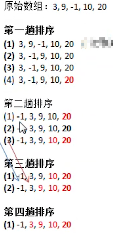

# 冒泡排序

## 基本介绍

冒泡排序（Bubble Sorting）的基本思想：通过对待排序序列 **从前向后**（从下标较小的元素开始），依次比较相邻元素的值，若发现逆序则交换，使值较大的元素逐渐从前移向后部，就像水底下的旗袍一样逐渐向上冒。

优化点：因为排序过程中，个元素不断接近自己的位置，如果一趟比较下来没有进行过交换，就说明序列有序，因此要在排序过程中设置一个标志判断元素是否进行过交换。从而减少不必要的比较。（该优化点可以在完成基本的冒泡排序之后再做）

## 图解冒泡排序算法的过程

```
原始数组：3，9，-1，10，20

第一趟排序：// 如果相邻的元素逆序就交换
1：3，9，-1，10，20	// 比较 3 和 9，不用交换
2：3，9，-1，10，20	// 比较 9 和 -1，交换位置
3：3，-1，9，10，20	// 比较 9 和 10，不用交换
4：3，-1，9，10，20	// 比较 10 和 20，不用交换；而且确定了最大值 20

第二趟排序：// 因为 20 是最大值，其实只需要比较前面 4 个就行了
1：-1，3，9，10，20	// 比较 3 和 -1，进行交换
2：-1，3，9，10，20  // 比较 3 和 9，不用交换
3：-1，3，9，10，20	// 比较 9 和 10，不用交换；确定了本轮最大值 10

第三趟排序：// 因为 10 是上一轮最大值，只需要比较前 3 个
1：-1，3，9，10，20	// 比较 -1 和 3，不用交换
2：-1，3，9，10，20	// 比较 3 和 9 ，不用交换；确定了本轮最大值 9

第四趟排序：// 上一轮最大值为 9，只需要比较前 2 个
1：-1，3，9，10，20	// 比较 -1 和 3，不需要交换，bending本轮最大值 3

比较结束
```

上面的描述分解和下图一致，看下图的红色部分，是每一轮确定的最大值，和当前已经确定的有序序列



冒泡排序小结：

1. 共进行数组大小 -1 次大的循环

2. 每一趟排序的次数在逐渐的减少

3. 如果发现在某趟排序中，没有发生一次交换，则可以提前结束冒泡排序。

   如上图那样，在第二趟的就确定了顺序，在第三趟的时候走完，都没有交换过顺序，就可以提前结束了

## 代码实现

### 演变过程

为了容易理解，先演示冒泡排序的演变过程

```java
    /**
     * 为了更好的理解，这里把冒泡排序的演变过程演示出来
     */
    @Test
    public void processDemo() {
        int arr[] = {3, 9, -1, 10, -2};

        // 第 1 趟排序：将最大的数排在最后
        // 总共排序：arr.length - 1
        int temp = 0; // 临时变量，交换的时候使用
        for (int i = 0; i < arr.length - 1; i++) {
            if (arr[i] > arr[i + 1]) {
                temp = arr[i];
                arr[i] = arr[i + 1];
                arr[i + 1] = temp;
            }
        }
        System.out.println("第 1 趟排序后的数组");
        System.out.println(Arrays.toString(arr));

        // 第 2 趟排序：将第 2 大的数排在倒数第 2 位
        // 总共排序：arr.length - 1 - 1  ；
        // 从头开始排序，其他没有变化，只是将排序次数减少了一次
        for (int i = 0; i < arr.length - 1 -1; i++) {
            if (arr[i] > arr[i + 1]) {
                temp = arr[i];
                arr[i] = arr[i + 1];
                arr[i + 1] = temp;
            }
        }
        System.out.println("第 2 趟排序后的数组");
        System.out.println(Arrays.toString(arr));

        // 第 3 趟排序：将第 3 大的数排在倒数第 3 位
        // 总共排序：arr.length - 1 - 2  ；
        // 从头开始排序，其他没有变化，只是将排序次数减少了 2 次
        for (int i = 0; i < arr.length - 1 -2; i++) {
            if (arr[i] > arr[i + 1]) {
                temp = arr[i];
                arr[i] = arr[i + 1];
                arr[i + 1] = temp;
            }
        }
        System.out.println("第 3 趟排序后的数组");
        System.out.println(Arrays.toString(arr));

        // 第 4 趟排序：将第 4 大的数排在倒数第 4 位
        // 总共排序：arr.length - 1 - 3  ；
        // 从头开始排序，其他没有变化，只是将排序次数减少了 3 次
        for (int i = 0; i < arr.length - 1 -3; i++) {
            if (arr[i] > arr[i + 1]) {
                temp = arr[i];
                arr[i] = arr[i + 1];
                arr[i + 1] = temp;
            }
        }
        System.out.println("第 4 趟排序后的数组");
        System.out.println(Arrays.toString(arr));

        // 第 5 趟没有必要，因为这里有 5 个数字，确定了 4 个数字，剩下的那一个就已经出来了
    }
```

测试输出

```
第 1 趟排序后的数组
[3, -1, 9, -2, 10]
第 2 趟排序后的数组
[-1, 3, -2, 9, 10]
第 3 趟排序后的数组
[-1, -2, 3, 9, 10]
第 4 趟排序后的数组
[-2, -1, 3, 9, 10]
```

从上述的 4 趟排序过程来看，循环体都是一样的，只是每次循环的次数在减少，那么就可以如下演变

```java
@Test
public void processDemo2() {
  int arr[] = {3, 9, -1, 10, -2};

  // 总共排序：arr.length - 1
  int temp = 0; // 临时变量，交换的时候使用
  for (int j = 0; j < arr.length - 1; j++) {
    for (int i = 0; i < arr.length - 1 - j; i++) {
      if (arr[i] > arr[i + 1]) {
        temp = arr[i];
        arr[i] = arr[i + 1];
        arr[i + 1] = temp;
      }
    }
    System.out.println("第 " + (j + 1) + " 趟排序后的数组");
    System.out.println(Arrays.toString(arr));
  }
}
```

测试输出

```
第 1 趟排序后的数组
[3, -1, 9, -2, 10]
第 2 趟排序后的数组
[-1, 3, -2, 9, 10]
第 3 趟排序后的数组
[-1, -2, 3, 9, 10]
第 4 趟排序后的数组
[-2, -1, 3, 9, 10]
```

### 优化

对于优化，减少排序次数

```java
    @Test
    public void processDemo3() {
        int arr[] = {3, 9, -1, 10, 20};

        // 总共排序：arr.length - 1
        int temp = 0; // 临时变量，交换的时候使用
        boolean change = false;
        for (int j = 0; j < arr.length - 1; j++) {
            change = false;
            for (int i = 0; i < arr.length - 1 - j; i++) {
                if (arr[i] > arr[i + 1]) {
                    temp = arr[i];
                    arr[i] = arr[i + 1];
                    arr[i + 1] = temp;
                    change = true;
                }
            }
            if(!change){
                // 如果 1 轮下来，都没有进行排序，则可以提前退出
                break;
            }
            System.out.println("第 " + (j + 1) + " 趟排序后的数组");
            System.out.println(Arrays.toString(arr));
        }
    }
```

测试输出：

```
第 1 趟排序后的数组
[3, -1, 9, 10, 20]
第 2 趟排序后的数组
[-1, 3, 9, 10, 20]
```

这里更改了原始数组，因为优化的点，是概率问题，并不是在任何情况下都可以被优化

### 封装算法

```java
    /**
     * 把排序算法封装成一个方法，方便被复用
     *
     * @param arr
     */
    public static void bubbleSort(int[] arr) {
        // 总共排序：arr.length - 1
        int temp = 0; // 临时变量，交换的时候使用
        boolean change = false;
        for (int j = 0; j < arr.length - 1; j++) {
            change = false;
            for (int i = 0; i < arr.length - 1 - j; i++) {
                if (arr[i] > arr[i + 1]) {
                    temp = arr[i];
                    arr[i] = arr[i + 1];
                    arr[i + 1] = temp;
                    change = true;
                }
            }
            if (!change) {
                // 如果 1 轮下来，都没有进行排序，则可以提前退出
                break;
            }
        }
    }
```

测试调用

```java
    /**
     * 测试封装后的算法
     */
    @Test
    public void bubbleSortTest() {
        int[] arr = {3, 9, -1, 10, 20};
        System.out.println("排序前：" + Arrays.toString(arr));
        bubbleSort(arr);
        System.out.println("排序后：" + Arrays.toString(arr));
    }
```

测试输出

```
排序前：[3, 9, -1, 10, 20]
排序后：[-1, 3, 9, 10, 20]
```

### 大量数据耗时测试

排序随机生成的 8 万个数据

```java
    /**
     * 大量数据排序时间测试
     */
    @Test
    public void bulkDataSort() {
        int max = 80_000;
        int[] arr = new int[max];
        for (int i = 0; i < max; i++) {
            arr[i] = (int) (Math.random() * 80_000);
        }

        Instant startTime = Instant.now();
        bubbleSort(arr);
//        System.out.println(Arrays.toString(arr));
        Instant endTime = Instant.now();
        System.out.println("共耗时：" + Duration.between(startTime, endTime).toMillis() + " 毫秒");
    }
```

测试输出

```
运行几次，差不多在 13 秒左右
共耗时：14656 毫秒
共耗时：13853 毫秒
```

