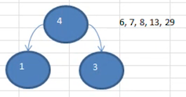
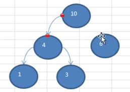

# 赫夫曼树

## 基本介绍

1. 给定 n 个 **权值** 作为 n 个 **叶子节点**，构造一颗二叉树，**若该树的 带权路径长度（WPL）达到最小**，称这样的二叉树为 **最优二叉树**，也称为 **哈夫曼树（Huffman Tree）**，还有的叫 霍夫曼树
2. 赫夫曼树是带全路径长度最短的树，权值较大的节点离根节点较近

## 重要概念

- **路径** 和 **路径长度**：

  在一颗树中，**从一个节点往下可以到达的孩子或孙子节点之间的通路**，称为 **路径**。

  **通路中分支的数目称为路径长度**。若规定根节点的层数为 1，则从根节点到第 L 层节点的路径长度为 L-1

- **节点的权** 及 **带权路径长度**

  若将树中节点赋给一个有着某种函数的数值，则这个数值称为该节点的 **权**。

  节点的带权路径长度为：从根节点到该节点之间的路径长度与该节点的权的乘积。 

- 树的带权路径长度

  **所有叶子节点的带权路径长度之和**，记为 WPL（weighted path length），权值越大的节点离根节点越近的二叉树才是最优二叉树

- WPL 最小的就是赫夫曼树


如上图：

- 权：元素的值

- 路径长度：一个节点到另一个节点的一段路，就叫路径长度
- 带权路径长度：从根节点到 13 有几条路径长度，则是他的带权路径长度
- 树的带权路径长度：（图上的带全路径长度所指的是 树的带全路径长度）


## 创建思路

以数列 `13,7,8,3,29,6,1` 进行讲解。

1. 首先将它进行从小到大进行排序，排序后是：`1,3,6,7,8,13,29`

   其中，每一个数据都是一个节点，每个节点可以看成是一颗最简单的二叉树

2. 取出根节点权值最小的两颗树：`1 和 3`

3. 组成一颗新的二叉树，该二叉树的根节点权值是，这两颗树的权值之和，如下图：

   

4. 再将这颗新的二叉树，以 **根节点的权值大小**，再次排序，并不断重复上述步骤

   

   

如图所示：将剩余未处理的节点，与新的根节点权值进行排序，那么再次取最小的两棵树 `4 和 6`，组成新的根节点 10



一般来说，可以将左节点指向权值较大的，右节点指向权值较小的。以上过程重复处理，直到组成如下图这颗赫夫曼树


## 代码实现

### 推导实现

```java
/**
 * 赫夫曼树实现
 */
public class HuffmanTreeTest {
    /**
     * 首先推导实现
     */
    @Test
    public void processDemo() {
        int[] arr = {13, 7, 8, 3, 29, 6, 1};

        // 1. 为了实现方便，先将每个元素转成 Node 对象，并装入 arrayList 中
        List<Node> nodes = new ArrayList<>();
        for (int i : arr) {
            nodes.add(new Node(i));
        }

        // 2. 从小到大排序
        Collections.sort(nodes);

        // 3. 取出两个较小的树
        Node left = nodes.get(0);
        Node right = nodes.get(1);
        // 4. 构成成新的二叉树
        Node parent = new Node(left.value + right.value);
        parent.left = left;
        parent.right = right;
        // 5. 从 list 中删除已经处理过的二叉树
        nodes.remove(left);
        nodes.remove(right);
        // 6. 将新的二叉树添加到 list 中，为下一轮构建做准备
        nodes.add(parent);

        // 最后来看一下结果
        System.out.println("原始数组：" + Arrays.toString(arr));
        System.out.println("新的节点：" + nodes);
    }
}

/**
 * 节点
 */
class Node implements Comparable<Node> {
    int value; // 权
    Node left;
    Node right;

    public Node(int value) {
        this.value = value;
    }

    /**
     * 为了打印方便
     *
     * @return
     */
    @Override
    public String toString() {
        return value + "";
    }

    /**
     * 从小到大排序
     *
     * @param o
     * @return
     */
    @Override
    public int compareTo(Node o) {
        return this.value - o.value;
    }
}
```

运行结果输出

```
原始数组：[13, 7, 8, 3, 29, 6, 1]
新的节点：[6, 7, 8, 13, 29, 4]
```

可以看到，第一轮的处理之后，的确如我们的创建思路解说一致。

那么创建一颗完整的赫夫曼树的核心代码就在上面，只要对上述步骤进行重复执行，就可以了。

### 完整实现

 ```java
    @Test
    public void createHuffmanTreeTest() {
        int[] arr = {13, 7, 8, 3, 29, 6, 1};
        Node huffmanTree = createHuffmanTree(arr);
      
        // 前序遍历
        huffmanTree.list();
    }

    private Node createHuffmanTree(int[] arr) {
        List<Node> nodes = new ArrayList<>();
        for (int i : arr) {
            nodes.add(new Node(i));
        }

        while (nodes.size() > 1) {
            // 2. 从小到大排序
            Collections.sort(nodes);

            // 3. 取出两个较小的树
            Node left = nodes.get(0);
            Node right = nodes.get(1);
            // 4. 构成成新的二叉树
            Node parent = new Node(left.value + right.value);
            parent.left = left;
            parent.right = right;
            // 5. 从 list 中删除已经处理过的二叉树
            nodes.remove(left);
            nodes.remove(right);
            // 6. 将新的二叉树添加到 list 中，为下一轮构建做准备
            nodes.add(parent);
        }

        // 返回赫夫曼树的 root 节点
        // 因为前面从小到大排序的，最后一个就是最大节点
        return nodes.get(0);
    }
 ```

测试输出，输出的是前序遍历的顺序。

```
67
29
38
15
7
8
23
10
4
1
3
6
13
```


结果和这个是一致的


是不是有一个疑问？给定的数组是 `13,7,8,3,29,6,1`，变成树之后，怎么找回原来的数据？一定要记得赫夫曼树的特点：**它的数据都在叶子节点，父节点是通过叶子节点相加得到的**